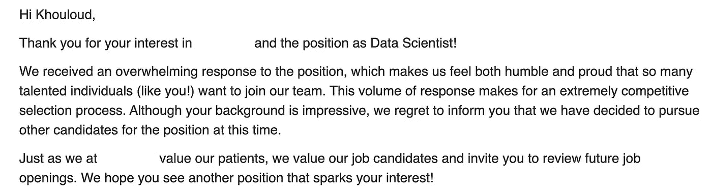
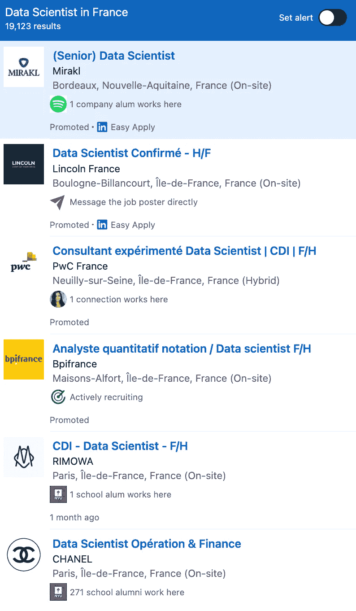

# 破解当前数据科学就业市场：来自科技数据科学家的实用策略

> 原文：[`towardsdatascience.com/how-to-navigate-the-current-data-science-job-market-6924f9b4a407`](https://towardsdatascience.com/how-to-navigate-the-current-data-science-job-market-6924f9b4a407)

## 为什么现在很难找到数据科学相关的工作，以及你可以做些什么

 [Khouloud El Alami](https://medium.com/@elalamik?source=post_page-----6924f9b4a407--------------------------------)

·发表于 [Towards Data Science](https://towardsdatascience.com/?source=post_page-----6924f9b4a407--------------------------------) ·阅读时间 11 分钟·2023 年 7 月 26 日

--

我在 2020 年全球疫情期间毕业，那时就业市场是一个充满敌意的领域。现在我很高兴地在 Spotify 担任数据科学家，但走到这一步的过程是漫长的。

在数据科学的就业市场中导航就像在与狮子和小猫的战场上作战。狮子可能会杀死你，而小猫也很可能会妨碍你。你稍后会明白我这句话的意思。

我记得申请了数百个职位却从未收到过一次面试回电。这让我怀疑自己的能力，但回头看来，大多数失败的原因超出了我的控制范围。

在 2020 年，我收到过数百封这样的邮件，但当时的就业市场完全荒凉。

如果你正在经历类似的情况，也许这篇文章可以帮助你找到应对当前就业市场的最佳方法。

最近几个月，我与多位经验丰富的科技数据科学家和有志于此的人员讨论了当前数据科学招聘市场的状况。

我逐渐明白了：

+   *为什么现在变得难以获得聘用*

+   *如何最大化获得工作的机会*

我将在这篇文章中与您分享这些经验。

# 但首先，请确保订阅我的通讯！

点击下面的链接，我会给你更多**个性化内容和内幕建议**，帮助你成为一名数据科学家！

 [## 加入+1k 读者 💌 跟随我作为数据科学家在科技和 Spotify 的旅程，不要错过！

### 加入+1k 读者 💌 跟随我作为数据科学家在科技和 Spotify 的旅程，不要错过！通过注册，你将...

[medium.com](https://medium.com/@elalamik/subscribe?source=post_page-----6924f9b4a407--------------------------------)

# 工作公式

在当前经济形势下，我越来越多地听到许多数据科学家在找工作时面临的困难。不论是应届毕业生还是来自 MAANG 的被裁员专家，目前大家都在苦苦挣扎。

如果你处于这种情况，请知道你无法找到工作的原因是一个**多层次的问题**。如果你想更好地调整你的努力，将所有机会放在你这边，了解为什么会发生这种情况是*至关重要*的。

> 获得工作机会的机会 = (技能 + 经验) * 市场条件

找工作取决于你的技能、过去的经验，以及最重要的一点：市场条件，这些完全超出了你的控制范围。

目前，求职市场对新加入者并不那么友好。我们都知道经济形势不利，但后续影响是什么？这与你的困境有何关系？

# 经济衰退的后果

我目睹了许多数据科学家，其中一些我个人认识的人，在全球科技市场裁员潮中失去了工作。

这个玩笑——照片由[Annie Spratt](https://unsplash.com/@anniespratt?utm_source=medium&utm_medium=referral)提供，[Unsplash](https://unsplash.com/?utm_source=medium&utm_medium=referral)

这些大规模裁员有 3 个可能影响你目前找工作能力的后续效应，即使这份工作不在科技领域：

1.  *数据专家过剩*

1.  *公司员工数量减少*

1.  *公司成熟度与规模*

# #1\. 市场饱和

多年来，申请数据科学职位的人数过剩。似乎每个人都被“数据科学”这个被誉为本世纪最热门工作的钩子吸引了。

> 这也意味着随着时间的推移，数据科学市场正越来越多地被新加入者所饱和。

过剩来自于：

+   自学的爱好者迎合潮流

+   数据科学课程的应届毕业生

+   从事数据科学工作的技术背景人士，包括博士（通常在科技领域非常受欢迎）

+   从训练营毕业的人或持有数据证书的人

照片由[Marvin Meyer](https://unsplash.com/@marvelous?utm_source=medium&utm_medium=referral)提供，[Unsplash](https://unsplash.com/?utm_source=medium&utm_medium=referral)

这意味着当你申请职位时，你也在与这些人竞争，包括经验丰富的“狮子”和不太合格（或不合格）的“小猫”。这种情况已经存在了一段时间。

> 但*让游戏变得更难的*是*现在*你还要面对一波新被裁员的专家加入这个圈子。

这就像你在游戏中玩*地狱*难度级别一样，尽管你什么也没要求（除了工作）。

## 这也意味着由于两个原因，你被拒绝的机会会**更高**。

**1\. 你正在与被裁员的技术行业精英竞争**。他们有丰富的经验，并且他们可能最终会在过程中超越你。即使你是其中之一，你仍然在和他们竞争。

+   如果*公司规模较大*，这些人可能有更大的机会被录用，而对于经验较少的人来说，获得招聘人员回电的难度会更大。

+   *规模较小的公司*可能无法承担这些专家的高薪和福利。如果你经验较少，瞄准这些公司可能会增加你的机会。

**2\. 大多数公司没有复杂的招聘系统**。其中一些公司因为缺乏筛选大量申请的手段，最终在筛选过程中错过了优秀的候选人。这意味着你的简历有时可能会被忽略。

从人群中脱颖而出成为你的新目标，但我们稍后会详细讨论这一点。

# #2\. 人员编制少

这种经济冲击的第二个下游效应是，现在公司更不愿意招聘人员。由于公司现在有不同的优先级（盈利 > 增长），这意味着：

+   **招聘预算在过程中被削减，所以人员编制有限**。公司仅根据需求招聘，因此招聘过程可能会非常挑剔。

+   **经验丰富的候选人正处于前列**，因为公司能从他们那里获得比更初级员工更多的投资回报。

> 这意味着你要和更多的人竞争更少的职位。

当我在 2020 年申请工作时，公司由于相同的原因——节省成本——而进行裁员。

不幸的是，劳动力市场非常波动，但这也是好消息，因为这意味着情况也可以迅速发生变化。

# #3\. 公司规模

并不是很多公司处于需要数据科学家的阶段。我们通常是在公司积累了足够的数据后，或者当数据成为产品时进入游戏。

> 对于许多科技公司，比如 Netflix，数据就是产品。

他们主要通过分析数据并利用机器学习将其转化为产品来获得大部分价值。

你能想象 Netflix 没有系统推荐符合你口味的娱乐内容吗？数据在这里至关重要，数据科学家也是如此。

不依赖数据来增长和盈利的公司很可能在经济衰退期间会更加谨慎地考虑是否雇佣数据科学家。大多数数据科学家变成了奢侈品。不是每个人都能负担得起我们。

# 你能做些什么？

如果你想继续参与游戏，你需要稍微调整规则。

由于竞争激烈，你的工作是尽力在众人中脱颖而出。我做的一些事情帮助我和其他数据科学家在游戏中提升水平，包括：

1.  个人品牌

1.  正确的网络拓展方式

1.  专业化

1.  海外申请

# #1\. 个人品牌

确保你的 LinkedIn 页面整洁。任何能帮助你看起来很有吸引力的内容都应该在上面。

照片由 [Greg Bulla](https://unsplash.com/@gregbulla?utm_source=medium&utm_medium=referral) 贡献，来源于 [Unsplash](https://unsplash.com/?utm_source=medium&utm_medium=referral)

接下来是你的简历。如果你经验很少或者没有经验，那么你需要将你的项目放在最前面。如果你做的数据科学项目不多，那么你没有收到回电也就不足为奇了。回去学习吧！

## 你可以做的一些事情：

+   **精心制作你的简历。** 当然，你不能将简历适应到每家公司。我曾申请过一个需要一些聚类技术知识的职位，因此我确保突出了我做过聚类的项目。因此，你应该做的是：

    — 选择 3-5 个你真正感兴趣且你也符合条件的职位。

    — 研究这家公司当前员工在类似岗位上的技能，并识别你与他们共享的技能，这些技能也出现在职位申请中。

    — 在你的简历上突出那些特定的技能，以及你个人资料中与公司价值观一致的其他任何内容。

+   **创建和优化你的作品集。** 它可以是一个网站或在 GitHub 上。重要的是展示你能做什么。确保在你的简历上包含到你的作品集的链接！

+   **突出展示你运用了商业洞察力的项目。** 大多数科技公司聘请数据科学家是为了帮助他们进一步实现商业目标。因此，你需要展示你能够在商业背景下理解数据。

我被 Spotify 聘用的主要原因之一（至少我是这么被告知的）是因为我有商业背景和数据科学技能组合。最好的数据科学家是能够将两者结合起来的人，所以展示你可以做到这一点（如果你能的话）！

事实上，[我编写了一篇逐步指南，帮助你设计一个成功的数据科学工作简历。](https://medium.com/towards-data-science/dissecting-the-resume-that-got-me-my-data-scientist-job-in-tech-db4b4d943228) 在这篇文章中，我详细分析了让我在 Spotify 获得工作的简历。不要错过！

# 2\. 正确的网络拓展方式

图片来源：作者（Midjourney）

利用你的网络来获得入门机会。我通过网站申请进入 Spotify，这是传统方式。但如果你想提高获得回复的机会，我建议你发挥你的网络作用。这就是我在同一阶段被拒绝后如何获得 Ubisoft 实习机会的方式。

这并不是意味着联系随机的人并请求他们提供推荐。

当有人把你推荐给一家公司时，他们承诺他们推荐的是他们信任的人，是他们知道能够带来积极贡献的人。陌生人不会认识你，因此他们很可能不会回复你的推荐请求。

> **这意味着你能做的最好的事情** 是尝试与已经在你网络中的人建立联系。

最终，你可以依靠的有可能是你曾就读的大学的校友、招聘经理、以前的同事，甚至是朋友或朋友的朋友，但不是你朋友的狗。

> 重要的是与你可以利用的人建立某种良好的联系。

这并不意味着他们会推荐你，但至少你可能会有机会向他们展示你的能力。这也不意味着你一定能获得这份工作，但至少它可能会让你的简历受到关注，而不是在没有机会的情况下被筛选掉。

[我写了一整篇文章，讲述了如何通过建立人脉获得了技术领域的顶级机会，以及你需要遵循的 6 个步骤以在拥挤的数据职位市场中脱颖而出。](https://medium.com/towards-data-science/stop-being-bad-at-networking-6-must-do-steps-to-stand-out-in-a-crowded-data-science-job-market-cec48aa847be) 一定要去看看！

# 3\. 专业化！

人工智能在各地蓬勃发展，数据职位市场也因此最近增长迅猛，最终分裂成了不同的分支：

+   **数据专家：** 数据科学家、数据分析师、数据工程师、机器学习工程师、研究科学家

+   **人工智能专家：** 自然语言处理科学家、云计算工程师、计算机视觉科学家、大型语言模型科学家、稳定扩散专家等……

而且这种疯狂的情况只会与日俱增。跟上潮流很困难，但知道要选择哪个潮流可以让你免于溺水。

图片由作者提供（Midjourney）

> 与所有人交谈就是与任何人交谈

如果你的技能范围已经过于广泛以至于不适合数据市场，那么将技能集中在特定领域可能会提高你的机会。这样，你可能会在与更少的人竞争时变得更具吸引力。

# 4\. 在美国以外申请

数据科学家在美国以外的地方也有发展机会。我这样说是因为许多科技公司总部设在那里，因此在求职市场上挣扎的很多人也在那里。我知道，因为我曾经也是其中之一。

如果美国的招聘放缓了，要知道在世界其他地方招聘并没有完全停止。

在像我所在的法国这样的国家，高质量的数据科学家并不多见，所以如果你没有被限制在特定国家，我建议你拓宽视野，去其他地方看看。

由于美国的数据科学职位市场竞争激烈，搬到法国证明是一个战略性决定，帮助我在 Spotify 获得了梦想中的工作。

在法国，仅数据科学领域目前就有将近 2 万个职位空缺（参见下图），我相信在许多其他国家也是如此。

当然，我理解有些人由于各种原因无法搬到国外。但我们生活在一个后疫情时代，远程工作越来越成为常态。

如果你不能搬到国外，你可以尝试申请其他国家的职位，无论你是否住在美国或其他地方。

我住在巴黎，但我的大部分团队成员分布在欧洲各地。分布式工作正越来越多地使有才华和勤奋的人能找到超越国界的机会。你考虑尝试一下吗？

# 总结

## **为什么今天很难找到数据相关的工作？**

经济衰退对就业市场造成了 3 个下游影响：

1.  数据工作市场中**应聘者的过度饱和**

1.  **招聘有限**，由于公司更注重盈利而非增长，导致职位竞争加剧。

1.  **那些不依赖数据**来开展业务的公司可能在经济衰退期间会犹豫是否雇佣数据科学家。

## **你可以做些什么？**

1.  **个人品牌。** 确保你的个人资料呈现得体，并通过相关项目优化你的作品集，展示你的商业技能。

1.  **正确网络化。** 利用你的网络来提高被关注的机会。

1.  **专业化。** 将你的技能集中在一个特定领域，以便脱颖而出。

1.  **申请美国以外的职位。** 考虑在其他对数据科学家需求增长的国家（包括远程工作）的机会。

当然，这些不是奇迹解决方案。目标是帮助你优化求职方法，提高你的机会。愿好运与你同在！

# 我有礼物送给你🎁！

订阅我的 [**通讯**](https://levelupwithk.substack.com/) **K’s DataLadder**，你将自动获得我的**终极 SQL 备忘单**，其中包含我在大型科技公司工作中每天使用的所有查询+另一个秘密礼物！

我每周分享作为科技领域数据科学家的经历，以及实用的技巧、技能和故事，帮助你提升自己——因为没有人真正知道，直到他们亲身经历！

## 如果你还没有这样做的话

+   订阅我的[**YouTube**](https://rebrand.ly/tdf62uv)频道。新视频很快就会发布！

+   关注我的[**Instagram**](https://www.instagram.com/elalamikhouloud/)、[**LinkedIn**](https://www.linkedin.com/in/elalamik/)、[**X**](https://twitter.com/elalamik)，选择你喜欢的平台

不久后见！
