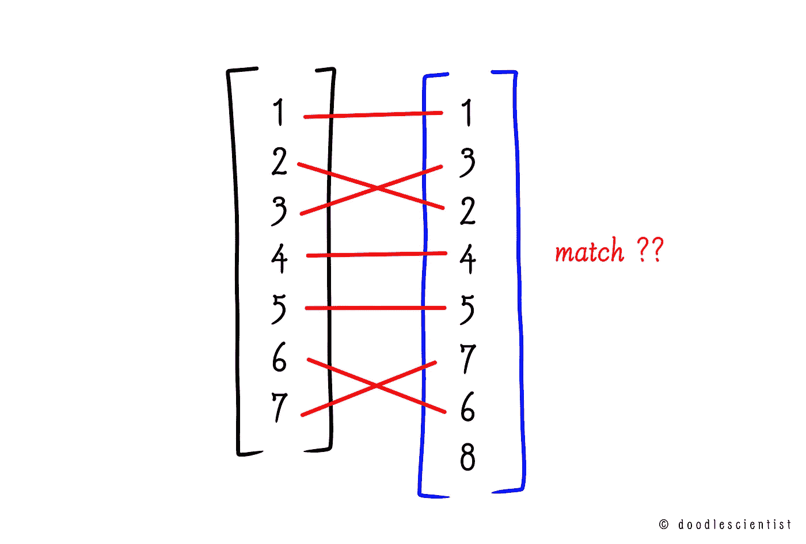
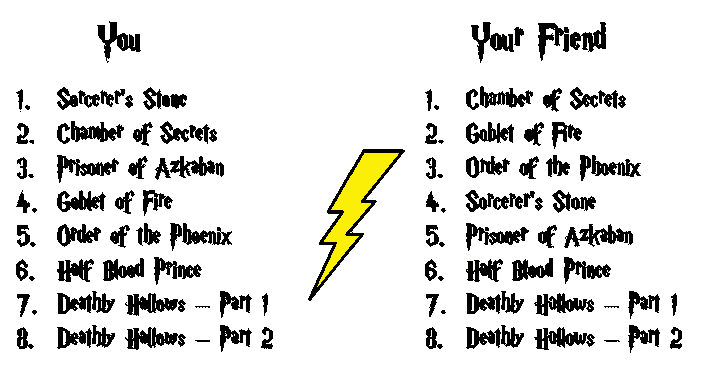

# 如何在 Python 中客观地比较两个排名列表

> 原文：[`towardsdatascience.com/how-to-objectively-compare-two-ranked-lists-in-python-b3d74e236f6a?source=collection_archive---------6-----------------------#2023-01-05`](https://towardsdatascience.com/how-to-objectively-compare-two-ranked-lists-in-python-b3d74e236f6a?source=collection_archive---------6-----------------------#2023-01-05)

## Rank Biased Overlap 的简化解释和实现

 [Krupesh](https://krupesh-raikar.medium.com/?source=post_page-----b3d74e236f6a--------------------------------)

·

[Follow](https://medium.com/m/signin?actionUrl=https%3A%2F%2Fmedium.com%2F_%2Fsubscribe%2Fuser%2F56234ae495ea&operation=register&redirect=https%3A%2F%2Ftowardsdatascience.com%2Fhow-to-objectively-compare-two-ranked-lists-in-python-b3d74e236f6a&user=Krupesh&userId=56234ae495ea&source=post_page-56234ae495ea----b3d74e236f6a---------------------post_header-----------) 发表在 [Towards Data Science](https://towardsdatascience.com/?source=post_page-----b3d74e236f6a--------------------------------) · 10 分钟阅读 · 2023 年 1 月 5 日

--

**假设你和你的朋友都看过所有 8 部《哈利·波特》电影。**

*但有一个问题*——你每一部电影都是在上映当天观看的，没有错过一次首映。

但你的朋友则是先看了第二部电影，然后是第四和第五部，最后在 Netflix 上连续观看了剩下的电影。

从理论上讲，你和你的朋友在同一起跑线上——你们都看过系列中的所有电影。

***这真的公平吗？***

图片由作者使用商业可用字体([Harry P](https://fontswan.com/harry-potter-font/#4-caslon-antique))创建，并且使用了来自[Wikimedia](https://commons.wikimedia.org/wiki/File:Harry_Potter_Lightning.svg)的 CC 图片

作为真正的粉丝，你绝不能认为它是平等的。

怎么可能有人不看那部系列书的电影，**按顺序？**

***你认为这是亵渎！***

好消息是——**数学对你有利。** *你可以将这个问题简化为排名列表比较。*

比较列表有几种方法。

在这篇文章中，你将：

+   了解我们为什么……
