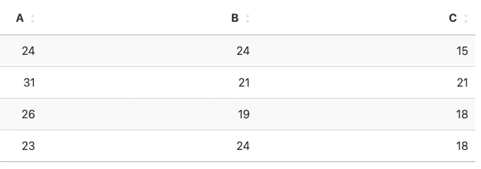
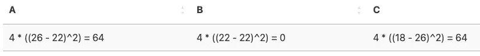
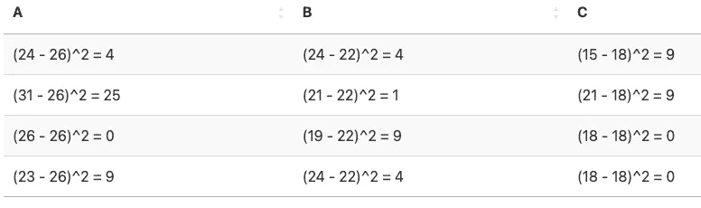
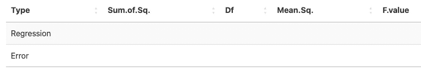
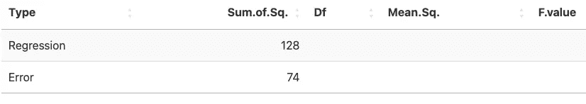
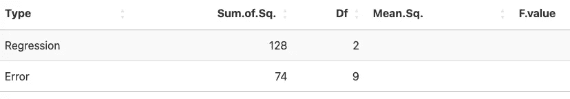
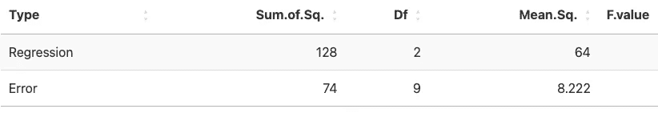
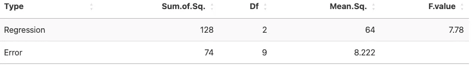
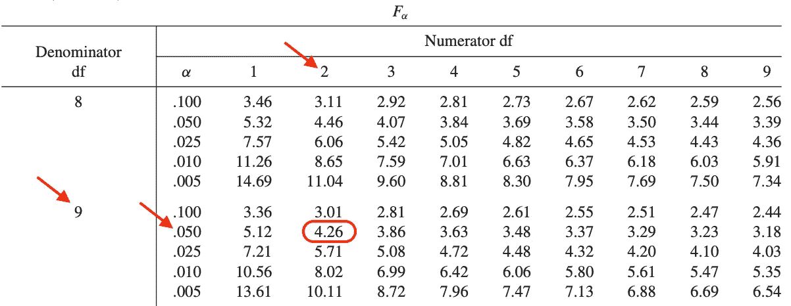

# 操作指南：手动进行单因素 ANOVA

> 原文：[`towardsdatascience.com/how-to-one-way-anova-by-hand-4c19e2a61a8c`](https://towardsdatascience.com/how-to-one-way-anova-by-hand-4c19e2a61a8c)

## 学习如何手动进行单因素方差分析（ANOVA），以比较三个或更多组之间的定量测量

[](https://antoinesoetewey.medium.com/?source=post_page-----4c19e2a61a8c--------------------------------)[](https://towardsdatascience.com/?source=post_page-----4c19e2a61a8c--------------------------------) [Antoine Soetewey](https://antoinesoetewey.medium.com/?source=post_page-----4c19e2a61a8c--------------------------------)

·发表于[Towards Data Science](https://towardsdatascience.com/?source=post_page-----4c19e2a61a8c--------------------------------) ·阅读时间 6 分钟·2023 年 8 月 30 日

--


图片由[Rohan Makhecha](https://unsplash.com/@rohanmakhecha?utm_source=medium&utm_medium=referral)提供

# 介绍

ANOVA 是一种统计检验，用于比较[定量变量](https://statsandr.com/blog/variable-types-and-examples/#quantitative)在各组之间，以确定几个总体均值之间是否存在统计学显著差异。在实际操作中，它通常用于比较三组或更多组。然而，从理论上讲，它也可以仅用于两个组。[1](https://statsandr.com/blog/how-to-one-way-anova-by-hand/#fn1)

在之前的一篇文章中，我们展示了如何在 R 中进行[单因素 ANOVA](https://statsandr.com/blog/anova-in-r/)。在本文中，我们演示了如何通过手动方式进行单因素 ANOVA，通常称为“ANOVA 表”。

# 数据和假设

为了说明该方法，假设我们抽取一个包含 12 名学生的[样本](https://statsandr.com/blog/what-is-the-difference-between-population-and-sample/)，这些学生平均分为三班（A、B 和 C），并观察他们的年龄。以下是样本：



作者提供的表格

我们有兴趣比较各班级之间的[总体](https://statsandr.com/blog/what-is-the-difference-between-population-and-sample/)均值。

请记住，ANOVA 的原假设是所有均值相等（即，各班级之间的年龄没有显著差异），而备择假设是至少有一个均值与其他两个不同（即，至少有一个班级的年龄与其他两个班级有显著差异）。正式来说，我们有：

+   μA = μB = μC

+   至少一个均值不同

# 手动进行 ANOVA

如上所述，我们将进行一个 ANOVA 表以得出测试结论。

请注意，ANOVA 需要一些假设（即独立性、方差齐性和正态性）。本文的目的是演示如何手动进行 ANOVA，而不是验证这些假设，因此我们假设这些假设已满足而未进行验证。如果你有兴趣，查看如何[在 R 中测试这些假设](https://statsandr.com/blog/anova-in-r/#underlying-assumptions-of-anova)。

# 整体和组均值

我们首先需要计算[均值](https://statsandr.com/blog/descriptive-statistics-by-hand/#mean)年龄（称为组均值）：

+   类别 A: (24+31+26+23) / 4 = 26

+   类别 B: (24+21+19+24) / 4 = 22

+   类别 C: (15+21+18+18) / 4 = 18

整体样本的平均年龄（称为总体平均值）：

(24+31+26+23+24+21+1912+24+15+21+18+18) / 12 = 22

# SSR 和 SSE

然后我们需要计算回归平方和（SSR）和误差平方和（SSE）。

SSR 通过将组均值与总体均值之间的差异平方，然后乘以该组的观察数来计算：



作者提供的表格

然后将所有单元格的总和：

64+0+64 = 128 = SSR

SSE 通过将每个观察值与其组均值之间的差异平方来计算：



作者提供的表格

然后将所有单元格的总和：

4+25+0+9+4+1+9+4+9+9+0+0 = 74 = SSE

对于那些有兴趣计算总平方和（SST）的人，它只是 SSR 和 SSE 的总和，即：

SST = SSR + SSE = 128 + 74 = 202

# ANOVA 表

ANOVA 表如下（我们将其留空，并将逐步填写）：



作者提供的表格

我们开始构建 ANOVA 表，将上面找到的 SSR 和 SSE 值插入表格（在“Sum.of.Sq.”列中）：



作者提供的表格

“Df”列对应自由度，计算方法如下：

+   对于线性回归：组数-1 = 3–1 = 2

+   对于线性误差：观察数-组数 = 12–3 = 9

有了这些信息，ANOVA 表变为：



作者提供的表格

“Mean.Sq.”列对应均方，等于平方和除以自由度，即“Sum.of.Sq.”列除以“Df”列：



作者提供的表格

最后，F 值对应于两个均方之间的比率，即 64 / 8.222 = 7.78：



作者提供的表格

这个 F 值给出了检验统计量（也称为 Fobs），需要与 Fisher 表中的临界值进行比较以得出结论。

我们根据自由度（ANOVA 表中使用的自由度）和显著性水平在 Fisher 表中找到临界值。假设我们取显著性水平α = 0.05，则可以在 Fisher 表中找到临界值如下：



作者提供的表格

所以我们有

F(2;9;0.05) = 4.26

如果你有兴趣用 R 找到这个值，可以使用`qf()`函数，其中 0.95 对应于 1−α：

```py
qf(0.95, 2, 9)
```

```py
## [1] 4.256495
```

# 检验结论

拒绝规则说，如果：

+   Fobs > F(2;9;0.05) ⇒ 我们拒绝原假设

+   Fobs ≤ F(2;9;0.05) ⇒ 我们*不*拒绝原假设

在我们的案例中，

Fobs = 7.78 > F(2;9;0.05) = 4.26

⇒ 我们拒绝原假设，即所有均值相等。换句话说，这意味着至少有一个类别在年龄上与其他两个类别不同。[2](https://statsandr.com/blog/how-to-one-way-anova-by-hand/#fn2)

为了验证我们的结果，这里是使用 R 进行的 ANOVA 表：

```py
##             Df Sum Sq Mean Sq F value Pr(>F)  
## class        2    128   64.00   7.784 0.0109 *
## Residuals    9     74    8.22                 
## ---
## Signif. codes:  0 '***' 0.001 '**' 0.01 '*' 0.05 '.' 0.1 ' ' 1
```

我们手动得出了相同的结果，但请注意，在 R 中，是计算 p 值而不是将 Fobs 与临界值进行比较。p 值可以根据 Fobs 和自由度在 R 中轻松找到：

```py
pf(7.78, 2, 9,
  lower.tail = FALSE
)
```

```py
## [1] 0.010916
```

# 结论

感谢阅读。

我希望这篇文章帮助你手动进行单因素 ANOVA。如果你想学习如何在 R 中进行，请查看这个[教程](https://statsandr.com/blog/anova-in-r/)。

一如既往，如果你对本文所讨论的主题有任何问题或建议，请在评论中添加，以便其他读者可以从讨论中受益。

1.  在这种情况下，[Student’s t 检验](https://statsandr.com/blog/student-s-t-test-in-r-and-by-hand-how-to-compare-two-groups-under-different-scenarios/) 通常比 ANOVA 更受欢迎，尽管两种检验都会得出完全相同的结论。[↩︎](https://statsandr.com/blog/how-to-one-way-anova-by-hand/#fnref1)

1.  记住，ANOVA 不能告诉你哪个组在定量因变量上与其他组不同，也不能告诉你它们是否都不同或只有一个不同。要回答这个问题，需要进行事后检验。这超出了本文的范围，但可以在 R 中轻松完成（参见这个[教程](https://statsandr.com/blog/anova-in-r/)）。[↩︎](https://statsandr.com/blog/how-to-one-way-anova-by-hand/#fnref2)

# 相关文章

+   [R 中的单样本 Wilcoxon 检验](https://statsandr.com/blog/one-sample-wilcoxon-test-in-r/)

+   [手动假设检验](https://statsandr.com/blog/hypothesis-test-by-hand/)

+   [R 中的 ANOVA](https://statsandr.com/blog/anova-in-r/)

+   [R 中的相关系数和相关性检验](https://statsandr.com/blog/correlation-coefficient-and-correlation-test-in-r/)

+   [单比例和卡方拟合优度检验](https://statsandr.com/blog/one-proportion-and-goodness-of-fit-test-in-r-and-by-hand/)

*最初发布于* [*https://statsandr.com*](https://statsandr.com/blog/how-to-one-way-anova-by-hand/) *于 2023 年 8 月 30 日。*
