# 如何优化你的营销预算

> 原文：[`towardsdatascience.com/how-to-optimize-your-marketing-budget-63707c18ba36`](https://towardsdatascience.com/how-to-optimize-your-marketing-budget-63707c18ba36)

## [营销分析](https://medium.com/tag/marketing-analytics)

## 是时候收获你辛苦的营销组合模型训练成果了！

[](https://dr-robert-kuebler.medium.com/?source=post_page-----63707c18ba36--------------------------------)[](https://towardsdatascience.com/?source=post_page-----63707c18ba36--------------------------------) [Dr. Robert Kübler](https://dr-robert-kuebler.medium.com/?source=post_page-----63707c18ba36--------------------------------)

·发表于 [Towards Data Science](https://towardsdatascience.com/?source=post_page-----63707c18ba36--------------------------------) ·阅读时间 11 分钟 ·2023 年 7 月 3 日

--


图片由 DALL-E 创建。

营销组合模型是理解不同营销渠道对销售影响的强大工具。通过构建营销组合模型，营销人员可以量化每个渠道对整体销售的贡献，然后利用这些信息来优化预算分配。

到目前为止，我已经写了一整系列关于 [**构建** 营销组合模型](https://kuebler.ai/list/marketing-mix-modeling-cc3268801754) 的文章，但我仍欠你一篇关于如何使用这些模型来优化媒体支出的文章。今天是你的幸运日，因为在这篇文章中，我将展示如何做到这一点！

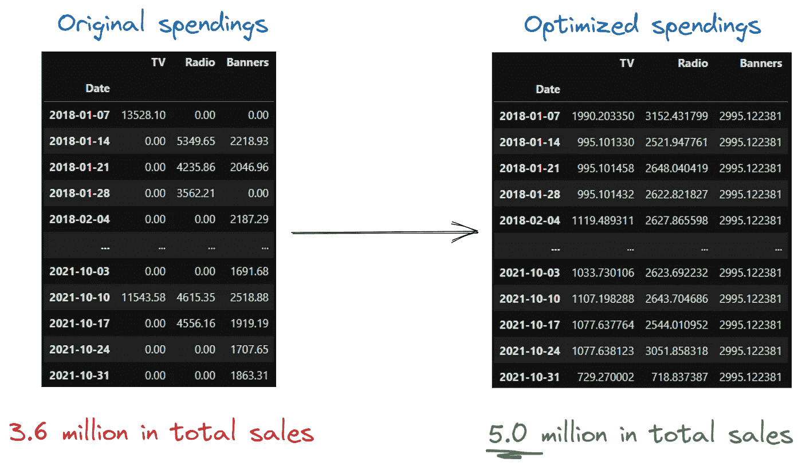

图片由作者提供。

如果你对营销组合建模不熟悉，可以从我的介绍文章开始：

[](/introduction-to-marketing-mix-modeling-in-python-d0dd81f4e794?source=post_page-----63707c18ba36--------------------------------) ## Python 中的营销组合建模简介

### 哪些广告支出真正推动了你的销售？

towardsdatascience.com

# 前提条件

在我们可以优化任何东西之前，我们必须先构建一个模型。我们将非常快速地完成这个过程，以便尽快进入本文的主要部分。

## 数据

首先，让我们加载一些数据。我将使用与我旧文章中相同的数据集。

```py
import pandas as pd
from sklearn.model_selection import cross_val_score, TimeSeriesSplit

data = pd.read_csv(
    'https://raw.githubusercontent.com/Garve/datasets/4576d323bf2b66c906d5130d686245ad205505cf/mmm.csv',
    parse_dates=['Date'],
    index_col='Date'
)

X = data.drop(columns=['Sales'])
y = data['Sales']
```

数据集如下所示：

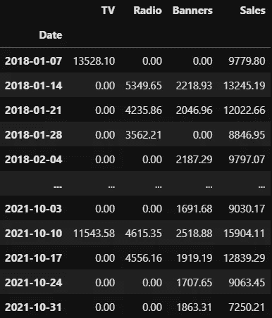

图片由作者提供。

这个表格的逻辑如下：假设你在一家销售某种产品的公司工作。你可以在“**销售**”列中看到该产品的每周销售情况。为了提升这些销售，你在广告上花了一些钱，在我们的例子中包括 **电视**、**广播** 和 **横幅** 广告。我们现在想通过广告支出和更多的*控制变量*来建模销售情况，例如工作日、月份、产品价格、天气等。

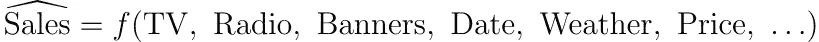

作者提供的图片。

## 模型

建立复杂的模型，如 XGBoost 或深度神经网络，难以解释和优化。我们转向一种经过验证的方法，该方法使用可解释的滞后效应和饱和度效应来建立广义加性模型，如这里所做的：


作者提供的图片。

滞后效应和饱和度模块是直观的特征转换：

+   **滞后效应**模型表示某个时间 *t* 的媒体支出可能仍然会影响时间 *t* + 1、*t* + 2 等的销售，或反之，即在时间 *t* 观察到的销售也受到时间 *t* - 1、*t* - 2 等的支出的影响。

+   **饱和度** 模型显示收益递减的效应，例如，将你在一个渠道的支出从 0 欧元增加到 100,000 欧元会有很大的影响，但将支出从 1,000,000,000 增加到 1,000,100,000 就不会有太大影响了。

> ***注意：*** *在图示中，控制变量被省略了。这是可以的，因为我们不需要它们来进行优化——我们无法像投入到媒体渠道中的资金那样改变它们。我们* ***可以*** *改变的唯一控制变量是价格，但在这里我们假设价格是常量，我们只希望优化我们的媒体支出。*

所以，模型的形式是

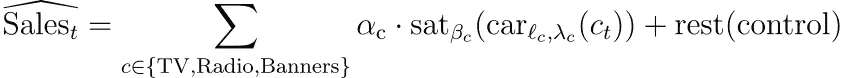

作者提供的图片。

对于一些尚未定义的函数 **饱和度** 和 **滞后效应**。举个例子，假设

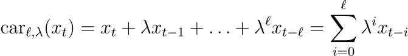

作者提供的图片。

和

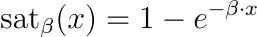

作者提供的图片。

*β* 是饱和度系数，*λ* 是滞后效应强度，*ℓ* 是滞后效应长度。

我们可以通过将这些参数视为超参数，或者通过使用贝叶斯方法并将其视为常规的可学习参数来学习这些参数。在我之前关于营销组合建模的所有文章中，我们详细介绍了如何获得这些参数，因此在此我将不再深入探讨。

相反，假设我们现在有了这些数字，并希望用它们来创建一个优化的媒体预算分配计划。

# 媒体预算优化

假设我们之前的营销组合建模尝试给我们留下了以下参数：

```py
N = 200 # number of observations

# previous marketing mix modeling has given us these parameters
tv_coef = 10000       # α
tv_lags = 4           # ℓ
tv_carryover = 0.5    # λ
tv_saturation = 0.002 # β

radio_coef = 8000
radio_lags = 2
radio_carryover = 0.2
radio_saturation = 0.0001

banners_coef = 14000
banners_lags = 0
banners_carryover = 0.2
banners_saturation = 0.001
```

我们现在将使用 numpy 在 Python 中重新构建营销组合模型。

> 为什么？我们已经使用了 scikit-learn 或 PyMC 构建了模型！难道不能重用这些模型吗？

好问题！我们*可以*使用我们预训练的模型，并将其交给一个通用优化算法，试图找到最大化销售的媒体支出输入。然而，这被称为**黑箱优化**，它的问题在于容易陷入局部最优而不是找到全局最优解。

黑箱优化的另一个问题是算法通常有各种参数，你需要调整这些参数来找到一个好的（但可能不是最优的）解决方案。这就是为什么有些人说这种优化更像是一门艺术，而不是科学。

## 凸性来拯救

如果我们能将问题表述为**凸优化问题**，我们可以使用诸如[cvxpy](https://www.cvxpy.org/)之类的库来解决，它们**保证**能找到最佳的媒体预算分配。我已经在[这里](https://medium.com/towards-data-science/introduction-to-linear-programming-b6647d20d5f6)使用了这个库来解决另一个优化问题。

为了使用凸优化方法，我们的模型必须是凸的**或凹的**，这意味着在模型前面加上负号使其成为凸的。

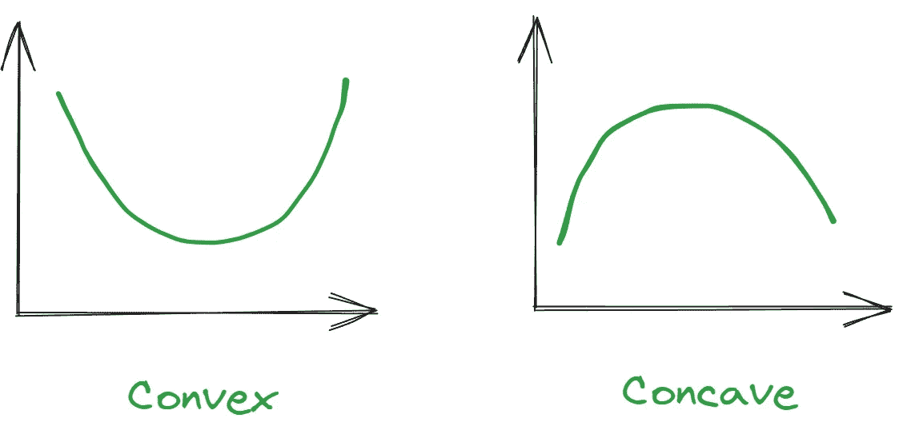

图片由作者提供。

例如，如果我们的模型是*y* = *x*²，它将是一个容易最小化的凹函数。*y* = 100 - *x*²将是一个容易最大化的凹模型。

我不会进一步详细说明；只需知道**我们的模型实际上是一个凹函数**！在我们创建的模型过渡饱和模型中，如果饱和函数的二阶导数为负，那么模型就是凹的。

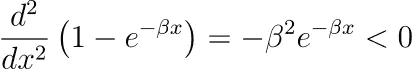

图片由作者提供。

然而，如果我们使用其他饱和函数，如 Adbudg 或其他典型的 S 型函数，它们可能既不是凹的也不是凸的，这使得优化变得更加困难。

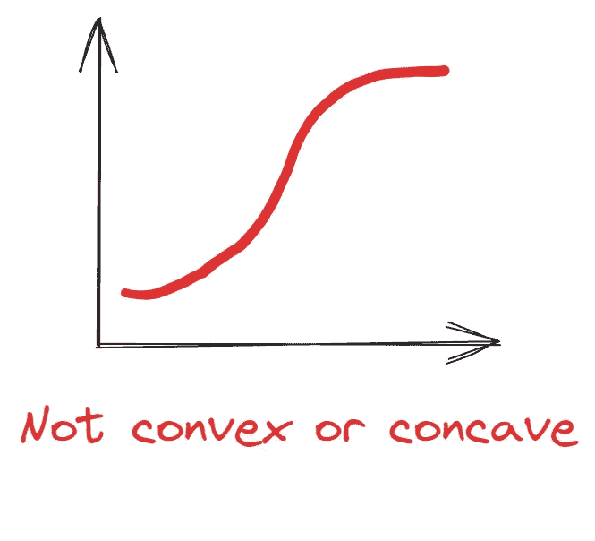

图片由作者提供。

好的，理论说够了。现在只需记住，我们的模型是**凹的**，这很好，因为这样我们可以找到全局最优解，即能够带来最大销售额的预算分配。

## 在 Numpy 中重新实现我们的模型

首先，让我们定义一些处理过渡效应的矩阵。

```py
import numpy as np

tv_carryover_matrix = sum([np.diag(tv_carryover**i*np.ones(N-i), k=-i) for i in range(tv_lags)])
radio_carryover_matrix = sum([np.diag(radio_carryover**i*np.ones(N-i), k=-i) for i in range(radio_lags)])
banners_carryover_matrix = np.eye(N)
```

我知道这很难理解，所以让我们看看这些矩阵中的一个。

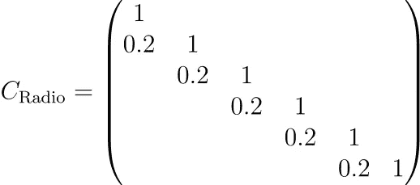

图片由作者提供。

这实现了一个强度为 0.2、长度为 1 的过渡效果。如果将这个矩阵与支出向量相乘，你可以看到这一点。

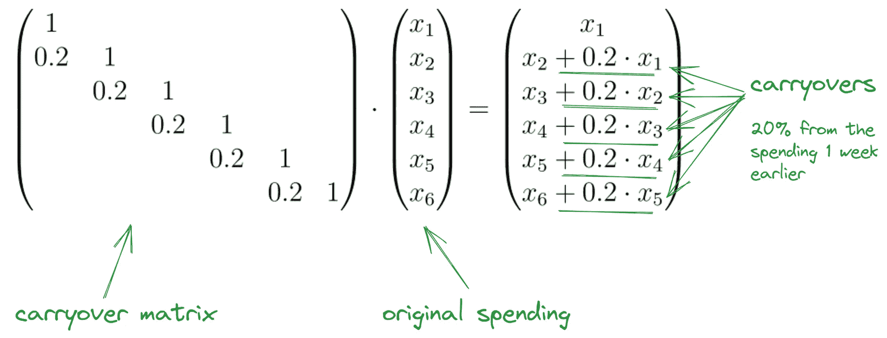

图片由作者提供。

处理完这些之后，让我们继续谈谈饱和度。这只是一个涉及`exp`的简单公式，所以没问题。

我们可以写：

```py
sales = (
    tv_coef * np.sum(1 - np.exp(-tv_saturation * tv_carryover_matrix @ data["TV"])) 
    + radio_coef * np.sum(1 - np.exp(-radio_saturation * radio_carryover_matrix @ data["Radio"])) 
    + banners_coef * np.sum(1 - np.exp(-banners_saturation * banners_carryover_matrix @ data["Banners"]))
)
```

这给出了**来自我们的营销活动**的销售总额，因为我们在这里忽略了控制变量。这个数字是 3,584,648.73 €，我们现在想通过改变我们的媒体支出将其增加！剧透：事实证明，我们可以**将这个数字增加约 150 万，达到 5,054,070.21 €**。哇！仅仅调整一些数字就能得到这样的结果，真不错。

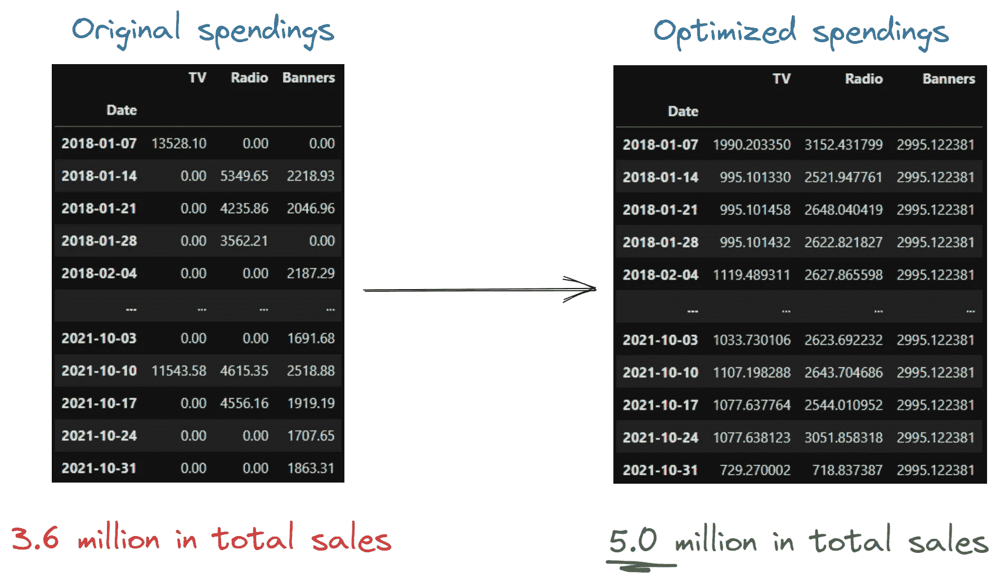

图片由作者提供。

## 关于结果

你还可以看到一个有趣的模式。

> 看起来，均等分配预算是最佳选择。

只有第一期的支出稍高，但随后会有所平衡。这是因为我们的模型的工作原理：在第一期，没有广告存量，因此我们必须多投资一些来推动销售。自第二期开始，我们只需在模型中投入足够的金额来保持广告存量高，但又不能过高以免饱和。在最后一期，广告存量不再重要，因为时间到那里结束，就模型而言。因此，优化预算在那里较低。

## 在 CVXPY 中重新实现我们的模型

好了，现在我们准备使用 cvxpy 得到那个最佳解。首先，我们定义变量，在我们的案例中，每个渠道和每个时间步长一个，因此总共有 3**N* = 3*200 = 600 个变量。

如果没有其他因素，最优解将是将所有变量设为无穷大，因此我们需要一些约束。变量应该都是

1.  非负的，以及

1.  我们希望这 600 个变量的总和小于或等于我们历史上支出的金额。

然后，我们希望优化使用 numpy 函数实现的模型，但使用其 cvxpy 等效函数，这通常意味着编写`cp`而不是`np`。我们甚至可以重用之前的 carryover 矩阵！

```py
import cvxpy as cp

original_total_spends = data[["TV", "Radio", "Banners"]].sum().sum()

# declaring variables to be optimized, N=200 per channel
tv = cp.Variable(N)
radio = cp.Variable(N)
banners = cp.Variable(N)

# the constraints, positive spends and a bounded total budget
constraints = [
    tv >= 0,
    radio >= 0,
    banners >= 0,
    cp.sum(tv + radio + banners) <= original_total_spends,
]

# cvxpy formulation, the model looks like the numpy version
problem = cp.Problem(
    cp.Maximize(
        tv_coef * cp.sum(1 - cp.exp(-tv_saturation * tv_carryover_matrix @ tv)) \
        + radio_coef * cp.sum(1 - cp.exp(-radio_saturation * radio_carryover_matrix @ radio)) \
        + banners_coef * cp.sum(1 - cp.exp(-banners_saturation * banners_carryover_matrix @ banners))
    ), # like the numpy model, sum of all sales
    constraints
)
```

我们现在可以在**非常短的时间**内解决这个最大化问题

```py
problem.solve()

# Output:
# 5054070.207463957
```

太好了！我们可以通过`tv.value, radio.value, banners.value`获得最佳预算。你可以看到每个渠道的支出在每周都保持相对稳定，这可能没有预期的那么有趣。但最佳就是最佳，所以我们接受它。

> 我们本来可以在过去获得 500 万，而不是 360 万。虽然知道这一点很不错，但现在已经没有价值，可能还会让业务感到不快。不过，我们当然可以利用这个逻辑来优化未来的营销支出！

## 进一步的约束

就这样，你现在拥有一个基本的预算优化工具！好的一部分是，你可以建模更多可能来自业务的约束。例如，业务可能会说广播总支出相当高：

```py
sum(radio.value)

# Output: 
# 524290.3686626207 (= 524,290.37 €)
```

业务希望其低于 300,000 €，出于模型无法知晓的战略原因。好的，没问题，让我们将其加入约束集！

```py
constraints = [
    tv >= 0,
    radio >= 0,
    banners >= 0,
    cp.sum(tv + radio + banners) <= original_total_spends,
    cp.sum(radio) <= 300000 # new constraint
]
```

就这么简单。我们可以让优化再次运行，最终得到略微减少的优化销售额为 4,990,178.80 €。但如果我们现在检查广播支出的总和

```py
sum(radio.value)

# Output: 
# 299999.9992275703
```

我们可以看到商业约束得到了尊重。我们还可以添加更多的约束，比如

+   两个频道的总和应该小于或大于某个数字，或者

+   在某些周，我们不允许任何媒体支出。

你只需使用一些总和和等式或不等式来建模即可。

# 结论

在这篇文章中，我们首先回顾了市场营销混合模型的公式。这一点很重要，因为我们需要重新实现这些模型。幸运的是，由于我们的模型简单且易于解释，这完全不是问题。

我们的模型实际上还有另一个很棒的属性：它是凹的！在这种情况下，销售的最大值是唯一确定的，我们可以通过凸优化来获得它。优化非凸或非凹函数一般是困难的，更像是一种艺术，涉及到调整许多超参数，这就是为什么我们没有选择这种方法。

作为大结局，我们优化了我们的媒体预算！是时候了。我们甚至看到如何在模型中加入更多的约束，例如某些频道需要一些最低或最高预算分配。使用这种方法，你现在可以优化未来的媒体预算分配。

另一个我们没有讨论的优化是**在你想达到某个最低销售额的约束下最小化你的媒体预算**，即尽可能少花钱仍然达到目标。这是你也可以轻松实现的！相反，在之前我们把所有的钱都用了，做了尽可能多的销售。

我希望你今天学到了新的、有趣的和有价值的东西。感谢阅读！

**最后一点，如果你**

1.  **想支持我写更多关于机器学习的内容**

1.  **反正计划订阅一个 Medium 账号，**

**为什么不通过这个[链接](https://dr-robert-kuebler.medium.com/membership)来做呢**？这将对我帮助很大！😊

*为了透明起见，对你来说价格不会改变，但大约一半的订阅费用直接归我所有。*

**如果你考虑支持我，非常感谢！**

> *如果你有任何问题，可以在* [*LinkedIn*](https://www.linkedin.com/in/dr-robert-k%C3%BCbler-983859150/)*上给我写信！*

如果你想深入了解算法的世界，可以尝试一下我的新出版物**《全关于算法》**！我还在寻找作者！

[](https://medium.com/all-about-algorithms?source=post_page-----63707c18ba36--------------------------------) [## 全关于算法

### 从直观解释到深入分析，算法通过示例、代码和精彩内容生动起来…

[medium.com](https://medium.com/all-about-algorithms?source=post_page-----63707c18ba36--------------------------------)
