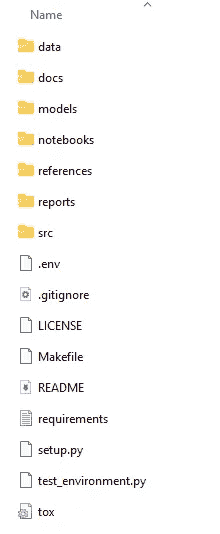
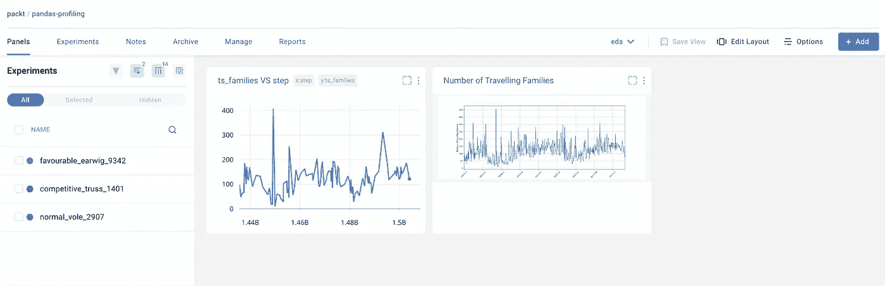
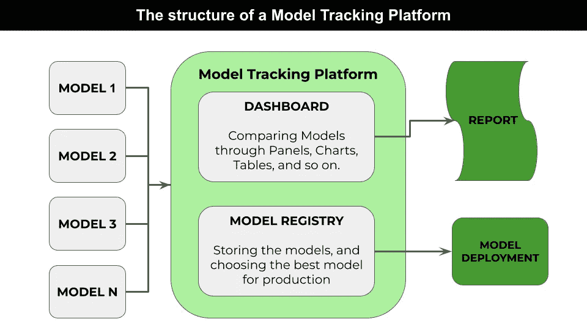

# 如何组织数据科学项目

> 原文：[`towardsdatascience.com/how-to-organize-your-data-science-project-3710a476bf8c`](https://towardsdatascience.com/how-to-organize-your-data-science-project-3710a476bf8c)

## 环境设置，数据科学

## 通过手动安装、Cookiecutter 或云服务来高效规划和组织数据科学项目的策略。

[](https://alod83.medium.com/?source=post_page-----3710a476bf8c--------------------------------)[](https://towardsdatascience.com/?source=post_page-----3710a476bf8c--------------------------------) [安杰丽卡·洛·杜卡](https://alod83.medium.com/?source=post_page-----3710a476bf8c--------------------------------)

·发表于 [Towards Data Science](https://towardsdatascience.com/?source=post_page-----3710a476bf8c--------------------------------) ·阅读时间 5 分钟·2023 年 6 月 5 日

--


图片由 [Alvaro Reyes](https://unsplash.com/@alvarordesign?utm_source=medium&utm_medium=referral) 提供，来源于 [Unsplash](https://unsplash.com/?utm_source=medium&utm_medium=referral)

成功的数据科学项目需要在各个阶段进行仔细的规划和组织。无论你选择手动组织还是使用外部工具，你都可以采用各种策略来简化工作流程。

本博客文章将探讨组织数据科学项目的三种主要策略：

+   手动组织

+   使用外部工具进行管理

+   使用云服务

# 手动组织

手动组织涉及使用目录和文件来构建数据科学项目，而不依赖于任何外部工具。这种方法让你完全控制组织方式，并允许你根据项目需求进行调整。

遵循下面描述的最佳实践来手动组织你的数据科学项目：

1.  创建一个**项目目录**用于你的数据科学项目。这将作为所有项目文件的根目录。

```py
project_dir/
```

2\. **分离数据和代码**：将项目分为两个主要目录：与数据相关的文件和与代码相关的文件。

```py
project_dir/
    ├── data/
    ├── code/
```

3\. **组织数据文件**：在`data`目录下，创建子目录以存储不同类型的数据，例如原始数据、处理数据和中间结果。

```py
project_dir/
    ├── data/
    │   ├── raw/
    │   ├── processed/
    │   └── intermediate/
    ├── code/
```

4\. **根据功能将代码拆分为模块**。每个模块应有自己的目录，并包含相关的脚本或笔记本。

```py
project_dir/
    ├── data/
    ├── code/
    │   ├── preprocessing/
    │   ├── modeling/
    │   └── evaluation/
```

5\. **使用版本控制**：在项目目录内初始化一个 Git 仓库，以跟踪更改并有效地与他人协作。

```py
project_dir/
    ├── .git/
    ├── data/
    ├── code/
```

6\. **包含一个 README 文件**以描述你的项目。

```py
project_dir/
    ├── .git/
    ├── data/
    ├── code/
    └── README.md
```

7\. **利用虚拟环境** 来隔离依赖项并确保可重现性。

```py
project_dir/
    ├── .git/
    ├── data/
    ├── code/
    ├── README.md
    └── env/
```

现在你已经学会了如何手动组织数据科学项目，让我们进入下一步，使用外部工具进行管理。

# 使用外部工具进行管理

手动安装可能会耗时且容易出错。此外，缺乏文档化的过程使得重现精确的软件环境变得困难，阻碍了合作和准确重现结果的能力。你可以使用外部数据科学项目管理工具来克服这些问题。

许多工具存在于项目管理领域。在本文中，我们将专注于[Cookiecutter](https://github.com/cookiecutter/cookiecutter)。Cookiecutter 使你能够基于预定义的模板定义项目结构。它提供了一个命令行界面来生成项目目录、文件和初始代码片段。

1.  首先安装 Cookiecutter：

```py
pip install cookiecutter
```

2\. 选择一个数据科学项目模板：你可以浏览[GitHub](https://github.com/search?q=cookiecutter&type=Repositories) 或其他社区驱动的仓库中可用的模板。例如，你可以使用由官方 Cookiecutter 仓库定义的模板来组织数据科学项目[模板](https://github.com/drivendata/cookiecutter-data-science)：

3\. 运行以下命令以安装模板：

```py
cookiecutter -c v1 https://github.com/drivendata/cookiecutter-data-science
```

模板需要安装[Git](https://git-scm.com/downloads)。Cookiecutter 会提示你提供模板中定义的项目特定参数的值，例如项目名称、作者和项目描述。输入所需的信息以自定义项目。以下代码展示了提示的示例：

```py
> cookiecutter https://github.com/drivendata/cookiecutter-data-science
project_name [project_name]: my-test
repo_name [my-test]: my-test-repo
author_name [Your name (or your organization/company/team)]: angelica
description [A short description of the project.]: a test project
Select open_source_license:
1 - MIT
2 - BSD-3-Clause
3 - No license file
Choose from 1, 2, 3 [1]: 1
s3_bucket [[OPTIONAL] your-bucket-for-syncing-data (do not include 's3://')]:
aws_profile [default]:
Select python_interpreter:
1 - python3
2 - python
Choose from 1, 2 [1]: 1
```

下图显示了生成的目录和文件：



作者提供的图像

现在你可以开始处理你的文件了。

在 Cookiecutter 中，你可以通过遵循[Cookiecutter](https://github.com/cookiecutter/cookiecutter) 官方仓库中描述的过程来定义自定义模板。

# 使用云服务

到目前为止，我们已经看到两种组织数据科学项目的技术：一种是手动技术，另一种是基于 Cookiecutter 的技术。实际上，还有第三种技术，它几乎完全解决了计算机上文件和文件夹的组织问题。这就是使用**云服务**。

这类服务有很多，从技术上讲，这些服务被称为模型跟踪平台或实验平台。这些服务的例子有[Comet](https://www.comet.com/site/)、[Neptune](https://neptune.ai/) 和[MLflow](https://mlflow.org/)（你可以将其安装到你的计算机上）。这些服务旨在管理所有实验、代码、数据，甚至结果在云端。

模型跟踪平台还提供仪表盘，你可以通过表格或图形直接比较实验结果。下图显示了 Comet 中的一个仪表盘示例。



Comet 中的一个仪表盘示例

你可以在 [这个链接](https://www.comet.com/packt#projects) 浏览其他仪表盘示例。

使用模型跟踪平台相当简单。下图展示了模型跟踪平台的架构示例。



作者提供的图片

你从本地模型开始，这些模型可以存储在一个文件中。然后你将它们保存在模型跟踪平台上，该平台除了包含仪表盘，还包含用于访问生成资产的注册表。你可以将结果导出到报告中或将其集成到部署流程中。

使用模型跟踪平台是一个不错的解决方案。但是，记住这些服务可能需要你花费资金。

# 摘要

恭喜！你刚刚学会了如何组织你的数据科学项目！你可以使用以下技巧之一：

+   手动组织，耗时且容易出错

+   外部工具，如 Cookiecutter，帮助创建项目的初始结构

+   云服务，为你组织所有代码，但可能需要你付费。

选择最适合你需求和要求的技巧，以确保数据科学项目的良好组织和成功！

# 你可能还对以下内容感兴趣…

[开始使用 Comet ML](https://alod83.medium.com/comet-for-data-science-e32d5e010194?source=post_page-----3710a476bf8c--------------------------------) [## 开始使用 Comet ML

### 关于流行的机器学习实验平台的概述，以及一个实际的例子。

[开始使用 Comet ML](https://alod83.medium.com/comet-for-data-science-e32d5e010194?source=post_page-----3710a476bf8c--------------------------------) [](https://alod83.medium.com/comet-for-data-science-e32d5e010194?source=post_page-----3710a476bf8c--------------------------------) [## Comet 用于数据科学

### 如何通过 Comet 平台（一个用于模型跟踪的工具）提升数据科学项目的生命周期...

[如何使用 Pytest 测试你的 Python 代码](https://alod83.medium.com/comet-for-data-science-e32d5e010194?source=post_page-----3710a476bf8c--------------------------------) [](/how-to-test-your-python-code-with-pytest-c8f055979dd7?source=post_page-----3710a476bf8c--------------------------------) [## 如何使用 Pytest 测试你的 Python 代码

### 使用 Pytest 简化你的测试过程并提高代码质量

[如何使用 Pytest 测试你的 Python 代码](https://alod83.medium.com/comet-for-data-science-e32d5e010194?source=post_page-----3710a476bf8c--------------------------------)
