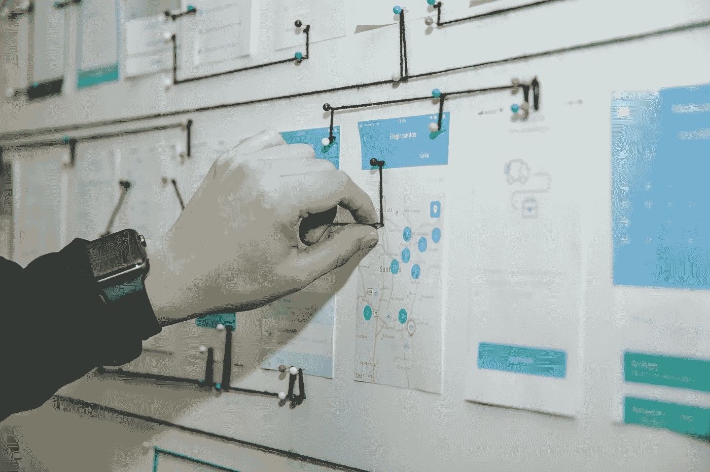

# 如何组织你的数据科学项目

> 原文：[`towardsdatascience.com/how-to-organize-your-data-science-project-3710a476bf8c?source=collection_archive---------6-----------------------#2023-06-05`](https://towardsdatascience.com/how-to-organize-your-data-science-project-3710a476bf8c?source=collection_archive---------6-----------------------#2023-06-05)

## 环境设置，数据科学

## 通过手动安装、Cookiecutter 或云服务，制定高效规划和组织数据科学项目的策略。

 [Angelica Lo Duca](https://alod83.medium.com/?source=post_page-----3710a476bf8c--------------------------------)

·

[关注](https://medium.com/m/signin?actionUrl=https%3A%2F%2Fmedium.com%2F_%2Fsubscribe%2Fuser%2Ff8bc34d63aee&operation=register&redirect=https%3A%2F%2Ftowardsdatascience.com%2Fhow-to-organize-your-data-science-project-3710a476bf8c&user=Angelica+Lo+Duca&userId=f8bc34d63aee&source=post_page-f8bc34d63aee----3710a476bf8c---------------------post_header-----------) 发表在 [Towards Data Science](https://towardsdatascience.com/?source=post_page-----3710a476bf8c--------------------------------) ·5 分钟阅读·2023 年 6 月 5 日

--

照片由 [Alvaro Reyes](https://unsplash.com/@alvarordesign?utm_source=medium&utm_medium=referral) 提供，来源于 [Unsplash](https://unsplash.com/?utm_source=medium&utm_medium=referral)

成功的数据科学项目需要在其各个阶段进行细致的规划和组织。无论你偏好手动组织还是外部工具，你都可以使用各种策略来优化工作流程。

本文将深入探讨三种主要的策略来组织你的数据科学项目：

+   手动组织

+   使用外部工具进行管理

+   使用云服务

# 手动组织

手动组织涉及使用目录和文件来构建数据科学项目，而不依赖任何外部工具。这种方法可以完全控制组织结构，允许您根据项目需求进行定制。

遵循下面描述的最佳实践来手动组织您的数据科学项目：

1.  为您的数据科学项目创建一个**项目目录**。这将成为您的所有…
