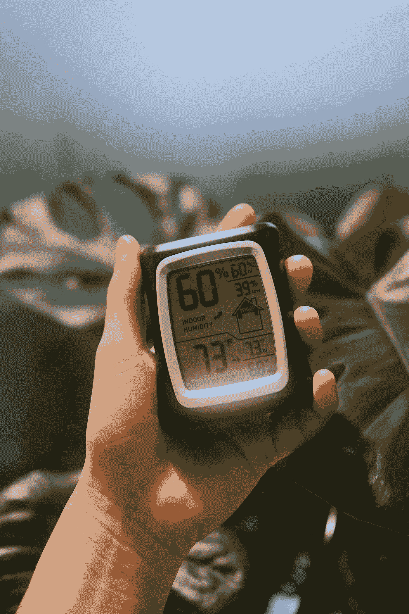
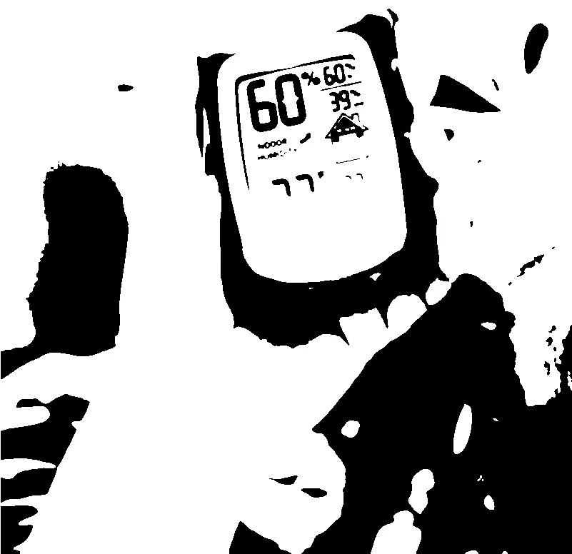
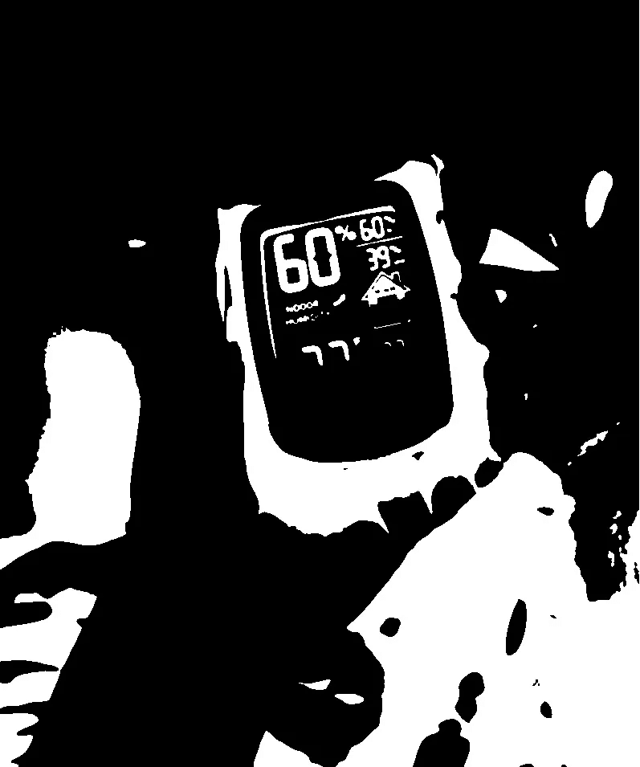
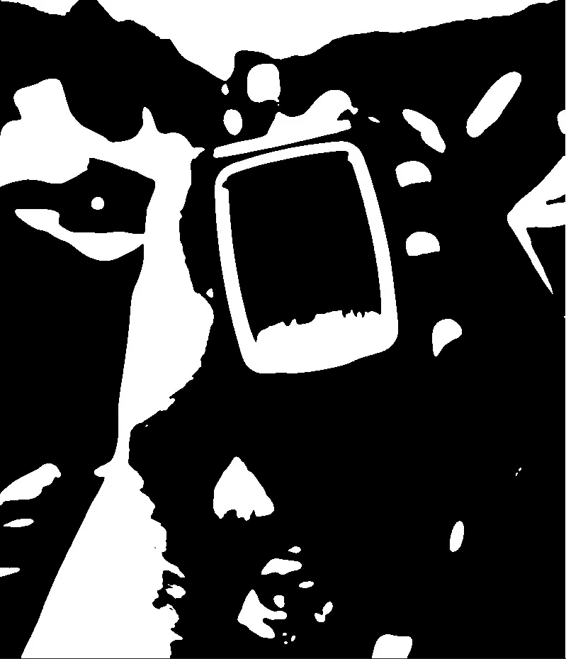
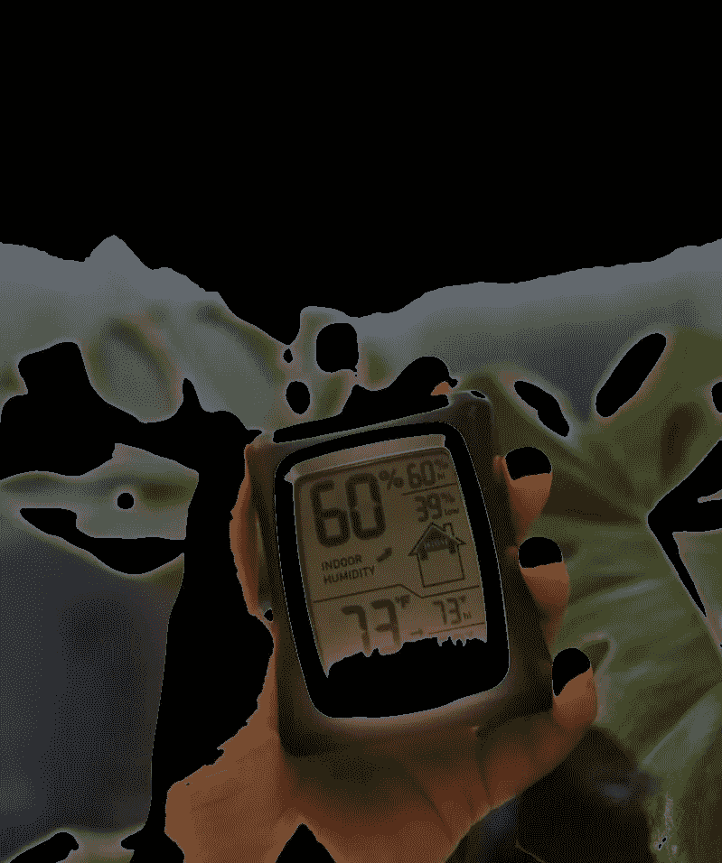
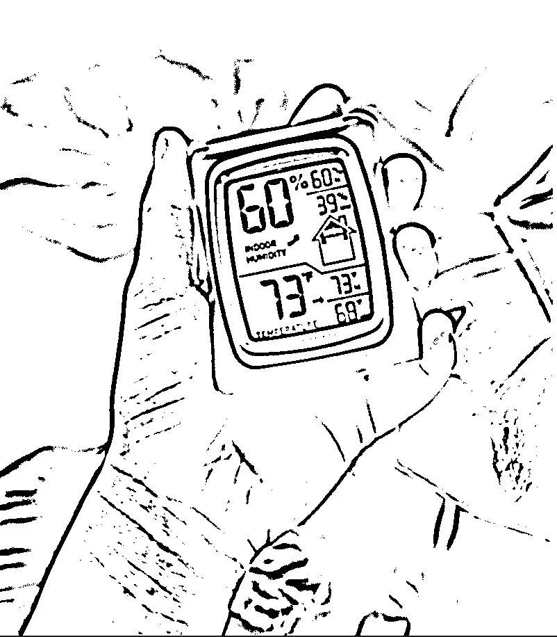

# 如何使用 OpenCV 进行阈值化图像分割

> 原文：[`towardsdatascience.com/how-to-perform-image-segmentation-with-thresholding-using-opencv-b2a78abb07ac`](https://towardsdatascience.com/how-to-perform-image-segmentation-with-thresholding-using-opencv-b2a78abb07ac)


图片由 [Lysander Yuen](https://unsplash.com/@lysanderyuen?utm_source=medium&utm_medium=referral) 提供，来源于 [Unsplash](https://unsplash.com/?utm_source=medium&utm_medium=referral)

## 简单、Otsu 和自适应阈值化的实现及示例

[](https://rashida00.medium.com/?source=post_page-----b2a78abb07ac--------------------------------)[](https://towardsdatascience.com/?source=post_page-----b2a78abb07ac--------------------------------) [Rashida Nasrin Sucky](https://rashida00.medium.com/?source=post_page-----b2a78abb07ac--------------------------------)

·发表于 [Towards Data Science](https://towardsdatascience.com/?source=post_page-----b2a78abb07ac--------------------------------) ·6 分钟阅读·2023 年 1 月 12 日

--

阈值化是最常用的分割技术之一。它在计算机视觉中被广泛使用，并且对于将我们感兴趣的对象从背景中分离出来非常有用。本文将重点讨论 OpenCV 中的阈值化技术。

有三种不同类型的阈值化方法。我们将了解它们的高层工作原理，并主要关注如何在 OpenCV 中使用它们及示例。

## 什么是阈值化

阈值化是图像二值化的过程。如果你像我刚开始时一样对灰度图像和二值图像感到困惑，灰度图像可能有一系列的阴影。但在二值图像中，像素值要么是 0，要么是 255。

## 简单阈值化

这是一种最基本的阈值化方法，在许多实际应用中更难使用。但我们仍然需要从学习这种方法开始，以理解阈值化的实际工作原理。我们将看到简单阈值化如何发挥作用。

**简单的阈值化在前景（图像中我们感兴趣的对象）和背景之间对比度高的非常受控的光照条件下表现良好。** 简单阈值化最困难的部分在于，我们需要手动提供阈值，这可能需要多次试验。这样，可能会变得非常耗时。让我们来做一个示例。

我们将使用以下图像进行本教程。请随意保存此图像并跟随操作。



照片由[Lucas Hoang](https://unsplash.com/@zuizuii?utm_source=medium&utm_medium=referral)提供，在[Unsplash](https://unsplash.com/?utm_source=medium&utm_medium=referral)上

首先，我们需要导入必要的库。

```py
import cv2 
import matplotlib.pyplot as plt 
```

使用 OpenCV 将图像读取为数组：

```py
image = cv2.imread("meter.jpg")
```

由于阈值化是二值化，我们从灰度图像开始。此外，对灰度图像应用高斯模糊有助于去除一些高频边缘和噪声。

```py
gray = cv2.cvtColor(image, cv2.COLOR_BGR2GRAY)
blurred = cv2.GaussianBlur(gray, (7, 7), 0)
```

这是简单的阈值化：

```py
(T, thresh) = cv2.threshold(blurred, 45, 255, cv2.THRESH_BINARY)
```

第一个参数是模糊后的图像，

45 是阈值，表示如果像素值大于 45，它将变为 255，否则为 0。因此，第三个参数是 255。如果你选择不同于 255 的值，如 200，那么大于 45 的像素将变为 200**。**

请随意尝试不同的值，看看会发生什么。

> 在经过很多次试验后，我决定使用阈值 45。

所以，花了一些时间。这是‘thresh’的样子：

```py
cv2.imwrite('a.png', thresh)
```



图片由作者提供

我们也可以使用 cv2.THRESH_BINARY_INV，它会做相反的操作。让我们看看如果用 cv2.THRESH_BINARY_INV 使用相同的阈值 45 效果如何：

```py
(T, threshInv) = cv2.threshold(blurred, 45, 255, cv2.THRESH_BINARY_INV)
```



图片由作者提供

在这种情况下，当像素大于阈值 45 时，它变为 0，否则为 255。

正如我之前提到的，我经历了很多次试验才找到阈值 45。

> 但如果同一张图片的光照条件不同，这个阈值将不起作用。

这就是为什么在实际应用中，当我们可能没有关于光照条件的先验知识时，这种方法很难使用。 **我们需要找到一个可以缩放的最佳阈值。**

## Otsu 阈值化

在 Otsu 的阈值化中，OpenCV 为你找到最佳阈值。它接受灰度图像并计算最佳阈值 T。

这里是 Otsu 方法选择阈值的高级概述。如果用所有灰度图像的像素值制作分布图，Otsu 方法会找到一个最佳阈值，来最优地分隔分布的峰值。

```py
(T, threshOtsu) = cv2.threshold(blurred, 0, 255, 
                cv2.THRESH_BINARY | cv2.THRESH_OTSU)
```

看，这里我们使用了 0 作为阈值，仅仅因为 Otsu 的算法会为我们找到最佳阈值。

让我们看看最佳阈值是多少：

```py
T
```

输出：

```py
112.0
```

这是‘threshOtsu’的图像：

```py
cv2.imwrite("au.jpg", threshOtsu)
```



图片由作者提供

我们想专注于计量读取部分，对吧？那么，我们如何从这张图像中做到这一点？只需使用 bitwise_and 操作对原始图像进行遮罩。

```py
masked1 = cv2.bitwise_and(image, image, mask=threshInvOtsu)
cv2.imwrite('amasked.jpg', masked1)
```

这里是图像：



图片由作者提供

背景中的大量噪声被平滑掉了。

简单和 Otsu 阈值化方法的问题是它们在整个图像上使用单一的阈值，这可能不是一个好主意。对图像某个区域有效的阈值可能对图像的其他区域不适用。

## 自适应阈值

自适应阈值方法考虑了一小部分像素，并为图像的每个小区域计算一个阈值。我们将在这个示例后进一步解释：

```py
thresh = cv2.adaptiveThreshold(blurred, 255, 
                               cv2.ADAPTIVE_THRESH_GAUSSIAN_C,
                              cv2.THRESH_BINARY, 17, 3)
cv2.imwrite('a1.jpg', thresh)
```

这里第二个参数 255 表示当像素值大于局部阈值时，它变为 255。第五个参数 17 表示它将是图像的 17x17 区域用于计算局部阈值。最后，3 是一个常数，这个值会从计算的阈值中减去。根据你的项目，你需要选择一个图像区域来计算局部阈值和常数。

这就是图像的样子：



作者提供的图像

根据上述讨论，自适应阈值也需要一些尝试来确定最后两个参数。但方法本身仍然对我们做了很多工作。

## 结论

所有三种阈值方法都很重要。根据你的情况或项目，每种方法都有可能派上用场。请随意尝试不同的图像。

随时欢迎关注我的[Twitter](https://twitter.com/rashida048)并点赞我的[Facebook](https://www.facebook.com/rashida.smith.161)页面。

## 进一步阅读

[](/morphological-operations-for-image-preprocessing-in-opencv-in-detail-15fccd1e5745?source=post_page-----b2a78abb07ac--------------------------------) ## 形态学操作用于 OpenCV 中的图像预处理，详细介绍

### 腐蚀、膨胀、开运算、闭运算、形态学梯度、顶帽/白帽和黑帽的解释及示例

towardsdatascience.com [](/some-basic-image-preprocessing-operations-for-beginners-in-python-7d297316853b?source=post_page-----b2a78abb07ac--------------------------------) ## Python 初学者的一些基本图像预处理操作

### OpenCV 入门：移动或平移、调整大小和裁剪

towardsdatascience.com [](/a-step-by-step-tutorial-to-develop-a-multi-output-model-in-tensorflow-ec9f13e5979c?source=post_page-----b2a78abb07ac--------------------------------) ## 逐步教程：在 TensorFlow 中开发多输出模型

### 附有完整代码

towardsdatascience.com [](https://pub.towardsai.net/some-simple-but-advanced-styling-in-pythons-matplotlib-visualization-107f3be56a24?source=post_page-----b2a78abb07ac--------------------------------) [## Python 的 Matplotlib 可视化中的一些简单但高级的样式

### 为你的 Python 绘图增添一些额外的风味

pub.towardsai.net](https://pub.towardsai.net/some-simple-but-advanced-styling-in-pythons-matplotlib-visualization-107f3be56a24?source=post_page-----b2a78abb07ac--------------------------------) [](/precision-recall-and-f1-score-of-multiclass-classification-learn-in-depth-6c194b217629?source=post_page-----b2a78abb07ac--------------------------------) ## 多分类的精准率、召回率和 F1 分数 — 深入学习

### 从混淆矩阵手动计算和 sklearn 库的语法

towardsdatascience.com [](/how-to-make-animated-and-racing-bar-plots-in-python-c5c7c3c648f7?source=post_page-----b2a78abb07ac--------------------------------) ## 如何在 Python 中制作动画和竞赛条形图

### 完整的工作代码

towardsdatascience.com
