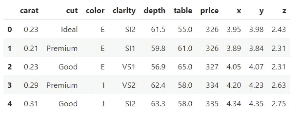
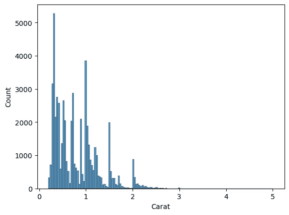
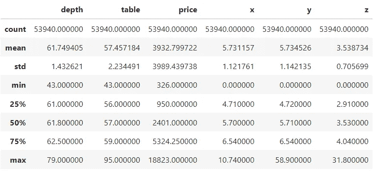
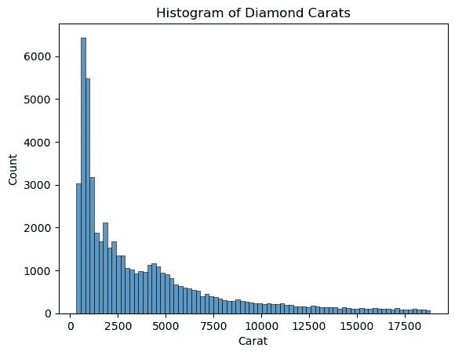
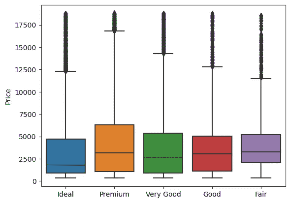
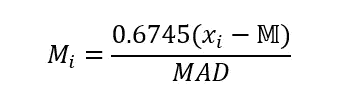
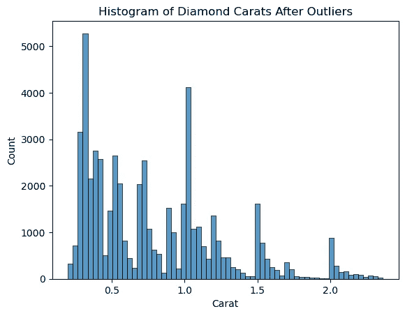

# 如何在 Python 中进行单变量离群点检测

> 原文：[`towardsdatascience.com/how-to-perform-univariate-outlier-detection-in-python-for-machine-learning-b9fb05e72661`](https://towardsdatascience.com/how-to-perform-univariate-outlier-detection-in-python-for-machine-learning-b9fb05e72661)

## 离群点检测系列——第二部分

[](https://ibexorigin.medium.com/?source=post_page-----b9fb05e72661--------------------------------)[](https://towardsdatascience.com/?source=post_page-----b9fb05e72661--------------------------------) [Bex T.](https://ibexorigin.medium.com/?source=post_page-----b9fb05e72661--------------------------------)

·发表于 [Towards Data Science](https://towardsdatascience.com/?source=post_page-----b9fb05e72661--------------------------------) ·阅读时间 9 分钟·2023 年 2 月 6 日

--


图片由 [Alexa](https://pixabay.com/users/alexas_fotos-686414/?utm_source=link-attribution&utm_medium=referral&utm_campaign=image&utm_content=1744091) 提供，来自 [Pixabay](https://pixabay.com//?utm_source=link-attribution&utm_medium=referral&utm_campaign=image&utm_content=1744091)

## 介绍

在开始离群点检测之前，第一个要问的问题是，“我的数据集是否存在离群点？”虽然通常答案是“是的”，但在投入大量精力（如使用机器学习模型）来隔离它们之前，建议先探测离群点的存在。

因此，我们将通过查看数据可视化等检测离群点存在的一般方法来开始本系列离群点检测教程的第二部分。然后，我们将继续讨论检测单变量和多变量离群点的方法。

让我们开始吧！

[](/how-to-perform-outlier-detection-in-python-in-easy-steps-for-machine-learning-1-8f9a3e6c88b5?source=post_page-----b9fb05e72661--------------------------------) ## 如何在 Python 中进行离群点检测：第一部分

### 地球是一个离群点——理论

[towardsdatascience.com

## 要使用的数据集

在整个教程中，我们将使用 Diamonds 数据集。它足够大，不是一个玩具数据集，并且具有良好的数值和类别特征组合。

```py
import seaborn as sns

diamonds = sns.load_dataset("diamonds")
diamonds.head()
```



图片由作者提供

我们在离群点检测后的最终任务是根据钻石的物理特征和价格预测其克拉数：

```py
diamonds.columns
```

```py
Index(['carat', 'cut', 'color', 'clarity', 'depth', 'table', 'price', 'x', 
       'y', 'z'],
      dtype='object')
```

在进入那部分之前，我们希望检测并隔离离群值，以使我们的数据集尽可能干净（目前相对较干净）。

因此，让我们提取特征和目标数组，并使用 Sklearn 的 OrdinalEncoder 类对类别列进行编码：

```py
import numpy as np
from sklearn.preprocessing import OrdinalEncoder

# Extract feature and target arrays
X, y = diamonds.drop("carat", axis=1), diamonds["carat"]
# Select categorical column names
cats = X.select_dtypes(exclude=np.number).columns.tolist()

# Encode categoricals
X.loc[:, cats] = OrdinalEncoder().fit_transform(X[cats])
```

现在，我们准备好了…

## 离群值真的存在吗？

…要回答“离群值真的存在吗？”这个问题，第一步是查看目标变量（克拉）的总结统计数据。我们在寻找目标的最小值、均值和最大值之间是否存在可疑的间隙。

```py
y.describe()
```

```py
count    53940.000000
mean         0.797940
std          0.474011
min          0.200000
25%          0.400000
50%          0.700000
75%          1.040000
max          5.010000
Name: carat, dtype: float64
```

最小值、均值和最大值分别为 0.2、0.8 和 5.01。最小值和最大值之间、均值和最大值之间的显著差距已经表明可能存在离群值（记住，离群值通常是分布中的极端数据点）。

让我们通过绘制目标变量的直方图来确认这一怀疑：

```py
import matplotlib.pyplot as plt
sns.histplot(y)

plt.xlabel("Carat");
```



正如我们所看到的，直方图的大部分数据集中在 0.2 到 3 克拉之间。但直方图的右尾延伸到 5 克拉，但我们没有看到任何数据箱。如果你看到一个具有长左尾或右尾但尾部没有数据箱的直方图，那么分布中存在少量极端值（离群值）。 （离群值——检查！）

现在，让我们查看特征数组：

```py
X.drop(cats, axis=1).describe()
```



图片由作者提供

在排除类别特征后，我们可以大致猜测价格是最重要的特征。像克拉一样，我们可以看到均价与最便宜和最昂贵的钻石之间的显著差异。让我们再次绘制直方图：

```py
sns.histplot(X["price"])

plt.title("Histogram of Diamond Carats")
plt.xlabel("Carat");
```



图片由作者提供

我们可以看到大多数数据点低于 5000 美元；其余的箱体高度非常低。这变得棘手——现在我们是否将所有 5000 美元以上的点视为离群值？

好吧，不——我们不能仅凭一个图来判断样本是否为离群值。记住，第一印象往往是骗人的。

让我们更仔细地看一下，通过绘制钻石切工质量与价格的箱线图。切工质量从左到右按降序排列。

```py
sns.boxplot(x="cut", y="price", data=diamonds, whis=2)

plt.xlabel("")
plt.ylabel("Price");
```



图片由作者提供。钻石切工质量与价格。须上方的黑暗斑点表示离群值——有很多，因此它们被混杂在一起。

尽管我们在图中看到许多离群值，它们被标记在箱体的须上方，但我们不能安全地断定它们是离群值。

如果你注意到，最高质量的理想钻石的价格约为 2000 美元（查看中位数），然而，最低质量的普通钻石的价格却高得多，约为 3000 美元。这表明数据集的特征之间存在一些隐藏的多变量关系，我们不能仅从单变量和双变量图中得出结论。

实际上，这几乎适用于所有数据集。纯描述性统计和简单图表只能暗示异常值的存在。由于我们无法通过这些方法看到所有特征之间的大致关系，我们必须转向更复杂的技术。

## 单变量异常值检测

首先，让我们看看允许我们在单一分布中检测异常值的技术，比如我们钻石克拉的目标数组。

在单变量数据集上进行异常值检测的最流行方法之一是使用普通的 z 分数。回想一下，一个数据点的 z 分数告诉我们它离均值有多少标准差。

例如，如果分布 A 的均值为 5，标准差为 3.2，则样本 17.2 的 z 分数为 (17.2–5) / 3.2 = 3.8125。

我们可以使用 `scipy` 中的 `zscore` 函数计算数组中所有元素的 z 分数：

```py
from scipy.stats import zscore

zscore(y).abs()[:5]
```

```py
0    1.198168
1    1.240361
2    1.198168
3    1.071587
4    1.029394
Name: carat, dtype: float64
```

在统计学中，z 分数 3 通常用作内点和异常值之间的阈值。因此，通过数组过滤，我们可以将任何样本标记为异常值，如果其 z 分数的绝对值高于 3：

```py
from scipy.stats import zscore

# Calculate the abs of zscore and filter above 3
is_outlier = zscore(y).abs() > 3
outliers_y = y[is_outlier]

num_outliers = len(outliers_y)
print(f"The number of outliers: {num_outliers}")
print(f"Percentage of outliers: {num_outliers / len(y):.3f}")
```

```py
The number of outliers: 439
Percentage of outliers: 0.008
```

该方法将 0.8% 的样本标记为异常值，这并非巧合。使用 z 分数三作为异常值阈值的想法源于 [经验法则](https://en.wikipedia.org/wiki/68%E2%80%9395%E2%80%9399.7_rule)。


[CC BY-SA 许可证。维基百科。](https://en.wikipedia.org/wiki/68%E2%80%9395%E2%80%9399.7_rule)

[经验法则](https://en.wikipedia.org/wiki/68%E2%80%9395%E2%80%9399.7_rule) 表示，数据在一个、两个和三个标准差或 z 分数内大致代表 68%、95% 和 99.7% 的分布。

所以，如果样本的 z 分数高于 3，我们可以安全地得出结论，这是一种极端值，因为它与大约 99.7% 的数据集不同。

我们使用 z 分数方法找到了 439 个异常值，但我们真的可以相信这个结果吗？实际上，我们不能。

经验法则，进而，z 分数仅适用于正态分布数据。从我们之前看到的钻石克拉直方图中，我们可以确定我们的目标 y 并不符合正态分布：


作者提供的图像。钻石克拉的直方图。该图显示了分布不是正常的。

所以，我们现在必须采取另一种方法。

## 修改的 z 分数

当你的分布不正常时，z 分数无法用于检测异常值。相反，你可以使用 z 分数的“兄弟”——中位绝对偏差 (MAD)，也称为修改的 z 分数。

这个想法很简单——由于异常值对分布的均值和标准差影响最大，我们将停止使用这些度量标准，而用中位数来替代它们。

> 为什么用中位数替换均值？中位数表示第 50 百分位，即分布排序时的中间值。这意味着无论离群点多大或多小，它们都不会对中位数的值产生丝毫影响。

当我们在标准差公式中用中位数替换均值时，我们得到中位数绝对偏差。它通过从分布中的每个样本中减去中位数，取绝对值，然后计算差值的中位数来计算。以下是在 NumPy 中对我们的目标 y 进行此操作的方法：

```py
# Find the median
median_y = y.median()

# Find the abs value of differences between the median
abs_diffs = (y - median_y).abs()
# Take the median of differences
mad = abs_diffs.median()

mad
```

```py
0.32000000000000006
```

我们可以使用`scipy`中的`median_abs_deviation`函数来确认我们的计算是正确的：

```py
from scipy.stats import median_abs_deviation

median_abs_deviation(y)
```

```py
0.32000000000000006
```

我们得到了相同的结果。现在，如果我们将 MAD 值插入以下公式中，我们得到修改后的 z 分数：



图片由作者提供。酷炫的 M 是中位数，x_i 是分布中的第 i 个样本。

在修改后的 z 分数中，MAD 分数 3.5 被用作离群点的阈值。公式已作为 PyOD 库中的`MAD`估算器实现。我们来看看如何使用它：

```py
from pyod.models.mad import MAD

# Reshape the target to make it 2D
y_2d = y.values.reshape(-1, 1)
# Fit to the target
mad = MAD().fit(y_2d)

# Extract the inlier/outlier labels
labels = mad.labels_
labels
```

```py
array([0, 0, 0, ..., 0, 1, 0])
```

一旦你从`models.mad`导入估算器，你可以将其拟合到目标数组`y`。默认情况下，所有 PyOD 估算器都需要 2D 数组，因此我们在重新调整形状后喂入`y`。

在拟合 MAD 后，我们可以使用`labels_`属性获取每个样本的内点/外点标签。它返回 0 表示内点，返回 1 表示外点。

让我们来统计 1 的数量：

```py
outliers_y_mad = y[labels == 1]

num_outliers = len(outliers_y_mad)
print(f"The number of outliers: {num_outliers}")
print(f"Percentage of outliers: {num_outliers / len(y):.3f}")
```

```py
The number of outliers: 222
Percentage of outliers: 0.004
```

如你所见，`MAD`估算器发现了 222 个离群点，而我们用 z 分数发现了 439 个。由于`MAD`使用了中位数等鲁棒度量，我们可以更信任这个结果。

在去除离群点后，让我们再次绘制钻石克拉数的直方图：

```py
# Filter for inliers, marked as 0s
inliers = y[labels == 0]

sns.histplot(inliers)

plt.title("Histogram of Diamond Carats After Outliers")
plt.xlabel("Carat");
```



如我们所见，直方图的尾部消失了。

## 结论

这是在给定新数据集时执行单变量离群点检测的步骤总结：

1.  首先检查是否存在离群点，使用基本方法如汇总统计、直方图和箱线图。

1.  一旦你对离群点的存在有了合理的假设，你可以开始对目标数组进行单变量离群点检测。

1.  如果数组是正态分布的，你可以使用 z 分数。

1.  如果你不知道分布类型或确认它不是正态分布，你可以使用修改后的 z 分数，阈值为 3.5。

感谢阅读！

查看我在[DataCamp 上的离群点检测综合课程](https://app.datacamp.com/learn/courses/anomaly-detection-in-python)以深入了解该主题（第一章免费！）。

[](https://ibexorigin.medium.com/membership?source=post_page-----b9fb05e72661--------------------------------) [## 使用我的推荐链接加入 Medium - Bex T.

### 获取对我所有⚡高级⚡内容的独家访问权限，并在 Medium 上无限制地访问。通过购买我的……

[ibexorigin.medium.com](https://ibexorigin.medium.com/membership?source=post_page-----b9fb05e72661--------------------------------) [](https://ibexorigin.medium.com/subscribe?source=post_page-----b9fb05e72661--------------------------------) [## 每当 Bex T. 发布新内容时，你将收到电子邮件。

### 每当 Bex T. 发布新内容时，你将收到电子邮件。通过注册，如果你还没有 Medium 账户，你将创建一个账户…

[ibexorigin.medium.com](https://ibexorigin.medium.com/subscribe?source=post_page-----b9fb05e72661--------------------------------) [](/how-to-perform-outlier-detection-in-python-in-easy-steps-for-machine-learning-1-8f9a3e6c88b5?source=post_page-----b9fb05e72661--------------------------------) ## 如何在 Python 中进行异常值检测：机器学习第一部分

### 地球是一个异常值 —— 这一理论

[towardsdatascience.com

更多来自我的故事…

[](https://medium.com/geekculture/5-excellent-julia-features-that-python-developers-can-only-wish-they-had-e1531a596239?source=post_page-----b9fb05e72661--------------------------------) [## 5 个 Python 开发者只能羡慕的优秀 Julia 特性

### Julia 与 Python 辩论的延续

[medium.com](https://medium.com/geekculture/5-excellent-julia-features-that-python-developers-can-only-wish-they-had-e1531a596239?source=post_page-----b9fb05e72661--------------------------------) [](/5-best-python-synthetic-data-generators-and-how-to-use-them-when-you-lack-data-f62bcf62d43c?source=post_page-----b9fb05e72661--------------------------------) ## 5 个最佳 Python 合成数据生成器及其在数据不足时的使用方法

### 让我们获取更多数据

[towardsdatascience.com [](https://pub.towardsai.net/bentoml-vs-fastapi-the-best-ml-model-deployment-framework-and-why-its-bentoml-f0ed26cae88d?source=post_page-----b9fb05e72661--------------------------------) [## Bentoml 与 Fastapi：最佳 ML 模型部署框架及其为什么是 Bentoml

### BentoML 和 FastAPI 在模型部署方面的详细比较。

[pub.towardsai.net](https://pub.towardsai.net/bentoml-vs-fastapi-the-best-ml-model-deployment-framework-and-why-its-bentoml-f0ed26cae88d?source=post_page-----b9fb05e72661--------------------------------)
