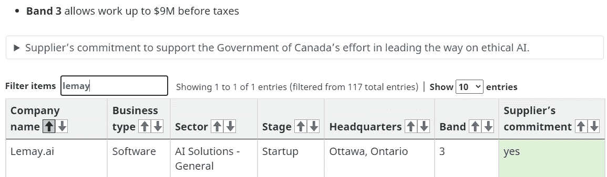
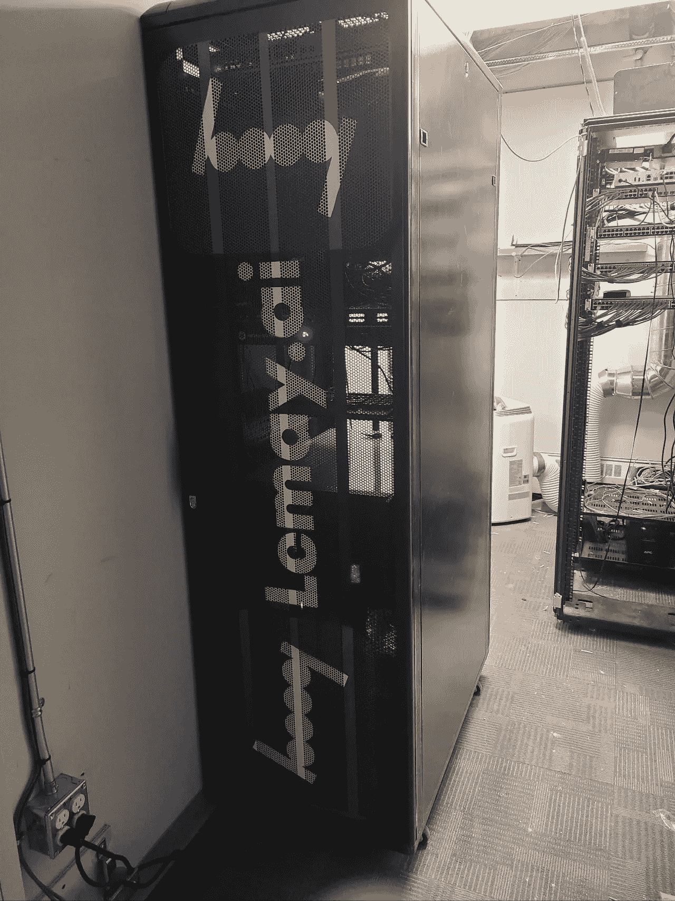

# 2023 年如何为 AI 项目定价

> 原文：[`towardsdatascience.com/how-to-price-an-ai-project-in-2023-7ffa627dd32f?source=collection_archive---------16-----------------------#2023-01-12`](https://towardsdatascience.com/how-to-price-an-ai-project-in-2023-7ffa627dd32f?source=collection_archive---------16-----------------------#2023-01-12)

## 我在 2017 年 TDS 文章发布 6 年后，新的变化和保持不变的内容

 [Daniel Shapiro, PhD](https://medium.com/@lemaysolutions?source=post_page-----7ffa627dd32f--------------------------------)

·

[关注](https://medium.com/m/signin?actionUrl=https%3A%2F%2Fmedium.com%2F_%2Fsubscribe%2Fuser%2Fe7f791e64e83&operation=register&redirect=https%3A%2F%2Ftowardsdatascience.com%2Fhow-to-price-an-ai-project-in-2023-7ffa627dd32f&user=Daniel+Shapiro%2C+PhD&userId=e7f791e64e83&source=post_page-e7f791e64e83----7ffa627dd32f---------------------post_header-----------) 发表在 [数据科学的前沿](https://towardsdatascience.com/?source=post_page-----7ffa627dd32f--------------------------------) ·11 分钟阅读·2023 年 1 月 12 日

--

图片由 [愚木混株 Cdd20](https://pixabay.com/users/cdd20-1193381/?utm_source=link-attribution&utm_medium=referral&utm_campaign=image&utm_content=7685249) 提供，来源于 [Pixabay](https://pixabay.com//?utm_source=link-attribution&utm_medium=referral&utm_campaign=image&utm_content=7685249)

这是一篇为从事 AI/ML 咨询领域的其他人提供难得见解的文章。几乎没有人愿意谈论定价或招聘实践。我 2017 年的文章“如何为 AI 项目定价”提供了如何为客户定价机器学习（ML）项目的见解。但是自 2017 年以来已经过去很久了！在提供 2023 年关于如何为 AI/ML 项目定价的更新之前，我将简要总结一下我之前文章的一些关键点。由于需求变更、集成问题、数据问题和用户接受等因素，为大型 ML 项目提供固定价格估算可能会很棘手。执行 ML 项目期间，管理层和项目经理应该预期需求和范围会发生变化。未知或需求风险越大，你应该越倾向于使用按小时计费而非固定价格。尽量在尽早的阶段消除风险。科学优先，工程其次。截止到 2017 年 8 月，我们的 ML 咨询标准费率是每小时 250 美元，项目必须至少为 5000 美元（20 小时）。我们在 2017 年的目标是在固定价格项目中也能达到我们的小时费率……但现在是 2023 年了。让我们看看发生了什么变化，什么保持不变。

## 一样的地方是什么？

令人惊讶的是，我们的展望与 2017 年时基本相同。自那篇文章发布以来已经过去了几年，这篇文章被各种来源引用，例如[这篇](https://www.sciencedirect.com/science/article/pii/S2153353922001353)和[这篇](https://www.slideshare.net/meleader007/entering-the-4th-industrial-revolution-supply-chain-efficiency-in-rmg-by-using-ai-based-machine-learning-technology)。自 2017 年以来，人工智能咨询行业快速发展，我注意到一些事情保持不变。其中一个主要的稳定点是，疫情定价对我们来说并不存在。自 2017 年以来，我们保持了每小时 250 美元的定价。我们的固定定价基于这一小时费率，如 2017 年文章中所述，我们发现这种定价模式对客户和我们的业务都有效。此外，我们继续保持作为分包商的模式，而不是成为主要承包商，因为这使我们能够根据需要进行扩展或缩减，并且与政府客户的互动变得更加容易。然而，我们发现拥有一个行业特定的销售团队（如国防、产品、政府和金融科技）有助于我们为服务建立长期定价。

图片由[Clker-Free-Vector-Images](https://pixabay.com/users/clker-free-vector-images-3736/?utm_source=link-attribution&utm_medium=referral&utm_campaign=image&utm_content=36437)提供，来源于[Pixabay](https://pixabay.com//?utm_source=link-attribution&utm_medium=referral&utm_campaign=image&utm_content=36437)

在定价方面，我们发现未知因素，即我们所称的需求风险，仍然是决定我们倾向于小时计费还是固定价格的主要因素。当需求不明确或可能发生变化时，我们更倾向于小时计费。另一方面，当需求非常紧密，或我们称之为可执行规格时，我们更倾向于固定价格。AI/ML 项目的一个大风险是数据的访问，这已成为我们在大大小小项目中看到的许多范围变化和延迟的源头。

我们发现，为项目定义和解决方案架构提供专家建议已成为我们咨询服务中越来越重要的一个方面。许多客户带着定义不明确的需求来找我们，我们必须在讨论的最早阶段识别任何证明无法实现的需求或需要新科学的需求。

此外，正如我们在 2017 年所做的，我们继续倾向于将尽可能多的低端工作委托给客户的员工，以减少完成项目所需的时间。

## 我们在 AI/ML 咨询领域的招聘情况

显然，给 AI 项目定价与薪酬密切相关。在疫情期间，AI/ML 咨询领域发生了几次变化，主要与人员配置有关。首先，大公司纷纷抢聘新手，支付不合理的薪水。这使得人才库枯竭，并为统计学和生物学等领域的新毕业生创造了一些扭曲的激励，促使他们转行进入数据科学和 ML 领域。这也导致了人员流动，因为员工在公司间跳槽。去年，情况再次发生变化。随着经济放缓和裁员的到来，我采访了许多被大型组织解雇并希望转向咨询的人员。客观地说，离开六位数薪水工作的人员，其资格比期待五位数薪水的新毕业生要低。不幸的是，这些所谓的经验丰富的候选人更不愿意付出必要的努力来展示他们的能力。我惊讶地发现，申请人的薪资预期与工作经验年限高度相关，但那些有约 3 到 5 年经验的申请人的测试分数**显著下降**。我的理论是，在大团队中从事狭窄任务几年后，许多经验丰富的申请人并不习惯我们每天所做的疯狂咨询工作。我的方法是忽略市场的波动，专注于个人为团队带来的价值。我尽量将这一点与候选人将带来的可计费工作紧密匹配。因此，定价与薪酬相关，通过确保薪酬和利润率让我们保持我们的定价结构。

让我告诉你一些关于我们招聘过程的事情。我们在这里的做法有些不同。我们询问每位候选人的薪资期望，然后在技术面试评分后，我们将薪资期望与技能测试得分绘制成图表。我们根据图表显示的最佳技能价值来选择雇用对象。我们从经过初筛的申请者那里请求薪资期望（技术、地域和人际评分），然后尽量回答他们可能对角色或公司有的任何问题，这些问题在招聘广告中没有说明。我的目标是在技术面试之前解决职责和薪资讨论，以便技术面试可以完全专注于技术能力。每个人的时间对我来说都很宝贵，因此我创建了一个在技术面试之前的每一步，人们可以以很少的时间投入申请，然后决定是否进入下一步或退出的情况。

## 有什么新鲜事？

首先，我们依然存在！这是一个大消息。在一个充满了要么退出要么消失的初创企业的领域中，我们保持了独立。我们根据我在 2017 年《Towards Data Science》文章中描述的基本计划，逐步建立了我们的业务和声誉。我们的 CEO Matt 于 2016 年 6 月 22 日成立了公司，而七年后我们依然在坚持我们的事业。

销售渠道随着时间的推移也发生了变化。我们一直提供详细的 RFQ，但值得一提的变化是我们现在申请了一些 [RFI 和 RFP](https://rfp360.com/rfi-rfp-rfq/)。我们曾经非常讨厌 RFP，以至于根本不申请它们。现在，随着时间的推移，我们已经在 [供应商名单](https://www.canada.ca/en/government/system/digital-government/digital-government-innovations/responsible-use-ai/list-interested-artificial-intelligence-ai-suppliers.html) 上安下了我们的旗帜，当我们认为某个机会对我们来说足够有吸引力时，我们就会参与竞争。

致谢：作者以及那些通过坚定的意志熬夜填写表格使我们进入这些名单的工作人员。

就项目的规模而言，我们现在的目标是建立预期能够带来至少 100K（400 小时）规模的项目的关系。微小的客户不再那么适合。然而，如果我们看到一个初始范围为 25K，但有后续机会达到 150K 的项目，我们就会全力投入并建立起关系。请注意我们将重点从项目规模转变为客户规模。从一个客户那里获得的小交易逐渐累积，因此我们已将概念转变为代表客户而非具体交易。如果我们与一个合作伙伴合作处理各种小交易，我们可以汇总他们带来的项目的价值，这样这些较小的交易从“大局”角度来看就会变得有意义。至于我们如何建模业务，我们使用一个名为 [floatapp.com](https://floatapp.com/) 的工具，将我们的 P&L 数据直接输入到我们的收入预测中。我们还使用 HubSpot 作为 CRM 来跟踪交易和机会。

对于项目管理，我们使用一个 [自托管的 GitLab](https://gitlab.com/rluna-gitlab/gitlab-ce) 实例来进行大多数票据跟踪，但我们最终使用各种工具，因为我们使用客户希望我们在其项目中使用的工具（从 [JIRA](https://jira.atlassian.com/) 到 [GitHub](https://github.com/features/issues)）。我们现在明确收取项目管理费用，这是件好事。

另一个变化是我们现在提供给客户的产品种类更多了。我们的服务被组织为 SKU，包括 [AI 战略](https://www.lemay.ai/ai-strategy.php)、[差距分析和 AI 路线图](https://www.lemay.ai/gap-analysis-and-ai-roadmap.php)，交付物是报告或顾问服务、[解决方案架构](https://www.lemay.ai/solution-architecture.php)，交付物是需求文档或范围文档、[虚拟 CTO](https://www.lemay.ai/virtual-cto.php)，服务包括与高管团队和投资者的更深入互动，以及我们最初的技术产品，包括 [数据科学](https://www.lemay.ai/data-science.php)、[AI/ML/DL 模型训练](https://www.lemay.ai/model-training.php) 和 [部署与 MLOps](https://www.lemay.ai/deployment-and-mlops.php)。这里的变化是我们在过程早期就介入（例如，路线图开发），并且我们会坚持更长时间（例如，MLOps 和带有服务水平协议的支持）。

多汁的本地硬件。感谢：Lemay.ai 和对在服务器室中增加额外电力线非常理解的电工。

我们还转向使用比以往更多的本地硬件。我们的硬件现在是 4U 机架式的，包括 Titan RTX（24 GB，4608 CUDA 核心，Turing 架构，CC 7.5）、5 个 RTX 3090（24 GB，10496 CUDA 核心，Ampere 架构，CC 8.6）配备 NVLINK、5 个 GeForce GTX 1050 Ti，以及大量 Xeon/i9 CPU，当然，还有大量的 RAM。当在本地进行研发活动时，我们可以节省很多费用。如果涉及到磁盘，我们一直使用 [unraid](https://unraid.net/) 进行二级备份以及离线三级备份。顺便提一下，当你订购 [45drives storinator server](https://www.45drives.com/products/) 时，可以将 unraid 安装为基础操作系统。另一个变化是，我们看到一些转向云计算的客户又转回了本地 GPU，并存储在托管设施中。我们还升级到了 10 千兆以太网交换机和网络卡。处理大型数据集时非常快速。

关于硬件定价，我们很久以前决定不对硬件成本加价。这不是我们的商业模式。相反，我们让客户准确知道硬件和保修的成本，如果需要，我们只收取我们的时间费。客户尊重我们的定价透明度，我们也收到了非常积极的反馈。客户支付托管费用，我们只有在需要时才亲自前往现场。

图片由 [Gerd Altmann](https://pixabay.com/users/geralt-9301/?utm_source=link-attribution&utm_medium=referral&utm_campaign=image&utm_content=948024) 提供，来自 [Pixabay](https://pixabay.com//?utm_source=link-attribution&utm_medium=referral&utm_campaign=image&utm_content=948024)

另一个变化是，近年来对 MLOps（机器学习操作）的需求显著增加。在人工智能咨询领域，Kafka、Terraform 和其他工具的使用急剧上升。

MLOps 涉及使用基础设施即代码（IAC）来自动化构建、测试、部署和监控机器学习模型的过程。MLOps 工具如 Kubernetes 和 Docker 因其能够轻松管理和扩展机器学习工作负载而在人工智能咨询行业中已相当流行。但现在像 mlflow、DVC、Airflow 和 Ansible 这样的工具也逐渐成为我们工作声明中的标准组件。我们还在要求中看到许多 CI/CD 工作流和容器注册表。像 Kafka 和 Terraform 这样的组件因为速度（Kafka 很快——使用事件驱动的实时数据流——因此基本上具有高吞吐量和低延迟，只要计算资源足够）和扩展性（Terraform 使用代码而不是网页上的按钮来配置和管理资源）而获得了关注。Terraform 作为创建、管理和扩展机器学习工作负载的基础设施工具（连同 bicep 和其他工具）非常受欢迎。曾经一个 jupyter notebook 和 Keras 就足以完成项目的时代已经过去了。

## 合作是一个销售渠道

我们也了解到，很多机器学习（ML）团队存在，因此当合作有意义时，我们会与他们合作。这使我们能够向客户提供更广泛的服务，并帮助我们专注于机器学习而不涉及其他领域。此外，我们发现有时现成的解决方案更为合理，因此在这些情况下，我们开始接受作为工具集成商的报酬。我们发现，尤其是对于位于加拿大和美国的团队，我们能够有效合作。我特别提到这一点是因为航空航天和国防部门使得与这两个国家以外的第三方合作变得困难。目前看来，最好的合作实际上是与那些遇到他们自己无法解决的机器学习需求的前端团队。我们专注于机器学习而不涉及前端，他们则专注于前端而不涉及机器学习，因此这种合作非常契合。另一个模式是数字化转型团队，这些团队提供 IT 服务但在人工智能/机器学习方面没有深入的专业知识。我们作为他们与客户之间的增值服务进入合作关系。我们单独开具发票，但以同步的方式进行，这样合作伙伴在与最终客户的关系中与我们步调一致。

## 这到底意味着什么？

尽管人工智能咨询行业经历了巨大的增长，我们在定价上的方法和考虑因素保持得相当一致。我们现在提供更多的端到端服务，并继续提供透明、诚实的定价，力求在实现自身目标与满足客户需求之间找到平衡。展望今年，我预计定价将保持稳定，而且我认为企业客户将会有更多的工作转移给咨询团队。随着领域内（是的，我要提到[ChatGPT](https://openai.com/blog/chatgpt/)）的进展速度惊人，高管们强烈意识到人工智能/机器学习必须成为他们议程的一部分，以保持竞争力。对我来说，最大的收获是我们在 2017 年时只是一个位于我车库的小创业公司，而现在我们在一个更好的办公室里，有着更大的玩具和更大的项目。我们以增加价值为定价重点，不会对硬件采购或前端开发加价，因为我们在这些方面没有增加价值。

给人工智能项目定价很复杂，但公式有效，所以我们仍然坚持使用它。

如果你喜欢这篇文章，可以看看我一些阅读量较高的旧文章，比如“大型语言模型的道德”。另外，[加入我们的新闻通讯](http://eepurl.com/gdKMVv)吧！

下次见！

丹尼尔·夏皮罗，博士

首席技术官，[Lemay.ai](http://lemay.ai/)

[linkedin.com/in/dcshapiro](https://www.linkedin.com/in/dcshapiro/)

daniel@lemay.ai
