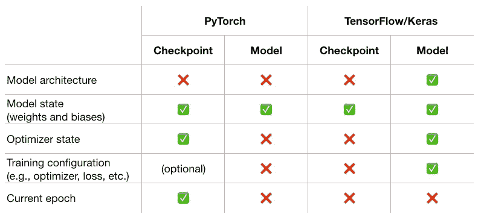

# 如何在 Python 中保存和加载神经网络

> 原文：[`towardsdatascience.com/how-to-save-and-load-your-neural-networks-in-python-cb2063c4a7bd`](https://towardsdatascience.com/how-to-save-and-load-your-neural-networks-in-python-cb2063c4a7bd)

## 保存和加载 PyTorch 和 TensorFlow/Keras 中的检查点和整个深度学习模型的完整指南

[](https://medium.com/@iamleonie?source=post_page-----cb2063c4a7bd--------------------------------)[](https://towardsdatascience.com/?source=post_page-----cb2063c4a7bd--------------------------------) [Leonie Monigatti](https://medium.com/@iamleonie?source=post_page-----cb2063c4a7bd--------------------------------)

·发布在 [Towards Data Science](https://towardsdatascience.com/?source=post_page-----cb2063c4a7bd--------------------------------) ·8 分钟阅读·2023 年 4 月 5 日

--


如何在 PyTorch 和 TensorFlow/Keras 中保存和加载神经网络（图片由作者绘制）

训练神经网络通常需要大量时间和计算资源。如果在投入了这些时间和计算后丢失模型，那将是非常遗憾的。

这就是为什么你应该能够根据用例在不同阶段（训练中或训练完成后）保存和加载深度学习模型的原因：

+   保存和加载模型检查点 — 在中断时恢复训练进度或选择最佳检查点

+   保存和加载整个深度学习模型 — 用于 [模型版本控制](https://medium.com/@iamleonie/intro-to-mlops-data-and-model-versioning-fa623c220966)、部署和推断

+   最佳检查点选择 — 用于 [模型版本控制](https://medium.com/@iamleonie/intro-to-mlops-data-and-model-versioning-fa623c220966)、部署和推断

本文介绍了如何为两个主要深度学习框架保存和加载检查点和整个模型：

+   PyTorch

```py
import torch
```

+   TensorFlow/Keras

```py
import tensorflow as tf
from tensorflow import keras
```

一般来说，当加载保存的模型时，**确保使用的框架版本与保存模型时使用的版本相匹配是很重要的。**

```py
print('PyTorch version:', torch.__version__)

print('TensorFlow version:', tf.__version__)
print('Keras version:', keras.__version__)
```

这在将模型迁移到不同的机器或环境时尤为重要。因此，在保存和版本化模型时，存储框架的版本作为元数据是很重要的。

[](https://medium.com/@iamleonie/intro-to-mlops-data-and-model-versioning-fa623c220966?source=post_page-----cb2063c4a7bd--------------------------------) [## MLOps 入门：数据和模型版本控制

### 为什么机器学习中的版本控制必须超越源代码，涵盖数据集和机器学习模型以确保可追溯性……

[medium.com](https://medium.com/@iamleonie/intro-to-mlops-data-and-model-versioning-fa623c220966?source=post_page-----cb2063c4a7bd--------------------------------)

# 如何保存和加载模型检查点

检查点功能对于在训练期间指定时间保存模型非常有用。这类似于在视频游戏中保存进度。它确保你无需从头开始，可以在出现问题时从检查点恢复。


[运动插图来自 Storyset](https://storyset.com/sport)

## 在 PyTorch 中保存和加载模型检查点

PyTorch 检查点包含以下组件[2]：

+   模型状态（权重和偏差）

+   优化器状态

+   训练步骤或纪元

+   你选择保存的任何额外信息（例如，训练配置，如优化器、指标或当前训练损失）

PyTorch 模型通常以 PyTorch 二进制格式（`.pt`或`.pth`）保存。虽然这两种文件扩展名之间没有区别，但开发者社区[3] **建议使用** `**.pt**` **文件扩展名**而不是`.pth`文件扩展名，因为后者与 Python 路径配置文件的文件扩展名冲突。

你可以使用以下代码片段在 PyTorch 中**保存训练检查点**（`checkpoint_1.pt`、`checkpoint_2.pt`等）：

```py
# Define your model
model = ...
optimizer = ...
criterion = ...

# Train the model
for epoch in range(num_epochs):
    # Train the model for one epoch
    ...

    # Save a checkpoint after each epoch
    PATH = f'checkpoint_{epoch}.pt'
    torch.save({
                'epoch': epoch,
                'model_state_dict': model.state_dict(),
                'optimizer_state_dict': optimizer.state_dict(),
                'train_loss': train_loss,
                }, 
                PATH)
```

你可以使用以下代码片段在 PyTorch 中**加载训练检查点**（例如`checkpoint_3.pt`）。确保：

+   在继续模型训练之前设置`model.train()`

+   继续仅在剩余的纪元中进行训练（`for epoch in range(epoch+1, num_epochs)`）。

```py
# Define your model
model = ...
optimizer = ...
criterion = ...

# Load a saved checkpoint
checkpoint = torch.load('checkpoint_3.pt')
epoch = checkpoint['epoch']
model.load_state_dict(checkpoint['model_state_dict'])
optimizer.load_state_dict(checkpoint['optimizer_state_dict'])

# Set dropout and batch normalization layers to train mode
model.train()

# Resume training the model for the remaining epochs
for epoch in range(epoch + 1, num_epochs):
    ...
```

## 在 TensorFlow/Keras 中保存和加载模型检查点

与 PyTorch 相比，TensorFlow/Keras 中的检查点仅在检查点文件（.`ckpt`）中保存模型状态（权重和偏差）[6]。

你可以通过使用回调函数在 TensorFlow/Keras 中**保存训练检查点**（`checkpoint_1.ckpt`、`checkpoint_2.ckpt`等），如下所示：

```py
# Define and compile your model
model = ...
...
model.compile(...)

# Define the checkpoint callback that saves the model's weights at every epoch
PATH = f'checkpoint_{epoch}.ckpt'

cp_callback = tf.keras.callbacks.ModelCheckpoint(
                             filepath = PATH, 
                             save_weights_only = True, # If False, saves the full model
                             save_freq = 'epoch')

# Train the model with the checkpoint callback
model.fit(X_train,
          y_train, 
          epochs = num_epochs,
          validation_data = (X_val, y_val),
          callbacks = [cp_callback])
```

如果你不想使用回调函数，也可以使用`model.save_weights(PATH)`方法来保存模型权重。

你可以使用以下代码片段在 TensorFlow/Keras 中**加载训练检查点**（例如`checkpoint_3.pt`）。确保仅在剩余的纪元中继续训练（`num_epochs — epoch`）。

```py
# Define and compile your model
model = ...
...
model.compile(...)

# Load a saved checkpoint
epoch = 3
model = model.load_weights(PATH = f'checkpoint_{epoch}.ckpt')

# Define the checkpoint callback that saves the model's weights at every epoch
...

# Resume training the model
model.fit(X_train,
          y_train, 
          epochs = (num_epochs-epoch),
          validation_data = (X_val, y_val),
          callbacks = [cp_callback])
```

# 如何保存和加载深度学习模型

你还可以在模型训练完成时保存模型。这在你想要部署模型或推理发生在训练代码之外时非常有用。


[运动插图来自 Storyset](https://storyset.com/sport)

## 在 PyTorch 中保存和加载整个模型

与检查点相比，PyTorch 只在模型训练完成后保存模型状态（权重和偏差）[2]。

PyTorch 模型也以 PyTorch 二进制格式（` .pt` 优于`.pth` [3]）保存。

你可以使用以下代码片段在 PyTorch 中**保存训练好的模型**（`model.pt`）。确保保存 `model.state_dict()` 而不是单独保存 `model`（请参见下面的替代方案）。

```py
PATH = "model.pt"

# Define your model
model = ...

# Train the model
...

# Save the model
torch.save(model.state_dict(), PATH)
```

你可以使用以下代码片段在 PyTorch 中**加载训练好的模型**（`model.pt`）。确保：

+   在加载权重之前，创建一个相同的模型实例

+   在使用模型进行推理之前，设置 `model.eval()`

```py
# Define your model architecture
model = ...

# Load the saved model parameters into your model
model.load_state_dict(torch.load(PATH))

# Set dropout and batch normalization layers to evaluation mode before running inference
model.eval()

# Use the model for inference
# ...
```

或者，你可以如下所示保存整个模型：

```py
PATH = "model.pt"

# Define your model
model = ...

# Train the model
...

# Save the model
torch.save(model, PATH)
```

使用这种方法，你不需要在加载权重之前定义模型。

```py
# Load the saved model parameters into your model
model = torch.load(PATH)

# Set dropout and batch normalization layers to evaluation mode before running inference
model.eval()

# Use the model for inference
# ...
```

**然而，不推荐这种方法：** 这种方法不保存模型类本身。相反，它保存了包含类的文件的路径。因此，使用这种方法保存模型可能会导致在其他项目或不同源代码中重用模型时出现问题。

## 在 TensorFlow/Keras 中保存和加载整个模型

Keras 模型包含以下组件 [5, 6]：

+   模型架构包括优化器及其状态、损失和 `saved_model.pb` 中的指标

+   模型的状态（权重和偏置）在 `variables/` 目录中。

+   模型的编译信息

模型可以保存为以下文件格式 [5]：

+   **TensorFlow SavedModel 格式** — 推荐和默认格式，当没有指定其他文件扩展名时使用。

+   **HDF5 格式**（`.h5`）——一种较旧且轻量的替代方案，不保存外部损失和指标

你可以使用以下代码片段在 TensorFlow/Keras 中**保存训练好的模型**（`model`）：

```py
PATH = "model" # Will save the model in TensorFlow SavedModel format

# Define and compile your model
model = ...
...

# Train the model
...

# Save the model
model.save(PATH)
```

你可以使用以下代码片段在 TensorFlow/Keras 中**加载训练好的模型**（`model`）。

```py
# Load the saved model
model = keras.models.load_model(PATH)

# Use the model for inference
# ...
```

# 最佳检查点选择

最佳检查点选择是一种深度学习技术，它在训练期间监控验证指标（没有提前停止），并使用具有最佳验证指标的检查点进行推理。

在最近的 [关于中级深度学习技术的文章](https://medium.com/towards-data-science/intermediate-deep-learning-with-transfer-learning-f1aba5a814f) 中，我们回顾了目前似乎没有关于最佳检查点选择的最佳实践的普遍理解。虽然 [深度学习调优手册](https://github.com/google-research/tuning_playbook) [1] 推荐使用最佳检查点选择，但 Kaggle 大师们不推荐此方法，因为这种技术往往使模型过度拟合验证集 [4]。

[](/intermediate-deep-learning-with-transfer-learning-f1aba5a814f?source=post_page-----cb2063c4a7bd--------------------------------) ## 中级深度学习与迁移学习

### 针对计算机视觉和自然语言处理的深度学习模型微调的实用指南

towardsdatascience.com

尽管如此，我们将介绍如何将最佳检查点选择应用于你的深度学习管道。

## PyTorch 中的最佳检查点选择

**保存** 类似于 在 PyTorch 中保存模型检查点，但有一些变化：

+   我们 仅保存模型，但不保存训练信息，如 epoch、优化器状态等，因为我们不打算继续训练此模型。

+   在训练过程中手动添加验证指标的监控

```py
# Define your model
model = ...
optimizer = ...
criterion = ...

# Train the model
for epoch in range(num_epochs):
    # Train the model for one epoch
    ...

    if (best_metric < current_metric):
      best_metric = current_metric

      # Save a checkpoint after each epoch
      PATH = f'checkpoint_{epoch}.pt'

      # Save the model
      torch.save(model.state_dict(), PATH)
```

**加载** 等同于 在 PyTorch 中加载整个模型。

## TensorFlow/Keras 中的最佳检查点选择

**保存** 类似于 在 TensorFlow/Keras 中保存模型检查点，但有一些变化：

+   使用 `save_weights_only = True` 保存整个模型

+   从 `PATH` 中移除 `.ckpt` 以将模型保存为 SavedModel 格式

+   添加 `monitor` 和 `save_best_only` 参数

```py
# Define and compile your model
model = ...
...
model.compile(...)

# Define the checkpoint callback that saves the model's weights at every epoch
PATH = f'./checkpoints/checkpoint_{epoch}' # Remove .ckpt to save as SavedModel format
cp_callback = tf.keras.callbacks.ModelCheckpoint(
                              filepath = PATH, 
                              monitor = "val_acc", # Metric to monitor for best checkpoint picking
                              save_best_only = True,                             
                              save_weights_only = True, 
                              save_freq = 'epoch')

# Train the model with the checkpoint callback
model.fit(X_train,
          y_train, 
          epochs = num_epochs,
          validation_data = (X_val, y_val),
          callbacks = [cp_callback])
```

**加载** 等同于 在 TensorFlow/Keras 中加载整个模型。

# 总结

本文回顾了在深度学习框架 PyTorch 和 TensorFlow/Keras 中保存和加载神经网络的不同用例。下文展示了 PyTorch 和 Keras 之间的比较概述。



PyTorch 与 TensorFlow/Keras 中保存深度学习检查点或模型时的概述（图像由作者提供）

+   **模型架构：** 在 PyTorch 中，模型架构从未保存，因此还必须通过某些源代码版本控制进行保存。在 TensorFlow/Keras 中，当你保存整个模型时，模型架构会被保存。

+   **模型权重：** PyTorch 和 TensorFlow/Keras 都可以仅保存模型权重。然而，在 PyTorch 中，这是在保存最终训练模型时完成的，而在 TensorFlow/Keras 中，这适用于检查点保存。

# 喜欢这个故事吗？

[*免费订阅*](https://medium.com/subscribe/@iamleonie) *以便在我发布新故事时收到通知。*

[](https://medium.com/@iamleonie/subscribe?source=post_page-----cb2063c4a7bd--------------------------------) [## 每当 Leoni Monigatti 发布时接收电子邮件。

### 每当 Leoni Monigatti 发布时接收电子邮件。通过注册，如果你还没有，你将创建一个 Medium 账户……

medium.com](https://medium.com/@iamleonie/subscribe?source=post_page-----cb2063c4a7bd--------------------------------)

*在* [*LinkedIn*](https://www.linkedin.com/in/804250ab/)，[*Twitter*](https://twitter.com/helloiamleonie)* 和* [*Kaggle*](https://www.kaggle.com/iamleonie)*上找到我！*

# 参考资料

[1] V. Godbole, G. E. Dahl, J. Gilmer, C. J. Shallue 和 Z. Nado (2023). [深度学习调优手册](https://github.com/google-research/tuning_playbook) (第 1.0 版) (访问日期：2023 年 2 月 3 日)

[2] M. Inkawhich for PyTorch (2023). [保存和加载模型](https://pytorch.org/tutorials/beginner/saving_loading_models.html) (访问日期：2023 年 3 月 27 日)。

[3] [kmario23](https://stackoverflow.com/users/2956066/kmario23) 在 Stackoverflow (2019)。[PyTorch 中 .pt、.pth 和 .pwf 扩展名之间有什么区别？](https://stackoverflow.com/questions/59095824/what-is-the-difference-between-pt-pth-and-pwf-extentions-in-pytorch)（访问日期：2023 年 3 月 27 日）。

[4] P. Singer 和 Y. Babakhin (2022)。[深度迁移学习实用技巧](https://drive.google.com/drive/folders/1VtJF-zPbXc-V-UDl2bDgWJp05DnKZpQH) 于 2022 年 11 月在 Kaggle Days Paris 上介绍。

[5] TensorFlow (2023)。[指南：保存和加载 Keras 模型](https://www.tensorflow.org/guide/keras/save_and_serialize)（访问日期：2023 年 3 月 27 日）。

[6] TensorFlow (2023)。[教程：保存和加载模型](https://www.tensorflow.org/tutorials/keras/save_and_load)（访问日期：2023 年 3 月 27 日）。
