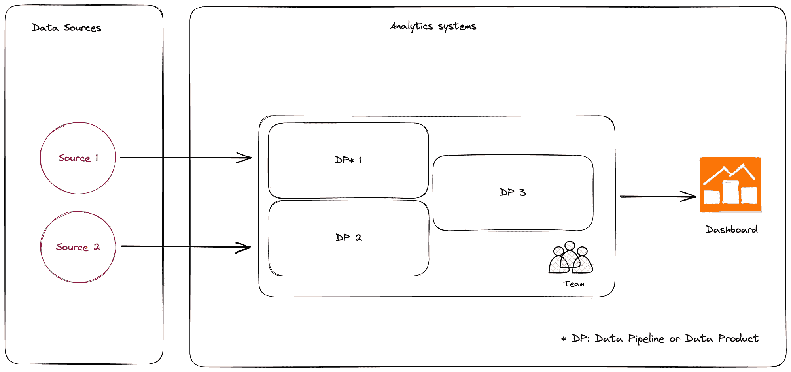
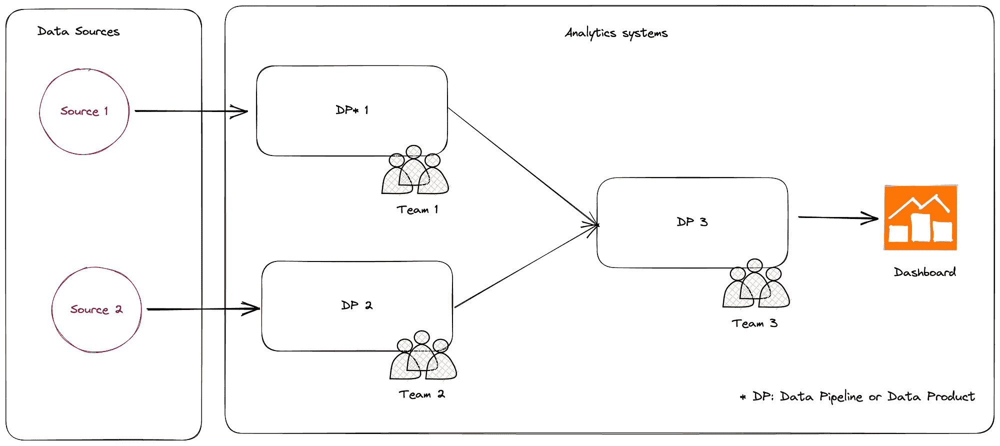
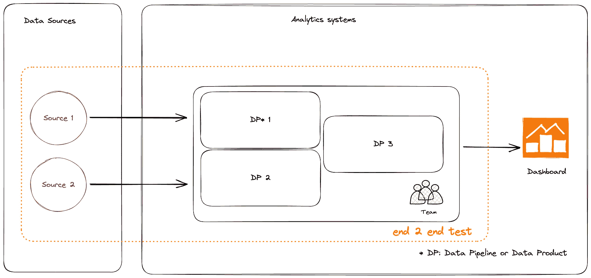
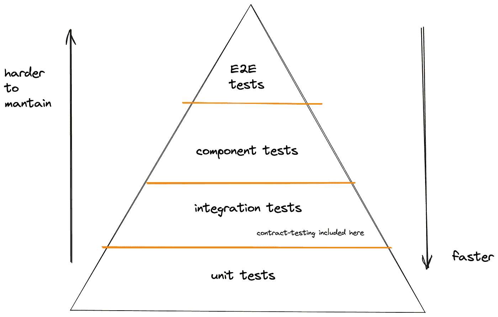
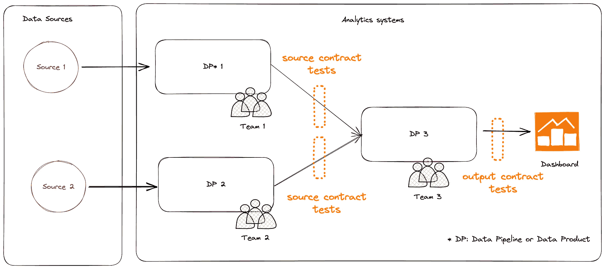
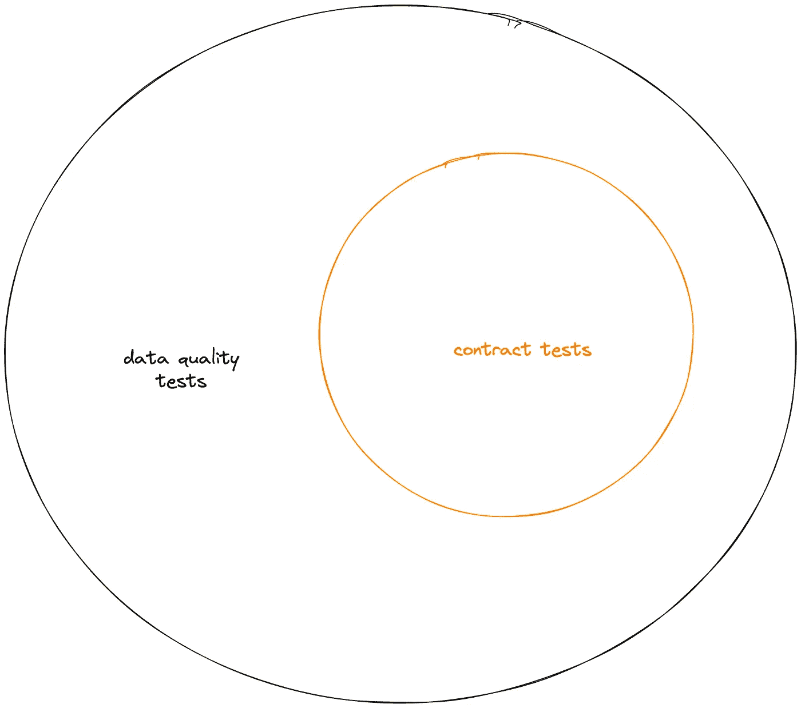
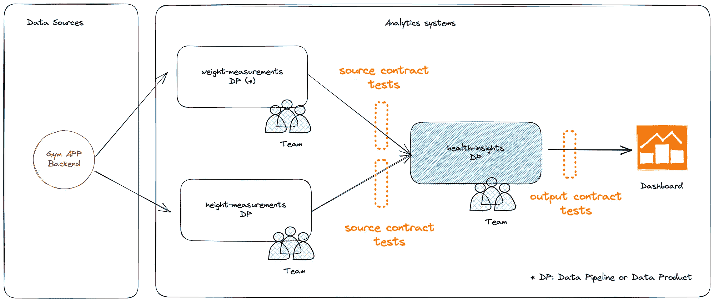
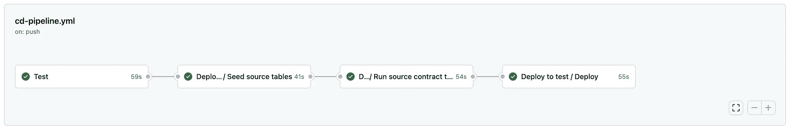

# 完整指南：如何通过合同测试和 dbt 有效地扩展你的数据管道和数据产品

> 原文：[`towardsdatascience.com/how-to-scale-your-data-pipelines-and-data-products-with-dbt-and-contract-testing-10c92ea9a443?source=collection_archive---------2-----------------------#2023-10-25`](https://towardsdatascience.com/how-to-scale-your-data-pipelines-and-data-products-with-dbt-and-contract-testing-10c92ea9a443?source=collection_archive---------2-----------------------#2023-10-25)

## 开始使用 dbt 实施合同测试所需了解的一切

[](https://medium.com/@pablo.porto?source=post_page-----10c92ea9a443--------------------------------)[](https://towardsdatascience.com/?source=post_page-----10c92ea9a443--------------------------------) [Pablo Porto](https://medium.com/@pablo.porto?source=post_page-----10c92ea9a443--------------------------------)

·

[关注](https://medium.com/m/signin?actionUrl=https%3A%2F%2Fmedium.com%2F_%2Fsubscribe%2Fuser%2Fa6f9bc7e34a6&operation=register&redirect=https%3A%2F%2Ftowardsdatascience.com%2Fhow-to-scale-your-data-pipelines-and-data-products-with-dbt-and-contract-testing-10c92ea9a443&user=Pablo+Porto&userId=a6f9bc7e34a6&source=post_page-a6f9bc7e34a6----10c92ea9a443---------------------post_header-----------) 发表在 [Towards Data Science](https://towardsdatascience.com/?source=post_page-----10c92ea9a443--------------------------------) ·11 min read·2023 年 10 月 25 日

--

[](https://medium.com/m/signin?actionUrl=https%3A%2F%2Fmedium.com%2F_%2Fbookmark%2Fp%2F10c92ea9a443&operation=register&redirect=https%3A%2F%2Ftowardsdatascience.com%2Fhow-to-scale-your-data-pipelines-and-data-products-with-dbt-and-contract-testing-10c92ea9a443&source=-----10c92ea9a443---------------------bookmark_footer-----------)

图片由 [Jonas Gerg](https://unsplash.com/@walamana?utm_source=medium&utm_medium=referral) 提供，来源于 [Unsplash](https://unsplash.com/?utm_source=medium&utm_medium=referral)

让我讲一个关于数据管理系统和规模的故事，这个故事如果你是一名数据或分析工程师，可能会引起你的共鸣，尤其是在 2023 年尽力做到最好时。

不久之前，几乎所有的数据架构和数据团队结构都遵循了[集中式方法](https://www.getdbt.com/data-teams/centralized-vs-decentralized#the-centralized-model)。作为数据或分析工程师，你知道在哪里找到所有的转换逻辑和模型，因为它们都在同一个代码库中。你可能与你的同事紧密合作，那个同事负责构建你所使用的数据管道。数据团队只有一个，最多两个。

这种方法对于数据源和用例有限的小型组织和初创公司是有效的。它也适用于那些没有完全专注于从数据中提取价值的大型企业。然而，随着组织优先考虑数据驱动，有了更多的机器学习、分析和商业智能数据用例的需求。 



由一个团队开发和维护的集中式数据架构

用例和数据源的激增增加了管理数据的复杂性和创建与维护数据系统所需的人数。为了满足这些需求，你公司最新版本的数据策略可能已经转向去中心化。这包括组建去中心化的数据团队和采用像[数据网格](https://martinfowler.com/articles/data-mesh-principles.html)这样的去中心化数据架构。

去中心化允许组织扩展数据管理，但带来了确保不同组件协调的新挑战，例如由各个团队开发和管理的数据产品和管道。

在这种架构和组织结构中，往往不清楚每个组件的负责人，导致问题和责任推诿。团队之间的集成点数量也增加，维护不同组件之间的工作接口变得更加困难。



多团队和多个组件的去中心化数据架构

**如果你能认同这种情况，你并不孤单。你的组织可能正在经历数据去中心化的过程。** 为了应对这一过渡，我们可以借鉴在运营世界中成功实施去中心化和分布式架构（如微服务）的经验。他们是如何做到的？他们如何在那个规模下提供可靠的系统？好吧，他们**利用了现代测试技术**。

> “多年来，软件工程成功地采纳了由‘两块披萨团队’完成的小工作单元的概念。每个团队负责自己在较大系统中的组件。团队通过明确、版本化的接口进行集成。遗憾的是，数据还未跟上软件的步伐。单体数据架构仍然是常态——尽管存在明显的缺陷。” — [dbt labs](https://www.getdbt.com/blog/what-is-data-mesh-the-definition-and-importance-of-data-mesh)

在本文中，我将介绍其中的一种技术：合同测试。我将展示 **如何使用** [**dbt**](https://www.getdbt.com/product/what-is-dbt) **来为你的上游源和 dbt 模型的公开接口创建简单的合同测试**。这种类型的测试将帮助你保持理智，因为你的 dbt 应用程序变得越来越复杂和分散。

# 但是……什么是合同测试？

当一个分布式系统开始成长为由多个团队开发的多个组件时，团队可能首先尝试的验证系统行为是否符合预期的方法是 **实施端到端测试来测试整个系统**。



端到端测试范围侧重于验证系统整体

端到端测试由于其复杂性、反馈缓慢以及维护和协调的难度，往往变得非常难以使用。

这在大规模实施微服务的操作世界中也是如此。当作为整体测试系统不是一个选项时，工程团队开始实施不同的方法，例如合同测试。

> ***“集成合同测试是在外部服务的边界进行的测试，以验证其是否符合消费者服务所期望的合同。”* —** [托比·克莱姆森](https://martinfowler.com/articles/microservice-testing/#testing-contract-introduction)

团队仍然可以保留一小部分端到端测试，但他们通过使用更快速、更可靠的测试如合同测试、组件测试和单元测试来向下移动测试金字塔。

不同测试类型的权衡通常通过测试金字塔可视化。我在之前的文章中提到过这个概念，关于 为 dbt 模型实施单元测试。



[操作系统的典型测试金字塔](https://martinfowler.com/articles/practical-test-pyramid.html)

如果我们将相同的概念应用于数据管理系统，可以为 dbt 应用程序实施合同测试，以验证两种类型接口的行为：

+   上游源。

+   公开接口，例如 marts 和输出端口。



合同测试范围

## 数据系统的合同测试的好处

正如我们所见，数据架构变得越来越复杂和分散，就像之前的操作服务一样。随着这种类型的系统不断扩展，运行可维护和有效的端到端测试套件的能力逐渐减弱。

合同测试通过提供多个优势，成为管理不同情况的强大盟友：

+   减少验证系统行为所需的端到端测试数量。这将导致更快的反馈和更低的维护成本。

+   通过为团队公共接口提供明确的期望，管理在同一代码库中工作的不同数据团队的复杂性。

+   在低环境中发现组件之间的集成问题，确保它们在生产环境中出现之前得到解决。

+   在不同的数据管道或数据产品之间定义和记录更明确的接口。

## 合同测试与数据质量测试

你可能在想，但……合同测试的概念听起来像我们已经在数据管道中运行的质量测试。

这是一个合理的观察，因为合同测试与数据质量测试之间的界限模糊。我喜欢将合同测试视为现代数据测试策略中的质量测试的一个子集。



合同测试可以视为质量测试的一个子集

区别在于**合同测试关注于模式和约束，而数据质量测试关注于实际数据及其特征**。让我们看一些例子。

**合同测试范围：**

+   检查列类型。

+   检查模式级别的预期约束，如主键和外键、非空列。

+   检查给定列的接受值。

+   检查给定列的有效范围。

**质量测试范围：**

+   评估完整性，例如列中非空值的百分比。

+   评估唯一性，例如非唯一行的数量。

+   评估一致性，例如源中的所有用户标识符是否都包含在输出中。

# 实施我们的第一个合同测试

好了，理论够多了，让我们通过一个简单的示例开始实际操作。我们有一个叫做**health-insights**的 dbt 应用程序，它从上游数据源获取体重和身高数据，并计算体质指数指标。

我们来自出色的后台团队的同事负责生成我们需要的体重和身高数据，以构建我们的 health-insights 应用程序。他们在一个有点忙碌和压力的不同团队工作。有时他们未能通知我们模式的更改。为了测试这些上游接口中的变化，我们决定创建第一个源合同测试。



我们示例的系统架构

首先，我们需要添加两个新的 dbt 包，[dbt-expectations](https://github.com/calogica/dbt-expectations)和 dbt-utils，这将允许我们对源的模式和接受的值进行断言。

```py
# packages.yml

packages:
  - package: dbt-labs/dbt_utils
    version: 1.1.1

  - package: calogica/dbt_expectations
    version: 0.8.5
```

## 测试数据源

让我们开始为我们的第一个源定义合同测试。我们从**raw_height**表中提取数据，该表包含来自健身应用程序用户的身高信息。

我们与数据生产者达成一致，我们将接收身高测量值、测量单位和用户 ID。我们同意数据类型，并且仅支持‘cm’和‘inches’作为单位。基于这些信息，我们可以在 dbt 源 YAML 文件中定义我们的第一个合同。

## 基础构件

查看前面的测试，我们可以看到几个正在使用的 dbt-unit-testing 宏：

+   **dbt_expectations.expect_column_values_to_be_of_type：** 这个断言允许我们定义预期的列数据类型。

+   **accepted_values：** 这个断言允许我们定义特定列的接受值列表。

+   **dbt_utils.accepted_range：** 这个断言允许我们为给定列定义一个数值范围。在示例中，我们期望该列的值不小于 0。

+   **not null：** 最后，像‘not null’这样的内置断言允许我们定义列约束。

使用这些构建块，我们添加了几个测试来定义上述合同期望。注意我们如何将测试标记为“contract-test-source”。这个标签允许我们在本地和之后在 CI/CD 管道中隔离地运行所有合同测试：

```py
dbt test --select tag:contract-test-source
```

# 为 marts 和输出端口实现合同测试

我们已经看到如何快速创建 dbt 应用的源的合同测试，但我们的数据管道或数据产品的公共接口呢？

作为数据生产者，我们希望确保我们按照数据消费者的期望生产数据，以便满足我们与他们的合同，并且[使我们的数据管道或数据产品可信赖和可靠](https://www.thoughtworks.com/en-es/insights/blog/data-strategy/building-an-amazon-com-for-your-data-products)。

确保我们履行对数据消费者义务的简单方法是为我们的公共接口添加合同测试。

Dbt [最近发布了一个新特性](https://docs.getdbt.com/docs/collaborate/govern/model-contracts)，**model contracts**，它允许为 dbt 模型定义合同。在构建模型时，**dbt 将验证模型的转换是否生成与其合同匹配的数据集，否则将构建失败。**

让我们看看实际操作。我们的 mart，**body_mass_indexes**，从我们从源头获取的体重和身高数据中生成一个 BMI 指标。我们与供应商的合同规定了以下内容：

+   每列的数据类型。

+   用户 ID 不能为 null

+   用户 ID 总是大于 0

让我们使用 dbt 模型合同定义 body_mass_indexes 模型的合同：

## 构建块

查看前面的模型规范文件，我们可以看到几个允许我们定义合同的元数据。

+   **contract.enforced：** 这个配置告诉 dbt 我们希望在每次运行模型时强制执行合同。

+   **data_type：** 这个断言允许我们定义模型运行后预期生成的列类型。

+   **约束：** 最后，约束块给了我们定义有用约束的机会，比如某列不能为 null，设置主键和自定义表达式。在上面的示例中，我们定义了一个约束，告诉 dbt 用户 ID 必须始终大于 0。你可以在[这里](https://docs.getdbt.com/reference/resource-properties/constraints)查看所有可用的约束。

## 源合同测试与 dbt 模型合同

我们为源定义的合同测试与为 marts 或输出端口定义的合同测试之间的区别在于**合同何时被验证和强制执行。**

Dbt 在‘dbt run’生成模型时强制执行[模型合同](https://docs.getdbt.com/docs/collaborate/govern/model-contracts)，而基于[dbt 测试](https://docs.getdbt.com/docs/build/tests)的合同在 dbt 测试运行时被强制执行。

如果某个模型合同没有得到满足，当你执行‘dbt run’时会看到一个错误，并且会提供失败的具体细节。你可以在以下 dbt 运行控制台输出中查看一个示例。

```py
1 of 4 START sql table model dbt_testing_example.stg_gym_app__height ........... [RUN]
2 of 4 START sql table model dbt_testing_example.stg_gym_app__weight ........... [RUN]
2 of 4 OK created sql table model dbt_testing_example.stg_gym_app__weight ...... [SELECT 4 in 0.88s]
1 of 4 OK created sql table model dbt_testing_example.stg_gym_app__height ...... [SELECT 4 in 0.92s]
3 of 4 START sql table model dbt_testing_example.int_weight_measurements_with_latest_height  [RUN]
3 of 4 OK created sql table model dbt_testing_example.int_weight_measurements_with_latest_height  [SELECT 4 in 0.96s]
4 of 4 START sql table model dbt_testing_example.body_mass_indexes ............. [RUN]
4 of 4 ERROR creating sql table model dbt_testing_example.body_mass_indexes .... [ERROR in 0.77s]

Finished running 4 table models in 0 hours 0 minutes and 6.28 seconds (6.28s).

Completed with 1 error and 0 warnings:

Database Error in model body_mass_indexes (models/marts/body_mass_indexes.sql)
  new row for relation "body_mass_indexes__dbt_tmp" violates check constraint 
  "body_mass_indexes__dbt_tmp_user_id_check1"
  DETAIL:  Failing row contains (1, 2009-07-01, 82.5, null, null).
  compiled Code at target/run/dbt_testing_example/models/marts/body_mass_indexes.sql
```

# 在管道中运行合同测试

到目前为止，我们有了一套强大的合同测试套件，但我们如何以及何时运行它们？

我们可以在两种类型的管道中运行合同测试。

+   **CI/CD 管道**

+   **数据管道**

例如，你可以在**CI/CD 管道**中按照计划执行源合同测试，目标是像测试或预生产这样的低环境中的数据源。你可以设置管道，以便每次合同不符合时管道会失败。

这些失败提供了关于其他团队在这些变化到达生产环境之前引入的违反合同的变化的宝贵信息。



[Github Actions 中的 dbt CI/CD 管道示例](https://github.com/portovep/dbt-unit-testing-examples/actions/workflows/cd-pipeline.yml)

每次通过 CI/CD 管道部署新变化时，你也可以运行你的输出端口/mart 合同测试。由于 dbt 模型合同在每次模型构建时都会被检查，因此你可以告诉 dbt 强制执行合同，以便如果新模型变化引入了合同中的破坏性变化，你的团队会在数据消费者受到影响之前得到通知。

最后，你还可以在**生产环境中的数据管道**中运行源和输出端口/mart 合同测试。在生产环境中运行合同测试可以帮助你的团队了解数据管道是否因上游依赖项破坏了合同而失败，或是因为你生产的数据没有满足与下游消费者的合同。

# 开始的附加提示

+   从小开始，测试那些更脆弱、更容易失败的集成点。

+   在实施合同测试时应用[宽容读者模式](https://martinfowler.com/bliki/TolerantReader.html)。仅对你需要的数据进行断言。

+   根据你的需求调整合同测试的行为，你可以配置[**严重性属性**](https://docs.getdbt.com/reference/resource-configs/severity)以使其产生响亮的失败或仅发出警告。

+   将这些类型的测试[与现代数据可观测性工具如 Montecarlo](https://docs.getmontecarlo.com/docs/dbt-failures-are-monte-carlo-incidents)集成，使其成为你事件管理过程的一部分。

+   **即使你的数据系统不是使用 dbt 开发的，也要利用 dbt 合同测试**。你仍然可以在 dbt 中定义源合同测试，并在使用其他框架或纯 SQL 创建的表或文件上执行这些测试。

+   考虑更高级的合同测试技术如[消费者驱动的合同](https://www.martinfowler.com/articles/consumerDrivenContracts.html)可能会让在特定背景下实施合同测试变得更容易。

# 结论

我们已经看到数据系统的测试策略如何通过合同测试等测试技术受益，随着这些系统变得更加去中心化和复杂。

我们还看到了如何利用 dbt 内置功能和额外的 dbt 包开始实施合同测试。我们将这种测试应用于两个集成点：上游数据源和数据集市/输出端口。

我希望这篇文章能为你和你的团队提供所有工具和技巧，以**在数据系统扩展以满足新的数据用例时开始实施合同测试**。如果你感兴趣，可以查看[这个 Github 仓库](https://github.com/portovep/dbt-testing-examples)中的示例 dbt 应用程序的源代码。

你准备好开始你的合同测试之旅了吗？我很想听听你的想法和经验。

*这篇文章是我在写的一系列关于* [*测试数据管道和数据产品*](https://medium.com/@pablo.porto/list/testing-data-products-and-data-pipelines-with-dbt-52eaff0e92dd) *的文章中的一部分。*

*我总是期待认识新的人。如果你想联系我，你可以在* [*Linkedin*](https://www.linkedin.com/in/pabloportoveloso/)*、* [*Github*](https://github.com/portovep)*、* [*Instagram*](https://www.instagram.com/porto.vga/)、[*Substack*](https://pabsgarage.substack.com/)*或* [*我的个人网站*](https://pabloporto.me)上找到我。

*感谢我的 Thoughtworks 同事 Arne、Manisha 和 David 抽时间审阅这篇文章的早期版本。感谢* [*dbt-expectations 包*](https://github.com/calogica/dbt-expectations) *的维护者们的伟大工作。*

*除非另有说明，否则所有图片均由作者提供。*
