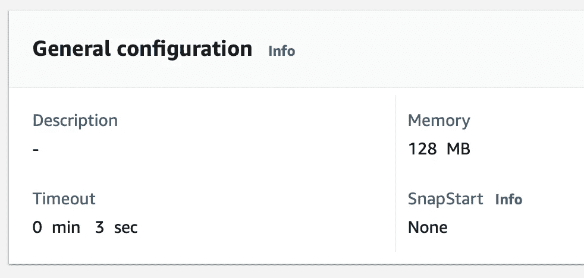

# 如何使用 AWS Lambda 为数据科学设置一个简单的 ETL 流水线

> 原文：[`towardsdatascience.com/how-to-setup-a-simple-etl-pipeline-with-aws-lambda-for-data-science-89e5b96c7017`](https://towardsdatascience.com/how-to-setup-a-simple-etl-pipeline-with-aws-lambda-for-data-science-89e5b96c7017)

## 如何使用 AWS Lambda 设置一个简单的 ETL 流水线，该流水线可以通过 API 端点或计划触发，并将结果写入 S3 桶中进行摄取

[](https://medium.com/@broepke?source=post_page-----89e5b96c7017--------------------------------)[](https://towardsdatascience.com/?source=post_page-----89e5b96c7017--------------------------------) [Brian Roepke](https://medium.com/@broepke?source=post_page-----89e5b96c7017--------------------------------)

·发表于 [Towards Data Science](https://towardsdatascience.com/?source=post_page-----89e5b96c7017--------------------------------) ·10 分钟阅读·2023 年 2 月 4 日

--


图片来源 [Rod Long](https://unsplash.com/@rodlong?utm_source=medium&utm_medium=referral) 于 [Unsplash](https://unsplash.com/?utm_source=medium&utm_medium=referral)

# **AWS Lambda 的 ETL 简介**

当你需要构建 ETL 流水线时，有许多选择。你可以使用像 [Astronomer](https://www.dataknowsall.com/astrointro.html) 或 [Prefect](http://prefect.io) 这样的工具进行编排，但你还需要有地方来运行计算。对此，你有几个选择：

+   类似 AWS EC2 的虚拟机（VM）

+   类似 AWS ECS 或 AWS Fargate 的容器服务

+   类似 AWS EMR（弹性映射减少）的 Apache Spark

+   无服务器计算，如 AWS Lambda

每种选择都有其优点。如果你追求设置、维护和成本上的简便，可以使用**AWS Lambda**或无服务器计算来运行*简单*的任务。

注意，我说的是**简单**。AWS Lambda 不适合计算密集型或长时间运行的任务。它们适合执行耗时几分钟而非几小时的小量代码。

# 什么是 AWS Lambda 和无服务器计算？

AWS 中的 Lambda 函数是一段响应事件的代码。事件可以是对 API 端点的请求、文件上传到 S3 桶中，或计划事件。代码被执行，结果被返回。以下是 [AWS](https://docs.aws.amazon.com/lambda/latest/dg/welcome.html) 对其工作原理的很好的描述：

> *Lambda 仅在需要时运行你的函数，并自动扩展，从每天几次请求到每秒几千次。你只需为你消耗的计算时间付费——当你的代码没有运行时不会收费。更多信息，请参见 AWS Lambda 定价。*

Lambda 函数是一种很好的方式，用于考虑需要频繁运行的小型 ETL 作业。例如在触发时，如 API 调用，或按照计划每晚运行。它还允许你协调多个 Lambda 函数，以创建更复杂的 ETL 管道。

让我们深入创建第一个 Lambda 函数。

# 创建你的 Lambda 函数

从 AWS 控制台中，导航到 Lambda 服务。点击**创建函数**按钮开始。系统会提示你选择一个蓝图。对于这个例子，我们将选择**从头开始创建**。给你的名称一个合适的名字，并选择**Python 3.9**作为运行时。选择你偏好的**架构**或通常在本地开发的架构；这使得上传与 Lambda 函数兼容的新库更容易。


作者提供的图片

你可以创建一个**新角色**或选择一个**现有的角色**。我们将在下一节中讲解。

# Lambda 角色

创建 Lambda 函数的一个关键部分是**角色**。**角色**允许函数访问其他 AWS 服务。对于这个例子，我们需要授予函数访问**Lambda**和**S3**的权限。我还授予了**VPC**访问权限，但这个设置中并不是必要的。

创建新角色是一个好习惯，这可以帮助你隔离仅需要的权限。如果你要为 ETL 用例创建多个 Lambda 函数，可以考虑更通用的名称，如**Lambda-ETL-Role**。


作者提供的图片

# 设置函数的超时时间

接下来是配置函数的超时时间。根据函数执行所需的时间，你可以将其增加到 15 分钟。对于这个例子，我们将其设置为**1 分钟**。你可以在 CloudWatch 日志中查看是否达到了超时。

点击**配置**选项卡，在**常规配置**下，将超时时间设置为 1 分钟。



作者提供的图片

# 使用参数和密钥扩展

接下来——这并不是 100% 必要的，但当你想确保安全地处理敏感数据而不在代码中暴露它时，这是一个很好的做法。过去，我写过关于如何使用[环境变量](https://www.dataknowsall.com/envvar.html)来在本地实现这一点；然而，在 AWS 中，我们将使用**参数和密钥扩展**。

**参数和密钥扩展**允许你将敏感数据存储在 AWS Secrets Manager 中，并在 Lambda 函数中访问这些数据，这是一种存储 API 密钥、数据库凭证等的好方法。你也可以用它来存储非敏感数据，如配置设置。你可以在这里了解更多关于此功能的信息：[配置 Secrets Manager](https://docs.aws.amazon.com/secretsmanager/latest/userguide/retrieving-secrets_lambda.html)

我们将通过添加一个层到我们的 Lambda 函数开始，这样我们就可以访问扩展。从**代码**标签页，滚动到最底部并点击**添加层**。选择**AWS 层**，然后选择**AWS-Parameters-and-Secrets-Lambda-Extension-Arm64**和该层的最新版本。


接下来，我们需要添加代码来帮助我们访问秘密。我将其添加到一个小函数中，该函数将查找我的**API 密钥**以获取 [The Movie Database](https://www.themoviedb.org) (TMDB) 并返回它。你可以在下面看到完整代码。TMDB 是一个获取电影和电视节目信息的绝佳 API，且对于非商业用途免费使用。

如下所示，我们将创建一个`headers`变量，其中包含 JSON 对象。然后将其传递到我们对**secrets_extension_endpoint**的 API 调用中。响应将是一个包含秘密字符串的 JSON 对象。我们将解析该字符串并返回 API 密钥。

在我的代码中显示**<< your secrets ARN >>**的地方，你需要将其替换为你的**ARN**。你可以在**AWS Secrets Manager 控制台**中找到它。

**注意：** *你需要回到并修改你的角色，以允许访问你创建的秘密。你可以在* [*AWS 文档*](https://docs.aws.amazon.com/secretsmanager/latest/userguide/auth-and-access_examples.html)*中找到如何做的说明。请按照“示例读取一个秘密（附加到身份）”部分中的示例操作。*

```py
import requests
import json

def get_tmdb_api_key():

 headers = {"X-Aws-Parameters-Secrets-Token": os.environ.get("AWS_SESSION_TOKEN")}

 secrets_extension_endpoint = (
 "http://localhost:"
 + "2773"
 + "/secretsmanager/get?secretId="
 + "<< your secrets arn >>"
 )

 r = requests.get(secrets_extension_endpoint, headers=headers)
 secret = json.loads(r.text)["SecretString"]
 secret = json.loads(secret)
 TMDB_API_KEY = secret["TMDB_API"]

 return TMDB_API_KEY
```

# 添加对 Pandas 的支持

接下来，我们的示例以及许多其他 ETL 用例将需要使用 Pandas。我们需要在 Lambda 函数中添加一个层来支持这一点。从**代码**标签页，滚动到最底部并点击**添加层**。选择**自定义层**，然后选择**AWSSDKPandas-Python39-Arm64**和最新的层版本。

启用此层后，你可以在代码中`import pandas` *而无需* 将包上传到 Lambda 函数。


图片由作者提供

# 写入 S3 存储桶中的文件

现代数据仓库/平台中一个非常强大的工作流是直接处理 JSON 数据的能力。我们将通过将数据输出到**JSON 文件**中的**S3 存储桶**来利用这一点。

我们将创建一个函数，该函数将接收一个**DataFrame**并将其写入 S3 存储桶中的**JSON 文件**。我们将使用`boto3`库来完成这项工作。我们将使用 Pandas 的`to_json`方法创建一个 JSON 字符串，将其编码为`utf-8`，然后写入 S3 存储桶。

```py
def write_to_s3(df, type, imdb_id): 

 # Get JSON for the DataFrame
 output = json.loads(df.to_json(orient='records'))

 string = str(output)
 encoded_string = string.encode("utf-8")

 bucket_name = "lambda-tmdb"
 file_name = "out.json"
 s3_path = "output/" + type + "/" + imdb_id + "-" + type + "-" + file_name

 s3 = boto3.resource('s3')
 object = s3.Object(bucket_name, s3_path)
 object.put(Body=encoded_string)

 return "Success"
```

当我们准备将 DataFrame 输出到 S3 时，我们会调用这个函数，并传入一些参数，例如**DataFrame**本身、我们要写入的数据**类型**以及电影或电视节目的**IMDB ID**。类型在这里是为了方便，这样我们可以使用单个函数写入不同的数据类型，同时为每个电影查找创建一个唯一的文件名。

```py
write_to_s3(df_crew, "crew", imdb_id)
```

# 部署您的 Lambda 函数

部署你的函数有多种方法，其中最简单的是使用 AWS 控制台并上传一个 zip 文件。然而，在这里添加一点自动化可以简化你在代码更改时的工作。

第一步是设置 AWS CLI。你可以在 AWS 文档 [Getting started with the AWS CLI](https://docs.aws.amazon.com/cli/latest/userguide/cli-chap-getting-started.html) 中找到如何操作的说明。你需要 **创建一个新的 IAM 用户** 并赋予其适当的权限以写入 Lambda 服务。

接下来，我写了一个简单的 `bash` 脚本，可以从本地终端调用，该脚本完成所有所需的工作。一个非常重要的步骤是将你的 Python 库以正确的层级压缩，并与 zip 文件一起打包。脚本展示了更改到 `sites-packages` 目录并压缩你想保留的库内容的过程。在这里明确命名你想要的库，以免上传不必要的文件。

**注意：** *这也假设我已经创建了本地虚拟环境并且函数代码在本地。我更喜欢以这种方式构建我的 Lambdas，以便可以在 GitHub 上进行版本控制*

```py
# delete the old zip
rm tmdb-deployment-package.zip

# change the directory to the site-packages directory and zip the contents
cd venv/lib/python3.9/site-packages

# Explicitly add the tmdbsimple package folders needed for the lambda function
zip -r ../../../../tmdb-deployment-package.zip tmdbsimple tmdbsimple-2.9.1.dist-info

# change back to the root directory and add the needed python files
cd ../../../../
zip -g tmdb-deployment-package.zip lambda_function.py

# deploy to AWS Lambda
aws lambda update-function-code --function-name lambda-tmdb --zip-file fileb://tmdb-deployment-package.zip
```

在你的函数成功部署后，你可以返回控制台查看你的代码和提供的包。注意结构。这些包位于根目录的文件夹中，使它们能够像其他包一样被导入，就像你在本地开发时一样。


图片来源：作者

# 使用 API 端点触发 Lambda 函数

作为我们函数的最终步骤，我们将通过 AWS API Gateway 使用 API 端点触发它，并将函数参数作为查询字符串传递，这是一种极其强大的方式，可以触发特定事件以处理你想要的确切数据。

进入 **Configuration** 选项卡，点击 **Add Trigger** 按钮。滚动到 API Gateway 并选择 **Create New API** 选项。此外，选择 **HTTP API** 选项，并将安全设置为 **Open**。


图片来源：作者

端点创建后，你将获得一个可以触发 Lambda 的 URL。我们将传递一个 ID 列表作为查询字符串参数，使我们能够将多个 ID 传递给函数并一次性处理它们。使用查询字符串参数触发你的 API 是处理批量数据的一种非常强大的方式。

我们按如下方式构建 URL：

```py
API Gateway URL + ?ids=tt0162346&ids=tt0326900
```

现在，在我们的函数中，我们可以通过事件对象访问查询字符串参数列表，所有 Lambda 函数都会包含这个对象。我们将通过 `multiValueQueryStringParameters` 键来访问它。然后，使用我们想要访问的查询字符串参数的名称，在这种情况下是 `ids`。

```py
params = event["multiValueQueryStringParameters"]

id_list = params['ids']
```

# 使用 API Gateway 监控 Lambda 函数

默认情况下，你将获得对函数的 CloudWatch 监控。我遇到过一些错误，需要扩展日志记录。你必须在**日志格式**中添加以下内容，以适应 API 网关阶段。

```py
$context.integrationErrorMessage
```

在这里阅读完整的说明 [here](https://docs.aws.amazon.com/apigateway/latest/developerguide/http-api-troubleshooting-lambda.html)


作者提供的图片

# 函数代码

我们将把所有这些整合到最终的`lambda_handler`函数中。我们从查询字符串中检索 ID，然后调用我们的函数`get_tmdb_api_key`从密钥存储中获取 API 密钥。最后，我们循环遍历这些 ID，构建数据框，并使用`write_to_s3`函数将其写入 S3。

```py
def lambda_handler(event, context):

    # Get the IDs from the Query String
    params = event["multiValueQueryStringParameters"]
    id_list = params['ids']

    # Get credentials from Secrets Manager
    KEY = get_tmdb_api_key()

    # Loop through the IDs passed and do something with them
    for i in range(len(id_list)):

        imdb_id = id_list[i]

        # Get the movie details
        # CODE NOT SHOWN
        # Save the movie details as a dataframe

        # write it to S3
        write_to_s3(df_crew, "crew", imdb_id)

    # return a success message in the proper format for a Lambda function
    return {
        "statusCode": 200,
        "headers": {"Content-Type": "application/json"},
        "body": "Success",
    }
```

# 在数据仓库中协调和处理数据

最后的步骤是触发工作流中的 API 端点，然后处理你仓库中的数据。关于 JSON 如何与 Snowflake 协作的示例可以在我的文章[与 Snowflake 入门及云中 ELT 工作流的崛起](https://www.dataknowsall.com/snowflakestart.html)中找到，我将在未来的文章中介绍协调部分。

你可以在[GitHub](https://github.com/broepke/LambdaTMDB)上找到这个项目的完整代码

# 结论

在构建 ETL 管道时，你有许多计算选项可以选择。对于简单的任务，AWS Lambda 函数可以是丰富数据或快速高效处理的绝佳方式。我们从展示如何创建 Lambda 开始，包括设置运行它的角色。然后我们介绍了几个建议，比如利用参数和密钥扩展安全存储 API 密钥等信息。接着我们探讨了如何使用 AWS CLI 自动化部署。最后，我们通过 API 网关触发了函数，并用 CloudWatch 监控了它。我希望这篇文章能展示出 Lambda 的精彩之处，以及如何将 Lambda 添加到你的 ETL 工具包中。

*如果你喜欢阅读这样的故事并想支持我作为作者，考虑注册成为 Medium 会员。每月 5 美元，可以无限访问数千篇文章。如果你通过* [*我的链接*](https://medium.com/@broepke/membership) *注册，我将获得少量佣金，但不会额外产生费用。*
