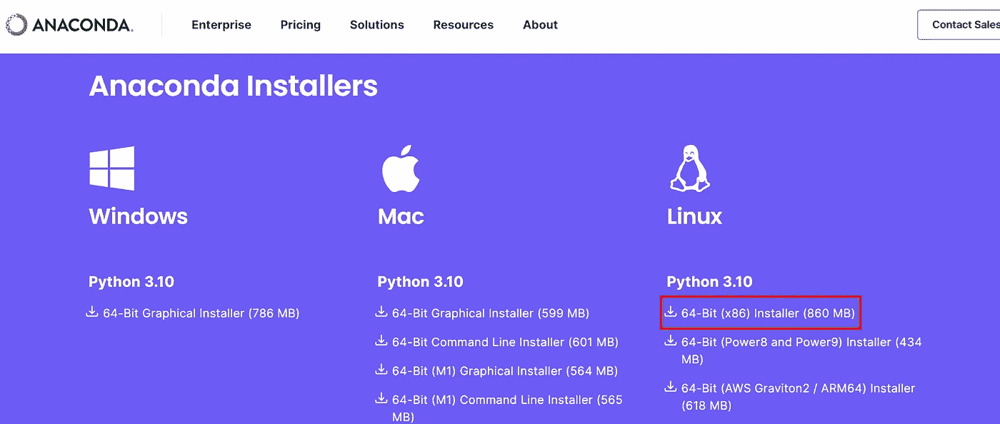
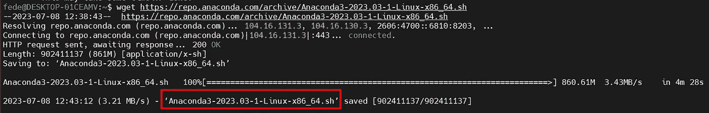
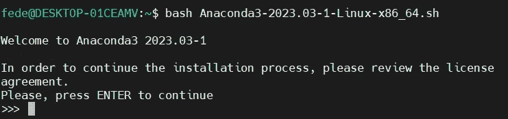
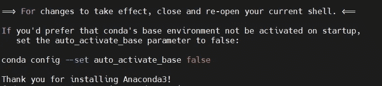
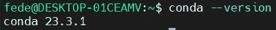

# 如何解决 Windows 上 Anaconda 的 Python 依赖问题

> 原文：[`towardsdatascience.com/how-to-solve-python-dependency-issues-with-anaconda-on-windows-d5033c9d2f9a`](https://towardsdatascience.com/how-to-solve-python-dependency-issues-with-anaconda-on-windows-d5033c9d2f9a)

## 不更改绝对路径

[](https://federicotrotta.medium.com/?source=post_page-----d5033c9d2f9a--------------------------------)[](https://towardsdatascience.com/?source=post_page-----d5033c9d2f9a--------------------------------) [Federico Trotta](https://federicotrotta.medium.com/?source=post_page-----d5033c9d2f9a--------------------------------)

·发布在 [Towards Data Science](https://towardsdatascience.com/?source=post_page-----d5033c9d2f9a--------------------------------) ·5 分钟阅读·2023 年 7 月 13 日

--


图片由 [kirill_makes_pics](https://pixabay.com/it/users/kirill_makes_pics-5203613/?utm_source=link-attribution&utm_medium=referral&utm_campaign=image&utm_content=2261021) 提供，来源于 [Pixabay](https://pixabay.com/it//?utm_source=link-attribution&utm_medium=referral&utm_campaign=image&utm_content=2261021)

最近几天，我在 Windows 机器上遇到了一些 Python 依赖问题。

我尝试安装新包进行测试。确实，它们被安装了，我可以通过 `$ pip show [library_name]` 查看所有详细信息，但当我尝试导入刚刚安装的库时，我遇到了 `import` 问题。

我在使用 Jupyter Notebooks 时遇到了这些问题，因此我认为这可能是与 Anaconda 相关的问题。这是我尝试解决问题的方法：

+   我尝试更改所有 Python（和 Anaconda）包的绝对路径，但结果导致 Anaconda 崩溃了。因此，我不得不恢复之前的绝对路径。

+   我尝试了“蛮力法”：我打开了 VS CODE，并在虚拟环境中安装了我想使用的库。结果你知道吗？我遇到了不同的依赖问题……

所以，在经过 2–3 小时的麻烦之后，我决定使用最大的蛮力方法，我有三种选择：

+   卸载并重新安装 Python 和 Anaconda，但这不会解决实际问题，原因有很多（例如，某些文件可能仍保留在当前文件夹中，这可能导致路径保持不变并产生相同的问题）。

+   在我的机器上卸载并重新安装 Windows。

+   在 Ubuntu 虚拟机上安装 Anaconda。

当然，我不想重新安装 Windows，所以我决定使用第三种方法，我将向你展示如何操作，这样你在需要时也可以使用这种方法。

最终，因为我主要使用 Python 进行数据科学，所以我想在我的 Linux 机器上安装 Anaconda，这样我就可以拥有所有需要的数据相关库（远不止这些）。

但在继续之前……请考虑一下，我正尝试安装一些鲜为人知但却强大的 Python 库，用于数据处理和科学计算。我在以下文章中描述了这些库：

[](/beyond-numpy-and-pandas-unlocking-the-potential-of-lesser-known-python-libraries-86d2bdc4d230?source=post_page-----d5033c9d2f9a--------------------------------) ## 超越 Numpy 和 Pandas：挖掘鲜为人知的 Python 库的潜力

### 作为数据专业人士你应该了解的 3 个 Python 科学计算库

towardsdatascience.com

# 第 1 步：在 Windows 上安装 Linux 虚拟机

你需要执行的第一步是将 Linux 虚拟机安装到你的 Windows 机器上。

我在以下文章中描述了这个过程，章节“*如何在 Windows 中使用 bash*”：

[](https://medium.com/codex/how-to-easily-create-an-alias-in-bash-to-speed-up-your-work-even-on-windows-1f3b18bfa8e4?source=post_page-----d5033c9d2f9a--------------------------------) [## 如何轻松在 Bash 中创建别名，以加速你的工作（即使在 Windows 上）

### 发现别名的力量，以加速你的 Bash 脚本

medium.com](https://medium.com/codex/how-to-easily-create-an-alias-in-bash-to-speed-up-your-work-even-on-windows-1f3b18bfa8e4?source=post_page-----d5033c9d2f9a--------------------------------)

不用担心：你不需要成为“计算机魔术师”（我不是！）。这个过程很简单。

# 第 2 步：更新操作系统

安装了 Linux 虚拟机后，你可以通过“ MobaXterm”（如上文所述）启动 Linux 终端，并通过以下命令更新系统：

```py
$ sudo apt update

$ sudo apt upgrade
```

# 第 3 步：下载安装文件：

现在你可以这样下载 Anaconda 安装文件：

```py
$ wget https://repo.anaconda.com/archive/Anaconda3-2023.03-1-Linux-x86_64.sh
```

```py
**NOTE:** 

this was the installation file for my machine. 
Copy the file URL from the [Anaconda website](https://www.anaconda.com/download#downloadsù), depending on your machine 
like in the image below:
```



图片来源：Federico Trotta。

# 第 4 步：执行安装文件

当你执行 `wget` 命令时，软件会在过程结束时返回安装文件的名称。它大概是这样的：



图片来源：Federico Trotta

复制文件名并像这样执行：

```py
$ bash Anaconda3-2023.03-1-Linux-x86_64.sh
```

你将被要求多次按“ENTER”。



图片来源：Federico Trotta。

然后，按“yes”接受安装条件，完成过程。

# 第 5 步：重启环境以使安装生效

在接受前面步骤中的条件后，软件会要求你关闭并重新打开你的 shell（即，如果你使用了 MobaXterm）以使安装生效：



图片由 Federico Trotta 提供

当你再次打开 shell 时，可以通过输入以下命令来验证 Anaconda 的安装：

```py
$ conda --version
```

在我的案例中，我得到的是：



图片由 Federico Trotta 提供

# 步骤 6：启动 Jupyter Notebook

好的，Anaconda 已安装，要启动 Jupyter Notebook，只需通过 MobaXterm 输入以下命令：

```py
$ jupyter notebook
```

然后你可以开始使用它了！

# 步骤 7：安装其他库

现在，为了安装你可能需要的其他库（就像我一样！），你可以使用 WSL，这样从依赖关系的角度来看，一切将“连接”到 WSL 环境，你将不再遇到问题。

这是因为 WSL 和 Windows 环境是分开的，它们的依赖关系也是如此。

换句话说，只需打开你的 MobaXterm（或你使用的任何工具），输入 `pip install [new_library]`，一切就会正常工作（直到我们破坏了什么新东西！😁）。

# 结论

在本文中，我们已经看到如何安装 Linux 虚拟环境，以便在 Windows 机器上遇到问题时安装 Python 及其所有依赖项。

这看起来很长，但相信我：我在文章开头描述的其他方法上挣扎了很久，可以告诉你这是一种更快（也更安全）的方式。


Federico Trotta

嗨，我是 Federico Trotta，我是一名自由职业技术文档撰写员。

想与我合作？[联系我](https://bio.link/federicotrotta)。
