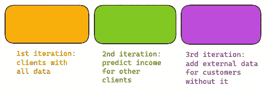
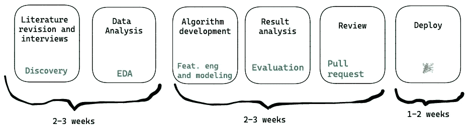

# 如何加速数据科学交付

> 原文：[`towardsdatascience.com/how-to-speed-up-data-science-deliveries-cbacc5a710af?source=collection_archive---------13-----------------------#2023-01-09`](https://towardsdatascience.com/how-to-speed-up-data-science-deliveries-cbacc5a710af?source=collection_archive---------13-----------------------#2023-01-09)

## 将敏捷方法引入数据科学，并重新建立利益相关者对团队的信任

 [Bárbara Barbosa](https://bahbbc.medium.com/?source=post_page-----cbacc5a710af--------------------------------)

·

[Follow](https://medium.com/m/signin?actionUrl=https%3A%2F%2Fmedium.com%2F_%2Fsubscribe%2Fuser%2F1d7b885b5695&operation=register&redirect=https%3A%2F%2Ftowardsdatascience.com%2Fhow-to-speed-up-data-science-deliveries-cbacc5a710af&user=B%C3%A1rbara+Barbosa&userId=1d7b885b5695&source=post_page-1d7b885b5695----cbacc5a710af---------------------post_header-----------) 发表在 [Towards Data Science](https://towardsdatascience.com/?source=post_page-----cbacc5a710af--------------------------------) ·10 min read·2023 年 1 月 9 日

--

当我们开始从事数据科学工作时，其他人期望我们能像开发人员一样敏捷，但我们能否使用他们的方法和仪式来实现敏捷？

我在几年内将一个数据科学团队从 1 人扩展到大约 10 人，我想分享一下作为经理在数据科学这样一个非常不确定的领域中保持敏捷的多个策略。如果你是一名经验丰富的数据科学家，可能会[发生很多项目有时无法投入生产](https://venturebeat.com/ai/why-do-87-of-data-science-projects-never-make-it-into-production/)。在项目开始时，不确定性很高，你不知道它是否会投入生产。如果这正是你的情况，我想分享一些我的策略，以减少项目开始时的不确定性。

在团队刚开始时，一切都很好。我们使用了一个单一的[看板](https://www.atlassian.com/agile/kanban)，因为团队非常小，我们可以用它管理一切。问题开始于团队的扩展，我们在公司多个领域开展工作。利益相关者希望知道截止日期以及我们将如何完成项目。我那时与许多公司进行了交谈，决定我们应该尝试转向[Scrum](https://www.scrum.org/resources/what-is-scrum)。

我们使用了 Scrum 好几年，但随着时间的推移，我意识到团队不满意。我们遇到了多个问题：

+   开放的 Pull Requests 即使在非常小的故事中也需要很长时间才能审核；

+   科学家几乎从未能完成冲刺；

+   细化会议花费的时间过长，在与利益相关者进行一些对齐后，一切总是发生变化，整个细化会议变得毫无意义；

+   团队总是高估故事的时间和规模，因此，利益相关者开始不再信任我们的截止日期，我们也有了一个慢团队的声誉；

+   很难对一个探索性故事（无论是 EDA——探索性数据分析，还是数据本身的发现）的规模做出准确预测，在这个步骤之后，如果数据不好，可能会导致一个不好的模型或分析，而这并不是我们真正需要的来提高模型性能的东西。

现在，让我更详细地解释一下当时团队的工作情况。团队是一个[章节](https://productschool.com/blog/product-management-2/spotify-model-scaling-agile/)，所以我们在一些部落内部，与其他团队一起合作以达到部落的目标。一名数据科学家通常会在部落内主导一个项目，而数据科学团队的其他成员则会在每日会议或其他仪式中提供帮助，提出想法。一些项目会有两个数据科学家，但大多数情况下，我们每个项目只有一个人，并且这个人可以得到来自数据科学章节的支持。

当时，我认为我们是敏捷的，因为我们使用了敏捷框架。实际上，敏捷是[响应变化而不是遵循计划](https://agilemanifesto.org/)，而我列出的这些问题促使我们寻找一种新的方式来管理数据科学团队的项目。

我们发现我们最大的一个问题是试图通过产品的第一次发布来解决所有问题。这产生了一个长时间的反馈循环，生成了大量的代码（包括 Jupyter notebooks 和 Python 代码），这对审查造成了威胁。特别是在项目初期逻辑出现问题时，这种情况尤其有害，因为这会引发一连串的变化事件（有时导致项目完全无效）。

所以我们停止了。我们开始致力于验证**单一假设**，并且在此基础上，我们开始为每个我们验证过的假设创建**生产就绪的** **版本**。主要的变化包括：

1.  处理**小版本**，这些版本可以在迭代结束时投入生产。这些版本根据当前利益相关者面临的最大问题进行优先级排序。

1.  开始使用**软截止日期**来提高团队的创造力，并为利益相关者带来更多的可见性。

1.  **研究审查**非常重要，但它是项目中最大时间消耗的环节之一。我们将这一步骤移到了最后。

我将详细说明这些步骤：

## 小版本

项目的第一个版本是 MVP，之后开发新的版本。MVP 是基线版本，这种命名法有助于数据科学家考虑如何在项目中做出最小的迭代，同时也与利益相关者的期望保持一致，因为他们也会帮助调整利益相关者的期望，以及数据科学家进行最小迭代的工作，以帮助解决问题。

我们开始将数据科学项目视为具有多个迭代的任务，牢记第一次迭代不是最终版本。所有迭代都遵循完整的数据科学流程（进一步解释），生成小的交付物。在图像中，我们根据当时可用的数据进行迭代。图像由作者提供。

我们首先做的事情是*理解问题*，或者匹配上面的图像，即*业务理解*，为了简化这个步骤，我们使用[机器学习画布](https://www.ownml.co/machine-learning-canvas)（ML Canvas）。我通常也称这个步骤为发现，因为在这里我们实际上了解是否这是一个数据科学问题，是否需要数据科学家来解决这个问题。画布有助于评估，因为我们可以使项目的主要目标与所有受其影响的人对齐。

在画布阶段，我们了解相关方的问题、所需的主要数据，并且已经可以定义一个 MVP（最小可行产品）并达成关于下一版本交付内容的共识。虽然这看起来相当直接，但在 MVP 阶段一切都可能发生变化，这没关系，因为不确定性是数据科学项目的一部分，没有亲手处理数据，很难知道下一步会有什么，以及接下来要做什么。

在完全远程或混合环境中，你可以使用 Miro 或其他类似工具与每个人进行头脑风暴，这种初步对齐可以让我们在数据团队真正开始工作之前，了解项目的不同方面。

对于后续步骤和版本，拥有一位在数据科学家将要工作的领域内的专家作为合作伙伴是至关重要的。此人应当能够参与头脑风暴会议，帮助数据科学家获得解决问题所需的业务知识，提供假设支持，并进行版本优先级排序。我们称这位人士为业务伙伴（Business Partner），他将帮助数据科学家更好地了解该领域所面临的日常问题，并确保数据科学家的交付成果能够解决这些问题。与业务伙伴的每周会议对项目有着显著的帮助，确保数据科学家与业务保持接地气，同时让业务了解数据科学家所做的工作。

## 软性截止日期

我们使用了一个包含[CRISP-DM](https://www.datascience-pm.com/crisp-dm-2/)各个阶段的看板，这个方法有 6 个步骤。某些步骤被组合在一起，并设有软性截止日期和与项目相关方的对齐会议，以完成这些步骤。这增强了我们与相关方之间的可信度，因为没有这些步骤时，我们没有具体的议程，有时结果也没有得到充分的整合或验证。预留一些时间来总结结果会使会议更加高效，我们可以集中讨论想要讨论的要点，而不是去发现分析中的潜在错误，从而提升该特定交付物的业务价值。

我谈到这个步骤时，人们常常会问为什么它是“软性”的。我认为这是因为每个人都习惯了软件开发的方式，而数据科学并非软件工程，项目的某些步骤存在很大的不确定性。因此，*软性* 这个词带有很高的不确定性，比如 EDA（*探索性数据分析*）在没有业务逻辑的情况下可能难以衡量。在发现和初步数据准备及探索之后，数据科学家可以安排对齐会议，并定义项目的下一步软性截止日期。

软性截止日期也为数据科学家带来了灵活性：她可以在截止日期之前做她认为/想要的所有必要工作来解决问题，并且在计划错误的情况下，她仍然有材料可以在检查点展示并收集反馈（假设她首先专注于更简单的版本，并利用其余时间进行扩展）。这将使她能够进行不同的实验，同时考虑到截止日期。

过程的每一步都设置了软性截止日期。文献修订 + 数据分析需要 2 到 3 周；算法开发 + 结果分析 + 审查需要 2 到 3 周；部署可能需要 1 到 2 周，但这更多取决于你的 DataOps 基础设施和策略。作者提供的图片。

图片展示了在项目的第二/第三版本中可以实现的内容（因此关于数据、部署、使用等的不确定性已经大大减少），并且在一个对团队成员速度非常熟悉的团队中。对于 MVP 项目，这可能完全不同，因为数据准备可能非常复杂。超出第一阶段的项目通常使用这种方法会更快，因为大部分风险已经被了解，利益相关者对工作方式也已经很熟悉。

在 EDA 完成后与利益相关者召开对齐会议，可以确保我们在下一步行动上达成一致，并且提升数据科学团队的可见性。

新流程之前：数据科学家在项目进行 1 到 2 个月后才出现，与利益相关者讨论，那个时候大家可能已经忘记了这个项目。照片由[Daniel Jensen](https://unsplash.com/@dallehj?utm_source=unsplash&utm_medium=referral&utm_content=creditCopyText)提供，来源于[Unsplash](https://unsplash.com/s/photos/waving-hello?utm_source=unsplash&utm_medium=referral&utm_content=creditCopyText)

## 结束时的审查

正如开头所述，我们主要的问题之一是研究评审时间，这随后被移到了项目的最后阶段。从代码的角度来看，这非常糟糕，因为这不是一个可以快速进行代码审查的原子部分，从代码的角度来看，这完全正确，但对于研究来说，你不仅要看到训练模型的单一代码，还要看到评估，以了解你可以做什么来改进这个模型（是数据？超参数？仅仅看训练代码是无法知道的）。这使得审阅者能够理解业务问题，并建议更相关的修改。在此之前，一个人可能在审查 EDA，而在两周后开始审查模型评估，或者更糟糕的是，不同的人会审查每个部分，丧失上下文。在数据科学中，代码只是整个图景的一部分，还有包含洞察、图形和数据的 Jupyter 笔记本。看到模型评估而错过 EDA 并不能使审查完整，审查整个迭代也有助于数据科学家意识到迭代应该是小的。

由于这一步骤需要相当长的时间，仅有一个数据科学家审查彼此的研究，其他团队成员的修订是可选的。评估之后，必须有一个人负责审查任务，并设定一个截止日期，否则，修订将再次成为问题，这一步骤可能会阻碍整个项目。

这一步骤增加了团队的知识，也使人员过渡到另一个领域变得更加容易。如果你想了解更多关于如何使用 Github 进行 Pull 请求的信息，请查看我之前写的[这篇文章](https://medium.com/analytics-vidhya/creating-pull-requests-with-jupyter-notebooks-912520ee328f)。

## 挑战和其他学习

由于审查步骤仅为最后一步，数据科学家可能会很难进行协作和提问。这可以通过使用[功能分支](https://www.optimizely.com/optimization-glossary/feature-branch/#:~:text=What%20is%20a%20feature%20branch,for%20how%20individuals%20work%20together.)来解决，其中数据科学家仍然可以交付小块代码并获得小部分的帮助，但团队在功能分支进入生产时仍能保持上下文分析。这也减少了项目最终的审查时间，因为小问题已经得到解决。这有助于与团队就特定问题进行异步对话。

保持回顾会在当时非常重要，这也是团队讨论项目中什么有效或无效的好机会，并与团队其他成员交换经验。这使得章节能够持续改进，即使在这一期间没有交付，我建议按较好的频率安排会议，比如每 15 天一次。

这个方法论是我对这篇文章中所呈现内容的改编。在其中，作者提出了一种使用看板和带有下一步步骤的清单的方法。软截止日期迫使数据科学家考虑她需要遵循的步骤，这创造了更有结构的工作方式，但我从未使用过预定义的清单，数据科学家会考虑重要的事项并与团队讨论任务（如果你愿意这样理解，几乎可以看作是精炼仪式）。我在这里解释的方法实施成功了。它为数据科学家带来了灵活性和责任感，并且与利益相关者之间的可见性和透明度得到了提高。这种方法在能够专注于一个项目的团队中效果更好，但当然，所有团队都有自己的特殊性，并且会更好地适应不同的框架。

我希望这篇文章能对你可能有的问题提供一些启示，如果你尝试了这种方法，请与我分享你的经验，我很高兴听到你的反馈。

这是[我原始的葡萄牙语文章](https://medium.com/creditas-tech/como-dar-mais-agilidade-nas-entregas-do-time-de-data-science-9003a1e6c898)的翻译和修订版。
