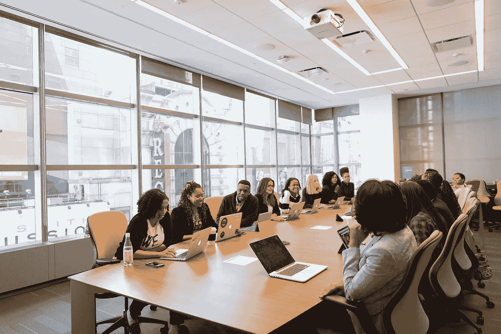
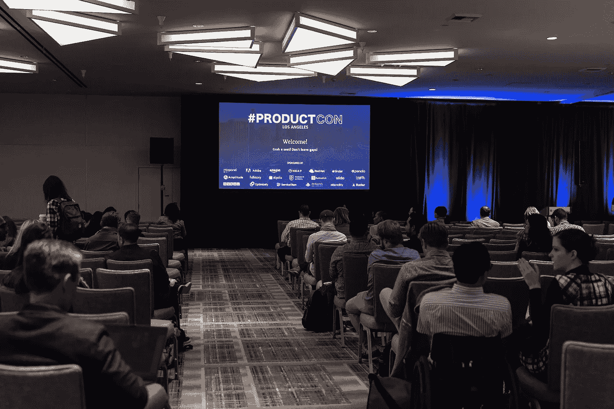

# 如何跟上最新的 AI 研究

> 原文：[`towardsdatascience.com/how-to-stay-on-top-of-the-latest-ai-research-e8993523ef3e`](https://towardsdatascience.com/how-to-stay-on-top-of-the-latest-ai-research-e8993523ef3e)

## 关于如何跟上迅速发展的领域的策略

 [Thomas A Dorfer](https://thomasdorfer.medium.com/?source=post_page-----e8993523ef3e--------------------------------)

·发表于[Towards Data Science](https://towardsdatascience.com/?source=post_page-----e8993523ef3e--------------------------------) ·6 分钟阅读·2023 年 1 月 7 日

--

由[Dmitry Ratushny](https://unsplash.com/@ratushny)拍摄，发布在[Unsplash](https://unsplash.com/photos/O33IVNPb0RI)

人工智能（AI）是一个颠覆性且发展迅速的领域，其发展轨迹正在迅速加速。事实上，近年来该领域的出版物数量大幅上升。斯坦福大学年度人工智能指数报告显示，AI 出版物的数量从 2010 年的 162,444 篇增加到了 2021 年的 334,497 篇[1]。

2000–2021 年的 AI 出版物。图示取自[2022 年人工智能指数报告](https://aiindex.stanford.edu/wp-content/uploads/2022/03/2022-AI-Index-Report_Master.pdf)（CC BY-ND 4.0）。

如果你在 AI 领域工作，可能已经注意到行业重大进展的间隔越来越短，例如 OpenAI 的[DALL·E 2](https://openai.com/dall-e-2/)、[GPT-3](https://en.wikipedia.org/wiki/GPT-3)和[ChatGPT](https://openai.com/blog/chatgpt/)，或者 DeepMind 的[AlphaFold](https://www.ncbi.nlm.nih.gov/pmc/articles/PMC8371605/)。这些只是一些吸引公众和科技行业注意的例子，因为它们被广泛报道并在社交媒体上广泛传播。然而，其他学科的进展也变得越来越频繁，涵盖了从机器人技术到药物发现、自驾车和太空探索等领域。

当然，这不断增加的、持续的新方法和出版物流使得人工智能从业者和开发者越来越难以跟上最新的研究。这篇文章将概述一些在不遭受信息过载的情况下如何导航这一领域的策略。具体来说，我们将根据建议活动的频率将文章分为每日、每周、每月和每年几个部分。

虽然这篇文章特别针对人工智能研究，但以下策略适用于大多数快速发展的领域。

# 每日

对于全职工作的人工智能从业者而言，挤出每日学习的时间可能比较困难。然而，有一些事情可以在不需要大块时间的情况下每天完成。

订阅每日 **新闻通讯** 是保持对事物了解的好方法，通常只需几分钟即可阅读。例如，包括 MIT Technology Review 的 [The Download](https://www.technologyreview.com/collection/the-download/) 或 [TLDR](https://tldr.tech/)。这些不一定专注于人工智能，而是技术聚焦的新闻通讯，包含了技术领域的最新发展，包括大量人工智能相关内容。

关于科学文献，**arXiv** 提供了一个 [每日邮件提醒服务](https://arxiv.org/help/subscribe)，根据自定义指定的主题发送每日的新提交列表。这些主题可以从他们的 [分类法](https://arxiv.org/category_taxonomy) 中选择。例如，人工智能属于*计算机科学*类别，并标记为*cs.AI*。同样，**Google Scholar** 也提供了基于用户特定兴趣主题的 [提醒服务](https://scholar.google.com/scholar_alerts?view_op=list_alerts&hl=en)。

也许跟进最新文献的最快方法之一是通过社交媒体关注其作者，尤其是 **Twitter**。许多人工智能领域的重要人物使用该平台分享他们的出版物、想法和项目，包括 [Yann LeCun](https://twitter.com/ylecun)、[Geoffrey Hinton](https://twitter.com/geoffreyhinton)、[Richard Sutton](https://twitter.com/RichardSSutton)、[Andrew Ng](https://twitter.com/AndrewYNg) 和 [Christopher Manning](https://twitter.com/chrmanning)。

Yann LeCun 回复了 Andrej Karpathy 关于 ChatGPT 的心理担忧。

# 每周

虽然每日跟进人工智能研究主要包括一些简短的参与，但每周学习应该更深入一些。每周投入几个小时似乎是合理的，以下是所述的努力方向。

最可靠和最高质量的 AI 研究来源之一是**同行评审的研究论文**。有许多来源和期刊可以获取这些论文，例如 [IEEE](https://www.ieee.org/publications/index.html)、[Nature Machine Intelligence](https://www.nature.com/natmachintell/)、[Pattern Recognition](https://www.sciencedirect.com/journal/pattern-recognition) 等。此外，[arXiv](https://arxiv.org/) 是一个优秀的开放获取电子预印本的来源。唯一的警告是，尽管这些电子预印本经过内容审查过程，但它们并没有经过同行评审。

此外，**播客**是保持信息更新和了解人工智能研究前沿的绝佳方式。目前，存在大量的播客可以在各种平台上找到，因此需要进行选择。以下是一些顶级 AI 播客的建议：[The TWIML AI Podcast](https://podcasts.apple.com/us/podcast/the-twiml-ai-podcast-formerly-this-week-in-machine/id1116303051) 由 Sam Charrington 主持，[Data Skeptic](https://podcasts.apple.com/us/podcast/data-skeptic/id890348705) 由 Kyle Polich 主持，[Talking Machines](https://www.thetalkingmachines.com/home) 由 Katherine Gorman 和 Neil Lawrence 主持，以及 [Practical AI: Machine Learning, Data Science](https://podcasts.apple.com/us/podcast/practical-ai-machine-learning-data-science/id1406537385) 由 Changelog Media 主持。

照片由 [Austin Distel](https://unsplash.com/@austindistel) 提供，来自 [Unsplash](https://unsplash.com/photos/Hg3BHX6U5jg)

最后，还有许多有用的**新闻简报**每周发送。显著的例子包括 DeepLearning.AI 的 [The Batch](https://www.deeplearning.ai/the-batch/)， [Alpha Signal](https://alphasignal.ai/) 和 [The Sequence](https://thesequence.substack.com/)。

# 每月

每月可以参与各种活动。然而，计划这些活动可能会有些困难，因为这些活动往往是临时安排的。例如，**研讨会**、**网络研讨会**、**读书小组**或**讲座**。虽然大多数这些活动由各种教育机构和企业定期举办，但其中只有一些对公众开放。

如果你有幸与一个定期举办此类活动的机构相关联，那是非常好的！然而，如果不是这种情况，主动参与这个领域会有很大帮助。集结你的同事，建立自己的读书小组或期刊俱乐部，在那里你们可以相互保持最新信息，并讨论你们感兴趣领域的最新研究成果。

照片由 [wocintechchat](https://unsplash.com/@wocintechchat) 提供，来自 [Unsplash](https://unsplash.com/photos/faEfWCdOKIg)

# 每年

AI 社区非常庞大，因此每年都会有大量**会议**在现场或远程举行。这是跟进该领域最新发展的好方法，了解前沿的方法，并与同行研究人员和工程师进行激动人心的交流。

最受欢迎的会议包括[神经信息处理系统（NeurIPS）](https://nips.cc/)、[国际机器学习大会（ICML）](https://icml.cc/)、[学习表征国际会议（ICLR）](https://iclr.cc/)、[计算机视觉与模式识别（CVPR）](https://cvpr2022.thecvf.com/)和[计算语言学协会（ACL）](https://www.2022.aclweb.org/)。这些会议涵盖了广泛的主题，如自然语言处理、机器人技术、图像处理、大脑-计算机接口等。再次强调，在这样的会议中，重要的是要有选择地参与，以避免尝试参加每一个会话而导致信息过载。

图片来源：[Product School](https://unsplash.com/@productschool) 在 [Unsplash](https://unsplash.com/photos/4jtHJX4SNk8)

# 结论

本文重点介绍了一些突出的活动——按出现频率排序——这些活动可以帮助跟上最新的 AI 研究。由于这一领域的信息每天都在增加，因此重要的是要有选择地获取信息，以避免信息过载。专注于特定的子领域也有助于缩小研究范围，从而保持对感兴趣领域的跟进。

尽管本文中的许多建议是免费的，如新闻通讯和播客，但有些确实需要订阅或参加费用，特别是某些期刊文章或会议。

最后，如果你认为自己的团队或机构在这个领域做得不够，何不采取行动，自己发起定期的读书小组或期刊俱乐部会议？这是一种保持领先、学习新知识并同时扩展网络的好方法。

# 参考文献

[1] 张等（2022），*AI 指数 2022 年度报告*。AI 指数指导委员会，斯坦福大学人类中心 AI 研究所，2022 年 3 月。
