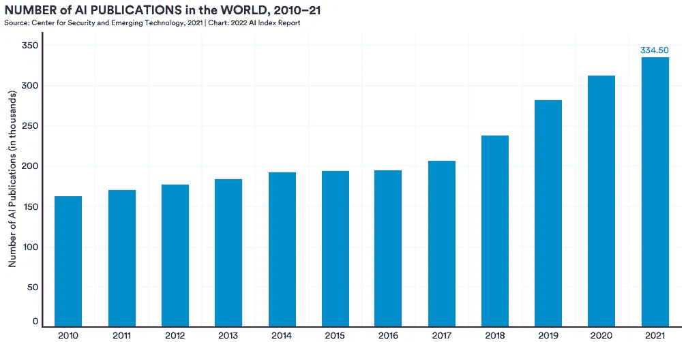

# 如何保持对最新 AI 研究的掌握

> 原文：[`towardsdatascience.com/how-to-stay-on-top-of-the-latest-ai-research-e8993523ef3e?source=collection_archive---------1-----------------------#2023-01-07`](https://towardsdatascience.com/how-to-stay-on-top-of-the-latest-ai-research-e8993523ef3e?source=collection_archive---------1-----------------------#2023-01-07)

## 如何跟上快速发展的领域

 [Thomas A Dorfer](https://thomasdorfer.medium.com/?source=post_page-----e8993523ef3e--------------------------------)

·

[关注](https://medium.com/m/signin?actionUrl=https%3A%2F%2Fmedium.com%2F_%2Fsubscribe%2Fuser%2F7c54f9b62b90&operation=register&redirect=https%3A%2F%2Ftowardsdatascience.com%2Fhow-to-stay-on-top-of-the-latest-ai-research-e8993523ef3e&user=Thomas+A+Dorfer&userId=7c54f9b62b90&source=post_page-7c54f9b62b90----e8993523ef3e---------------------post_header-----------) 发表在 [Towards Data Science](https://towardsdatascience.com/?source=post_page-----e8993523ef3e--------------------------------) ·6 min read·2023 年 1 月 7 日

--

照片由 [Dmitry Ratushny](https://unsplash.com/@ratushny) 拍摄，刊登于 [Unsplash](https://unsplash.com/photos/O33IVNPb0RI)

人工智能（AI）是一个具有颠覆性且发展迅速的领域，其发展轨迹正在急剧加速。实际上，近年来该领域的出版物数量显著增加。斯坦福大学年度人工智能指数报告显示，AI 领域的出版物数量从 2010 年的 162,444 增加到了 2021 年的 334,497 [1]。

2000–2021 年的人工智能出版物。图表摘自 [人工智能指数报告 2022](https://aiindex.stanford.edu/wp-content/uploads/2022/03/2022-AI-Index-Report_Master.pdf)（CC BY-ND 4.0）。

如果你在人工智能领域工作，你可能也注意到了行业重大进展之间的时间间隔不断缩短，例如 OpenAI 的 [DALL·E 2](https://openai.com/dall-e-2/)、[GPT-3](https://en.wikipedia.org/wiki/GPT-3) 和 [ChatGPT](https://openai.com/blog/chatgpt/)，或者 DeepMind 的 [AlphaFold](https://www.ncbi.nlm.nih.gov/pmc/articles/PMC8371605/)。这些只是一些引起公众和科技行业广泛关注的例子，它们被大量报道并在社交媒体上广泛传播。然而，其他领域的进展也变得越来越频繁，从机器人技术到药物发现、自驾车和太空探索等。

毋庸置疑，这不断增加的、永不停歇的新方法和出版物的流使得人工智能从业者和开发者越来越难以应对…
