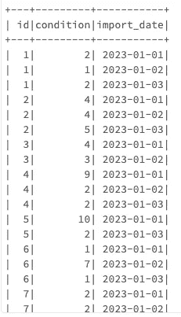
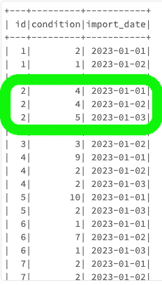
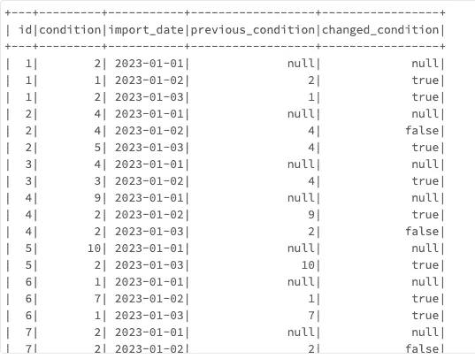
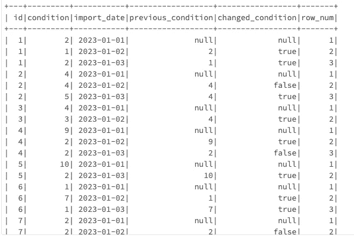
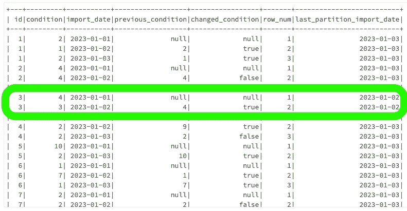
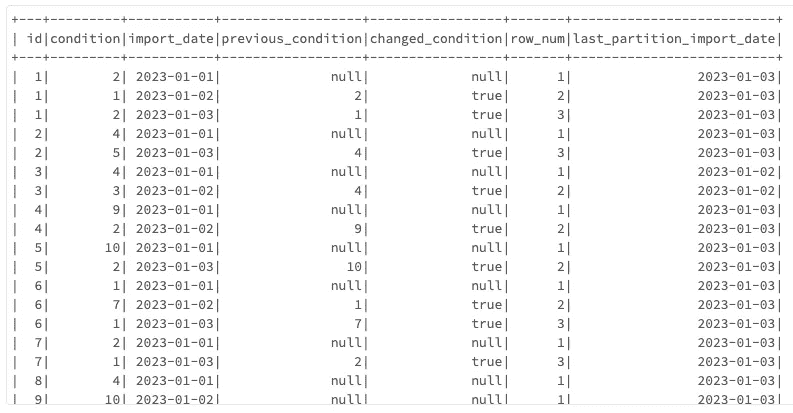
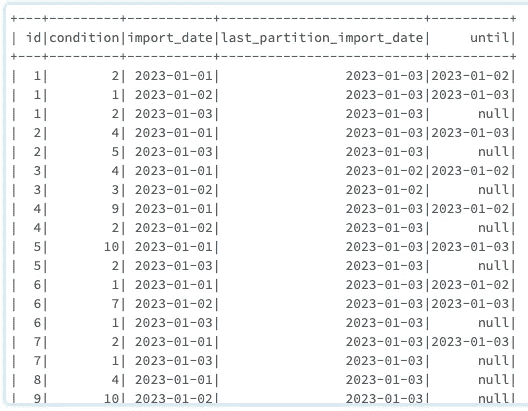
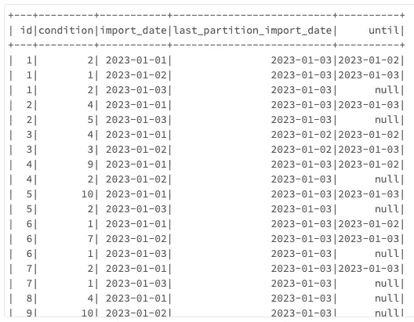
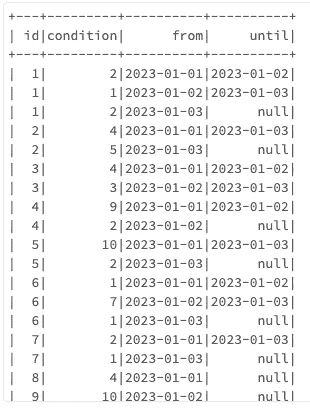

# 如何更高效地存储历史数据

> 原文：[`towardsdatascience.com/how-to-store-historical-data-much-more-efficiently-78b0f2c8c811`](https://towardsdatascience.com/how-to-store-historical-data-much-more-efficiently-78b0f2c8c811)

## 一个动手教程，使用 PySpark 存储最多仅 0.01% 的 DataFrame 行而不丢失任何信息。

[](https://medium.com/@tomergabay?source=post_page-----78b0f2c8c811--------------------------------)[](https://towardsdatascience.com/?source=post_page-----78b0f2c8c811--------------------------------) [Tomer Gabay](https://medium.com/@tomergabay?source=post_page-----78b0f2c8c811--------------------------------)

·发表于 [Towards Data Science](https://towardsdatascience.com/?source=post_page-----78b0f2c8c811--------------------------------) ·阅读时间 10 分钟·2023 年 9 月 10 日

--


图片由 [Supratik Deshmukh](https://unsplash.com/@supratikdeshmukh?utm_source=medium&utm_medium=referral) 提供，来源于 [Unsplash](https://unsplash.com/?utm_source=medium&utm_medium=referral)

在一个公司和组织收集数据比以往任何时候都多的时代，数据集往往会积累数百万行不包含任何新信息或有价值信息的多余行。本文将重点关注数据管理的一个关键方面：使用 PySpark 删除数据集中没有附加价值的行。

> *[PySpark](https://spark.apache.org/docs/latest/api/python/index.html#:~:text=PySpark%20is%20the%20Python%20API,for%20interactively%20analyzing%20your%20data.) 比 pandas 更适合处理非常大的数据集，因为它可以在多台计算机上处理数据，从而提高处理速度和可扩展性。Pandas 适用于能够在单台机器内存中容纳的小型数据集，但对于大数据而言可能会变得缓慢甚至不切实际。*

设想以下情境：你在一家房地产公司的维护部门担任数据工程师/科学家。在过去的十年里，你的公司从一个包含你建筑物条件的外部数据库中进行了所有维护数据的完整加载，并将其存储在公司的云存储中。这些数据可能例如如下所示：



[图片来源：作者]

该数据集中包含三个列：

+   `id` -> 建筑物的 ID。

+   `condition` -> 一个介于 1（糟糕）和 10（优秀）之间的整数，表示建筑物的状况。

+   `import_date` -> 一个 *datetime* 列，表示这行数据从外部软件导入的日期。

若要自己创建此数据集，请运行下面的代码片段：

```py
from pyspark.sql import SparkSession, Row
from pyspark.sql.functions as f
from pyspark.sql.types import IntegerType, DateType
import random

# set the seed to get same results when rerunning
random.seed(42)

# create a spark session
spark = SparkSession.builder.getOrCreate()

# create id list
ids = list(range(1, 11))  # Adjust this list size to meet the desired number of unique IDs

# create two possible conditions for each id
conditions = [[random.randint(1, 10) for _ in range(2)] for _ in ids]

# create a list of tuples where each tuple is a row
rows = [(id, random.choice(conditions[id-1]), date) 
        for id in ids for date in ['2023-01-01', '2023-01-02', '2023-01-03']]

# some ids should be missing on some dates, so we remove some
rows = [row for row in rows if random.random() > 0.2]  # Adjust this parameter to control the number of missing IDs

# create a DataFrame
df = spark.createDataFrame(rows, ["id", "condition", "import_date"])

# convert import_date column to DateType
df = df.withColumn("import_date", df["import_date"].cast(DateType()))

# sort DataFrame
df = df.sort("id", "import_date")

# show the DataFrame
df.show()
```

让我们看看 Building2：



[作者提供的图片]

在 1 月的第一天和第二天，建筑物的状态是 4。1 月 3 日，状态变为 5。实际上，我们不需要关于 1 月 2 日的中间行。如果我们只关注状态变化的日期，我们可以省略许多行。在这个数据集中，Building2 的第一次出现是在 1 月 1 日，状态在 1 月 3 日发生了变化。我们可以通过添加`from`和`until`列来省略关于 1 月 2 日的第二行，这些列提供了行值第一次出现的时间以及行值发生变化的时间。

这个人工数据集非常小，仅包含三个不同的导入日期。但让我们考虑一个更现实的情况。你的房地产公司拥有数千栋建筑，导入数据跨度达 10 年。这将导致数百万行没有实际信息。在我为住房公司工作的实际情况中，使用这种技术，我们只需保存大约 ~0.2% 的所有行来存储所有信息。

**让我们看看添加** `**from**` **和** `**until**` **列的代码。**

首先，我们必须指定表中的分区列和日期时间列。分区列类似于你在使用 pandas 时想要分组的列。

```py
partition_columns = ["id"]
datetime_column = "import_date"
```

然后，我们需要指定我们希望跟踪任何可能变化的列，在我们的案例中，那就是`condition`。不过，为了使代码更加通用和可重用，我们可以指定我们希望跟踪变化的列是所有列，除了分区列和日期时间列。

```py
track_columns = [column for column in df.columns 
                  if column not in partition_columns + [datetime_column]]
```

现在我们需要创建一个 PySpark 窗口，它类似于 pandas 的 `.groupby()`。在这个窗口中，我们需要指定我们希望按`datetime_column`排序行：

```py
from pyspark.sql import Window

window = Window.partitionBy(partition_columns).orderBy(datetime_column)
```

要检查一个`track_columns`的值是否发生了变化，我们可以将前一行的值加到当前行，并检查它们是否相同。

```py
for column in track_columns:
  previous_column = f"previous_{column}"
  changed_column = f"changed_{column}"
  df = df.withColumn(previous_column, f.lag(f.col(column)).over(window))
  df = df.withColumn(changed_column, f.col(column) != f.col(previous_column))
  # df = df.drop(previous_column)
```

运行这段代码会得到以下 DataFrame：



[作者提供的图片]

在这里，我们可以看到，根据`previous_condition`是否等于`condition`，我们可以确定值是否发生了变化，并将其存储在`changed_condition`中。由于指定的`Window`，`previous_condition`的值仅在每个唯一`id`的范围内确定。

然而，我们不能只保留在值发生变化时的行，因为那样会导致删除所有给定`id`的第一次出现的行。我们还必须明确保存所有第一次出现的行。

为此，我们可以使用 `row_number()*`。

> * 在这种情况下，你也可以通过查看`previous_condition`和/或`changed_condition`中的*null*值来确定第一行，但为了说明起见，我们将在这里使用`row_number()`。

```py
df = df.withColumn('row_num', f.row_number().over(window))
```



[作者提供的图像]

现在有两个条件可以决定是否保留一行数据：

+   当`changed_condition is True`出现在任何`f"changed_{column}"`列中。

+   当`row_num == 1`

但是，如果一行被删除了怎么办？因为没有下一行，`changed_condition is False`，而且`row_num != 1`。

因此，我们需要确保检查`id`在最后一次导入中是否仍然存在。

首先让我们确定最后的导入日期是什么：

```py
# determine last import date
latest_import = df.agg(f.max(datetime_column)).collect()[0][0]

print(f"{latest_import = }")

# output
latest_import = datetime.date(2023, 1, 3)
```

> 对`print(f"{variable = }")`的语法不熟悉？阅读下面的文章，了解这些和其他有用的 Python 技巧！

[](/5-python-tricks-that-distinguish-senior-developers-from-juniors-826d57ab3940?source=post_page-----78b0f2c8c811--------------------------------) [## 5 个 Python 技巧，区分高级开发人员和初级开发人员

### 通过 Advent of Code 谜题的不同方法进行说明

[5 个 Python 技巧，区分高级开发人员和初级开发人员](https://towardsdatascience.com/5-python-tricks-that-distinguish-senior-developers-from-juniors-826d57ab3940?source=post_page-----78b0f2c8c811--------------------------------)

现在让我们确定一个`id`的最新导入日期：

```py
# Add last_partition_import_date to keep track of 
#  what the last imported date was per partition
last_partition_window = Window.partitionBy(*partition_columns)
df = (
  df
  .withColumn('last_partition_import_date', 
              f.max(f.col(datetime_column)).over(last_partition_window)
)
```



[作者提供的图像]

在上面的图像中，你可以通过查看`last_partition_import_date`看到 Building3 在 1 月 3 日从数据集中消失了。这可能意味着建筑物已经被拆除。这是非常重要的信息，因此跟踪`id`是否被删除非常重要。

现在让我们过滤掉所有不相关的行。正如我们之前提到的，我们想保留的行应该具有变化的`condition`值，或者应该是数据集中某个建筑物的第一次出现。

```py
from itertools import reduce

# Add condition to keep every first row 
first_row_condition = f.col("row_num") == 1

# Add condition that only keeps row that have changed values
change_condition = reduce(lambda a, b: a | b, (f.col(f"changed_{column}") 
                    for column in track_columns))

# Filter the DataFrame to keep the first rows for each partition 
# and the rows where there is a change
filtered_df = df.filter(first_row_condition)
              .union(df.filter(change_condition))
```



[作者提供的图像]

现在，我们有一个 DataFrame，其中每一行都添加了信息！让我们删除一些不再需要的列：

```py
# Drop the 'row_num' and 'changed_*' columns
filtered_df = filtered_df.drop('row_num', 
                    *[f"previous_{column}" for column in track_columns],
                    *[f"changed_{column}" for column in track_columns])
```

同时，让我们添加一个`until`列，用于指示行的值有效的截止时间。我们可以通过使用`f.lag`将下一行的`import_date`上移一行来实现，只要下一行的`id`仍然相同，并且行按`import_date`排序。为此，我们将重用之前定义的 Window：

```py
window = Window.partitionBy(partition_columns).orderBy(datetime_column)

# Add 'until' by looking one row ahead
filtered_df = filtered_df.withColumn("until", 
                              f.lag(f.col(datetime_column), -1).over(window))
```



[作者提供的图像]

正如我们所见，例如对于 Building1，第一行的`until`值是第二行的`import_date`。第二行的`until`值是第三行的`import_date`。第三行的`until`值是`null`，因为没有第四行。

我们差不多完成了！如上所述，我们仍然在`until`列中看到一些`null`值。这对于 Building1 来说不成问题，但对于 Building3 来说则有问题，因为我们不能使用`until`列来检测 Building3 在 1 月 3 日是否不再存在。这时我们将使用`last_partition_import_date`和`latest_import`值。

如果`until`是`null`且`last_partition_import_date < latest_import`，则将`last_partition_import_date`加一天添加到该行的`until`列中。

```py
# Add a deletion date if the last date of a partition is before the last import date of the data
filtered_df = filtered_df.withColumn(
  "until",
  f.when(
      (f.col("until").isNull()) 
       & (f.col("last_partition_import_date") < latest_import),
      f.date_add(f.col("last_partition_import_date"), 1)
  ).otherwise(f.col("until"))
)
```



[图片作者]

使用这种技术，我们可以看到 Building3 的最后一次观察日期是 1 月 2 日（我们在这里使用的是不包括的直到日期）。如果某一行在`until`列中仍有`null`值，则表示该行仍然有效。

我们需要做的最后一件事是删除`last_partition_import_date`列，并将`import_date`列重命名为`from`：

```py
final_df = (
  filtered_df
  .drop("last_partition_import_date")
  .withColumnRenamed(datetime_column, "from")
)
```



[图片作者]

在上面您可以看到我们的最终数据框！在现实生活中，这种技术可以节省数百万行不带信息的数据，从而节省存储费用并加快进一步处理的速度！

# 总结

在这篇文章中，我们学习了如何通过仅保留实际带有信息的行来节省数百万行数据，通过查看每个子集内的变化值。总结一下我们做了什么：

1.  根据 ID 将数据框分组为多个分区。

1.  对于每个分区，我们确定了值的连续相同组合。连续相同的值组合会被删除。

1.  我们添加了`from`和`until`作为新列，以确定连续值组合的生命周期。

1.  我们检查了一个分区的最后`until`值是否在整个数据框的最后`until`值之前，以便为删除的分区添加一个`until`值。

为了使上面的代码可重用，我创建了一个函数，您可以将其复制粘贴到您的项目中使用！

```py
import pyspark.sql.functions as f
from functools import reduce
from pyspark.sql import Window
import pyspark
from typing import Optional

def remove_uninformative_rows(df: pyspark.sql.DataFrame,
                              partition_columns: list[str],
                              datetime_column: str,
                              track_columns: Optional[list[str]] = None)
                             -> pyspark.sql.DataFrame:

  if track_columns is None:
    track_columns = [column for column in df.columns 
                    if column not in partition_columns + [datetime_column]]

  # Define a window specification based on partition columns and ordered by datetime_column
  window = Window.partitionBy(*partition_columns).orderBy(datetime_column)

  # Iterate over the non-partition columns and add a new column for each column that indicates whether the value has changed
  for column in track_columns:
      previous_column = f"previous_{column}"
      changed_column = f"changed_{column}"
      df = df.withColumn(previous_column, f.lag(f.col(column)).over(window))
      df = df.withColumn(changed_column, f.col(column) != f.col(previous_column))
      df = df.drop(previous_column)

  # Add the row number to keep track of what the first occurance of a row is
  df = df.withColumn('row_num', f.row_number().over(window))

  # Add last_partition_import_date to keep track of what the last imported date was per partition
  last_partition_window = Window.partitionBy(*partition_columns)
  df = df.withColumn('last_partition_import_date', f.max(f.col(datetime_column)).over(last_partition_window))

  # Save the latest import date of the entire data set
  latest_import = df.agg(f.max(datetime_column)).collect()[0][0]

  # Add condition to keep every first row 
  first_row_condition = f.col("row_num") == 1

  # Add condition that only keeps row that have changed values
  change_condition = reduce(lambda a, b: a | b, (f.col(f"changed_{column}") for column in track_columns))

  # Filter the DataFrame to keep the first rows for each partition and the rows where there is a change
  filtered_df = df.filter(first_row_condition).union(df.filter(change_condition))

  # Drop the 'row_num' and 'changed_*' columns
  filtered_df = filtered_df.drop('row_num', *[f"changed_{column}" for column in track_columns])

  # Add 'until' column by looking one row ahead
  filtered_df = filtered_df.withColumn("until", f.lag(f.col(datetime_column), -1).over(window))

  # Add a deletion date if the last date of a partition is before the last import date of the data
  filtered_df = filtered_df.withColumn(
    "until",
    f.when(
        (f.col("until").isNull()) & (f.col("last_partition_import_date") < latest_import),
        f.date_add(f.col("last_partition_import_date"), 1)
    ).otherwise(f.col("until"))
  )

  # Drop last_partition_import_date and rename import_date column
  final_df = (
    filtered_df
    .drop("last_partition_import_date")
    .withColumnRenamed("import_date", "from")
  )
  return final_df
```

使用这个函数，您可以轻松删除所有无信息的行！

```py
remove_uninformative_rows(
  df=df,
  partition_columns=['id'],
  datetime_column='import_date'
)
```

如果您觉得这篇文章有用，请查看我的账户，查看更多关于 Python 和数据科学的文章！

[](/how-to-extract-more-information-from-categorical-plots-8ffac1133eb0?source=post_page-----78b0f2c8c811--------------------------------) ## 如何从分类图中提取更多信息

### 通过使用这两种方法，轻松深入了解您的分类数据。

towardsdatascience.com
