# 如何为可重复性和可维护性构建 ML 项目

> 原文：[`towardsdatascience.com/how-to-structure-an-ml-project-for-reproducibility-and-maintainability-54d5e53b4c82`](https://towardsdatascience.com/how-to-structure-an-ml-project-for-reproducibility-and-maintainability-54d5e53b4c82)

## 使用此模板开始你的下一个 ML 项目

 [](https://towardsdatascience.com/?source=post_page-----54d5e53b4c82--------------------------------) [Khuyen Tran](https://khuyentran1476.medium.com/?source=post_page-----54d5e53b4c82--------------------------------)

·发表于 [Towards Data Science](https://towardsdatascience.com/?source=post_page-----54d5e53b4c82--------------------------------) ·阅读时间 7 分钟·2023 年 1 月 15 日

--

## 动机

开始通常是构建 ML 项目时最具挑战性的部分。你应该如何构建你的代码库？应遵循哪些标准？你的团队成员能否复现你的实验结果？


作者提供的图片

与其寻找理想的代码库结构，不如有一个模板可以开始使用？

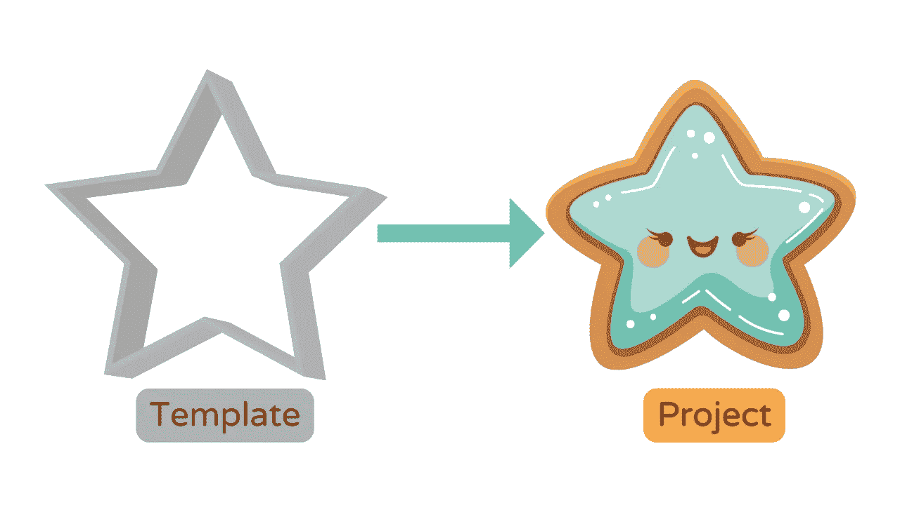

作者提供的图片

这就是为什么我创建了 [data-science-template](https://github.com/khuyentran1401/data-science-template/tree/prefect)，整合了我多年来关于数据科学项目结构的最佳实践。

[## GitHub - khuyentran1401/data-science-template at prefect](https://github.com/khuyentran1401/data-science-template/tree/prefect?source=post_page-----54d5e53b4c82--------------------------------)

### 此模板是我多年精炼数据科学项目结构的成果，以确保它...

[github.com](https://github.com/khuyentran1401/data-science-template/tree/prefect?source=post_page-----54d5e53b4c82--------------------------------)

此模板允许你：

✅ 为你的项目创建可读的结构

✅ 高效管理项目中的依赖关系

✅ 为可重复的任务创建简洁且易读的命令

✅ 仅重新运行管道中修改的组件

✅ 观察并自动化你的代码

✅ 在运行时强制执行类型提示

✅ 在提交之前检查代码中的问题

✅ 自动记录你的代码

✅ 在提交代码时自动运行测试

# 此模板中使用的工具

此模板轻量且仅使用可以广泛适用于各种用例的工具。这些工具包括：

+   [Poetry](https://python-poetry.org/): 管理 Python 依赖

+   [Prefect](https://www.prefect.io/): 组织和观察你的数据管道

+   [Pydantic](https://docs.pydantic.dev/): 使用 Python 类型注解验证数据

+   [pre-commit 插件](https://pre-commit.com/): 确保你的代码格式良好、经过测试和文档化，遵循最佳实践

+   Makefile：使用简短的命令来自动化可重复的任务

+   [GitHub Actions](https://docs.github.com/en/actions): 自动化你的 CI/CD 管道

+   [pdoc](https://github.com/pdoc3/pdoc): 自动创建你的项目的 API 文档

# 使用方法

要下载模板，首先安装 [Cookiecutter](https://github.com/cookiecutter/cookiecutter)：

```py
pip install cookiecutter
```

基于模板创建一个项目：

```py
cookiecutter https://github.com/khuyentran1401/data-science-template
```

按照 [这些说明](https://github.com/khuyentran1401/data-science-template/tree/prefect/%7B%7Bcookiecutter.directory_name%7D%7D#quick-start) 试用项目。

在接下来的几个部分，我们将详细介绍这个模板的一些有价值的功能。

# 创建一个可读的结构

从模板创建的项目结构是标准化且易于理解的。

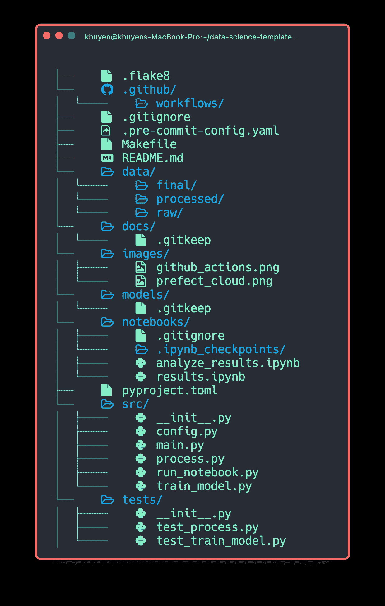

作者提供的图片

这里是这些文件的角色总结：

```py
.
├── data            
│   ├── final                  # data after training the model
│   ├── processed              # data after processing
│   ├── raw                    # raw data
├── docs                       # documentation for your project
├── .flake8                    # configuration for code formatter
├── .gitignore                 # ignore files that cannot commit to Git
├── Makefile                   # store commands to set up the environment
├── models                     # store models
├── notebooks                  # store notebooks
├── .pre-commit-config.yaml    # configurations for pre-commit
├── pyproject.toml             # dependencies for poetry
├── README.md                  # describe your project
├── src                        # store source code
│   ├── __init__.py            # make src a Python module
│   ├── config.py              # store configs 
│   ├── process.py             # process data before training model
│   ├── run_notebook.py        # run notebook
│   └── train_model.py         # train model
└── tests                      # store tests
    ├── __init__.py            # make tests a Python module 
    ├── test_process.py        # test functions for process.py
    └── test_train_model.py    # test functions for train_model.py 
```

# 高效管理依赖

[Poetry](https://python-poetry.org/) 是一个 Python 依赖管理工具，是 pip 的替代方案。

[](/how-to-effortlessly-publish-your-python-package-to-pypi-using-poetry-44b305362f9f?source=post_page-----54d5e53b4c82--------------------------------) ## 如何轻松地将你的 Python 包发布到 PyPI 使用 Poetry

### 在 10 分钟内分享你的有用 Python 工具

[towardsdatascience.com

使用 Poetry，你可以：

+   将主要依赖和子依赖分开到两个不同的文件中（而不是将所有依赖存储在`requirements.txt`中）

+   移除库时删除所有未使用的子依赖

+   避免安装与现有包冲突的新包

+   用几行代码打包你的项目

以及更多。

在 [这里](https://python-poetry.org/docs/#installation) 查找有关如何安装 Poetry 的说明。

# 为可重复的任务创建简短的命令

Makefile 允许你为任务创建简短且易读的命令。如果你对 Makefile 不熟悉，可以查看这个 [简短的教程](https://the-turing-way.netlify.app/reproducible-research/make/make-examples.html)。

你可以使用 Makefile 来自动化设置环境等任务：

```py
initialize_git:
 @echo "Initializing git..."
 git init

install: 
 @echo "Installing..."
 poetry install
 poetry run pre-commit install

activate:
 @echo "Activating virtual environment"
 poetry shell

download_data:
 @echo "Downloading data..."
 wget https://gist.githubusercontent.com/khuyentran1401/a1abde0a7d27d31c7dd08f34a2c29d8f/raw/da2b0f2c9743e102b9dfa6cd75e94708d01640c9/Iris.csv -O data/raw/iris.csv

setup: initialize_git install download_data
```

现在，只要别人想为你的项目设置环境，他们只需运行以下命令：

```py
make setup
make activate
```

一系列命令将会被运行！

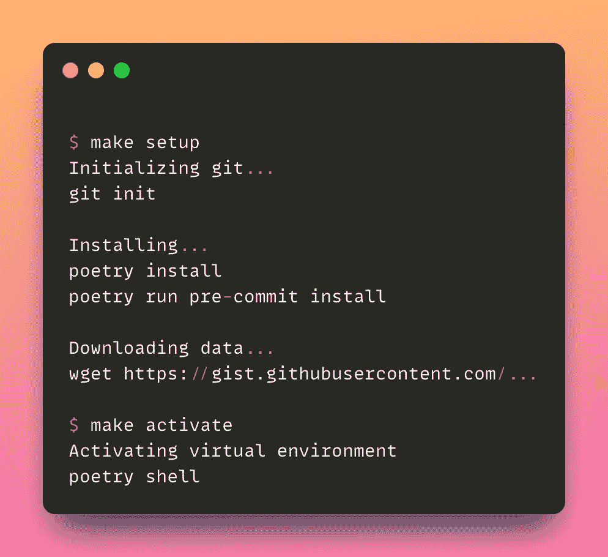

作者提供的图片

> [查看完整的 Makefile。](https://github.com/khuyentran1401/data-science-template/blob/prefect/%7B%7Bcookiecutter.directory_name%7D%7D/Makefile)

# 仅重新运行管道中已修改的组件

当你希望每当其依赖项被修改时运行一个任务时，make 也非常有用。

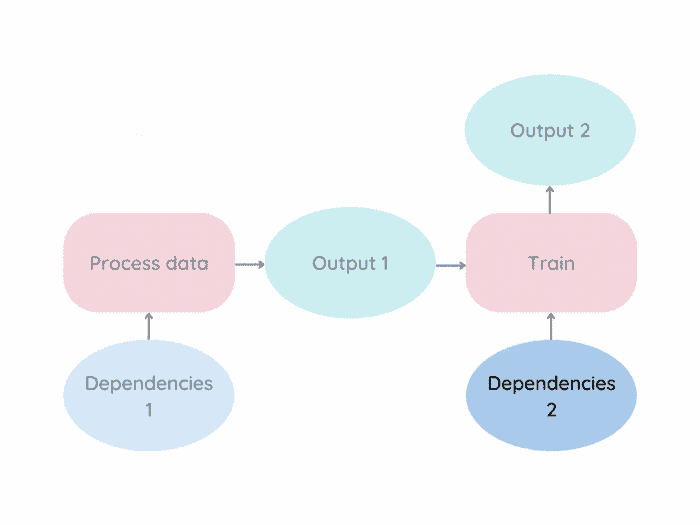

作者提供的图片

例如，让我们通过下面的图示和 Makefile 捕获文件之间的连接：

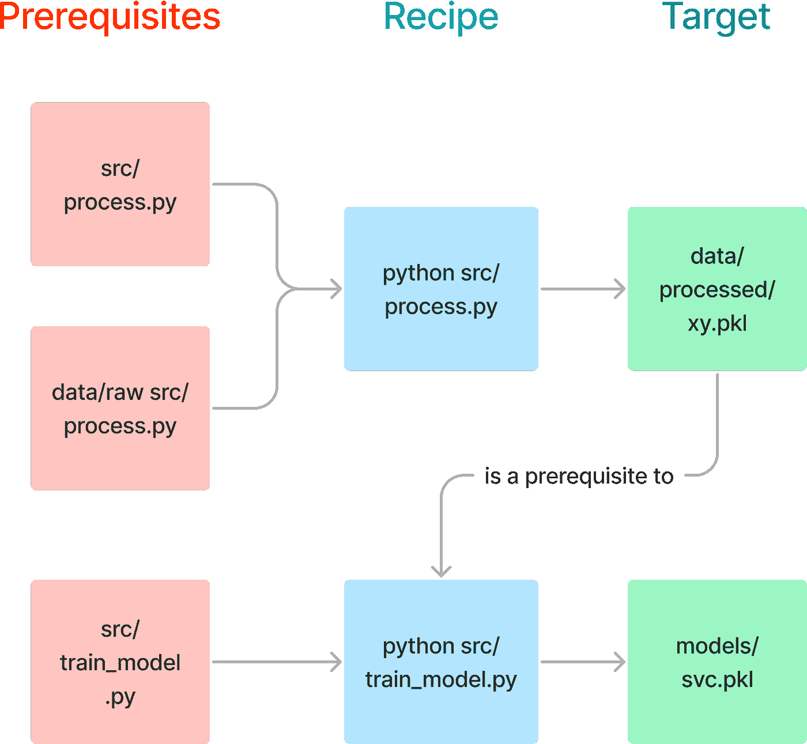

作者提供的图片

```py
data/processed/xy.pkl: data/raw src/process.py
 @echo "Processing data..."
 python src/process.py

models/svc.pkl: data/processed/xy.pkl src/train_model.py
 @echo "Training model..."
 python src/train_model.py

pipeline: data/processed/xy.pkl models/svc.pk
```

要创建文件 `models/svc.pkl`，你可以运行：

```py
make models/svc.pkl
```

由于 `data/processed/xy.pkl` 和 `src/train_model.py` 是 `models/svc.pkl` 目标的先决条件，make 将运行配方以创建 `data/processed/xy.pkl` 和 `models/svc.pkl`。

```py
Processing data...
python src/process.py

Training model...
python src/train_model.py
```

如果 `models/svc.pkl` 的先决条件没有变化，make 将跳过更新 `models/svc.pkl`。

```py
$ make models/svc.pkl 
make: `models/svc.pkl' is up to date.
```

因此，通过 make，你避免了在运行不必要的任务上浪费时间。

# 观察和自动化你的代码

这个模板利用了 [Prefect](https://www.prefect.io/) 来：

+   从 [Prefect UI](https://docs.prefect.io/ui/overview/) 观察你所有的运行。

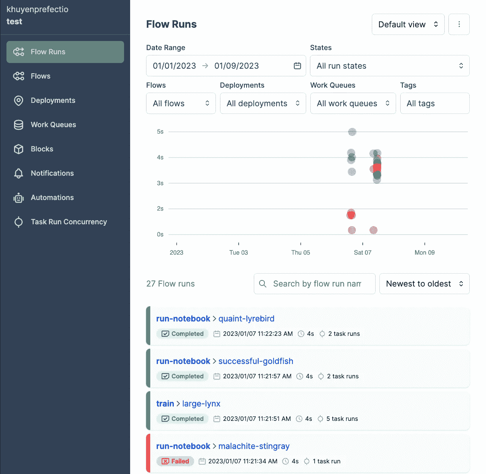

作者提供的图片

其中，Prefect 可以帮助你：

+   当你的代码失败时重试

+   安排你的代码运行

+   当你的流失败时发送通知

[](https://medium.com/the-prefect-blog/orchestrate-your-data-science-project-with-prefect-2-0-4118418fd7ce?source=post_page-----54d5e53b4c82--------------------------------) [## 使用 Prefect 2.0 编排你的数据科学项目

### 让你的数据科学管道对故障具有弹性

medium.com](https://medium.com/the-prefect-blog/orchestrate-your-data-science-project-with-prefect-2-0-4118418fd7ce?source=post_page-----54d5e53b4c82--------------------------------)

你可以通过将你的函数转换为 Prefect [流](https://docs.prefect.io/concepts/flows/) 来访问这些功能。

```py
from prefect import flow 

@flow
def process(
    location: Location = Location(),
    config: ProcessConfig = ProcessConfig(),
):
    ...
```

# 在运行时强制执行类型提示

[Pydantic](https://docs.pydantic.dev/) 是一个通过利用类型注释进行数据验证的 Python 库。

[](/build-a-full-stack-ml-application-with-pydantic-and-prefect-915f00fe0c62?source=post_page-----54d5e53b4c82--------------------------------) ## 使用 Pydantic 和 Prefect 构建一个完整的 ML 应用程序

### 用一行代码为 ML 特征工程创建一个 UI

[towardsdatascience.com

[Pydantic 模型](https://docs.pydantic.dev/usage/models/) 在流参数上强制执行数据类型，并在流运行时验证其值。

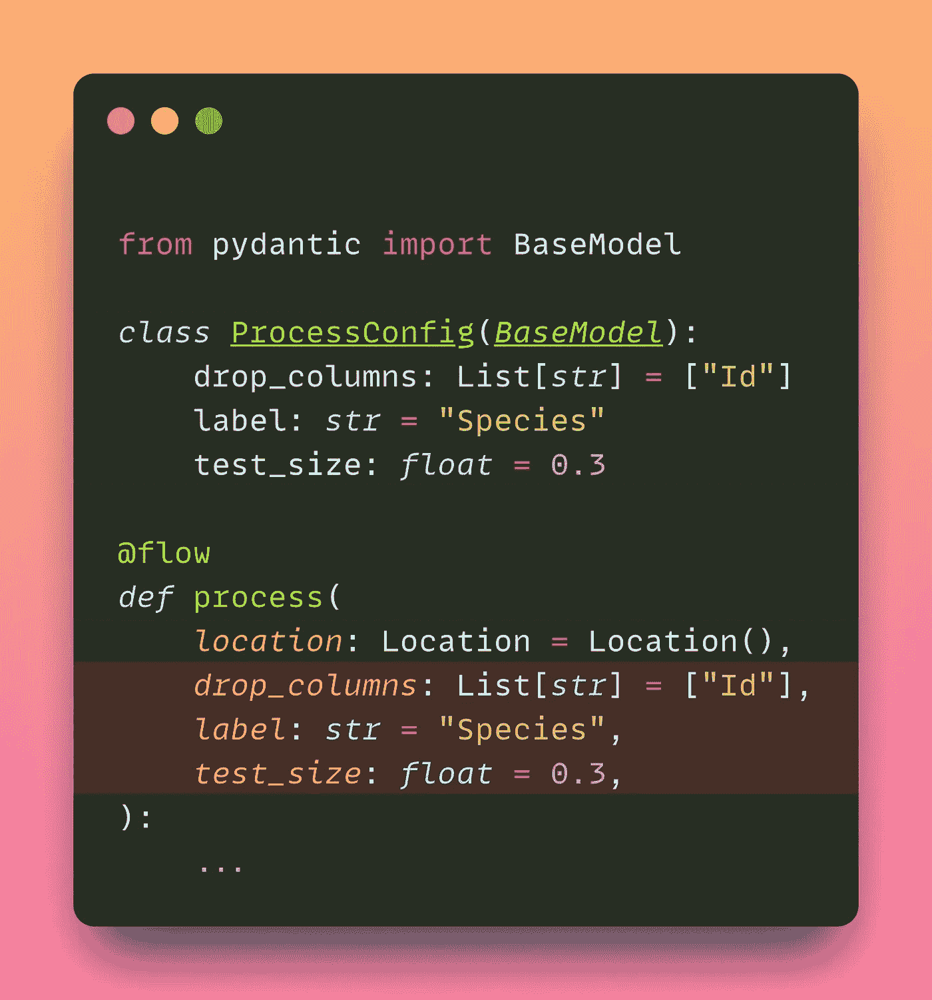

作者提供的图片

如果字段的值与类型注释不匹配，你将在运行时遇到错误：

```py
process(config=ProcessConfig(test_size='a'))
```

```py
pydantic.error_wrappers.ValidationError: 1 validation error for ProcessConfig
test_size
  value is not a valid float (type=type_error.float)
```

所有的 Pydantic 模型都在[这个](https://github.com/khuyentran1401/data-science-template/blob/prefect/%7B%7Bcookiecutter.directory_name%7D%7D/src/config.py) `[src/config.py](https://github.com/khuyentran1401/data-science-template/blob/prefect/%7B%7Bcookiecutter.directory_name%7D%7D/src/config.py)` [文件中](https://github.com/khuyentran1401/data-science-template/blob/prefect/%7B%7Bcookiecutter.directory_name%7D%7D/src/config.py)。

# 在提交之前检测代码中的问题

在将 Python 代码提交到 Git 之前，你需要确保你的代码：

+   通过单元测试

+   组织良好

+   符合最佳实践和风格指南

+   已记录

然而，在提交代码之前手动检查这些标准可能会很繁琐。[pre-commit](https://pre-commit.com/) 是一个框架，它允许你在提交代码之前识别代码中的问题。

[](/4-pre-commit-plugins-to-automate-code-reviewing-and-formatting-in-python-c80c6d2e9f5?source=post_page-----54d5e53b4c82--------------------------------) ## 4 个 pre-commit 插件用于自动化代码审查和格式化 Python 代码

### 使用 black、flake8、isort 和 interrogate 编写高质量代码

towardsdatascience.com

你可以向你的 pre-commit 管道中添加不同的插件。一旦你的文件被提交，它们将会按照这些插件进行验证。除非所有检查都通过，否则代码不会被提交。

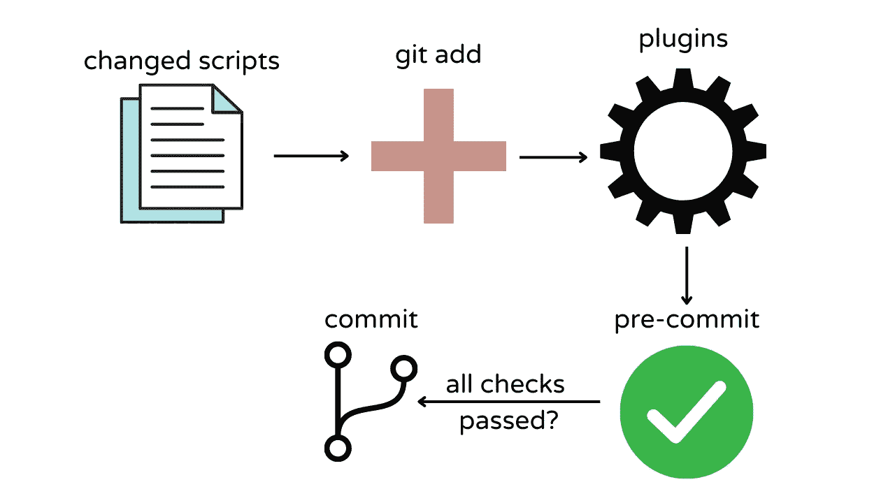

图片由作者提供

你可以在[这个](https://github.com/khuyentran1401/data-science-template/blob/prefect/%7B%7Bcookiecutter.directory_name%7D%7D/.pre-commit-config.yaml) `[.pre-commit-config.yaml](https://github.com/khuyentran1401/data-science-template/blob/prefect/%7B%7Bcookiecutter.directory_name%7D%7D/.pre-commit-config.yaml)` [文件](https://github.com/khuyentran1401/data-science-template/blob/prefect/%7B%7Bcookiecutter.directory_name%7D%7D/.pre-commit-config.yaml) 中找到所有在此模板中使用的插件。

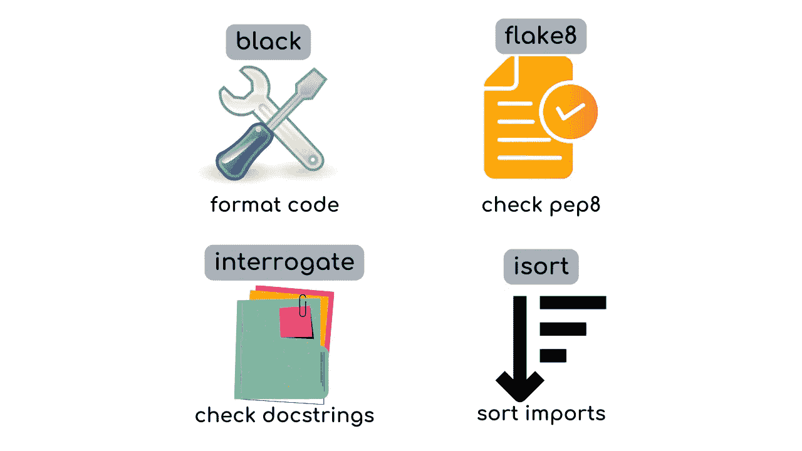

图片由作者提供

# 自动记录你的代码

数据科学家通常与其他团队成员合作完成项目。因此，为项目创建良好的文档是至关重要的。

要基于 Python 文件和对象的 docstrings 创建 API 文档，请运行：

```py
make docs_view
```

输出：

```py
Save the output to docs...
pdoc src --http localhost:8080
Starting pdoc server on localhost:8080
pdoc server ready at http://localhost:8080
```

现在你可以在 [`localhost:8080`](http://localhost:8080/) 查看文档。

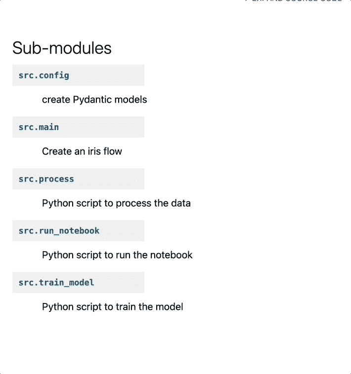

图片由作者提供

# 自动运行测试

[GitHub Actions](https://github.com/features/actions) 允许你自动化 CI/CD 管道，加快构建、测试和部署代码的速度。

[](https://pub.towardsai.net/github-actions-in-mlops-automatically-check-and-deploy-your-ml-model-9a281d7f3c84?source=post_page-----54d5e53b4c82--------------------------------) [## GitHub Actions 在 MLOps 中的应用：自动检查和部署你的 ML 模型

### 使用 GitHub Actions 自动化你的 ML 管道

[GitHub Actions 在 MLOps 中的应用](https://pub.towardsai.net/github-actions-in-mlops-automatically-check-and-deploy-your-ml-model-9a281d7f3c84?source=post_page-----54d5e53b4c82--------------------------------)

在 GitHub 上创建拉取请求时，你的 `tests` 文件夹中的测试将[自动运行](https://github.com/khuyentran1401/data-science-template/tree/prefect)。

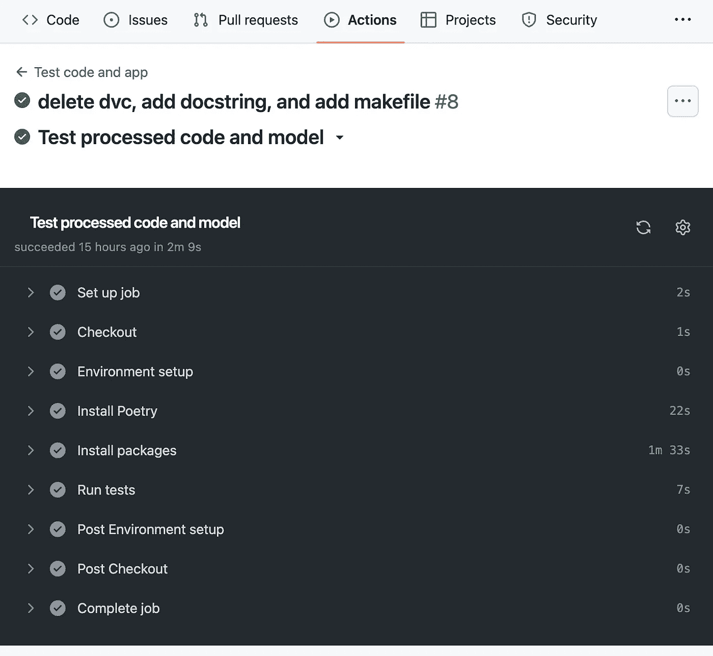

作者提供的图片

> [查看这个工作流的代码。](https://github.com/khuyentran1401/data-science-template/blob/prefect/%7B%7Bcookiecutter.directory_name%7D%7D/.github/workflows/run_test.yaml)

# 结论

恭喜你！你刚刚学习了如何使用模板创建一个可重用和可维护的机器学习项目。这个模板旨在具有灵活性。根据你的应用需求随意调整项目。

我喜欢写关于数据科学概念的文章，并玩各种数据科学工具。你可以在[LinkedIn](https://www.linkedin.com/in/khuyen-tran-1401/)和[Twitter](https://twitter.com/KhuyenTran16)上与我联系。

如果你想查看我写的文章的代码，可以给[这个仓库](https://github.com/khuyentran1401/Data-science)加星。关注我在 Medium 上，以获取我最新的数据科学文章通知：

[Pytest 为数据科学家准备](https://towardsdatascience.com/pytest-for-data-scientists-2990319e55e6?source=post_page-----54d5e53b4c82--------------------------------) [## Pytest 为数据科学家

### 关于你的数据科学项目的 Pytest 综合指南

[检测数据管道中的缺陷，早期验证和通知](https://towardsdatascience.com/detect-defects-in-a-data-pipeline-early-with-validation-and-notifications-83e9b652e65a?source=post_page-----54d5e53b4c82--------------------------------) [创建强大的数据管道，使用 Prefect、Docker 和 GitHub](https://towardsdatascience.com/create-robust-data-pipelines-with-prefect-docker-and-github-12b231ca6ed2?source=post_page-----54d5e53b4c82--------------------------------) [## 创建强大的数据管道，使用 Prefect、Docker 和 GitHub

### 使用 Deepchecks 和 Prefect 在 Python 中构建强大的数据管道

[检测数据管道中的缺陷，早期验证和通知](https://towardsdatascience.com/detect-defects-in-a-data-pipeline-early-with-validation-and-notifications-83e9b652e65a?source=post_page-----54d5e53b4c82--------------------------------) [创建强大的数据管道，使用 Prefect、Docker 和 GitHub](https://towardsdatascience.com/create-robust-data-pipelines-with-prefect-docker-and-github-12b231ca6ed2?source=post_page-----54d5e53b4c82--------------------------------) [## 创建强大的数据管道，使用 Prefect、Docker 和 GitHub

### 将你的工作流存储在 GitHub 上，并在 Docker 容器中执行

[创建强大的数据管道，使用 Prefect、Docker 和 GitHub](https://towardsdatascience.com/create-robust-data-pipelines-with-prefect-docker-and-github-12b231ca6ed2?source=post_page-----54d5e53b4c82--------------------------------) [介绍 DVC：机器学习项目的数据版本控制工具](https://towardsdatascience.com/introduction-to-dvc-data-version-control-tool-for-machine-learning-projects-7cb49c229fe0?source=post_page-----54d5e53b4c82--------------------------------) ## 介绍 DVC：机器学习项目的数据版本控制工具

### 就像 Git，但用于数据！

[towardsdatascience.com
