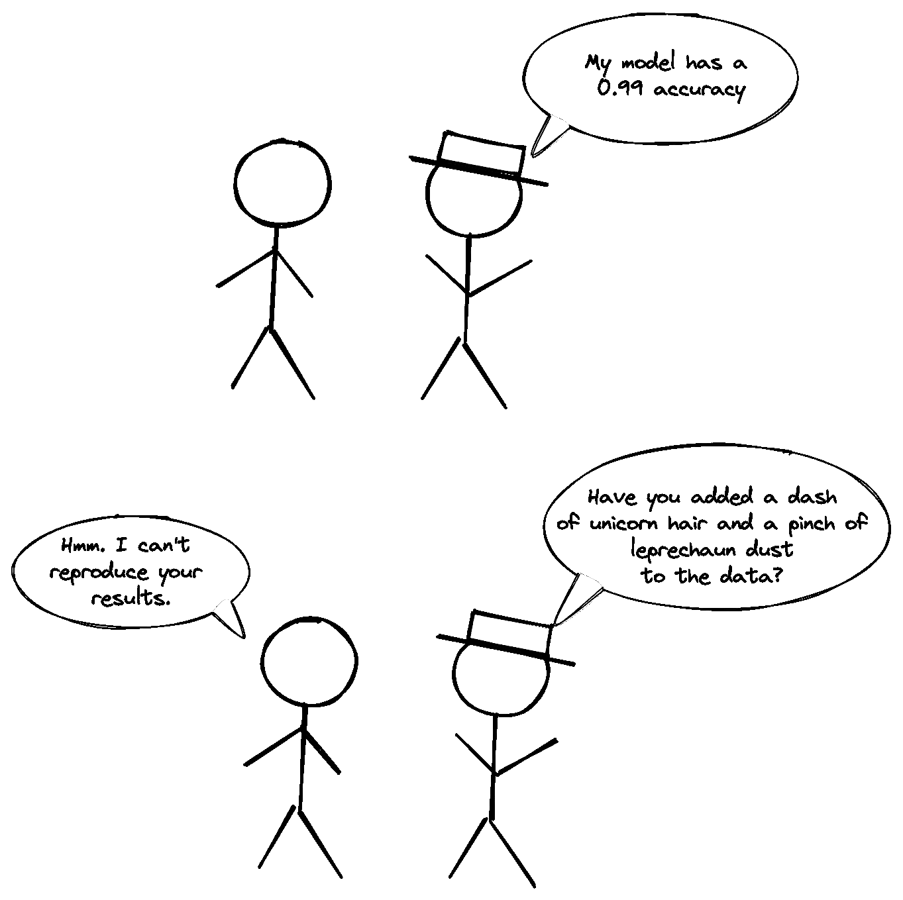

# 如何构建一个便于重现和维护的机器学习项目

> 原文：[`towardsdatascience.com/how-to-structure-an-ml-project-for-reproducibility-and-maintainability-54d5e53b4c82?source=collection_archive---------0-----------------------#2023-01-15`](https://towardsdatascience.com/how-to-structure-an-ml-project-for-reproducibility-and-maintainability-54d5e53b4c82?source=collection_archive---------0-----------------------#2023-01-15)

## 使用此模板启动你的下一个机器学习项目

 [Khuyen Tran](https://khuyentran1476.medium.com/?source=post_page-----54d5e53b4c82--------------------------------)

·

[关注](https://medium.com/m/signin?actionUrl=https%3A%2F%2Fmedium.com%2F_%2Fsubscribe%2Fuser%2F84a02493194a&operation=register&redirect=https%3A%2F%2Ftowardsdatascience.com%2Fhow-to-structure-an-ml-project-for-reproducibility-and-maintainability-54d5e53b4c82&user=Khuyen+Tran&userId=84a02493194a&source=post_page-84a02493194a----54d5e53b4c82---------------------post_header-----------) 发表在 [Towards Data Science](https://towardsdatascience.com/?source=post_page-----54d5e53b4c82--------------------------------) ·7 分钟阅读·2023 年 1 月 15 日

--

## 动机

在构建机器学习项目时，开始阶段通常是最具挑战性的部分。你应该如何组织你的代码库？你应该遵循哪些标准？你的团队成员能否重现你实验的结果？

作者提供的图片

与其试图寻找一个理想的代码库结构，不如有一个模板来帮助你开始工作岂不是更好？

作者提供的图片

这就是为什么我创建了[data-science-template](https://github.com/khuyentran1401/data-science-template/tree/prefect)，整合了我多年来关于数据科学项目结构的最佳实践。

[## GitHub - khuyentran1401/data-science-template at prefect](https://github.com/khuyentran1401/data-science-template/tree/prefect?source=post_page-----54d5e53b4c82--------------------------------)

### 这个模板是我多年来改进的结果，旨在为数据科学项目提供最佳结构，以便它能够…

[github.com](https://github.com/khuyentran1401/data-science-template/tree/prefect?source=post_page-----54d5e53b4c82--------------------------------)

这个模板允许你：

✅ 创建一个易于阅读的项目结构

✅ 高效管理项目中的依赖关系
