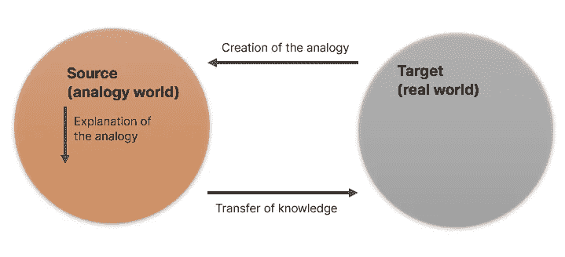

# 如何与非数据人士讨论数据和分析

> 原文：[`towardsdatascience.com/how-to-talk-about-data-and-analysis-to-non-data-people-2457dc600219`](https://towardsdatascience.com/how-to-talk-about-data-and-analysis-to-non-data-people-2457dc600219)

## 面向数据专业人员的逐步教程

 [Michal Szudejko](https://medium.com/@michalszudejko?source=post_page-----2457dc600219--------------------------------)

·发表于 [Towards Data Science](https://towardsdatascience.com/?source=post_page-----2457dc600219--------------------------------) ·14 分钟阅读·2023 年 9 月 22 日

--

# 数字盲症是新的文盲

在我最近的 文章 中，我指出今天许多公司面临的一个重大挑战是可用数据的庞大数量和它们在决策中有效使用数据的能力有限。这个问题的核心主要是人为因素。因此，迫切需要建立 数据素养。如果公司真心希望从海量数据中受益，它们必须提升整体的数字能力。

> **88%** 的潜在受众可能在阅读数字、图表或计算时感到困难。

根据全球识字研究，仅有 **12%** 的成年人在数字方面具备基本能力。这意味着**88%** 的潜在受众可能在阅读数字、图表或计算时感到困难。¹ 这与全球的识字率形成鲜明对比，后者目前超过 86%。²

值得注意的是，许多社会忽视了这个问题。更有甚者，许多人对自己的数字盲症感到自豪。³ 你是否听过这样的借口：

+   我不是一个擅长数字的人。

+   统计学从未引起过我的兴趣。

+   物理学对我而言似乎像巫术。

或者是“终极”的：

+   **我更倾向于人文学科。**

# 这真的算是一个有效的借口吗？

通常，这不是能力不足的问题，而是缺乏合适的工具。考虑一下这种情况：

*我们尝试过马路。我们观察到交通从两个方向接近。我们必须判断是否有足够的时间安全过马路。远处的那辆车呢？它的速度有多快？它的速度是在增加吗？在减少吗？司机注意到我们了吗？*

来源：作者提供的图片

实际上，过马路是一个复杂的概率挑战。然而，我们每天都会处理这个问题，通常会多次进行，并且通常能做对。⁴

**这只是冰山一角。**

想想以 60 英里每小时的速度驾驶汽车。涉及多少因素？驾驶时，你还在监控速度计和各种其他仪器。这与解读管理仪表板上的复杂视觉信息并无不同。再说早上选择穿什么衣服。你在做出判断和预测，这些都是即使是复杂的 AI 工具也会面临的挑战：预测天气，判断流行趋势，以及搭配颜色。

人脑每天处理大约 74 GB 的数据。⁵ 值得注意的是，它仍然能做出决策。与此同时，我的 ChatGPT 在处理一个 20 万行的 Excel 电子表格时出现了问题。

来源：图片由 Alexander Wivel 提供，CC BY 3.0，[链接](https://commons.wikimedia.org/w/index.php?curid=8719730)。

使用“人文主义者”标签也不是一个有效的借口。考虑拆解复杂的文学作品，比如诗歌。或者处理深奥的哲学难题？或者拼凑复杂的历史战斗计划？这些任务往往比构建统计模型更具挑战性。

**我为什么提到这些？我的观点是，不算数的情况通常并不是由于能力的缺乏。而是由于缺乏工具和无效的沟通。**

> 讽刺的是，许多声称不懂统计的人在日常任务中表现出处理复杂概率评估和决策的能力。

# 为什么我们在沟通中使用数据？

有效的沟通在商业中至关重要；整合数据分析可以提升它。以下是方法：

+   **提高意识：** 使用数据突出问题，解释其原因，提出解决方案，并预测结果。

+   **强调重要性：** 数据客观地排序，指导决策，例如先处理哪些项目。

+   **证明因果关系：** 企业常常混淆相关性和因果关系。只有合适的数据工具才能澄清这一点。

+   **讲故事的基础：** 使用数据来构建叙事，提供背景，阐明问题，并得出结论。

+   **预测能力：** 许多公司依赖直觉进行情景规划。这是一种有风险的方法。数据提供了更清晰的前进路径。⁶

# 谁应该负责讨论数据？

在观看了许多 YouTube 视频和阅读了无数文章后，我能给出的简单答案是“数据科学家”。但这并不正确。请允许我详细说明我的理由。

来源：图片由作者基于 Rebecca Nugent | TEDxCMU 制作：[我们都是数据科学家](https://www.youtube.com/watch?v=YMnqPTLoj7o)。

**你看到上面图片中的独角兽了吗？从理论上讲，它代表了“完美的数据科学家”，具备硬技能和软技能的最佳结合。** 然而，找到这样的人才就像寻找真正的独角兽一样困难。当你找到时，确保你的口袋足够深。

过分依赖这些稀有的人才有其风险。许多企业在这些顶级人才转向新机会时面临挫折。组织如何减轻这一风险？ **可以在整个团队中培养这些结合的技能，而不是集中在一个人身上。** 我将介绍一个关于小团队的简短案例研究，以更好地说明我的观点。

# 小案例研究：数据科学家和业务分析师之间的合作

## 方法论

*这个小案例使用 ChatGPT Plus 和高级数据分析准备。具体来说，我利用它创建了合成数据和数据可视化。*

## 设置

设想一个由数据科学家（DS）和业务分析师（BA）组成的小团队。他们的任务是探查和阐明零售公司日常销售中的不规律现象，该公司主要依赖店内购买。

## 合作模型

**第 1 步：** 数据科学家（DS）与业务分析师（BA）合作，精炼问题范围，确定分析的数据，建立时间框架，并选择最有效的沟通方式。

**第 2 步：** 然后数据科学家（DS）开始分析，过程如下：

来源：作者根据[数据分析过程步骤](https://careerfoundry.com/en/blog/data-analytics/the-data-analysis-process-step-by-step/)制作的图片

**第 3 步。** 数据科学家（DS）采用结合移动平均和标准差的方法。这有助于检测销售数据中的异常。一个数据点超出设定的阈值（距离移动平均 2 个标准差）被标记为异常。

**第 4 步。** 完成后，数据科学家（DS）将发现传达给业务分析师（BA）。

来源：作者使用 ChatGPT 和高级数据分析生成的图片

**第 5 步。** 业务分析师（BA）解读异常：

+   **我们店内的促销（第 50–60 天，2 月底）：** 这里的销售上升可能是由于店内促销，导致顾客访问和购买增加。

+   **竞争对手的新店开张（第 150–160 天，6 月初）：** 附近的新店可能吸引了一些我们的顾客，导致我们的销售额下降。

+   **临时店铺关闭（第 250–260 天，9 月中旬）：** 9 月份销售显著下降，表明我们的一家门店可能因翻修或意外事件暂时停止运营。

+   **另一个促销活动（第 320–330 天，11 月下旬）：** 这个时期销售的激增可能源于我们店内的另一个促销或销售活动。

**第 6 步。** 业务分析师（BA）和数据科学家（DS）一起审查发现。这种合作使数据科学家（DS）获得业务方面的见解，同时业务分析师（BA）提升数据处理能力。

**第 7 步**。在相关建议的补充下，最终的分析结果会呈现给相关利益相关者。

## 结论

这个简洁的案例研究强调了数据科学家与业务分析师之间的协同关系。数据科学家专注于通过统计技术进行异常检测，而业务分析师则将这些发现置于背景中，描述潜在原因并提供实际见解。**正如所示，两个角色之间的强大沟通对这一协作的成功至关重要。**

> 就像那些“没有数学能力”的人可能会避开数字和图表一样，“有数学能力”的人常常也会犹豫参与人际互动。

# 沟通也是一门科学

就像那些“没有数学能力”的人可能会避开数字和图表一样，“有数学能力”的人常常也会犹豫参与人际互动。

**你知道吗？这是一个极其不公正的刻板印象。**

虽然我认识一些能够轻松沟通的数学能力强的人，即使你是一个内向的数学能力强者，你也可以利用你的技能，将沟通视为一种方法论，就像任何统计挑战一样。

**沟通可以提炼为三个主要组成部分：**

来源：基于[沟通的谁、为什么、怎么做和什么](https://www.linkedin.com/pulse/who-why-how-what-communication-rajesh-joshi/)的作者图片

**这个简单的模型不仅是一种结构化沟通的方法。它还为我的演示提供了一个即时的结构，我可以始终如一地应用它。**

现在，让我提供一些关于如何处理这三个组成部分的一手指导。

# WHY: 关注他人

背景至关重要，正如我最新的一篇文章所示。背景对叙述的影响高达 80%。故事的背景涵盖三个核心方面：情境、功能和数据驱动。这些基础信息为叙述者和听众提供了准备，解答了关于故事受众、核心主题和传达方式的关键问题。**拥抱并融入背景对于故事与其目标听众的连接和理解至关重要。**

数据专业人员常见的一个疏忽是过于依赖技术语言。这种情况很容易发生，尤其是当我们忽视上下文时。例如，针对特定观众使用某些术语是否合适？如*“cohort”*或*“longitudinal”*这样不常在学术界外使用的短语，以及*“surveillance”*这样解释多样的术语，可能会引起困惑。类似地，*“probability”*或*“risk”*这样的概念也可能被误解。如果这些术语不可或缺，尽量以易于理解的方式呈现。即便详细的论点制作得再精细，也应避免陷入细节的泥潭。理解许多人基于直觉捷径而非逻辑模型进行操作是有益的，这些捷径受到诸如锚定效应、误解因果关系、忽视随机性等偏见的影响。⁶

# 如何：编写好的故事

精心编写的故事在企业沟通中的影响显而易见，特别是当有数据支持时。但在这次讨论中，我想深入探讨这些故事是如何构建的。考虑一下**Brent Dykes**所倡导的叙事弧。

来源：作者基于[Brent Dykes 的帖子](https://www.linkedin.com/posts/brentdykes_datastorytelling-data-storytellingwithdata-activity-7107388276998569984-tKE4?utm_source=share&utm_medium=member_desktop)的图片

**漫长的开头可能会毁掉使用数据的故事。** 这可能是故意的，也可能是无意的。例如，观众可能突然缩短了一个精心组织的故事，导致我们不得不对其进行删减。有时只是因为故事计划得不好。我们如何避免这些问题呢？

**Cole Nussbaumer Knafflic**，全球畅销书的著名作者⁷，推荐了一种方法：**3 分钟故事。**

考虑制作一个简洁的、3 分钟的演讲版本。这种方法有两个好处。首先，它作为备用方案，以防你分配的时间意外减少到仅有的 3-5 分钟。其次，它作为一个完善工具。**如果你能有效并快速地将演讲缩减到 3 分钟，从完整版本中剔除多余内容就会变得轻而易举。**

**排练**

我建议的另一种策略是排练。尽可能地练习你的演讲，最好是大声朗读。虽然在镜子前排练是有益的，但请可信的同事提供反馈可能更有价值。

# 如何：使用类比

类比是将两个事物进行类比，通常用于阐明或澄清。例如，考虑我之前使用的“过马路”例子。使用类比时，我们旨在通过更熟悉的场景来揭示复杂的分析。

来源：作者基于[数据讲故事：类比的力量](https://growthtribe.io/blog/data-storytelling-the-power-of-analogies)的图片

类比背后的概念是将视角从具体的数据项目转移到一个更广泛、更熟悉的背景中，在那里解释，然后再将理解带回到原始数据背景中。类比作为有用的连接器，将复杂的数据主题与日常情况联系起来，使其更易于理解。要制作有意义的类比，重要的是深入理解数据，脑暴相关的情境，评估其适用性，然后重新聚焦于数据的核心问题。

**那么，在哪里可以找到好的类比呢？** 现实生活中的例子往往能够准确打击目标。然而，挑战在于当需要时能够随手拿到它们。一个现代解决方案是咨询 ChatGPT 以获得创意建议。以下，我提供了与之前讨论的迷你案例研究相关的类比示例。

来源：作者截图

另一种策略需要更多的投入：**持续收集和存储类比想法。** 这可以是一个实体笔记本、一个数字平板或任何适合你的方法。关键是保持这些笔记有条理并且触手可及。

**然而，关于类比还有一个警示点。** 过度延伸类比的风险。你对背景越不熟悉，你偏离的可能性就越大。如果人们认为比较过于简单、粗鲁或幼稚，这可能会成为问题。

**不要让你的观众感觉像幼儿园的孩子一样。** 来源：作者图像

# 如何：注意时间安排

为了管理时间问题，我为自己设定了一个指导方针。通常，我为每张幻灯片分配大约 1.5 分钟用于复杂的数据驱动型演示文稿，包括标题、议程、休息幻灯片等。我不区分内容丰富的幻灯片和较为简洁的幻灯片。在较长的演示文稿中，这种做法往往能达到平衡。对于不那么复杂的演讲，其中幻灯片的数据量较少，我可能将时间减少到每张幻灯片 1 分钟。在这种情况下，我总是优先提前排练这些演示文稿。有时，这种减少是基于之前的排练估算出来的。

如果给定了具体的时间，例如 15 分钟，特别是针对高级管理人员的演示文稿，我使用以下公式来确定最大幻灯片数量：

最优幻灯片数量公式。

`Nslides`表示演示文稿中的最大幻灯片数量（四舍五入到最接近的整数值）。`Tminutes`是分配的时间。对于少于十张幻灯片的简短演示文稿，我省略了议程或问答幻灯片。

对于 15 分钟的时间段，这个公式允许我制作最多 7 张幻灯片。因此，我会将我的演示结构为一个标题幻灯片，接着最多 6 张内容幻灯片。这将分解为一个背景幻灯片，最多四个分析幻灯片，以及一个专门用于主要结论和行动呼吁（CTA）的幻灯片。如有必要，我可能会略微调整这个分配，也许为 CTA 保存一个独立的幻灯片。

**为什么要如此简洁？通常这样就足够了。此外，我们还需要考虑到不可预见的情况，例如：**

+   连接显示设备的时间延长

+   主要参与者迟到

+   分配时间用于积极讨论

+   任何其他不可预见的中断或延迟。

# **如何：关注数字**

一个关键的方面是我们展示数字的方法。为了说明这一点，我将提供一个示例。首先，让我们查看“错误的”图表。

来源：作者提供的图片

现在是修正后的版本。

来源：作者提供的图片

**看出区别了吗？**

第二张图展示了**“有效数字”**的指南。从我的经验来看，三个似乎是显示数字的最佳数量。使用两个数字虽然很诱人，但对于像公司收入这样的关键数据，有过度简化的风险，可能会误导。

然后是**“友好数字”**原则。它涉及以最简单、最易记的方式呈现数字。例如，与其详细说明 USD 2,954,321.51，我们可能会四舍五入到大约 USD 3 百万。但使用这种方法时要小心：这可能会无意中扭曲数据，从而误导受众。

# **如何：利用标题的力量**

标题在数据驱动的讲述中扮演着至关重要的角色。一个引人注目的标题吸引了观众，并且通常提供了重要的见解，消除了从表格或图表中进行详细数据分析的需要。**它使他们能够决定是否深入了解内容或等待更相关的信息。**

在制作标题时，考虑利用新闻业和互联网中的**“力量词”**技巧。这些词汇能够巧妙地管理注意力和设定期望。例如，“*迅速的胜利*”，“*唯一可行的解决方案*”或“*项目中的红旗*”可能具有很大的影响力。然而，使用力量词时需谨慎：如果我们最初将一个解决方案呈现为简单快捷，但随后的内容揭示了复杂的挑战，我们的可信度可能会受到影响。

此外，避免使用纯技术性的标题，例如“*报告给 IT 的事件数量*”。相反，**选择** **功能性标题**，提供背景信息，例如*“实施后，报告的事件数量增加。”* 这能确保你的受众能够迅速理解内容的相关性和影响。

# **如何：战略性地使用颜色**

颜色是数据驱动沟通中的强大工具。然而，它是一个需要负责任使用的工具。我们应抵制仅仅为了装饰目的使用颜色的诱惑。在所有情况下，颜色应具有功能性意义，突出关键信息。为说明这一点，让我们看看下面的图表。

装饰性使用颜色：

来源：作者提供的图像

战略（功能性）使用颜色：

# HOW: 明智选择视觉效果

正如[这篇文章](https://medium.com/towards-data-science/leveraging-management-dashboards-for-storytelling-a-viable-pathway-4bdeeed1fa59)中探讨的那样，三种可视化方式是可靠的，可以传达广泛的数据相关信息而不会引起混淆。虽然这个列表并不详尽，但遵循它会显著提高成功的可能性。

来源：作者提供的图像

**使用这三种可视化方式：**

+   **柱状图（或条形图）：** 适用于比较累积或离散的值。可以用于趋势展示，前提是没有重大变化。

+   **折线图：** 有效展示方向和趋势的变化，特别适用于连续变量。多个折线可以在同一图表上进行比较。

+   **饼图：** 适合显示某部分对整体的贡献（例如，某一特定产品产生的收入占总销售额的百分比）。**无论如何都要避免使用饼图进行比较！**

来源：作者在 Adobe Photoshop 2024 中生成的图像

创建图表时，遵循上述规则（例如，颜色和标题），并考虑适当的缩放（特别是纵轴，通常应从 0 开始，除非有充分理由）。通过去除框架、网格线、坐标轴标签或图例等多余元素来简化图表。

# WHAT: 使用 CTA

本文的最后一条建议是使用行动号召（CTA）。

没有 CTA，我们的演示最多只能是一个引人入胜的或许有趣的信息。一个精心制作的 CTA 赋予数据驱动的讲故事以独特的特征。

**什么使 CTA 有效？**

+   使用主动语态而非被动语态。

+   小心使用祈使句。

+   清楚地识别出负责执行商定行动的个人或团队。

+   在演示后立即跟进决策，并随后在短时间内进行跟进以确保进展。

# 结论

**成功：** 作者在 Adobe Photoshop 2024 中生成的图像

在数据沟通中，数字能力和数字盲之间存在显著差距。尽管全球只有 12%的成年人具备数字素养，大多数人却难以理解数据。然而，讽刺的是，许多自称数字盲的人在日常任务中展示了处理复杂概率评估和决策的能力。**挑战不在于他们的固有能力，而在于传达数据所使用的工具和方法。**

有效的沟通策略通过制作相关的类比、战略性地使用视觉效果和采用深思熟虑的叙事来弥合这一鸿沟。通过掌握观众的背景并减少技术术语，数据专业人士可以提高可及性。

**最终，数据讲故事和沟通的核心在于简化复杂性、与观众建立联系，并推动可操作的洞见。无论你是数据科学家还是商业分析师，关键在于使用观众的语言进行对话，确保数据的力量保持清晰。**

你喜欢这篇文章吗？[**考虑订阅**](https://medium.com/@michalszudejko/subscribe)以获取我发布的新故事通知或[**关注我**](http://michalszudejko/)。

# 资源

1.  安·怀利：[各国的数字能力水平是多少？](https://www.wyliecomm.com/2021/02/what-are-numeracy-rates-by-country/)

1.  世界人口审查：[2023 年各国识字率](https://worldpopulationreview.com/country-rankings/literacy-rate-by-country)

1.  密苏里科技大学：[数字盲：误传的结果](https://scholarsmine.mst.edu/cgi/viewcontent.cgi?article=1005&context=peer2peer)

1.  丽贝卡·纽金特 | TEDxCMU：[我们都是数据科学家](https://www.youtube.com/watch?v=YMnqPTLoj7o)

1.  奇思妙想：[人脑每天学习多少信息？](https://medium.com/@askwonder/how-much-information-does-the-human-brain-learn-every-day-92deaad459a6)

1.  国家癌症研究所：[让数据发声：一本工作手册](https://www.cancer.gov/publications/health-communication/making-data-talk.pdf)

1.  科尔·努斯鲍默·克纳夫利克：[用数据讲故事：商业专业人士的数据可视化指南](https://www.storytellingwithdata.com/books)
