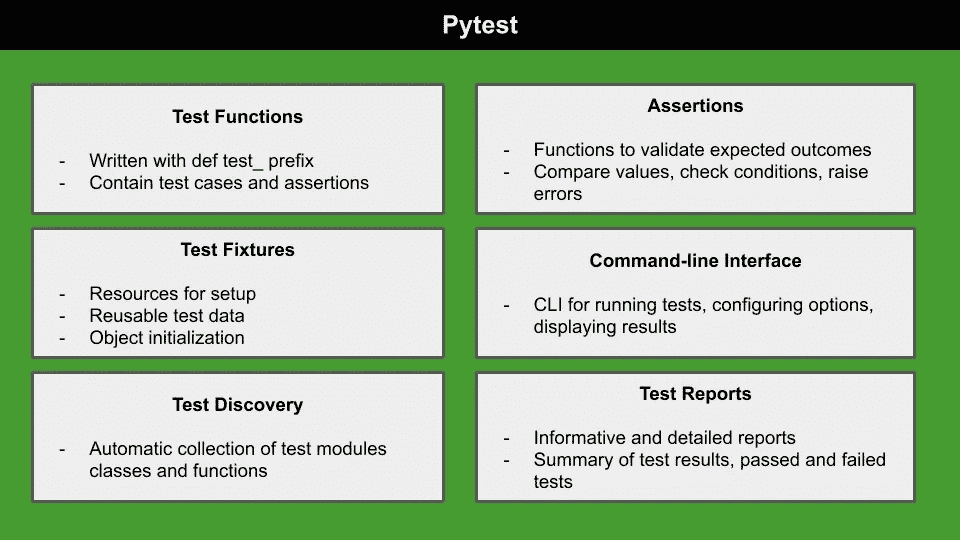

# 如何使用 Pytest 测试您的 Python 代码

> 原文：[`towardsdatascience.com/how-to-test-your-python-code-with-pytest-c8f055979dd7`](https://towardsdatascience.com/how-to-test-your-python-code-with-pytest-c8f055979dd7)

## 编程，Python

## 简化您的测试过程，并通过 Pytest 提升代码质量

[](https://alod83.medium.com/?source=post_page-----c8f055979dd7--------------------------------)[](https://towardsdatascience.com/?source=post_page-----c8f055979dd7--------------------------------) [Angelica Lo Duca](https://alod83.medium.com/?source=post_page-----c8f055979dd7--------------------------------)

·发布在 [Towards Data Science](https://towardsdatascience.com/?source=post_page-----c8f055979dd7--------------------------------) ·5 分钟阅读·2023 年 6 月 1 日

--



作者提供的图像

您是否厌倦了花费几个小时调试代码和修复那些本可以轻易避免的错误？我们知道当您的代码不能正确工作时，尤其是在需要迅速交付结果的压力下，这会让人感到非常沮丧。但是别担心！有一个解决方案：Pytest。

Pytest 是一个强大的测试框架，帮助确保您的代码在不同的场景和条件下按预期工作。将 Pytest 集成到您的代码中可以帮助您在问题变成麻烦之前发现并修复错误，从而节省时间和精力。

在本文中，我们将向您展示如何开始使用 Pytest。从设置环境到编写覆盖所有代码的测试，我们为您提供了完整的指导。那么还等什么？让我们开始测试，确保您的代码每次都能完美运行。

我们将涵盖：

+   Pytest 概述

+   实际示例

让我们从 Pytest 的概述开始描述。

# Pytest 概述

Pytest 是一个关注简单性和易用性的 Python 测试框架。要安装 Pytest，请运行以下命令：

```py
$ pip install pytest
```

Pytest 遵循模块化和可扩展的架构，允许开发人员将测试组织成单独的测试函数或类。

当您使用 Pytest 构建测试时，必须遵循以下步骤：

1.  **创建一个新的脚本** `test_<mytest>.py` 用于您的测试。将 Pytest 导入到脚本中。

1.  **定义您的测试函数**：测试函数是一个 Python 函数，用于验证代码行为的特定方面。每个测试函数应该是自包含的，专注于单个测试用例。Pytest 会自动发现并执行这些测试函数。

1.  **测试命名规范**：每个测试函数必须以`test_`开头，以便 Pytest 正确识别它。

1.  **测试断言**：使用测试断言来定义函数的行为。Pytest 提供了广泛的强大断言函数。

1.  **测试夹具**：夹具是提供可重用和预配置的资源或测试数据的函数，供你的测试函数使用。

## 一些资产函数列表

下面是 Pytest 提供的一些主要断言：

1.  `assert`：通过检查给定条件是否为真来进行简单断言。

1.  `assertEqual`：比较两个值的相等性。它检查期望值是否等于实际值。

1.  `assertTrue` 和 `assertFalse`：验证给定条件是否为真或假。

1.  `assertRaises`：检查在执行代码时是否抛出特定异常。

1.  `assertIn` 和 `assertNotIn`：验证值是否在给定集合或序列中存在或不存在。

1.  `assertAlmostEqual`：将浮点值与指定的精度进行比较。

1.  `assertDictEqual`：检查两个字典是否具有相同的键值对集合。

1.  `assertRaisesRegex`：验证是否抛出特定异常，并且异常消息是否匹配正则表达式模式。

现在你已经了解了 Pytest 背后的基本概念，让我们进入实际示例。

# 实际示例

让我们设想构建一个计算器并测试其实现是否正确。首先，我们定义核心函数，然后编写测试。

## 核心函数

核心函数实现了计算器的操作。例如，我们可以编写以下简单代码来实现主要操作：

```py
def add(a, b):
    return a + b

def subtract(a, b):
    return a - b

def multiply(a, b):
    return a * b

def divide(a, b):
    return a / b
```

将文件保存为 `calculator.py`。

## 测试函数

在我们保存核心函数的相同目录中，添加一个名为 `test_calculator.py` 的脚本。首先，导入核心函数和 Pytest 库：

```py
import pytest
from calculator import add
```

然后，为 `calculator.py` 文件中的每个函数添加测试。对于每个函数，添加一个单独的测试。例如，要测试 `add()` 函数，编写以下测试：

```py
 def test_addition():
    result = add(2, 4)
    assert result == 6

    result = add(-1, 3)
    assert result == 2

    result = add(0, 0)
    assert result == 0
```

类似地，你可以为其他函数编写测试。你可以在[这个 GitHub 仓库](https://github.com/alod83/data-science/tree/master/Tests/Calculator)中找到完整的示例。

要运行测试，打开终端，并从包含两个脚本的文件夹中运行以下命令：

```py
pytest
```

你应该得到以下输出：

```py
 % pytest
================================================== test session starts ===================================================
platform darwin -- Python 3.8.10, pytest-7.1.3, pluggy-1.0.0
rootdir: /Users/angelica/CNR/Git/data-science/Tests/Calculator
plugins: typeguard-2.13.3, anyio-3.3.4
collected 4 items                                                                                                        

test_calculator.py ....                                                                                            [100%]

=================================================== 4 passed in 0.02s ====================================================
```

## 使用测试夹具

让我们修改前面的示例以支持测试夹具。首先，创建一个新目录和一个名为 `calculator.py` 的新文件。将计算函数封装在一个类中：

```py
class Calculator:
    def __init__(self):
        self.result = 0

    def add(self, a, b):
        self.result = a + b
        return self.result

    def subtract(self, a, b):
        self.result = a - b
        return self.result
    def multiply(self, a, b):
        self.result = a * b
        return self.result

    def divide(self, a, b):
        self.result = a / b
        return self.result
```

然后，在相同目录中创建另一个名为 `test_calculator.py` 的脚本。在脚本开始时导入 Pytest 和 `Calculator` 类：

```py
import pytest
from calculator import *
```

使用 `@pytest.fixture` 装饰器定义一个名为 `calculator` 的夹具。夹具是提供可重用资源或设置操作的函数。在这种情况下，`calculator` 夹具创建了 `Calculator` 类的实例并返回它。

```py
@pytest.fixture
def calculator():
    # Create an instance of the calculator
    calc = Calculator()
    return calc
```

现在我们可以在测试中使用测试夹具 `calculator`：

```py
def test_multiplication(calculator):
    result = calculator.multiply(4, 3)
    assert result == 12

def test_division(calculator):
    result = calculator.divide(10, 2)
    assert result == 5
```

最后，运行测试：

```py
pytest
```

你应该得到以下输出：

```py
pytest
================================================== test session starts ===================================================
platform darwin -- Python 3.8.10, pytest-7.1.3, pluggy-1.0.0
rootdir: /Users/angelica/CNR/Git/data-science/Tests/CalculatorFixture
plugins: typeguard-2.13.3, anyio-3.3.4
collected 4 items                                                                                                        

test_calculator.py ....                                                                                            [100%]

=================================================== 4 passed in 0.01s ====================================================
```

你可以在[这个 GitHub 仓库](https://github.com/alod83/data-science/tree/master/Tests/CalculatorFixture)中找到完整的示例。

# 总结

恭喜！你刚刚学习了如何使用 Pytest 为你的 Python 代码添加测试！将 Pytest 作为你的测试框架可以确保你的 Python 代码的可靠性和长期稳定性！

使用 Pytest 非常简单：你只需编写直观的测试函数！

# 你可能还感兴趣的是……

[](https://medium.com/syntaxerrorpub/4-docker-options-you-may-not-know-fef301a5ce03?source=post_page-----c8f055979dd7--------------------------------) [## 你可能不知道的 4 种 Docker 选项

### 如何在 Docker 中删除镜像，从基础镜像重建镜像，将一些配置文件传递给 Docker……

[medium.com](https://medium.com/syntaxerrorpub/4-docker-options-you-may-not-know-fef301a5ce03?source=post_page-----c8f055979dd7--------------------------------) [](/how-to-install-spark-nlp-5fcd36fab378?source=post_page-----c8f055979dd7--------------------------------) ## 如何安装 Spark NLP

### 关于如何在本地计算机上使 Spark NLP 工作的分步教程

[towardsdatascience.com [](/getting-started-with-data-cleaning-in-python-pandas-76d977f95b57?source=post_page-----c8f055979dd7--------------------------------) ## Python Pandas 数据清洗入门

### 一个使用流行的 Python 库进行数据清洗的实际示例。

[towardsdatascience.com
