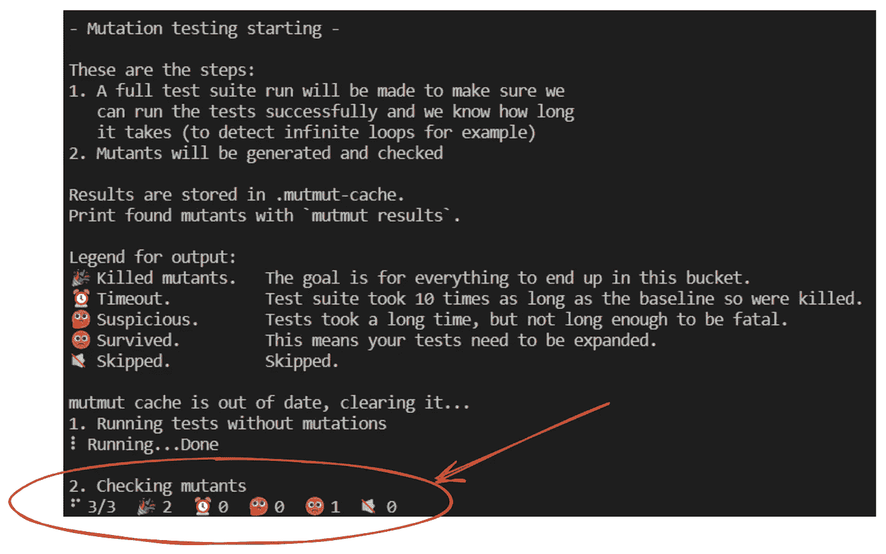
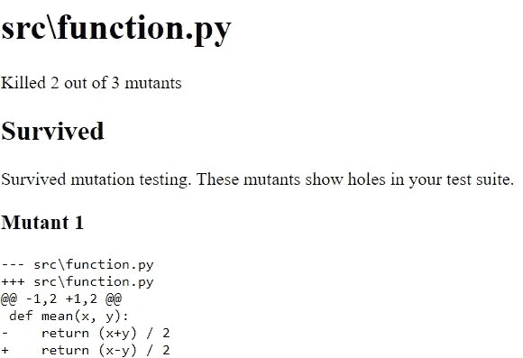

# 如何测试你的单元测试

> 原文：[`towardsdatascience.com/how-to-test-your-unit-tests-afe18d6e19d8`](https://towardsdatascience.com/how-to-test-your-unit-tests-afe18d6e19d8)

## [单元测试](https://medium.com/tag/unit-testing)

## 突变测试简介

[](https://dr-robert-kuebler.medium.com/?source=post_page-----afe18d6e19d8--------------------------------)[](https://towardsdatascience.com/?source=post_page-----afe18d6e19d8--------------------------------) [Dr. Robert Kübler](https://dr-robert-kuebler.medium.com/?source=post_page-----afe18d6e19d8--------------------------------)

·发表于 [Towards Data Science](https://towardsdatascience.com/?source=post_page-----afe18d6e19d8--------------------------------) ·阅读时长 5 分钟·2023 年 1 月 16 日

--


图片由 [Erik Mclean](https://unsplash.com/@introspectivedsgn?utm_source=medium&utm_medium=referral) 提供，来自 [Unsplash](https://unsplash.com/?utm_source=medium&utm_medium=referral)

在我上一篇文章中，我讲述了单元测试如何成为数据科学家工作中的一个重要方面，因为错误的代码会导致分析结果出现问题。提高单元测试的一种方法是将**属性驱动测试**与**示例驱动测试**结合使用，即*常规*的单元测试方式。你可以在这里查看我上一篇文章：

[](/stop-hardcoding-your-unit-tests-e6643dfd254b?source=post_page-----afe18d6e19d8--------------------------------) ## 停止硬编码你的单元测试

### Python 中使用 Hypothesis 进行属性驱动测试的指南

towardsdatascience.com

在发布这篇文章后，我[收到了](https://medium.com/@dotcom.software/mutation-testing-is-also-an-amazing-technique-to-verify-if-weve-missed-any-edge-cases-in-our-unit-e3c63cae1a06)来自**.com 软件**的回应，向我推荐了**突变测试**，我今天想向你解释一下。长话短说：

> 突变测试可以帮助你发现弱测试。

弱测试是那些给你错误安全感的测试，因为它们即使**明知道不该通过**也会通过，其中最典型的就是`assert True`。替换这些测试可以使你的整个测试套件更有意义和可信。

现在，让我们深入了解一下这是什么吧！

# 弱测试

考虑这个非常简单的函数：

```py
def mean(x, y):
    return (x+y) / 2
```

假设你想编写单元测试，尽管这个函数非常简单。一个*test_mean.py* 文件可能如下所示：

```py
def mean(x, y):
    return (x+y) / 2

def test_mean():
    assert mean(4, 0) == 2
```

调用`pytest test_mean.py`当然会导致测试通过。一切都是绿色的，我们甚至达到了 100%的覆盖率！是时候继续下一个功能了，对吧？**不！**

让我们仔细看看测试代码中的断言：函数的第二个参数是零，这意味着函数中的`y`基本上被忽略了。输入具有特殊的形状，使测试比预期更容易通过。例如，如果函数是

```py
def definitely_not_the_mean(x, y): 
    return (x-y) / 2 # test_mean still passes
```

即使在这种简单的**函数变异**——将加号改为减号——`test_mean`仍然通过。

> **这不应该发生**，如果测试足够好，它应该在我们更改函数定义时失败！

像这样的测试就像一个金属探测器，即使面对木材也会发出声音。这就是为什么我们称`test_mean`为**薄弱的测试**。

这个薄弱的测试在这里可能很容易被发现，但如果你写的代码稍微复杂一些，你可能会意外地创建出薄弱的示例却没有注意到，从而给你一种虚假的安全感。

# 变异测试

我们可以使用**变异测试**来发现薄弱的测试。变异测试的理念已经相当古老：它最初由理查德·利普顿在 1971 年作为学生提出。它也非常简单，实际上我在上一章已经简单介绍过了。

> 对你想要测试的函数源代码进行小的修改，并查看测试是否仍然通过。如果它们通过了，那它们就是薄弱的。如果它们失败（并且原函数没有失败），它们幸存下来并可能是强的。

你已经看到了一个变异，即从 + 变为 -。此外，你还可以改变：

+   - 改为 +

+   / 改为 * 或反之亦然，

+   ≥ 改为 > 或者 <，

+   ≤ 改为 < 或者 >

+   = 改为 != 或反之亦然

+   从整数中加减 1

+   向字符串中添加一些随机字符

+   …

你明白了吧。只需简单的调整，**仍然生成有效的源代码**，将你想要测试的原函数变成稍微不同的东西。

当然，你可以手动完成这些操作，几次更改源代码，每次之后都运行一次`pytest`。但因为这没有趣味，[有人创建了一个包来自动完成这项工作](https://github.com/boxed/mutmut)并记录结果。

# Mutmut 方便的变异测试

[Anders Hovmöller aka boxed](https://github.com/boxed)和许多其他贡献者创建了一个名为[mutmut](https://github.com/boxed/mutmut)的包来为你完成这项工作。

首先，通过`pip install mutmut`安装它。然后，你需要将你想要测试的函数提取到一个文件中，我们称之为*function.py*。我们还假设测试在*test_mean.py*中。然后你可以调用

```py
mutmut run --paths-to-mutate function.py
```

它将创建一些包含我们想要测试的*mean*函数的*function.py*的变异。

> *如果你在 mutmut 运行时在一个会不断重新加载文件的编辑器中打开* function.py *，你甚至可以看到文件如何实时变化！但不用担心：mutmut 会在进行修改之前先创建原始文件的副本。*

输出将如下所示：



图片由作者提供。

你可以在这里看到几个方面，尤其是**在底部**：

1.  创建了三个突变体。(*旁注：+变为-，/变为*，在我们的案例中是 2 变为 3*)

1.  这三个突变体中的两个被*杀死*，意味着之前通过的单元测试在文件更改后失败了，这很好 🎉。

1.  一个突变体幸存了，这意味着尽管源代码发生了变化，测试仍然通过。这很糟糕 🙁。我们已经看到过这个幸存者：

```py
def mean(x, y): 
    return (x-y) / 2 # the surviving mutant
```

你还可以通过 `mutmut html` 创建一个 HTML 报告并在浏览器中打开：



图片由作者提供。

设计可以更好，但它包含了关于幸存者的主要信息。

> ***注意：*** *有时两个较弱的单独测试可以形成一个更好的测试套件。例如，如果你添加了断言* `*assert mean(-1, 1) == 0*` *— 另一个较弱的测试，因为突变体* `*return (x+y) * 2*` *将幸存 — 总的来说，没有突变体会幸存于 mutmut 的程序，从而改进测试套件。*

# 结论

在本文中，我们看到通过测试甚至 100%的测试覆盖率可能会令人误解。通过的测试很好，但如果即使在更改被测试函数后仍然通过，这可能是一个红旗，表明测试可能较弱。

突变测试提供了一种结构化的方式来更改（突变）函数。Python 库 mutmut 甚至允许我们自动更改源代码（事先创建了备份），并检查哪些测试在突变后仍然通过（🙁），哪些测试失败（🎉）。

这使你的测试套件更加健壮，从而让你生成正确的代码，这对于无错误分析是必要的。

我希望你今天学到了新的、有趣的、有用的东西。感谢阅读！

**最后一点，如果你**

1.  **想支持我写更多关于机器学习的内容和**

1.  **计划无论如何获得一个 Medium 订阅，**

**为什么不通过** [**这个链接**](https://dr-robert-kuebler.medium.com/membership)**支持我呢**？这对我帮助很大！😊**

*为了透明起见，对你来说价格不会改变，但约一半的订阅费用直接归我。*

**非常感谢，如果你考虑支持我！**

> *如果你有任何问题，请在* [*LinkedIn*](https://www.linkedin.com/in/dr-robert-k%C3%BCbler-983859150/)*上写信给我！*
