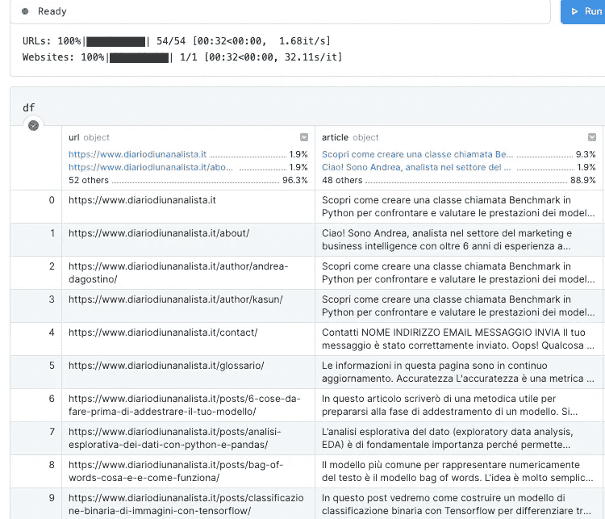
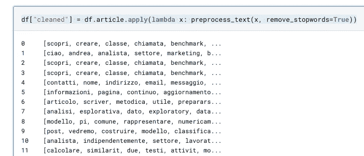
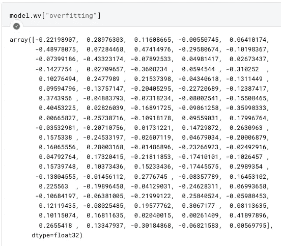
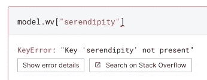
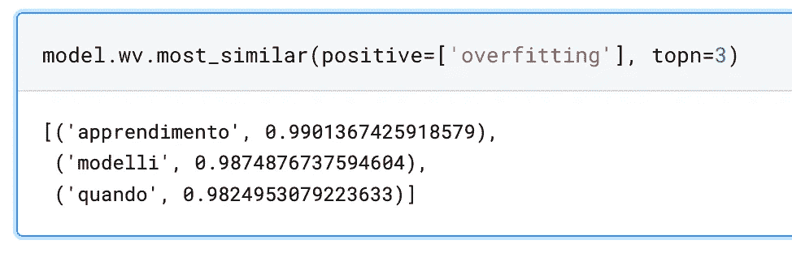
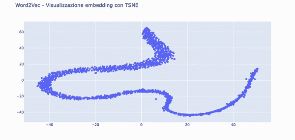
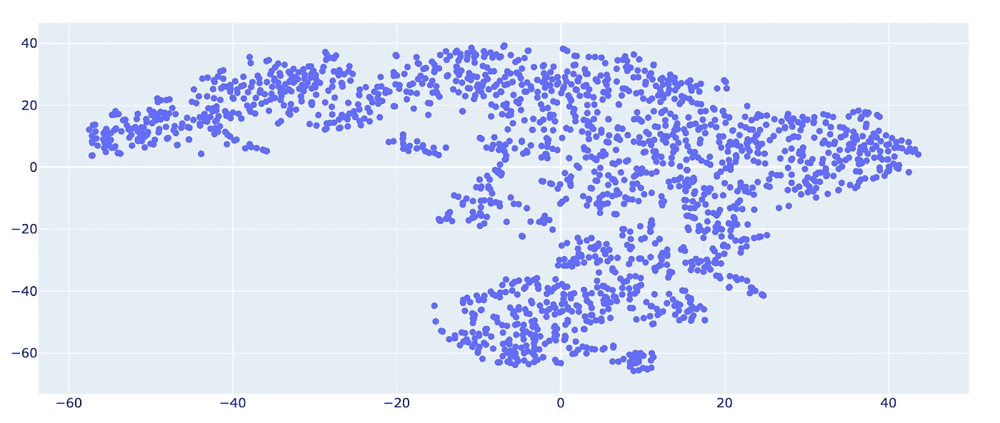
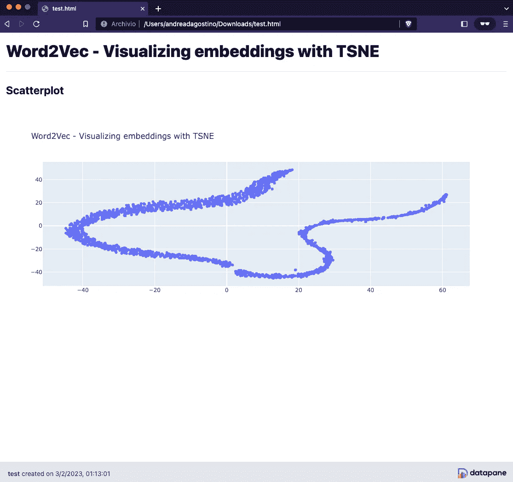

# 如何使用 Gensim 从头开始训练 Word2Vec 模型

> 原文：[`towardsdatascience.com/how-to-train-a-word2vec-model-from-scratch-with-gensim-c457d587e031`](https://towardsdatascience.com/how-to-train-a-word2vec-model-from-scratch-with-gensim-c457d587e031)

## *在本文中，我们将探索 Gensim，这是一种非常流行的 Python 库，用于训练基于文本的机器学习模型，以从头开始训练一个 Word2Vec 模型*

[](https://medium.com/@theDrewDag?source=post_page-----c457d587e031--------------------------------)[](https://towardsdatascience.com/?source=post_page-----c457d587e031--------------------------------) [Andrea D'Agostino](https://medium.com/@theDrewDag?source=post_page-----c457d587e031--------------------------------)

·发表于 [Towards Data Science](https://towardsdatascience.com/?source=post_page-----c457d587e031--------------------------------) ·9 分钟阅读·2023 年 2 月 6 日

--


作者提供的图像。

Word2Vec 是一个机器学习算法，它允许你创建单词的向量表示。

这些表示被称为**嵌入**，在许多自然语言处理任务中使用，如单词聚类、分类和文本生成。

Word2Vec 算法标志着自然语言处理（NLP）世界的一个时代的开始，它在 2013 年由 Google 首次介绍。

它基于通过神经网络训练的非常大的数据语料库创建的单词表示。

**Word2Vec 的输出是向量**，每个向量对应训练词典中的一个单词，**有效地捕捉了单词之间的关系。**

在向量空间中相互接近的向量基于上下文具有相似的含义，而相距较远的向量具有不同的含义。例如，“强大”和“雄伟”这两个词在向量空间中会很接近，而“强大”和“巴黎”这两个词则会相对远离。

这比基于简单计算文本数据语料库中存在的标记的袋装单词模型性能有了显著改进。

在本文中，我们将探索 Gensim，这是一种流行的 Python 库，用于训练基于文本的机器学习模型，**以从头开始训练一个 Word2Vec 模型。**

**我将使用我个人博客中的意大利语文章作为本项目的文本语料库。** 随意使用你希望的任何语料库——这个流程是可扩展的。

这种方法适用于任何文本数据集。你将能够自己创建嵌入向量并进行可视化。

让我们开始吧！

# 项目要求

让我们列出一些行动步骤，这些步骤将作为项目的基础。

1.  我们将创建一个新的虚拟环境。

    （阅读这里以了解如何操作：[如何为机器学习设置开发环境](https://medium.com/towards-data-science/how-to-set-up-a-development-environment-for-machine-learning-b015a91bda8a)）

1.  安装依赖项，其中包括 Gensim

1.  准备我们的语料库以交给 Word2Vec

1.  训练模型并保存它

1.  使用 TSNE 和 Plotly 来可视化嵌入，以便直观理解 Word2Vec 生成的向量空间。

1.  附加：使用 Datapane 库创建一个互动 HTML 报告，与我们想要分享的人共享

到文章结尾时，我们将拥有一个很好的基础，以便开展更复杂的推理，例如嵌入的聚类等。

我假设你已经正确配置了你的环境，所以在这篇文章中我不会解释如何操作。我们直接开始下载博客数据吧。

# 依赖项

在开始之前，我们需要通过在终端中运行`pip install XXXXX`来确保安装以下项目级别的依赖。

+   `trafilatura`

+   `pandas`

+   `gensim`

+   `nltk`

+   `tqdm`

+   `scikit-learn`

+   `plotly`

+   `datapane`

我们还将初始化一个`logger`对象，以便在终端接收 Gensim 消息。

# 获取语料库数据

如前所述，我们将使用我个人博客中的意大利语文章（diariodiunanalista.it）作为我们的语料库数据。

在 Deepnote 中它的样子是这样的。



我们以 pandas 数据框格式收集的数据。图片来源于作者。

我们将要使用的文本数据位于*article*列中。让我们看看随机文本的样子。


无论语言如何，这些数据在交给 Word2Vec 模型之前都应进行处理。我们需要去除意大利语停用词，清理标点符号、数字和其他符号。这将是下一步。

# 数据语料库的准备

首先需要导入一些用于预处理的基本依赖。

```py
# Text manipulation libraries
import re
import string
import nltk
from nltk.corpus import stopwords
# nltk.download('stopwords') <-- we run this command to download the stopwords in the project
# nltk.download('punkt') <-- essential for tokenization

stopwords.words("italian")[:10]
>>> ['ad', 'al', 'allo', 'ai', 'agli', 'all', 'agl', 'alla', 'alle', 'con']
```

现在让我们创建一个`preprocess_text`函数，它接收一些文本作为输入并返回一个干净的版本。

```py
def preprocess_text(text: str, remove_stopwords: bool) -> str:
    """Function that cleans the input text by going to:
    - remove links
    - remove special characters
    - remove numbers
    - remove stopwords
    - convert to lowercase
    - remove excessive white spaces
    Arguments:
        text (str): text to clean
        remove_stopwords (bool): whether to remove stopwords
    Returns:
        str: cleaned text
    """
    # remove links
    text = re.sub(r"http\S+", "", text)
    # remove numbers and special characters
    text = re.sub("[^A-Za-z]+", " ", text)
    # remove stopwords
    if remove_stopwords:
        # 1\. create tokens
        tokens = nltk.word_tokenize(text)
        # 2\. check if it's a stopword
        tokens = [w.lower().strip() for w in tokens if not w.lower() in stopwords.words("italian")]
        # return a list of cleaned tokens
        return tokens
```

让我们通过使用带有`.apply`的 lambda 函数将这个函数应用到 Pandas 数据框中。

```py
df["cleaned"] = df.article.apply(
    lambda x: preprocess_text(x, remove_stopwords=True)
  )
```

我们得到了一个干净的系列。



每篇文章都经过了清理和分词处理。图片来源于作者。

让我们检查一下文本，看看我们预处理的效果。


单个清理后的文本的样子。图片来源于作者。

现在文本看起来已经准备好被 Gensim 处理了。我们继续。

# Word2Vec 训练

首先要做的是创建一个变量`texts`，它将包含我们的文本。

```py
texts = df.cleaned.tolist()
```

现在我们准备好训练模型了。Word2Vec 可以接受许多参数，但现在我们不必担心这些。训练模型非常简单，只需要一行代码。

```py
from gensim.models import Word2Vec

model = Word2Vec(sentences=texts)
```


Word2Vec 训练过程。图片来源于作者。

我们的模型已经准备好，并且嵌入已经创建。为了测试这一点，让我们尝试找出单词*overfitting*的向量。



“overfitting”一词的词嵌入。图像来源：作者。

默认情况下，Word2Vec 创建 100 维的向量。这个参数可以更改，还有许多其他参数，在我们实例化类时进行设置。无论如何，关联的维度越多，**神经网络对单词本身及其与其他单词关系的了解就越多。**

显然，这**具有更高的计算和内存成本**。

请注意：Word2Vec**无法为词汇表中未出现的单词生成向量**（称为 OOV — 词汇外单词）是其最重要的限制之一。



W2V 的一个主要限制是无法为词汇外单词映射嵌入。图像来源：作者。

因此，为了处理新单词，我们必须训练一个新模型或手动添加向量。

# 计算两个单词之间的相似度

使用余弦相似度，我们可以计算向量在空间中的距离。

使用下面的命令，我们指示 Gensim 查找与*overfitting*最相似的前三个单词

`model.wv.most_similar(positive=['overfitting'], topn=3))`



与“*overfitting*”最相似的词。图像来源：作者。

让我们看看单词“when”(*quando* 在意大利语中)在这个结果中是如何呈现的。将类似的副词包含在停用词中以清理结果会比较合适。

要保存模型，只需执行`model.save("./path/to/model")`。

# 使用 TSNE 和 Plotly 可视化嵌入

我们的向量是 100 维的。除非我们做些事情来**减少它们的维度**，否则可视化它们是个问题。

我们将使用 TSNE，这是一种降低向量维度的技术，并创建两个组件，一个用于 X 轴，另一个用于 Y 轴上的散点图。

在下面的.gif 中，你可以看到感谢 Plotly 功能嵌入在空间中的单词。



我的意大利博客的嵌入在 TSNE 投影中呈现的效果。图像来源：作者。

这是生成此图像的代码。

```py
def reduce_dimensions(model):
    num_components = 2  # number of dimensions to keep after compression

    # extract vocabulary from model and vectors in order to associate them in the graph
    vectors = np.asarray(model.wv.vectors)
    labels = np.asarray(model.wv.index_to_key)  

    # apply TSNE 
    tsne = TSNE(n_components=num_components, random_state=0)
    vectors = tsne.fit_transform(vectors)

    x_vals = [v[0] for v in vectors]
    y_vals = [v[1] for v in vectors]
    return x_vals, y_vals, labels

def plot_embeddings(x_vals, y_vals, labels):
    import plotly.graph_objs as go
    fig = go.Figure()
    trace = go.Scatter(x=x_vals, y=y_vals, mode='markers', text=labels)
    fig.add_trace(trace)
    fig.update_layout(title="Word2Vec - Visualizzazione embedding con TSNE")
    fig.show()
    return fig

x_vals, y_vals, labels = reduce_dimensions(model)

plot = plot_embeddings(x_vals, y_vals, labels)
```

这种可视化有助于识别数据中的语义和句法倾向。

**例如，这非常有助于指出异常**，如因某种原因倾向于聚集在一起的单词组。

# Word2Vec 的参数

通过检查 Gensim 网站，我们可以看到 Word2Vec 接受许多参数。最重要的参数包括`vectors_size`、`min_count`、`window`和`sg`。

+   **vectors_size** : 定义了我们向量空间的维度。

+   **min_count**: 训练前，会将频率低于 min_count 的单词从词汇表中移除。

+   **window**: 句子中当前词与期望词之间的最大距离。

+   **sg**：定义训练算法。0 = CBOW（连续词袋），1 = Skip-Gram。

我们不会详细讨论每一个。我建议感兴趣的读者查看[Gensim 文档](https://radimrehurek.com/gensim/models/word2vec.html)。

我们尝试使用以下参数重新训练我们的模型。

```py
VECTOR_SIZE = 100
MIN_COUNT = 5
WINDOW = 3
SG = 1

new_model = Word2Vec(
    sentences=texts, 
    vector_size=VECTOR_SIZE, 
    min_count=MIN_COUNT, 
    sg=SG
)

x_vals, y_vals, labels = reduce_dimensions(new_model)

plot = plot_embeddings(x_vals, y_vals, labels)
```



基于 Word2Vec 新参数的新投影。图片由作者提供。

表示发生了很大变化。向量的数量与之前相同（Word2Vec 的默认值为 100），而`min_count`、`window`和`sg`已从默认值进行了更改。

我建议读者更改这些参数，以了解哪种表示更适合自己的情况。

# 奖金：使用 Datapane 创建一个互动报告

我们已经到了文章的结尾。我们通过创建**一个 HTML 格式的互动报告，利用 Datapane 使用户能够在浏览器中直接查看之前用 Plotly 创建的图表**来结束这个项目。



使用 Datapane 创建的互动报告。图片由作者提供。

这是 Python 代码

```py
import datapane as dp

app = dp.App(
    dp.Text(text='# Visualizzazione degli embedding creati con Word2Vec'),
    dp.Divider(),
    dp.Text(text='## Grafico a dispersione'),
    dp.Group(
        dp.Plot(plot),
        columns=1,
    ),
)
app.save(path="test.html")
```

Datapane 高度可定制。我建议读者查阅文档，以便整合美学和其他功能。

# 结论

我们已经看到如何使用 Gensim 和 Word2Vec 从头构建嵌入。如果你有结构化的数据集，并且知道 Gensim 的 API，这个过程非常简单。

使用嵌入我们可以做很多事情，例如

+   做**文档聚类**，在向量空间中展示这些聚类

+   **研究单词之间的相似性**

+   将嵌入**作为机器学习模型中的特征**

+   为**机器翻译**奠定基础

等等。如果你对延伸至这里讨论主题的内容感兴趣，请留言告诉我 👍

通过这个项目，你可以丰富你的 NLP 模板组合，并向利益相关者展示你在机器学习背景下处理文本文件的专业知识。

下一篇文章 👋

**如果你想支持我的内容创作活动，请随时通过下面的推荐链接关注我并加入 Medium 会员计划**。我将获得你投资的一部分，同时你也能无缝访问 Medium 上大量的数据科学等相关文章。

[](https://medium.com/@theDrewDag/membership?source=post_page-----c457d587e031--------------------------------) [## 使用我的推荐链接加入 Medium - Andrea D'Agostino

### 阅读 Andrea D'Agostino（以及 Medium 上其他数千名作家的）每个故事。你的会员费用直接…

medium.com](https://medium.com/@theDrewDag/membership?source=post_page-----c457d587e031--------------------------------)
