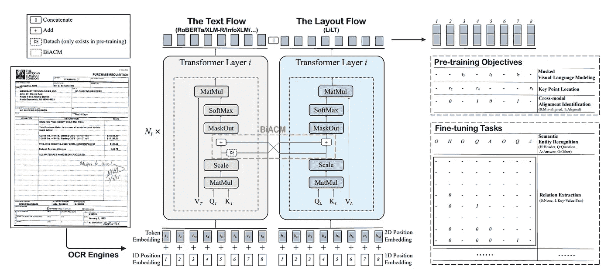
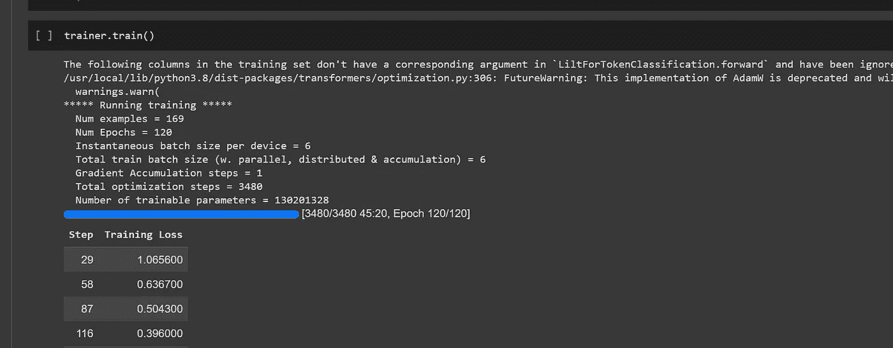
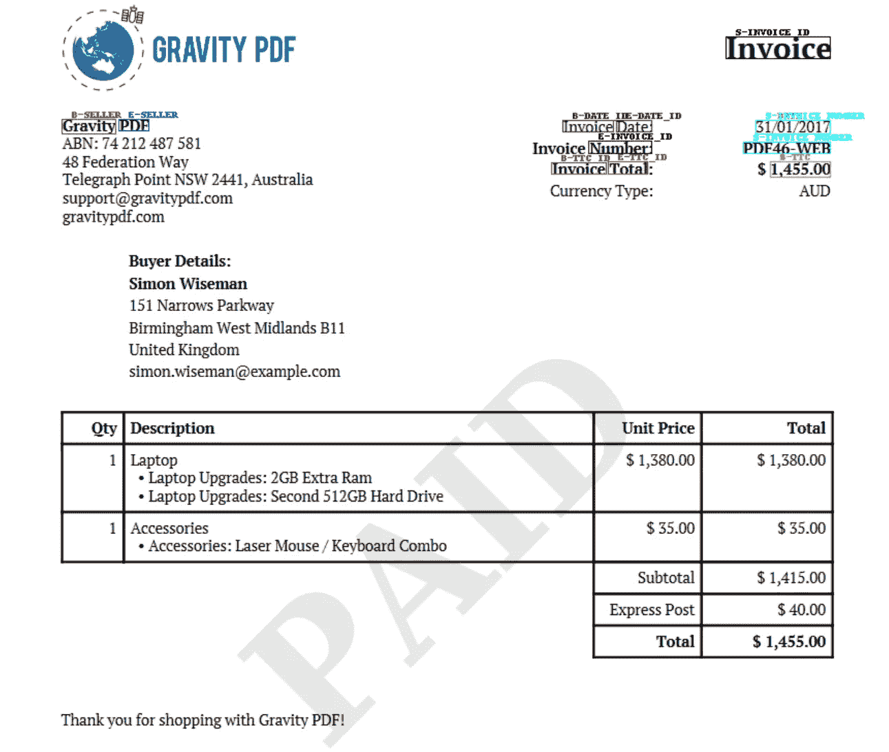
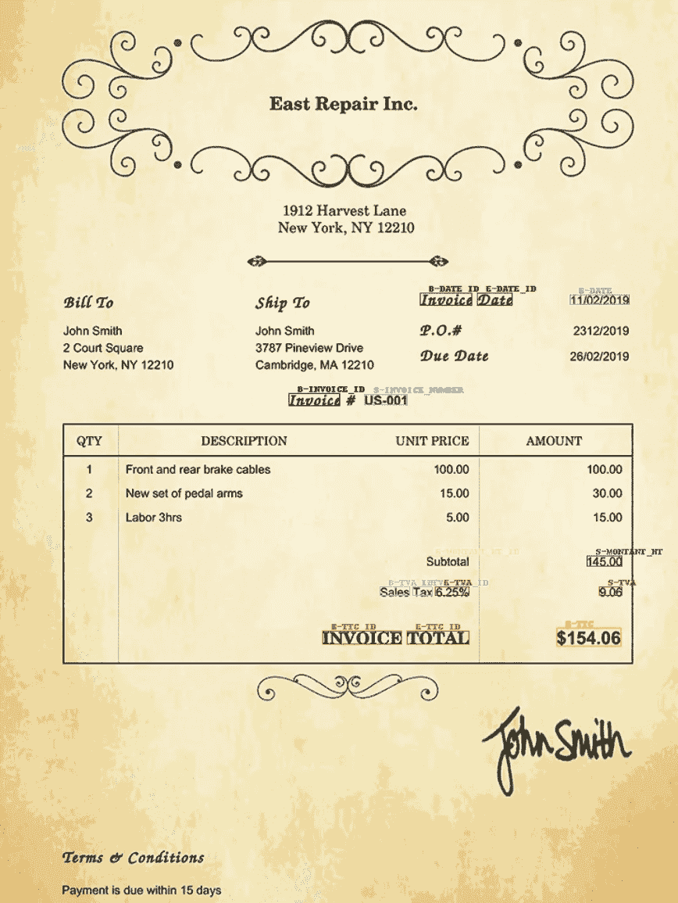
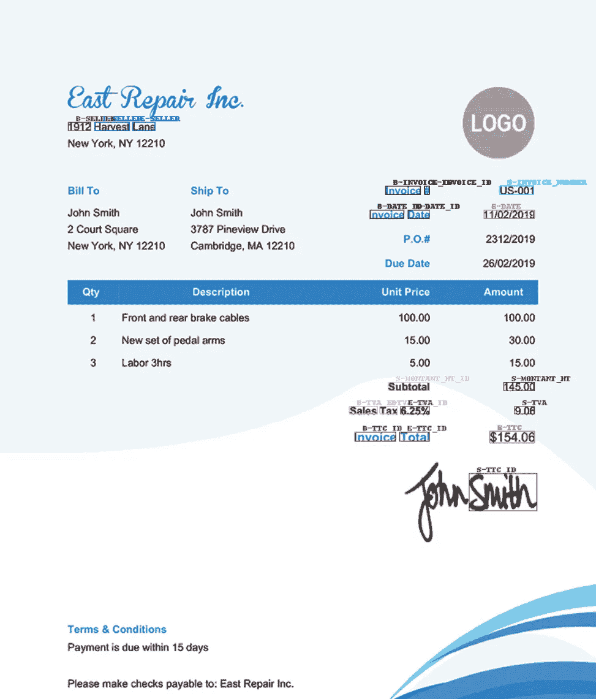

# 如何训练 LILT 模型并在发票上进行推断

> 原文：[`towardsdatascience.com/how-to-train-the-lilt-model-on-invoices-and-run-inference-8fd6b3cfae1b`](https://towardsdatascience.com/how-to-train-the-lilt-model-on-invoices-and-run-inference-8fd6b3cfae1b)

## 分步教程

[](https://walidamamou.medium.com/?source=post_page-----8fd6b3cfae1b--------------------------------)[](https://towardsdatascience.com/?source=post_page-----8fd6b3cfae1b--------------------------------) [Walid Amamou](https://walidamamou.medium.com/?source=post_page-----8fd6b3cfae1b--------------------------------)

·发布于[Towards Data Science](https://towardsdatascience.com/?source=post_page-----8fd6b3cfae1b--------------------------------) ·5 分钟阅读·2023 年 1 月 3 日

--


图片来源：[**Zinkevych_D**](https://elements.envato.com/user/Zinkevych_D)来自[Envato](https://elements.envato.com/close-up-of-an-invoice-being-signed-HL7W2QD)

在文档理解领域，深度学习模型发挥了重要作用。这些模型能够准确地解读文档的内容和结构，使其成为处理发票、简历解析和合同分析等任务的宝贵工具。深度学习模型在文档理解中的另一个重要好处是它们能够随着时间的推移不断学习和适应。随着新类型文档的出现，这些模型可以继续学习并提升性能，使其在文档分类和信息提取等任务中具有高度的可扩展性和效率。

其中一个模型是 LILT 模型（Language-Independent Layout Transformer），这是一个为文档布局分析任务开发的深度学习模型。与其前身 LayoutLM 不同，LILT 最初设计为语言无关，这意味着它可以分析任何语言的文档，同时在许多下游任务应用中相较于其他现有模型表现优越。此外，该模型拥有 MIT 许可证，这意味着它可以用于商业用途，与最新的 LayoutLM v3 和 LayoutXLM 不同。因此，创建一个关于如何微调该模型的教程是值得的，因为它有潜力被广泛用于各种文档理解任务。

在本教程中，我们将讨论这一新型模型架构，并展示如何在发票提取上进行微调。然后，我们将使用该模型对一组新的发票进行推断。

# LILT 模型架构：

使用 LILT 模型的一个关键优势是其处理多语言文档理解的能力，表现出色。作者通过将文本和布局嵌入分离到各自的变压器架构中，并使用双向注意力补充机制（BiACM）实现两种数据类型之间的跨模态交互，从而达到了这一点。编码后的文本和布局特征被连接在一起，并添加了额外的头部，允许模型用于自监督预训练或下游微调。这种方法不同于 layoutXLM 模型，该模型涉及收集和预处理大量多语言文档数据集。



LILT 模型架构。 [来源](https://arxiv.org/pdf/2202.13669.pdf)

该模型的关键创新在于使用 BiACM 来捕捉文本和布局特征在编码过程中的交互。仅仅连接文本和布局模型输出会导致性能下降，这表明编码流程中的交互对于模型的成功至关重要。有关更深入的细节，请阅读 [原始文章](https://arxiv.org/pdf/2202.13669.pdf)。

# 模型微调：

类似于我之前关于如何 [微调 layoutLM 模型](https://medium.com/towards-data-science/fine-tuning-layoutlm-v3-for-invoice-processing-e64f8d2c87cf) 的文章，我们将使用相同的数据集来微调 LILT 模型。数据通过使用 [UBIAI](https://ubiai.tools) 文本注释工具手动标记 220 张发票获得。关于标记过程的更多细节可以在这个 [链接](https://medium.com/towards-data-science/how-to-annotate-pdfs-and-scanned-images-for-nlp-applications-f7b7b1db5c4a) 中找到。有关深入的视频教程，请查看以下链接：

LILT 教程

要训练模型，我们首先预处理来自 UBIAI 的数据输出，以准备模型训练。这些步骤与之前训练 layoutLM 模型的笔记本中的步骤相同，这里是笔记本：

[Google Colaboratory](https://colab.research.google.com/drive/1RQwdD86PUfrsL2GAJkl2o-zAb0CjT1N1?usp=sharing&authuser=2&source=post_page-----8fd6b3cfae1b--------------------------------#scrollTo=iInYrU6DpD5p)

### 编辑描述

[colab.research.google.com](https://colab.research.google.com/drive/1RQwdD86PUfrsL2GAJkl2o-zAb0CjT1N1?usp=sharing&authuser=2&source=post_page-----8fd6b3cfae1b--------------------------------#scrollTo=iInYrU6DpD5p)

我们从 Huggingface 下载 LILT 模型：

```py
from transformers import LiltForTokenClassification
# huggingface hub model id
model_id = "SCUT-DLVCLab/lilt-roberta-en-base"

# load model with correct number of labels and mapping
model = LiltForTokenClassification.from_pretrained(
    model_id, num_labels=len(label_list), label2id=label2id, id2label=id2label
)
```

对于此模型训练，我们使用以下超参数：

```py
NUM_TRAIN_EPOCHS = 120
PER_DEVICE_TRAIN_BATCH_SIZE = 6
PER_DEVICE_EVAL_BATCH_SIZE = 6
LEARNING_RATE = 4e-5
```

要训练模型，只需运行 trainer.train() 命令：



作者提供的图片：模型训练进行中。

在 GPU 上，训练大约需要 1 小时。训练完成后，我们通过运行 trainer.evaluate() 来评估模型：

```py
{
 'eval_precision': 0.6335952848722987,
 'eval_recall': 0.7413793103448276,
 'eval_f1': 0.6832627118644069,
 }
```

我们的精度、召回率和 F-1 分数分别为 0.63、0.74 和 0.68。LILT 模型的 F-1 分数为 0.68，表明模型在准确分类和预测结果方面表现良好，准确率中等到良好。然而，值得注意的是，仍有改进的空间，继续标注更多数据将有助于进一步提高模型性能。总体来看，LILT 模型的 F-1 分数为 0.68 是一个积极的结果，表明模型在其预期任务中表现良好。

为了评估模型在未见数据上的表现，我们在新发票上运行了推理。

我们确保保存模型，以便稍后使用以下命令进行推理：

```py
 torch.save(model,'/content/drive/MyDrive/LILT_Model/lilt.pth')
```

# 模型推理：

要在新的发票上测试模型，我们运行下面的推理脚本：

[](https://colab.research.google.com/drive/1om_xsTuuwOXzrldhkQj76HXSQkLYftRz?usp=sharing&source=post_page-----8fd6b3cfae1b--------------------------------) [## Google Colaboratory

### 编辑描述

colab.research.google.com](https://colab.research.google.com/drive/1om_xsTuuwOXzrldhkQj76HXSQkLYftRz?usp=sharing&source=post_page-----8fd6b3cfae1b--------------------------------)

以下是结果：



作者提供的图片：LILT 在发票 1 上的输出

LILT 模型正确识别了广泛的实体，包括卖方名称、发票号码和总金额。让我们再尝试几张发票：



作者提供的图片：LILT 在发票 2 上的输出



作者提供的图片：LILT 在发票 3 上的输出

如我们所见，LILT 模型能够处理各种不同格式和不同上下文的内容，尽管有一些错误，但准确性相对较好。总体而言，LILT 模型表现良好，其预测结果与 layoutLM v3 产生的结果相似，突显了其在文档理解任务中的有效性。

# 结论

总结来说，LILT 模型已经证明在文档理解任务中是有效的。与 layoutLM v3 模型不同，LILT 模型采用 MIT 许可证，这允许研究人员和开发者广泛商业使用，使其成为许多项目的理想选择。下一步，我们可以通过标注和改进训练数据集来提升模型性能。

如果你想高效便捷地创建自己的训练数据集，可以免费体验[UBIAI 的 OCR 标注功能](https://ubiai.tools/Signup)。

在 Twitter 上关注我们[@UBIAI5](https://twitter.com/UBIAI5)或[订阅这里](https://walidamamou.medium.com/subscribe)!
