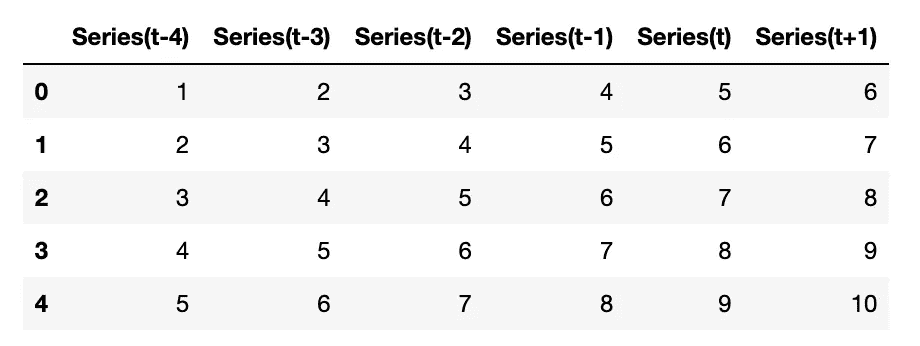

# 如何将时间序列转换为深度学习格式

> 原文：[`towardsdatascience.com/how-to-transform-time-series-for-deep-learning-3b6abbbb3726?source=collection_archive---------2-----------------------#2023-02-14`](https://towardsdatascience.com/how-to-transform-time-series-for-deep-learning-3b6abbbb3726?source=collection_archive---------2-----------------------#2023-02-14)

## 使用深度神经网络进行预测

 [Vitor Cerqueira](https://vcerq.medium.com/?source=post_page-----3b6abbbb3726--------------------------------)

·

[关注](https://medium.com/m/signin?actionUrl=https%3A%2F%2Fmedium.com%2F_%2Fsubscribe%2Fuser%2Fefb5f27c836d&operation=register&redirect=https%3A%2F%2Ftowardsdatascience.com%2Fhow-to-transform-time-series-for-deep-learning-3b6abbbb3726&user=Vitor+Cerqueira&userId=efb5f27c836d&source=post_page-efb5f27c836d----3b6abbbb3726---------------------post_header-----------) 发布在 [Towards Data Science](https://towardsdatascience.com/?source=post_page-----3b6abbbb3726--------------------------------) ·6 min read·2023 年 2 月 14 日

--

图片由 [Claudio Testa](https://unsplash.com/@claudiotesta?utm_source=medium&utm_medium=referral) 提供，来源于 [Unsplash](https://unsplash.com/?utm_source=medium&utm_medium=referral)

# 带时间序列的监督学习

监督学习涉及使用输入数据集来训练机器学习模型。这个数据集通常是一个矩阵：一个由行（样本）和列（特征）组成的二维数据结构。

时间序列是一个按时间顺序排列的值序列。因此，它需要被转换以用于监督学习。

在[上一篇文章](https://medium.com/towards-data-science/machine-learning-for-forecasting-transformations-and-feature-extraction-bbbea9de0ac2)中，我们学习了如何将单变量时间序列从序列转换为矩阵。这是通过滑动窗口实现的。序列的每个观测值都是基于过去最近的值，也称为滞后值来建模的。

下面是使用 1 到 10 的序列进行这种转换的示例：

将序列转换为带有滑动窗口的矩阵。图像由作者提供。

这种转换实现了一种叫做自回归（auto-regression）的建模方法。在自回归中，模型是基于时间序列的过去最近值（滞后值）作为解释变量来构建的。这些值用于预测未来的观测值（目标变量）。自回归这个名字的直觉是时间序列被回归到...
