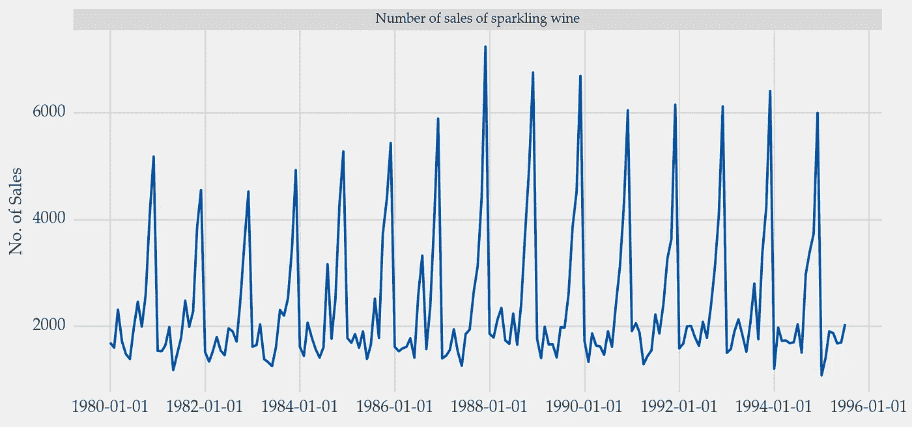
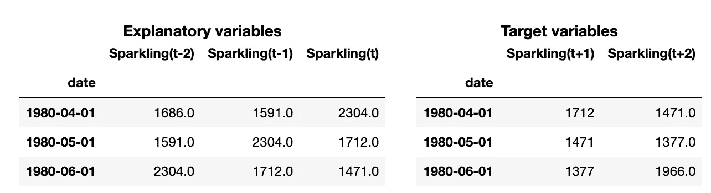
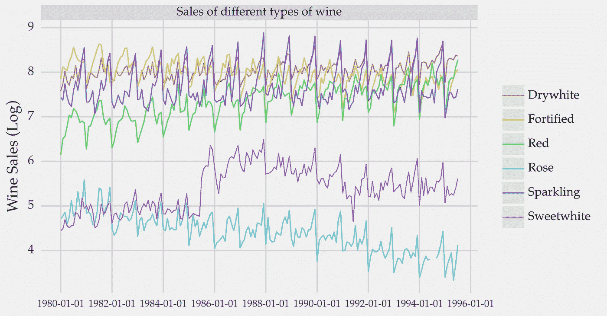
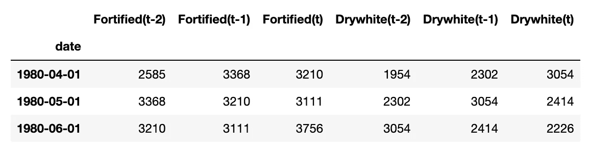
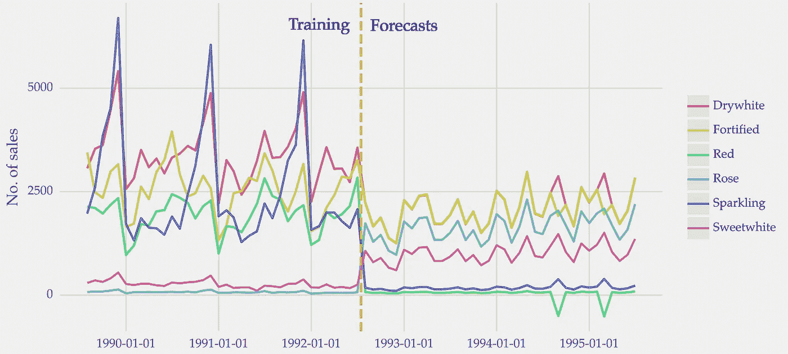

# 如何将时间序列转换为深度学习格式

> 原文：[`towardsdatascience.com/how-to-transform-time-series-for-deep-learning-3b6abbbb3726`](https://towardsdatascience.com/how-to-transform-time-series-for-deep-learning-3b6abbbb3726)

## 使用深度神经网络进行预测

[](https://vcerq.medium.com/?source=post_page-----3b6abbbb3726--------------------------------)[](https://towardsdatascience.com/?source=post_page-----3b6abbbb3726--------------------------------) [Vitor Cerqueira](https://vcerq.medium.com/?source=post_page-----3b6abbbb3726--------------------------------)

·发布于 [Towards Data Science](https://towardsdatascience.com/?source=post_page-----3b6abbbb3726--------------------------------) ·6 分钟阅读·2023 年 2 月 14 日

--


图片由 [Claudio Testa](https://unsplash.com/@claudiotesta?utm_source=medium&utm_medium=referral) 提供，来源于 [Unsplash](https://unsplash.com/?utm_source=medium&utm_medium=referral)

# 使用时间序列的监督学习

监督学习涉及使用输入数据集来训练机器学习模型。这个数据集通常是一个矩阵：一个由行（样本）和列（特征）组成的二维数据结构。

时间序列是按时间排序的值的序列。因此，它需要转换以进行监督学习。

在 [上一篇文章](https://medium.com/towards-data-science/machine-learning-for-forecasting-transformations-and-feature-extraction-bbbea9de0ac2)中，我们学习了如何将单变量时间序列从序列转换为矩阵。这是通过滑动窗口完成的。每个观察值基于过去的最近值进行建模，这些值也称为滞后。

以下是使用 1 到 10 序列的转换示例：


将序列转换为带滑动窗口的矩阵。图片由作者提供。

这种转换实现了一种称为自回归（auto-regression）的建模类型。在自回归中，使用时间序列的过去最近值（滞后）作为解释变量来建立模型。这些值用于预测未来的观察值（目标变量）。自回归的命名直观上是因为时间序列与自身回归。

在上述示例中，滞后是前 5 列。目标变量是最后一列（下一个时间步的系列值）。

# 深度学习中的自回归

虽然大多数方法适用于矩阵，但深度神经网络需要不同的结构。

深度神经网络如 LSTM 或 CNN 的输入是一个三维数组。实际数据与放入矩阵中的数据相同，但结构不同。

除了行（样本）和列（滞后），额外的维度指的是序列中的变量数量。在矩阵中，你会将所有属性连接在一起，而不考虑它们的来源。神经网络则更整洁。输入是通过第三维度按序列中的每个变量组织的。

让我们做一个实际示例来澄清这个概念。

# 实践操作


图片由[Quino Al](https://unsplash.com/@quinoal?utm_source=medium&utm_medium=referral)提供，来源于[Unsplash](https://unsplash.com/?utm_source=medium&utm_medium=referral)

在本教程中，你将学习如何使用 LSTM（长短期记忆网络）转换时间序列以进行监督学习。LSTM 是一种特别适合建模时间序列的神经网络类型。

我们将时间序列转换过程分为两个步骤：

1.  从值序列到矩阵；

1.  从矩阵到深度学习的 3 维数组。

首先，我们将进行一个单变量时间序列的示例。多变量时间序列将在后面介绍。

## 单变量时间序列

首先，我们来读取数据。我们将使用与不同类型葡萄酒销售相关的时间序列。你可以在参考文献[1]中查看源数据。

```py
import pandas as pd

# https://github.com/vcerqueira/blog/tree/main/data
data = pd.read_csv('data/wine_sales.csv', parse_dates=['date'])
data.set_index('date', inplace=True)

series = data['Sparkling']
```

我们以香槟酒的销售数据为例进行单变量情况的示范。这个时间序列如下所示：



## 从值序列到矩阵

我们应用滑动窗口将此序列转换为监督学习所需的格式。你可以在[之前的文章](https://medium.com/towards-data-science/machine-learning-for-forecasting-transformations-and-feature-extraction-bbbea9de0ac2)中了解更多关于此过程的信息。

```py
# src module here: https://github.com/vcerqueira/blog/tree/main/src
from src.tde import time_delay_embedding

# using 3 lags as explanatory variables
N_LAGS = 3
# forecasting the next 2 values
HORIZON = 2

# using a sliding window method called time delay embedding
X, Y = time_delay_embedding(series, n_lags=N_LAGS, horizon=HORIZON, return_Xy=True)
```

这里是解释变量（X）和相应目标变量（Y）的示例：



转换时间序列为 2 维矩阵结构后的解释变量（左）和目标变量（右）的样本。图片由作者提供。

这个数据集是训练传统机器学习方法的基础。例如，线性回归或 xgboost。

```py
from sklearn.linear_model import RidgeCV

# training a ridge regression model
model = RidgeCV()
model.fit(X, Y)
```

## 从矩阵到深度学习的 3 维结构

你需要重塑这个数据集来训练像 LSTM 这样的神经网络。以下函数可用于完成此操作：

```py
import re
import pandas as pd
import numpy as np

def from_matrix_to_3d(df: pd.DataFrame) -> np.ndarray:
    """
    Transforming a time series from matrix into 3-d structure for deep learning

    :param df: (pd.DataFrame) Time series in the matrix format after embedding

    :return: Reshaped time series into 3-d structure 
    """    

    cols = df.columns

    # getting unique variables in the time series
    # this list has a single element for univariate time series
    var_names = np.unique([re.sub(r'\([^)]*\)', '', c) for c in cols]).tolist()

    # getting observation for each variable
    arr_by_var = [df.loc[:, cols.str.contains(v)].values for v in var_names]
    # reshaping the data of each variable into a 3-d format
    arr_by_var = [x.reshape(x.shape[0], x.shape[1], 1) for x in arr_by_var]

    # concatenating the arrays of each variable into a single array
    ts_arr = np.concatenate(arr_by_var, axis=2)

    return ts_arr

# transforming the matrices
X_3d = from_matrix_to_3d(X)
Y_3d = from_matrix_to_3d(Y)
```

最终，你可以使用得到的数据集训练一个 LSTM：

```py
from sklearn.model_selection import train_test_split

from keras.models import Sequential
from keras.layers import (Dense,
                          LSTM,
                          TimeDistributed,
                          RepeatVector)

# number of variables in the time series
# 1 because the series is univariate
N_FEATURES = 1

# creating a simple stacked LSTM
model = Sequential()
model.add(LSTM(8, activation='relu', input_shape=(N_LAGS, N_FEATURES)))
model.add(RepeatVector(HORIZON))
model.add(LSTM(4, activation='relu', return_sequences=True))
model.add(TimeDistributed(Dense(N_FEATURES)))

model.compile(optimizer='adam', loss='mse')

# compiling the model
model.compile(optimizer='adam', loss='mse')

# basic train/validation split 
X_train, X_valid, Y_train, Y_valid = train_test_split(X_3d, Y_3d, test_size=.2, shuffle=False)

# training the model
model.fit(X_train, Y_train, epochs=100, validation_data=(X_valid, Y_valid))

# making predictions
preds = model.predict_on_batch(X_valid)
```

## 多变量时间序列

现在，我们来看一个多变量时间序列的示例。在这种情况下，目标是预测多个变量的未来值，而不仅仅是一个。因此，你需要一个用于多变量和多步预测的模型。



关于不同类型葡萄酒销售的多变量时间序列。图片由作者提供。

转换过程与之前类似。

要将多变量时间序列转换为矩阵格式，可以对每个变量应用滑动窗口方法。然后，将所有结果矩阵合并为一个。

这是一个示例：

```py
# transforming each variable into a matrix format
mat_by_variable = []
for col in data:
    col_df = time_delay_embedding(data[col], n_lags=N_LAGS, horizon=HORIZON)
    mat_by_variable.append(col_df)

# concatenating all variables
mat_df = pd.concat(mat_by_variable, axis=1).dropna()

# defining target (Y) and explanatory variables (X)
predictor_variables = mat_df.columns.str.contains('\(t\-|\(t\)')
target_variables = mat_df.columns.str.contains('\(t\+')
X = mat_df.iloc[:, predictor_variables]
Y = mat_df.iloc[:, target_variables]
```

解释变量对于两个变量如下（其他变量为了简洁省略）：



你可以使用相同的函数将数据转换为三维：

```py
X_3d = from_matrix_to_3d(X)
Y_3d = from_matrix_to_3d(Y)
```

训练部分与之前相似。序列中变量数量的信息在 *N_FEATURES* 常量中提供。顾名思义，这个常量表示时间序列中的变量数量。

```py
model = Sequential()
model.add(LSTM(8, activation='relu', input_shape=(N_LAGS, N_FEATURES)))
model.add(Dropout(.2))
model.add(RepeatVector(HORIZON))
model.add(LSTM(4, activation='relu', return_sequences=True))
model.add(Dropout(.2))
model.add(TimeDistributed(Dense(N_FEATURES)))

model.compile(optimizer='adam', loss='mse')

X_train, X_valid, Y_train, Y_valid = train_test_split(X_3d, Y_3d, test_size=.2, shuffle=False)

model.fit(X_train, Y_train, epochs=500, validation_data=(X_valid, Y_valid))

preds = model.predict_on_batch(X_valid)
```

以下图表展示了一个步进预测样本。



LSTM 的一步预测。图像作者提供。

预测效果不是很好。时间序列较小，我们也没有对模型进行优化。深度学习方法以数据为食。如果你选择这种方法，请确保你有足够的数据。

# 关键要点

深度学习在时间序列应用中越来越相关。

在本文中，我们探讨了如何为深度学习转换时间序列。

传统机器学习算法的输入是一个矩阵。但是，像 LSTM 这样的神经网络使用三维数据集。因此，时间序列需要从序列转换为这种格式。

这种转换基于滑动窗口，该窗口应用于序列中的每个变量。

感谢阅读，下次故事见！

## 相关文章

+   预测的机器学习：转换和特征提取

+   预测的机器学习：使用多变量时间序列的监督学习

## 参考文献

[1] [Rob Hyndman 和 Yangzhuoran Yang (2018). tsdl: 时间序列数据库. v0.1.0.](https://pkg.yangzhuoranyang.com/tsdl/) (GPL-3 许可证)
