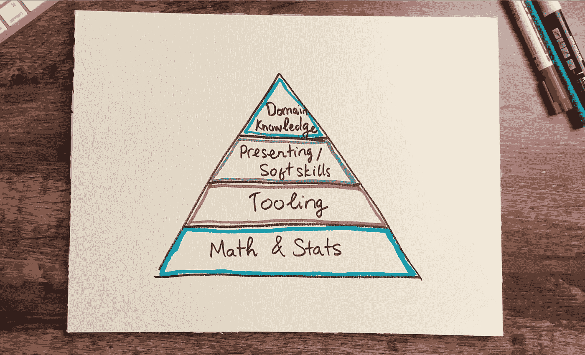
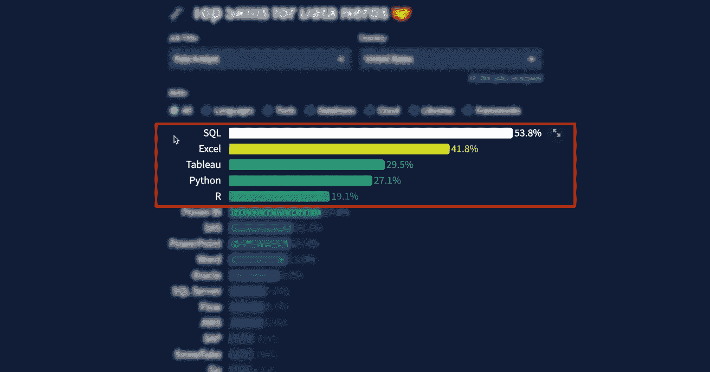
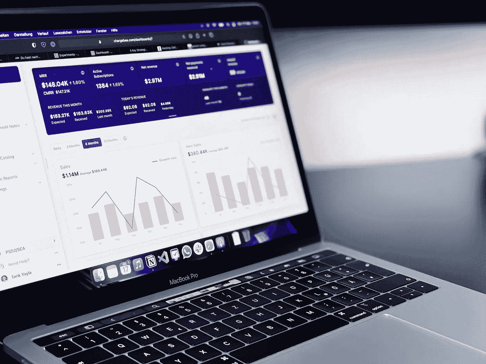

# 转行到数据分析的路线图

> 原文：[`towardsdatascience.com/how-to-transition-to-data-analytics-128a3dca54d5`](https://towardsdatascience.com/how-to-transition-to-data-analytics-128a3dca54d5)

 [Thu Vu](https://medium.com/@vuthihienthu.ueb?source=post_page-----128a3dca54d5--------------------------------)

·发表于 [Towards Data Science](https://towardsdatascience.com/?source=post_page-----128a3dca54d5--------------------------------) ·11 分钟阅读·2023 年 11 月 6 日

--

> 如果你在其他领域工作，如何转行到数据分析？

你可能拥有一个与数据分析无关的大学学位，或者在一个完全不同的领域工作过。你可能一直对转行数据分析角色感兴趣，但不知道从哪里开始。如果这听起来像你，继续阅读吧！😉

图片来源：[Myriam Jessier](https://unsplash.com/@mjessier?utm_source=medium&utm_medium=referral) 在 [Unsplash](https://unsplash.com/?utm_source=medium&utm_medium=referral)

# 进入数据分析的两种方式

本质上，有 2 种进入数据分析的方式：

+   (1) 完全自学：然后巧妙地将分析技能与当前领域知识（无论是来自早期的学习还是工作）结合，以获得竞争优势；

+   (2) 选择数据分析学位或训练营。

在这篇博客文章中，我们将主要关注**自学**的**途径**，目标是成为数据分析师，这也是许多其他数据科学角色的良好起点。这也是我 6 年前开始的方式，当时我对医疗分析非常感兴趣，所以我从这一领域起步。

在这篇文章中，我们将讨论你应该学习和准备的内容：

+   所需技能

+   作品集项目

+   如何接触招聘人员

事情变化迅速，许多人担心人工智能可能取代工作，这可能会影响你在追求数据分析工作时的情况。我将在本文最后分享一些关于这一点的见解。

***你还可以观看下面的博客文章视频版本 👇***

[`www.youtube.com/@Thuvu5/videos`](https://www.youtube.com/@Thuvu5/videos)

# 那么数据分析师实际上做什么？

实际上，有很多不同的职位涉及到处理数据并将其转化为见解。很久以前，从事这类工作的人员在保险行业工作时会被称为统计学家或精算师。

如今，我们有时对职位头衔过于执着，这很快就会变得令人困惑。如果我们查看招聘信息，就会看到业务分析师、研究分析师、分析顾问、初级数据科学家等等。更不用说***数据分析 + X*** 这类职位，这些职位特定于某个领域，比如 HR 数据分析师、销售分析师、市场分析师等。

我发现了解工作的本质和你实际使用的技能更为有用。因此，在本文中，我将所有这些头衔简化为***数据分析师***。

> 数据分析师是一个分析数据的职位。
> 
> 数据分析是一个检查、清理、转换和建模数据的过程，目的是发现有用的信息、得出结论并支持决策。

因此，数据分析师通常会做大量的数据科学工作，除了预测分析、机器学习和软件工程，这些通常是数据科学家更关注的领域。因此，作为数据分析师可以为你进入数据科学家、数据工程师和其他数据科学职位打下坚实的基础。

## 职业前景

在美国，数据分析师的中位薪资为 95,000 美元。对既具备领域知识又能分析数据的人才需求不断上升。

作为数据分析师，你将有机会在医疗保健、金融、银行、物流、人力资源等多个领域工作。你可以为初创公司、代理机构、企业或像我这样的咨询公司工作。你可以全职或自由职业，甚至远程工作。所以你在职业生涯中有很大的灵活性！

# 所需技能

说到数据分析师最重要的技能，让我展示这个技能模型来帮助你可视化它。

图片来源：作者。

***(1) 基础数学和统计：***

在最基本的层面上，你需要一些基础数学和统计学。仅仅是基础的高中或本科数学和统计学就足够了，除非你希望在工作中进行更高级的分析或机器学习。大多数时候，作为数据分析师，你会对数据进行一些描述性统计，比如计算平均值、最小值、最大值、中位数、标准差等。根据项目的不同，你可能还会进行离群值检测、假设检验、线性回归、聚类甚至机器学习。这取决于你的工作及其技术复杂性。我强烈推荐你阅读达雷尔·哈夫的经典书籍*《如何用统计数据撒谎》*。这本书读起来非常有趣，指出了我们在从数据中得出结论时最常犯的错误。我认为每个从事数据工作的人都应该读一读。

***(2) 技术技能：***

其次，数据分析师需要工具，即特定的技术或软件。作为数据分析师，你几乎每天需要完成 3 件事：

+   提取数据

+   数据分析

+   可视化数据以传达洞察力并讲述故事

来源：[`datanerd.tech/`](https://datanerd.tech/)

有各种工具可以帮助你完成这些任务中的每一个，或所有任务。**最受欢迎的技能是 SQL、Excel、Tableau、Python 和 R。**你也可以选择学习 PowerBI。如果你已经掌握了 Tableau，学习 PowerBI 应该很快，反之亦然。未来，我们可以预期作为数据分析师将处理大数据。因此，学习这些工具的大数据版本可能对你有用，例如用于查询大数据的 SparkSQL，以及用于以 Python 风格处理大数据的 PySpark。

***(3) “软”技能：***

在下一个层级，我们有软技能。数据分析师能够沟通洞察力是至关重要的，因为你将与业务利益相关者、产品经理及其他关键利益相关者合作。你需要提出问题，理解业务问题，然后与他们一起迭代不同的分析和结果，最终为业务提供一些洞察和建议。大多数时候，沟通和讲故事的形式包括演示文稿、文档、电子邮件、仪表盘等。

图片来源于 [path digital](https://unsplash.com/@pathdigital?utm_source=medium&utm_medium=referral) 在 [Unsplash](https://unsplash.com/?utm_source=medium&utm_medium=referral)

***(4) 领域知识***

最终，在顶层，我们需要领域知识。它让你真正理解业务问题，并且更好地理解数据。例如，如果你在航空公司工作，你需要了解航空公司的运作。如果你在医疗保健领域进行数据分析，了解医疗保健领域也是至关重要的。这些领域知识可以通过你的教育背景或在该领域的工作经验获得。

# 如何学习这些技能——从哪里开始？

学习数据分析角色所需技能的方式有很多。以下是一些建议：

+   关于数学和统计学，很容易陷入一个无限循环中，总觉得自己学得不够。对我来说，即使经过 6 年我仍然有这种感觉。但拥有基础到中级的理解是可以的。很多东西你可以在工作中学到，所以不要太担心从一开始就不知道足够的内容。

+   关于 Excel，我建议你真正掌握它。你需要像对自己手背一样了解基本功能，如 VLOOKUP、XLOOKUP、Index match、条件格式、数据透视表等。你还可以学习更高级的工具，如宏和 VBA 来自动化重复性任务，如果需要连接不同的数据源，可以选择 PowerQuery。未来，很多小任务可以通过 AI 自动化。因此，我们需要的主要能力是了解事物的运作方式。如果你已经了解 VBA 的工作原理，使用 ChatGPT 为你编写一些 VBA 代码以填充 Excel 模板会更容易！

+   学习编程时使用迁移学习：如果你已经掌握了一种编程语言，例如 SQL 或 R，那么将这些技能迁移到 Python 等新语言上会比较容易。当我第一次学习 Python 时，我经常尝试将 R 中的知识关联起来。例如，如果我想合并两个数据框，我会搜索“如何在 Python 中按行绑定数据框”，因为这是我在 R 中的描述方式。此外，所有的基本概念，如变量、数据类型、函数、词法作用域，几乎都是相同的。因此，随着时间的推移，你会培养出如何做事和解决问题的直觉，无论使用什么语言。其余的只是练习！

+   关于数据可视化，它可能是数据分析师工作中最有趣的部分。数据可视化可以是你在 R、Python 或 Excel 中创建的独立图表，或以仪表板或演示文稿的形式存在。初学者可以参考一些好的书籍，如《用数据讲故事》。对于仪表板的制作，你可以通过一些 Tableau 或 PowerBI 课程快速学习，这些工具是拖拽式的，无需编码。

+   关于讲故事、提问和演讲等软技能，你会随着时间的推移而不断提高。但你也可以通过主动练习来提高沟通和讲故事的能力，比如写关于你项目的博客，将想法和见解展示给朋友和家人，看看他们的反馈。

# 准备一个数据作品集

在众多候选人中，你绝对需要脱颖而出。我相信一个好的个人作品集将帮助你最好地展示你的技能，并吸引招聘者的注意。做项目也是检验你技能的好方法。这会给你带来自尊和信心，这可能是最重要的方面。

如果你不知道做什么项目，我在我的频道上有一些项目教程，你可以使用并根据你的具体使用案例或领域进行调整。

这里有一些额外的建议：

+   确保你的作品集里有 3–5 个项目。我认为 3–5 个项目是展示你技能的最佳数量。

+   做一个你关心的项目，找到或创建一个你真正感兴趣的数据集，并投入一些**LOVE** ❤️！你的热情会显露出来！通过对比两个项目，人们可以很容易地看出哪个作者投入了更多的思考和承诺。

+   一切都是*困难的*，直到你搞明白！有时候需要很大的勇气才能克服心理障碍开始或继续。有几个月前我开始了抱石攀岩。攀岩教会了我很多关于克服恐惧、完全投入到一个困难动作中的课程。知道我可以训练自己去想：“*我害怕，但我还是要去做*”令人振奋。

# 接触招聘人员

## 线下 & 线上网络

在掌握了一些技能和作品集项目之后，是时候让自己走出去。我发现像朋友、亲戚、以前的同学或同事这样的线下网络是找到工作的最简单方法，这也是我之前有效的方式。但在线上也有很多机会。

LinkedIn 也是一个联系已有领域人员和招聘人员的好地方。我实际上从未尝试过在 LinkedIn 上联系招聘人员，也许是因为 7-8 年前这并不常见。但如果你试一试，请在信息中保持真诚和礼貌。如果你与公司有任何联系，哪怕是微小的，比如你参加过公司的活动或与那里的某人交谈过，请在信息中提及！

你也可能想要使用 Grammarly 来检查你的语法，或者让朋友帮你校对。小错误可能会留下不好的印象，特别是当这是你唯一能留下的印象时！

## 不要低估自己！

从我的经验来看，低估自己是一个常见的错误。如果你真的在这个领域很新，你可能会想“我刚毕业，还在学习”。这可能是真的，但这不是雇主所寻找的。你可以以更自信的方式来表达，强调你所做的事情和你能贡献的东西。同时，确保向招聘人员发送一份最新的简历，其中应包括指向你的作品集项目的链接，如 Github 仓库、作品集网站或其他在线项目提及。

如果你有之前的工作经验或一些“领域知识”，你应该充分利用这些经验。即使你曾在超市做过咖啡师或收银员，这也算作你的领域经验。数据分析离不开背景和业务问题。如果我是你，我会提到这些经历，并尝试将它们与我申请的工作联系起来，讲述一个小故事，并展示这些经历所学的内容如何对公司有益。这并不总是简单直接的，但我认为这是一个非常有效的聪明策略。

# ChatGPT 将如何影响数据分析师的工作？

说到 AI，毫无疑问，语言模型和 AI 工具将在某种程度上改变分析工作。最近的一项分析[发现，大型语言模型如 GPT 可能对 80%的美国劳动力产生一些影响](https://arxiv.org/pdf/2303.10130.pdf)。一些最易受影响的创意和高薪工作包括作家、网页和数字设计师，以及金融量化分析师和区块链工程师。

但我认为好处将超过坏处。一项[最近的研究](https://economics.mit.edu/sites/default/files/inline-files/Noy_Zhang_1.pdf)表明，AI 工具对技能和成就最低的工人帮助最大，缩小了员工之间的表现差距。换句话说，能力较弱的数据分析师将会变得更好，而优秀的分析师则会变得更快！

正如你可能已经知道的，数据预处理占据了许多数据分析师和数据科学家工作的大约 70–80%。这些工作大多非常枯燥乏味。我认为像 ChatGPT 和 GPT-4 这样的工具可以帮助我们自动化很多这些任务，从而简化和优化数据分析过程。AI 工具如 ChatGPT 在数据分析中的一些最佳应用场景包括：

· 它可以创建用于构建数据库、进行简单数据清理、探索性数据分析和创建各种图表的代码。

· 优化你的代码并添加注释和解释以供文档使用。

· 为如何将信息传达给不同的受众——高层管理人员、部门主管、经理等，提供建议。

· 建议数据来源，例如“我在哪里可以找到关于荷兰金融欺诈的数据？”

· 你还可以让它创建[合成数据](https://bernardmarr.com/does-synthetic_data_holds_the_secret_to_artificial_intelligence/)以用于模型训练或算法测试。

· 提供基于互联网上开放资源的法规、法律流程的一般建议。

尽管如此，有些生成型 AI 还做不到，幸运的是，至少目前还不行！即便是今天最先进的语言模型也仍然缺乏关键能力，如批判性思维、战略规划和复杂问题解决能力。如今，企业不仅仅是要以更便宜的方式做相同的事情。公司需要创新和跳出框框思考，如果他们想要保持业务的持续性。因此，作为数据分析师，你有能力帮助他们做到这一点。语言模型也还不能编写笑话，而幽默和可爱在建立信任和关系中出乎意料地重要。因此，我们可以预期人类数据分析师在这些方面能够大放异彩。

对我们来说，关键是持续学习，掌握良好的基础技能，跟上利用 AI 工具和技术以提高工作效率的步伐。同时，我们比以往任何时候都更加关注同理心、沟通和关系建设等软技能。

# 结论

我希望这篇博客文章能让你更好地理解如何从其他领域过渡成为数据分析师，并为你提供一份路线图。祝你在职业生涯的下一步好运！😊🍀
