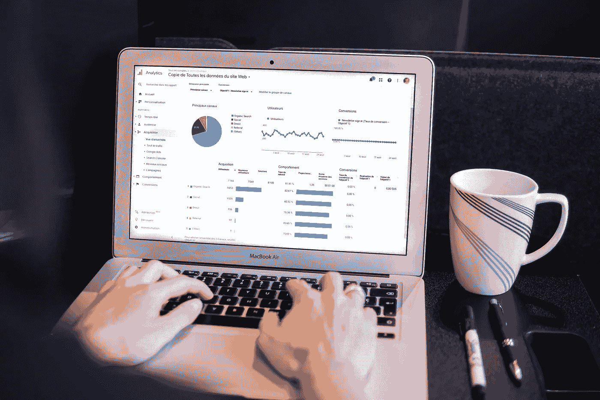

# 转型到数据分析的路线图

> 原文：[`towardsdatascience.com/how-to-transition-to-data-analytics-128a3dca54d5?source=collection_archive---------0-----------------------#2023-11-06`](https://towardsdatascience.com/how-to-transition-to-data-analytics-128a3dca54d5?source=collection_archive---------0-----------------------#2023-11-06)

 [Thu Vu](https://medium.com/@vuthihienthu.ueb?source=post_page-----128a3dca54d5--------------------------------)

·

[关注](https://medium.com/m/signin?actionUrl=https%3A%2F%2Fmedium.com%2F_%2Fsubscribe%2Fuser%2F4336ed7a3103&operation=register&redirect=https%3A%2F%2Ftowardsdatascience.com%2Fhow-to-transition-to-data-analytics-128a3dca54d5&user=Thu+Vu&userId=4336ed7a3103&source=post_page-4336ed7a3103----128a3dca54d5---------------------post_header-----------) 发布于 [Towards Data Science](https://towardsdatascience.com/?source=post_page-----128a3dca54d5--------------------------------) ·11 min read·Nov 6, 2023

--

> 如果你在其他领域工作，如何转型为数据分析师？

你可能拥有与数据分析无关的大学学位，或者一直在完全不同的领域工作。你可能对转型为数据分析师感兴趣，但不知道从何开始。如果这听起来像你，继续阅读吧！😉

照片来源：[Myriam Jessier](https://unsplash.com/@mjessier?utm_source=medium&utm_medium=referral) 在 [Unsplash](https://unsplash.com/?utm_source=medium&utm_medium=referral)

# 进入数据分析的两种方式

实际上，有两种方式可以进入数据分析领域：

+   (1) 完全自学：然后将分析技能与当前领域知识（无论是早期学习还是工作经验）巧妙结合，以获得竞争优势；

+   (2) 参加数据分析学位课程或培训班。

在这篇博客文章中，我们将主要关注**自学**的**路径**，目标是成为数据分析师，这是许多其他数据科学角色的良好起点。这也是我六年前的起点，当时我对医疗分析非常感兴趣，所以这是我开始的领域。

在这篇文章中，我们将讨论你在以下方面应该学习和准备的内容：

+   所需技能

+   项目作品集
