# 如何理解和使用 Jensen-Shannon 散度

> 原文：[`towardsdatascience.com/how-to-understand-and-use-jensen-shannon-divergence-b10e11b03fd6?source=collection_archive---------0-----------------------#2023-03-02`](https://towardsdatascience.com/how-to-understand-and-use-jensen-shannon-divergence-b10e11b03fd6?source=collection_archive---------0-----------------------#2023-03-02)

作者提供的图片

## 关于 JS 散度的数学、逻辑和实际应用的入门 — 包括如何在漂移监控中最佳使用它

 [Aparna Dhinakaran](https://aparnadhinak.medium.com/?source=post_page-----b10e11b03fd6--------------------------------)

·

[关注](https://medium.com/m/signin?actionUrl=https%3A%2F%2Fmedium.com%2F_%2Fsubscribe%2Fuser%2Ff32f85889f3a&operation=register&redirect=https%3A%2F%2Ftowardsdatascience.com%2Fhow-to-understand-and-use-jensen-shannon-divergence-b10e11b03fd6&user=Aparna+Dhinakaran&userId=f32f85889f3a&source=post_page-f32f85889f3a----b10e11b03fd6---------------------post_header-----------) 发表在 [Towards Data Science](https://towardsdatascience.com/?source=post_page-----b10e11b03fd6--------------------------------) ·9 分钟阅读·2023 年 3 月 2 日

--

*本文由 Arize AI 的首席执行官兼联合创始人 Jason Lopatecki 共同撰写*

在机器学习系统中，漂移监控对于提供高质量的 ML 至关重要。一些在生产 ML 系统中漂移分析的常见用例包括：

+   检测训练和生产之间的特征变化，以在性能下降之前发现问题

+   检测两个生产周期之间的预测分布变化，以作为性能变化的代理（特别适用于延迟真实情况）

+   使用漂移作为重新训练的信号——以及重新训练的频率

+   捕捉特征转换问题或管道中断

+   检测错误使用的默认回退值

+   查找新的数据以进行标记

+   查找对模型有问题的新数据集群，特别是在非结构化数据中

+   查找不在训练集中的异常数据集群

虽然没有完美的漂移度量，但在过去十年里这个领域已经学到了很多，有一些经过良好测试的方法和度量在不同的使用场景中非常有用。

一种这样的度量是**詹森-香农散度**（JS Div）。[此外](https://nlp.stanford.edu/fsnlp/) [也](https://dl.acm.org/doi/10.3115/976909.979625)被称为**相对于平均值的总散度**或**信息半径**，JS 散度是一个基于信息理论的统计度量**。** JS 散度相比于其他度量的优势主要与某些事件或箱的空概率问题有关，这些问题会影响 Kullback-Leibler 散度（[KL 散度](https://arize.com/blog-course/kl-divergence/)）和人口稳定性指数（PSI）。JS 散度在比较两个分布时使用混合概率作为基线。在 PSI 和 KL 散度的离散版本中，当出现 0 概率事件时，方程会出现爆炸。

本博客文章涵盖了 JS 散度的定义、它与 KL 散度的不同、如何在漂移监测中使用 JS 散度，以及混合分布如何解决常见的测量问题。

# JS 散度概述

詹森-香农是一种非对称度量，[测量相对熵](http://hanj.cs.illinois.edu/cs412/bk3/KL-divergence.pdf)或两个分布所表示信息的差异。与 KL 散度密切相关，它可以被视为测量两个数据分布之间的距离，显示这两个分布之间的差异。

下图展示了与 KL 散度的对称性：

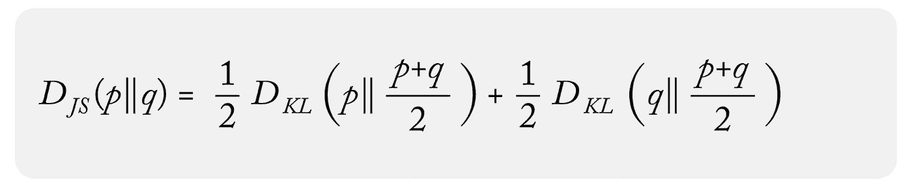

图片由作者提供

以及 JS 散度的离散形式：

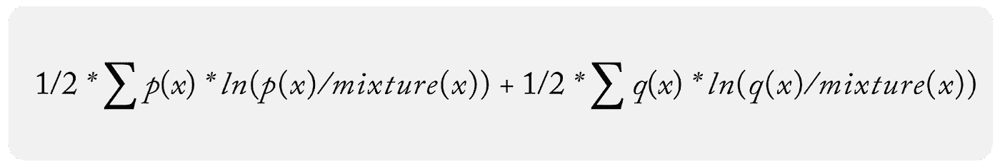

图片由作者提供

其中混合分布是：

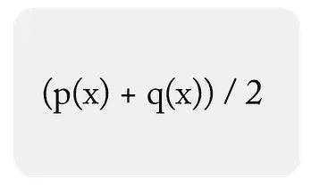

图片由作者提供

更多背景信息中，关于 JS 散度的技术[论文](https://www.mdpi.com/1099-4300/21/5/485)由 Sony Computer Science Laboratories 的 Frank Nielsen 撰写。

在模型监测中，JS 散度的离散形式通常用于通过[数据分箱](https://arize.com/blog-course/data-binning-production/)来获取离散分布。JS 的离散形式和连续形式会随着样本和箱数趋于无穷大而收敛。有优化的[选择方法](https://stats.stackexchange.com/questions/510699/discrete-kl-divergence-with-decreasing-bin-width)来选择箱数以接近连续形式。

# JS 散度如何在漂移监测中使用？

在模型监控中，JS 散度类似于 PSI，因为它用于监控生产环境，特别是特征和预测数据方面。JS 散度还用于确保生产中的输入或输出数据没有从基准数据中发生剧烈变化。基准数据可以是数据的训练生产窗口或训练/验证数据集。

漂移监控对于那些收到延迟地面真相以与生产模型决策进行比较的团队尤为有用。团队依赖于预测和特征分布的变化作为性能变化的代理。

JS 散度通常应用于每个特征独立地；它不是作为协方差特征测量的设计，而是显示每个特征如何独立于基准值发生偏离的度量。虽然 JS 散度确实支持多分布混合方法，但它实际上并不适用于比较完全不同的分布——它不是一个多变量漂移测量。

JS 散度的挑战 — 也是它的优势 — 是比较基准是一个混合分布。可以将 JS 散度视为两个步骤进行：

**步骤 1：**

使用生产和基准分布创建混合分布进行比较；

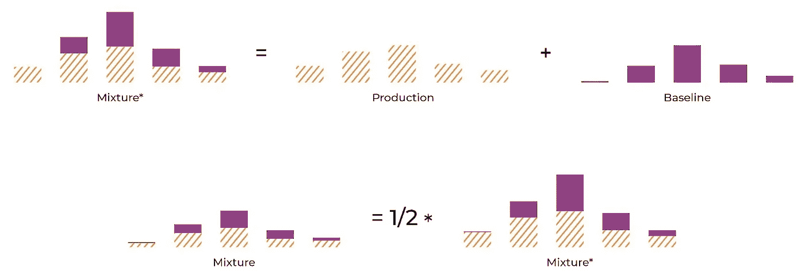

作者提供的图片

**步骤 2：**

比较生产和基准与混合。

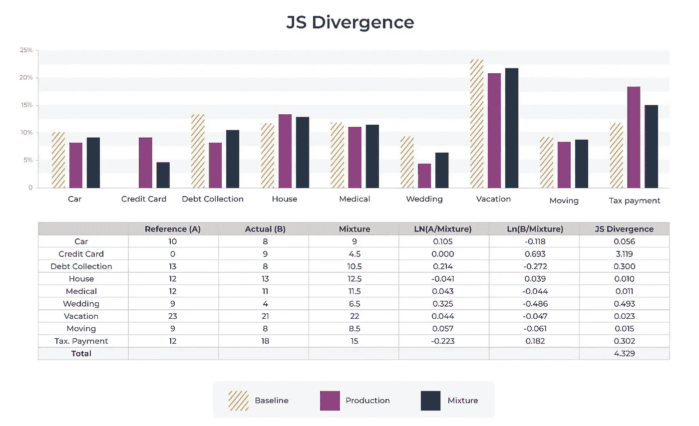

作者提供的图片

上图展示了 A 分布、B 分布和混合分布。JS 散度是通过将 JS 分布与 A 和 B 进行比较来计算的。

*✏️****注意****：* 有时非从业者对捕捉数据变化的数学完美目标过于热衷。在实践中，重要的是要记住真实数据在生产中一直在变化，许多模型可以很好地适应这些修改的数据。使用漂移度量的目标是拥有一个可靠、稳定且非常有用的度量，以便进行故障排除。

# JS 散度是对称度量

JS 散度类似于 PSI，因为它是一个对称度量。如果你交换基准分布 p(x) 和样本分布 q(x)，你将得到**相同**的数字。这相比于 KL 散度在故障排除数据模型比较中有几个优势。有时团队希望在故障排除工作流中将比较基准替换为不同的分布，而拥有一个度量使得 *A / B* 与 *B / A* 相同，可以使比较结果更容易。

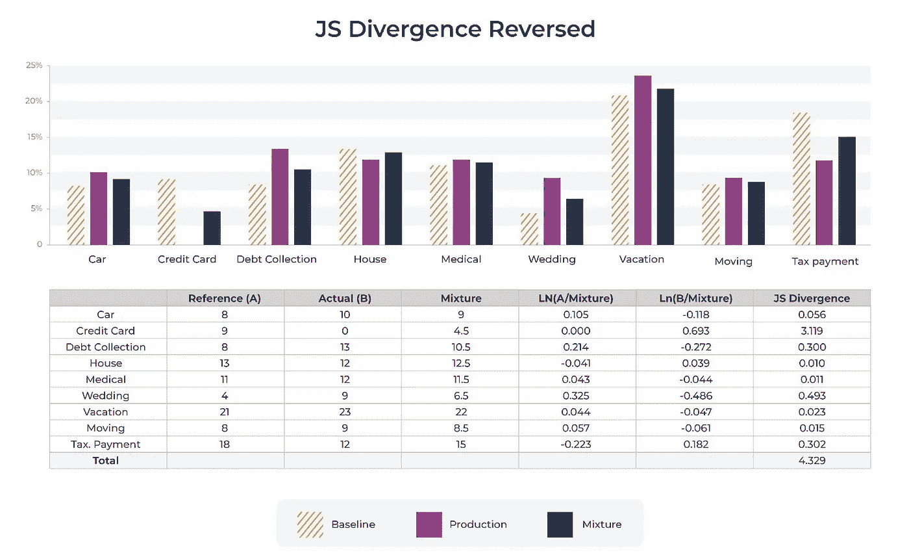

作者提供的图片

# JS 散度的优势：处理零 bin

JS 散度的主要优势在于混合分布允许计算处理 bin 比较到 0。对于 KL 散度，如果你比较 0 bin，方程式基本上会爆炸。

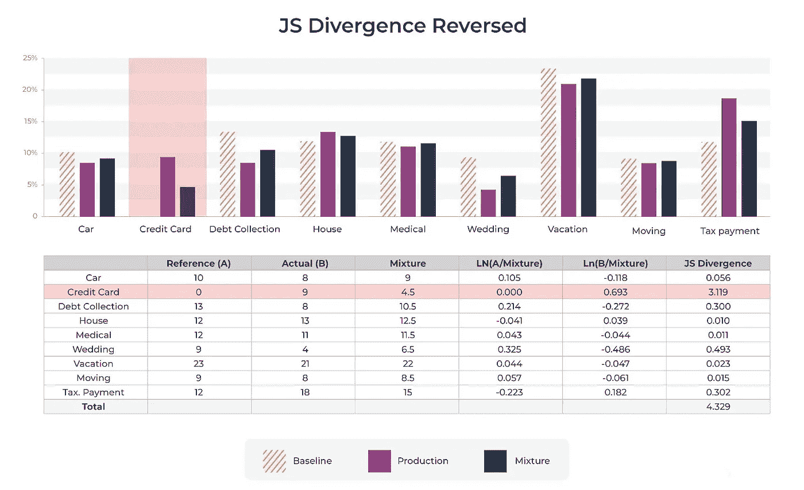

作者提供的图片

如上图所示，有两个桶，其中一个桶在当前时间段内为 0，另一个有一个值。处理 0 桶的 JS 散度方法是将 JS 散度中的两个项假设其中一个为*0 (0*ln(0) = 0)*，因为函数是光滑的，并且在接近 0 时有一个极限，而另一个有一个值：

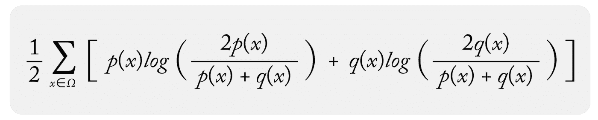

假设一个项为 0，你在 0 桶中得到：

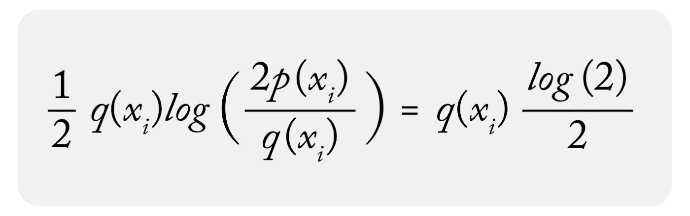

这在 KL 散度或 PSI 中不起作用，因为你会在分母中除以 0：

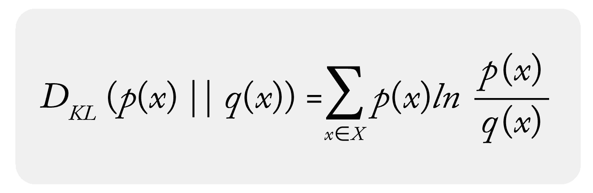

在 q(x) = 0 的情况下，你有：

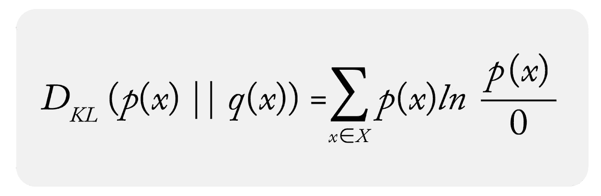

*优势：零桶自然处理，无问题*

✏️注意：在需要时，也可以进行修改，以允许 KL 散度和 PSI 用于 0 桶的分布。

# JS 散度的劣势：混合分布移动

JS 散度的劣势实际上源于它的优势，即比较分布是两个分布的“混合”。

在 PSI 或 KL 散度的情况下，基线比较分布是静态比较分布，在每次比较时间段内固定。这使你能够获得一个稳定的指标，在每次比较和每个时期都具有相同的含义。例如，如果一天的 PSI 值为 0.2，那么一周后仍然是 0.2，这意味着这两天与基线的熵差异是相同的。这在 JS 散度中不一定如此。

在 JS 散度的情况下，每次进行比较时混合分布都会改变，因为生产分布在每个样本周期内都会变化。

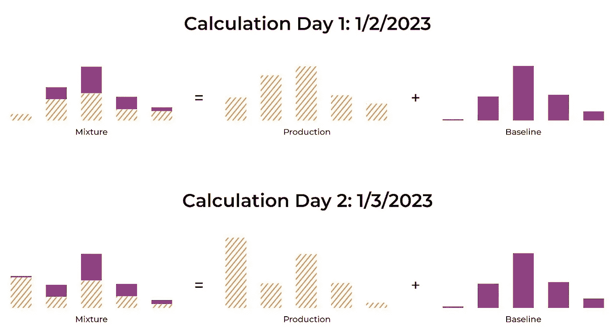

*每个监测日的混合分布计算（图片由作者提供）*

上图展示了为两个不同时间框架计算的混合分布的示例。混合分布像是一个缓慢移动的基线，通过平均差异将时间 A 的基线平滑地连接到时间 B。

# 连续数值和分类特征之间的差异

JS 散度可以用来测量数值分布和分类分布之间的差异。

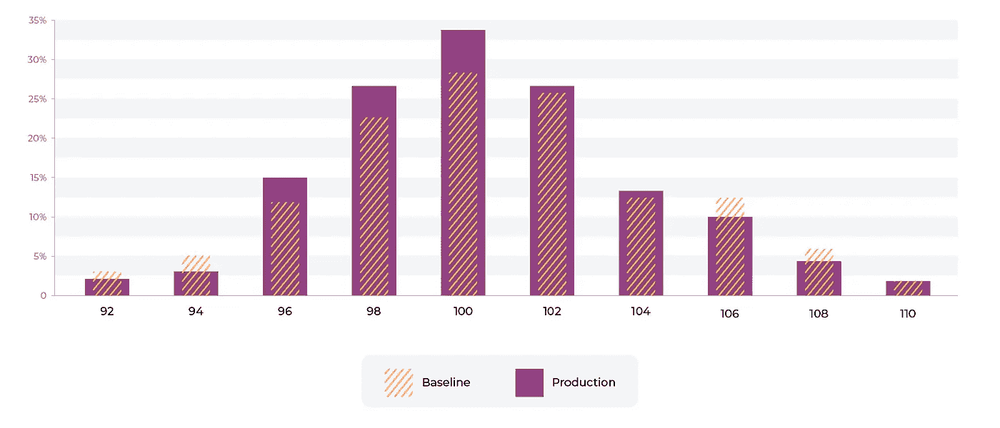

图片由作者提供

# 数值

对于数值分布，数据基于分割点、桶大小和桶宽度被分成桶。桶化策略可以是均匀桶、五分位数或复杂的混合策略，最终影响 JS 散度（请关注未来关于桶化策略的文章）。

# 分类

JS 散度的监控跟踪分类数据集中大的分布变化。对于分类特征，通常有一个大小点，卡尔多性变得过大，导致度量值不再有用。理想的大小在 50–100 个独特值左右——随着分布的卡尔多性增加，两个分布的差异及其重要性变得模糊。

# 高卡尔多性

对于高卡尔多性特征监控，现成的统计距离通常效果不好——建议使用以下其中一种选项：

1.  **嵌入：** 在一些高卡尔多性的情况下，使用的值——例如*用户 ID* 或 *内容 ID*——已经用于内部创建嵌入。监控嵌入可以有所帮助。

1.  **纯高卡尔多性分类变量：** 在其他情况下，当模型对输入进行大规模编码时，仅监控前 50–100 个最重要项的 JS 散度，而将所有其他值视为“其他”，可能会很有用。

当然，有时你可能想监控的是非常具体的内容——例如某一时期内新值或箱的百分比。此类情况更适合使用数据质量监控工具。

# JS 散度示例

这是一个包含数值和分类特征的 JS 散度示例。

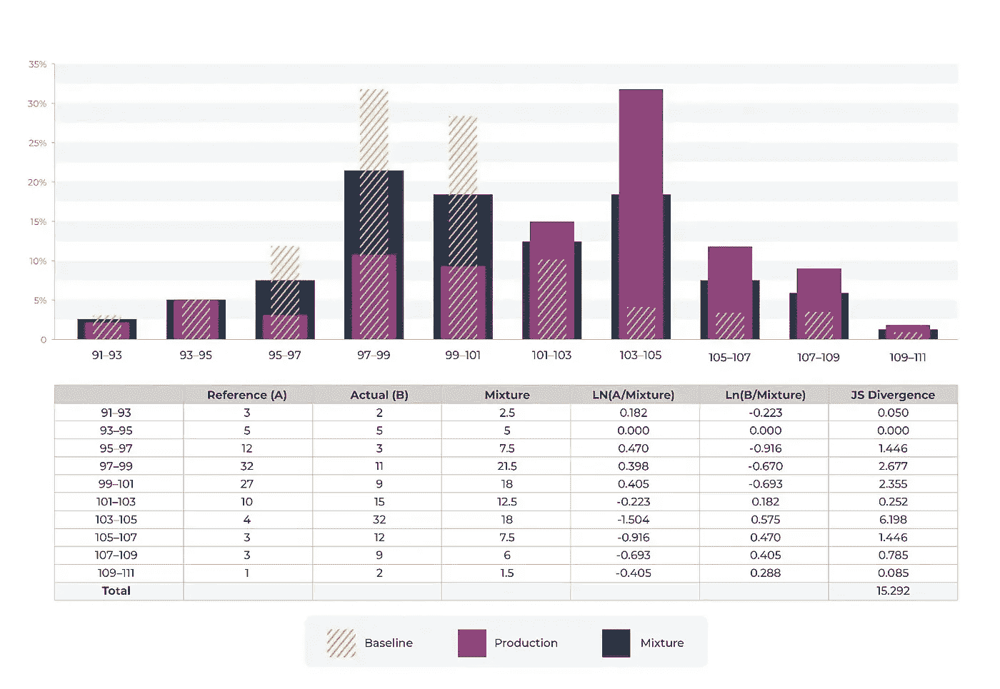

作者提供的图片

假设你在一家信用卡公司工作，负责为欺诈模型制定数值分布。模型是基于上图所示的基线进行训练的。我们可以看到费用分布发生了变化。行业标准在 PSI 阈值方面有许多，但如你所见，JS 散度的值却非常不同。0.2 的 PSI 标准不适用于 JS 散度。在 Arize（完全披露：我在 Arize 工作），我们通常查看多日周期内的移动窗口值，以为每个特征设置阈值。

该示例展示了一个数值变量及其分布上的 JS 散度。在上述示例中，值得注意的是，bin 95–97 从 12% 降到 3% 导致 JS 散度移动了 1.4。对于 bin 105–107 的 3% 到 12% 的九个百分点增加，JS 散度也有类似的变化。PSI 以类似对称的方式工作，这与 KL 散度不同。对于 KL 散度，12%->3% 会导致数值上更大的变化。

# JS 散度的直觉

理解一些关于度量和基于分布变化的度量变化的逻辑非常重要。

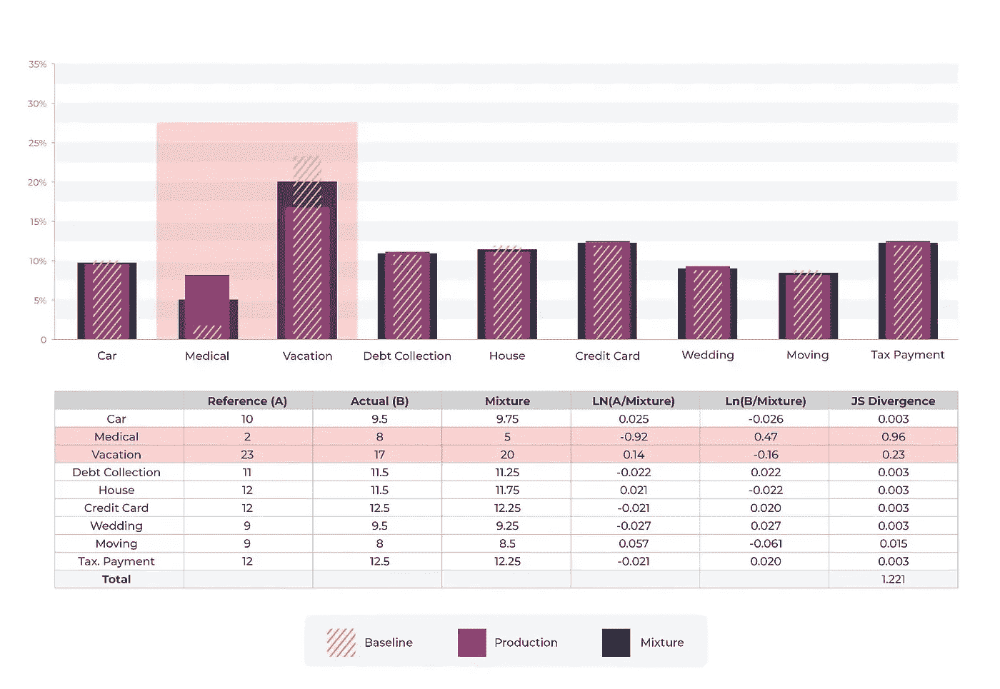

作者提供的图片

上述示例展示了从一个分类 bin 到另一个分类 bin 的迁移。以“医疗”为输入的预测（贷款用途）从 2% 增加到 8%，而以“度假”为输入的预测从 23% 减少到 17%。

在这个例子中，与“医疗”相关的 JS 散度组件是 0.96，远大于“度假”百分比移动的 0.023。这与 KL 散度得到的结果正好相反。

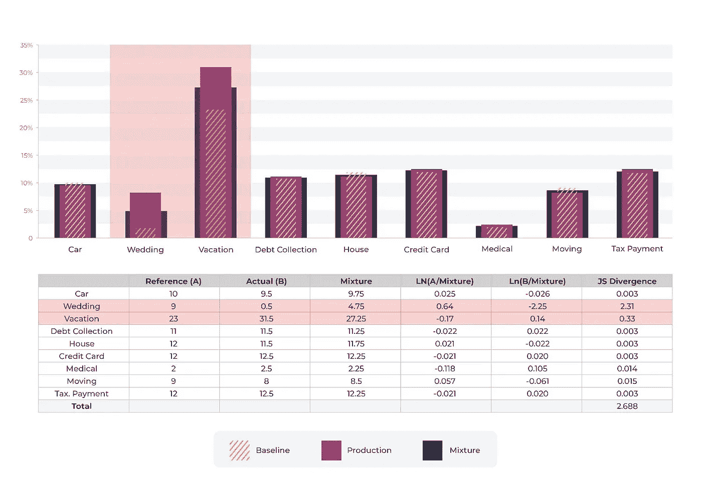

图片由作者提供

# 结论

[JS 散度](https://arize.com/blog-course/jensen-shannon-divergence/) 是一种常见的漂移测量方法。它具有对称性，并自然处理 0 桶比较，但在使用移动混合作为基准时也有一些缺点。根据你的使用场景，它可能是一个很好的漂移度量选择。

也就是说，这并不是唯一的选择。另一种替代方法是使用 [人口稳定性指数](https://arize.com/blog-course/population-stability-index-psi/) 结合分布外分桶技术来处理零桶。利用分布外分桶技术可以让团队调节度量对分布外事件的敏感性，并轻松与固定基准分布进行比较（没有混合）。敬请关注更多关于此主题和分桶最佳实践的后续内容！
