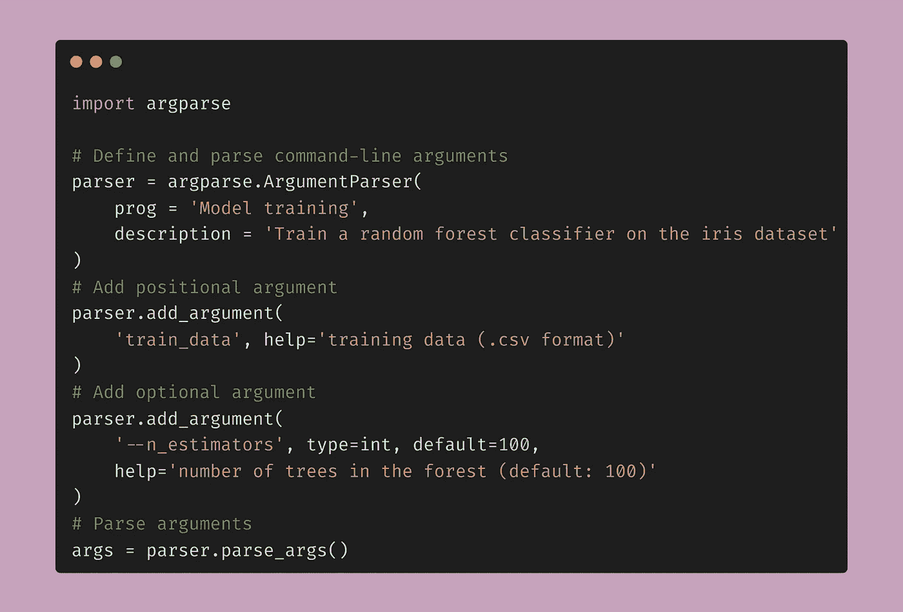

# 如何利用参数解析提升机器学习工作流的效率

> 原文：[`towardsdatascience.com/how-to-use-argument-parsing-for-greater-efficiency-in-machine-learning-workflows-2f637eaf5f6a`](https://towardsdatascience.com/how-to-use-argument-parsing-for-greater-efficiency-in-machine-learning-workflows-2f637eaf5f6a)

## 如何使用 argparse 来提升命令行应用程序的效率，并且如何将其应用于机器学习项目的完整指南

[](https://thomasdorfer.medium.com/?source=post_page-----2f637eaf5f6a--------------------------------)[](https://towardsdatascience.com/?source=post_page-----2f637eaf5f6a--------------------------------) [Thomas A Dorfer](https://thomasdorfer.medium.com/?source=post_page-----2f637eaf5f6a--------------------------------)

·发表在 [Towards Data Science](https://towardsdatascience.com/?source=post_page-----2f637eaf5f6a--------------------------------) ·阅读时间 6 分钟·2023 年 3 月 29 日

--



图片来源于作者。

如果你在数据科学或软件工程领域有过一些探索，你很可能遇到过需要使用命令行接口（CLI）的应用程序。常见的例子包括用于管理 Azure 资源的 [Azure CLI](https://learn.microsoft.com/en-us/cli/azure/) 或用于版本控制和源代码管理的 [Git](https://git-scm.com/book/en/v2/Getting-Started-The-Command-Line)。

同样的功能和程序互动性也可以通过你自己定制的 Python 应用程序来实现。命令行参数是丰富应用程序功能的绝佳工具，它允许你和你的用户无缝配置和定制程序的行为，从而增加了必要的灵活性。

一个流行且（也许是）最常用的 Python 库来解析命令行参数是 [**argparse**](https://docs.python.org/3/library/argparse.html)。在本文中，我们将探索一些其核心功能，并通过具体示例详细了解如何高效地将其应用于 Python 应用程序。

# argparse 简介

Python 的 argparse 模块提供了一种直观且用户友好的方式来解析命令行参数。简而言之，你只需完成以下三步：（1）创建一个 `ArgumentParser` 对象，（2）通过 `add_argument()` 方法添加参数规范，（3）使用 `parse_args()` 方法运行解析器。现在让我们详细探讨这三个步骤，并看看如何将它们组合成一个功能齐全的命令行解析器。

首先，`[ArgumentParser](https://docs.python.org/3/library/argparse.html#argparse.ArgumentParser)` 对象作为一个容器，保存了必要的信息，如程序的名称或简要描述。用户可以通过帮助参数 `-h` 或 `--help` 检索这些信息，从而更好地理解程序的意图。

```py
import argparse

parser = argparse.ArgumentParser(
    prog = 'Sample Program',
    description='Description of the sample program'
)
```

其次，我们可以通过 `add_argument()` 方法添加位置参数或可选参数。位置参数通过直接提供参数名称来指定，而可选参数需要通过 `—` 前缀进行识别。一个单破折号用于指定参数的缩写版本，通常是一个字母，而双破折号用于提供更具描述性的参数名称。

```py
# adding positional argument
parser.add_argument('filename')

# adding optional argument
parser.add_argument('-p', '--parameter')
```

最后，我们可以使用 `parse_args()` 方法运行解析器，这样我们就可以访问和操作 CLI 中指定的参数。

```py
args = parser.parse_args()

# print the parsed arguments
print("filename: " + args.filename + "\n" + "parameter: " + args.parameter)
```

现在我们可以在 CLI 中运行这个程序——我们称之为 `program.py`——并使用一些随机参数来查看它的工作情况：

```py
>>> python program.py 'sample_data.csv' -p 10
filename: sample_data.csv
parameter: 10
```

我们现在已经构建了一个功能，允许我们直接在命令行上指定输入参数，然后使用这些参数执行任何我们想要的操作。你现在可能已经能够想象这对于任何需要重复运行程序的开发过程有多么有用，从而实现了一种简单而无缝的交互方式。

# 机器学习中的实用工具

假设你已经在 Python 中构建了一个机器学习或深度学习模型，你希望使用不同的超参数，如学习率、批处理大小或训练轮次，并将结果存储在不同的目录中。

直接在命令行上指定这些超参数大大简化了与该程序的交互方式。它使你能够在不实际修改底层源代码的情况下对不同的模型配置进行实验，从而减少了引入意外错误的可能性。

## 示例：训练随机森林分类器

想象一下，你想建立一个实验工作流，使你能够无缝且反复地训练随机森林分类器。你希望以一种方式进行配置，以便你只需将训练数据集、一些超参数和模型的目标目录传递给 CLI，它就会运行、训练模型并将其存储在指定位置。

在这个例子中，我们将使用公开的 [鸢尾花种类](https://www.kaggle.com/datasets/uciml/iris) 数据集。我们可以通过 `seaborn` 加载数据集并将其保存为 `iris.csv`。

```py
import searborn as sns
iris = sns.load_dataset("iris")
iris.to_csv('iris.csv', index=False)
```

为了更好地了解我们的数据，我们可以使用 [成对图](https://seaborn.pydata.org/generated/seaborn.pairplot.html) 可视化它：


作者提供的图片。使用的数据集：[鸢尾花种类](https://www.kaggle.com/datasets/uciml/iris)。许可证：[CC0 公开领域](https://creativecommons.org/publicdomain/zero/1.0/)。

现在开始我们的主要任务：在我们的 Python 程序中构建一个解析器功能。为了训练随机森林分类器，我们希望将训练数据集传递给它——这将是我们的位置参数——两个超参数，以及一个我们希望保存模型的目标路径。后者将是我们的可选参数。

对于可选参数，我们还将通过`type`关键字指定类型，通过`default`关键字指定默认值，并通过`help`关键字提供参数的有用描述。

然后，我们将解析参数并将结果存储在变量`args`中，稍后我们将使用这些结果来指定我们正在读取的数据集、训练分类器的超参数以及我们希望模型保存的位置。

这段代码的样子如下：

```py
import argparse
import pandas as pd
import pickle
from sklearn.ensemble import RandomForestClassifier

# Define and parse command-line arguments
parser = argparse.ArgumentParser(
    prog = 'Model training',
    description = 'Train a random forest classifier on the iris dataset'
)
parser.add_argument(
    'train_data', help='training data (.csv format)'
)
parser.add_argument(
    '--n_estimators', type=int, default=100,
    help='number of trees in the forest (default: 100)'
)
parser.add_argument(
    '--max_depth', type=int, default=None,
    help='maximum depth of the tree (default: None)'
)
parser.add_argument(
    '--model_path', type=str, default='./model.pkl',
    help='path to save the trained model (default: ./model.pkl)'
)
args = parser.parse_args()

# Read the dataset
iris = pd.read_csv(args.train_data)
X = iris.loc[:, iris.columns != 'species']
y = iris['species']

# Train a random forest classifier with the specified hyperparameters
clf = RandomForestClassifier(
    n_estimators=args.n_estimators,
    max_depth=args.max_depth,
    random_state=42)

clf.fit(X, y)

# Save the trained model to a pickle file
with open(args.model_path, 'wb') as f:
    pickle.dump(clf, f)
```

现在，让我们将脚本保存为`train_rf.py`并将其放置在与我们的训练数据集`iris.csv`相同的目录中。

接下来，我们打开一个终端窗口，从中可以用自定义参数调用这个程序。在下面的示例中，我们将`n_estimators`指定为 100，将`max_depth`指定为 10。至于`model_path`，我们对默认路径感到满意，因此在这种情况下无需指定。

```py
>>> python .\train_rf.py 'iris.csv' --n_estimators 100 --max_depth 10 
```

这行代码将训练我们的随机森林分类器，过一会儿，你将会看到一个名为`model.pkl`的文件出现在你的目录中，你可以用它来在测试集上验证你的模型或生成预测。

我希望这篇文章给你提供了一些关于如何在 Python 中使用 argparse 直接从 CLI 解析参数的见解，从而改善你的机器学习应用程序的用户体验和互动性。

编程愉快！

## 更多资源：

+   [argparse — 命令行选项、参数和子命令的解析器 — Python 3.11.2 文档](https://docs.python.org/3/library/argparse.html)

## 喜欢这篇文章吗？

让我们联系一下吧！你可以在 [Twitter](https://twitter.com/ThomasADorfer) 和 [LinkedIn](https://www.linkedin.com/in/thomasdorfer/) 上找到我。

如果你希望支持我的写作，你可以通过 [Medium 会员](https://thomasdorfer.medium.com/membership) 来实现，这将为你提供访问我所有故事以及 Medium 上成千上万其他作者故事的权限。

[](https://medium.com/@thomasdorfer/membership?source=post_page-----2f637eaf5f6a--------------------------------) [## 通过我的推荐链接加入 Medium - Thomas A Dorfer

### 阅读 Thomas A Dorfer（以及 Medium 上成千上万的其他作者）的每一篇文章。您的会员费直接支持……

medium.com](https://medium.com/@thomasdorfer/membership?source=post_page-----2f637eaf5f6a--------------------------------)
