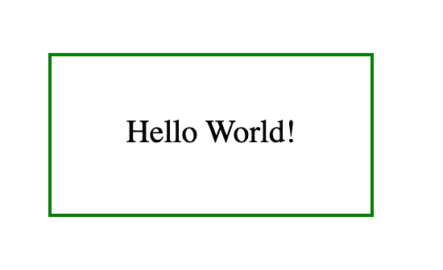
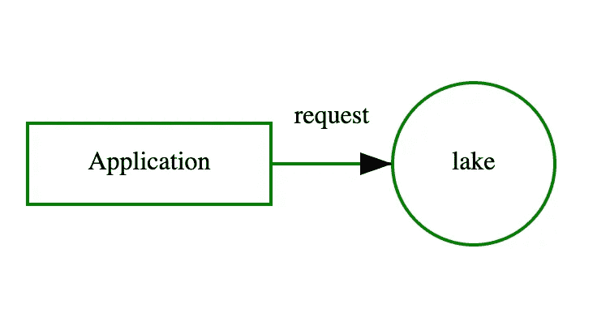

# 如何使用 ChatGPT 生成图表

> 原文：[`towardsdatascience.com/how-to-use-chatgpt-to-generate-diagrams-a78fb6693057`](https://towardsdatascience.com/how-to-use-chatgpt-to-generate-diagrams-a78fb6693057)

## 提示工程，SVG

## 快速教程：如何编写合适的提示以让 ChatGPT 生成图表

[](https://alod83.medium.com/?source=post_page-----a78fb6693057--------------------------------)[](https://towardsdatascience.com/?source=post_page-----a78fb6693057--------------------------------) [Angelica Lo Duca](https://alod83.medium.com/?source=post_page-----a78fb6693057--------------------------------)

·发布于 [Towards Data Science](https://towardsdatascience.com/?source=post_page-----a78fb6693057--------------------------------) ·阅读时长 4 分钟·2023 年 5 月 29 日

--


图片来源：[Christina @ wocintechchat.com](https://unsplash.com/@wocintechchat?utm_source=medium&utm_medium=referral) 在 [Unsplash](https://unsplash.com/?utm_source=medium&utm_medium=referral)

你可能知道 ChatGPT 在生成文本方面非常出色。你是否想过它也能为你创建令人惊叹的图表？如果你还没听说过，也不用担心，因为我在这里告诉你所有的相关信息。

在这篇文章中，我们将向你展示如何利用 ChatGPT 生成令人惊叹的图表。所以，让我们直接开始吧！

我们将涵盖以下内容：

+   入门指南

+   提示的结构

+   一个更高级的示例

# 入门指南

让我们假设你想使用 ChatGPT 创建以下图形：



作者提供的图像

创建视觉上引人注目且易于理解的图表的关键在于让 ChatGPT **生成 SVG 代码**。是的，你没听错——ChatGPT 掌握着你成功的关键，你需要做的就是学习如何挖掘它的无限潜力。

向 ChatGPT 写下以下提示：

*编写 SVG 代码生成以下图像：一个白色矩形，边框为绿色。将以下文本居中放置在矩形内：hello world！*

ChatGPT 将生成以下代码：

```py
<svg xmlns="http://www.w3.org/2000/svg" width="300" height="200">
  <rect x="50" y="50" width="200" height="100" fill="white" stroke="green" stroke-width="2"/>
  <text x="150" y="100" text-anchor="middle" alignment-baseline="middle" font-size="20" fill="black">Hello World!</text>
</svg>
```

复制并粘贴到一个新文件中。将文件保存为 SVG 扩展名并打开它！你将看到生成的图像！

# 提示的结构

让 ChatGPT 绘制复杂图表不仅仅是生成代码。要掌握图表绘制的艺术，你需要将指令分解为小的、具体的步骤。只有这样，你才能释放创造力，设计出既美观又实用的图表。

为了让 ChatGPT 绘制复杂的图表，我们可以将它们拆分成单独的组件，然后给出如何构建每个组件的指令。我们可以按如下方式组织 ChatGPT 提示：

## 1\. 初始声明

在这里，我们指示 ChatGPT 构建生成 SVG 图像的代码：

```py
Write the svg code to generate the following image width 600 height 300:
```

## 2\. 生成组件列表

现在我们将组件生成列表指定为一个项目符号列表：

```py
- A
- B
- C
```

对每个组件，指定一些细节作为嵌套列表：

```py
- A
-- A1
-- A2
- B
-- B1
-- B2
-- B3
- C
-- C1
```

细节包括与每个组件相关的具体元素，如大小、颜色等。

# 一个更高级的例子

现在，让我们进入一个更高级的例子。假设我们要绘制以下图表：



图片由作者提供

将问题分成三个独立的部分：

+   绘制带有文本的矩形

+   绘制带有文本的圆形

+   绘制带有文本的箭头。

让我们指示 ChatGPT 执行这三个步骤。

首先，给 ChatGPT 一些通用建议：

```py
Write the svg code to generate the following image width 600 height 300: 
```

然后，指示 ChatGPT 绘制矩形。尽可能具体：

```py
- a white rectangle with:
-- width 150, height 50
-- green borders. 
-- center the following text inside the rectangle: Application
```

现在，关于圆形的建议：

```py
- on the right of the rectangle, draw a white circle with:
-- cx 500
-- radius 50
-- green borders. 
-- center the following text inside the circle: lake
```

最后，指定如何构建箭头：

```py
- a green arrow from the rectangle to the circle:
-- the arrow must end when the circle begins
-- add the following text centered above the arrow: request
```

就这些！ChatGPT 将为你生成以下代码：

```py
<svg xmlns="http://www.w3.org/2000/svg" width="600" height="300">
  <rect x="225" y="125" width="150" height="50" fill="white" stroke="green" stroke-width="2" />
  <text x="300" y="150" text-anchor="middle" alignment-baseline="middle">Application</text>
  <circle cx="500" cy="150" r="50" fill="white" stroke="green" stroke-width="2" />
  <text x="500" y="150" text-anchor="middle" alignment-baseline="middle">lake</text>
  <path d="M375,150 L450,150" fill="none" stroke="green" stroke-width="2" marker-end="url(#arrowhead)" />
  <text x="412.5" y="125" text-anchor="middle">request</text>
  <defs>
    <marker id="arrowhead" markerWidth="10" markerHeight="7" refX="10" refY="3.5" orient="auto">
      <polygon points="0 0, 10 3.5, 0 7" />
    </marker>
  </defs>
</svg>
```

将代码粘贴到一个空文件中，并将其保存为 SVG 扩展名。然后，用浏览器打开该文件以查看生成的图表！

# 总结

恭喜！你刚刚学会了如何在 ChatGPT 中生成图表！主要有两个要素：

+   让 ChatGPT 为你生成 SVG 代码

+   将指令拆分成小而具体的步骤。

尝试不同的形状、颜色和布局，以创建视觉上吸引人且易于理解的图表。

记住，成功生成图表的关键是将指令拆分成小而具体的步骤。这将使你能够专注于每个图表元素，并确保一切都正确放置。

利用 ChatGPT 强大的 AI 技术，生成图表从未如此简单！无论你是学生、商业专业人士，还是喜欢视觉沟通的人，ChatGPT 都可以帮助你快速创建令人惊叹的图表。那么为什么不今天就试试看，看看你能想到什么令人惊叹的图表呢？
