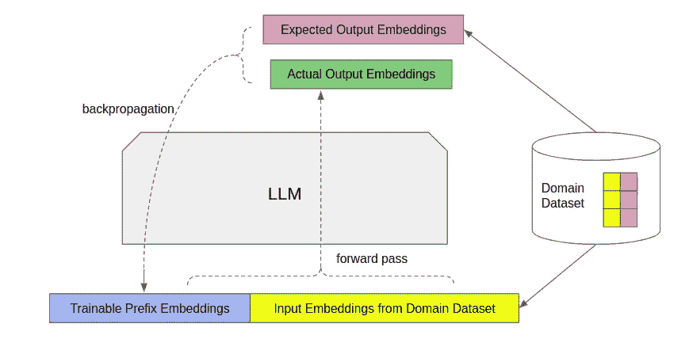

# 如何在自己的领域中使用大型语言模型（LLM）

> 原文：[`towardsdatascience.com/how-to-use-large-language-models-llm-in-your-own-domains-b4dff2d08464`](https://towardsdatascience.com/how-to-use-large-language-models-llm-in-your-own-domains-b4dff2d08464)

## 一些经典的、经过研究验证的技术，用于将大型语言模型适应于领域特定任务，以及为什么这些技术有效的直觉。

[](https://eileen-code4fun.medium.com/?source=post_page-----b4dff2d08464--------------------------------)[](https://towardsdatascience.com/?source=post_page-----b4dff2d08464--------------------------------) [Eileen Pangu](https://eileen-code4fun.medium.com/?source=post_page-----b4dff2d08464--------------------------------)

·发表于[Towards Data Science](https://towardsdatascience.com/?source=post_page-----b4dff2d08464--------------------------------) ·阅读时间 9 分钟·2023 年 3 月 20 日

--


来源：[`unsplash.com/`](https://unsplash.com/)

自从 2022 年底 ChatGPT 普及以来，大型语言模型（LLM）吸引了研究和工业界的极大关注。虽然通用聊天机器人是大型语言模型的明显应用，但企业们正在考虑如何将大型语言模型集成到其业务工作流程中，以利用这一最新的 AI 进展。**然而，业务特定集成的一个基本前提是能够将大型语言模型适应于定制的业务领域**，因为 LLM 通常在开放互联网信息上进行训练，这些信息包含过多噪声，并不总是与具体业务背景紧密相关。

尽管已有许多优秀的博客文章详细介绍了大型语言模型本身，但似乎缺乏关于如何利用 LLM 的实质性介绍。在这篇博客文章中，我们探讨了从近期研究文献中获取的一些经典方法，将 LLM 适应于领域特定任务。目标是激发一些灵感，真正实现 LLM 的民主化，使其对更广泛的世界开放。

这篇博客文章设想的场景是，你以某种方式获得了一个已经预训练的通用大型语言模型。你可以访问模型中的所有参数。模型可能来自开源、商业选项、与其他组织的合作（如谷歌的 PaLM 和 OpenAI 的 GPT-3），或由你的组织从头开始训练。现在你有一系列特定业务背景下的任务（如问答、摘要、推理等），你希望基于大型语言模型来完成这些任务。

> 传统的微调

将通用机器学习模型调整到特定任务的传统方法是使用来自特定领域的标记数据来端到端地训练通用模型。在上训练过程中，模型中的部分或所有可学习参数都通过反向传播进行微调。这种类型的微调在大型语言模型中往往是不受欢迎的。如今的 LLM 大得多，一些拥有数百亿个参数。端到端微调不仅消耗大量计算资源，而且还需要大量特定领域的标记数据，这些数据获取起来很昂贵。随着人工智能领域的进步，模型可能只会变得更大，这使得对每个单独的定制任务进行端到端的微调变得越来越繁琐。

尽管如此，一种常常被期望的端到端微调形式是指令微调[1]。大型语言模型通常在一般文本上进行训练。**一个简单的类比是，LLM 就像一个阅读了大量书籍的人（请记住这个类比，我们会在后续继续参考它以建立我们的直觉）。**但他不知道如何利用这些知识。指令微调的目的是让模型养成执行一些常见任务的习惯。这是通过在输入前添加模板化的指令，如`“回答以下问题”`、`“总结以下文档”`、`“计算结果”`、`“翻译这句话”`等来实现的。输出则是这些指令的预期结果。使用这种输入/输出对来进行端到端的微调，将使模型更容易对未来的输入“采取行动”。请注意，指令微调不需要特定于某个领域，除非你的领域需要不寻常的“行动”。而且，你所拥有的预训练大型语言模型可能已经经过指令微调（例如 Google 的 Flan-PaLM）。

> 提示

在深入探讨将 LLM 调整到领域特定任务的方法之前，我们需要介绍提示的概念，剩下的博客内容基于这一概念。

提示是我们与 LLM 互动的方式。LLM 实际上是序列到序列的文本生成器。如果这有助于建立直觉，你可以将它们视为递归神经网络，但请注意，如今最先进的 LLM 是基于 Transformer，特别是 Transformer 的解码器部分，这不是 RNN。提示是输入序列到模型中。

回到我们上面的“知识渊博的人”类比，提示就是向这个人提问的行为。显然，为了获得有用的答案，你的问题需要足够好。网上有一些资源关于如何提出清晰和具体的问题以从 LLM 中获得良好的答案。这些是有用的技巧，但它们不是我们在这篇博客中将要讨论的微调提示类型。

想一想，为什么“提示”有效？因为模型被训练以使其输出基于输入序列。在训练于开放互联网的 LLMs 的情况下，所有的人类“知识”都被打包在模型中，并以数字形式重生。提示是为了设定数学条件，以便可以构建出适当的输出。最佳的数学条件可能不在传统意义上的“清晰和具体”，尽管这仍然是一个很好的通用规则。而且最重要的是，正如你可能猜到的，**这些数学条件是特定于领域的，你应该专注于调整这些条件以使 LLM 适应你的领域。** 模型参数本身保持不变。再用我们的“知识丰富的人”类比，他已经是知识丰富的，所以不需要改变他。事实上，由于他已经掌握了所有人类知识，他已经具备了你领域的潜在知识，因为你的领域最终建立在人的知识之上。

> 提示的艺术与科学

那么，我们应该如何提示模型以便将其微调到特定的业务领域呢？以下是几种经典的方法。

**少样本示例**

最简单而又非常有效的方法是提供一些示例作为提示。学术术语是通过示例进行的少样本学习[2]。为了简单说明，假设你想执行的任务是算术计算。

```py
Input:
Jane has 2 apples. She bought 3 more. How many apples does she have in total?

Expected Output:
The answer is 5.
```

现在，如果你只将上述输入提供给 LLM，你可能不会得到正确的结果。因为“知识丰富的人”虽然具备算术能力，但并不知道他被要求做算术。因此，你需要在输入中编码一些你想从 LLM 获得的示例。

```py
Input:
Joe has 3 oranges and he got 1 more. How many oranges does he have?
The answer is 4.
Jack has 8 pears and he lost 1\. How many pears does Jack have now?
The answer is 7.
Jane has 2 apples. She bought 3 more. How many apples does she have in total?

Expected Output:
The answer is 5.
```

最终的输出只是回答输入中的最后一个问题。然而，LLMs 可以根据输入中的前文来获取“做什么”的提示。显然，你任务的最终界面只是接受用户的实际问题。示例在幕后被添加到用户问题之前。你需要进行一些实验，以找到几个相对好的示例，作为模型输入的前缀。

**链式思维**

基于上述少样本示例，我们不仅想告诉 LLMs“做什么”，还想告诉他们“如何做”。这可以通过链式思维提示来实现。直觉是，如果“知识丰富的人”看到几个如何做任务的示例，他也会模仿“推理”过程。所以上述算术场景变成了：

```py
Input:
Joe has 3 oranges and he got 1 more. How many oranges does he have?
Starting with 3 oranges, then add 1, the result is 4.
The answer is 4.
Jack has 8 pears and he lost 1\. How many pears does Jack have now?
Starting with 8 pears, then minus 1, the result is 7.
The answer is 7.
Jane has 2 apples. She bought 3 more. How many apples does she have in total?

Expected Output:
Starting with 2 apples, then add 3, the result is 5.
The answer is 5.
```

研究[2]表明，链式思维提示显著提高了 LLMs 的性能。你可以选择是否要将推理部分展示给最终用户——`“从 2 个苹果开始，然后加上 3，结果是 5”`。

为了进一步改善思维链的结果，认识到通常有多条推理路径可以达到相同结果。人类可以以多种方式解决问题，如果多个解决方案得出相同结果，我们对结果的信心会更强。这种直觉可以再次被融入。LLMs（大规模语言模型）是概率模型。每次输出都是从样本中生成的。因此，如果你运行多次，输出可能会不同。我们感兴趣的是那些推理不同但最终答案相同的输出。这模拟了人类通过多种方式故意解决问题并从输出的“自我一致性”[3]中获得信心的思维过程。

```py
Input:
[same]

Output1:
Starting with 2 apples, then add 3, the result is 5.
The answer is 5\. [correct]

Output2:
2 apples and 3 apples make 6 apples.
The answer is 6\. [incorrect]

Output3 [repeat of final result 5 with a new reasoning - good]:
2 apples plus 3 apples equal 5 apples.
The answer is 5\. [correct]

Output4 [repeat of final result 6 with identical reasoning - ignore]:
2 apples and 3 apples make 6 apples.
The answer is 6\. [incorrect]
```

简而言之，最终结果中拥有最多不同推理方式的选项胜出。上面的`Output1`和`output3`准确地得出了最终正确答案`5`。

**可学习的提示**

上述方法仅使用了来自你领域特定标记数据集的一些示例。但如果你有更多数据，你自然会希望充分利用它们。你还应该问的另一个问题是如何确保你选择的示例在数学上是最优的。这就是可学习提示发挥作用的地方。

关键洞察是输入中的前缀不必来自固定的词汇。归根结底，每个输入标记在馈入模型之前都会被转化为嵌入。嵌入只是一个数字向量。最佳的数字是可以学习的。

你需要做的是在真实输入之前有一组前缀标记。这些前缀标记可以通过从你领域特定词汇中采样词语来初始化。然后，通过反向传播更新这些前缀标记的嵌入。模型参数本身仍然是冻结的。但梯度从预期与实际输出的差异开始，通过模型参数，一直到输入层，更新那些前缀标记的嵌入。经过在你领域特定标记数据集上的训练，这些学习到的标记嵌入就成为推理时的固定输入前缀。从某种意义上说，这是一种软提示，其中输入前缀不再受限于从固定词汇中经验性地提取。相反，它们是为你的领域在数学上优化的。这被称为提示调优[4]（图-1）。



图-1 提示调优：可训练前缀与领域特定输入连接形成模型输入。梯度从输出层通过模型参数传播到输入层，以更新可训练前缀。在整个架构中，其余参数保持不变。

> 结语

这篇博客文章提供了对常见且有效的微调机制的直观解释，这些机制可以帮助你以数据高效和计算高效的方式将大型语言模型（LLMs）适配到你特定领域的任务中。这是一个快速变化的领域，新研究成果以令人眼花缭乱的速度不断出现。希望这篇博客文章为你开始利用 LLMs 提供了坚实的基础。

> 参考文献

[1] 扩展指令微调语言模型 [`arxiv.org/abs/2210.11416`](https://arxiv.org/abs/2210.11416)

[2] 语言模型是少样本学习者 [`arxiv.org/abs/2005.14165`](https://arxiv.org/abs/2005.14165)

[3] 自一致性改善了语言模型中的链式思维推理 [`arxiv.org/abs/2203.11171`](https://arxiv.org/abs/2203.11171)

[4] 参数高效提示调优的规模效应 [`arxiv.org/abs/2104.08691`](https://arxiv.org/abs/2104.08691)
