# 如何使用 loc Pandas 方法高效地处理您的 DataFrame

> 原文：[`towardsdatascience.com/how-to-use-the-loc-pandas-method-to-efficiently-to-work-with-your-dataframe-880a068869df`](https://towardsdatascience.com/how-to-use-the-loc-pandas-method-to-efficiently-to-work-with-your-dataframe-880a068869df)

## PYTHON

## 提示如何使用 Pandas 探索和清理新数据集，附有代码示例和解释

[](https://byrondolon.medium.com/?source=post_page-----880a068869df--------------------------------)[](https://towardsdatascience.com/?source=post_page-----880a068869df--------------------------------) [Byron Dolon](https://byrondolon.medium.com/?source=post_page-----880a068869df--------------------------------)

·发表在 [Towards Data Science](https://towardsdatascience.com/?source=post_page-----880a068869df--------------------------------) ·9 分钟阅读·2023 年 6 月 27 日

--


Pandas 探索数据的一瞥，但是在户外 —— [Jim Bread](https://unsplash.com/@jim_bread?utm_source=medium&utm_medium=referral) 拍摄的照片，来自 [Unsplash](https://unsplash.com/?utm_source=medium&utm_medium=referral)

处理新数据集的关键部分是了解它。

弄清楚基本事项，比如数据中有哪些列，原始数据类型是什么，以及数据的描述统计，这些都对正确处理数据至关重要。

Pandas 中有许多内置方法，可以立即在笔记本中使用来探索数据。在进行数据探索的初始步骤时，您可以同时开始使数据可用于进一步分析，或者准备好用于训练机器学习模型。

在本文中，让我们使用一组大学数据来回答以下问题，以展示在同时探索和清理数据时的情况：

+   **哪些大学只提供面对面上课？**

+   **最古老和最新成立的大学之间的年份范围是多少？**

我们主要将使用 `loc` 方法与其他几种内置的 Pandas 方法来回答这些问题。首先，我们将快速了解 `loc` 方法的作用，然后逐步进行每个示例。

欢迎在笔记本中跟随！你可以从 Kaggle 免费下载[数据集](https://www.kaggle.com/datasets/drahulsingh/top-largest-universities/versions/1?resource=download)，该数据集可在开放数据共享公共领域奉献和许可（PDDL）v1.0 下免费使用。然后导入并运行以下内容，我们就可以开始了！

```py
import pandas as pd
df_raw = pd.read_csv("Top-Largest-Universities.csv")
```

# 一个快速介绍 loc 方法

基本上，Pandas 中的`loc`方法允许您根据给定条件选择目标 DataFrame 的一部分行或列。

您可以向`loc`传递几种不同的输入。例如，当您想基于其索引选择 DataFrame 的一个切片时，您可以使用与在 Python 中使用列表时相同的语法：`[start:stop]`。但是，在这篇文章中，我们将主要关注使用带有条件语句的`loc`。如果您以前使用过 SQL，这类似于编写查询的`WHERE`部分以过滤数据。

通常，以这种方式在`loc`中使用将如下所示：

```py
df.loc[df["column"] == "condition"]
```

这将返回数据的一个子集，其中列等于条件。

接下来，让我们继续看一些在探索性数据分析中使用`loc`方法的实际示例，看看您还可以做些什么。

# 使用 Pandas 的`loc`方法回答大学入学问题

## **哪些大学只提供面对面上课？**

首先，让我们看看如何使用`loc`选择数据的一部分以供进一步分析。

如果数据已经干净，您可能会认为要回答这个问题，您只需在该列上进行分组，计算提供面对面上课的机构数量。在 Pandas 中，这样做将如下所示：

```py
df.groupby("Distance / In-Person")["Institution"].count()
```

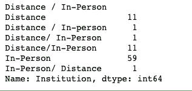

不幸的是，“远程/面对面”列的值并不是很干净。空格和一些机构提供远程和面对面上课，尽管记录的方式并不是标准化的。

我们可以做的第一件事也是清理这个的是将列重命名，这样它就不会有任何空格或特殊字符。

```py
df = df.rename(columns={"Distance / In-Person": "distance_or_in_person"})
```

接下来，我们可以通过选择 DataFrame 中的所有列来验证更改是否发生。

```py
df.columns
```

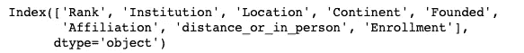

现在，至少所有列都没有空格或特殊字符。如果您愿意，您还可以进一步标准化这一点，将所有其他列更改为小写，但我们现在将跳过这一点。

早些时候，我们对目标列进行了分组操作，并计算了每个机构的值。到达相同结果的另一种方法是使用 Pandas 中的`value_counts`方法。这将返回一个 Series，其中包含您调用它的目标列的唯一值的计数。

```py
df["distance_or_in_person"].value_counts()
```

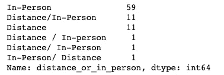

在这种情况下，您会注意到这次我们这次没有调用“机构”列，但这是因为在我们的原始 DataFrame 中，每一行代表一个机构。

现在，为了清理这一列，使得既提供面对面又提供远程上课的机构的值被分组为一个值，我们可以利用`loc`列在 DataFrame 上过滤这些值，并将`distance_or_in_person`列的值分配给一个新值“Both”。

```py
df.loc[
    ~df["distance_or_in_person"].isin(["In-Person", "Distance"]), 
    "distance_or_in_person"
] = "Both"
```

在这里，我们使用`~`运算符过滤当前的`distance_or_in_person`列，该列不等于“In-Person”或“Distance”，然后选择`distance_or_in_person`列。然后将其设置为“Both”，这将更新原始 DataFrame。我们可以通过再次检查 DataFrame 来验证更改：

```py
df.head()
```

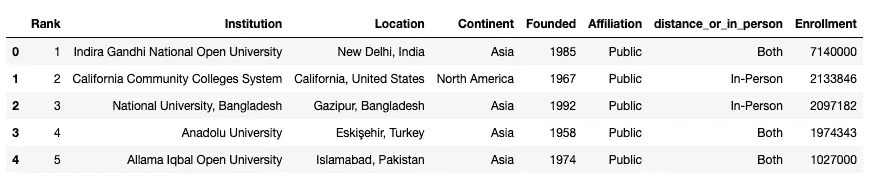

现在，你会看到更新后的列只包含三个可能的值，我们可以再次调用`value_counts`来得到我们最初问题的答案：

```py
df["distance_or_in_person"].value_counts()
```

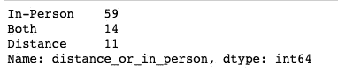

现在我们知道，根据清理后的数据，有 59 所大学只提供面对面出席。

有了这个新条件，如果你想知道哪些具体的机构提供面对面的出席，我们可以再次使用`loc`方法过滤 DataFrame，然后使用`tolist`方法将所有值获取为 Python 列表：

```py
df.loc[df["distance_or_in_person"] == "In-Person"]["Institution"].tolist()
```

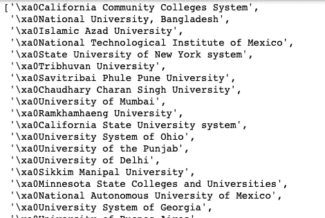

现在我们有一个机构列表，但是有一些特殊字符可以去掉。在 Python 中，“\xa0”代表不间断空格，这意味着我们可以使用 Pandas 中的`strip`方法来去掉它，该方法可以去掉字符串值两端的空格。

我们可以编辑我们最初的`tolist`代码，以清理最终的输出，就像这样：

```py
df.loc[df["distance_or_in_person"] == "In-Person"]["Institution"].str.strip().tolist()
```

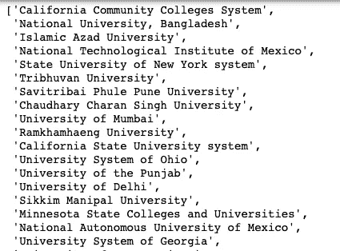

现在，我们有了一个只提供面对面出席的大学最终列表！

## **最古老和最新成立的大学之间的年份范围是多少？**

接下来，让我们使用`loc`和其他几个原生 Pandas 方法来过滤 DataFrame，以回答特定的数据分析问题。

我们首先看一下成立列，看看我们要处理的是什么：

```py
df["Founded"]
```

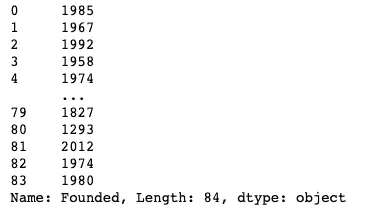

看起来我们有一列只包含年份值。由于我们想要将日期进行比较，我们可以将该列转换为`datetime`类型，以便进行更轻松的分析。

```py
pd.to_datetime(df["Founded"])
```

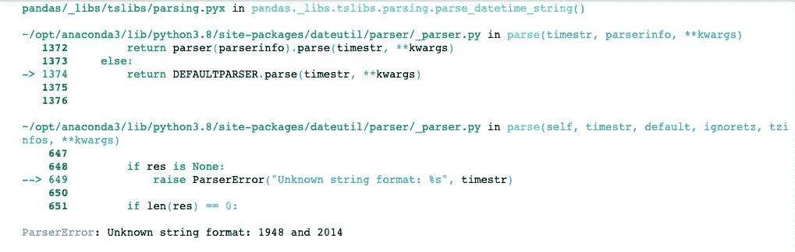

然而，在该列上使用`to_datetime`方法会导致`ParserError`。

看起来有一个字符串与我们最初从成立列中看到的不匹配。我们可以使用`loc`方法检查行，以便在值为`ParserError`的成立列上过滤 DataFrame：

```py
df.loc[df["Founded"] == "1948 and 2014"]
```

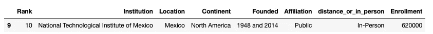

显然有一所大学有两个不同的成立年份。现在我们知道了行（9）的索引，还有一个使用`loc`方法在特定索引值上过滤 DataFrame 的示例：

```py
df.loc[9]
```

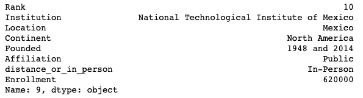

看起来这是 DataFrame 中唯一一行，其中“成立”列的值不止一个年份。

根据你想要对数据做什么，你可以尝试通过选择一个年份（第一个成立日期）或者通过为这个机构创建两行数据，使得两个成立日期分别在不同的行上来清理数据。

在这种情况下，由于我们只是为了回答一个简单的问题（这个数据集中机构的成立日期范围是多少），我们可以像这样删除这一行：

```py
df.drop(9).head(10)  # removing the row
```

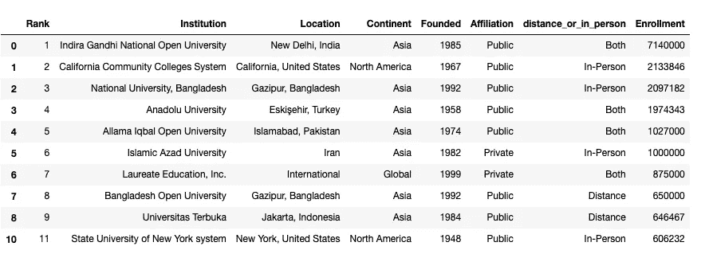

检查结果 DataFrame，你会发现索引为“9”的行，其成立日期列有多个值，已经不再存在于表中。你可以通过在删除行后重新分配 DataFrame 来使删除生效：

```py
df = df.drop(9)
```

接下来，我们可以再次对成立日期列使用`to_datetime`方法，看看会发生什么。

```py
pd.to_datetime(df["Founded"], errors="coerce")
```

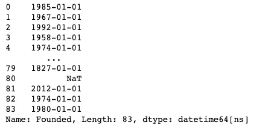

实际上，在这里还会出现另一个错误，这就是为什么我包含了`errors="coerce"`，以确保如果将字符串转换为日期时间类型时出现任何其他问题，该值将变为 null。

最后，我们可以将成立日期列的日期时间类型版本分配给一个新列。然后，要检查机构的最早成立日期，我们可以使用 Python 中的`min`方法：

```py
df["founded_date"] = pd.to_datetime(df["Founded"], errors="coerce")
min(df["founded_date"])
```

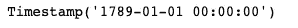

你可以使用 min 和 max 方法来查看`founded_date`列的最早和最晚时间戳，以获取最古老和最新的大学之间的年份范围。

就在这里，我意识到如果我们只需要回答一个快速的问题，我们可以更快地完成所有这些工作。我们可以将列转换为整数类型，然后将最大值和最小值相减，得到范围。

```py
df["Founded"] = df["Founded"].astype("int")
max(df["Founded"]) - min(df["Founded"])
```

这将输出 719。

在某些情况下，你不应该总是采取简单的方法，只是将年份列转换为整数。当你想要进行一些更复杂的分析或者当你专门处理时间序列日期时，如果你正确清理数据并将日期列转换为日期时间类型，那么会增加很多附加值。然而，如果你只需要快速进行分析，那么简单地找到解决问题的最快方法而不是“最佳”方法，可以节省你的时间和麻烦。

有许多不同的方法可以结合使用 Pandas 方法来清理和分析日期数据。`loc`方法是多功能的，允许您将不同的方法组合在一起，以过滤、切片和更新 DataFrame，使其适用于您想要解决的特定问题和问题。

清理数据是一个与探索数据相辅相成的迭代过程。希望这些使用`loc`的示例对你今后的分析有所帮助。

如果你喜欢我的内容，请考虑关注我，并使用下面的推荐链接**注册成为 Medium 会员**。每月只需 5 美元，你就可以无限制地访问 Medium 上的所有内容。使用我的链接注册让我能够获得一小笔佣金。如果你已经注册并关注了我，非常感谢你的支持！

[](https://byrondolon.medium.com/membership?source=post_page-----880a068869df--------------------------------) [## 使用我的推荐链接加入 Medium —— Byron Dolon

### 作为 Medium 会员，你会员费的一部分将会给你阅读的作家，而你将获得对每个故事的完整访问权限…

[byrondolon.medium.com](https://byrondolon.medium.com/membership?source=post_page-----880a068869df--------------------------------)

> **更多我的文章：** *-* [*3 Efficient Ways to Filter a Pandas DataFrame Column by Substring*](https://medium.com/towards-artificial-intelligence/3-efficient-ways-to-filter-a-pandas-dataframe-column-by-substring-fc2993692141) *-* [*5 Practical Tips for Aspiring Data Analysts*](https://byrondolon.medium.com/5-practical-tips-for-aspiring-data-analysts-9917006d4dae?sk=019edbddaca4d313665caafe4b747d26) *-* *Improving Your Data Visualizations with Stacked Bar Charts in Python* *- C**onditional Selection and Assignment With .loc in Pandas* *-* *5 (and a half) Lines of Code for Understanding Your Data with Pandas*
