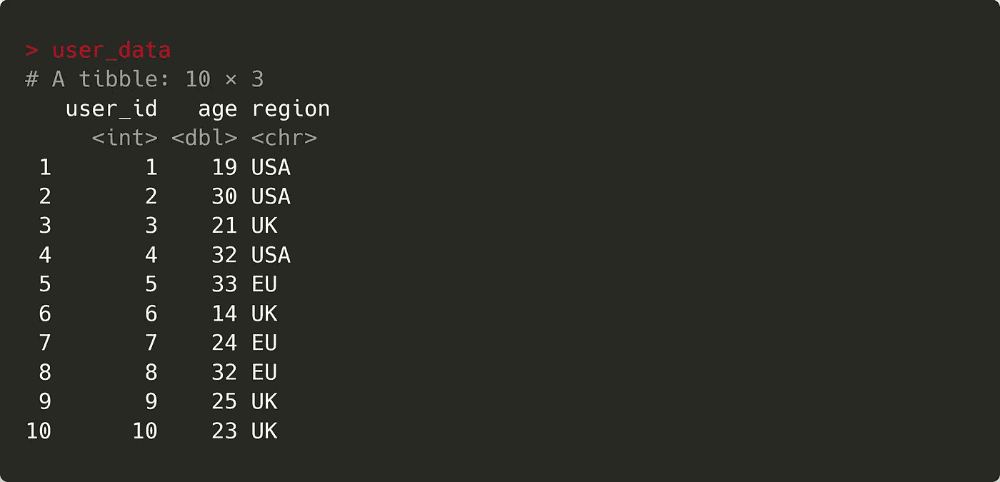
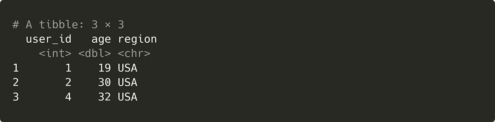
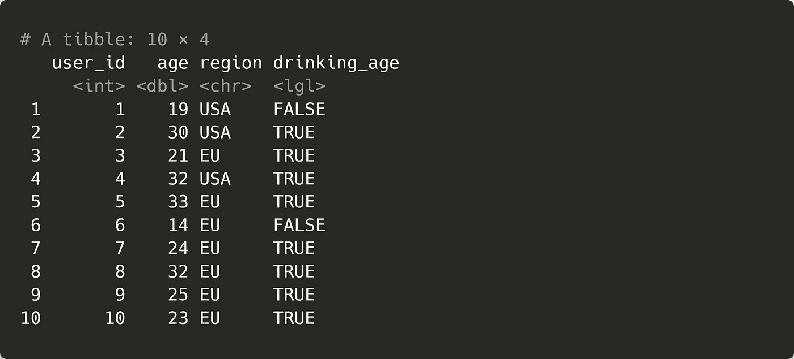

# 如何在 R 中编写条件语句：四种方法

> 原文：[`towardsdatascience.com/how-to-write-conditional-statements-in-r-four-methods-f9bedbae0683?source=collection_archive---------10-----------------------#2023-06-13`](https://towardsdatascience.com/how-to-write-conditional-statements-in-r-four-methods-f9bedbae0683?source=collection_archive---------10-----------------------#2023-06-13)

## 了解超越 if-else 语句的强大方法，提高你的 R 代码水平

[](https://roryspanton.medium.com/?source=post_page-----f9bedbae0683--------------------------------)[](https://towardsdatascience.com/?source=post_page-----f9bedbae0683--------------------------------) [Rory Spanton](https://roryspanton.medium.com/?source=post_page-----f9bedbae0683--------------------------------)

·

[关注](https://medium.com/m/signin?actionUrl=https%3A%2F%2Fmedium.com%2F_%2Fsubscribe%2Fuser%2F39501aa8ce39&operation=register&redirect=https%3A%2F%2Ftowardsdatascience.com%2Fhow-to-write-conditional-statements-in-r-four-methods-f9bedbae0683&user=Rory+Spanton&userId=39501aa8ce39&source=post_page-39501aa8ce39----f9bedbae0683---------------------post_header-----------) 发布于 [Towards Data Science](https://towardsdatascience.com/?source=post_page-----f9bedbae0683--------------------------------) ·8 分钟阅读·2023 年 6 月 13 日[](https://medium.com/m/signin?actionUrl=https%3A%2F%2Fmedium.com%2F_%2Fvote%2Ftowards-data-science%2Ff9bedbae0683&operation=register&redirect=https%3A%2F%2Ftowardsdatascience.com%2Fhow-to-write-conditional-statements-in-r-four-methods-f9bedbae0683&user=Rory+Spanton&userId=39501aa8ce39&source=-----f9bedbae0683---------------------clap_footer-----------)

--

[](https://medium.com/m/signin?actionUrl=https%3A%2F%2Fmedium.com%2F_%2Fbookmark%2Fp%2Ff9bedbae0683&operation=register&redirect=https%3A%2F%2Ftowardsdatascience.com%2Fhow-to-write-conditional-statements-in-r-four-methods-f9bedbae0683&source=-----f9bedbae0683---------------------bookmark_footer-----------)

照片由 [Caleb Jones](https://unsplash.com/@gcalebjones?utm_source=medium&utm_medium=referral) 提供，刊登于 [Unsplash](https://unsplash.com/?utm_source=medium&utm_medium=referral)

编程中离不开条件语句。

条件语句根据真假条件的结果执行代码。它们是编码的基本部分，这在 R 中尤为重要。无论你是使用 R 进行数据分析、机器学习、软件开发还是其他用途，条件语句都有无限的应用。

不过，大多数 R 的初学者并没有意识到有很多种方式来编写这些语句。许多人学习基本的 if-else 语句后就停下了。但通常有更简洁、更高效的方式来编写条件语句。高级 R 程序员知道这些技巧的每一种及其使用时机。那么，你如何能学会这样做呢？

在本文中，我们将探讨四种不同的方式来编写 R 中的条件语句。我们还将介绍每种技术的优缺点，以及何时使用每种技术。

# 如何在 R 中编写 if-else 语句

在 R 中编写条件语句最直接的方法是使用 `if` 和 `else` 关键字。如果你已经了解另一种编程语言，这将是最熟悉的方式，而且通常是新 R 用户最先学习的技术。

标准的 if 语句在 R 中如下所示：

```py
if (condition) {
  # Code to execute
}
```

在这里，`condition` 是一个逻辑表达式，它返回 `TRUE` 或 `FALSE`。如果条件返回 `TRUE`，大括号内的任何代码都会被执行。如果返回 `FALSE`，大括号内的代码不会被执行，R 将继续执行脚本中的下一行代码。

为了了解实际操作，我们可以考虑以下示例。

```py
age <- 25

if (age >= 18) {
  age_group <- "adult"
}
```

在这里，我们有一个包含年龄的变量。if 语句接着评估 `age` 的值是否大于或等于 18。由于在这种情况下成立，因此变量 `age_group` 的值为 `“adult”`。

这是一种检查简单条件并在条件为真时执行某些操作的简单方法。但是如果我们希望语句在条件为假时运行一些代码呢？

If else 语句是基本 if 语句的扩展。要理解它们，我们可以在之前的例子基础上进行扩展。

```py
if (age >= 18) {
  age_group <- "adult"
} else {
  age_group <- "child"
}
```

这段代码的工作原理与上一个示例类似，有一个例外。与条件为 `FALSE` 时继续执行不同，`else` 后面的大括号内的代码会被执行。这意味着如果 `age` 大于或等于 18，`age_group` 被赋值为 `“adult”`。否则，`age_group` 被设置为 `“child”`。

If-else 语句是控制 R 脚本中代码的直接方式。它们易于理解，可以扩展到处理多个条件，并且能够执行许多行的复杂代码。

不过，if-else 语句可能占用很多空间。对于像上面那样的简单表达式，还有其他方式可以完成完全相同的操作，而不需要五行代码。

实际上，可以使用一行代码编写 if-else 语句。

# R 中的内联条件语句

内联条件语句是一种在单行代码中表达“if-else”逻辑的简洁方式。有几种方法可以编写它们。

## 内联 if else 语句

首先，可以使用 `if` 和 `else` 关键字编写一个简单的内联语句。其形式如下：

```py
age_group <- if (age >= 18) "adult" else "child"
```

这个语句的工作方式与之前的示例相同。唯一的不同是现在我们将短语浓缩到一行。如果条件为 `TRUE`，`age_group` 的值会更新为 `else` 关键字之前的值——在这种情况下是 `“adult”`。如果条件为 `FALSE`，`age_group` 将被分配 `else` 之后的值。

这里的最大区别在于我们现在将整个条件语句的结果分配给变量 `age_group`。这改进了标准 if-else 示例中的重复短语，在那里我们需要写两次这种分配。

## Base-R ifelse 函数

如果你愿意，可以使用 `ifelse` 函数。下面的代码使用该函数执行与之前示例相同的逻辑。

```py
age_group <- ifelse(age >= 18, "adult", "child")
```

`ifelse` 函数接受三个参数。首先是条件，然后是条件为真时返回的值，以及条件为假时返回的值。

这是一种简洁、直接的编写简短条件语句的方法。它还有另一个优点；它是矢量化的。

[](/make-your-r-code-10x-faster-vectorization-explained-in-3-minutes-9eb4cdd7a49e?source=post_page-----f9bedbae0683--------------------------------) ## 让你的 R 代码快 10 倍：3 分钟解释矢量化

### 向慢速、杂乱的循环说再见

[towardsdatascience.com

矢量化是 R 中一个重要的概念。如果一个函数是矢量化的，它会自动应用于多个值，而不仅仅是一个。要查看 `ifelse` 函数的示例，我们可以给变量 `age` 分配更多的值，然后再次运行代码。

```py
age <- c(16, 45, 23, 82)

age_group <- ifelse(age >= 18, "adult", "child")
# Returns "child" "adult" "adult" "adult"
```

`ifelse` 函数会自动评估 `age` 中的所有值，返回一系列相应的输出。这使得 `ifelse` 成为评估大量简单条件的一种简洁方式，而不需要慢速、杂乱的循环。

# R 中的条件索引

尽管 `ifelse` 可以轻松地评估许多输入，但还有其他方法可以实现这一点。

[索引](https://rspatial.org/intr/4-indexing.html) 允许 R 程序员访问包含多个值的数据结构的特定部分。例如，如果我们想获取上一个示例中向量 `age` 的第三个元素，我们可以在方括号内用 3 对 `age` 进行索引：

```py
age <- c(16, 45, 23, 82)

age
# Returns 16, 45, 23, 82

age[3]
# Returns 23
```

使用数字来索引具有特定位置的值是最常见的，如上面的代码所示。但是，许多初学者 R 程序员不知道你也可以在索引时使用逻辑条件。这开启了各种可能性。

让我们创建一些示例数据来说明这些选项。这些数据包含关于用户的信息，如年龄，与之前的示例类似。但是，与存储在向量中的不同，每个用户的信息是按行存储在 tibble 中的。这是一种你在处理专业环境中的用户数据时可能会遇到的数据结构，因此了解如何应用条件逻辑是有用的。

```py
set.seed(123)

user_data <- tibble(
  user_id = 1:10,
  age = floor(runif(10, min = 13, max = 35)),
  region = sample(c("UK", "USA", "EU"), 10, replace = TRUE)
)
```



上述代码创建的数据。

Tibbles 和数据框是由向量组成的，这意味着我们可以用相同的方式对其进行索引。这使我们能够做各种事情。

## 根据条件提取列中的值

这里有段代码提取了 `user_id` 列中用户年龄低于 18 岁的所有值。

```py
user_data$user_id[user_data$age < 18]
# Returns 6
```

## 根据条件替换列中的值

这是如何将区域列中的所有“UK”行重新编码为“EU”。

```py
user_data$region[user_data$region == "UK"] <- "EU"
```


上述代码的结果是，“UK”区域值已被替换为“EU”。

## 使用条件索引过滤数据集

我们甚至可以使用条件子集来过滤整个数据集。这是一种过滤所有“USA”区域行的方法。请注意，在这里的逻辑条件后，我们添加了一个逗号，以告诉 R 我们按行索引。如果我们想按列过滤，可以在逗号后添加一个条件。

```py
user_data[user_data$region == "USA",]
```



上述代码的结果。

这些只是 R 中条件索引的一些应用。如果你需要对数据进行快速的条件操作，这种方法很可能有一个一行解决方案。

# Tidyverse case_when 函数

`case_when` 函数来自 tidyverse 包家族。这是另一种在多个值集上应用条件语句的方法，在处理数据集时再次显示出其重要性。

我们可以使用最后一个示例中的数据来展示如何使用 `case_when` 根据条件语句创建新列。

```py
user_data %>%
  mutate(drinking_age = case_when(region == "USA" & age >= 21 ~ TRUE,
                                  region == "EU" & age >= 18 ~ TRUE,
                                  .default = FALSE))
```



上述代码的结果是，包含新列“drinking_age”。

这段代码根据用户的年龄和地点确定我们网站用户是否被法律允许饮酒。这里，每个条件都在 `case_when` 语句中的不同一行。如果条件为真，我们可以在波浪符号 (~) 后返回一个值——在这个例子中是 `TRUE`。如果没有满足任何条件，返回的值由 `.default` 设置指定。所有值都存储在一个新的列 `drinking_age` 中。

如果这看起来有点陌生，这里是等效的 if else 语句：

```py
if (region == "USA" & age >= 21) {
  drinking_age <- TRUE
} else if (region == "EU" & age >= 18) {
  drinking_age <- TRUE
} else {
  drinking_age <- FALSE
}
```

与上述代码相比，很容易看出 `case_when` 提供了另一种实现条件语句的方式，这种方式比 if-else 语句更简洁，同时同样强大。它现在是我在基于复杂逻辑或多个条件创建新列时的首选。对于 tidyverse 用户来说，这是一个必须采用的功能。

# 何时使用不同类型的条件语句

我所介绍的方法只有在你将它们应用到自己的代码中时才会真正展现出光彩。只有通过尝试新的方法并使之变得熟练，你才能充分发挥它们的好处，并实现 R 编程的流畅性。

那么，什么时候应该使用每种类型的条件语句呢？

与编程中的任何方法选择一样，没有绝对的答案。不过，这里有一些我用来帮助我选择不同写法的粗略指南。

+   如果我在解决一个需要在特定条件下执行大量复杂的多行代码的问题时，我通常会选择 if-else 语句。在这些情况下，使用其他方法往往会变得混乱且难以维护。

+   对于条件更简单且返回的代码块较短的问题，我喜欢使用内联的 if-else 语句。没有必要让一个简单的解决方案变得比需要的更长！

+   如果在处理数据集或基于条件创建列时，我使用 `case_when`。它与我使用的其他 tidyverse 函数配合良好，且易于调试和维护。

+   如果我在处理数据集并且不想加载额外的包，我会使用条件索引。这不需要任何额外的依赖项，且通常运行得很快。

我的建议？尝试一下每种技术，看看哪种适合你。至少，你可能会学到一种新的改进代码的方法。

所以，**如果**你喜欢这篇文章，为什么不分享一下你最喜欢的条件语句呢？**否则……** 无论如何，感谢你看到最后！
