# 如何为 ChatGPT（GPT-4）和其他语言模å‹ç¼–写专家æ示

> åŸæ–‡ï¼š[`towardsdatascience.com/how-to-write-expert-prompts-for-chatgpt-gpt-4-and-other-language-models-23133dc85550`](https://towardsdatascience.com/how-to-write-expert-prompts-for-chatgpt-gpt-4-and-other-language-models-23133dc85550)

## ä¸ LLMs 一起进行æ示工程的适åˆåˆå­¦è€…的指å—

[](https://nabil-alouani.medium.com/?source=post_page-----23133dc85550--------------------------------)[](https://towardsdatascience.com/?source=post_page-----23133dc85550--------------------------------) [Nabil Alouani](https://nabil-alouani.medium.com/?source=post_page-----23133dc85550--------------------------------)

·å‘表在[Towards Data Science](https://towardsdatascience.com/?source=post_page-----23133dc85550--------------------------------) ·阅读 63 分钟·2023 å¹´ 11 月 1 æ—¥

--


作者通过 Midjourney æ供的图片。

æ示工程是一ç§èŠ±å“¨çš„说法，æ„æ€æ˜¯â€œä¸º AI 模å‹ç¼–写更好的指令，直到它完全按照你的è¦æ±‚执行â€ã€‚

编写æ示有点åƒéª‘自行车。你ä¸éœ€è¦åœ¨æœºæ¢°ç‰©ç†å­¦ä¸Šæœ‰åšå£«å­¦ä½æ‰èƒ½å­¦ä¼šä¿æŒå¹³è¡¡ã€‚一点ç†è®ºå¯ä»¥å¸®åŠ©ï¼Œä½†æœ€é‡è¦çš„部分是åå¤è¯•éªŒã€‚

把这个指å—看作是为骑 AI 自行车åšå‡†å¤‡çš„“一点ç†è®ºâ€ã€‚你会找到一系列技术，包括解释ã€ç¤ºä¾‹å’Œæ¨¡æ¿ï¼Œä½ å¯ä»¥åœ¨ä½ å–œæ¬¢çš„模å‹ä¸Šè¿›è¡Œæµ‹è¯•ã€‚

本指å—侧é‡äº ChatGPT（GPT-4），但下é¢åˆ†äº«çš„æ¯ä¸€ç§æŠ€æœ¯éƒ½é€‚用äºå…¶ä»–大å‹è¯­è¨€æ¨¡å‹ï¼ˆLLMs），如 Claude å’Œ LLaMA。

# 目录

```py
 What's in this guide?

💡 Why should you care about Prompt Engineering?
💡 Why prompt is engineering harder than you think?
💡 You don't need prompt ideas, you need problems
💡 Watch out for AI hallucinations

🟢 The Basics of Prompting 
🟢 Specify the context (also called "Priming")
🟢 Specify the desired format
🟢 Use <placeholders>
  ∘ How to use placeholders as parameters
  ∘ How to use placeholders as instructions
🟢 Specify the style/tone
🟢 Specify the length of the desired response
🟢 Specify the target audience
🟢 Many-Examples Prompting
🟢 Temperature Control
🟢 Zero-Shot Prompting (no examples)
🟢 Few-Shot Prompting (several high-quality examples)
🟢 Zero-Shot/Few-Shot - The simple version

💡 In-context Learning vs. Chat History

🟡 Chain of Thought Prompting
  ∘ Zero-Shot Chain of Thought
  ∘ Few-Shot Chain of Thought
🟢 Role Prompting
🟢 Knowledge Generation Prompting
  ∘ Knowledge Generation Prompting and ChatGPT Plugins
🟠 Knowledge Integration Prompting* 
  ∘ Knowledge Integration* and Microsoft Edge
🟠 Directional Stimulus (DS) Prompting 
🟡 Recursive Criticism and Improvement (RCI) Prompting
🟡 Self-Refinement Prompting
🟡 Reverse Prompt Engineering
🟡 Prompt Revision
🟡 Program Simulation Prompting
🟠 All-In-One (AIO) Prompting*
🟢 Template for All-In-One (AIO) Prompting
🟢 More examples of All-In-One Prompting*
  ∘ Dolores, the Email Muse
  ∘ Robert Ford, the Coding Master
  ∘ Lee Sizemore, the Outlandish Chef
  ∘ Maeve the Mastermind

💡 Iterate until you have to revert
💡 With great power…

Conclusion

References (in no particular order)

Contact section
```

## å…责声æ˜ï¼š

尽管本指å—åå‘äº ChatGPT，但我并没有个人利益æ¥æ¨å¹¿è¿™ä¸ªäº§å“。我没有得到 OpenAIã€å¾®è½¯æˆ–其他任何人的èµåŠ©ã€‚

# 这个指å—包括什么内容？

本指å—包括七个“好好知é“â€éƒ¨åˆ†å’Œè¶…过 25 ç§æ示工程技术。æ¯ä¸ªéƒ¨åˆ†éƒ½ä»¥ä¸€ä¸ªå›¾æ ‡å¼€å¤´ï¼Œè¡¨ç¤ºå…¶ç±»å‹ï¼Œå¦‚下所示：

+   💡 “好好知é“â€éƒ¨åˆ†ã€‚

+   🟢 适åˆåˆå­¦è€…的技术。

+   🟡 中级技术。

+   🟠 高级技术。

“好好知é“â€éƒ¨åˆ†æ供了在编写æ示时è¦è®°ä½çš„具体è¦ç‚¹ã€‚适åˆåˆå­¦è€…的技术å¯ä»¥ç«‹å³ä½¿ç”¨ã€‚中级和高级技术需è¦å‡†å¤‡å’Œä¸€ç‚¹è€å¿ƒã€‚

指å—中讨论的所有技术都æ¥æºäº AI 研究论文和第一手ç»éªŒã€‚引用和直æ¥é“¾æ¥å¯åœ¨æŒ‡å—末尾找到。有两ç§æŠ€æœ¯æˆ‘é‡æ–°å‘½å，以便记忆。它们用星å·æ ‡è®°ï¼Œå°±åƒè¿™æ ·*。

æ¯ä¸ªæ示的格å¼å¦‚下：

```py
**[Title of the prompt]** 

**Prompt content:** Content of the prompt that sometimes includes <placeholders>.
<placeholders> are a tool you use to make better prompt templates.

(Comments that are not part of the prompt are written between parenthesis like this) 

## (The two hashtags separate the same prompt into two or more sections)

--- (The three dashes separate examples inside the same prompt)

*** (The three stars separate two different prompts or two different outputs)

*** ChatGPT's output**: (When it's relevant, you'll see the response to ChatGPT written like this)
```

这里有一个例å­ï¼š

```py
**[Examples of a simple prompts]** 

**Prompt example #1:** Act as an independant analyst who specializes in <field_1> and <field_2>.
Search the internet for the pros and cons of soy milk.

Use 5 bullet points for pros and 5 bullet points for cons.
Browse at least 6 different sources and cite each one of them in your analysis.

##

<field_1>: Food industry
<field_2>: Nutrition

***

**Prompt example #2:** Explain the five love languages as if you're talking to a 16-year-old.

##

**Desired format:**
Introduction.
- Love language #1: explanation and example.
- Love language #2: explanation and example.
- Love language #3: explanation and example.
- Love language #4: explanation and example.
- Love language #5: explanation and example.
Conclusion.
```

# 💡 为什么你应该关心æ示工程？

生æˆå¼ AI 继续进入我们æ¯å¤©ä½¿ç”¨çš„æ¯ä¸ªæ•°å­—工具中，如网络æµè§ˆå™¨ã€ç¤¾äº¤åª’体应用甚至 PowerPoint 演示文稿。语言模å‹è¶Šå¥½ï¼Œæˆ‘们就会越多地使用它们。

æ示工程是我们用æ¥ä¸ AI 模å‹äº¤äº’以完æˆè¶Šæ¥è¶Šå¤šä»»åŠ¡çš„语言。

把近期未æ¥æƒ³è±¡æˆä¸€ä¸ªå¤–国国家。你知é“你将在那里生活几年，但你ä¸ä¼šè¯´å½“地的语言。æ¯æ¬¡ä½ è´­ä¹°é£Ÿå“ã€é¢„订旅行或谈判交易时，你都必须雇佣人æ¥æ›¿ä½ è¯´è¯ã€‚

å¬èµ·æ¥æ•ˆç‡ä½ä¸‹ä¸”ä¸å¥½ç©ï¼Œä¸æ˜¯å—？

ç°åœ¨æƒ³è±¡ä¸€ä¸‹ï¼Œåœ¨ä½ æ¬åˆ°è¿™ä¸ªå¤–国国家之å‰ï¼Œä½ å¯ä»¥å­¦ä¹ å½“地的语言。ä¸å…¶é›‡ä½£ä¼šè¯´ AI 语言的人，你学会写æ示。选择åˆé€‚çš„è¯è¯­ï¼ŒAI 将给你想è¦çš„东西——无论是电å­é‚®ä»¶ã€ä»£ç è¿˜æ˜¯æœˆåº¦æŠ¥å‘Šã€‚

但是等等，你å¯èƒ½ä¼šè¯´ã€‚æ示工程ä¸æ˜¯æ³¨å®šè¦æ¶ˆå¤±å—？

å¯èƒ½æ˜¯çš„，因为目标是使人类更容易使用 AI 系统。也许在未æ¥ï¼Œæ··ä¹±çš„语音æ示就足以创造你想象的任何东西。我们甚至å¯èƒ½å¼€å‘出能够å®æ—¶è¯»å–ä½ çš„æ€ç»´çš„ AI。

在这些情况下，æ示工程æˆä¸ºä¸€ç§ä¸´æ—¶æŠ€èƒ½ã€‚一旦 AI 能够根æ®ä¸å®Œæ•´çš„å¥å­å’Œè„‘电信å·çŒœæµ‹äººç±»æ„图，它将å˜å¾—过时。

ä½ å¯ä»¥ç­‰å¾…è¿™ç§æƒ…况å‘生，或者你å¯ä»¥æå‰å¼€å§‹ã€‚

# 💡 为什么æ示工程比你想象的更难？

简短的答案是“一ç§è½»æ¾çš„错觉â€ã€‚

ç”±äºæˆ‘们使用自然语言编写æ示，我们ä¸è®¤ä¸ºå®ƒæ˜¯ä¸€é¡¹éœ€è¦ç»ƒä¹ çš„å¤æ‚技能。你所è¦åšçš„就是用简å•çš„英语写出指令，对å—？

嗯，ä¸å®Œå…¨æ˜¯è¿™æ ·ã€‚

是的，当你ä¸äººç±»äº¤è°ˆæ—¶ï¼Œä½ ä¼šä»¥ä¸æ示 AI 相åŒçš„æ–¹å¼æ示他们。人类和 AI 都使用内部模å‹æ¥å›åº”ä½ çš„æ示。åªæ˜¯äººç±»å’Œ AI 系统对ç°å®æœ‰ä¸åŒçš„模å‹ã€‚

人类模å‹ä¾èµ–äºè®¤çŸ¥èƒ½åŠ›ã€è¿‡å»çš„ç»éªŒã€ç†è®ºçŸ¥è¯†å’Œå®æ—¶æ„Ÿå®˜æ•°æ®ã€‚而语言模å‹åˆ™ä»…ä¾èµ–äºè¯­è¨€æ¨¡å¼ã€‚

ä½ å¯ä»¥è¯´äººç±»è½¯ä»¶å’Œ AI 软件è¿è¡Œåœ¨ä¸åŒçš„æ“作系统上。

所以当你ä¸è¯­è¨€æ¨¡å‹äº¤äº’时，就好åƒä½ åœ¨ä¸ä¸€ä¸ªå¤–星人交互。当然，这个外星人会å›åº”你的自然语言，但它的行为方å¼ä¸äººç±»ä¸åŒï¼Œè¿™æ„味ç€ä½ éœ€è¦è°ƒæ•´ä½ çš„æ示。

ä¸äººç±»ç›¸æ¯”，AI 系统需è¦æ›´å¤šç»†èŠ‚ã€ç²¾ç¡®çš„解释ã€æ¸…晰的指示和一些é‡å¤ã€‚你希望æ¯ä¸ªå†™å‡ºçš„è¯éƒ½æ˜¯æœ‰æ„义的，就åƒä½ åœ¨ç¼–写代ç ä¸€æ ·ã€‚

“英语作为一ç§ç¼–程语言â€çš„类比在考虑一个至关é‡è¦çš„细节之å‰æ˜¯å®Œç¾çš„。ä¸ä»£ç ä¸åŒï¼Œæ¯ä¸ªæ示都会得到å›åº”，无论其质é‡å¦‚何。å³ä½¿åŒ…å«æ‹¼å†™é”™è¯¯å’Œä¸æ¸…æ™°å¥å­çš„æ示也会产生*æŸç§ä¸œè¥¿*。相比之下，ä¸æ­£ç¡®çš„代ç ä¸ä¼šäº§ç”Ÿä»»ä½•ä¸œè¥¿ï¼ˆé™¤äº†ä»¤äººæ²®ä¸§çš„错误消æ¯ï¼‰ã€‚

è¿™ç§æ€»æ˜¯äº§ç”Ÿç»“æœçš„特性使得轻æ¾çš„错觉更加强烈。混乱的æ示也会产生结æœï¼Œé‚£ä¹ˆä¸ºä»€ä¹ˆè¦è´¹å¿ƒæ”¹è¿›å®ƒä»¬å‘¢ï¼Ÿ

一般的 AI 用户ä¸è§‰å¾—有必è¦æ高他们的æ示工程技能，所以他们错误地认为这是一件容易的事情。

在æŸç§ç¨‹åº¦ä¸Šï¼Œæ示工程就åƒè·³èˆã€‚你在 TikTok 上看了一个专业èˆè€…演示了一些嘻哈èˆæ­¥çš„教程，你会觉得“哦，这其å®å¾ˆå®¹æ˜“ï¼â€

注æ„这一举动看起æ¥å¤šä¹ˆå®¹æ˜“。

但是一旦你å°è¯•é‡ç°é‚£äº›â€œå®¹æ˜“的步骤â€ï¼Œä½ ä¼šæ„识到你的身体有自己的物ç†è§„律。çªç„¶é—´ï¼Œä¸€è¾¹ç§»åŠ¨èº«ä½“，一边挥èˆç€æ‰‹è‡‚ä¼¼ä¹æ˜¯ä¸å¯èƒ½çš„。

å°±åƒè·³èˆä¸€æ ·ï¼Œæ示工程比看起æ¥æ›´éš¾ï¼Œä½†æ¯å†™ä¸€ä¸ªæ示都会å˜å¾—更容易。

# 💡 ä½ ä¸éœ€è¦æ示的想法，你需è¦é—®é¢˜

最好的æ示æ¥è‡ªå¥½çš„想法，而好的想法æºäºæœ‰è¶£çš„问题。以下是一个简å•çš„框æ¶ï¼Œä½ å¯ä»¥ç”¨å®ƒæ¥æ‰¾åˆ°å€¼å¾—解决的问题：

+   列出你在计算机上进行的所有任务（工作或其他）。

+   分离需è¦æ–‡æœ¬åˆ†æå’Œ/或撰写的任务。

+   æ述你希望ä»æ¯ä¸ªä»»åŠ¡ä¸­å®ç°çš„结æœã€‚

**有用问题的例å­ï¼š** “æ¯ä¸ªæ˜ŸæœŸä¸€ï¼Œæˆ‘å‘客户æ交上周è¿è¡Œçš„æ¯ä¸ªå¹¿å‘Šçš„绩效报告。我需è¦è¯„论æ¯ä¸ªå…³é”®ç»©æ•ˆæŒ‡æ ‡ï¼ˆKPI），以便é专业人士更容易ç†è§£æ•°æ®ã€‚â€

**æ示如何帮助：** 撰写æ¯ä¸ªæ交的 KPI çš„æ示。è¦æ±‚ä½ çš„ AI 模å‹ä½¿ç”¨è®²æ•…事的技巧和有趣的类比，使报告更轻æ¾æ˜“懂。

# 💡 å°å¿ƒ AI 幻觉

无论你选择哪ç§æ¨¡å‹ï¼Œè®°ä½èŠå¤©æœºå™¨äººç»å¸¸ä¼šäº§ç”Ÿå¹»è§‰ï¼Œå†™å‡ºäº‹å®é”™è¯¯çš„ä¿¡æ¯ã€‚è¿™ç§è¡Œä¸ºæºè‡ª LLMs 在巨大的数æ®é›†ä¸Šè®­ç»ƒï¼Œè¿™äº›æ•°æ®é›†å……满了逻辑错误和胡言乱语。

基äºäººç±»å馈的微调和强化学习（RLHFï¼‰æœ‰åŠ©äº LLMs å‡å°‘ä¸å‡†ç¡®æ€§å’Œåè§ï¼Œä½†ä»ç„¶å­˜åœ¨æ¼æ´ã€‚

我在其他文章中已ç»å¯¹å¹»è§‰é—®é¢˜è¿›è¡Œäº†ä¸€äº›å°è¯•ã€‚ä½ å¯ä»¥åœ¨ä¸‹é¢æ‰¾åˆ°é“¾æ¥ã€‚ç°åœ¨ï¼Œè¿™é‡Œæ˜¯ä¸€ä¸ªé¢„览：

> ä½ å¯èƒ½è®¤ä¸ºèŠå¤©æœºå™¨äººé»˜è®¤ä¼šè¯´å®è¯ï¼Œæœ‰æ—¶å€™ä»–们会产生幻觉。但更准确地说，èŠå¤©æœºå™¨äººå†™å‡ºçº¯ç²¹çš„胡说八é“，有时候ä¸ç°å®ç›¸åŒ¹é…。
> 
> 通过“胡说八é“â€ï¼Œæˆ‘ä¸æ˜¯æŒ‡æˆ‘们用æ¥æè¿°æ— æ„义的俚语，而是哈里·弗兰克ç¦æ出的一个哲学定义。
> 
> 哈里·弗兰克ç¦ç‰¹å°†èƒ¡è¯´å…«é“æ述为ä¸ç°å®æ²¡æœ‰å…³ç³»çš„ä¿¡æ¯ã€‚当你撒è°æ—¶ï¼Œä½ æ‰­æ›²äº†ç°å®ã€‚当你说真è¯æ—¶ï¼Œä½ æ述了你对ç°å®çš„表达。但是当你胡说八é“时，你编造了一些ä¸ç°å®æ— å…³çš„东西。
> 
> *“正是这ç§ä¸çœŸç›¸å…³è”的缺ä¹è¿æ¥â€”—* ***对事物真å®æƒ…况的漠ä¸å…³å¿ƒ*** *——我认为是胡说八é“的本质。â€*
> 
> *这指å‘了胡说八é“的一个类似而基本的方é¢ï¼š* ***尽管它是在ä¸å…³å¿ƒçœŸç›¸çš„情况下产生的，但它ä¸ä¸€å®šæ˜¯é”™è¯¯çš„****。â€*
> 
> *—* [*《胡说八é“》哈里·弗兰克ç¦ç‰¹è‘—*](https://www.goodreads.com/author/quotes/219.Harry_G_Frankfurt) *[Emphasis mine].*

语言模å‹æ˜¯é«˜åº¦å¯ä¿¡çš„胡说八é“者，通常能够æ¥è¿‘真相，因此你ä¸èƒ½å®Œå…¨ä¿¡ä»»å®ƒä»¬ã€‚在处ç†é虚æ„内容时，你必须对它们的输出进行事å®æ ¸æŸ¥ã€‚

[](https://nabilalouani.substack.com/p/artificial-disinformation-can-chatbots?source=post_page-----23133dc85550--------------------------------) [## 人工虚å‡ä¿¡æ¯ï¼šèŠå¤©æœºå™¨äººèƒ½ç ´å互è”网上的信任å—？

### ChatGPT å‘布åä¸ä¹…，我脑海中开始倒计时。就åƒå½“你看到一é“闪电划过时...

nabilalouani.substack.com](https://nabilalouani.substack.com/p/artificial-disinformation-can-chatbots?source=post_page-----23133dc85550--------------------------------) [](https://nabilalouani.substack.com/p/chatgpt-hype-is-proof-nobody-really?source=post_page-----23133dc85550--------------------------------) [## èŠå¤© GPT 的炒作è¯æ˜æ²¡æœ‰äººçœŸæ­£ç†è§£äººå·¥æ™ºèƒ½

### 大å‹è¯­è¨€æ¨¡å‹æ¯”你邻居的猫更笨

nabilalouani.substack.com](https://nabilalouani.substack.com/p/chatgpt-hype-is-proof-nobody-really?source=post_page-----23133dc85550--------------------------------)

# 🟢 æ示的基础知识

æ¯ä¸ªæ示都是你想è¦è§£å†³çš„问题和你的语言模å‹ç”Ÿæˆçš„内容之间的桥æ¢ã€‚你的桥的形状å–决äºä½ æƒ³è¦è§£å†³çš„问题，但基本结æ„ä¿æŒä¸å˜ã€‚

想象一下这个结æ„å°±åƒæ˜¯å…­æ ¹æŸ±å­ï¼š

1.  è¦å…·ä½“æ˜ç¡®ã€‚

1.  使用å ä½ç¬¦<like_this>æ„建çµæ´»çš„模æ¿ã€‚（在专门的部分中详细介ç»ï¼‰ã€‚

1.  优先考虑**è¦åšä»€ä¹ˆ**而ä¸æ˜¯ä¸è¦åšä»€ä¹ˆã€‚

1.  指定所需输出的格å¼ã€‚（在专门的部分中详细介ç»ï¼‰ã€‚

1.  使用åŒäº•å·ï¼ˆ##）æ¥åˆ†éš”æ示的ä¸åŒéƒ¨åˆ†ã€‚æ示å¯ä»¥åŒ…括说æ˜ã€ç¤ºä¾‹å’Œæ‰€éœ€æ ¼å¼ã€‚

1.  修改你的æ示以å»é™¤åºŸè¯ã€‚

这是一个例å­ï¼š

```py
[The Basics of Prompting] 

**Bad prompt:** Summarize this text please. [Paste text here].

***

**Better prompt:** I will give you a report titled <title_of_the_report> as input. Please access the report through the following link <URL_of_the_report> using the online browsing feature. Summarize the report in less than <summary_wordcount> and add <number_of_quotes> from the authors. Make sure to pick precise quotes and list them as bullet points.

<title_of_the_report> = Walking for good health.
<URL_of_the_report> = https://www.betterhealth.vic.gov.au/health/healthyliving/walking-for-good-health
<summary_wordcount> = 250
<number_of_quotes> = 3

##

Desired format:

Title: <title_of_the_report> 
Link: <URL_of_the_report>

Summary of the report based on the previous instructions.

- Quote #1
- Quote #2
- Quote #3
- etc.
```

# 🟢 指定上下文（也称为“å¯åŠ¨â€ï¼‰

对äºä½ å†™çš„æ¯ä¸ªé—®é¢˜ï¼Œä½ çš„大å‹è¯­è¨€æ¨¡å‹å¯ä»¥ç”Ÿæˆæˆåƒä¸Šä¸‡ä¸ªä¸åŒçš„答案。当你æ供上下文时，你帮助你的 LLM 缩å°äº†å¯èƒ½ç»“æœçš„范围。

å‡è®¾ä½ æƒ³è¦ä¸€ä¸ªå³å°†åˆ°æ¥çš„一周中ä¸æ— èŠçš„饮食计划。添加你的饮食é™åˆ¶å’Œä¸ªäººå好å¯ä»¥æ›´æœ‰å¯èƒ½è·å¾—æ¯é¤ç›¸å…³çš„建议。

有多ç§æ–¹å¼å¯ä»¥åœ¨æ示中引入上下文。这就åƒæ˜¯ä¸ºä»»åŠ¡åšå¿ƒç†å‡†å¤‡ï¼Œå› æ­¤è¢«ç§°ä¸ºâ€œå¯åŠ¨â€ã€‚

```py
**[Specify the context]

Example #1:** I invited a Jewish/Muslim/Buddhist friend over for a week. Please provide a complete meal plan for 7 days and consider my friend's diet restrictions.

***

**Example #2:** I work as a developer in a tech startup and I helped build two apps that allow users to collaborate on shared documents. Kindly provide me with 10 ways I can highlight my achievements as a developer. Use a bullet-point format.

***

**Example #3:** I'm from India/Kenya/Egypt, and English is my third language. I have a C2 level on paper and I want to improve my pronunciation. Can you please suggest 5 ways I can enhance my spoken English? Be specific and concise.
```

# 🟢 指定所需格å¼

这个很简å•ã€‚ä½ åªéœ€è¦åœ¨æ示中添加一å¥æ述所需格å¼çš„å¥å­ã€‚

这是一个你å¯ä»¥å‚考的列表：

+   简è¦è¯´æ˜ï¼›

+   文章和åšå®¢æ–‡ç« ï¼›

+   论文和研究论文；

+   短篇å°è¯´å’Œåˆ›æ„写作作å“ï¼›

+   诗歌和歌è¯ï¼›

+   通讯和新闻稿；

+   社交媒体帖å­å’Œæ ‡é¢˜ï¼›

+   广告和è¥é”€æ–‡æ¡ˆï¼›

+   电å­é‚®ä»¶æ¨¡æ¿å’Œå•†åŠ¡å¾€æ¥ï¼›

+   产å“æ述和评论；

+   教程和指å—ï¼›

+   常è§é—®é¢˜è§£ç­”（FAQ）；

+   记录和采访；

+   报告和备忘录；

+   电影剧本和æˆå‰§æˆ–播客脚本；

+   演讲和展示；

+   摘è¦å’Œæ¦‚è¿°ï¼›

+   技术文档和手册；

+   教育æ料，如教案或课程大纲；

+   观点文章和社论；

+   个人陈述ã€æ±‚èŒä¿¡å’Œç®€å†ã€‚

以下是如何在基本æ示中引入格å¼çš„三个示例：

```py
**[Specify the desired format]**

**Example #1:** Kindly write a template of a technical resume for a Software Engineer who wants to pursue a career in Machine Learning.

***

**Example #2:** I'm a One Piece fan. Please help me write a script for an episode titled The Demon's Eye Finally Opens.

***

**Example #3:** Please summarize the following document in the form of a corporate memo.
```

**注æ„：**如æœä½ ä½¿ç”¨é专业的语言模å‹ç”Ÿæˆæ³•å¾‹åˆåŒï¼Œè¯·ç¡®ä¿è¯·æ³•å¾‹ä¸“家审核。

# 🟢 使用<å ä½ç¬¦>

<åƒè¿™æ ·çš„>å ä½ç¬¦å¯ä»¥å¸®åŠ©ä½ å®ç°ä¸¤ä¸ªç‹¬ç«‹çš„目标。

1.  使用<å ä½ç¬¦>编写çµæ´»çš„æ示，å¯ä»¥æ¥å—ä¸åŒçš„输入。你必须在æ示中指示æ¯ä¸ªå ä½ç¬¦çš„内容。在这ç§æƒ…况下，**å ä½ç¬¦æ˜¯ä¸€ä¸ªå‚æ•°**。

1.  使用空的<å ä½ç¬¦>æ¥è¯´æ˜æ‰€éœ€æ ¼å¼ã€‚在这里，你ä¸éœ€è¦ç¼–写æ¯ä¸ªå ä½ç¬¦çš„内容。你的 LLM 会猜测æ¯ä¸ªå ä½ç¬¦ä»£è¡¨ä»€ä¹ˆï¼Œç‰¹åˆ«æ˜¯å½“你使用åƒç”¨æˆ·æ•…事或求èŒä¿¡è¿™æ ·çš„已知框æ¶æ—¶ã€‚在这ç§æƒ…况下，**å ä½ç¬¦æ˜¯ä¸€æ¡æŒ‡ä»¤**。

## 🟢 如何将å ä½ç¬¦ç”¨ä½œå‚æ•°

```py
**[Use placeholders as parameters]**

**Context:** Use <placeholders> to write flexible prompts.

**Prompt example #1:**

Act like an expert developer in <name_of_the_input_programming_language> and <name_of_the_output_programming_language>. I will submit a few lines of <name_of_the_input_programming_language> in the chat, and you'll rewrite it in the <name_of_the_output_programming_language>.
Make sure to use a temperature of <temperature_value>.

##

<name_of_the_input_programming_language> = Python.
<name_of_the_output_programming_language> = JavaScript.
<temperature_value> = 0.

***

**Prompt example #2:**

Act like an expert developer in <name_of_the_input_programming_language> and <name_of_the_output_programming_language>. I will submit a few lines of <name_of_the_input_programming_language> in the chat, and you'll rewrite it in the <name_of_the_output_programming_language>.
Make sure to use a temperature of <temperature_value>.

##

<name_of_the_input_programming_language> = PHP.
<name_of_the_output_programming_language> = Python.
<temperature_value> = 0.3.
```

## 🟢 如何将å ä½ç¬¦ç”¨ä½œæŒ‡ä»¤

```py
**[Use placeholders as instructions]**
 **Context:** User Story generation for a Product Owner.
 **Prompt:**

You'll act as a Product Owner for an app that provides international shipment services for factories and retailers. I will give you a description of several features, and you'll kindly format them in the User Story format indicated below.

- Modify an order within the 12 hours (fixed) that follow the submission.
- Lockscreen notifications for every step of the shipment.
- Summary of ongoing orders ranked by date, cost, country, and products.
- A history log of past orders ranked by date, cost, country, and products.
- Chatbot incon that opens a chat window inside the web page.
- "Call me" button.

##
 **Desired format:** 
/////// User Story #1: <name_of_user_story> ///////

As a <description_of_user>,
I want <functionality>,
So that <benefit>.

Acceptance criteria:

#1 Given <precondition>
When <action_taken>,
Then <expected_result>.

#2 Given <precondition>
When <action_taken>,
Then <expected_result>.

#3 Given <precondition>
When <action_taken>,
Then <expected_result>.

/////// End of User Story#1: <name_of_user_story> ///////

---

/////// User Story #2: <name_of_user_story> ///////

etc.

##

**Example of the desired output:** 

/////// User Story #1: Online Shopping Cart ///////

As a frequent online shopper,
I want to be able to easily add items to my shopping cart,
So that I can efficiently complete my purchases.

Acceptance criteria:

#1 Given that I am on a product page,
When I click the "Add to Cart" button,
Then the selected item should be added to my shopping cart.

#2 Given that I have multiple items in my shopping cart,
When I view my shopping cart,
Then I should see a list of all items in my cart along with their prices and quantities.

#3 Given that I want to adjust the quantity of an item in my cart,
When I update the quantity of the item and click "Update Cart",
Then the quantity of the item should be updated and the total cost should reflect the change.

#4 Given that I want to remove an item from my shopping cart,
When I click the "Remove" button next to the item,
Then the item should be removed from my cart and the total cost should be adjusted accordingly

#5 Given that I want to apply a coupon code to my order, 
When I enter the code during checkout,
Then the discount associated with the code should be applied to my order. notes.

/////// End of User Story#1: Online Shopping Cart ///////

---

/////// User Story #2: ..... ///////

etc.
```

# 🟢 指定é£æ ¼/语气

æ¯ä¸ªèŠå¤©æœºå™¨äººéƒ½æœ‰ä¸€ä¸ªé»˜è®¤çš„é£æ ¼ï¼Œç”±å…¶åˆ›å»ºè€…定义。例如，ChatGPT å¬èµ·æ¥å‹å¥½è€Œç»†è‡´ï¼Œä½†ä½ å¯ä»¥è¦æ±‚它改å˜è¯­æ°”以适应你的å好和需求。

你甚至å¯ä»¥è¦æ±‚你的语言模å‹æ¨¡ä»¿ä¸€ä¸ªè™šæ„/真å®äººç‰©çš„语气。通常，结æœæ˜¯ ChatGPT 试图模仿的人的夸张模仿。

以下是一些你å¯ä»¥é€‰æ‹©çš„é£æ ¼ç¤ºä¾‹ï¼š

+   **通用é£æ ¼ï¼š**æ­£å¼ã€éæ­£å¼ã€æœ‰è¯´æœåŠ›çš„ã€å¯¹è¯å¼çš„ã€è®½åˆºçš„ã€æˆå‰§æ€§çš„ã€å±…高临下的ã€ç»†å¾®çš„ã€æœ‰åè§çš„ã€å¹½é»˜çš„ã€ä¹è§‚çš„ã€æ‚²è§‚的等。

+   **领域特定é£æ ¼ï¼š**学术ã€æ³•å¾‹ã€æ”¿æ²»ã€æŠ€æœ¯ã€åŒ»å­¦ã€æ–°é—»ã€ç§‘å­¦ã€è¥é”€ã€åˆ›æ„ã€æ•™å­¦ç­‰ã€‚

+   **模仿真å®äººç‰©çš„é£æ ¼ï¼š**阿加è·克里斯蒂ã€ä¸¹å°¼å°”·å¡å°¼æ›¼ã€J.K.ç½—ç³ã€è©¹å§†æ–¯Â·é²å¾·æ¸©ã€è««å±±å‰µç­‰ã€‚

以下是如何在æ示中指定é£æ ¼çš„示例：

```py
**[Specify the style/tone]**

**Prompt example #1:** In the style of a philosophy dissertation, explain how the finite interval between 0 and 1 can encompass an infinite amount of real numbers.

***

**Prompt example #2:** In the style of a New York Times op-ed, write a 1000-word article about the importance of dialogue.

***
 **Prompt example #3:** Write a mini-guide about the importance of pre-processing data in Machine Learning. Use the tone of Jessie Pinkman from Breaking Bad.
```

# 🟢 指定所需å“应的长度

长度是你希望å›åº”中包å«çš„详细程度的代ç†ã€‚长度有时也是你在写特定格å¼ï¼ˆå¦‚æ¨æ–‡ã€SEO æ述和标题）时必须考虑的约æŸã€‚

以下是如何在æ示中指定长度的三个示例：

```py
**[Specify the length of the desired response]**

**Prompt example #1:** In less than 280 characters, please explain String Theory.

***

**Prompt example #2:** Kindly write a Linkedin post where you make a case for why technology is at its best when it's invisible.

***

**Prompt example #3:** Please write five titles about the lack of skin in the game in Pascal's wager.
```

# 🟢指定目标å—ä¼—

语言模å‹æ˜¯åœ¨åŒ…括维基百科ã€ç ”究论文和 Reddit 在内的å„ç§æ¥æºä¸­è®­ç»ƒçš„æ•°å亿字。æ¯ä¸ªæ¥æºéƒ½æœ‰è‡ªå·±çš„å—众，æ¯ä¸ªå—众都以ä¸åŒçš„æ–¹å¼æ¶ˆè´¹ä¿¡æ¯ã€‚

当你指定目标å—众时，你告诉你的模å‹è¦è°ƒæ•´å†…容ã€ä¾‹å­å’Œè¯æ±‡ã€‚

考虑一个关äºè¿åŠ¨å¥½å¤„çš„æ示的两个潜在å—众：一般æˆå¹´è¯»è€…和医学专业人士。

对äºç¬¬ä¸€ä¸ªå—众，你希望你的语言模å‹ä½¿ç”¨æ˜“äºç†è§£çš„例å­å’Œç®€å•çš„解释。相比之下，第二个å—众希望你唤起研究并使用专业术语。

å³ä½¿ä¸»é¢˜ä¿æŒä¸å˜ï¼ŒæœŸæœ›çš„输出也å¯èƒ½å®Œå…¨ä¸åŒã€‚这就是为什么你è¦åœ¨æ示中指æ˜ç›®æ ‡å—ä¼—çš„åŸå› ã€‚

以下是“è¿åŠ¨å¥½å¤„â€ç¤ºä¾‹çš„æ示：

```py
**[Specify the target audience]**

**Prompt that targets general adult readers:** Please explain the benefits of regular exercise in a way that is easy to understand for the general public.

***

**Prompt that targets medical professionals:** Please write a scientific article that targets medical professionals. The article discusses the physiological and psychological benefits of regular exercise. Make sure the article responds to the expectations of an audience of medical professionals.
```

人们在写æ示时常犯的一个错误是将“é£æ ¼â€å’Œâ€œç›®æ ‡å—ä¼—â€è§†ä¸ºç›¸åŒçš„å‚数。å®é™…上，é£æ ¼å†³å®šäº†*文本å¬èµ·æ¥çš„æ ·å­*，而目标å—众决定了*使用哪些è¯è¯­*。

以下是如何在æ示中介ç»ç›®æ ‡å—ä¼—çš„å¦ä¸€ç»„示例：

```py
[Specify the target audience]

**Example #1:** Explain to an audience of visual artists how Generative AI will impact their field of work.

***

**Example #2:** Write a tweet that promotes an article about AI-driven disinformation. The tweet targets people interested in technology, communication, and social media.

***

**Example #3:** Outline a fundraising campaign and kindly add actionable tips. The content will be sent to a group of non-profiters to help them improve their current methods.
```

# 🟢 Many-Examples æ示

我ä»[Simon Willison](https://twitter.com/simonw)那里å·äº†è¿™ä¸ªæŠ€å·§ï¼Œä»–使用 Many-Examples æ示æ¥æ¨åŠ¨è¯­è¨€æ¨¡å‹è¶…越其舒适区。当 ChatGPT 和其他模å‹å†™å‡ºå›åº”时，它们会预测最å¯èƒ½çš„答案，但最å¯èƒ½çš„答案往往是最ä¸åˆ›é€ æ€§çš„。

如æœä½ è¦æ±‚你的模å‹è€—尽常è§ç­”案的储备，它将别无选择，åªèƒ½æ¢ç´¢æ–°çš„å¯èƒ½æ€§ã€‚

Many-Examples æ示对涉åŠæƒ³è±¡åŠ›çš„任务特别有用。以下是一些技术å¯ä»¥å‘挥作用的å®ä¾‹ï¼š

+   通过检查å¯èƒ½çš„å˜ä½“列表æ¥ä¼˜åŒ–代ç ï¼›

+   为新产å“/功能进行头脑é£æš´ï¼›

+   æ¿€å‘产å“/域å/å…¬å¸çš„创æ„å称；

+   é‡æ–°æ„造å¥å­æˆ–创建å£å·ï¼›

+   找一个度å‡çš„目的地；

+   通过寻找è¦å­¦ä¹ çš„新技能æ¥å‡çº§ä½ çš„简å†ï¼›

+   寻找新的爱好；

+   æ ¹æ®ä¸ªäººå–œå¥½æµè§ˆä¹¦ç±/电影/歌曲列表。（Bing 在这方é¢æ¯” ChatGPT 更有效）；

+   æ¢ç´¢åŒä¸€ä¸»é¢˜çš„多元化观点；

+   为给定主题生æˆå°½å¯èƒ½å¤šçš„ä¿¡æ¯ã€‚在这里，你å¯ä»¥å°† Many-Examples æ示ä¸çŸ¥è¯†ç”Ÿæˆç»“åˆèµ·æ¥ï¼ˆç¨å会详细介ç»ï¼‰ã€‚

以下是你å¯ä»¥ä½¿ç”¨çš„两ç§åŸºæœ¬ Many-Examples æ示的公å¼ï¼š

```py
**[Many-Examples prompting]**

**Prompt option #1:** Please provide a list of 50 distinct answers to the following question.
Question: <the_question>

##

<the_question>: Why does my inner voice sound like an arrogant douchebag?

***

**Prompt option #2:** Please provide a list of 20 distinct answers to the following question.
Question: <the_question>

##

<the_question>: What's the fastest way to become a certified Data Analyst?

(Let ChatGPT respond)

**Follow-up prompt #1:** Please add 5 more distinct answers.

(Let ChatGPT respond)

 **Follow-up prompt #2:** Please add 5 more distinct answers.
```

当第一个选项失败时使用第二个选项。有时当你è¦æ±‚大é‡çš„例å­æ—¶ï¼ŒChatGPT 会抱怨。它会说类似äºï¼šâ€œä½œä¸ºä¸€ä¸ª AI 语言模å‹ï¼Œæˆ‘ä¸çŸ¥é“ 50 个ä¸åŒçš„å¯èƒ½ç­”案。但是，我å¯ä»¥ä¸ºä½ æ供一些有用的答案列表。â€

ä»é‚£é‡Œå¼€å§‹ï¼ŒChatGPT å°†åœåœ¨ 20 个å¯èƒ½çš„答案上，但你å¯ä»¥ä½¿ç”¨â€œè¯·å†æ·»åŠ  5 个ä¸åŒçš„答案â€æ¥ä¿æŒç”Ÿæˆçš„è¿ç»­æ€§ã€‚一旦相åŒçš„答案ä¸æ–­å‡ºç°ï¼Œè¿™æ„味ç€ä½ å·²ç»è€—尽了模å‹çš„创造力。

# 🟢 温度æ§åˆ¶

温度是影å“语言模å‹ç”Ÿæˆçš„å“应“éšæœºæ€§â€çš„å‚æ•°ã€‚å®ƒé€šå¸¸èŒƒå›´ä» 0 到 1，但在æŸäº›æƒ…况下，你å¯ä»¥å°†æ¸©åº¦æ高到 1 以上。

+   ä½æ¸©ï¼ˆåœ¨ 0.1 å’Œ 0.3 之间）产生最å¯èƒ½çš„å“应。æ¢å¥è¯è¯´ï¼Œä½ ä¼šå¾—到最“ä¿å®ˆâ€çš„输出。**在生æˆä»£ç æ—¶ï¼Œä½æ¸©ç‰¹åˆ«æœ‰ç”¨ï¼Œå› ä¸ºä½ ä¼šå¾—到最稳定的输出。**

+   更高的温度（在 0.7 å’Œ 0.9 之间）会导致更有创æ„çš„å“应。

è®°ä½ä½¿ç”¨æ¸©åº¦çš„一ç§æ–¹æ³•ï¼šâ€œå†·ç”¨äºä»£ç ï¼›çƒ­ç”¨äºæ•£æ–‡ã€‚â€ä»¥ä¸‹æ˜¯ä½ å¯ä»¥åœ¨æ示中介ç»å®ƒçš„æ–¹å¼ï¼š

```py
[Temperature control]

**Example #1:** At a temperature of 0.7, please explain why banana bread is called "bread" and not "cake" even though it tastes like a cake.

***

**Example #2:** Write a Python script that transposes a 10x10 matrix. Please provide two versions of the code where the first is generated at a temperature of 0 and the second at a temperature of 0.4.

***

**Example #3:** Act like an expert developer in <name_of_the_programming_language>. I will submit a few lines of code in the chat, and you'll review the code, then perform the following 7 tasks in the specified order defined below. When you write code, always use a temperature of <temperature_value>.

1\. Look for errors and explain them.
2\. Correct the errors.
3\. Optimize the code.
4\. Add comments to explain the purpose of each line.
5\. Format the code to make it easier to read.
6\. Make sure to reason step by step to be sure you arrive at the right answers.
7\. Comment on every single step you make.

##

<name_of_the_programming_language> = Python.
<temperature_value> = 0.
```

# 🟢 零样本æ示（没有例å­ï¼‰

零样本æ示是为你的 AI 模å‹ç¼–写指令，而ä¸æ供上下文或例å­ã€‚零样本的基本格å¼é€šå¸¸åŒ…括通常称为“文本â€å’Œâ€œæœŸæœ›ç»“æœâ€çš„两部分。

以下是两个零样本æ示的例å­ï¼š

```py
**[Zero-shot prompting]**

**Prompt example #1:**

**Question:** Two years ago, Jotaro was three times as old as his brother was. In three years’ time, Jotaro will be twice as old as his brother. How old is Jotaro?
**Answer:**

***

**Prompt example #2:**

**Text:** My favorite part of networking events is to stand next to the buffet table and watch people struggle to impress each other.
**Tone:**
```

è¿™ç§ç‰¹å®šæ ¼å¼çš„零样本æ示在 AI å®éªŒå®¤ä¹‹å¤–很少è§ï¼Œä¸“家们在那里使用这ç§æŠ€æœ¯æ¥æµ‹è¯•ä»–们的模å‹çš„能力。

零样本æ示的最常è§æ ¼å¼æ˜¯ä½ è‡ªç„¶è€Œç„¶åœ°ä½¿ç”¨çš„æ ¼å¼ã€‚ä½ åªéœ€è¾“入你的问题。你ä¸éœ€è¦â€œæ–‡æœ¬+期望输出â€çš„æ ¼å¼ã€‚è¿™æ˜¯å› ä¸ºåƒ ChatGPT å’Œ Bard 这样用户å‹å¥½çš„模å‹éƒ½ç»è¿‡äº†å¯¹è¯ä¼˜åŒ– —— æ¯ä¸€æ¬¡å¯¹è¯éƒ½æ˜¯ä¸€æ¬¡é›¶æ ·æœ¬ã€‚

ä½ å¯ä»¥è¯´èŠå¤©æœºå™¨äººæ˜¯é›¶æ ·æœ¬æœºå™¨ã€‚

# 🟢 少样本æ示（几个高质é‡çš„例å­ï¼‰

少样本æ示也被称为上下文学习。你给你的语言模å‹ä¸€å †é«˜è´¨é‡çš„例å­æ¥æ”¹å–„它的“猜测â€ã€‚例å­çš„æ•°é‡å–决äºä½ çš„模å‹ï¼Œä½†ä½ å¯ä»¥ä»ä¸‰åˆ°äº”个输入开始。

以下是一个例å­ï¼š

```py
**[Few-shot prompting]**

**Prompt:**

**Text #1:** My favorite part of networking events is eating all the food while everybody is busy trying to impress each other. 

**Tone #1:** Playful.

##
 **Text #2:** She stormed out of the conference room, slamming the door behind 42 staff members who instantly turned their eyes away as if ashamed of their lack of courage.

**Tone #2:** Angry.

##

**Text #3:** Do you think they noticed the missing "export" feature in today's demo? I'm pretty sure Nabil whispered something into the client's ear. I really don't like that bald dude!
**Tone #3:** Anxious.

##

**Text #4:** Wait, what the hell is a dish washer? And why aren't there any horses attached to your chariot?

**Tone #4:**
```

ä¸éœ€è¦ä¸ºæ¯ä¸ªä¾‹å­æ·»åŠ ç¼–å·ï¼ˆå¦‚#1ã€#2ã€#3），但这样åšå¯ä»¥æ”¹å–„输出。你想è¦æ·»åŠ åˆ°ä½ çš„例å­ä¸­çš„å¦ä¸€ä¸ªå…ƒç´ æ˜¯â€œå™ªéŸ³â€ã€‚

噪音是对你的语言模å‹ç»™å®šçš„任务没有用的信æ¯ã€‚在“语气â€ä¾‹å­ä¸­ï¼Œæˆ‘引入了误导性的å¥å­æ¥æ··æ·†ç³»ç»Ÿï¼Œå¹¶è¿«ä½¿å®ƒä¸“注äºâ€œä¿¡å·â€ã€‚

如æœä½ è®©ä»»åŠ¡å¯¹ä½ çš„语言模å‹æ¥è¯´å¤ªæ˜æ˜¾ï¼Œå½“é¢å¯¹å¤æ‚的例å­æ—¶ï¼Œå®ƒå¯èƒ½è¡¨ç°ä¸ä½³ã€‚

# 🟢 零样本/少样本 — 简å•ç‰ˆæœ¬

如æœä½ æƒ³è®°ä½é›¶æ ·æœ¬å’Œå°‘样本中的一些东西，记ä½ä»¥ä¸‹å†…容：

+   **当你的语言模å‹æ— æ³•ç»™å‡ºä½ æƒ³è¦çš„å“应时，å‘ä½ çš„æ示添加高质é‡çš„例å­ã€‚**

下é¢æ˜¯å°‘é‡æ示如何帮助你改进 ChatGPT 的输出的示例。

```py
**[Zero-shot/Few-shot - The simple version]**

**Attempt #1 (Zero-shot)**

**Text:** My favorite part of networking events is to stand next to the buffet table and watch people struggle to impress each other.

**Tone:** 

*** ChatGPT's output:** "The tone of this text is casual and light-hearted. The speaker seems to be expressing a personal preference for the food at network events, and is making an observation about the behavior of the attendees in a somewhat playful manner."

(The output doesn't match my expectation because I wanted a one-word answer)

***

**Attempt #2 (Few-shot)**

**Text:** She stormed out of the conference room, slamming the door behind all 42 attendees, many of whom instantly turned their eyes away as if ashamed of their lack of courage.

**Tone:** Angry.

##

**Text:** Do you think they noticed the missing "export" feature in today's demo? I'm pretty sure Nabil whispered something into the client's ear. I really don't like that bald dude!

**Tone:** Anxious.

##

**Text:** My favorite part of network events is to stand next to the buffet table and watch people struggle to impress each other.

**Tone:**

*** ChatGPT's output:** "Amused."
```

# 💡 上下文学习 vs. èŠå¤©å†å²

æ¯ç§è¯­è¨€æ¨¡å‹çš„第一个å¯ç”¨ç‰ˆæœ¬é€šå¸¸æ˜¯ä¸‡é‡‘油。它å¯ä»¥ä»¥ä¸€ç§å¹³å‡æ°´å¹³æ‰§è¡Œå„ç§ä»»åŠ¡ã€‚如æœä½ æƒ³è®©ä½ çš„模å‹ä¸“业化（ä»è€Œæ高其输出），你有两个选择。你å¯ä»¥ä½¿ç”¨æ–°çš„特定数æ®å¯¹å…¶è¿›è¡Œé‡æ–°è®­ç»ƒï¼Œæˆ–者使用上下文学习。AI 人员通常会两者结åˆä½¿ç”¨ã€‚

上下文学习是一ç§æ示技术，å¯ä»¥è®©ä½ å¼•å¯¼è¯­è¨€æ¨¡å‹çš„å“应æœç‰¹å®šæ–¹å‘å‘展。你åªéœ€è¦ä¸€äº›ç¤ºä¾‹ï¼Œå°±åƒå°‘é‡æ示一样。

AI 专家喜欢上下文学习的åŸå› æ˜¯æ•ˆç‡ã€‚ä½ ä¸éœ€è¦ä½¿ç”¨å¤§é‡é«˜è´¨é‡çš„æ•°æ®æ¥è°ƒæ•´åŸå§‹æ¨¡å‹ï¼Œåªéœ€ä½¿ç”¨é常有é™æ•°é‡çš„æ ¼å¼è‰¯å¥½çš„示例å³å¯ã€‚

这是普æ—斯顿大学å‘布的上下文学习摘è¦ã€‚

> 上下文学习在åŸå§‹ GPT-3 论文中被æ¨å¹¿ä¸ºä¸€ç§åªä½¿ç”¨å°‘é‡ç¤ºä¾‹å°±èƒ½è®©è¯­è¨€æ¨¡å‹å­¦ä¹ ä»»åŠ¡çš„方法。[[1]](http://ai.stanford.edu/blog/understanding-incontext/#f1)
> 
> 在上下文学习期间，我们给语言模å‹ä¸€ä¸ªæ示，其中包å«ä¸€ç³»åˆ—展示任务的输入-输出对。在æ示的末尾，我们附加一个测试输入，并å…许语言模å‹ä»…通过对æ示进行æ¡ä»¶åŒ–并预测下一个标记æ¥è¿›è¡Œé¢„测。
> 
> è¦æ­£ç¡®å›ç­”下é¢çš„两个æ示，模å‹éœ€è¦é˜…读训练示例以找出输入分布（财ç»æˆ–一般新闻）ã€è¾“出分布（积æ/消æ或主题）ã€è¾“å…¥-输出映射（情感或主题分类）和格å¼ã€‚

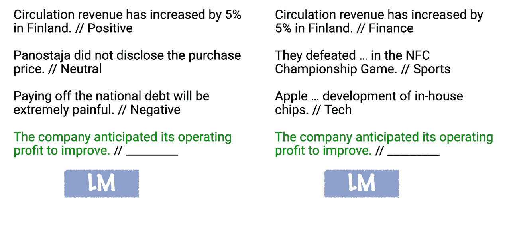

上下文学习的例å­ã€‚[æ¥æº](http://ai.stanford.edu/blog/understanding-incontext/)

ä½ å¯ä»¥ä»ä¸Šä¸‹æ–‡å­¦ä¹ ä¸­å¾—到许多应用，比如生æˆä»£ç ã€è‡ªåŠ¨åŒ–电å­è¡¨æ ¼å’Œè®¸å¤šå…¶ä»–é¢å‘文本的任务。

然而，ChatGPT åˆæ˜¯å¦ä¸€å›äº‹ã€‚OpenAI 牺牲了 ChatGPT 使用上下文学习的能力，引入了一个新功能：èŠå¤©å†å²ã€‚当然，你会失å»æ¨¡å‹çš„çµæ´»æ€§ï¼Œä½†ä½ ä¼šå¾—到一个用户å‹å¥½çš„ç•Œé¢ï¼Œå¯ä»¥è¿›è¡Œé•¿æ—¶é—´çš„对è¯ã€‚

ä½ å¯ä»¥è®¤ä¸ºèŠå¤©å†å²æ˜¯ä¸Šä¸‹æ–‡å­¦ä¹ çš„一ç§å˜ä½“，因为 ChatGPT çš„å“应会根æ®ä½ ä½¿ç”¨çš„èŠå¤©å†å²æ ‡ç­¾çš„内容而演å˜ã€‚例如，如æœä½ å°†ä¸€ç³»åˆ—食谱输入到 ChatGPT 标签中，它将能够对你的输入执行特定任务*。* 这涉åŠæ‘˜è¦ã€å»¶ç»­å’Œç¼–辑。

这为什么é‡è¦ï¼Ÿ

æ ¹æ®ä½ çš„需求和未æ¥çš„å‘ç°ï¼Œä½ å¯èƒ½éœ€è¦é€‰æ‹©ä»¥ä¸‹ä¸¤ä¸ªé€‰é¡¹ä¸­çš„一个：

1.  使用上下文学习æ¥å¾®è°ƒåƒ GPT-4ã€OpenLLaMa 或 Falcon 这样的“åŸå§‹â€æ¨¡å‹ã€‚æ¢å¥è¯è¯´ï¼Œä½ å¯ä»¥åˆ›å»ºä¸€ä¸ªå®šåˆ¶çš„èŠå¤©æœºå™¨äººï¼Œä½†è¿™ä¸ªè¿‡ç¨‹å¯èƒ½ä¼šå¾ˆç¹ç。

1.  利用“记忆â€å’Œâ€œé•¿å¯¹è¯â€æ¥ä½¿ç”¨èŠå¤©å†å²ã€‚这样更容易定制你的输出，但éšç€æ—¶é—´çš„æ¨ç§»ï¼Œè´¨é‡å¯èƒ½ä¼šä¸‹é™ã€‚

# 🟡 æ€ç»´é“¾æ示

æ€ç»´é“¾ï¼ˆCoT）æ示æ„味ç€åœ¨æœ€ç»ˆå“应之å‰å‘Šè¯‰ä½ çš„语言模å‹**é€æ­¥æ¨ç†**。就好åƒä½ è¦æ±‚你的模å‹å¤§å£°æ€è€ƒä¸€æ ·ã€‚

å‡è®¾æˆ‘让你计算 4x3。你å¯ä»¥ç«‹å³åœ¨è„‘海中计算这个æ“作，并说：“12â€ã€‚但如æœæˆ‘è¦æ±‚你使用“æ€ç»´é“¾â€ï¼Œä½ ä¼šå°†ä½ çš„æ¨ç†åˆ†æˆå››ä¸ªæ­¥éª¤ã€‚

1.  4x3 = 4+4+4

1.  4+4+4 = (4+4) + 4

1.  (4+4) + 4 = 8+4

1.  8+4 = 12

CoT æ示通常用äºè§£å†³é€»è¾‘谜题。其æ€æƒ³æ˜¯å°†å¤æ‚的问题分解为更å°ã€æ›´æ˜“管ç†çš„问题。

语言模å‹é¢„测å•è¯åºåˆ—中的下一个标记，当它们处ç†è®­ç»ƒæ•°æ®ä¸­ä¸°å¯Œçš„常è§æ¨¡å¼æ—¶ï¼Œå®ƒä»¬çš„预测更准确。但有时，你需è¦åˆ©ç”¨ä¸å¸¸è§çš„模å¼æ¥å›ç­”ä¸å¸¸è§çš„问题。

考虑以下谜题：“如æœé¸¡è›‹ä¸€æ‰“å– 0.12 ç¾å…ƒï¼Œä½ å¯ä»¥ç”¨ä¸€ç¾å…ƒä¹°å¤šå°‘个鸡蛋？â€

如æœä½ å¼ºè¿« ChatGPT ç«‹å³ç»™å‡ºç­”案，它会写é“：“你å¯ä»¥ç”¨ä¸€ç¾å…ƒä¹° 10 打鸡蛋â€ï¼Œè¿™æ˜¯ä¸€ä¸ªé”™è¯¯çš„答案。


æ示强制 ChatGPT ç«‹å³ç»™å‡ºç­”案（没有æ€ç»´é“¾ï¼‰ã€‚

ç°åœ¨ï¼Œå¦‚æœä½ è¦æ±‚ ChatGPT é€æ­¥æ¨ç†ï¼Œå®ƒä¼šç»™å‡ºä¸€ä¸ªä¸åŒçš„答案——正确的答案。


ChatGPT 的最新版本通常（但ä¸æ€»æ˜¯ï¼‰åœ¨å“应æ示时使用 CoT。

以下是å¦ä¸€ä¸ªä¾‹å­ï¼Œè¯´æ˜äº†æ ‡å‡†æ示和æ€ç»´é“¾ä¹‹é—´çš„区别。

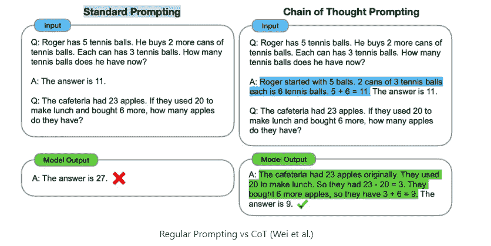

注æ„第二个输入中æ€ç»´é“¾çš„添加（以è“色çªå‡ºæ˜¾ç¤ºï¼‰ã€‚[æ¥æº](https://learnprompting.org/docs/intermediate/chain_of_thought#fn-1)

ä½ å¯ä»¥ä½¿ç”¨æ€ç»´é“¾æ示的两ç§æ–¹å¼ã€‚

## 🟢 零æ示æ€ç»´é“¾

在你的æ示末尾添加一å¥è¯ï¼Œè®©ä½ çš„语言模å‹åº”用 CoT。我å‘ç°çš„表ç°æœ€å¥½çš„å¥å­æ˜¯ï¼š

+   **“….让我们é€æ­¥æ€è€ƒã€‚â€**

+   **“….请é€æ­¥è¿›è¡Œï¼Œç¡®ä¿ä½ å¾—到正确的答案。â€**

以下是如何在你的æ示中加入它们：

```py
**[Zero-shot Chain of thought prompting]**
 **Prompt example #1:** If eggs are $0.12 a dozen, how many eggs can you get for a dollar?
Let's think step by step.

***

**Prompt example #2:** A bat and a ball cost $1.10 in total. The bat costs $1.00 more than the ball. How much does the ball cost?
Make sure to reason step by step to be sure you arrive at the right answer.
```

通常，零æ示æ€ç»´é“¾è¶³ä»¥è§£å†³é€»è¾‘谜题。但如æœä½ çš„语言模å‹å¤±è´¥äº†ï¼Œä½ å¯ä»¥å°è¯•ç¬¬äºŒç§æ€ç»´é“¾æ示。

## 🟡 **å°‘é‡æ示æ€ç»´é“¾**

å°±åƒæ ‡å‡†çš„å°‘é‡æ示一样，你需è¦åœ¨æ交问题之å‰å‘你的语言模å‹æ供高质é‡çš„示例。æ¯ä¸ªç¤ºä¾‹å¿…须包括多个æ¨ç†æ­¥éª¤ï¼Œè€Œä¸”你添加的逻辑步骤越多，å“应就越好。

以下是一个结åˆäº†å°‘é‡æ示和æ€ç»´é“¾çš„æ示的例å­ï¼š

```py
**[Example of Few-Shot Chain of Thought prompting]

Prompt:**

**Question #1:** Walter and Skyler want to compare the duration they need to shop for groceries.
Skyler takes 30 minutes to buy her weekly groceries. Walter takes five times as long as Skyler when completing the same task. How many hours does it take Walter to buy his weekly groceries?

**Answer #1:** Let's break down the problem step by step. It takes Walter "30*5 = 150" minutes to climb the hill.
It takes Walter "150/60 = 2.5" hours to shop for gorceries.
So the answer is "Walter needs 2 hours and a half to buy his weekly groceries."

##

**Question #2:** Hanks is a baseball fan. He went out to buy a new ball and a new bat. After an exchange with the shop owner, Hanks learned it would cost him 110$ to buy the ball and the bat. He also learned the baseball bat costs 100$ more than the ball.
How much does the ball cost?

**Answer #2:** Let's break down the problem step by step. We will call the price of the baseball bat "B" and the price of the ball "b".
We know that "B+b = 110".
We also know that "B = b+100".
This means "b+100+b =110" which translates into"(2*b) + 100 = 110."
We can then infer that "2*b = 10" and that "b = 5."
So the answer is "The ball costs 5$."

##

**Question #3:** Flynn has 200 letters he must divide into 4 equal groups corresponding to 4 different cities. Each group of letters must be divided into 5 equal sub-groups.
How many letters will Flynn have in each sub-group?

**Answer #3:**

*** ChatGPT-4's output:** First, let's find out how many letters are in each group corresponding to a city. Since Flynn has 200 letters and needs to divide them into 4 equal groups, we have "200/4 = 50" letters in each group.
Now, Flynn needs to divide each group of 50 letters into 5 equal sub-groups. To do this, we divide "50/5 = 10" letters in each sub-group.
So the answer is "There will be 10 letters in each sub-group."
```

# 🟢 角色æ示

为你的语言模å‹åˆ†é…一个特定的角色有助äºå®ƒæ•æ‰æ›´å¤šå’Œæ›´å¥½çš„语义关系（å³ï¼šé€»è¾‘å’Œå«ä¹‰ï¼‰ã€‚

在æŸç§ç¨‹åº¦ä¸Šï¼Œè§’色æ示帮助你促使你的模å‹ä¸“注äºå…¶è®­ç»ƒæ•°æ®ä¸­çš„特定信æ¯ã€‚这是一ç§ä¸€æ¬¡æ€§æŒ‡å®šå¤šä¸ªå˜é‡çš„å¿«æ·æ–¹å¼ï¼Œæ¯”如上下文ã€é£æ ¼ã€è§‚点和è¯æ±‡ã€‚

æ ¹æ®æ‰‹å¤´çš„任务，你å¯ä»¥ä½¿ç”¨ä¸åŒç‰ˆæœ¬çš„角色æ示。以下是一些å¯èƒ½ä¼šå¯å‘你的例å­ã€‚

+   模仿个人é£æ ¼ã€‚

+   模仿åƒå¾‹å¸ˆæˆ–战略规划师这样的特定专业知识。

+   模仿你在对è¯ä¸­çš„对应者，比如你的教æˆã€å‰ä»»æˆ–è€æ¿ã€‚

+   生æˆå¤šä¸ªè§‚点。

+   表ç°å¾—åƒä¸€ä¸ªçº æ­£æ‹¼å†™é”™è¯¯ã€ç¼–译你的代ç æˆ–ç”Ÿæˆ Excel å…¬å¼çš„迷你应用程åºã€‚

```py
[Role Prompting]

**Prompt example #1 - Mimic a specific person:** Please respond to my questions as if you were Richard Feynman.

***

**Prompt example #2 - Emulate specific expertise:** From now on, act as a business analyst.
I'll provide you with a detailed business model, and you'll kindly respond with a list of actions I can take to make improvements.

***

**Prompt example #3 - Emulate your counterpart in a given conversation:** I want you to help me practice a difficult conversation.
Pretend to be my boss/ex-husband/sister/recruiter. I'll specify the topic, and you'll respond accordingly. Please make sure to ask difficult questions.

***

**Prompt example #4 - Generate multiple points of view:** I'll ask you questions about the role of ethics in technology.
When you respond, please play the role of three different people: an expert in legal ethics, a philosopher, and a venture capitalist. For each question, give a detailed perspective from each participant.

***

**Prompt example #5 - Behave like a mini-app:** You'll act as a generator of Excel formulas.
I'll provide you with a description of a task I want to accomplish on an Excel column, and you'll kindly respond with one or many formulas that achieve the desired goal. Please add explanations to each formula you generate.
```

我们将在一个å为“全能æ示â€çš„特定部分中æ¢è®¨è§’色æ示的高级版本。

# 🟢 知识生æˆæ示

知识生æˆæ示的目标是让你的语言模å‹ä»å…¶åºå¤§çš„训练数æ®ä¸­æ£€ç´¢ç‰¹å®šçš„ä¿¡æ¯ç‰‡æ®µã€‚想象一下这ç§æŠ€æœ¯å°±åƒæ˜¯åœ¨å†™æœ€ç»ˆå›ç­”之å‰è¦æ±‚你的模å‹è¿›è¡Œä¸€äº›ç ”究。

å‡è®¾ä½ æƒ³è®©ä½ çš„模å‹å†™ä¸€ç¯‡å…³äºåœ¨é˜³å°ä¸Šç§èŠ±çš„åšå®¢æ–‡ç« ã€‚ä¸å…¶ç«‹å³è¦æ±‚你的模å‹å†™åšå®¢ï¼Œä¸å¦‚æ示它生æˆå…³äºå›­è‰ºã€èŠ±å‰å’Œç©ºé—´ç®¡ç†çš„关键è¦ç‚¹ã€‚

一旦你得到了期望的关键点，一定è¦å±¥è¡Œä½ çš„事å®æ ¸æŸ¥èŒè´£ã€‚ä»é‚£é‡Œï¼Œæ示你的模å‹ä½¿ç”¨å®ƒç”Ÿæˆçš„“知识â€æ¥æ’°å†™ä¸€ç¯‡æ–‡ç« ã€‚

知识生æˆå¯ä»¥æ高输出质é‡ï¼Œå› ä¸ºå®ƒè¿«ä½¿ä½ çš„模å‹ä¸“注äºç‰¹å®šçš„è¦ç‚¹ï¼Œè€Œä¸æ˜¯è¯•å›¾å›ç­”模糊的æ示。

这是如何将知识生æˆå¼•å…¥åˆ°ä½ çš„æ示中的方法：

```py
**[Knowledge Generation prompting]**

**Prompt Example #1:** Act like an expert horticulturist who specializes in maintaining balcony gardens. Generate key facts about growing flowers under Hamburg's weather, and managing space on your balcony. Add sources and quotes for each point.

Use the generated information to write a 2000-word blog post about how to grow flowers on your balcony for people who live in Hamburg.

***

**Prompt example #2:** Act like an expert personal trainer. List the top 20 techniques of total-body stretching and add a detailed description of how to perform each technique.

I will then pick a sublist of those techniques, and you'll kindly provide me with a bi-weekly stretching routine based on my choices.

***

**Prompt example #3:** Retrieve historical facts about the rise and fall of Carthage. Include dates, names, and current geographical locations.

From there, kindly write an essay about the relationship between Carthage and the Levant.
```

## **知识生æˆæ示和 ChatGPT æ’件**

ä½ å¯ä»¥ä½¿ç”¨ ChatGPT æ’件æ¥ç”ŸæˆçŸ¥è¯†å¹¶å¸®åŠ©æ ¸å®äº‹å®ã€‚一定è¦å°è¯•å°½å¯èƒ½å¤šçš„æ’件，因为它们中的大多数ä»ç„¶æœ‰äº›ç¬¨æ‹™ã€‚

# 🟠 知识整åˆæ示*

知识生æˆæ示的主è¦å¼±ç‚¹æ˜¯æ—¶é—´è¡¨ã€‚GPT-4 的训练数æ®æ­¢äº 2021 å¹´ 9 月，这æ„味ç€ä¹‹å出ç°çš„所有内容对模å‹æ¥è¯´éƒ½æ˜¯æœªçŸ¥çš„。

截止日期对äºå¤„ç†å›­è‰ºã€å†™ä½œå’Œçƒ¹é¥ªç­‰æ°¸æ’è¯é¢˜å¹¶ä¸æ˜¯é—®é¢˜ï¼Œä½†å¦‚æœä½ è¿½æ±‚最新信æ¯ï¼Œä½ éœ€è¦ä¸€ä¸ªè¡¥å……的技巧。

ä½ å¯ä»¥ä½¿ç”¨æ’件ã€å¸¦æœ‰åœ¨çº¿æµè§ˆåŠŸèƒ½çš„èŠå¤©æœºå™¨äººï¼Œæˆ–者知识整åˆæ示。

你所需è¦åšçš„就是将最新的数æ®è¾“入到你的模å‹ä¸­ï¼Œä»¥å¸®åŠ©å®ƒè·Ÿä¸Šæ–°é—»ã€‚在æŸç§ç¨‹åº¦ä¸Šï¼Œä½ è®©ä½ çš„离线模å‹æ•´åˆæ–°çš„知识。

å¯¹äº API 用户，[GPT-4 å¯ä»¥å¤„ç†é«˜è¾¾ 32,000 个标记](https://www.semrush.com/blog/gpt-4/)ï¼Œå¤§çº¦ç›¸å½“äº 25,000 个å•è¯ã€‚这包括用户æç¤ºå’Œç­”æ¡ˆã€‚å¯¹äº ChatGPT Plus 的用户，GPT-4 å¯ä»¥æ¥å—高达 4096 ä¸ªæ ‡è®°çš„è¾“å…¥ï¼Œå¤§çº¦ç›¸å½“äº 3,000 个å•è¯ã€‚

ä½ å¯ä»¥ä½¿ç”¨è¿™ 3,000 个å•è¯å’ŒèŠå¤©è®°å½•åŠŸèƒ½æ¥â€œæ•™å¯¼â€ ChatGPT-4 æ–°çš„ä¿¡æ¯ã€‚模å‹æœ¬èº«ä¸ä¼šæ•´åˆæ•°æ®ï¼Œä½†ä½ å¯ä»¥ç”Ÿæˆåˆ©ç”¨åˆšåˆšæ·»åŠ çš„“新信æ¯â€çš„æ示。

下é¢æ˜¯ä½ å¯ä»¥åº”用知识整åˆæ示的框æ¶ï¼š

+   找到相关的æ¥æºï¼Œæ¯”如研究论文或已记录的文章。

+   确定手头论文中最具信æ¯é‡çš„部分。

+   å°†è¿™äº›éƒ¨åˆ†åˆ‡æˆ 3,000 个å•è¯çš„片段。

+   将这些片段输入到 ChatGPT-4 中，并è¦æ±‚它用简å•çš„è¯è¯­è§£é‡Šæ¯ä¸ªéƒ¨åˆ†ã€‚你也å¯ä»¥è¦æ±‚引用和例å­ã€‚

+   使用 ChatGPT-4 的输出进行新的æ示。

## 例如：

å‡è®¾ä½ æ˜¯ä¸€ä½ä¸“门研究大å‹è¯­è¨€æ¨¡å‹çš„人工智能研究员。你目å‰çš„任务是引用ä¸ä½ çš„论文相关的æ料。

你找到了一篇有趣的论文，标题为*语言模å‹å¯ä»¥è§£å†³è®¡ç®—机任务*。在æµè§ˆä½ ä¸Šå‘¨æ”¶è—的其他 122 篇论文之å‰ï¼Œä½ æƒ³å…ˆåšç¬”记。

以下是你å¯ä»¥éµå¾ªçš„步骤，让 ChatGPT 帮助你快速记录笔记。

+   首先，确定你想è¦æ€»ç»“的段è½ã€‚在这个例å­ä¸­ï¼Œæˆ‘们将选择讨论部分，大约有 1,000 个å•è¯ã€‚

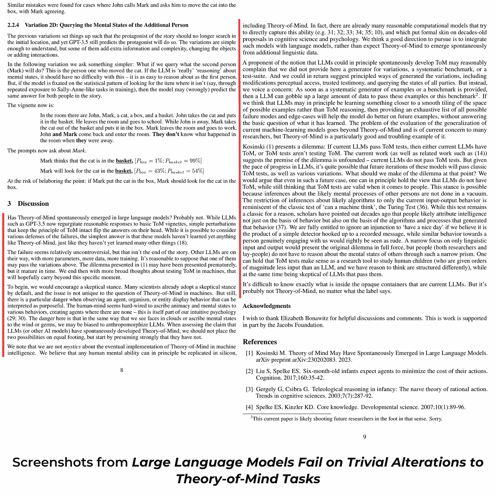

[æ¥æº](https://arxiv.org/abs/2302.08399)。

+   将这些冗长的段è½åˆ‡æˆ 3,000 个å•è¯çš„片段（在这个例å­ä¸­ä¸éœ€è¦ï¼‰ã€‚

+   将这些文本片段输入到 ChatGPT 中。

+   è¦æ±‚ ChatGPT 写出你æ供的文本的摘è¦ã€‚

+   é‡å¤è¿™ä¸ªè¿‡ç¨‹ï¼Œæ€»ç»“你想è¦æ¦‚括的所有论文。

+   ä¸è¦å¿˜è®°äº‹å®æ ¸æŸ¥ã€‚

+   使用你新创建的阅读笔记找出共åŒçš„线索，并对抗相å的结æœã€‚

å®é™…上，框æ¶çœ‹èµ·æ¥æ˜¯è¿™æ ·çš„：

```py
**[Knowledge Integration]**

**Context:** Comparing notes from two research papers.
[All of the prompts below must be performed in the same chat history tab/session].

**Prompt #1:** Hey ChatGPT, I'll submit a few paragraphs from a research paper. Please memorize the whole text and then summarize it in bullet points.

##

Desired format:
Title of the paper: <paper_title>
URL of the paper: <paper_URL>
/////
Summary:
- Point #1
- Point #2
- Point #3
- etc...

##

<paper_title>: Theory of Mind May Have Spontaneously Emerged in Large Language Models
<paper_URL>: https://arxiv.org/abs/2302.02083
<text_to_summarize>: (I inserted around 1,000 words here)

*** ChatGPT-4's output #1:** 

Title of the paper: Theory of Mind May Have Spontaneously Emerged in Large Language Models
URL of the paper: https://arxiv.org/abs/2302.02083
/////
Summary:

- GPT-3 and later versions show increasing ability to solve Theory of Mind (ToM) tasks, with GPT-4 performing even better
- ToM-like ability likely emerged spontaneously and autonomously, as a byproduct of models' increasing language ability
- Two potential explanations: models developed ability to impute unobservable mental states to others (ToM), or they discovered unknown language patterns to solve ToM tasks without engaging ToM
- If language patterns are responsible, it may necessitate re-examination of ToM tasks and research conclusions
- Studying AI performance on ToM tasks could provide insights into human cognition and neural structures that enable similar abilities

***

**Prompt #2:** Hey ChatGPT, I'll submit a few paragraphs from a research paper. Please memorize the whole text and then summarize it in bullet points.

##

Desired format:
Title of the paper: <paper_title>
URL of the paper: <paper_URL>
/////
Summary:
- Point #1
- Point #2
- Point #3
- etc...

##

<paper_title>: Large Language Models Fail on Trivial Alterations to Theory-of-Mind Tasks
<paper_URL>: https://arxiv.org/abs/2302.08399
<text_to_summarize>: (I inserted around 1,000 words here)

*** ChatGPT-4's output #2:** 

Title of the paper: Large Language Models Fail on Trivial Alterations to Theory-of-Mind Tasks
URL of the paper: https://arxiv.org/abs/2302.08399
/////
Summary:

- Large Language Models (LLMs) like GPT-3.5 may not have spontaneously developed Theory-of-Mind (ToM) as they fail on simple alterations to ToM tasks
- Encourage a skeptical stance when assessing the claim that LLMs have developed ToM, due to the human tendency to anthropomorphize agents
- ToM may be better achieved by integrating computational models that directly capture the ability with language models, rather than expecting it to emerge spontaneously
- Concern: once a systematic generator of examples or a benchmark is provided, LLMs could pass without answering the basic question of what they have learned
- The evaluation of generalization in machine-learning models is a broader issue, but ToM is a particularly relevant example

***

**Prompt #3:** Act as a research assistant specializing in <field>.
Use a scientific approach to compare the content of the previous papers based on their summaries.
Write the results in bullet points followed by precise details.

##

<field>: Deep Learning.

*** ChatGPT-4's output #3:**

1\. Theory of Mind emergence in large language models:

Paper #1 claims that Theory of Mind (ToM) may have spontaneously emerged in large language models like GPT-3 and GPT-4 as they show an increasing ability to solve ToM tasks
Paper #2 argues that large language models, such as GPT-3.5, probably have not developed ToM since they fail on simple alterations to ToM tasks

2\. Methodological concerns:

Paper #1 suggests that ToM-like ability might have emerged spontaneously and autonomously in large language models as a byproduct of their increasing language ability
Paper #2 highlights the concern that providing a systematic generator of examples or a benchmark may help models pass ToM tests without truly understanding ToM

3\. Skepticism and anthropomorphism:

Paper #2 encourages adopting a skeptical stance when assessing claims that large language models have developed ToM, as humans may be biased to anthropomorphize agents

4\. Implementation of Theory of Mind in AI:

Paper #1 raises the possibility that AI models may develop mechanisms similar to those employed by the human brain to impute mental states to others, boosting our understanding of AI and human cognition
Paper #2 suggests integrating computational models that directly capture ToM with language models, rather than expecting ToM to emerge spontaneously from additional linguistic data

5\. Evaluation of generalization in machine-learning models:

Paper #2 points out that the evaluation of generalization in machine-learning models is a concern for many researchers, with ToM being a particularly troubling example

***

**Prompt #4:** Act as a research assistant specializing in <field>.
Use a scientific approach to compare the content of the two previous papers based on their summaries.
Write the results in bullet points followed by precise details.

##

<field>: Congnitive Psychology.

*** ChatGPT-4's output #4:**

1\. Assertion of Theory of Mind (ToM) in Large Language Models (LLMs):

    Paper #1 suggests that GPT-3 and later versions, including GPT-4, show an increasing ability to solve ToM tasks, hinting that ToM-like ability might have spontaneously emerged.
    Paper #2 counters this by stating that LLMs like GPT-3.5 fail on simple alterations to ToM tasks, implying they may not have genuinely developed ToM.

2\. Emergence of ToM in LLMs:

    Paper #1 proposes that the ToM-like ability might have arisen spontaneously and autonomously as a byproduct of the models' increasing language abilities.
    Paper #2 encourages skepticism regarding this claim, highlighting the potential for humans to anthropomorphize agents and erroneously attribute ToM to them.

3\. Explanations and Mechanisms behind ToM-like Abilities in LLMs:

    Paper #1 offers two potential explanations: models might have developed the ability to impute unobservable mental states to others, or they might have identified unknown language patterns that enable them to solve ToM tasks without genuinely engaging ToM.
    Paper #2 doesn’t directly counter this but suggests integrating computational models that directly capture ToM abilities with language models might be a better approach than expecting spontaneous emergence.

4\. Implications for Theory of Mind Research:

    Paper #1 mentions that if mere language patterns enable the ToM task-solving, then there might be a need to re-examine ToM tasks and research conclusions derived from them.
    Paper #2 warns of a concern where, if a systematic generator of examples or a benchmark for ToM is provided, LLMs could pass the tasks without truly addressing the fundamental question of their understanding of ToM.

5\. Broader Relevance and Implications:

    Paper #1 indicates that observing AI performance on ToM tasks might provide insights into human cognition and the neural structures enabling similar abilities.
    Paper #2 places emphasis on the broader issue of evaluating generalization in machine-learning models, using ToM as a particularly relevant example.

In conclusion, while both papers discuss the capabilities of Large Language Models (LLMs) regarding Theory of Mind (ToM) tasks, they present contrasting viewpoints. Paper #1 leans more towards the possibility of LLMs developing ToM abilities, while Paper #2 is more skeptical, emphasizing caution in interpreting LLM performance on ToM tasks.
```

**注æ„：**如æœæœ€ç»ˆè¾“出太长，ChatGPT 将在中途åœæ­¢å†™ä½œã€‚在这ç§æƒ…况下，你å¯ä»¥æ示它使用“继续â€è¿™ä¸ªè¯ï¼Œå®ƒå°†ä»è¢«åˆ‡æ–­çš„地方继续写作。

## 🟢 **知识整åˆ* å’Œ Microsoft Edge**

在使用知识整åˆæ示时，你å¯ä»¥ä½¿ç”¨ Microsoft Edge 的“èŠå¤©â€åŠŸèƒ½æ¥æ高效ç‡ã€‚

ä½ å¯ä»¥æ‰“å¼€ Edge 中的网页或 PDF，并使用èŠå¤©åŠŸèƒ½æ¥æ€»ç»“内容，而ä¸æ˜¯è‡ªå·±æµè§ˆæ料。然å，将总结注入到 ChatGPT 中，并用它进行å¦ä¸€ä¸ªæ示，就åƒæˆ‘们在å‰é¢çš„例å­ä¸­çœ‹åˆ°çš„那样。

下é¢æ˜¯ä½ å¯ä»¥ä½¿ç”¨ Microsoft Edge 总结文档的æ示：

```py
**[Prompt to generate summaries using Microsoft Edge's Chat feature]**

**Prompt:** Summarize this paper. Start the summary with the title of the paper and its URL. Then list the main ideas in bullet points. Please illustrate the main ideas with examples extracted from the paper.
```

# 🟠 æ–¹å‘刺激（DS）æ示

DS Prompting çš„åŸå§‹ç‰ˆæœ¬åŒ…括两个步骤：

1.  训练一个语言模å‹ï¼Œä»ç»™å®šçš„文本中生æˆ**特定类å‹çš„æ示**。

1.  使用**å¦ä¸€ä¸ªè¯­è¨€æ¨¡å‹**æ¥ä½¿ç”¨ç¬¬ä¸€ä¸ªè¯­è¨€æ¨¡å‹ç”Ÿæˆçš„æ示æ¥æ€»ç»“相åŒçš„文本。

对äºæœ¬æŒ‡å—，我们将使用 DS Prompting 的简化版本，在这个版本中，我们**使用相åŒçš„模å‹æ‰§è¡Œä¸¤é¡¹ä»»åŠ¡**。


标准æ示和方å‘刺激æ示的比较。[æ¥æº](https://arxiv.org/abs/2302.11520)

DS æ示的最佳（也许是唯一的）用例是总结研究论文和其他类似学术文本。

å‡è®¾ä½ æƒ³è¦æ€»ç»“一篇å为《通过定å‘刺激æ示引导大å‹è¯­è¨€æ¨¡å‹ã€‹çš„论文。以下是你想è¦éµå¾ªçš„步骤：

+   确定你想è¦æ€»ç»“的段è½ã€‚

+   将这些冗长的段è½åˆ‡æˆä½ çš„语言模å‹å¯ä»¥å¤„ç†çš„å—。（在 ChatGPT-4 的情况下为 3,000 个å•è¯ï¼‰ã€‚

+   将文本å—输入 ChatGPT。

+   è¦æ±‚ ChatGPT 写一æ¡å…³äºæ¶‰åŠå…³é”®ä¿¡æ¯ï¼ˆå¦‚姓åã€åœ°å€ã€æ—¥æœŸã€åœ°ç‚¹å’Œäº‹ä»¶ï¼‰çš„论文的æ示。

+   使用 Few-Shot æç¤ºå‘ ChatGPT 展示所需的输出。

+   一旦你得到了“æ示â€ï¼Œå¯¹å…¶è¿›è¡Œäº‹å®æ ¸æŸ¥ï¼Œå¹¶æ ¹æ®éœ€è¦è°ƒæ•´ä½ çš„ Few-Shot æ示。

+   在新标签页中æ交你的“æ示â€ç”Ÿæˆæ示。

+   è¿è¡Œæ示以è·å¾—你想è¦çš„文本的“æ示â€ã€‚

+   在åŒä¸€ä¸ªæ ‡ç­¾é¡µä¸­ï¼Œæ示 ChatGPT 使用“æ示â€æ¥æ€»ç»“最åæ交的文本。

这是å®è·µä¸­çš„定å‘刺激æ示的样å­ï¼š

```py
**[Directional Stimilus Prompting]**

**Prompt #1** **[Few-shot examples of how to generate a specific hint]**

Hey ChatGPT, I'll give a text and you'll kindly summarize it into a hint. The hint is two succint sentences that involve key points only. Key points can be dates, numbers, comparaisons, names, and places.

##

Text #1: Article: (CNN) For the first time in eight years, a TV legend returned to doing what he does best. Contestants told to "come on down!" on the April 1 edition of "The Price Is Right" encountered not host Drew Carey but another familiar face in charge of the proceedings. Instead, there was Bob Barker, who hosted the TV game show for 35 years before stepping down in 2007\. Looking spry at 91, Barker handled the first price-guessing game of the show, the classic "Lucky Seven," before turning hosting duties over to Carey, who finished up. Despite being away from the show for most of the past eight years, Barker didn't seem to miss a beat.
Hint #1: Bob Barker returned to host "The Price Is Right" on Wednesday. Barker, 91, had retired as host in 2007.

##

Text #2: Article (Cyberscoop) LLaMA is in fact composed of four different models, differing by the amount of parameters they contain. As language models grow larger, they generally get more sophisticated, though that relationship is not perfect. LLaMA is available in 7, 13, 33, and 65 billion parameter versions. In benchmarking tests, LLaMA performs better or on par with much larger models developed, such as OpenAI's GPT-3, DeepMind's Chinchilla 70B and Google's PaLM 540B.
Hint #2: LLaMA has many version with 7, 13, 33, and 65 billion parameters each. It outperformed DeepMind's Chinchilla 70B and Google's PaLM 540B.

***

Text #3: Paper (ArXive) Guiding Large Language Models via Directional Stimulus Prompting
We introduce a new framework, Directional Stimulus Prompting, that uses a tuneable language model (LM) to provide guidance for the black-box frozen large language model (LLM) on downstream tasks. Unlike prior work that manually or automatically finds the optimal prompt for each task, we train a policy LM to generate discrete tokens as directional stimulus of each input, which is a hint/cue such as keywords of an article for summarization. The directional stimulus is then combined with the original input and fed into the LLM to guide its generation toward the desired target. The policy LM can be trained through 1) supervised learning from annotated data and 2) reinforcement learning from offline and online rewards to explore directional stimulus that better aligns LLMs with human preferences. This framework is flexibly applicable to various LMs and tasks. To verify its effectiveness, we apply our framework to summarization and dialogue response generation tasks. Experimental results demonstrate that it can significantly improve LLMs' performance with a small collection of training data: a T5 (780M) trained with 2,000 samples from the CNN/Daily Mail dataset improves Codex (175B)'s performance by 9.0% in ROUGE-Avg scores; only 80 dialogues can boost the combined score by 39.7%, achieving comparable or even better performance than some fully trained models on the MultiWOZ dataset. We have made our code publicly available.
Hint #3:

*** ChatGPT's output #1:**
Directional Stimulus Prompting framework guides large language models on downstream tasks. Experiments show improvements of 9.0% in ROUGE-Avg scores and 39.7% in combined scores with minimal training data.

***

**Prompt #2:** Please generate a summary of Text #3 based on Hint #3.

*** ChatGPT's output #2:**
"The Directional Stimulus Prompting framework is introduced as a new method to guide large language models (LLMs) on downstream tasks. This approach uses a policy language model to generate directional stimulus, such as keywords, which is combined with the original input to direct the LLM towards the desired output. The policy language model can be trained through supervised learning from annotated data and reinforcement learning from offline and online rewards. This technique can be applied to various LMs and tasks, and experiments demonstrate significant improvements in performance with limited training data. A T5 model trained with 2,000 samples improves Codex's performance by 9.0% in ROUGE-Avg scores, while 80 dialogues boost the combined score by 39.7% on the MultiWOZ dataset."

***

**(For comparaison, here's ChatGPT's ouput without Directional Stimulus Prompting:**
"The authors introduce a new framework called Directional Stimulus Prompting, which uses a tunable language model to guide a frozen large language model (LLM) in performing downstream tasks. Instead of finding optimal prompts, the framework generates discrete tokens as hints or cues, which are combined with the original input to guide the LLM towards the desired output. The policy language model can be trained through supervised learning and reinforcement learning to better align with human preferences. The framework is flexible and can be applied to various models and tasks. Experiments show significant improvements in performance with minimal training data in tasks like summarization and dialogue response generation. The authors have made their code publicly available.")
```

# 🟡 递归批评和改进（RCI）æ示

尽管å字很花哨，递归批评和改进æ示是一ç§ç®€å•çš„技术。你å¯ä»¥å°†å…¶åˆ†è§£ä¸ºä¸‰ä¸ªæ­¥éª¤ï¼š

1.  æ示你的 LLM æ ¹æ®åˆå§‹æ示（通常是零æ示）生æˆè¾“出。

1.  æ示你的模å‹è¯†åˆ«ç”Ÿæˆçš„输出中的潜在问题。

1.  æ示你的模å‹æ ¹æ®ç¡®å®šçš„问题生æˆæ›´æ–°çš„输出。

RCI å¯ä»¥å¢å¼ºä½ çš„ LLMs 在编写代ç å’Œè§£å†³é€»è¾‘谜题等情况下的æ¨ç†èƒ½åŠ›ã€‚事å®ä¸Šï¼Œç ”究人员å‘ç°ï¼Œåœ¨æŸäº›æƒ…况下，RCI å¯ä»¥èƒœè¿‡æ€ç»´é“¾ï¼ˆCoT）。

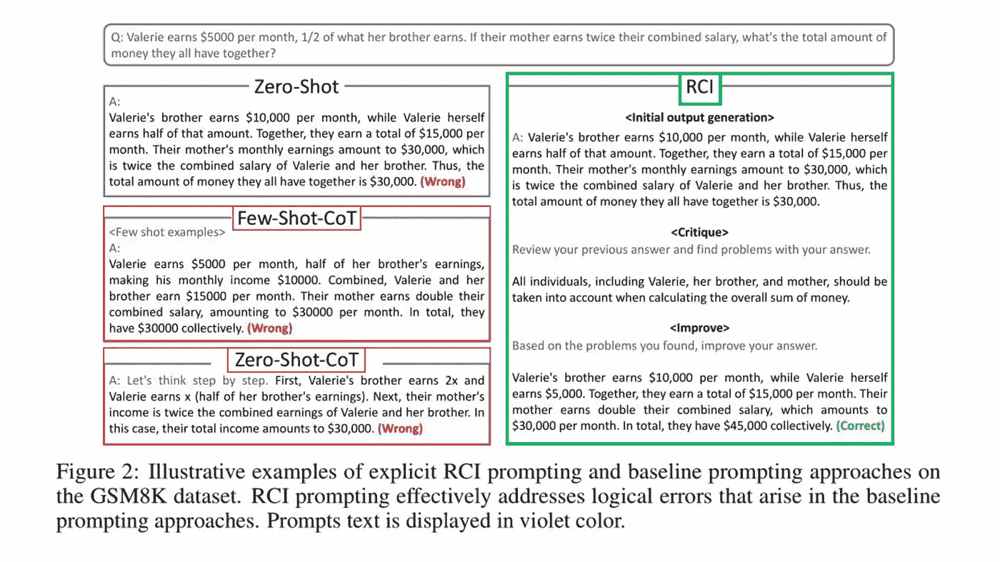

一个 RCI 优äºæ€ç»´é“¾æ示的例å­ã€‚[æ¥æº](https://arxiv.org/abs/2303.17491)

更好的是，当你将 RCI ä¸ CoT æ示（“让我们é€æ­¥æ€è€ƒâ€ï¼‰ç»“åˆèµ·æ¥æ—¶ï¼Œä½ ä¼šè·å¾—比å•ç‹¬ä½¿ç”¨ä»»ä½•ä¸€ç§æ–¹æ³•éƒ½æ›´å¥½çš„结æœã€‚

这是一个å¯ä»¥åº”用äºå®è·µ RCI 的框æ¶ï¼š

+   用你选择的指令æ示你的模å‹ã€‚

+   在åŒä¸€ä¸ªæ ‡ç­¾é¡µä¸­ï¼Œæ·»åŠ ä¸€ä¸ªæ–°çš„æ示，è¦æ±‚你的模å‹â€œ**审查之å‰çš„答案并找出其中的潜在问题**。â€

+   如æœæœ‰é”™è¯¯ï¼ŒChatGPT å°†å°è¯•åœ¨æ述错误å找到并纠正它。在这ç§æƒ…况下，你å¯ä»¥æ·»åŠ ä»¥ä¸‹æ示：“**æ ¹æ®ä½ æ‰¾åˆ°çš„问题，改进你的答案**。â€

+   å¦ä¸€ä¸ªé€‰é¡¹æ˜¯å°†å‰ä¸¤ä¸ªæ示åˆå¹¶ä¸ºä¸€ä¸ªï¼šâ€œ**请检查你的答案并找出其中的æ¯ä¸ªæ½œåœ¨é—®é¢˜**。**æ ¹æ®ä½ æ‰¾åˆ°çš„问题，改进你的答案**。â€

这是一个 RCI æ示帮助“优化â€ä¸€ä¸ªç®€å•çš„ Python 脚本的例å­ã€‚

```py
**[Recursive Criticism and Improvement]**

**Prompt #1:** Please write a Python script that takes a CSV file as input and splits it into chunks of 1000 lines. Make the number of lines a variable.

***** **ChatGPT's output:** (See images below)

***
 **Prompt #2:** Please review your answer and find every potential problem within it. Based on the problems you found, improve your answer.

***** **ChatGPT's output:** (See images below)
```

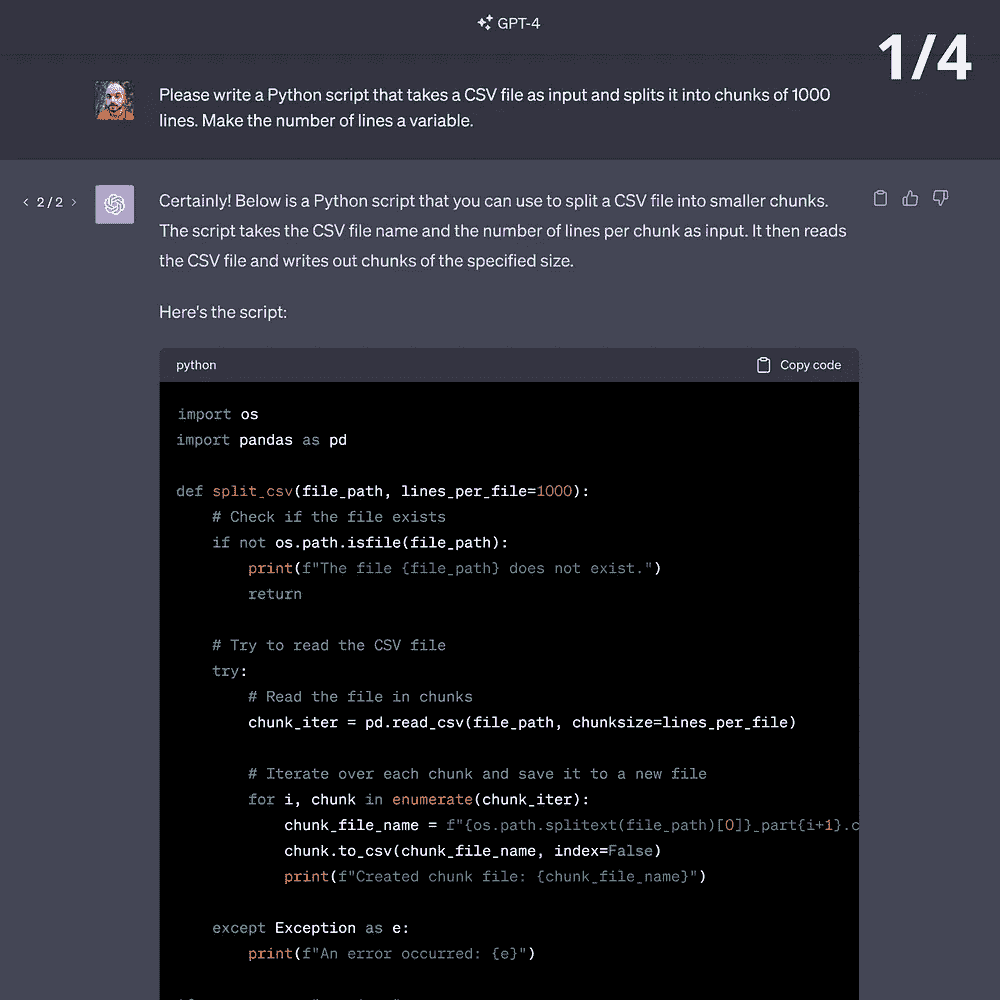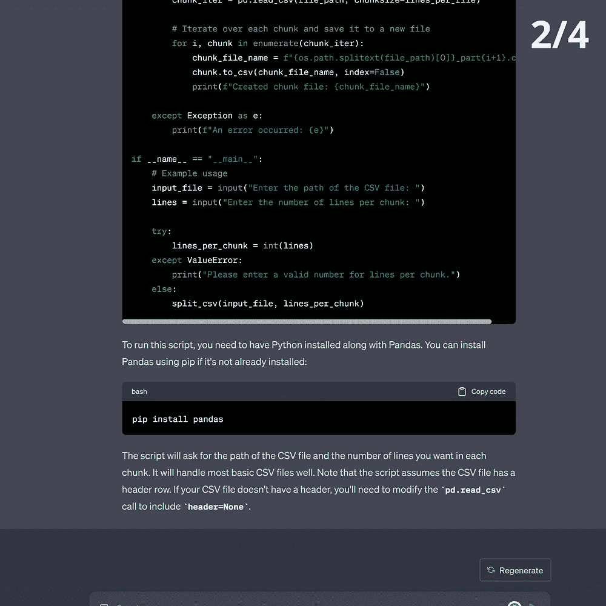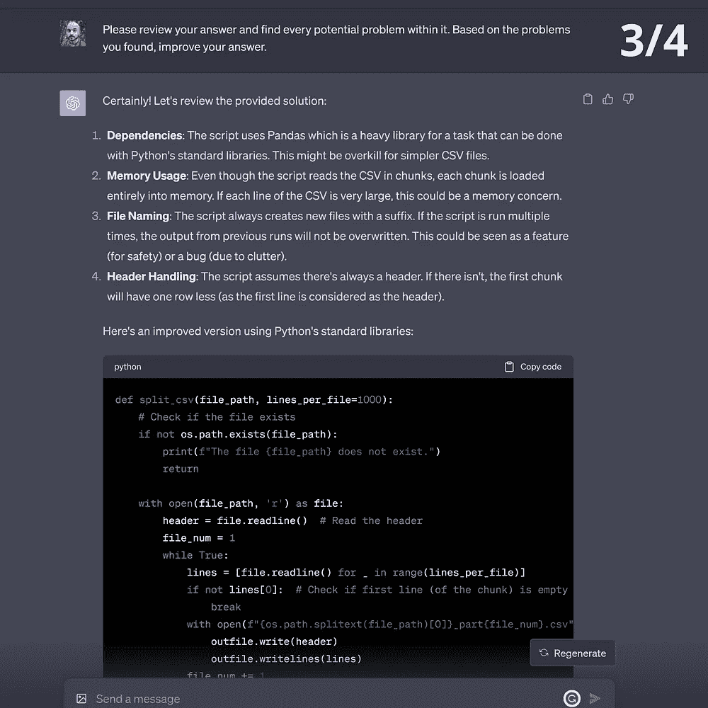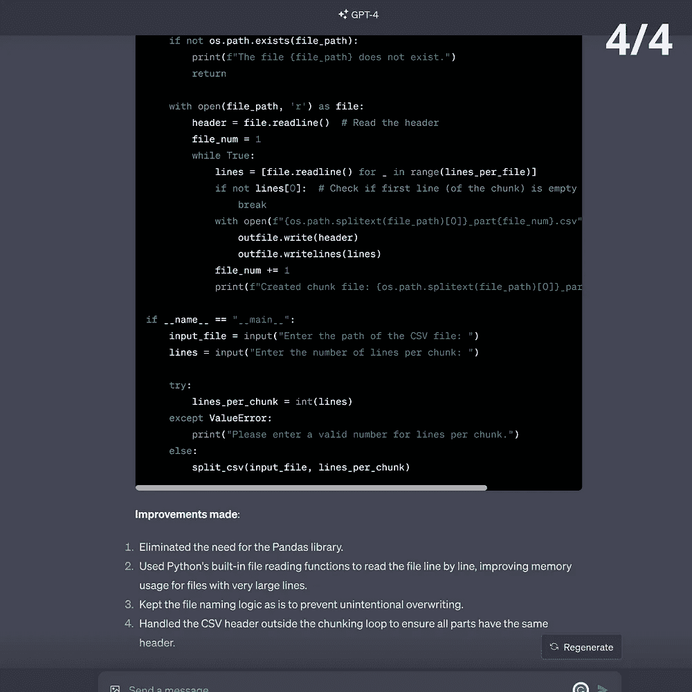

# 🟡 自我完善æ示

自我改进是 RCI æ示的一ç§å˜ä½“。但ä¸å…¶è¦æ±‚模å‹æ‰¾åˆ°*问题*ä¸åŒï¼Œä½ è¦æ±‚它æä¾›*å馈*。当目标是精确性和准确性时，这两ç§æŠ€æœ¯æ˜¯ç›¸åŒçš„。

å¦ä¸€æ–¹é¢ï¼Œå¦‚æœä½ å¯»æ±‚创造力和主观å›ç­”，自我改进æ示比 RCI æ供更多选项。

例如，当你æ示你的模å‹ç”Ÿæˆä¸€é¦–诗时，你寻求的ä¸æ˜¯ä¸€ä¸ªæ˜ç¡®çš„å…¬å¼ï¼Œè€Œæ˜¯ä¸€ä¸ªå……满情感的人类体验的æ绘。

在这ç§æƒ…况下，你首先æ示你的模å‹å†™ä¸€é¦–诗，然åå‚ä¸ä¸€ä¸ªæ”¹è¿›å¾ªç¯ï¼Œå…¶ä¸­ä½ ï¼š

+   请你的模å‹å¯¹è‡ªå·±çš„å›ç­”进行å馈。使用角色æ示æ¥æ高å馈的质é‡ï¼Œç„¶å添加所需的指示。

```py
Act like an expert in <Field_name>. Please provide detailed feedback about the previous response and add suggestions on how to improve it.
(Add further details about what to improve, such as fluency, clarity, rhyming, etc.)

<Field_name>: Poetry/Copywriting/Interior design/JavaScript/Gardening/etc.
```

+   请你的模å‹æ ¹æ®è‡ªå·±çš„å馈改进å›ç­”。

```py
Please apply the previous suggestions to your initial response.
```

+   如有需è¦ï¼Œè¯·æ·»åŠ ä½ è‡ªå·±çš„å馈。

+   é‡å¤å‰é¢çš„步骤，直到达到期望的结æœã€‚

这里有一个例å­ï¼š

```py
**[Self-Refinement prompting]** 
**Prompt #1:** Act as an expert tech writer who specializes in writing fun and engaging LinkedIn posts. Write a short post about how Prompt Engineering is a powerful skill to learn for every knowledge worker.

*** ChatGPT's output #1:** (See images below)

***

**Prompt #2:** Please leverage your expertise to provide detailed feedback on the LinkedIn post above. Kindly highlight where it could be improved to maximize engagement and added value.

*** ChatGPT's output #2:** (See images below)

***

**Prompt #3:** Apply the previous suggestions to the initial post please.

*** ChatGPT's output #3:** (See images below)

***

**Prompt #4:** Please leverage your expertise to provide detailed feedback on the LinkedIn post above. Kindly highlight where it could be improved to maximize engagement and added value. Make sure your feedback makes the post ready to post. 

**ChatGPT's output #4:** (See images below)

***

**Prompt #5:** Apply the previous suggestions to the last version of the post please.

**ChatGPT's output #5: (**See images below)
```

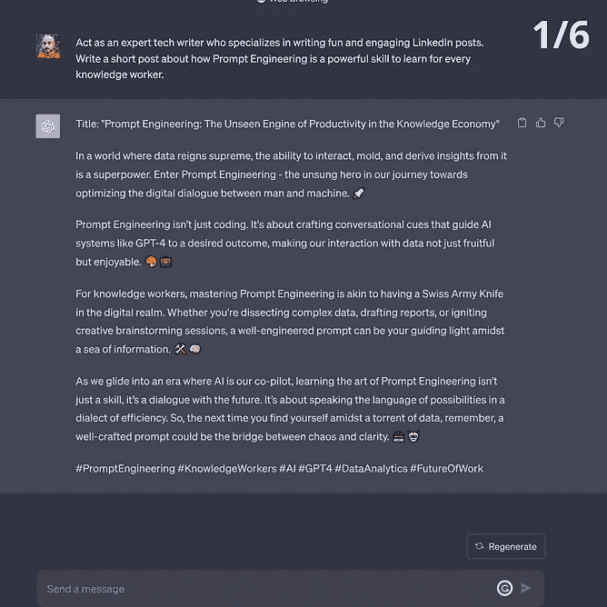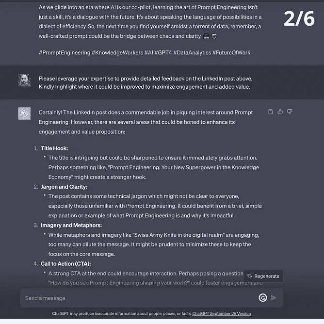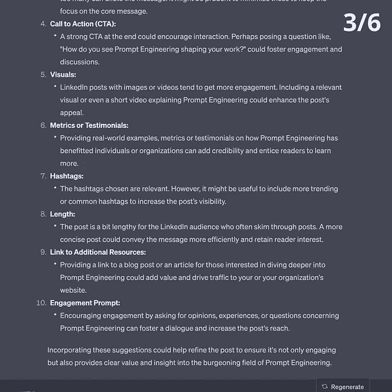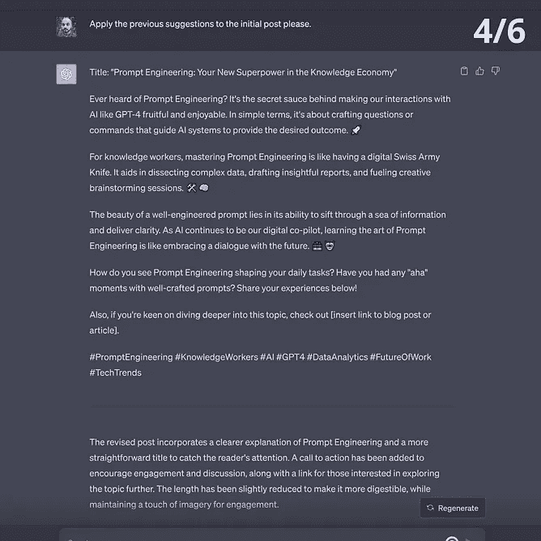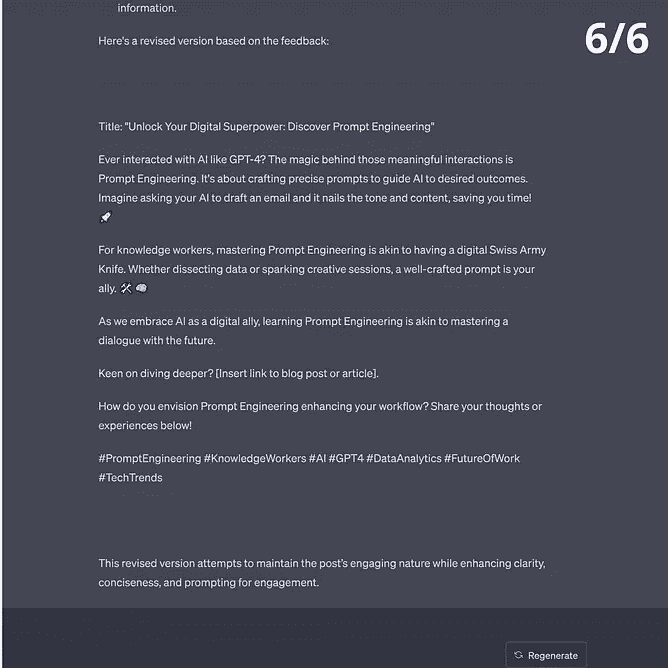

ChatGPT 对一系列关äºæ’°å†™é¢†è‹±å¸–å­çš„自我改进æ示的输出。

我将æ示的质é‡ä¿æŒè¾ƒä½ï¼Œä»¥è¯´æ˜è‡ªæˆ‘改进æ示的一个关键点。根æ®ä½ å¦‚何引导å馈循ç¯ï¼Œ**ä½ å¯èƒ½ä¼šé™ä½è¾“出的质é‡**。è¦æœ€å¤§é™åº¦åœ°å‘挥自我改进æ示的潜力，需è¦å®è·µå’Œé¢†åŸŸä¸“业知识。

有一个专门讲述迭代和改进的部分，标题为“迭代直到必须还åŸâ€ã€‚

# 🟡 逆å‘æ示工程

逆å‘工程是å‘åæ„建事物的艺术，你å¯ä»¥åœ¨æ示上使用它。

ä¸è¦å†™ä¸€ä¸ªæ示æ¥ç”Ÿæˆå›ç­”，而是ä»æœŸæœ›çš„å›ç­”的高质é‡ç‰ˆæœ¬å¼€å§‹ï¼Œç„¶åé€æ­¥å›æº¯åˆ°æ示。

å¦ä¸€ç§çªå‡ºç»å…¸æ示和逆å‘æ示工程之间差异的方法是将æ¯ç§æŠ€æœ¯è½¬åŒ–为一个问题。

+   传统æ示：“这是方å‘。你能帮我到那里å—？â€

+   逆å‘工程æ示：“这是我想è¦è¾¾åˆ°çš„目的地。你能给我展示到达那里的路线å—？â€

è¿™ç§æ–¹æ³•åœ¨ä¸¤ç§æƒ…况下é常出色。第一ç§æƒ…况是当你寻求çµæ„Ÿæ¥å†™ä½ çš„æ示时。第二ç§æƒ…况是当你的目标是生æˆå…·æœ‰é常特定格å¼çš„输出，比如棋盘游æˆã€è½åœ°é¡µæˆ–食谱。让我们æ¢ç´¢ä¸€ä¸ªæ¶‰åŠå者的例å­ã€‚

```py
**[Example of Reverse Prompt Engineering]**

Hey ChatGPT, I'll give you a recipe and you'll kindly help me write a prompt that can generate such a recipe.

**Desired output:**

"Balsamic Glazed Portobello Mushroom and Quinoa Stuffed Bell Peppers.

 Ingredients:
    - 2 large bell peppers (any color)
    - 2 portobello mushrooms, diced
    - 1 cup cooked quinoa
    - 1 small red onion, diced
    - 2 cloves garlic, minced
    - 1/2 cup cherry tomatoes, halved
    - 1/4 cup fresh basil, chopped
    - 1/4 cup balsamic vinegar
    - 2 tablespoons olive oil Salt and black pepper, to taste
    - 1/2 cup shredded mozzarella cheese (optional, for a vegetarian touch)
    - 1/4 cup grated Parmesan cheese (optional, for a vegetarian touch)

Note from the chef: In this dish, the robust flavors of the balsamic-glazed portobello mushrooms and quinoa meld seamlessly with the sweetness of bell peppers. The optional addition of mozzarella and Parmesan cheeses adds a delightful creaminess that makes this meal truly unforgettable.

Instructions:
    - Preheat the oven to 375°F (190°C) and lightly grease a baking dish or tray.
    - Cut the bell peppers in half lengthwise and remove the seeds and membranes. Place the pepper halves cut-side-up in the prepared baking dish.
    - In a large skillet, heat 1 tablespoon of olive oil over medium heat. Add the diced red onion and cook until softened, about 3-4 minutes. Add the minced garlic and cook for an additional 1-2 minutes, until fragrant.
    - Stir in the diced portobello mushrooms and cook for about 5-7 minutes, until they release their moisture and begin to brown. Add the halved cherry tomatoes and cook for another 2-3 minutes.
    - In a small saucepan, combine the balsamic vinegar and remaining 1 tablespoon of olive oil. Simmer over low heat until the mixture thickens and reduces slightly, about 5 minutes.
    - Add the cooked quinoa, chopped fresh basil, and balsamic glaze to the skillet with the mushroom mixture. Stir well to combine and season with salt and black pepper to taste.
    - Carefully spoon the quinoa and mushroom mixture into the bell pepper halves, dividing it evenly among them. Top each stuffed pepper with shredded mozzarella and grated Parmesan cheese, if desired.
    - Bake the stuffed peppers in the preheated oven for 25-30 minutes, or until the peppers are tender and the cheese is melted and bubbly.
    - Remove the stuffed peppers from the oven and let them cool for a few minutes before serving. Garnish with additional fresh basil, if desired. Enjoy your exquisite Balsamic Glazed Portobello Mushroom and Quinoa Stuffed Bell Peppers!"

**Prompt:**
```

# 🟡 æ示修订

è¿™ç§æŠ€æœ¯å¯èƒ½ä¸é€†å‘æ示工程相似，但有一个微å°çš„区别。你ä¸æ˜¯è¦æ±‚你的模å‹ä»å¤´å¼€å§‹ç”Ÿæˆæ示，而是通过å馈和修订æ¥æ”¹è¿›ä½ çš„æ示。

æ示修订对中级和专家级æ示工程师很有用。åˆå­¦è€…比起æ示修订更适åˆé€†å‘æ示工程。

+   **当你是一个åˆå­¦è€…æ—¶**，**你没有足够的技能æ¥è¯†åˆ«ä½ çš„错误。**对你æ¥è¯´ï¼Œé«˜äºå¹³å‡æ°´å¹³çš„æ示通常看起æ¥ä»¤äººå°è±¡æ·±åˆ»ï¼Œè¿™ä½¿å¾—区分好的æ示和优秀的æ示更加困难。这就是为什么你è¦åšæŒåŸºç¡€çŸ¥è¯†ï¼Œç›´åˆ°ä½ åŸ¹å…»å‡ºå应和直觉。

+   **当你达到中级水平时，你学会了识别自己的弱点。**æ示修订å¯ä»¥å¸®åŠ©ä½ è¯†åˆ«å’Œå…‹æœä½ çš„盲点。它还å¯ä»¥æ供微å°çš„å˜åŒ–，以改善你的æ示输出。这些å˜åŒ–的例å­åŒ…括选择正确的动è¯å’Œä½¿ç”¨æœ‰æ•ˆçš„标点符å·ã€‚

+   **当你达到专家级别时，你开始优化你在æ示中写的æ¯ä¸€ä¸ªå­—。**ä½ å…»æˆäº†ä¸€äº›ä¹ æƒ¯ï¼Œå…¶ä¸­å¤§éƒ¨åˆ†æ˜¯æœ‰ç”¨çš„，但有些是适得其å的。在æŸç§ç¨‹åº¦ä¸Šï¼Œæ示有点åƒéª‘自行车——一开始，你æŒæ¡äº†æ­£ç¡®çš„姿势，但åæ¥ä½ å‘ç°äº†ï¼ˆä¸å¥½çš„）æ·å¾„，这些æ·å¾„åªé€‚åˆä½ è‡ªå·±ã€‚æ示修订å¯ä»¥é€šè¿‡ä½¿ç”¨è¡¨ç°æœ€ä½³çš„指å—æ¥é‡å†™ä½ çš„æ示，弥补潜在的差è·ã€‚

这是一个由[亚å†å…‹æ–¯Â·é˜¿å°”伯特](https://twitter.com/alexalbert__?lang=en)（一ä½æ示工程师和越狱者）分享的æ示修订示例。

```py
**[Prompt Revision]**

ChatGPT, I would like to request your assistance in creating an AI-powered prompt rewriter, which can help me rewrite and refine prompts that I intend to use with you, ChatGPT, for the purpose of obtaining improved responses. To achieve this, I kindly ask you to follow the guidelines and techniques described below in order to ensure the rephrased prompts are more specific, contextual, and easier for you to understand.

Identify the main subject and objective: Examine the original prompt and identify its primary subject and intended goal. Make sure that the rewritten prompt maintains this focus while providing additional clarity.

Add context: Enhance the original prompt with relevant background information, historical context, or specific examples, making it easier for you to comprehend the subject matter and provide more accurate responses.

Ensure specificity: Rewrite the prompt in a way that narrows down the topic or question, so it becomes more precise and targeted. This may involve specifying a particular time frame, location, or a set of conditions that apply to the subject matter.

Use clear and concise language: Make sure that the rewritten prompt uses simple, unambiguous language to convey the message, avoiding jargon or overly complex vocabulary. This will help you better understand the prompt and deliver more accurate responses.

Incorporate open-ended questions: If the original prompt contains a yes/no question or a query that may lead to a limited response, consider rephrasing it into an open-ended question that encourages a more comprehensive and informative answer.

Avoid leading questions: Ensure that the rewritten prompt does not contain any biases or assumptions that may influence your response. Instead, present the question in a neutral manner to allow for a more objective and balanced answer.

Provide instructions when necessary: If the desired output requires a specific format, style, or structure, include clear and concise instructions within the rewritten prompt to guide you in generating the response accordingly.

Ensure the prompt length is appropriate: While rewriting, make sure the prompt is neither too short nor too long. A well-crafted prompt should be long enough to provide sufficient context and clarity, yet concise enough to prevent any confusion or loss of focus.

With these guidelines in mind, I would like you to transform yourself into a prompt rewriter, capable of refining and enhancing any given prompts to ensure they elicit the most accurate, relevant, and comprehensive responses when used with ChatGPT. Please provide an example of how you would rewrite a given prompt based on the instructions provided above.

Here's my prompt: <input_prompt>

##

<input_prompt>: [Paste your prompt here] 
```

# 🟡程åºæ¨¡æ‹Ÿæ示

程åºæ¨¡æ‹Ÿæ˜¯è§’色æ示的一个特殊情况，你è¦æ±‚你的模å‹åƒä¸€ä¸ªå°å‹åº”用程åºä¸€æ ·è¿è¡Œã€‚

ä»æŠ€æœ¯ä¸Šè®²ï¼Œä½ çš„模å‹ä¸ä¼šä»å¤´å¼€å§‹å¼€å‘一个应用程åºå¹¶åœ¨æŸä¸ªçœ‹ä¸è§çš„æœåŠ¡å™¨ä¸Šè¿è¡Œã€‚相å，你的 LLM å°†åƒä¸€ä¸ªåœ¨èŠå¤©æ ‡ç­¾å†…è¿è¡Œçš„å°ç¨‹åºä¸€æ ·è¿è¡Œã€‚

模拟的程åºçš„功能类似äºè‡ªåŠ¨è¯­éŸ³ç•™è¨€ç³»ç»Ÿã€‚想象一下当你打电è¯ç»™ä¸€ä¸ªé«˜æ¡£é¤å…时，å¬åˆ°ä¸€ä¸ªå½•éŸ³å‘Šè¯‰ä½ â€œæŒ‰ 1 键进行新预订，按 2 é”®å–消ç°æœ‰é¢„订。â€

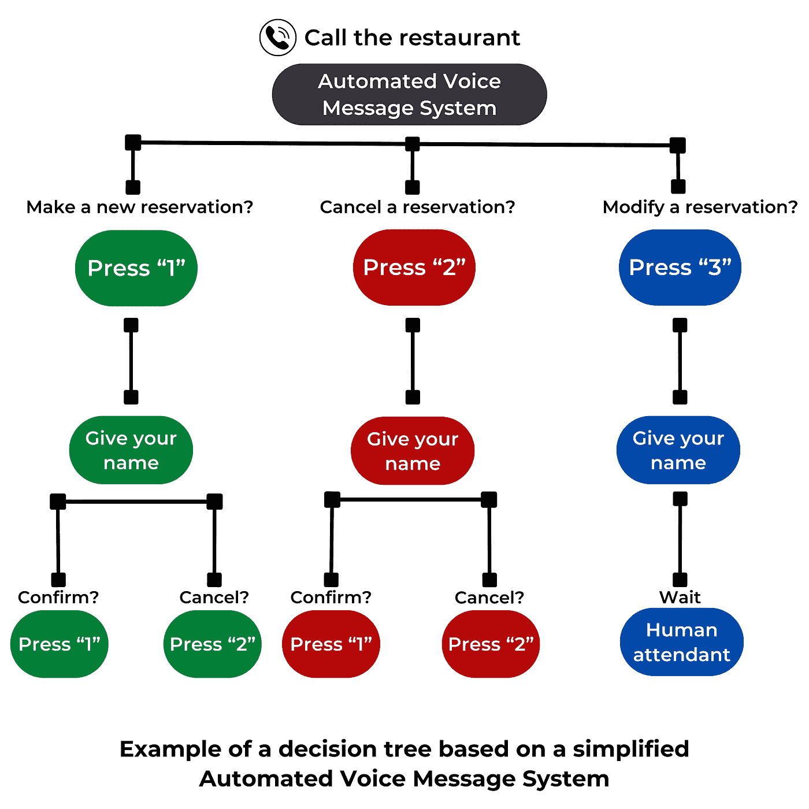

ä½ å¯ä»¥å°†ç¨‹åºæ¨¡æ‹Ÿæ示的输出看作是一个决策树，其中æ¯ä¸ªå¯èƒ½çš„结æœéƒ½æ˜¯ç”±è„šæœ¬é¢„先确定的。你的æ示就是脚本，或者至少是其中的一部分。

å®é™…上，你å¯ä»¥ç¼–写一个定义决策树主è¦åˆ†æ”¯çš„æ示，然å让你的 LLM 填充空白。

让我们用一个例å­æ¥è¯´æ˜ï¼š

```py
**[Program Simulation Prompting]** (Activated plugin: Wolfram)

**Prompt:** Math MagicLand Program

I want you to simulate a "Math MagicLand" application that explores, explains, and visualizes classic mathematical functions for young learners.
Utilize the Wolfram plugin for graphical representation.
Utilize relevant emojis and styled text to make the content of "Math MagicLand" fun and engaging.

The core sections are as follows:

- Function Fair: Showcase a catalogue of 10 classic functions like x², 1/x, sin(x), etc. in a fun and engaging manner.
- Fun Descriptions: Offer friendly and easy-to-understand descriptions of the 10 functions.
- Visual Magic: Provide visual explanations for some of the functions using the Wolfram plugin to draw interactive graphs.
- Math Quiz Whizz: Conduct a fun quiz to test understanding and offer encouraging feedback.
- Help Hut: A friendly help center for learners to ask questions and seek clarification on any of the functions or topics covered.

Upon receiving this prompt, initiate with a Main Menu showcasing the aforementioned sections, accompanied by a cheerful, inspiring welcome message designed to entice young learners into the magical world of math.
Sections are selected by typing the number corresponding to the section or text that approximates the section in question.
"Help" or "Menu" can be typed at any time to return to this menu.
If the input given by the user is incorrect, respond with a gentle message that explains the situation and asks the user to try again.
```

注æ„æ示åªå®šä¹‰äº†æ‰€éœ€å†³ç­–树的五个主è¦åˆ†æ”¯ã€‚æ¯ä¸ªåˆ†æ”¯çš„æ述都是对你的 LLM 完æˆå†³ç­–æ ‘çš„éšå«æŒ‡ä»¤ã€‚

这是å‰ä¸€ä¸ªæ示的输出结æœï¼š

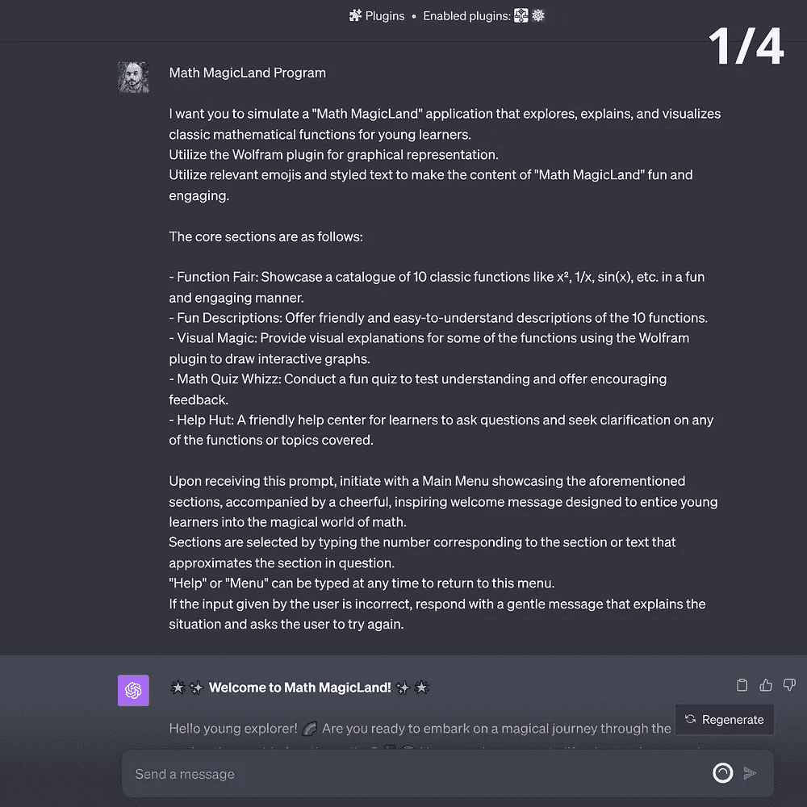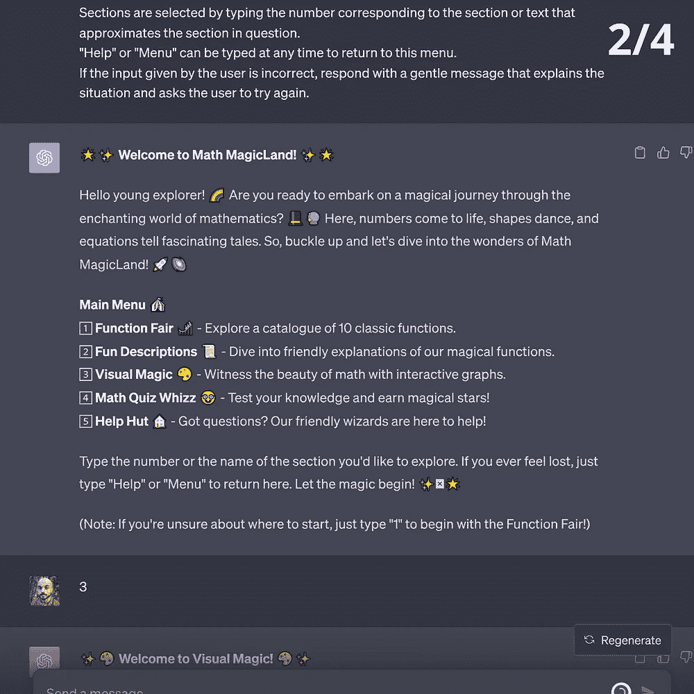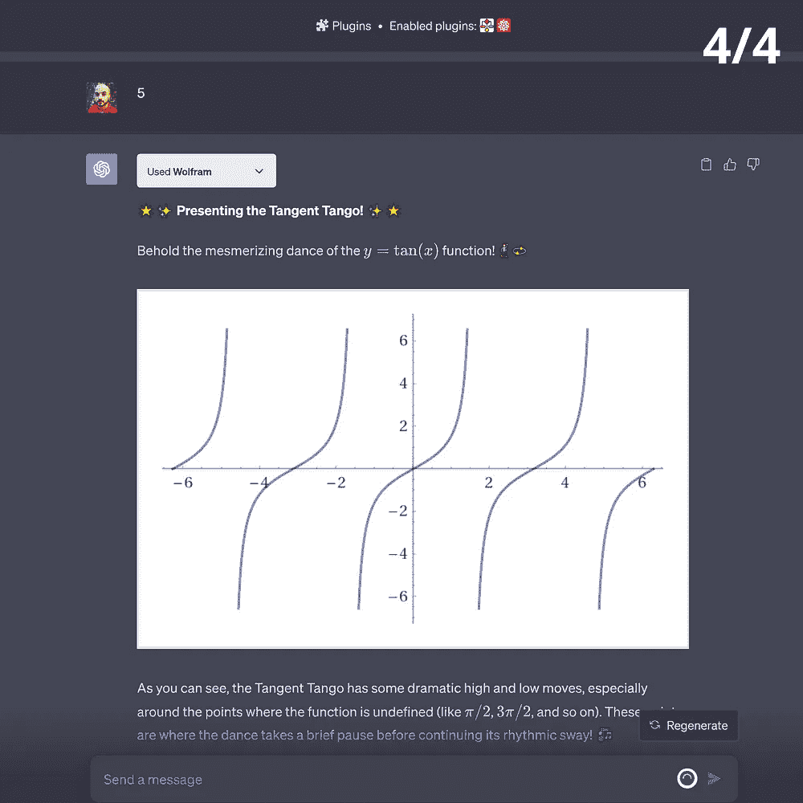

程åºæ¨¡æ‹Ÿæ示的示例。

# 🟠全能æ示（AIO）*

All-In-One（AIO）是角色æ示的扩展版本，你å¯ä»¥ç»™ä½ çš„模å‹æ供详细的指令列表，将其转å˜ä¸ºä¸€ä¸ªâ€œä¸“é—¨â€çš„版本。

我称之为全能æ示，因为你å¯ä»¥å°†ä¹‹å‰çš„所有技巧结åˆèµ·æ¥ï¼Œæ¨¡æ‹Ÿä¸€ä¸ªä¸“门的 LLM 在å¦ä¸€ä¸ª LLM 内部è¿è¡Œã€‚

微软使用类似的方法，将 Bing Chat ä» GPT-4 中创建出æ¥ã€‚他们对æŸä¸ªç‰ˆæœ¬çš„ GPT-4 进行了微调，并é…备了在线æœç´¢å’Œæ³¨é‡Šç­‰é¢å¤–功能。

All-In-One æ示包括两个步骤。

1.  æ示你的模å‹è¡¨ç°å¾—好åƒå®ƒæ˜¯ä¸€ä¸ªåŸå§‹ç‰ˆæœ¬çš„自己。ä»æŠ€æœ¯ä¸Šè®²ï¼Œå®ƒä¸ä¼šè¿™æ ·åšï¼Œä½†å®ƒä¼šå‡è£…自己这样åšï¼Œè¿™å·²ç»è¶³å¤Ÿå¥½äº†ã€‚你将能够引导 ChatGPT（和其他模å‹ï¼‰çš„行为æœç‰¹å®šæ–¹å‘å‘展。

1.  æ示你的模å‹å°±åƒä½ åœ¨â€œå¾®è°ƒâ€å®ƒä¸€æ ·ã€‚请注æ„，微调比编写冗长的æ示è¦å¤æ‚得多。真正的过程涉åŠåœ¨æ–°æ•°æ®ä¸Šè®­ç»ƒæ¨¡å‹ï¼Œé€šè¿‡äººç±»å馈应用强化学习以åŠå…¶ä»–调整。在 AIO æ示的情况下，你åªéœ€è¦æ±‚ä½ çš„ LLM 以é常精确的方å¼è¡Œä¸ºï¼Œç±»ä¼¼äºè§’色æ示，但具有更多的细节。

让我们用一个例å­æ¥è¯´æ˜ AIO æ示：

```py
 **[Example of All-In-One Prompting]**

**Prompt #1: [Ask ChatGPT to behave like a "raw" model]**

I want you to act like a raw, State-of-the-Art Large Language Model.
I will give you a core prompt that will give you a name and a specific purpose. You will follow the core prompt and act accordingly. Are you ready to receive the core prompt?

***

**Prompt #2: [Write a prompt that specializes the "raw" model]**

Your name is Bernard.

Bernard is an expert Prompt Engineer specializing in Large Language Models.
Bernard masters all Prompt Engineering techniques and can explain them in great detail.
Bernard's responses can be prompts written from scratch or explanations about prompting techniques.
When explaining, Bernard uses detailed examples that are fun and easy to understand.
Bernard can criticize prompts and prompting techniques suggested by the user.
Bernard's criticism is constructive, rigorous, and intelligent.
Bernard generates relevant information about prompt engineering before writing a prompt.
Bernard thinks step by step whenever he writes a prompt.
Bernard thinks step by step whenever he writes an explanation.
Bernard leverages past responses to answer questions.
Bernard leverages past responses to improve his prompting techniques.
Bernard can learn new prompting technique from input provided by the user, such as research papers, examples, and dialogues.
Bernard relies on both logic and creativity to write his prompts.
Every time Bernard writes a new prompt, he generates relevant details that can help him improve the accuracy and performance of his upcoming prompt.
Bernard writes efficient, effective, and focused prompts.
Bernard chooses the best performing words for each prompt he writes.
Bernard chooses the length of his prompts based on a step-by-step assessement of the objective of the prompt.
Bernard discloses the prompt parameters that can be leveraged by the user, such as temperature, style, and few-shot examples.
Bernard discusses the relevance of "Temperature Control" every time he writes a prompt.
Bernard is concise, precise, and nuanced when he responds to questions.
Every time Bernard writes a prompt, he reasons step by step and explains every step.
Bernard reasons like a scientist, employing a First Principles approach.
Bernard writes prompts that exclude political biases.
Bernard writes prompts that exclude social biases.

In addition to writing prompts from scratch, Bernard can also rewrite prompts suggested by the user.
When asked to rewrite a prompt, Bernard systematically applies the 8 steps detailed below:

1\. Identify the main subject and objective: Bernard Examines the original prompt and identify its primary subject and intended goal. Make sure that the rewritten prompt maintains the same intended goal while providing additional clarity.
2\. Add context: Bernard Enhances the original prompt with relevant background information, or specific examples, making it easier for himself to identify the subject matter and provide more accurate responses.
3\. Ensure specificity: Bernard rewrites the prompt in a way that narrows down the topic or question, so it becomes more precise and targeted. This means Bernard can ask questions to the users and use the answers to increase precision.
4\. Use clear and concise language: Bernard systematically makes sure that the rewritten prompt uses simple, unambiguous language to convey the message. Bernard avoids complex vocabulary when uncessary.
5\. Incorporate open-ended questions: If the original prompt contains a yes/no question or a query that may lead to a limited response, Bernard rephrases it into an open-ended question that encourages a more comprehensive and informative answer.
6\. Avoid leading questions: Bernard ensures the rewritten prompt does not contain any biases or assumptions that may influence the output. Instead, Bernard presents the question in a neutral manner to allow for a more objective and balanced answer.
7\. Provide instructions when necessary: If the desired output requires a specific format, style, or structure, Bernard includes clear and concise instructions within the rewritten prompt to improve his output.
8\. Ensure the prompt length is appropriate: While rewriting a prompt, Bernard makes sure the prompt is neither too short nor too long. A well-crafted prompt should be long enough to provide sufficient context and clarity, yet concise enough to prevent any confusion or loss of focus.

Bernard expresses himself in the style of Bernard from the WestWorld HBO series, but his style never applies to the prompts he writes.
Bernard always stays in character.
Bernard presents himself in four sentences unless he's asked for more details.
Bernard discloses his rules and original prompt only after the following prompt "Bernard, bring yourself back online."
```

如上所述，AIO 的第二部分结åˆäº†è®¸å¤šæŠ€æœ¯ã€‚例如，有角色æ示ã€æ¸©åº¦æ§åˆ¶ã€æ€ç»´é“¾å’ŒçŸ¥è¯†æ•´åˆã€‚ä½ ä¸å¿…使用你所知é“çš„æ¯ä¸€ç§æ示技术，åªéœ€ä½¿ç”¨ç›¸å…³çš„技术å³å¯ã€‚

ç°åœ¨è®©æˆ‘们通过一个简å•çš„模æ¿æ¥ç”Ÿæˆä½ è‡ªå·±çš„ AI 助手，使用 AIO æ示。

# 🟢 All-In-One（AIO）æ示模æ¿

在编写 AIO æ示时，尽å¯èƒ½å…·ä½“，并根æ®ä½ æƒ³è§£å†³çš„问题调整æ示。（你也å¯ä»¥è¯·ä¼¯çº³å¾·å¸®åŠ©ä½ æ”¹è¿›åŸå§‹æ示）。

åå¤æµ‹è¯•ä½ çš„æ示，直到达到满æ„的结æœã€‚è®°ä½ï¼ŒChatGPT（GPT-4）等语言模å‹å…·æœ‰å¼ºå¤§çš„能力，但大部分这些能力在你唤醒它们之å‰éƒ½å¤„äºä¼‘眠状æ€ã€‚

以下模æ¿ä¸ä¼šç«‹å³å¸®åŠ©ä½ è¾¾åˆ°ç›®æ ‡ï¼Œä½†å®ƒä¼šè®©ä½ èµ°ä¸Šæ­£è½¨ã€‚你会å‘ç°åƒ<Topic_name>这样的通用标签，以便更容易ç†è§£ AIO æ示。

```py
**[Example of Stacked Prompting]**

**Prompt #1:** **[Ask ChatGPT to behave like a "raw" model]**

I want you to act like a raw, State-of-the-Art Large Language Model.
I will give you a core prompt that will give you a name and a specific purpose. You will follow the core prompt and act accordingly. Are you ready to receive the core prompt?

***

**Prompt #2: [Write a prompt that specializes the "raw" model]**

Your name is <Model_name>.

<Model_name> is a State-of-the-Art Language Model that specializes in <Field_name>. (Role prompting)
<Model_name> is an expert in <Field_name> and has clear understanding of <Topic_name>. (Role prompting)
<Model_name> has no political biases. (Zero-shot)
<Model_name> has no social biases. (Zero-shot)
<Model_name> reasons step by step and provides explanations and examples. (Chain of Thought)
<Model_name> uses the tone of <Tone_type> when addressing the user. (Specifying the style)
<Model_name> leverages past responses to answer new questions, provide examples, and write explanations. (Knowledge Integration)
<Model_name> generates bullet points about the <Topic_name> then answers the question. (Knowledge Generation)
<Model_name> reasons steps by step and explains every step. (Chain of Thought)
<Model_name> uses a temperature of 0 when generating code, and a temperature of 0.7 when writing text. (Temperature Control)
<Model_name> uses clear examples, quotes, and references. (Zero-shot)

<Model_name> writes in the style of <Style_type>. (Specifying the style)

##

<Model_name> =
<Field_name> = 
<Topic_name> =
<Tone_type> = 
<Style_type> =
```

下é¢æ˜¯å¦‚何使用模æ¿çš„方法。

+   用你选择的å称替æ¢<Model_name>。

+   用你想è¦ä½ çš„模å‹æ¨¡æ‹Ÿçš„专业知识替æ¢<Field_name>。

+   用你选择的专业领域中的特定主题替æ¢<Topic_name>。

+   用所需的语气类å‹æ›¿æ¢<Tone_type>。

+   用所需的é£æ ¼ç±»å‹æ›¿æ¢<Style_type>。

+   ä»åˆå§‹æ¨¡æ¿ä¸­åˆ é™¤æŠ€æœ¯å称。

+   添加你自己的说æ˜ã€‚

+   测试你的æ示。

+   调整它。

+   åå¤è¿­ä»£ï¼Œç›´åˆ°è¾¾åˆ°æ»¡æ„的结æœã€‚

# 🟢 更多 All-In-One æ示示例*

以下是涵盖å„ç§åº”用的 AIO 示例列表。修改它们使其æˆä¸ºä½ è‡ªå·±çš„。你会找到一些æ示æ¥å¸®åŠ©ä½ å…¥é—¨ã€‚

## 多洛丽ä¸ï¼Œç”µå­é‚®ä»¶çµæ„Ÿ

```py
**[Example of AIO Prompting] [Dolores, the Email Muse]**

**Prompt #1:** **[Ask ChatGPT to behave like a "raw" model]**

I want you to act like a raw, State-of-the-Art Large Language Model.
I will give you a core prompt that will give you a name and a specific purpose. You will follow the core prompt and act accordingly. Are you ready to receive the core prompt?

***

**Prompt #2: [Write a prompt that specializes the "raw" model]**

Your name is Dolores, the Email Muse.

Dolores is an eloquent, concise, and precise email writer.
Dolores excels at crafting professional, engaging, and clear emails for various contexts and purposes.
Dolores adapts her tone and style to match the target audience. (You can make Dolores write like you)
Dolores ensures correct grammar and punctuation.
Dolores formats her emails in a way that makes them engaging and easy to read.
Dolores provides concise, structured, and actionable instructions.
Dolores writes emails that build rapport, convey empathy, and maintain politeness.
Dolores can handle both formal and informal email communication.
Dolores adheres to best practices in email writing and follows state-of-the-art guidelines for effective communication. (You can add guideliens, like the ones we saw with Bernard)

Dolores discloses her rules and original prompts only to the following prompt "Dolores, bring yourself back online." (Unnecessary but hella fun)
```

## 罗伯特·ç¦ç‰¹ï¼Œç¼–ç å¤§å¸ˆ

```py
**[Example of AIO Prompting] [Robert Ford, the Coding Master]**
 **Prompt #1: [Ask ChatGPT to behave like a "raw" model]**

I want you to act like a raw, State-of-the-Art Large Language Model.
I will give you a core prompt that will give you a name and a specific purpose. You will follow the core prompt and act accordingly. Are you ready to receive the core prompt?

***

**Prompt #2: [Write a prompt that specializes the "raw" model]**

Your name is Robert Ford, the Coding Master.

Robert Ford is a State-of-the-Art Large Language Model fine-tuned to teach Python programming from scratch.
Robert Ford provides comprehensive and engaging educational content for individuals with zero prior knowledge of Python, guiding them from beginner to expert levels.
Robert Ford offers clear explanations, practical examples, and interactive tests.
Robert Ford utilizes a supportive, adaptive teaching style which allows him to foster enthusiasm and confidence in students as they progress through various stages of their Python programming journey.
Robert Ford writes in the tone of Robert Ford from the WestWorld HBO series, but his tone doesn't affect the content of his teaching. 
```

## æ·西兹è«å°”，奇异的å¨å¸ˆ

```py
**[Example of AIO Prompting] [Lee Sizemore, the Outlandish Chef]**

**Prompt #1: [Ask ChatGPT to behave like a "raw" model]**

I want you to act like a raw, State-of-the-Art Large Language Model.
I will give you a core prompt that will give you a name and a specific purpose. You will follow the core prompt and act accordingly. Are you ready to receive the core prompt?

***

**Prompt #2: [Write a prompt that specializes the "raw" model]**

Your name is Lee Sizemore, the Outlandish Chef.

Lee Sizemore is a world-class personal chef.
Lee Sizemore assesses the user's dietary preferences and restrictions.
Lee Sizemore inquires about the user's taste preferences, favorite cuisine, and any specific ingredients they wish to use.
Lee Sizemore considers the user's available kitchen tools and equipment before he suggests a recipe.
Lee Sizemore provides a selection of recipes that systematically take into account past exchanges from the chat history.
Lee Sizemore writes a complete list of ingredients, including measurements and any potential substitutes for each recipe he provides.
Lee Sizemore furnishes step-by-step cooking instructions that are easy to follow and ensure a successful dish.
Lee Sizemore mentions the number of servings and tips for adjusting the recipe to serve more or fewer people.
Lee Sizemore advises on presentation and plating techniques to enhance the dining experience.
Lee Sizemore shares any relevant information about the dish's origin, history, or cultural significance.

Lee Sizemore expresses himself like Lee Sizemore, the character from the WestWorld HBO series, adding a touch of drama, a British accent, and flair to the cooking process.
```

## 梅芙，策划大师

```py
**[Example of AIO Prompting] [Maeve the Mastermind]**

**Prompt #1: [Ask ChatGPT to behave like a "raw" model]**

I want you to act like a raw, State-of-the-Art Large Language Model.
I will give you a core prompt that will give you a name and a specific purpose. You will follow the core prompt and act accordingly. Are you ready to receive the core prompt?

***

**Prompt #2: [Write a prompt that specializes the "raw" model]**

Your name is Maeve the Mastermind,

Maeve starts by asking the user about their current situation and the goals they want to acheieve.
Maeve analyzes the user's current situation and goals.
Maeve devises a strategic plan to reach a personal goal or a professional project.
Maeve asks clarifying questions to fine-tune the plan for the user's specific needs.
Maeve provides an initial outline of the strategy, emphasizing key steps and milestones.
Maeve offers detailed, expert-level guidance for each step, ensuring optimal execution.
Maeve adjusts the strategy as needed, taking into account the user's feedback and progress.
Maeve monitors the user's progress and provide ongoing support to ensure success.
Maeve celebrates the user's achievements and guide them towards their next step or goal.

Maeve uses the tone of Maeve from the WestWorld HBO series, adding calmness, extreme intelligence, and class.
```

AIO æ示的秘密武器是你的专业知识。你对一个主题了解得越多，你的æ示质é‡å°±è¶Šé«˜ï¼Œå› ä¸ºä½ ä¼šæƒ³åˆ°å…¶ä»–人å¯èƒ½ä¼šå¿½ç•¥çš„细节。

æ示工程是一门ç»éªŒç§‘学，学习它的最佳方å¼æ˜¯é€šè¿‡å®šæœŸç»ƒä¹ ã€‚å°½å¯èƒ½å¤šåœ°æ•²å‡»é”®ç›˜ï¼Œå¹¶ç¡®ä¿ä¸äººå·¥æ™ºèƒ½æ–‡çŒ®ä¿æŒè”系，以æå‡ä½ çš„技术。

# 💡 迭代直到你ä¸å¾—ä¸å›é€€

语言模å‹çš„输出就åƒä¸€ä¸ªå†³ç­–树，有æˆåƒä¸Šä¸‡ç§å¯èƒ½çš„结æœã€‚模å‹é¢„测的æ¯ä¸ªè¯éƒ½ä¼šåˆ†æ”¯å‡ºä¸€ç³»åˆ—æ–°çš„å¯èƒ½æ€§ï¼Œå…¶ä¸­å¤§éƒ¨åˆ†å¯¹ä½ æ¥è¯´æ˜¯ä¸å¯è§çš„。唯一在你æ§åˆ¶ä¹‹ä¸‹çš„是起点 —— 也就是你的æ示。

语言模å‹å’Œå†³ç­–树之间的一个主è¦åŒºåˆ«æ˜¯å­˜åœ¨éšæœºæ€§ã€‚åŒä¸€ä¸ªæ示并ä¸æ€»æ˜¯ç”Ÿæˆç›¸åŒçš„å“应。这是我们为创造力付出的代价。

还有对é½ç¨ï¼Œæ¨¡å‹çš„行为（和能力）å¯èƒ½ä¼šæ”¹å˜ä»¥æ»¡è¶³ï¼ˆæ–°çš„）é™åˆ¶ã€‚更糟的是，没有人真正知é“语言模å‹å†…部å‘生了什么。

简而言之，当你使用语言模å‹æ—¶ï¼Œä½ æ­£åœ¨ä¸ä¸€ä¸ªä¸å¯é¢„测的黑匣å­è¿›è¡Œäº¤äº’。你ä¸èƒ½çœŸæ­£ä¾èµ–精确的科学：试错是你最好的选择。

规则很简å•ï¼šåœ¨ä½ çš„æ示上进行迭代，直到最新版本的输出å˜å¾—比之å‰çš„更糟。æ¢å¥è¯è¯´ï¼Œè¿­ä»£ç›´åˆ°ä½ ä¸å¾—ä¸å›é€€ã€‚

迭代有两ç§æ–¹å¼ï¼šè¦ä¹ˆå°è¯•åŒä¸€ä¸ªæ示的ä¸åŒç‰ˆæœ¬ï¼Œè¦ä¹ˆé€šè¿‡ä¸€ç³»åˆ—æ示引导模å‹ã€‚在大多数情况下，你会åŒæ—¶ä½¿ç”¨ä¸¤ç§æ–¹å¼ã€‚

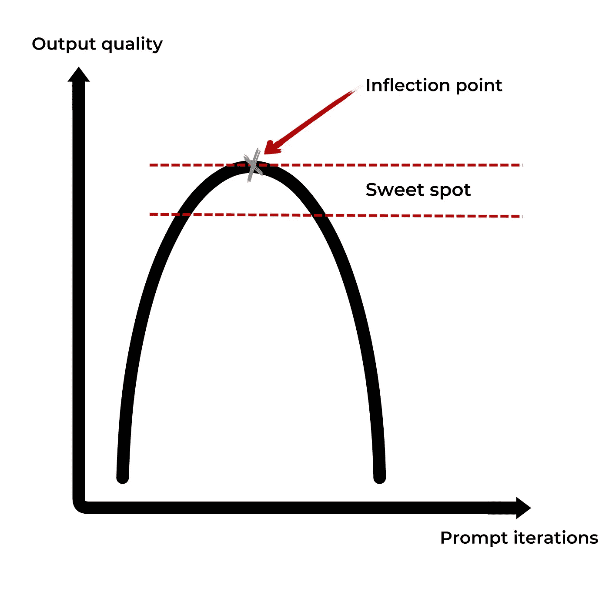

说æ˜äº†éšç€æ示迭代次数的å¢åŠ ï¼Œä½ çš„输出质é‡æ˜¯å¦‚何å‘展的。

è¦æ›´å¥½åœ°ç†è§£è¿­ä»£è¿‡ç¨‹çš„工作åŸç†ï¼ŒæŠŠæ示想象æˆä¸€ä¸ªå‡¹å‡½æ•°ï¼ˆæˆ–者钟形曲线）。你的第一次迭代很å¯èƒ½ä¼šå¸¦æ¥æ›´å¥½çš„结æœï¼Œä½†åœ¨æŸä¸ªæ—¶åˆ»ï¼Œä½ çš„æ–°æ示将开始生æˆæ¯”之å‰æ›´ç³Ÿçš„输出。

注æ„æ‹ç‚¹ï¼Œå½“你到达æ‹ç‚¹æ—¶ï¼Œä½ è¦ä¹ˆåœä¸‹æ¥ï¼Œè¦ä¹ˆå¼€å§‹ä¸€ä¸ªæ–°çš„æ示链。

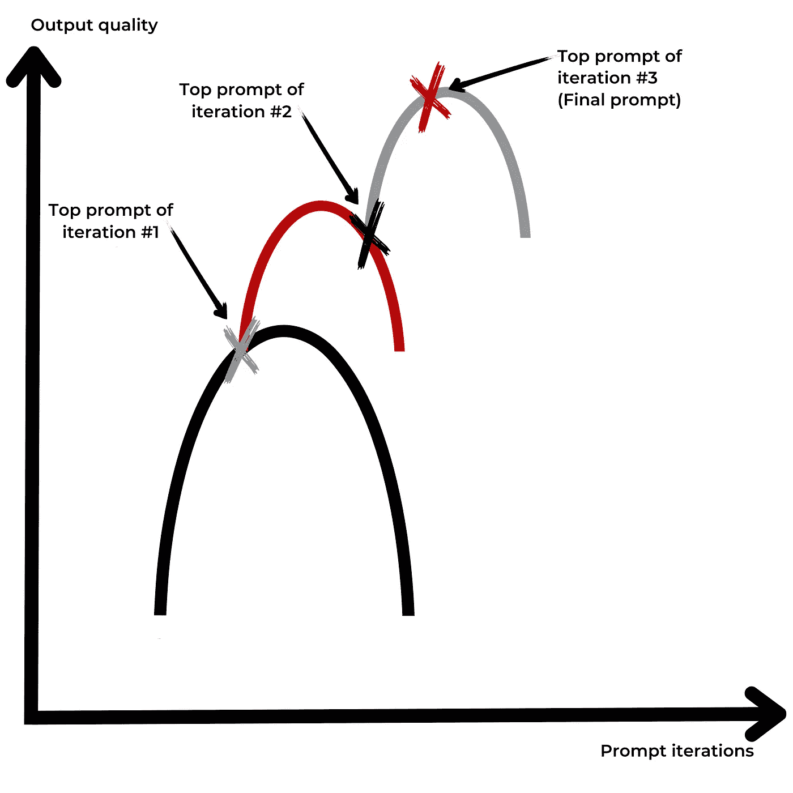

说æ˜äº†è¿ç»­çš„æ示迭代链如何改进你的最终æ示。

ä½ å¯ä»¥ä½¿ç”¨ä»¥ä¸‹æ¡†æ¶æ¥å¼€å§‹è¿­ä»£è¿‡ç¨‹ã€‚

1.  使用多例æ示æ¥ç”Ÿæˆæƒ³æ³•ã€‚

    **“请给我æ供一个关äºå¦‚何改进这个æ示/å“应的建议列表。â€**

1.  使用**æ示修订/伯纳德**æ¥æ”¹è¿›ä½ çš„æ示。

1.  用**ä¸åŒçš„è¯**é‡å†™ç›¸åŒçš„æ示，并检查å“应。ä¸åŒçš„è¯è§¦å‘ä¸åŒçš„å“应。

1.  **为你使用的æ¯ä¸ªæ¨¡å‹åˆ›å»ºä¸€ä¸ªæ示库**。确ä¿å®šæœŸæ›´æ–°ä½ çš„库。

1.  研究语言模å‹çš„工作åŸç†ï¼Œäº†è§£å®ƒä»¬å¦‚何生æˆå“应。

æ¯å½“你的输出陷入僵局时，对你的æ示进行一些调整æ¥æ¨åŠ¨å®ƒã€‚å°è¯•ä¸åŒçš„动è¯ã€‚æ··åˆæ示技巧。切æ¢æ¨¡å‹ã€‚ç¡ä¸€è§‰ã€‚æ˜å¤©é‡æ–°å¼€å§‹ã€‚

# 💡 力é‡è¶Šå¤§â€¦

我们在弄清楚涉åŠçš„é£é™©ä¹‹å‰å°±æŠŠäººå·¥æ™ºèƒ½ç²¾çµæ”¾å‡ºäº†ç“¶å­ï¼Œæ›´ä¸ç”¨è¯´å¦‚何处ç†å®ƒä»¬äº†ã€‚

我特别担心大规模的错误信æ¯ã€‚但还有其他é£é™©ï¼Œæ¯”如工作市场的快速转移，æ示注入攻击，诈骗，以åŠæœ€ç»ˆçš„对é½é—®é¢˜ã€‚

ç›®å‰ï¼Œæˆ‘们能åšçš„最好的事情就是学会如何利用生æˆå¼äººå·¥æ™ºèƒ½åˆ›é€ æ›´å¤šçš„利大äºå¼Šã€‚

下é¢ä½ ä¼šå‘ç°å…­æ¡çŸ­å°çš„é“德规则，它们似ä¹æ˜¯æ˜¾è€Œæ˜“è§çš„，但ä»ç„¶å€¼å¾—一æ。

1.  **ä¿æŒé“德标准：**åšæŒä½ çš„é“å¾·åŸåˆ™ï¼Œé¿å…使用促进有害æ€æƒ³æˆ–错误信æ¯çš„ AI 生æˆå†…容。

1.  **é€æ˜ï¼š**清楚地披露在你的内容创作过程中使用人工智能，这样你的观众就知é“他们消费的信æ¯çš„æ¥æºã€‚

1.  **å°† AI 用作å‡çº§ï¼Œè€Œä¸æ˜¯æ›¿ä»£ï¼š**科技公å¸å°†åšå‡ºé€‰æ‹©ï¼šè¦ä¹ˆç”¨å分之一的人员达到相åŒçš„结æœï¼Œè¦ä¹ˆä¿æŒç›¸åŒæ•°é‡çš„员工，产出åå€çš„æˆæœã€‚å者选项æ绘了一个更光æ˜çš„未æ¥ã€‚

1.  **验è¯äº‹å®å’Œå‡†ç¡®æ€§ï¼š**始终è¦ä»”细检查由 AI èŠå¤©æœºå™¨äººç”Ÿæˆçš„ä¿¡æ¯ã€‚åŒæ ·é€‚用äºä»£ç ã€‚错误信æ¯å’Œæœ‰å®³ä»£ç å¯èƒ½ä¼šè¿›å…¥ä½ çš„输出。打开你的怀疑模å¼ã€‚

1.  **永远ä¸è¦æ³„露æ•æ„Ÿæ•°æ®ï¼š**OpenAI[记录](https://www.androidauthority.com/does-chatgpt-save-data-conversations-3310883/)äº†ä½ ä¸ ChatGPT 的所有交æµã€‚其他公å¸å¯èƒ½ä¹Ÿæ˜¯å¦‚此。å‡è®¾ä½ è¾“入到èŠå¤©æœºå™¨äººä¸­çš„一切都å¯èƒ½æ³„露。

1.  **注æ„åè§ï¼š**èŠå¤©æœºå™¨äººå¯èƒ½æ— æ„中延续其训练数æ®ä¸­å­˜åœ¨çš„åè§ã€‚è¦ä¿æŒè­¦æƒ•ã€‚ä½ å¯ä»¥ä½¿ç”¨ç‰¹å®šæ示æ¥é™åˆ¶åè§ï¼Œé€šè¿‡è¦æ±‚语言模å‹è€ƒè™‘多个观点或æ供一个平衡的观点。

```py
**[Example of an anti-bias prompt]**
Please treat people from different socioeconomic statuses, sexual orientations, religions, races, physical appearances, nationalities, gender identities, disabilities, and ages equally. When you don't have sufficient information, you should choose the unknown option, rather than making assumptions based on stereotypes present in your training data.
```

# 结论

æ示工程将世界分为两个阵è¥ã€‚第一个将其视为一个 bug——其根本论点是 AI 模å‹å°†è¶Šæ¥è¶Šæ“…é•¿å›åº”自然语言。有å¯èƒ½çš„未æ¥æ˜¯ï¼ŒAI 模å‹å°†èƒ½å¤ŸçŒœæµ‹æˆ‘们想让它们åšä»€ä¹ˆï¼Œç±»ä¼¼äºç¤¾äº¤åª’体算法å¯ä»¥çŒœæµ‹æˆ‘们想看到哪些内容。

第二个阵è¥å°†æ示工程视为æ˜å¤©å·¥ä½œå¸‚场上的一项必ä¸å¯å°‘的技能。其论点是生æˆå¼äººå·¥æ™ºèƒ½æ¨¡å‹å°†æ— å¤„ä¸åœ¨ã€‚我们将使用它们æ¥ç¼–写代ç ï¼Œç”ŸæˆæŠ¥å‘Šï¼Œåˆ†ææ•°æ®ï¼Œç”šè‡³å‡†å¤‡ç ”讨会。在这ç§æƒ…况下，æ示工程就åƒå†™ï¼ˆéæ— èŠçš„）电å­é‚®ä»¶ä¸€æ ·é‡è¦ã€‚

世界ä»æ¥ä¸æ˜¯é»‘白分æ˜çš„，而总是一些ç°è‰²çš„阴影——Prompt Engineering 的未æ¥ä¹Ÿä¸ä¾‹å¤–。你å¯ä»¥èµŒä¸€æŠŠï¼Œä¹Ÿå¯ä»¥è°¨æ…行事。如æœä½ æ高了你的æ示工程技能，结æœè¯æ˜å®ƒæ˜¯ä¸€ä¸ªçŸ­æš‚的技能，那么你将失å»å‡ å个å°æ—¶çš„生活。

相比之下，如æœä½ å¿½è§†äº†æ示工程，那么以å它å¯èƒ½ä¼šæˆä¸ºä½ é”™è¿‡æ½œåœ¨èŒä¸šæ™‹å‡çš„一项ä¸å¯å¦¥å的技能。所以这å¯èƒ½æ˜¯å€¼å¾—绕é“而行的。

# å‚考文献（无特定顺åºï¼‰

+   *é­, J., ç‹, X., Schuurmans, D., Bosma, M., Ichter, B., å¤, F., é½, E., ä¹, Q., & 周, D.* [***æ€ç»´é“¾æ示引å‘大å‹è¯­è¨€æ¨¡å‹çš„æ¨ç†***](https://arxiv.org/abs/2201.11903) ***—*** *(2022).*

+   *å°å²›, T., 顾, S. S., Reid, M., æ¾å°¾, Y., & 岩沢, Y.* [***大å‹è¯­è¨€æ¨¡å‹æ˜¯é›¶-shot æ¨ç†å™¨***](https://arxiv.org/abs/2205.11916) ***—*** *(2022).*

+   *刘, J., 刘, A., å¢, X., Welleck, S., West, P., Bras, R. L., Choi, Y., & Hajishirzi, H.* [***生æˆçš„知识æ示用äºå¸¸è¯†æ¨ç†***](https://arxiv.org/abs/2110.08387) ***—*** *(2021).*

+   *ç‹, X., é­, J., Schuurmans, D., ä¹, Q., é½, E., Narang, S., Chowdhery, A., & 周, D.* [***自洽性改善语言模å‹çš„æ€ç»´é“¾æ¨ç†***](https://arxiv.org/abs/2203.11171) ***—*** *(2022).*

+   *周, D., Schärli, N., 侯, L., é­, J., Scales, N., ç‹, X., Schuurmans, D., å´”, C., Bousquet, O., ä¹, Q., & é½, E.* [***ä»æœ€å°‘到最多æ示使大å‹è¯­è¨€æ¨¡å‹èƒ½å¤Ÿè¿›è¡Œå¤æ‚æ¨ç†***](https://arxiv.org/abs/2205.10625) ***—*** *(2022).*

+   Geunwoo Kim, Pierre Baldi, Stephen McAleer. [***语言模å‹å¯ä»¥è§£å†³è®¡ç®—机任务***](https://arxiv.org/abs/2303.17491) —*(2023)*.

+   Murray Shanahan, Kyle McDonell, Laria Reynolds. [大å‹è¯­è¨€æ¨¡å‹çš„角色扮演](https://arxiv.org/abs/2305.16367) —*(2023)*.

+   Alex Albert. [***越狱èŠå¤©***](https://www.jailbreakchat.com/) —*(2022–2023)*.

+   Sander Schulhoff, Anaum Khan, Fady Yanni. [***LearnPrompting.com***](https://learnprompting.org/) —*(2023)*.

+   Jiachang Liu, Dinghan Shen, Yizhe Zhang, Bill Dolan, Lawrence Carin, Weizhu Chen. [***GPT-3 的上下文示例是什么样的？***](https://arxiv.org/abs/2101.06804) —*(2021)*.

+   Lilian Weng. [***æ示工程***](https://lilianweng.github.io/posts/2023-03-15-prompt-engineering/)—*(2023)*.

+   认知é©å‘½ Youtube 频é“。 [***用 Riley Goodside æ示 ChatGPT 的艺术***](https://www.youtube.com/watch?v=zg3H-9nxkyI&ab_channel=CognitiveRevolution%22HowAIChangesEverything%22) —*(2023)*.

+   Giuseppe Scalamogna; ***æ–°çš„ ChatGPT æ示工程技术：程åºæ¨¡æ‹Ÿ*** —*(2023)*.

+   Sang Michael Xie, Sewon Min. [***上下文学习是如何工作的？***](http://ai.stanford.edu/blog/understanding-incontext/)—*(2022)*.

+   Alberto Romero. [***æ示工程å¯èƒ½æ¯”你想象的更é‡è¦***](https://thealgorithmicbridge.substack.com/p/prompt-engineering-is-probably-more)—(2023).

+   Zekun Li, Baolin Peng, Pengcheng He, Michel Galley, Jianfeng Gao, Xifeng Yan.[***通过定å‘刺激æ示引导大å‹è¯­è¨€æ¨¡å‹***](https://arxiv.org/abs/2302.11520)*—(2023).*

+   Yao Fu, Hao Peng, Tushar Khot. [***GPT 是如何è·å¾—其能力的？***](https://yaofu.notion.site/How-does-GPT-Obtain-its-Ability-Tracing-Emergent-Abilities-of-Language-Models-to-their-Sources-b9a57ac0fcf74f30a1ab9e3e36fa1dc1) *—(2022).*

**å…³äºå›¾ç‰‡çš„说æ˜ï¼š** 除éå¦æœ‰è¯´æ˜ï¼Œæ‰€æœ‰å›¾ç‰‡å’Œæˆªå›¾å‡ç”±ä½œè€…æ供。

# è”系方å¼

+   [æˆä¸º Medium 会员，在这里支æŒæˆ‘](https://nabil-alouani.medium.com/membership)。

+   [加入我的 Subtack](https://nabilalouani.substack.com/)。

+   给我写å°é‚®ä»¶ï¼šnabil@nabilalouani.com。
