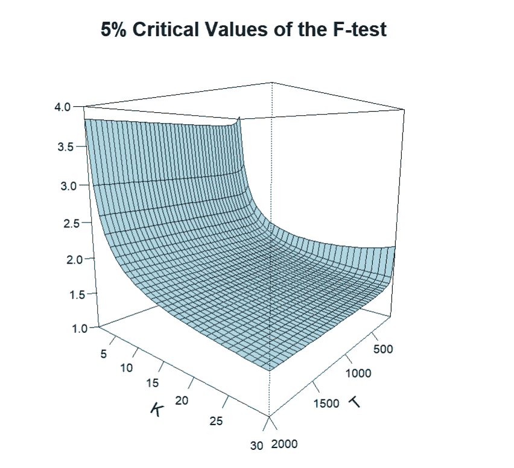
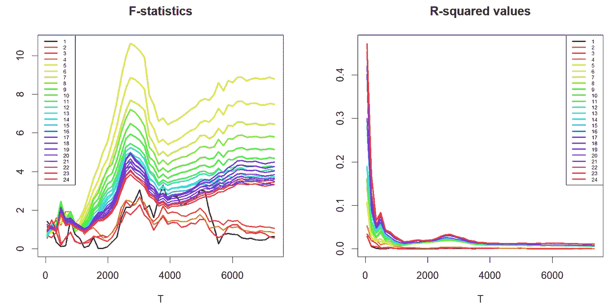
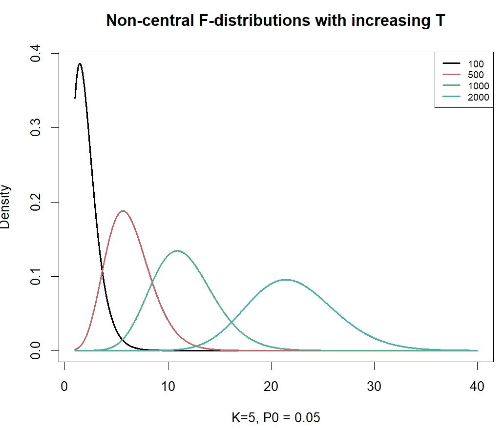
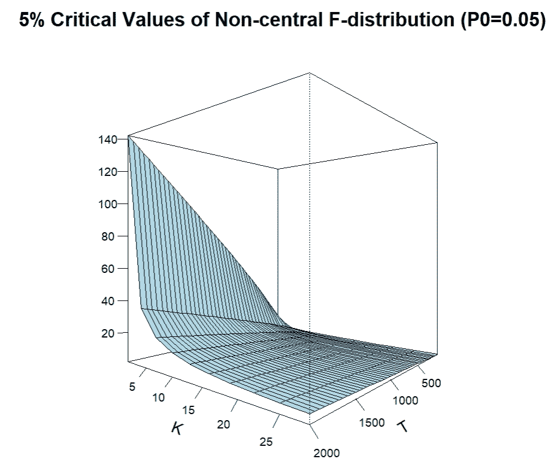
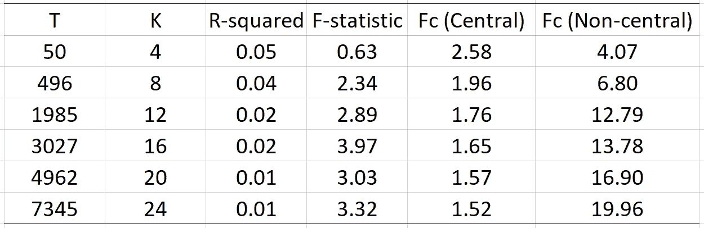

# F 检验在线性回归中有多大用处？

> 原文：[`towardsdatascience.com/how-useful-is-f-test-in-linear-regression-db4fd35b740f`](https://towardsdatascience.com/how-useful-is-f-test-in-linear-regression-db4fd35b740f)

 [Jae Kim](https://medium.com/@jaekim8080?source=post_page-----db4fd35b740f--------------------------------)

·发表于[Towards Data Science](https://towardsdatascience.com/?source=post_page-----db4fd35b740f--------------------------------)·阅读时间：8 分钟·2023 年 4 月 29 日

--

不是很多，但我们可以改进它。

照片由[Greg Rakozy](https://unsplash.com/@grakozy?utm_source=medium&utm_medium=referral)在[Unsplash](https://unsplash.com/?utm_source=medium&utm_medium=referral)上拍摄

在回归输出中，联合斜率系数的 F 检验统计量通常与其他关键统计量（如 R² 和 t-比率值）一起报告。

问题是它作为一个关键统计量是否有用或信息丰富。它是否为回归结果增加了任何价值？虽然它经常被报告，但在实际应用中，我们会发现 F 统计量几乎总是拒绝 H0。这对回归的拟合优度告诉我们什么？你经常会发现 R² 的值非常低，但 F 检验说模型具有统计显著性的解释能力。这不是一种矛盾的结果吗？我们如何解决这个问题？

在这篇文章中，我将解释与 F 检验相关的问题以及如何修改它，使其成为一个有用的工具。我要感谢 Venkat Raman 的[LinkedIn 帖子](https://www.linkedin.com/posts/venkat-raman-analytics_statistics-datascience-datascientists-activity-7053981090830594048-COe0?utm_source=share&utm_medium=member_desktop)，这篇文章受到了他的启发。R 代码、数据和支持文档可以从[这里](https://github.com/jh8080/Ftest/tree/main)获取。

内容如下：

+   线性回归中的 F 检验是什么？

+   针对样本大小（T）和解释变量数量（K）的临界值

+   针对 T 和 K 的 F 统计量

+   示例

+   为什么会发生这种现象？

+   F 检验如何进行修改？

## 1\. 线性回归中的 F 检验是什么？

考虑一个线性回归模型

方程（1）：作者创建的图像

其中*Y*是因变量，*X*是自变量，*u*是误差项，其遵循均值为 0、方差固定的正态分布。检验的原假设是

作者创建的图像

对于至少一个β ≠ 0 的 H1 进行检验。P²是系数决定的总体值，而 R²是其样本估计值。

· 在 H0 下，*X*变量对*Y*没有解释能力，P² = 0。

· 在 H1 下，至少一个*X*对*Y*有解释能力，P² > 0。

众所周知，R²是 K 的一个递增函数。也就是说，随着模型中添加更多的解释变量，R²会增加。

F-检验统计量的公式为

方程（2）：作者创建的图像

其中 SSR0 是 H0 下的残差平方和，SSR1 是 H1 下的残差平方和，T 是样本量。如上所述，F-检验统计量也可以用 R²来表示。

统计量服从（中心）F-分布，自由度为(K, T-K-1)，表示为 F(K, T-K-1)。在α水平的显著性水平下，如果 F > Fc(α)，则拒绝原假设，其中 Fc(α)是来自 F(K, T-K-1)的α水平临界值。

## 2\. 对 K 和 T 的临界值的响应

让我们首先看看临界值 Fc(α)如何随样本量和解释变量的值的变化而变化。

图 1：作者创建的图像

上图 1 显示，当 K 的值或 T 的值增加时，5%的临界值下降。这意味着，随着样本量或解释变量的数量增加，拒绝 H0 的门槛变得更低。请注意，对于其他α水平的临界值，这个特性也是明显的。

## 3\. F-检验统计量对 T 和 K 的响应

从上面方程（2）中给出的公式可以清楚地看出，F-统计量的值由 T、K 和 R²决定。更具体地说，

+   只要 R²的值不随 T 的增加而减小，对于给定的 K 值，F-统计量是 T 的一个递增函数；

+   当 R²的值随 T 的减小而减小时，如果增加 T 的效果超过了减小的 R²/(1-R²)的效果，F-统计量仍然会随 T 的增加而增加；

+   对于给定的 T 值，F-统计量是 K 的一个递增函数，因为如上所述，R²的值随 K 的增加而增加。

上述观察结果表明，在实践中，F-统计量很可能是 T 和 K 的一个递增函数。然而，F-临界值随着 T 和 K 的增加而下降，如图 1 所示。因此，在现代，当 T 和 K 的值很大时，通常情况下 F > Fc(α)，经常拒绝原假设。

## 4\. 一个例子

我考虑了一个数据集，其中包括太阳黑子数（*Y*）和不同股票市场（*X*1, …, *XK*）的股票回报，从 1988 年 1 月到 2016 年 2 月每天进行观测（7345 次观测）。这是一个没有经济合理性的关系的荒谬回归。如果 F 检验是有用且有效的，它几乎总是应该未能拒绝 H0，而 R²的值预计接近 0。

股票回报来自 24 个股票市场（K = 24），包括阿姆斯特丹、雅典、曼谷、布鲁塞尔、布宜诺斯艾利斯、哥本哈根、都柏林、赫尔辛基、伊斯坦布尔、吉隆坡、伦敦、马德里、马尼拉、纽约、奥斯陆、巴黎、里约热内卢、圣地亚哥、新加坡、斯德哥尔摩、悉尼、台北、维也纳和苏黎世。

我对(Y, X1, …, XK)的回归进行了逐步增加样本量和股票市场数量的分析，即增加 T 和 K 的值。也就是说，第一次回归从(T = 50, K =1)开始，然后是(T = 50, K =2)，…，(T = 50, K = 24)，接着是(T = 198, K =1)，…，(T = 198, K = 24)，依此类推，这个过程一直持续到最后一组回归，即(T = 7345, K = 1)，…，(T = 7345, K = 24)。

图 2：图例中的数字是 K 值，图片由作者创建

如上图 2 所示，F 检验统计量的值通常随着样本量的增加而增加，对于大多数 K 值来说，它们大于 5%的临界值 Fc（在大多数情况下远低于 2），在大多数情况下拒绝 H0。相反，R²的值随着样本量的增加而接近 0，对于所有 K 值来说。

这意味着 R²有效地告诉我们回归模型毫无意义，但 F 检验却在大多数情况下未能拒绝 H0。两个关键统计数据显示了两种相互矛盾的结果。

## 5\. 为什么会出现这种现象？

这并不意味着罗纳德·费舍尔开发的 F 检验理论是错误的。这个理论是正确的，但只有*当 H0 确切地和字面上为真*时才有效。也就是说，当 P² = 0 或所有斜率系数都是 0，*确切地*没有任何偏差时。然而，在研究人员使用观测数据的现实世界中，这种情况是不会发生的：R²的值可以接近 0，但绝对不可能是零。因此，这个理论只在统计教科书中或在受控的蒙特卡洛实验中计算时才有效。

我们还应该记住，F 检验是在 20 世纪 20 年代开发的，当时 T 和 K 的值分别只有 20 和 3，而现代我们遇到的 T 和 K 的值是当时无法想象的。

## 6\. F 检验如何修改？

上面已经确定了 F 检验的主要问题：

> 测试的临界值随着 T 和 K 的值的增加而减小，而测试统计量的值则增加。

如上所述，这是因为 F 检验是针对 H0: P² = 0，但其样本估计 R²永远不会完全和字面上达到 0。因此，一般情况下，即使 R²减少到一个实际上可以忽略的值，F 检验统计量也会随着样本量的增加而增加。

我们该如何解决这个问题？事实上，解决方案非常简单。我们应该进行以下形式的单侧检验，而不是像传统的 F 检验那样测试 H0: P² = 0：

H0: P² ≤ P0; H1: P² > P0

这是基于这样的论点，即对于一个模型来说，其 R²值应该至少为 P0 才具有统计重要性。假设 P0 设定为 0.05。在 H0 下，任何小于 0.05 的 R²值都可以忽略不计，该模型被视为实质上不重要。研究人员可以根据研究的背景选择其他 P0 的值。

在 H0: P² ≤ P0 的情况下，F 统计量遵循非中心 F 分布 F(K,T-K-1; λ)，其中λ是非中心参数，由下式给出

作者创作的图片

很明显，当 P0 = 0 时，如传统的 F 检验，λ的值为 0，F 统计量遵循中心 F 分布 F(K,T-K-1)。从上述表达式清楚地看出，对于 P0 > 0，λ是样本量 T 的增函数。因此，临界值 Fc(α)也是样本量的增函数。

图 3：作者创作的图片

上面的图 3 展示了当 K = 5 且 P0 = 0.05 时，非中心分布 F(K,T-K-1:λ)在 T 从 100 增加到 2000 的一系列值下的情况。λ的增加值使得分布远离 0，以及它们的 5%临界值。

图 4：作者创作的图片

上面的图 4 展示了当 P0 = 0.05 时，作为 T 和 K 的函数的性质。例如，当 T = 1000 且 K = 25 时，Fc(α) = 4.27；当 T = 2000 且 K = 25 时，Fc(α) =6.74，其中α = 0.05。

这个检验的更多细节可以在工作论文中找到（目前正在审阅中），其 pdf 副本可从[这里](https://github.com/jh8080/Ftest/tree/main)获取。

回到我们的太阳黑子回归的例子，可以进行 H0: P² ≤ 0.05; H1: P² > 0.05 的检验。所选案例的结果总结如下，其中α = 0.05：

太阳黑子回归的选定案例：作者创作的图片

除了 T = 50 时，F 统计量大于中心 F 分布的临界值，这意味着 H0: P² = 0 在 5%的显著水平下被拒绝，尽管 R²值可以忽略不计。然而，F 统计量小于非中心 F 分布的临界值，这意味着 H0: P² ≤ 0.05 在 5%的显著水平下不能被拒绝，与 R²值可以忽略不计一致。

总之，F 检验在测试回归模型的拟合优度时存在严重问题，特别是当样本量或解释变量的数量较大时。它经常与低 R²值相冲突，表明模型的影响微乎其微。因此，目前的形式下，F 检验并不适用于拟合优度的测试。然而，通过简单修改，该测试可以变得有用，本文已经通过一个例子介绍了这一点。
