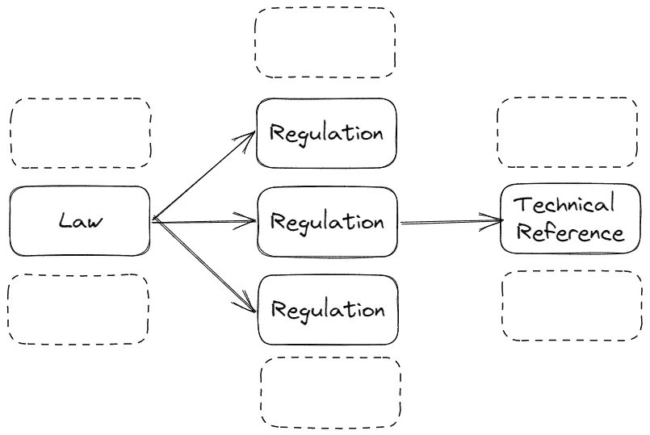
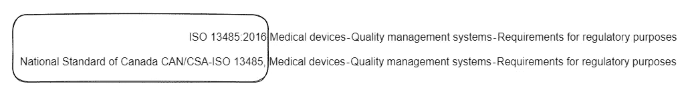
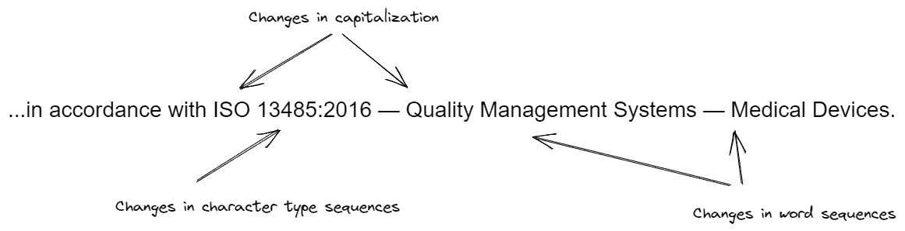
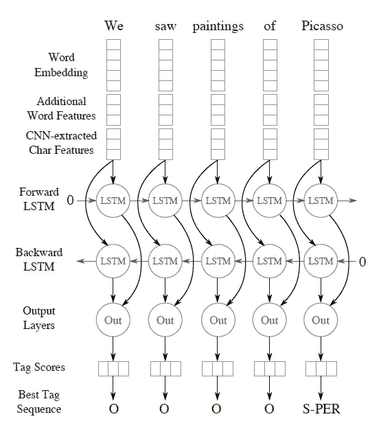
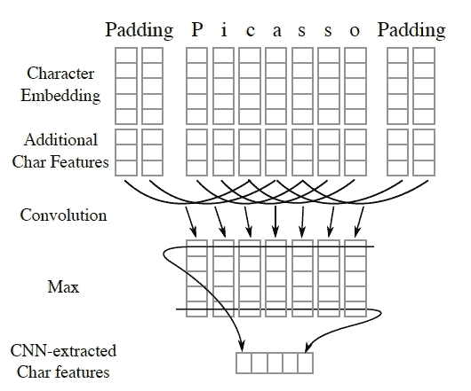
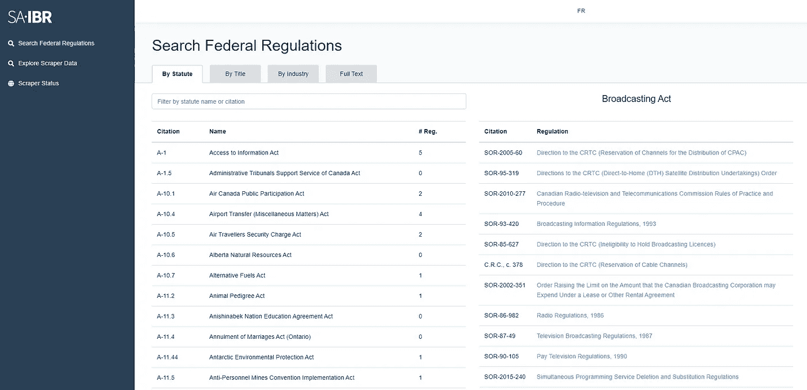
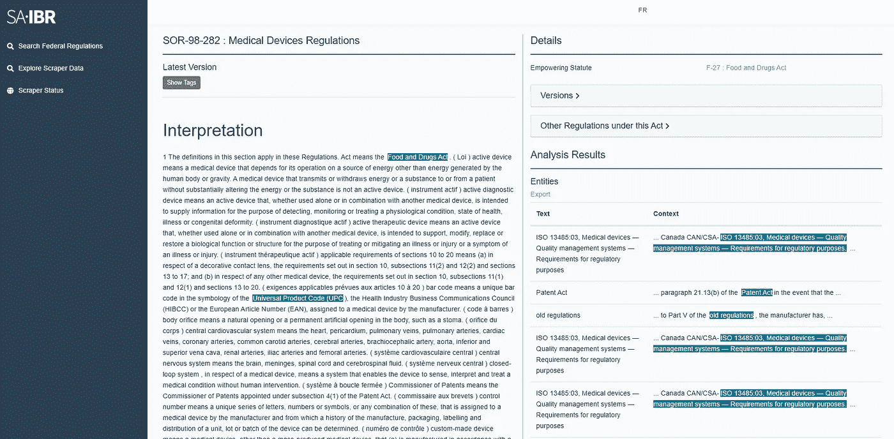
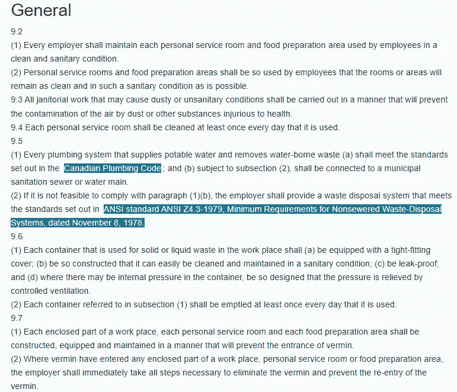

# 我们如何赢得了第一个政府 AI 项目

> 原文：[`towardsdatascience.com/how-we-won-our-first-government-ai-project-8c67e58c22f0?source=collection_archive---------16-----------------------#2023-04-14`](https://towardsdatascience.com/how-we-won-our-first-government-ai-project-8c67e58c22f0?source=collection_archive---------16-----------------------#2023-04-14)

## 加拿大先导参与项目的故事

 [Mathieu Lemay](https://medium.com/@lsci?source=post_page-----8c67e58c22f0--------------------------------)

·

[关注](https://medium.com/m/signin?actionUrl=https%3A%2F%2Fmedium.com%2F_%2Fsubscribe%2Fuser%2Ff84a70d8f74&operation=register&redirect=https%3A%2F%2Ftowardsdatascience.com%2Fhow-we-won-our-first-government-ai-project-8c67e58c22f0&user=Mathieu+Lemay&userId=f84a70d8f74&source=post_page-f84a70d8f74----8c67e58c22f0---------------------post_header-----------) 发表在[Towards Data Science](https://towardsdatascience.com/?source=post_page-----8c67e58c22f0--------------------------------) ·14 分钟阅读·2023 年 4 月 14 日

--

照片由[Tetyana Kovyrina](https://www.pexels.com/photo/photo-of-beige-and-green-castle-1045915/)拍摄，来源于 pexels.com。此外，骑行时可以欣赏到[亚历山大桥](https://goo.gl/maps/etXAjFNn4JGyHfKf9)的美丽景色。

# **目录**

+   概述

+   保持法律法规的最新

+   定义新的采购流程

+   人工智能引擎

+   导航监管库存

# 概述

早在 2018 年初，我们参与了加拿大联邦政府的创新采购工具，目标很简单：找到有助于现代化所有法律和法规的创新。这一创新采购工具有许多目标：

+   识别过时、负担沉重或根本不适用的法律；

+   比较其他国家和地区的法律，以了解如何在特定领域（例如健康或能源部门）应用领域特定的法规；

+   在法规的存货中检索第三方参考资料。

幸运的是，我们赢得了通过使用定制 NLP 平台来帮助现代化加拿大法规的竞标。然而，所有发生在这个项目之前的事情都以某种方式影响了该项目。

这是一个关于政府采购、人工智能采纳以及利用技术解决现实世界问题的故事。

# 使法律和法规保持最新

每个政府都有一个要求，确保法律不仅对所有公民公平，而且适用。几个世纪以来，哲学家们一直在争论和辩论个人在社会中的关系，而公平和平等的概念通常是民主社会中的主要驱动力。

正如我们在政府两极分化中看到的那样，法律的采用速度可能会非常缓慢。通常，民选官员会通过一项法律，将一系列责任分配给一个机构或部门。这个负责的机构可以在其任期内根据需要更新法规。

没有任何法律是石刻的，但它们通常被认为是相对固定的。然而，随着技术的发展，创新通常超越了标准法律程序的速度。政府应该仅在技术开始对其民众造成伤害时才进行干预吗？还是应该有一个系统来更快地应对社会问题？

所有层级的法规使用的一个重要工具是**在法规中引入技术参考**。这种整合允许法规保持相关性，通过指向外部信息源，从而有能力通过指向更新的标准来更新法规。

## 在法规中整合文档的机制

简单的义务传递如下：

+   法案将规定，“遵循法规”，并授权一个负责的机构（如部门）来管理和更新该法规；

+   该法规将规定，“应用标准”；

+   标准将包含所有规定的公民和组织所需的活动。

法律、法规与技术参考之间的关系。图片由作者提供。

## 参考文献的整合：双刃剑

监管机构如何在每个工业和技术领域专门化并设计法律法规？简单的答案是：他们做不到。技术细节变化太快，专家无法列出所有参与者应遵循的义务。因此，考虑到各种标准定义组织（SDO）如[国际标准化组织（ISO）](https://www.iso.org/)提供的优质工作，纳入这些专家指南以减少审查时间，并使法律具有相关性和适用性，是有意义的。

然而，这一过程的另一面是相当严重的问题：**将专业知识外包给外部代理可能构成非法放弃民主**。简单来说，非选举产生的官员在法规中制定指令。

如果技术监督的责任被推给 SDO，那么民主如何保持对其法律的控制？通过审查、更新和管理每次监管审查中要纳入的标准。

然而，快速发生的情况是，这些法规中出现的参考资料过多，审查法规以查找散布的参考资料的认知负担急剧上升，每次审查需耗费数千小时。

实际上，这个项目的真正动机是手动工作的成本。所有这些复杂性加在一起意味着需要大量的人力来审查和更新这些法规。与我们共享的 KPI 是：**每次审查需要 1,500 个工时**。

*想在家里玩？尝试查找* [*加拿大职业健康与安全法规*](https://laws-lois.justice.gc.ca/eng/regulations/sor-86-304/FullText.html)*中的所有参考资料！提示：其中一些以“CSA”开头，但并非全部！*

## 自动化的需求

为什么这是一个机器学习问题？从逻辑上讲，人们应该认为 IBR 列表在某处是可用的。另外，为什么我们不能简单地从几个 SDO 下载列表并进行字符串匹配呢？

我们尝试了所有这些。我们很快确认了加拿大司法部和各部门提出的问题。主列表更像是遗留知识而非系统记录，许多团队成员离开时带走了所有参考位置。

以标准为例——[ISO 13485](https://www.iso.org/standard/59752.html)。（我的第一份工作是在医疗设备领域，因此这个标准一直在我心中。）该法规的正式标题是**“**[***ISO 13485:2016***](https://www.iso.org/standard/59752.html) ***医疗器械 — 质量管理体系 — 监管要求”***。整个标题。如此复杂的标题中，字符串匹配可能出现许多问题。我们发现的一些问题是：

+   **错误的字符。**许多标准在其标题中使用了长破折号而不是短破折号（“⁠ — “与“-”）。

+   **官方名称与解释性名称。** 有时冒号位置不正确，额外的字符（空格和标点）被错误地添加。

+   **简短名称。** 在一个文件被完整纳入后，缩写版本（例如，“ISO 13485”）。

+   **地理名称。** 国家级标准制定组织（如 NIST 或 CSA）会重新解释标准，使其在本国稍微更具适用性，因此标题会略微变化（前缀为“CAN/CSA”）。

回到 ISO 13485 的例子，这里是[医疗器械法规](https://laws.justice.gc.ca/eng/regulations/SOR-98-282/FullText.html)中的一个引用：“[…] *(f) 一份质量管理体系证书的副本，证明制造该设备的质量管理体系符合 N****ational Standard of Canada CAN/CSA-ISO 13485, Medical devices — Quality management systems — Requirements for regulatory purposes****，并根据需要进行修订。[…]”*

不一样。这个问题在所有标准中都存在。图片由作者提供。

我们确实通过早期字符串匹配找到了一些例子，并开始建立我们的数据集，但从根本上说，这并不是一个可靠的方法，当然也不会提供任何程度的保证。

除了加拿大司法部报告的困难外，所使用的语言还有一些额外的问题，需要本项目解决：

+   **真正的纳入与仅仅的引用。** 仅仅因为一个文件被提及并不意味着它具有法律约束力。因此，必须明确区分文件是如何被提及的。

+   **静态引用与动态引用。** 引用是否指向标准或文件的特定版本，还是指向该文件的最新版本？该文件是否可以在相关机构不知情的情况下进行更新？

+   **过时的标准。** 文件是否仍然适用？文件是否仍然*可检索*自标准制定组织？如果其引用的标准全部被废止，政府是否仍然能够从根本上执行相关规定？

因此，需要一个能够自动化所有这些过程的工具。

*旁注：我最喜欢的纳入方式仍然是* [*Mushuau Innu First Nation Band Order (SOR/2002–415)*](https://laws-lois.justice.gc.ca/eng/regulations/SOR-2002-415/page-1.html)*：*

> 在本命令中，“采纳”包括按照因纽特传统的采纳。

# 定义新的采购流程

推动政府创新，任何衡量标准下都绝非易事。在这个特定的情况下，时机更是糟糕。许多公开的谴责导致部门不愿与这一过程相关联，加拿大公共服务学院（CSPS，一个帮助改善政府功能的非政治实体）承担了责任的负担。

为了克服这些挑战，采购人员主导了定义新的采购流程，该流程更紧密地与技术领域的采购对接，允许根据能力选择大量供应商，然后根据愿意投标的意愿从中选择少数供应商，最后邀请这些供应商提交投标。这个监管创新列表是今天 AI 供应商列表的原型。

以下是导致制定此列表的一些总结因素：

+   2016 年 3 月：监管法规审查常务委员会发布了一系列建议，解决与引用实践相关的问题。初步努力旨在解决建议 4，“*[…] 修改《法定文书法》，建立一个包含引用材料的中央存储库，并要求制定法规的机关每年提供一份所有引用文档的列表。*” 这是在一系列诉讼之后，诉讼声称任何和所有在监管文档中表示的文件都应免费提供。因此，需要识别所有可用的参考资料，以评估参与特定行业的财政负担。

+   2018 年春季：**尖锐**的审计长 2018 年报告公布，涉及加拿大最大 IT 迁移项目，结果确实不尽如人意。[列举了许多关于凤凰薪酬系统改革的忽视问题](https://www.oag-bvg.gc.ca/internet/English/parl_oag_201805_00_e_43032.html)，审计长称其为“[***难以理解的失败***](https://www.theregister.com/2018/05/29/canada_phoenix_payroll_system_audit/)”。IT 采购过程必须发生改变，这威胁到最初的 AI 采购工作和 IBR 项目。

+   2018 年 5 月：在踏入任何风险投资之前，财政委员会秘书处（在之前的文章中描述）决定邀请行业参与者，以更好地了解 AI 在管理法规库存方面的潜力。在[人工智能行业日](https://buyandsell.gc.ca/procurement-data/tender-notice/PW-18-00828244)上，“*[…] TBS [在] 寻找行业合作伙伴和学术研究人员，以帮助将人工智能方法如高级数据分析（ADA）和机器学习（ML）应用于各种类型、范围和复杂性的法规。*”

+   2018 年 6 月至 9 月：尽管对最新技术的发展感到自信，但担心另一个 IT 采购灾难，TBS 请求加拿大公共服务学院（一个尽可能不带政治色彩的政府组织）主导[制定一个能够提供 AI 服务的公司列表](https://buyandsell.gc.ca/procurement-data/tender-notice/PW-18-00832114)的采购过程。获胜者的总合同金额？***$1.00。***

+   2018 年 11 月：与我们的咨询合作伙伴 [MNP](https://www.mnp.ca/) 一起，我们受邀竞标 *CSPS-RFP-18LL-1593：演示项目，试点应用人工智能方法于引用法规*，这是一个仅限预审供应商的项目。所有供应商都从演示日资格审查过程中选出。

+   这一过程取得了成功，我们的联合体赢得了它，使得政府能够推进这一新项目。*“PSPC 正与加拿大公共服务学院 (CSPS) 合作，首次采购使用 AI 来源列表。* [*招标公告*](https://buyandsell.gc.ca/procurement-data/tender-notice/PW-EE-017-34665) *用于 CSPS 互动监管评估平台的招标于 2019 年 2 月 28 日在 BuyandSell.gc.ca 上发布。” (*[*来源*](https://www.tpsgc-pwgsc.gc.ca/app-acq/cral-sarc/iava-aipv-eng.html)*)*

作为现在的联邦 AI 供应商列表的原型，加拿大公共服务学院是一个主要的项目拥有者。该部门专注于通过培训、教育和意识提升公共服务劳动力，是一个令人耳目一新的非党派职能——每个人都希望政府更加高效。

# AI 引擎

让我们为这个项目提供一些背景。

+   这是一个实体识别问题，但大多数实体无法从中央列表中检索到（这个项目的一个目的实际上是生成这个列表）。

+   我们必须考虑许多潜在的 OOV 问题，因为我们不想错过任何被遗忘的 SDO。

+   实际的合同范围是在 2017 年，因此 [BERT](https://arxiv.org/abs/1810.04805) 当时甚至尚未发布。变压器技术本来会是*很棒的*。

我们采取的方法基于 Chiu 和 Nichols (2016) 的论文，题为 [**双向 LSTM-CNN 的命名实体识别**](https://arxiv.org/abs/1511.08308)。感谢我的团队不懈地研究所有潜在的 NER 论文。当时，这篇论文不仅在 NER 任务中表现最佳，而且在处理前所未见的实体时显示出最高的成功率，这一点在这里非常重要。

加拿大司法部通过提供机器可读格式的整个加拿大法规库让我们的工作稍微轻松了一些。然而，没有可用的训练数据，也没有实体的起始示例，只有一些人丢失关键便条的可怕故事。

我们进行了数周的面谈，与员工讨论他们知道哪些标准，并获得了大量支持，以识别可以指示引用存在的启发式方法。“*… 根据 X*”，“*不时修订*”以及其他几个术语帮助我们在法规中筛选这些野外的踪迹。

我们甚至尝试过部署自定义标注工具，但结果仍然非常差。我们不得不依靠自己通过搜索提供的启发式方法来收集基础数据集。

## 为什么选择这个模型？

我们真正喜欢这篇论文的原因在于它编码了人类用来识别外部引用的相同启发式方法——尤其是那些更像代码而非单词的引用。该模型查看以下特征：

+   词序列模式的变化；

+   字符序列的变化；以及

+   大小写变化。

来自论文：

> 命名实体识别是一个具有挑战性的任务，传统上需要大量的特征工程和词典来实现高性能。在这篇论文中，我们提出了一种新颖的神经网络架构，通过混合的双向 LSTM 和 CNN 架构自动检测词级和字符级特征，从而消除了大多数特征工程的需求。

我们坚持选择这个特定模型的原因在于它在识别从未见过的实体方面的强大能力，特别是在第三方标准的背景下。此外，识别实体的开始和结束的精确机制几乎与加拿大司法部的个体处理方式完全一致：通过查看触发词、大小写变化和字母数字序列的变化。

图片由作者提供。

这里有一篇关于原始论文的 深入文章。

这个模型真正创新之处在于它采用了 Frankenstein 方法，重新利用为 LSTM（专注于词）和 CNN（专注于字符）准备的特征。与其选择最佳方法，不如将所有内容混合在一起，让命运决定。

这是 LSTM 方面：

“[……] 用于命名实体标注的（展开的）BLSTM。多个表格查找词级特征向量。CNN 从字符级特征中提取固定长度的特征向量。对于每个词，这些向量被连接在一起并输入到 BLSTM 网络，然后进入输出层。”（来自 [论文](https://arxiv.org/abs/1511.08308)）

这就是 CNN 方面：

“[……] 卷积神经网络从每个词中提取字符特征。字符嵌入和（可选的）字符类型特征向量通过查找表计算。然后，这些特征被连接在一起并传入 CNN。”（来自 [论文](https://arxiv.org/abs/1511.08308)）

为了清晰起见，这里是项目中使用的模型构建代码的演示：

*注意：其余代码正在与客户进行一些奇怪的许可谈判，因此我们会在弄清楚情况后开源代码。再说一遍，直接使用 transformers 吧。*

## 结果

我们关注的结果有两个类别：

+   模型的整体性能；以及

+   工具对我们客户的可用性。

鉴于上下文，模型结果是可以接受的。

模型的整体 F1 分数为 0.726，使用了上述原始结构。（有趣的是，在同一数据集上，一个基本的 LSTM 的 F1 分数为 0.277，所以肯定有所改进。）

更深入地了解模型的实用性，我们查看了 1\. 是否存在引用（“O”），2\. 我们是否可以准确预测引用的开始（“B-ref”），以及 3\. 我们是否能够检测到我们是否在引用内部（“I-ref”）。这意味着我们更接近于如何通过指示引用位置来改善操作员的工作，而不是优化已识别段落的开始和结束。这些结果更具前景：

*此外，对于一些观察到的假阳性较高的细心观察者：如果你查看结果模型的表现，这些可以描述为法规中的真阳性。例如，模型将突出显示“代码”，这与之前提到的 IBR 相关。*

# 导航监管库存

在模型处理完所有法规之后，接下来就是以某种方式显示结果，以便搜索和识别结果。

略过可访问性和平台设计的细节（毕竟我们使用了 Laravel 前端和 Flask 后端 — 这是 2018 年），我们构建了一个简单的平台，能够处理监管库存，搜索法规，并在法规内部识别具体的引用情况。

这个前端是许多需求开始被澄清和调整的地方，因为客户看到工具的功能。

SA/IBR 门户的视图，查看法规搜索页面。图片由作者提供。

SA/IBR 门户的视图，查看医疗设备法规页面。图片由作者提供。

高亮显示的详细视图。这是在**SOR-86–304: 加拿大职业健康和安全法规**第九部分中。图片由作者提供。

# 验证和可用性

当我们在合同中关闭许多功能时，我们开始注意到监管库存中的内容限制。某些附属功能由于数据中缺乏足够的候选示例而无法实现。（例如，有一项与静态与流动参考相关的条目 — 通常以“*[…] 最新版本的 […]*”来表示 — 但我们最初的搜索只找到了 5 个流动参考示例。）

有时，在 AI 咨询中，项目交付需要在数据评估和模型构建后进行澄清。在这种情况下，我们进行了许多关于工具对合同期望的实用性的讨论（基于数据的现实），这使我们能够削减平台，确保交付的代码实际解决了法规起草者的核心问题。

在验证核心模型（捕捉第三方参考文献）时，一个关键问题是：*它是否有效？*这个问题有很多技术子层（如上所述的*开始*和*内部*指标），但关键的业务案例进一步明确了：*这个工具是否允许审阅者识别法规中的*****所有**** *第三方参考文献？*

加拿大司法部团队对结果进行了多次审查。经过几周的讨论，他们确认**我们的工具没有遗漏任何一个参考文献。**我们进行了项目后质量控制，确保没有未解决的问题，但我们的工作已经完成。❤️

***免责声明***：这篇文章还涉及到一个原型采购清单，这个清单是加拿大联邦政府现在著名的 AI 供应商清单的前身。第一个***实际的***项目由[*KPMG 和 Lixar（现为 BDO）*](https://buyandsell.gc.ca/procurement-data/tender-notice/PW-EE-017-34665)获得；我们在这篇文章中绝不声称我们赢得了那个特定的项目，或者我们是公共职能领域中第一个 AI 项目。然而，在 AI 供应商清单之前，确实有一个用于采用 AI 技术的原型采购工具，我们提供了一个非常有趣的方法。这是那个项目的故事。

# 其他你可能感兴趣的文章

+   [解读 MLOps 的业务考虑因素](https://medium.com/towards-data-science/interpreting-the-business-considerations-of-mlops-f32613c4bcb4)

+   PyTorch 与 TensorFlow 在基于 Transformer 的 NLP 应用中的比较

+   用于批处理的 MLOps：在 GPU 上运行 Airflow

+   数据集偏见：制度化歧视还是足够的透明度？

+   [人工智能如何创造价值？](https://medium.com/@lsci/how-does-artificial-intelligence-create-value-bec14c785b40)

+   实施企业 AI 战略

+   异常值感知聚类：超越 K 均值

+   Rorschach 测试在深度学习图像分类中的应用

*如果您对这篇文章或我们的 AI 咨询有额外的问题，请随时通过* [***LinkedIn***](https://www.linkedin.com/in/mnlemay/)*或通过* ***电子邮件****联系我们。*

-Matt.
