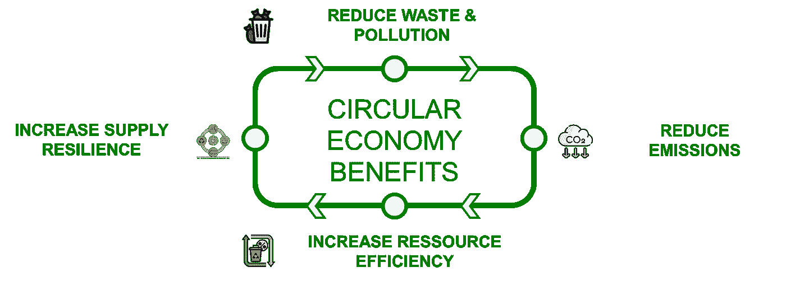
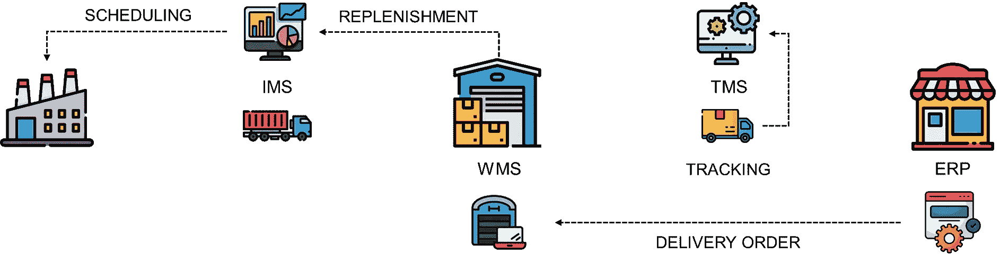
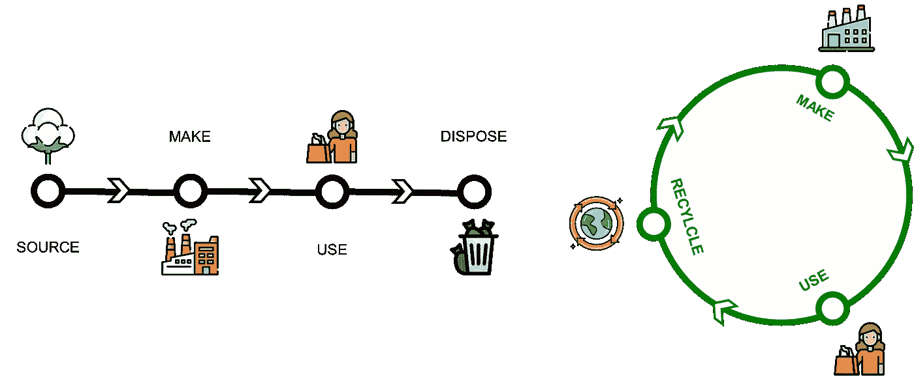
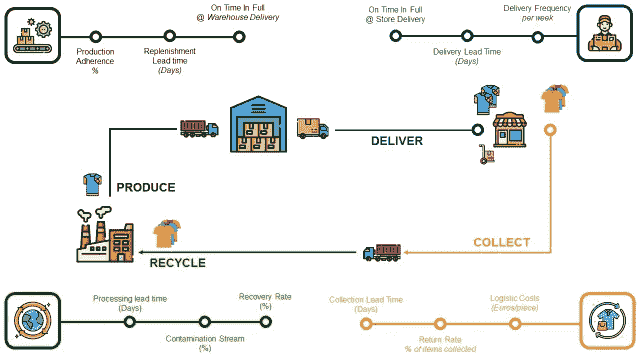
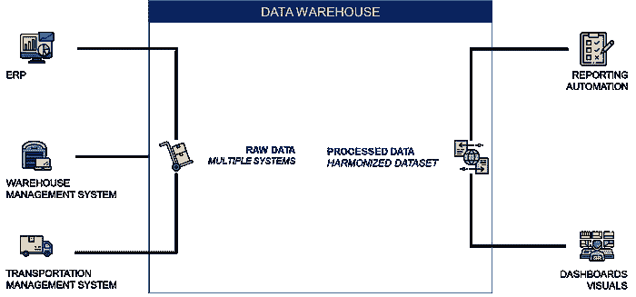
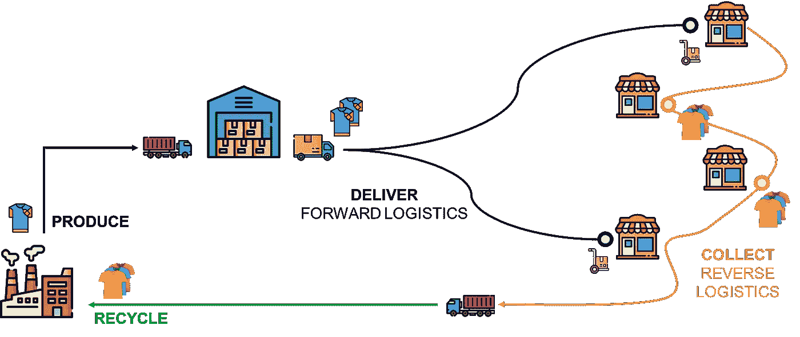
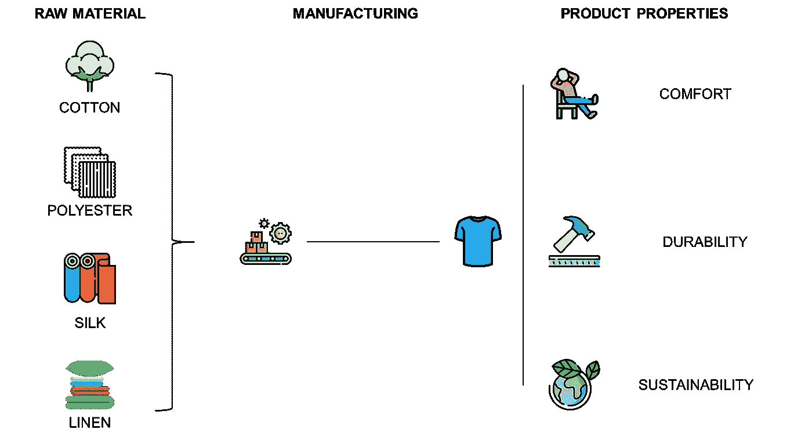
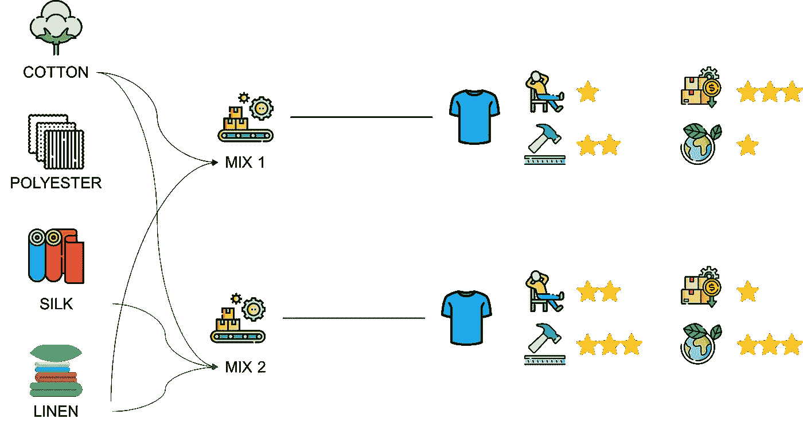
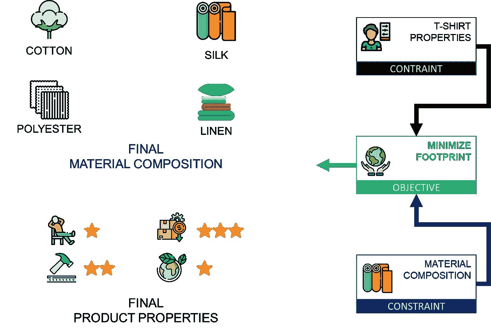

# 数据科学如何加速循环经济？

> 原文：[`towardsdatascience.com/how-will-data-science-accelerate-the-circular-economy-61a1a22287e5?source=collection_archive---------5-----------------------#2023-10-19`](https://towardsdatascience.com/how-will-data-science-accelerate-the-circular-economy-61a1a22287e5?source=collection_archive---------5-----------------------#2023-10-19)

## 克服向循环经济过渡中的操作挑战的可行数据科学技巧

[](https://s-saci95.medium.com/?source=post_page-----61a1a22287e5--------------------------------)[](https://towardsdatascience.com/?source=post_page-----61a1a22287e5--------------------------------) [Samir Saci](https://s-saci95.medium.com/?source=post_page-----61a1a22287e5--------------------------------)

·

[关注](https://medium.com/m/signin?actionUrl=https%3A%2F%2Fmedium.com%2F_%2Fsubscribe%2Fuser%2Fbb0f26d52754&operation=register&redirect=https%3A%2F%2Ftowardsdatascience.com%2Fhow-will-data-science-accelerate-the-circular-economy-61a1a22287e5&user=Samir+Saci&userId=bb0f26d52754&source=post_page-bb0f26d52754----61a1a22287e5---------------------post_header-----------) 发表在 [Towards Data Science](https://towardsdatascience.com/?source=post_page-----61a1a22287e5--------------------------------) ·11 分钟阅读·2023 年 10 月 19 日[](https://medium.com/m/signin?actionUrl=https%3A%2F%2Fmedium.com%2F_%2Fvote%2Ftowards-data-science%2F61a1a22287e5&operation=register&redirect=https%3A%2F%2Ftowardsdatascience.com%2Fhow-will-data-science-accelerate-the-circular-economy-61a1a22287e5&user=Samir+Saci&userId=bb0f26d52754&source=-----61a1a22287e5---------------------clap_footer-----------)

--

[](https://medium.com/m/signin?actionUrl=https%3A%2F%2Fmedium.com%2F_%2Fbookmark%2Fp%2F61a1a22287e5&operation=register&redirect=https%3A%2F%2Ftowardsdatascience.com%2Fhow-will-data-science-accelerate-the-circular-economy-61a1a22287e5&source=-----61a1a22287e5---------------------bookmark_footer-----------)

（图源：作者）

循环经济是一个在其中尽量减少废物，并且资源不断被重复使用或回收的系统。



循环经济的好处 — （图源：作者）

随着当前线性经济模型达到其极限，对新型循环商业模式的讨论变得越来越重要。

> 什么阻碍了我们的进步？

这些讨论主要集中在

+   **阻碍过渡的**操作和商业障碍

+   提高**回收材料**使用的替代策略

+   **租赁模式**以减少环境足迹

> 作为零售公司数据科学经理，您如何支持这一转型？

我们可以利用系统生成的数据，识别机会，通过数据科学创建**可持续**的循环经济，以克服这些障碍。



用于管理供应链网络的系统生成的数据 —（作者图片）

在这篇文章中，我们将以数据科学经理的视角，支持一个时尚零售公司运营转型。

💌 免费直送到您邮箱的新文章：[Newsletter](https://www.samirsaci.com/#/portal/signup)

📘 您的供应链分析完整指南：[Analytics Cheat Sheet](https://bit.ly/supply-chain-cheat)

```py
Summary
I. Transition to a Circular Economy
1\. What is the environmental impact of a T-shirt?
2\. Data-driven Process Design
II. Overcoming the Operational Challenges
1\. The Opacity of Supply Chain Networks
2\. The Low Residual Value of Used Products
III. Material Efficiency & Recycled Materials Usage
1\. Raw Material Optimization with Linear Programming
2\. Supply Chain Network Optimization
IV. Conclusion
```

# 向循环经济过渡

从线性模型到循环经济的演变是一个持续的过程，具有显著的业务和运营影响。

这种转变不仅仅涉及废物管理或回收。

这需要我们在设计、生产、销售和使用商品或服务的方式上进行全面变革。



线性模型与循环模型 —（作者图片）

在实施**循环经济**之前，第一步是**估算我们当前线性模型的环境影响**。

## **一件 T 恤的环境影响是什么？**

以您在**快时尚店**购买的**T 恤**为例。

> 它在其生命周期中的环境影响是什么？

生命周期评估（LCA）是一种评估产品或服务在其整个生命周期内环境影响的方法论。


快速时尚服装的生命周期评估 —（作者图片）

+   原材料来自使用**自然资源**和**能源**的不同供应商。

+   制造场所利用**自然资源**将这些材料转化为成品，同时排放**污染物**和**二氧化碳**。

+   成品被送到商店并销售给最终顾客

+   顾客使用这些产品直到处置

> 我们如何支持生命周期评估的自动化？

这种描述性分析方法可以通过我们分析团队实施的商业智能解决方案来自动化。

挑战在于**收集和处理交易数据**。

+   来源于**不同系统**，这些系统可能彼此不互通

    *工厂管理系统与仓库管理系统*

+   使用不同的格式*(非结构化 vs. 结构化)*

    *Excel 实用报告 vs. WMS 交易数据库*


构建您的 LCA 的数据来源 —（作者图片）

**💡** 数据分析师和工程师可以使用**中央数据仓库**来实施管道，以收集和处理原始数据，供 LCA 计算使用。


多系统数据协调的示例 — （图像由作者提供）

最终结果可能是**一个自助服务的协调表数据库**，包含涵盖从原材料收集到商店交付的整个周期的交易记录。

**💡 欲了解更多详情，**

[](/what-is-a-life-cycle-assessment-lca-e32a5078483a?source=post_page-----61a1a22287e5--------------------------------) ## 什么是生命周期评估？LCA

### 了解生命周期评估如何帮助企业评估产品在其整个生命周期中的环境影响……

towardsdatascience.com

然后，您的可持续发展部门可以使用这些表格进行计算，并估算每个过程的资源使用量或 CO2 排放量。

> 我们可以做些什么来减少我们的环境足迹？

## 解决方案设计的数据分析

现在您已经自动化了生命周期评估，您的可持续发展团队已经能够设定基准。

> 2022 年的总 CO2 排放量为 75k 吨 CO2eq。

根据[联合国可持续发展目标（SDG）](https://s-saci95.medium.com/what-are-the-sustainable-development-goals-sdgs-988a1eb2b62b)，您的公司承诺在 2023 年前减少**30%**。

下一步是制定实现这一目标的路线图。

我之前分享过基于数据的方法来实施减碳计划。

+   **可持续采购**：选择一组最小化原材料采购环境影响的供应商

[](/data-science-for-sustainable-sourcing-a72f2c4db424?source=post_page-----61a1a22287e5--------------------------------) ## 数据科学与可持续采购

### 如何利用数据科学来选择最佳供应商，同时考虑可持续性和社会指标……

towardsdatascience.com

+   **可持续供应链优化**：设计一个最佳的工厂和仓库网络，以最小化排放

[](/create-a-sustainable-supply-chain-optimization-web-app-20599b98cab6?source=post_page-----61a1a22287e5--------------------------------) ## 创建一个可持续供应链优化网页应用程序

### 帮助您的组织将可持续采购与供应链优化结合起来，以抑制成本和环境影响……

towardsdatascience.com

+   **循环经济**：创建一个物流链以收集和再利用顾客退回的物品，从而节省原材料

[](/data-science-to-implement-a-circular-economy-c9de824e73be?source=post_page-----61a1a22287e5--------------------------------) ## 数据科学支持实施循环经济

### 你如何利用数据科学支持快时尚零售商实施循环经济？

towardsdatascience.com

**循环模型**可以减少最高的碳排放，因为它直接影响产品。

然而，上述案例研究主要集中于利用先进分析生成有洞察力的建议。

> 既然你的模型告诉我们该怎么做，你如何支持实施？

因为这样的过渡可能完全**扰乱你当前的供应链操作。**

> 物流团队：我们如何组织我们的卡车队来收集退回的物品？

物流操作需要支持，以确保**平稳实施**并避免干扰业务或影响盈利能力。

下一节将展示**数据科学**如何支持这一运营转型。

# 克服运营挑战

尽管向循环经济的转变看起来很有前景，但它带来了各种运营挑战。

## 供应链网络的透明度

这是向循环经济过渡的主要障碍。

> 这批成品是从哪个工厂来的？

在传统线性经济中，从原材料到最终产品的货物来源和路径通常需要澄清。


你能追踪从工厂到商店的货物吗？ — (图像由作者提供)

你的公司**可能不了解其供应链的清晰度**，超出其直接供应商和客户的范围。

+   *你能追踪到你商店里出售的任何物品的生产设施吗？*

+   *你能将离开工厂的成品与用于生产它的原材料批次联系起来吗？*

透明度的缺乏使得追踪产品回溯源头变得困难。

这在采用循环经济实践方面造成了障碍。


循环供应链网络的示例 — (图像由作者提供)

在循环经济中，了解产品的生命周期 *(从原材料到处置)* 对于实施有效的回收和再利用策略至关重要。

在不透明的情况下，我们无法确保材料的来源是可持续的，使用是高效的，并且回收是妥善的。

你可能也会错过减少废物、简化操作和更有效使用资源的机会。



循环经济的绩效指标示例 — (图像由作者提供)

一个最佳的循环经济需要一套最小的性能指标，如

+   生产和运输关键绩效指标的跟踪

    **生产遵循度**（%）、**补货周期时间**（天数）

+   通过

    **物流成本**（欧元/件）、**退货率**（%）和**收集周期时间**（天数）

+   识别回收过程中的潜在改进，使用**回收率**（%）、**污染流**（%）和**处理周期时间**（天数）

> 我们如何使用分析解决方案来监控这些关键绩效指标（KPIs）？

这些物流和制造关键绩效指标需要来自多个系统的数据，这些系统具有不同的数据格式和数据库结构。



（图像来源于作者）

💡 **你的团队可以在解决这些问题上发挥关键作用，**

+   连接到跟踪产品沿价值链的系统，并收集带有时间戳的数据

+   存储和处理这些数据，以创建一个可以用于生成报告、仪表板和优化模型的中央信息来源

+   实施由供应链和可持续发展团队设计的关键绩效指标的自动报告工具

这种综合视图能够识别低效问题，提供客户可追溯性，并促进过渡。

获取更多供应链可追溯性的分析解决方案，

[](/logistic-performance-management-using-data-analytics-82b2da978e5f?source=post_page-----61a1a22287e5--------------------------------) ## 物流性能管理使用数据分析

### 实施运营指标以监控和改进国际分销网络的性能

towardsdatascience.com

> 我们能否利用数据确保这一模型的经济可行性？

## 低残值的使用产品

在我们现有的线性经济中，产品是为了消费和处置而设计的，**而不是为了重用或回收**。

产品残值是指在产品使用完毕并完成其初始生命周期后的剩余价值。

一旦使用，这些产品通常**残值很低**。

> 我们如何设计一个盈利的循环模型？

因此，收集使用过的产品进行回收的成本**往往超过了回收材料的价值**。

这危害了循环商业模式的经济可行性，并使企业不愿意过渡。



正向物流与逆向物流 — （图像来源于作者）

比如，以我们的 T 恤为例

+   **正向物流**成本效益高，因为我们通过大型卡车使用优化路线将 T 恤装载到完整的集装箱中

+   相比之下，**逆向物流**非常昂贵，因为我们以单件收集使用过的衣物，涉及复杂的分类和回收流程，这些流程需要定制化的处理方式。

由于逆向物流操作可能变得非常复杂，很容易遇到回收**比处置更昂贵的情况。**

> **数据分析在解决这些问题中可以发挥关键作用。**

我们可以模拟这些循环模型，以找到能带来效率和成本效益的最佳设置。

+   **通过优化模型简化逆向物流操作**，以最小化收集和分类旧物品的成本

[## 数据科学与可持续性 - 绿色库存管理](https://www.example.com/data-science-for-sustainability-green-inventory-management-e7ddfd97696f?source=post_page-----61a1a22287e5--------------------------------)

### 模拟商店配送频率对时尚零售商 CO2 排放的影响

[towardsdatascience.com](https://www.example.com/data-science-for-sustainability-green-inventory-management-e7ddfd97696f?source=post_page-----61a1a22287e5--------------------------------)

+   **设计替代商业** 模型，例如租赁而非销售的订阅模式

[## 你的循环经济有多可持续？](https://www.samirsaci.com/how-sustainable-is-your-circular-economy/?source=post_page-----61a1a22287e5--------------------------------)

### 使用数据分析模拟循环模型对快时尚行业的 CO2 排放和水使用的影响…

[www.samirsaci.com](https://www.samirsaci.com/how-sustainable-is-your-circular-economy/?source=post_page-----61a1a22287e5--------------------------------)

利用这些额外的模拟模型，你可以支持实施一个盈利的逆向流动来回收（或再利用）你的产品。

# 材料效率与回收材料使用

随着我们向循环模型转变，材料效率成为主要关注点。

使用更少的材料生产产品并在生产过程中减少废料，可以带来显著的经济和环境效益。

> 如何生产以确保成品的耐用性和可重复使用性？

## 使用线性规划进行原材料优化

高效使用材料可以显著减少废料，并支持资源的可持续使用。

我们可以使用各种类型的面料，包括棉花、聚酯、亚麻和丝绸。



材料混合与最终产品特性 — （作者提供的图片）

每种面料具有不同的**成本**和**属性**，如耐用性、舒适性和环境影响。

制造商的目标是最小化生产的总体成本，同时满足必要的质量和可持续性标准。



原材料优化问题 — （作者提供的图片）

> 什么是最佳组合以满足我们的盈利能力和可持续性目标？

这是一个多维优化问题，我们在尝试在特定约束下优化成本和可持续性。

**T 恤生产示例** 让我们设想一个场景，其中 T 恤必须包含

1.  至少 40% 棉花以增加舒适度

1.  由于可持续性指南，聚酯含量不得超过 30%

1.  丝绸的比例不得超过总材料的 10%

这个问题可以通过**线性（或非线性）优化与 Python**来建模和解决。



线性/非线性规划问题的制定 — （图片由作者提供）

+   **参数：** 用于生产 T 恤的每种原材料的数量

+   **约束：** 上述列出的约束

+   **目标函数：** 最小化环境足迹、最小化成本或两者的混合

你的团队可以使用像**PuLP 或 SciPy**这样的库来创建一个优化模型，以测试多个目标函数，最终找到最佳的材料组合。

**查看这个示例以获取更多细节，**

[](/raw-materials-optimization-for-food-manufacturing-with-python-fbf2be4a74?source=post_page-----61a1a22287e5--------------------------------) ## 使用 Python 的食品制造原材料优化

### 使用线性规划创建一个满足营养要求的廉价餐条的最佳配方

towardsdatascience.com

> 我们需要在哪里生产，以最可持续的方式交付到市场？

## **供应链网络优化**

为了引入回流过程进行回收，我们必须完全重新定义我们的供应链网络。

供应链优化可以帮助我们利用数据分析来找到最佳的**工厂、配送**和**回收**中心组合，从而最小化成本影响。


供应链网络设计问题 — （图片由作者提供）

使用 Python 的线性规划模型可以帮助我们

+   选择合适的地点建立我们的**回收中心**

+   优化**废物收集的流动**

+   规划分类和回收中心的容量

目标是最小化收集、分类和回收废物的成本，以实现一个盈利且可持续的循环模式。

有关如何创建网络优化模型的更多细节，

[](/robust-supply-chain-network-with-monte-carlo-simulation-21ef5adb1722?source=post_page-----61a1a22287e5--------------------------------) ## 使用蒙特卡罗模拟的稳健供应链网络

### 你在设计供应链网络时是否考虑了需求波动？

towardsdatascience.com

我希望这些示例能为你提供足够的灵感，以支持你的可持续发展部门努力过渡到更可行的经济模型。

# 结论

数据科学可以成为向**盈利的循环经济**过渡的强大推动力，通过克服复杂障碍和优化资源。

未来，分析团队可能会在帮助公司过渡到循环经济模型方面发挥关键作用。

> 你如何将这些见解分享给运营团队？

## 在网页应用程序上部署你的工具。

向组织中的每个人提供便捷的访问是一种支持数据驱动的处方模型实施的好方法。

你可以通过将这个解决方案部署到一个供运营和业务人员使用的网页应用上，将其产品化。

我已经使用 VIKTOR 平台部署了三个模型，这些模型我在文章中进行了介绍。

**可持续供应链优化网页应用**


访问应用程序试用一下！ — [[应用程序](https://cloud.viktor.ai/public/sustainable-supply-chain-network-optimization)]

**ABC 分析和帕累托图应用**


访问应用程序试用一下！ — [[应用程序](https://cloud.viktor.ai/public/product-segmentation-abc-analysis)]

## 生产规划


访问应用程序试用一下！ — [[应用程序](https://cloud.viktor.ai/public/production-planning-optimization)]

有关我如何做到的更多细节，请查看这篇文章

[](/create-a-sustainable-supply-chain-optimization-web-app-20599b98cab6?source=post_page-----61a1a22287e5--------------------------------) ## 创建一个可持续供应链优化网页应用

### 帮助你的组织将可持续采购与供应链优化相结合，以遏制成本和环境影响……

towardsdatascience.com

# 关于我

让我们在[Linkedin](https://www.linkedin.com/in/samir-saci/)和[Twitter](https://twitter.com/Samir_Saci_)上连接。我是一名供应链工程师，使用数据分析来改善物流运营并降低成本。

如果你对数据分析和供应链感兴趣，请查看我的网站。

[](https://samirsaci.com/?source=post_page-----61a1a22287e5--------------------------------) [## Samir Saci | 数据科学与生产力

### 一个专注于数据科学、个人生产力、自动化、运筹学和可持续性的技术博客……

samirsaci.com](https://samirsaci.com/?source=post_page-----61a1a22287e5--------------------------------)

# 参考资料

+   **利用数据分析的物流绩效管理**，[萨米尔·萨西](https://medium.com/u/bb0f26d52754?source=post_page-----61a1a22287e5--------------------------------)，Towards Data Science

+   **什么是循环经济？**，[萨米尔·萨西](https://medium.com/u/bb0f26d52754?source=post_page-----61a1a22287e5--------------------------------)，[Towards Data Science](https://medium.com/@s-saci95/what-is-a-circular-economy-d0fd7c46cd94)

+   **蒙特卡罗模拟下的强健供应链网络**，[萨米尔·萨西](https://medium.com/u/bb0f26d52754?source=post_page-----61a1a22287e5--------------------------------)，Towards Data Science

+   **食品制造中的原材料优化与 Python**，[萨米尔·萨西](https://medium.com/u/bb0f26d52754?source=post_page-----61a1a22287e5--------------------------------)，Towards Data Science
