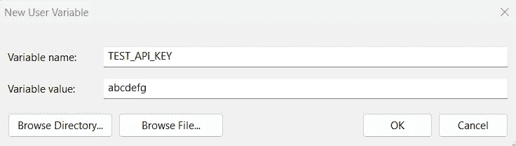

# 如何（以及为什么）保护您的 API 密钥

> 原文：[`towardsdatascience.com/how-you-can-and-why-you-should-secure-your-api-keys-e433acc2f22d`](https://towardsdatascience.com/how-you-can-and-why-you-should-secure-your-api-keys-e433acc2f22d)

## 保护 API 密钥的简单最佳实践

[](https://medium.com/@aashishnair?source=post_page-----e433acc2f22d--------------------------------)[](https://towardsdatascience.com/?source=post_page-----e433acc2f22d--------------------------------) [Aashish Nair](https://medium.com/@aashishnair?source=post_page-----e433acc2f22d--------------------------------)

·发布于[Towards Data Science](https://towardsdatascience.com/?source=post_page-----e433acc2f22d--------------------------------) ·阅读时间 4 分钟·2023 年 3 月 7 日

--


照片由[regularguy.eth](https://unsplash.com/@moneyphotos?utm_source=medium&utm_medium=referral)拍摄，发布于[Unsplash](https://unsplash.com/?utm_source=medium&utm_medium=referral)

API 密钥在识别发出请求的应用程序中扮演着重要角色。它们是一种安全措施，确保未经身份验证的人员无法访问特定服务器上的信息。然而，如果这些密钥没有得到充分保护，外部人员很容易获取这些密钥并造成实际损害。

为避免这种结果，企业可能会聘请 IT 管理员，他们负责使用高级工具（例如 AWS Secrets Manager）为多个人员和项目存储、管理和轮换 API 密钥。

然而，由于共享/泄露 API 密钥的严重后果，保护它们的责任不应仅仅落在管理员身上；每位团队成员都应理解保护 API 密钥安全的重要性。

在这里，我们探讨了泄露 API 密钥可能造成的损害，并探索了保护它们的简单最佳实践。

## 共享 API 密钥的后果

未能保护 API 密钥会带来多种危害。

首先，这会导致个人或企业为他们甚至未使用的 API 调用产生费用。一位著名的受害者是 DevFactor 创始人 Andrew Hoffman，他[在 GitHub 上意外发布了他的 AWS 密钥后，收到了$2,375 的账单](https://www.theregister.com/2015/01/06/dev_blunder_shows_github_crawling_with_keyslurping_bots/)! 不幸的是，公共空间中有爬虫机器人，因此即使短时间内泄露 API 密钥也可能是一个代价高昂的错误。

其次，获取这些密钥的攻击者可以访问和利用 API 可访问的任何信息。这可以从网络犯罪分子使用泄露的加密货币交易所 API 密钥来[盗取受害者账户中的加密货币](https://cybernews.com/security/report-how-cybercriminals-abuse-api-keys-to-steal-millions/)中看出。

最终，这会增加应用程序遭受恶意活动（如 DDoS 攻击）的可能性，攻击者通过向服务器发送虚假流量来使其崩溃。

幸运的是，这些不良结果可以通过一些细心和谨慎来防止，以下提示可以帮助实现。

## 提示 1 - 避免直接在代码中存储 API 密钥

存储 API 密钥的最简单方法是将它们直接嵌入到发起 API 调用的程序中，但这会使读者立即获得相同的 API 访问权限。

更可取的替代方案是将其存储为环境变量。环境变量本质上是可以在操作系统中定义的对象，独立于应用程序。

在 Windows 上，可以通过打开“设置”窗口，选择“系统”，“高级系统设置”，“环境变量”，然后点击“新建”来创建新的环境变量。



创建新变量（由作者创建）

另一种选择是使用代码创建环境变量。例如，以下是如何使用 Python 的 os 库创建环境变量的示例。

存储环境变量后，可以通过代码轻松访问它们。


代码输出（由作者创建）

## 提示 2 - 避免将 API 密钥上传到代码库

上传项目到代码库时，必须确保所有包含 API 密钥的文件不会被包括在上传中。

最简单的方法是使用 .gitignore 文件。 .gitignore 文件告诉 git 在将项目推送到代码库时应该故意忽略哪些文件。

要创建 .gitignore 文件，只需在 git bash 中输入以下命令：

```py
touch .gitignore
```

另外，可以创建一个文本文件并将其命名为“.gitignore”。

要忽略包含 API 密钥的文件，只需将其文件路径输入到 .gitignore 文件中。

## 提示 3 - 旋转 API 密钥

最终，即使是经验丰富的专业人员也可能因为粗心大意而暴露 API 密钥。为纠正这种错误，当密钥被泄露（或被怀疑泄露）时，可以通过旋转 API 密钥（即用新生成的密钥替换旧密钥）来解决。

旋转 API 密钥可以减少密钥泄露给其他方的风险。作为安全措施，一些团队即使在没有泄露的情况下也会定期更换密钥（例如，每 90 天一次）。旋转 API 密钥的最佳方法取决于具体的 API，因此没有一刀切的方法来实现。

> 注意：在更换密钥时，请确保应用程序将使用新密钥进行 API 调用，而不是过时的密钥。

## 提示 4 - 删除不需要的 API 密钥

最后，当某些 API 密钥不再需要时，最好彻底删除它们。

这个步骤应在确认 API 密钥不再被应用程序使用（即仍在生产中）后完成。

## 结论


照片由[Prateek Katyal](https://unsplash.com/@prateekkatyal?utm_source=medium&utm_medium=referral)提供，来源于[Unsplash](https://unsplash.com/?utm_source=medium&utm_medium=referral)

鉴于 API 密钥在项目中的重要性，团队可能会包括负责管理 API 密钥的人员。然而，API 密钥的泄露可能发生在新手和资深专业人士之间。

因此，每个成员应该了解 API 密钥泄露的容易程度、可以用来防止泄露的方法，以及可以用来修正泄露的解决方案。

感谢阅读！
