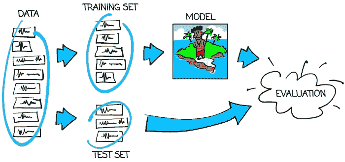
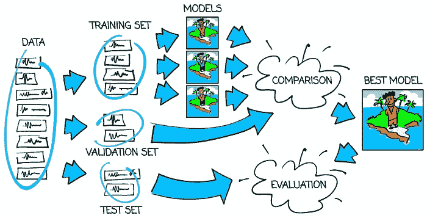
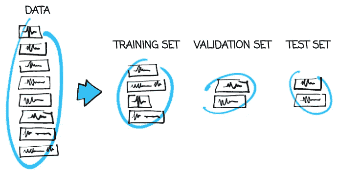
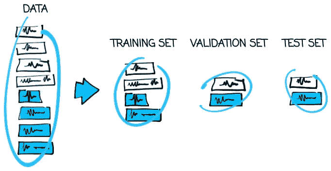
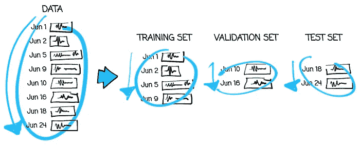

# 如何验证机器学习模型

> 原文：[`towardsdatascience.com/how-you-should-validate-machine-learning-models-f16e9f8a8f7a?source=collection_archive---------5-----------------------#2023-07-21`](https://towardsdatascience.com/how-you-should-validate-machine-learning-models-f16e9f8a8f7a?source=collection_archive---------5-----------------------#2023-07-21)

## 学会建立对你机器学习解决方案的信任

 [Patryk Miziuła, PhD](https://medium.com/@patryk.miziula?source=post_page-----f16e9f8a8f7a--------------------------------)

·

[关注](https://medium.com/m/signin?actionUrl=https%3A%2F%2Fmedium.com%2F_%2Fsubscribe%2Fuser%2F1c427b50c38d&operation=register&redirect=https%3A%2F%2Ftowardsdatascience.com%2Fhow-you-should-validate-machine-learning-models-f16e9f8a8f7a&user=Patryk+Miziu%C5%82a%2C+PhD&userId=1c427b50c38d&source=post_page-1c427b50c38d----f16e9f8a8f7a---------------------post_header-----------) 发布于 [Towards Data Science](https://towardsdatascience.com/?source=post_page-----f16e9f8a8f7a--------------------------------) ·14 min read·2023 年 7 月 21 日

--

[`www.shutterstock.com/image-photo/desert-island-palm-tree-on-beach-71305345`](https://www.shutterstock.com/image-photo/desert-island-palm-tree-on-beach-71305345)

大型语言模型已经在很大程度上改变了数据科学行业。其中一个最大的优势是对于大多数应用，它们可以直接使用——我们不必自己训练它们。这要求我们重新审视一些关于整个机器学习过程的常见假设——许多从业者认为验证是“训练的一部分”，这意味着它不再需要。我们希望读者对验证是否过时的建议略感震惊——它绝对不是。

在这里，我们深入探讨模型验证和测试的基本概念。如果你认为自己在机器学习的基础知识上已经非常熟练，你可以跳过这篇文章。否则，请系好安全带——我们有一些离奇的情境让你暂时放下怀疑。

这篇文章是[Patryk Miziuła 博士](https://medium.com/u/1c427b50c38d?source=post_page-----f16e9f8a8f7a--------------------------------)和[Jan Kanty Milczek](https://medium.com/u/134993f2df6e?source=post_page-----f16e9f8a8f7a--------------------------------)的共同工作。

# 在荒岛上学习

想象一下，你想教某人识别推特上的语言。于是你把他带到一个荒岛上，给他 100 条推文，告诉他每条推文的语言，然后让他独自待几天。之后，你回到岛上检查他是否真的学会了识别语言。但是你怎么检查呢？

你的第一反应可能是问他关于他获得的推文的语言。所以你这样挑战他，他回答了所有 100 条推文的语言。这样真的意味着他能够*总体上*识别语言吗？可能是，但也许他只是记住了这 100 条推文！而且你无法知道哪种情况是真的！

在这里，你没有检查你想要检查的内容。根据这样的检查，你根本无法知道在生死攸关的情况下（这些情况通常涉及到荒岛时），你能否依赖他的推文语言识别技能。

我们应该怎么做呢？如何确保他*学会了*，而不是仅仅*记住*了？再给他 50 条推文，让他告诉你这些推文的语言！如果他答对了，他确实能识别语言。但是如果他完全失败了，你就知道他只是把前 100 条推文背下来了——这不是整个事情的重点。

# 那么这些东西如何与机器学习模型相关联呢？

上述故事形象地描述了机器学习模型是如何学习的，以及我们应该如何检查它们的质量：

+   故事中的人代表了**机器学习模型**。要将一个人从世界中隔离开来，你需要把他带到一个荒岛上。对于机器学习模型来说，这更简单——它只是一个计算机程序，所以它本身不理解世界的概念。

+   识别推文的语言是一个**分类**任务，涉及 10 个可能的**类别**，也就是**种类**，因为我们选择了 10 种语言。

+   前 100 条用于学习的推文称为**训练集**。附加的正确语言称为**标签**。

+   另外 50 条推文仅用于考察该人/模型，称为**测试集**。注意，我们知道它的标签，但该人/模型并不知道。

下图展示了如何正确地训练和测试模型：

图 1：模型训练和测试的方案。图像由作者提供。

所以主要规则是：

> **在与训练数据不同的数据上测试机器学习模型。**

如果模型在训练集上表现良好，但在测试集上表现不佳，我们称模型为**过拟合**。“过拟合”意味着记住训练数据。这绝不是我们想要实现的目标。我们的目标是拥有一个**训练好的**模型——在训练集和测试集上表现都好。只有这种模型才能被信任。只有这样，我们才能相信它在为之构建的最终应用中会像在测试集上表现一样好。

现在让我们更进一步。

# 1000 个人在 1000 个荒岛上

想象一下你非常非常想教一个人识别 Twitter 上推文的语言。因此你找到了 1000 个候选人，把每个人送到一个不同的荒岛上，给每个人相同的 100 条推文，涵盖 10 种语言，告诉每个人每条推文的语言，然后把他们全部放在一起几天。之后，你用相同的 50 条不同推文来检查每个候选人。

你会选择哪个候选人？当然，是在 50 条推文上表现最好的那个。但他*真的*有多好呢？我们是否真的相信他在最终应用中能像在这 50 条推文上表现一样好？

答案是否定的！为什么呢？简单来说，如果每个候选人知道一些答案并猜测其他答案，那么你应该选择那些答对最多的人，而不是那些*知道*最多的人。他确实是最好的候选人，但他的结果被“幸运猜测”所膨胀。这可能是他被选择的一个重要原因。

为了以数字形式展示这种现象，假设 47 条推文对所有候选人都很简单，但剩下的 3 条消息对所有竞争者来说都非常困难，以至于他们都只是盲目猜测语言。概率说，某人（可能是多个人）全部猜对这 3 条困难推文的概率超过 63%（数学迷的信息：几乎是 1–1/*e*）。所以你可能会选择得分完美的人，但*实际上*他并不完全适合你的需求。

也许我们例子中的 50 条推文中有 3 条听起来并不惊人，但在许多实际案例中，这种差异往往更加明显。

那么我们如何检查获胜者*实际上*有多好呢？是的，我们需要再获取一组 50 条推文，并再次检查！只有这样，我们才能得到一个值得信赖的评分。这种准确度是我们期望最终应用达到的水平。

# 让我们回到机器学习术语

从名字上看：

+   第一组 100 条推文现在仍然是**训练集**，因为我们用它来训练模型。

+   但现在第二组 50 条推文的目的发生了变化。这一次它被用来比较不同的模型。这样的集合被称为**验证集**。

+   我们已经理解了，在验证集上检查到的最佳模型结果是被人为提升的。这就是为什么我们需要另外一组 50 条推文来充当**测试集**，为我们提供有关最佳模型质量的可靠信息。

你可以在下面的图片中找到使用训练集、验证集和测试集的流程：

图片 2：正确训练、验证和测试模型的示意图。图片由作者提供。

# 好了，我们为什么使用 100 条、50 条和 50 条推文的集合呢？

这里是这些数字背后的两个基本理念：

> **将尽可能多的数据放入训练集。**

我们拥有的训练数据越多，模型的视野就越广，训练的机会就越大，过拟合的可能性就越小。唯一的限制应是数据的可用性和处理数据的成本。

> **将尽可能少的数据放入验证集和测试集中，但要确保它们足够大。**

为什么？因为你不想浪费太多数据在训练之外。但是另一方面，你可能觉得仅凭一条推文来评估模型是有风险的。所以你需要一组足够大的推文集合，以免在遇到少量非常奇怪的推文时担心评分波动。

那么如何将这两个指导方针转换成具体的数字呢？如果你有 200 条推文，那么 100/50/50 的划分似乎是合适的，因为它遵循了上述两个规则。但是，如果你有 1,000,000 条推文，你可以很容易地将其划分为 800,000/100,000/100,000，甚至 900,000/50,000/50,000。也许你看到过一些百分比提示，比如 60%/20%/20%之类的。不过，它们只是上述两个主要规则的过度简化，所以最好还是坚持原始指导方针。

# 好的，但如何选择哪些推文进入训练集/验证集/测试集呢？

我们相信这个主要规则现在对你来说很清楚了：

> **使用三种不同的数据来训练、验证和测试模型。**

如果这个规则被打破会怎样？如果相同或*几乎相同*的数据，无论是因为意外还是没有注意，进入了三个数据集中中的一个以上，这就是我们所说的**数据泄露**。验证集和测试集就不再可信了。我们无法判断模型是被训练还是过拟合。我们根本无法信任这个模型。这不好。

也许你认为这些问题与我们的荒岛故事无关。我们只是取 100 条推文用于训练，再取 50 条用于验证，再取 50 条用于测试，仅此而已。不幸的是，事情并非如此简单。我们必须非常小心。让我们来看一些例子。

# 示例 1：许多随机推文

假设你从 Twitter 上抓取了 1,000,000 条完全随机的推文。不同的作者、时间、主题、定位、反应数量等等。完全随机。而且这些推文有 10 种语言，你想用它们来训练模型识别语言。那么你不用担心任何问题，你可以简单地将 900,000 条推文用于训练集，50,000 条用于验证集，50,000 条用于测试集。这被称为**随机分割**。

为什么要随机抽取，而不是将*前* 900,000 条推文放入训练集，将*接下来的* 50,000 条推文放入验证集，将*最后的* 50,000 条推文放入测试集？因为推文最初可能会以对我们无益的方式排序，例如按字母顺序或按字符数量排序。我们并不希望仅将以‘Z’开头或最长的推文放入测试集，对吧？所以随机抽取会更安全。

图像 3：随机数据分割。图片来源于作者。

假设推文是*完全随机*的，这个假设是强的。总是要仔细考虑这是否真实。在接下来的示例中，你将看到如果不完全随机会发生什么。

# 示例 2：不是那么多随机推文

如果我们只有 200 条*完全随机*的推文在 10 种语言中，我们仍然可以随机分割它们。但这时就会出现新的风险。假设某种语言占主导地位，有 128 条推文，而其他 9 种语言每种语言只有 8 条推文。概率表明，所有语言都进入 50 个测试集的可能性超过 61%（数学爱好者的说明：使用包容-排除原理）。但我们确实希望在所有 10 种语言上测试模型，所以我们确实需要所有语言都在测试集中。我们应该怎么做？

我们可以按类别绘制推文。因此，取 128 条推文中占主导地位的类别，绘制 64 条用于训练集，32 条用于验证集和 32 条用于测试集。然后对所有其他类别执行相同的操作——每个类别分别绘制 4 条、2 条和 2 条用于训练、验证和测试。这样，你就能形成三个所需大小的集合，每个集合中所有类别的比例相同。这种策略称为**分层随机分割**。

分层随机拆分似乎比普通随机拆分更好/更安全，那么为什么我们在示例 1 中没有使用它呢？因为我们不需要！常常违反直觉的是，如果 1,000,000 条推文中有 5%是英文的，而我们随机抽取 50,000 条推文而不考虑语言，那么抽取的推文中也有 5%是英文的。这就是概率的工作原理。但概率需要足够大的数字才能正常工作，所以如果你有 1,000,000 条推文你就不用担心，但如果只有 200 条，就要小心了。

# 示例 3：来自几个机构的推文

现在假设我们有 100,000 条推文，但这些推文仅来自 20 个机构（比如一家新闻电视台、一家大型足球俱乐部等），而且每个机构在 10 种语言中运行 10 个 Twitter 账号。我们的目标仍然是识别 Twitter 语言*一般性*的。我们可以简单地使用随机拆分吗？

你说得对——如果可以，我们就不会提出这个问题了。但为什么不呢？为了理解这一点，我们首先考虑一个更简单的案例：如果我们仅在一个机构的推文上训练、验证和测试模型呢？我们可以将这个模型用于其他机构的推文吗？我们不知道！也许模型会过度拟合这个机构的独特推文风格。我们将没有任何工具来检查这一点！

让我们回到我们的案例。要点是一样的。总共有 20 个机构的数量较少。因此，如果我们使用这 20 个机构的数据来训练、比较和评分模型，那么模型可能会过度拟合这 20 个机构的独特风格，并且在其他作者上表现不佳。再次强调，我们没有方法来检查这一点。这不太好。

那么该怎么办呢？让我们遵循另一个主要规则：

> **验证集和测试集应尽可能真实地模拟模型应用的实际情况。**

现在情况更清楚了。由于我们期望最终应用中的作者与我们数据中的作者不同，因此我们在验证集和测试集中也应包含与训练集中不同的作者！实现这一点的方法是**按机构划分数据**！如果我们从 10 个机构中抽取用于训练集，从另外 5 个机构中抽取用于验证集，并将最后 5 个机构的数据放入测试集中，问题就解决了。

图像 4：分层数据拆分。图像由作者提供。

请注意，任何较不严格的按机构拆分（例如将 4 个机构的全部数据和其余 16 个机构的一小部分数据放入测试集）都属于数据泄露，这样是不好的，因此我们在分离机构时必须不妥协。

一个令人遗憾的最终说明：对于按机构进行的正确验证拆分，我们可以信任来自不同机构的推文。但来自私人账户的推文可能会——确实会——看起来不同，因此我们不能确定我们拥有的模型对这些推文表现良好。根据我们现有的数据，我们没有工具来检查这一点……

# 示例 4：相同的推文，不同的目标

示例 3 比较难，但如果你仔细研究过，那么这个就相对容易了。假设我们有与示例 3 完全相同的数据，但这次目标不同。我们现在想识别来自相同 20 个机构的其他推文的语言。随机拆分现在还会合适吗？

答案是：可以。随机拆分完全遵循了上述最后一个主要规则，因为我们最终只对数据中存在的机构感兴趣。

示例 3 和 4 告诉我们，数据拆分的方式不仅仅依赖于我们拥有的数据。它依赖于数据和任务。设计训练/验证/测试拆分时，请牢记这一点。

# 示例 5：仍然是相同的推文，但目标不同

在最后一个例子中，让我们保留我们拥有的数据，但现在尝试教一个模型预测未来推文中的机构。因此我们再次有一个分类任务，但这次有 20 个类别，因为我们有来自 20 个机构的推文。这个情况下怎么样？我们可以随机拆分数据吗？

和以前一样，让我们先考虑一个更简单的情况。假设我们只有两个机构——一个电视新闻台和一个大型足球俱乐部。他们会发什么推文？两者都喜欢从一个热门话题跳到另一个。三天谈特朗普或梅西，然后三天谈拜登和罗纳尔多，依此类推。显然，在他们的推文中我们可以找到*关键词*，这些关键词每隔几天就会变化。一个月后我们会看到什么关键词？哪个政治家、恶棍、足球运动员或足球教练会成为“热门”？可能是现在完全未知的。因此，如果你想学会识别机构，你不应该关注*暂时的*关键词，而是应该尝试捕捉*总体风格*。

好的，让我们回到我们的 20 个机构。之前的观察仍然有效：推文的主题会随时间变化，因此我们希望我们的解决方案能适用于未来的推文，我们不应关注短期的关键词。但机器学习模型是懒惰的。如果它找到了一种简单的方式来完成任务，它不会再进一步查找。坚持使用关键词就是这种简单的方式。那么，我们如何检查模型是否学得正确，而不是仅仅记住了暂时的关键词呢？

我们非常确定你会意识到，如果你使用随机拆分，你应该期待在所有三个集合中都包含关于每个周英雄的推文。这样，你最终会在训练、验证和测试集合中得到相同的关键词。这不是我们想要的。我们需要更聪明地拆分。但怎么做呢？

当我们回到最后一个主要规则时，它变得简单了。我们希望在未来使用我们的解决方案，因此验证集和测试集应该是相对于训练集的未来！我们应该**按时间拆分数据**。所以如果我们有，比如说，12 个月的数据——从 2022 年 7 月到 2023 年 6 月——那么把 2022 年 7 月到 2023 年 4 月放在测试集中，2023 年 5 月放在验证集中，2023 年 6 月放在测试集中应该就可以了。

图 5：按时间划分的数据。图片由作者提供。

也许你会担心通过时间划分我们无法检查模型在整个季节中的质量。你说得对，这确实是一个问题。但这仍然是一个比随机划分要小的问题。你还可以考虑，例如，以下的划分方式：每月的 1 号到 20 号作为训练集，每月的 20 号到 25 号作为验证集，每月的 25 号到最后一天作为测试集。无论如何，选择一个验证策略是对潜在数据泄漏的权衡。只要你理解这一点并有意识地选择最安全的选项，你就做得很好。

# 摘要

我们将故事设定在一个沙漠岛屿上，并尽力避免任何复杂情况——将模型验证和测试的问题从所有可能的现实世界因素中隔离出来。即便如此，我们仍然遇到了一次又一次的陷阱。幸运的是，避免这些陷阱的规则很容易学习。正如你可能会在过程中学到的，它们也很难掌握。你不会总是立刻发现数据泄漏，也不总是能够防止它。尽管如此，仔细考虑你的验证方案的可信度一定会带来更好的模型。这一点即使在新模型被发明和新框架被发布时依然相关。

此外，我们有 1000 名男子被困在沙漠岛屿上。一个好的模型可能正是我们需要的，以便及时救援他们。
