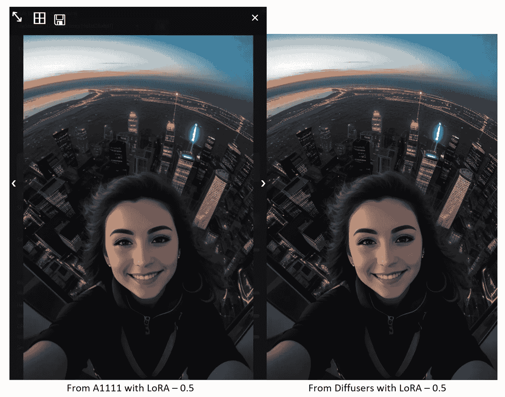

# Hugging Face Diffusers 可以正确加载 LoRA

> 原文：[`towardsdatascience.com/hugging-face-diffusers-can-correctly-load-lora-now-a332501342a3`](https://towardsdatascience.com/hugging-face-diffusers-can-correctly-load-lora-now-a332501342a3)

## 使用最新的 Diffusers Monkey Patching 函数加载 LoRA 与 A1111 比较，结果完全相同

[](https://xhinker.medium.com/?source=post_page-----a332501342a3--------------------------------)[](https://towardsdatascience.com/?source=post_page-----a332501342a3--------------------------------) [Andrew Zhu (Shudong Zhu)](https://xhinker.medium.com/?source=post_page-----a332501342a3--------------------------------)

·发表于 [Towards Data Science](https://towardsdatascience.com/?source=post_page-----a332501342a3--------------------------------) ·5 min 阅读·2023 年 7 月 28 日

--

从 Hugging Face 的 Diffusers 代码库中拉取最新代码，并发现与 LoRA 加载相关的最新代码已更新，现在可以进行 Monkey-Patching LoRA 加载。

要安装最新的 Diffusers：

```py
pip install -U git+https://github.com/huggingface/diffusers.git@main
```

根据我的测试，LoRA 加载功能昨天生成了略有缺陷的结果。本文讨论了如何使用 Diffusers 包中的最新 LoRA 加载器。

## 加载 LoRA 并更新 Stable Diffusion 模型权重

自从程序员使用 Diffusers 以来，LoRA 一直无法轻松加载。为了将 LoRA 加载到检查点模型中并输出与 A1111 的 Stable Diffusion Webui 相同的结果，我们需要使用额外的自定义代码来加载权重，如本文所述。

[](/improving-diffusers-package-for-high-quality-image-generation-a50fff04bdd4?source=post_page-----a332501342a3--------------------------------) ## 改进 Diffusers 包以实现高质量图像生成

### 克服令牌大小限制、自定义模型加载、LoRA 支持、文本反演支持等

[towardsdatascience.com

本文提供的解决方案运行良好且快速，但需要额外管理 LoRA α 权重，我们需要创建一个变量来记住当前的 LoRA 权重 α。因为加载 LoRA 的代码只是将 LoRA 的 A 和 B 矩阵简单地加在一起。


LoRA 权重

然后与主要检查点模型权重 W 合并。


将 LoRA 权重与检查点权重合并

要移除 LoRA 权重，我们需要一个负的-α来移除 LoRA 权重，或者重新创建管道。

## 加载 LoRA 的猴子修补方式

使用 LoRA 的另一种方法是修补执行模块前向过程的代码，并在计算文本嵌入和注意力分数时引入 LoRA 权重。


用 LoRA 修补模型

这就是 Diffusers LoraLoaderMixin 处理 LoRA 加载的方式。这个方法的好处是没有更新模型权重，我们可以轻松重置 LoRA 并提供新的α来定义 LoRA 权重。

然而，在今天（2023 年 7 月 26 日）之前，Diffusers 的 LoraLoaderMixin 加载 LoRA 并生成的结果与 A1111 有些不同。今天的代码修复了这个问题。“修复”是指，你可以使用 Diffusers 加载检查点模型及 LoRA，并生成与 A1111 SD webui 完全相同的结果。

## 使用 Diffusers 的 LoraLoaderMixin 加载 LoRA

假设我们有一个`safetensor`文件格式的 LoRA 文件，使用 Diffusers 加载 LoRA 就像这样简单。

```py
import torch
from diffusers import StableDiffusionPipeline

text2img_pipe = StableDiffusionPipeline.from_pretrained(
    "stablediffusionapi/deliberate-v2"
    , torch_dtype = torch.float16
    , safety_checker = None
).to("cuda:0")

lora_path = "<path/to/lora.safetensors>"
text2img_pipe.load_lora_weights(lora_path)
```

只需一行代码：`text2img_pipe.load_lora_weights(lora_path)`。测试其中一个著名的 LoRA — [LowRA](https://civitai.com/models/48139/lowra)，这个 LoRA 可以将图像转换为暗模式。

让我们测试一下加载和不加载 LoRA 的效果。

```py
from diffusers import EulerDiscreteScheduler

prompt = """
Маша making extreme selfie on skyscraper, bird's eye view, from above, night, smiling
"""
neg_prompt = """
NSFW,deformed, distorted, disfigured, poorly drawn, bad anatomy, wrong anatomy, extra limb, missing limb, floating limbs, mutated hands and fingers, disconnected limbs, mutation, mutated, ugly, disgusting, blurry, amputation
"""

text2img_pipe.scheduler = EulerDiscreteScheduler.from_config(text2img_pipe.scheduler.config)

image = text2img_pipe(
    prompt = prompt
    , negative_prompt = neg_prompt
    , generator = torch.Generator("cuda:0").manual_seed(3135098381)
    , num_inference_steps = 28
    , guidance_scale = 8
    , width = 512
    , height = 768
).images[0]
display(image)
```

结果如下，左侧是没有加载 LoRA 的图像，右侧是加载了 LoRA 后生成的图像，使用了`text2img_pipe.load_lora_weights(lora_path).`


图 1\. LowRA LoRA 可以生成暗模式图像，由 Andrew Zhu 使用 Diffusers 生成

## 使用 Diffusers 加载带权重的 LoRA

即使我们现在可以用一行代码加载 LoRA，我们仍然没有看到对 LoRA 权重参数的支持。例如，我们希望结果变得更亮，并设置 LoRA 权重为 0.5。在 A1111 Stable Diffusion Webui 中，我们可以将 LoRA 权重设置为：`<lora:LowRA:0.5>`

我们如何将 0.5 添加到 Diffusers 包中？似乎没有办法，但我们可以在 LoRA 加载过程中进行黑客操作，像这样插入我们的值：

```py
text2img_pipe.unload_lora_weights()
lora_path = "<path/to/lora.safetensors>"

lora_w = 0.5
text2img_pipe._lora_scale = lora_w

state_dict, network_alphas = text2img_pipe.lora_state_dict(
    lora_path
)

for key in network_alphas:
    network_alphas[key] = network_alphas[key] * lora_w

#network_alpha = network_alpha * lora_w
text2img_pipe.load_lora_into_unet(
    state_dict = state_dict
    , network_alphas = network_alphas
    , unet = text2img_pipe.unet
)

text2img_pipe.load_lora_into_text_encoder(
    state_dict = state_dict
    , network_alphas = network_alphas
    , text_encoder = text2img_pipe.text_encoder
)
```

左侧是来自 A1111 SD Webui 的结果，右侧是来自 Diffusers 的结果，二者使用相同的 LoRA 权重为 0.5，Euler 调度器，种子：3135098381



图 2\. Diffusers 与 LoRA 可以生成与 A1111 相同的图像。图像由 Andrew Zhu 使用 A1111 SD WebUi（左）和 Diffusers（右）生成

你能看出区别吗？

要重置 LoRA，只需调用`unload_lora_weights`函数：

```py
text2img_pipe.unload_lora_weights()
```

## 总结

这篇文章讨论了 Diffusers 的最新代码更新，这是一个开源的 Stable Diffusion 包，允许我们使用 Python 生成 AI 图像。此外，我们可以根据具体需求自由添加和更改代码。

长时间以来，只有 A1111 Stable Diffusion WebUI 能完全支持 LoRA，现在我们可以使用 Python 控制 Diffusers 加载数千个社区共享的 LoRA，并完全自动化图像生成，这为 GAI 图像生成打开了一扇新门。

总结来说，本文的贡献如下：

1.  介绍了将 LoRA safetensors 文件加载到 Diffusers Stable Diffusion 管道中的最简单方法（单行代码）。

1.  提供了一种简单的黑客方式来在 LoRA 加载阶段加载 LoRA 权重。

## 参考文献

[1] Hugging Face, 大型语言模型的低秩适配（LoRA），[`huggingface.co/docs/diffusers/training/lora`](https://huggingface.co/docs/diffusers/training/lora)

[2] LowRA，[`civitai.com/models/48139/lowra`](https://civitai.com/models/48139/lowra)

[3] 使用辅助状态加载 Kohya-ss 风格的 LoRA，[`github.com/huggingface/diffusers/pull/4147`](https://github.com/huggingface/diffusers/pull/4147)

[4] Simo Ryu(cloneofsimo), lora，[`github.com/cloneofsimo/lora`](https://github.com/cloneofsimo/lora)
