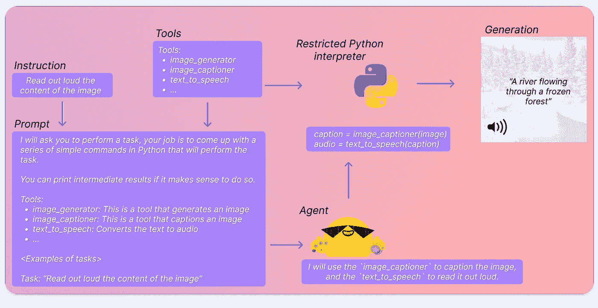
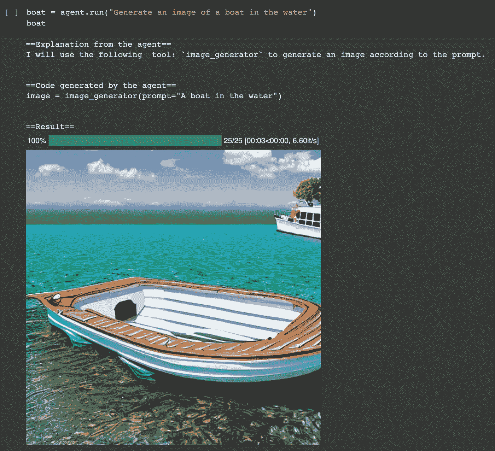
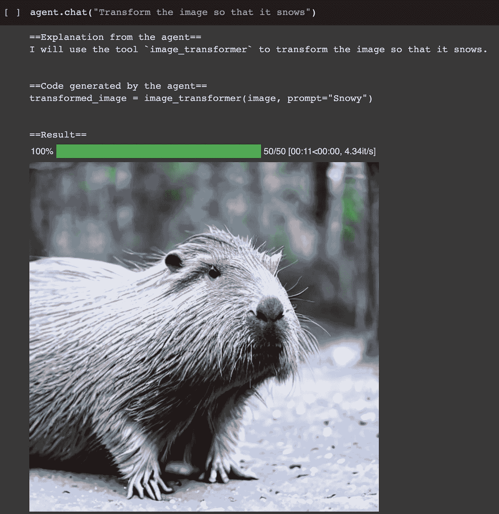

# 🤗Hugging Face Transformers Agent

> 原文：[`towardsdatascience.com/hugging-face-transformers-agent-3a01cf3669ac`](https://towardsdatascience.com/hugging-face-transformers-agent-3a01cf3669ac)

## 与🦜🔗LangChain Agent 的比较

[](https://sophiamyang.medium.com/?source=post_page-----3a01cf3669ac--------------------------------)[](https://towardsdatascience.com/?source=post_page-----3a01cf3669ac--------------------------------) [Sophia Yang, Ph.D.](https://sophiamyang.medium.com/?source=post_page-----3a01cf3669ac--------------------------------)

·发表于[Towards Data Science](https://towardsdatascience.com/?source=post_page-----3a01cf3669ac--------------------------------) ·阅读时间 5 分钟·2023 年 5 月 14 日

--

就在两天前，🤗Hugging Face 发布了 Transformers Agent——一个利用自然语言从经过筛选的工具集合中选择工具并完成各种任务的代理。听起来熟悉吗？是的，因为它很像🦜🔗LangChain Tools and Agents。在这篇博客中，我将介绍 Transformers Agent 是什么，以及它与🦜🔗LangChain Agent 的比较。

# 尝试代码：

你可以在[这个 colab](https://colab.research.google.com/drive/1c7MHD-T1forUPGcC_jlwsIptOzpG3hSj)中尝试代码（由 Hugging Face 提供）。

# **什么是 Transformers Agents？**

> 简而言之，它在 transformers 之上提供了一个自然语言 API：我们定义了一组经过筛选的工具，并设计了一个代理来解释自然语言并使用这些工具。

我可以想象 HuggingFace 的工程师们会这样说：我们在 HuggingFace 上托管了这么多令人惊叹的模型。我们能否将这些与 LLM 整合起来？我们能否利用 LLM 决定使用哪个模型，编写代码，运行代码并生成结果？本质上，没有人再需要学习所有复杂的任务特定模型了。只需给 LLM（代理）一个任务，它们将为我们做所有事情。

以下是步骤：



来源: [`huggingface.co/docs/transformers/transformers_agents`](https://huggingface.co/docs/transformers/transformers_agents)

+   Instruction: 用户提供的提示

+   Prompt: 一个包含具体指令的提示模板，其中列出了多个可用的工具。

+   Tools: 一组经过筛选的 transformers 模型，例如用于问答的 Flan-T5

+   Agent: 是一个大语言模型（LLM），它解释问题，决定使用哪些工具，并生成代码来利用这些工具完成任务。

+   限制 Python 解释器：执行 Python 代码。

# 它是如何工作的？

## 第一步：实例化一个代理。

第一步是实例化一个代理。一个代理就是一个 LLM，可以是 OpenAI 模型、StarCoder 模型或 OpenAssistant 模型。

OpenAI 模型需要 OpenAI API 密钥，并且使用不是免费的。我们从 HuggingFace Hub 加载 StarCoder 模型和 OpenAssistant 模型，这需要 HuggingFace Hub API 密钥，并且可以免费使用。

```py
from transformers import HfAgent

# OpenAI
agent = OpenAiAgent(model="text-davinci-003", api_key="<your_api_key>")

from transformers import OpenAiAgent
from huggingface_hub import login
login("<YOUR_TOKEN>")

# Starcoder
agent = HfAgent("https://api-inference.huggingface.co/models/bigcode/starcoder")

# OpenAssistant
agent = HfAgent(url_endpoint="https://api-inference.huggingface.co/models/OpenAssistant/oasst-sft-4-pythia-12b-epoch-3.5")
```

## 第 2 步：运行代理。

`agent.run`是一个单一执行方法，会自动选择任务所需的工具，例如，选择图像生成工具来创建图像。



`agent.chat`保持聊天记录。例如，它知道我们之前生成了一个图片，并且它可以转换图像。



# 它与🦜🔗LangChain Agent 有什么不同？

Transformers Agent 仍处于实验阶段。它的范围较小，灵活性较差。目前 Transformers Agent 的主要关注点是使用 Transformer 模型和执行 Python 代码，而 LangChain Agent 几乎能做“一切”。让我们逐一比较 Transformers 和 LangChain Agents 之间的不同组件：

## 工具

+   🤗Hugging Face Transformers Agent 拥有一个惊人的工具列表，每个工具都由变换器模型驱动。这些工具提供了三大显著优势：1) 尽管 Transformers Agent 目前只能与少数工具交互，但它有可能与超过 100,000 个 Hugging Face 模型进行通信。它具有完整的多模态能力，包括文本、图像、视频、音频和文档。2) 由于这些模型是为特定任务量身定制的，使用它们可以比单独依赖 LLMs 更直接、更准确。例如，我们可以直接部署专为文本分类设计的 BART，而不是为 LLM 设计提示。3) 这些工具解锁了 LLMs 无法完成的功能。例如，BLIP 使我们能够生成引人注目的图像描述——这是 LLMs 无法实现的任务。

+   🦜🔗LangChain 工具都是外部 API，例如 Google 搜索、Python REPL。实际上，LangChain 通过`load_huggingface_tool`函数支持 HuggingFace 工具。LangChain 有可能做很多 Transformers Agent 已经能够做的事情。另一方面，Transformers Agents 也有可能整合所有 LangChain 工具。

+   在这两种情况下，每个工具都是一个 Python 文件。你可以在[这里](https://github.com/huggingface/transformers/tree/main/src/transformers/tools)找到🤗Hugging Face Transformers Agent 工具的文件，也可以在[这里](https://github.com/hwchase17/langchain/tree/master/langchain/utilities)找到🦜🔗LangChain 工具的文件。正如你所见，每个 Python 文件包含一个类，表示一个工具。

## 代理

+   🤗Hugging Face Transformers Agent 使用[这个提示模板](https://github.com/huggingface/transformers/blob/main/src/transformers/tools/prompts.py#L19-L93)根据工具的描述确定使用哪个工具。它要求 LLM 提供解释，并在提示中提供一些少量示例。

+   🦜🔗LangChain 默认使用 ReAct 框架，根据工具的描述来确定使用哪个工具。ReAct 框架在这篇[论文](https://arxiv.org/pdf/2210.03629.pdf)中有描述。它不仅进行决策，还提供*思考*和*推理*，这类似于 Transformers Agent 使用的*解释*。此外，🦜🔗LangChain 还有四种[代理类型](https://python.langchain.com/en/latest/modules/agents/agents/agent_types.html)。

## **自定义代理**

创建自定义代理在这两种情况下都不是很困难：

+   查看 HuggingFace Transformer Agent 示例，请参见[这个 colab](https://colab.research.google.com/drive/1c7MHD-T1forUPGcC_jlwsIptOzpG3hSj)的末尾。

+   查看 LangChain 的[示例](https://python.langchain.com/en/latest/modules/agents/agents/custom_agent.html)。

## “代码执行”

+   🤗Hugging Face Transformers Agent 在 LLM 选择工具并生成代码之后将“代码执行”作为步骤之一。这将 Transformers Agent 的目标限制为执行 Python 代码。

+   🦜🔗LangChain 将“代码执行”作为其工具之一，这意味着执行代码不是整个过程的最后一步。这提供了更多灵活性：任务目标可以是执行 Python 代码，也可以是其他任务，例如进行 Google 搜索并返回搜索结果。

# 结论

在这篇博客文章中，我们探讨了🤗Hugging Face Transformers Agents 的功能，并将其与🦜🔗LangChain Agents 进行了比较。我期待着看到 Transformers Agent 的进一步发展和进步。

. . .

作者：[Sophia Yang](https://www.linkedin.com/in/sophiamyang/)，发表于 2023 年 5 月 12 日

Sophia Yang 是一位高级数据科学家。可以在[LinkedIn](https://www.linkedin.com/in/sophiamyang/)、[Twitter](https://twitter.com/sophiamyang)和[YouTube](https://www.youtube.com/SophiaYangDS)上与我联系，并加入 DS/ML [书友会](https://dsbookclub.github.io/) ❤️
