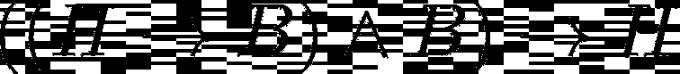
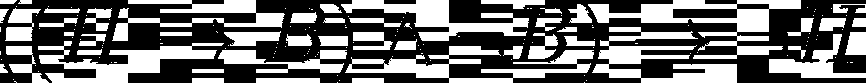

# 寻找黑天鹅

> 原文：[`towardsdatascience.com/hunt-for-the-black-swan-edafe62ee1b8?source=collection_archive---------16-----------------------#2023-03-13`](https://towardsdatascience.com/hunt-for-the-black-swan-edafe62ee1b8?source=collection_archive---------16-----------------------#2023-03-13)

## 为什么让你的模型失败是你能做的最好的事

 [**Dorian Drost**](https://medium.com/@doriandrost?source=post_page-----edafe62ee1b8--------------------------------)

·

[关注](https://medium.com/m/signin?actionUrl=https%3A%2F%2Fmedium.com%2F_%2Fsubscribe%2Fuser%2F1d49ea537d1c&operation=register&redirect=https%3A%2F%2Ftowardsdatascience.com%2Fhunt-for-the-black-swan-edafe62ee1b8&user=Dorian+Drost&userId=1d49ea537d1c&source=post_page-1d49ea537d1c----edafe62ee1b8---------------------post_header-----------) 发表在 [Towards Data Science](https://towardsdatascience.com/?source=post_page-----edafe62ee1b8--------------------------------) ·6 分钟阅读·2023 年 3 月 13 日

--

[照片由**Michael Dziedzic**](https://unsplash.com/@lazycreekimages?utm_source=medium&utm_medium=referral)提供，来源于[Unsplash](https://unsplash.com/?utm_source=medium&utm_medium=referral)。

在开发新的模型或算法时，测试它是否在类似的完美示例上运行可能很诱人。虽然这可能很有趣，但这并不能真正帮助你理解和改进你的模型。你从错误中学习，所以让你的模型失败吧！

想象一下你的数据科学队友来找你，告诉你他们刚刚训练的新模型。它非常棒，可以分类各种小动物的图片。当然，你的队友会开始展示模型的效果，让它正确分类一堆图片。在这个时刻，你最好问你的队友以下问题：

> 给我一些失败的例子

起初，这可能听起来有些违背直觉。当然，看到模型运行的情况是有趣的，你不希望通过让模型失败来挫伤你的队友的积极性，但什么能更深入地揭示模型的行为：看到模型成功还是看到它失败？

如果它正确分类了 N 张超级可爱的小猫的图片，那么很可能它也会正确分类第 N+1 张图片，只要它看起来和其他的相似。你感到惊讶吗？没有。你学到了关于模型行为的任何东西吗？没有。

然而，如果你找到那些导致模型失败的图片，你可能最终会对模型仍然有问题的图片有个了解。这是非常值得的！现在你可以开始理解模型，并进一步改进它。

# 正式假设和黑天鹅

关于寻找失败的理论背景有着悠久的传统。几百年来，非常聪明的人们一直在思考和辩论如何从观察中得出普遍的规则。今天太阳早上升起了，昨天和前天也是如此。这是否意味着它明天还会升起？好吧，不一定。另一个例子：我去了公园，那里我看到的所有天鹅都是白色的，所以我可能会提出我的假设

> 所有的天鹅都是白色的。

作为一个优秀的科学家，我当然会证明我的假设，所以我去到下一个公园，看看天鹅。它们也是白色的。那么，我的假设被证明了吗？没有，因为如果我想证明它，我需要检查*所有*的天鹅。好吧，我没有时间去做这些，那我该怎么办？在看到 N 只白天鹅后，再看第 N+1 只白天鹅不会给我提供额外的信息。我应该：

> 试着找到一只黑天鹅。

为什么会这样？难道这不会否定我的假设吗？是的，这正是它要做的。这也是我应该追求的目标。

从正式的角度来看，如果我看到 N 只白天鹅，并推导出所有天鹅都是白色的，我进行的是逻辑*归纳*。然而，逻辑归纳有一个缺点：它是错误的。

“→” 可以读作“意味着”，而“∧” 意味着“和”。

上述陈述是归纳的，我们可以将其解读为

> 我的假设 H 意味着一个观察 B，而我观察到了这个观察 B。这意味着，我的假设 H 是正确的。

但总体上，这个陈述是错误的。在我们的例子中，这个陈述会是：

> 我的假设“所有天鹅都是白色的”（H）意味着，下一个我观察到的天鹅是白色的（B）。我观察到的下一只天鹅确实是白色的（B）。这意味着，我的假设是正确的。

再次，这不是真的。虽然观察到一只白天鹅与假设一致，但这并不意味着假设的正确性。它只是没有反驳假设。如果你不信，可以看看以下例子：

> 我的假设‘所有天鹅都是由美国政府的一个秘密组织涂成白色的’暗示，我观察到的下一只天鹅是白色的（B）。我观察到的下一只天鹅确实是白色的（B）。这暗示着我的假设是正确的。

完全不真实。

然而，仍然有希望。虽然上述陈述是错误的，但以下内容是正确的：

→ 可以读作“暗示”，∧ 表示“和”，¬ 表示“非”。

我们可以读作

> 我的假设 H 暗示了一个观察结果 B，而我观察到的却不是 B。这暗示着我的假设 H 不正确。

或者将你的例子表述为

> 我的假设‘所有天鹅都是白色的’（H）暗示，我观察到的下一只天鹅是白色的（B）。我观察到的下一只天鹅不是白色的（¬ B）。这意味着我的假设不正确（¬ H）。

这是真实的陈述（对于你们中的形式逻辑迷来说，这叫做*modus tollens*）。如果我找到一个反驳假设的例子，那么这个假设就被证明是错误的，而这确实是我之前没有的信息。

总的来说，这意味着假设永远不能被证明或验证。它们只能被证伪。另一方面，如果一个假设在我尝试证伪它的过程中幸存下来，这对假设是有利的。

# 回到模型

那么，这一切如何与您的队友的模型相关？你在这里并不想证明或证伪一个简单的假设，而主要思想是，信息的增益来自于那些出现错误的案例。简单来说，模型有效的案例不会告诉你任何你已经知道的东西。要理解模型的行为，要看那些模型失败的案例。例如：

一个识别实体的工具可以识别‘Alice’和‘Paula’这些名字。

+   它还能检测‘Kathrin’吗？能。你从中学到了什么吗？没有。

+   它还能检测‘Linh’吗？不能。→ 也许它对亚洲名字有问题。

一个图像分类器可以检测景观图像拍摄的地点。它正确地检测到你最近一次度假的照片是在印度尼西亚的海滩拍摄的。

+   它还能检测你前年在印度拍摄的照片的地点吗？能。你从中学到了什么吗？没有。

+   它也适用于你爷爷在 50 年代第一次去意大利旅行时拍的照片吗？不能。→ 也许数据缺少旧的黑白照片。

一个新的酷炫机器人手臂非常灵活，可以以非常详细的方式控制，甚至可以在钢琴上演奏 C 大调音阶。

+   它还能演奏 F 大调音阶吗？能。你从中学到了什么吗？没有。

+   它还能演奏莫扎特的奏鸣曲吗？不能。→ 也许它的灵活性仍然有限，莫扎特的奏鸣曲对它来说太难了。

所有这些例子展示了你如何从失败的案例中获得知识，而不是从成功的案例中获得。以同样的方式，你可以更多地了解你队友的分类可爱动物的模型：

+   它也能分类稀有动物，如幼章鱼或树袋熊吗？

+   它是否也适用于不同的图像背景？

+   它能分类那些看起来与父母完全一样，只是更小的幼鱼吗？

+   如果一张图片中有多种不同的动物会发生什么？

这些只是一些可以帮助你理解模型行为的例子。当打破模型时，要有创意！

# 结论

我刚刚向你展示了为什么打破你的模型比看到它工作更有帮助。失败的案例是那些带来有用信息的案例，就像试图否证一个假设是加强它的关键一样。现在是时候将形式逻辑付诸实践了！下次你的队友来向你展示他们的新模型时，花点时间欣赏它，并庆祝那些表现良好的案例。但在那之后，开始打破它并寻找极限情况。这些将帮助你进一步改进模型。追寻黑天鹅！

# 进一步阅读

对假设的否证和归纳问题的主要观点被浓缩在卡尔·波普尔的*批判性理性主义*科学理论中，这在大多数科学研究和统计的学术教材中都有介绍，例如：

+   Dienes, Z. [Understanding psychology as a science: An introduction to scientific and statistical inference](https://link.springer.com/book/9780230542303)（第 44 页）。 （2008），纽约：Palgrave Macmillan。

对黑天鹅及许多相关概念进行真正深入的探讨（约 2000 页）：

+   Taleb, N. N. [Incerto (Deluxe Edition): Fooled by Randomness, the Black Swan, the Bed of Procrustes, Antifragile, Skin in the Game](https://www.google.de/books/edition/Incerto_Deluxe_Edition_Fooled_by_Randomn/yDiREAAAQBAJ?hl=de)。 （2019）美国：RANDOM HOUSE。

*喜欢这篇文章吗？* [*关注我*](https://medium.com/@doriandrost) *以便收到我未来的帖子通知。*
