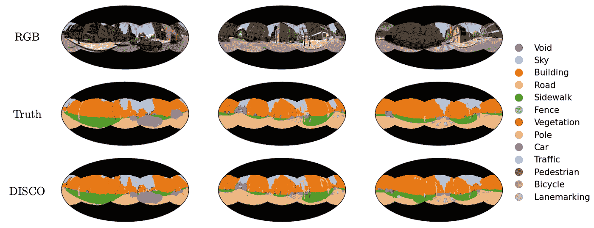

# 混合离散-连续几何深度学习

> 原文：[`towardsdatascience.com/hybrid-discrete-continuous-geometric-deep-learning-2e5871293184?source=collection_archive---------12-----------------------#2023-03-15`](https://towardsdatascience.com/hybrid-discrete-continuous-geometric-deep-learning-2e5871293184?source=collection_archive---------12-----------------------#2023-03-15)

## 可扩展且等变的球面卷积神经网络（CNNs）通过 DISCO 卷积

 [Jason McEwen](https://jasonmcewen.medium.com/?source=post_page-----2e5871293184--------------------------------)

·

[关注](https://medium.com/m/signin?actionUrl=https%3A%2F%2Fmedium.com%2F_%2Fsubscribe%2Fuser%2Fea87e920245&operation=register&redirect=https%3A%2F%2Ftowardsdatascience.com%2Fhybrid-discrete-continuous-geometric-deep-learning-2e5871293184&user=Jason+McEwen&userId=ea87e920245&source=post_page-ea87e920245----2e5871293184---------------------post_header-----------) 发布于 [Towards Data Science](https://towardsdatascience.com/?source=post_page-----2e5871293184--------------------------------) · 7 分钟阅读 · 2023 年 3 月 15 日 

--

*目前没有现有的球面卷积神经网络（CNN）框架既具有计算扩展性又具有旋转等变性。连续方法捕捉旋转等变性，但通常计算要求非常高。离散方法提供了更有利的计算性能，但以牺牲等变性为代价。我们开发了一种混合的离散-连续（DISCO）组卷积，它同时具备等变性和计算扩展性。这种方法在许多基准密集预测任务中实现了最先进的（SOTA）性能。 （更多细节请参见我们在* [*Scalable and Equivariant Spherical CNNs by DISCO Convolutions*](https://arxiv.org/abs/2209.13603)*上的 ICLR 论文。）*

图片由 [Dustin Tramel](https://unsplash.com/@dustintramel?utm_source=medium&utm_medium=referral) 提供，来源于 [Unsplash](https://unsplash.com/?utm_source=medium&utm_medium=referral)

几何深度学习在群体上的应用非常广泛，如分析地球上的观察数据以及全景 360°照片和视频等。然而，当前的方法存在二分法：它们要么表现出良好的等变性特性，要么具有良好的计算扩展性，但不可能两者兼得。

# 二分法：离散方法与连续方法

几何深度学习技术在群体上的关键目标是 [编码等变性](https://medium.com/towards-data-science/what-einstein-can-teach-us-about-machine-learning-1661e26bef2c) 以适应各种群体变换（这通常会带来非常好的性能），同时还需要高度的计算扩展性。

正如我们在 之前的 TDS 文章 中讨论的，专注于具有全局对称性的均匀空间的群体设置，几何深度学习在群体上可以大致分为离散方法和连续方法。连续方法提供等变性，但计算成本高昂。另一方面，离散方法通常计算效率相对较高，但牺牲了等变性。

# 打破**二分法**：离散-连续（DISCO）方法

在 [Copernic AI](https://copernicai.com/) 我们最近开发了打破这种二分法的技术（最近在 ICLR [1] 上发表）。也就是说，我们开发了几何深度学习技术，既提供了卓越的等变性特性，又具有高度的计算效率，从而能够有效地扩展到庞大、高分辨率的数据集。

打破离散与连续二分法的关键在于采取混合方法，将一些表示部分离散化，以促进高效计算，而其他部分保持连续，以促进等变性。由于其混合性质（如下图所示），我们将这种方法命名为 DISCO，代表 DIScrete-COntinous。

虽然 DISCO 方法是通用的，但我们重点关注球面作为具有全局对称性的均匀空间群设置的典型示例。

通过混合离散-连续（DISCO）方法打破连续与离散的二分法，这种方法既具有旋转等变性，又具有计算可扩展性。[原始图由作者创建。]

# 离散-连续（DISCO）群卷积

DISCO 方法基于卷积层，其中 DISCO 群卷积遵循标准群卷积的精心混合表示。表示中的一些组件保持连续，以促进准确的旋转等变性，而其他组件则被离散化，以实现可扩展的计算。

在群上定义的信号（即数据、特征图）*f* 与滤波器 *𝝭* 的 DISCO 群卷积表示为

其中 *g* 是群 *G* 的一个元素，d*µ(u)* 是（哈 aar）积分测度，*q(uᵢ)* 是求积权重。方括号和索引下标表示离散化的量，*i* 表示样本索引，而圆括号表示连续量。

在球面上，我们考虑由 3D 旋转给出的变换，因此球面上的信号的 DISCO 卷积表示为

其中 *R* 表示旋转，*ω* 表示球面坐标。

聚焦于球面情况时，显然感兴趣的信号必须在样本位置 *ωᵢ* 上离散化。然而，在 DISCO 方法中，滤波器 *𝝭* 和群作用 *R* 仍然保持连续。这使得滤波器能够通过任何 *R* 连续地转换，保持一致的表示，从而避免任何离散化误差，并且提供旋转等变性，这与完全离散的方法不同。

关于 *ω* 的积分也必须进行离散化。对于紧致均匀流形上的带限信号，例如球面，采样定理的存在确保积分可以使用求积权重 *q(ωᵢ)* 非常准确地近似。

对于带限信号，DISCO 对群卷积的近似非常准确，而实际信号可以通过足够的带限进行很好的近似。通过应用采样定理，信号的所有信息内容都可以被有限的样本集*{f[ωᵢ]}* 捕捉到。滤波器被连续表示，因此不会引入任何误差。唯一的近似误差来源是用于评估积分的求积方法。对于足够密集的采样，可以应用采样定理及相应的求积方法来准确评估。因此，原则上可以精确计算 DISCO 群卷积，而无需任何近似误差。由于近似非常准确（可以通过足够密集的采样来使其精确），且群操作以连续方式处理，DISCO 群卷积展现了优异的等变性特性，如数值验证所示[1]。

# 可扩展计算

DISCO 卷积通过稀疏张量表示提供了一个可扩展的计算实现[1]。具体来说，我们利用稀疏-密集张量乘法算子在硬件加速器（例如 GPU、TPU）上高效地计算 DISCO 球面卷积。

通过进一步限制旋转空间（到商空间 SO(3)/SO(2)）并利用采样方案的对称性，我们在计算成本和内存需求上实现了线性缩放。

下面的图表展示了 DISCO 球面卷积在不同分辨率/带限下的浮点操作数（FLOPs）和内存需求，与最有效的替代球面卷积（展现旋转等变性）进行对比。

DISCO 球面卷积在不同分辨率/带限下的计算成本和内存需求，与最有效的替代球面卷积（展现旋转等变性）进行对比。[原始图由作者创建。]

对于 4k 球面图像，我们在计算成本上节省了 10⁹，在内存使用上节省了 10⁴。

# DISCO 球面 CNN 架构

转置 DISCO 卷积也可以以类似的方式构造，如上述前向卷积讨论的方式，这样可以用于提高内部特征表示的分辨率，以满足密集预测任务。

通过将 DISCO 前向和转置球面卷积与逐点非线性激活和其他常见结构特征（如跳跃连接、批量归一化、多通道等）结合，可以构建高效的球面实现的常见 CNN 架构。

我们下面考虑了若干密集预测任务，例如语义分割和深度估计，我们采用了一个具有 DISCO 卷积的残差 UNet 架构的通用骨干。我们的 DISCO 模型在迄今为止考虑的所有基准问题上实现了**最先进**的性能。

# 语义分割

我们考虑了 360°照片的语义分割的密集预测问题。

对于室内 360°照片的 2D3DS 数据集，我们展示了球面 RGB 图像、真实分割以及仅通过 RGB 图像预测的 DISCO 模型分割的示例。

室内 360°照片的 2D3DS 数据的示例分割。[原始图由作者创建。]

尽管预测的分割结果并不完美，但它们通常非常准确。事实上，我们的 DISCO 方法在所有其他替代方法中实现了**最先进**的性能（有关详细信息，请参见[1]）。

对于户外 360°照片的 Omni-SYNTHIA 数据集，我们还展示了球面 RGB 图像、真实分割和预测分割的示例。

户外 360°照片的 Omni-SYNTHIA 数据的示例分割。[原始图由作者创建。]

再次强调，预测的分割结果通常非常准确，我们在所有其他替代方法中实现了**最先进**的性能（有关详细信息，请参见[1]）。

# 深度估计

另一个常见的密集预测任务是深度估计。我们考虑了从 360°照片中进行单目深度估计的任务，解决了 Matterport3D 数据集上的 Pano3D 基准。

我们展示了球面 RGB 图像、真实深度和仅通过 RGB 图像预测的 DISCO 模型深度的示例。

Matterport3D 数据集的室内 360°照片的深度估计示例。[原始图由作者创建。]

预测的深度通常非常准确。确实，我们再次在所有其他替代方法中实现了**最先进**的性能（有关详细信息，请参见[1]）。

# 未来展望

通过混合离散-连续（DISCO）表示法，现在已经解决了群体上的等变和计算可扩展的几何深度学习问题。正如我们在上面提到的基准任务中所看到的，我们实现了**最先进**的性能，卓越的等变性属性转化为出色的性能。

我们现在拥有将现代深度学习架构扩展到具有全局对称性的均匀空间群体设置所需的基础构建块，例如球面。现在有大量应用可以释放现代深度学习的潜力。

# 参考文献

[1] Ocampo, Price, McEwen, *通过离散-连续（DISCO）卷积的可扩展和等变球面 CNN*，ICLR（2023），[arXiv:2209.13603](https://arxiv.org/abs/2209.13603)
