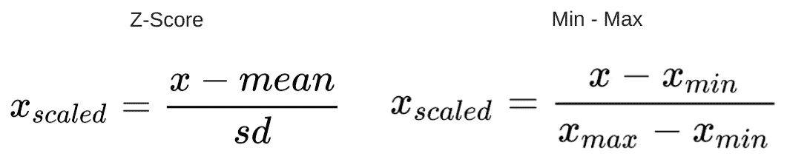
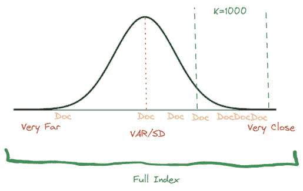
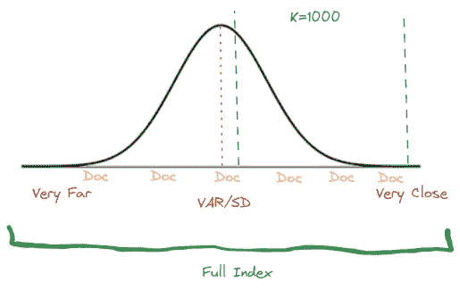
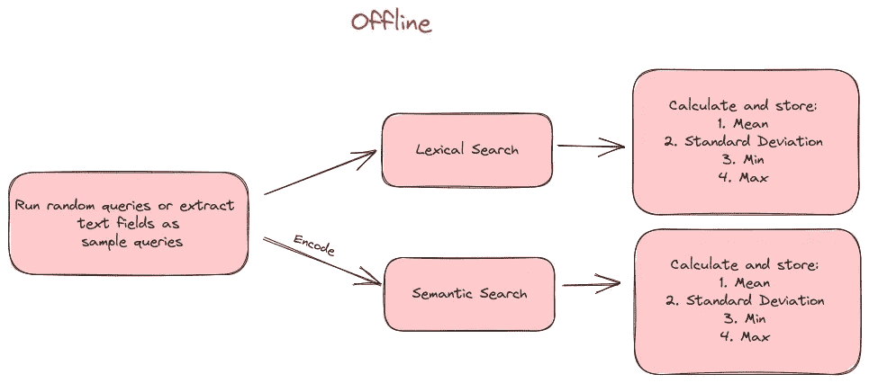
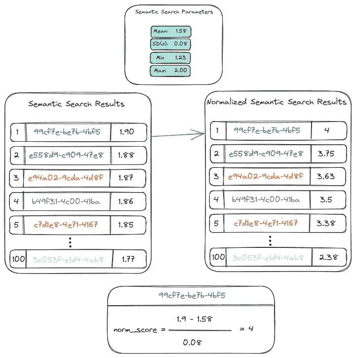
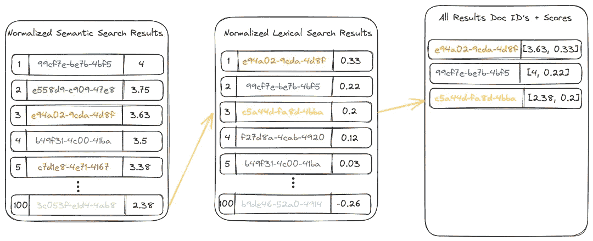
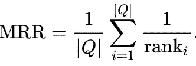
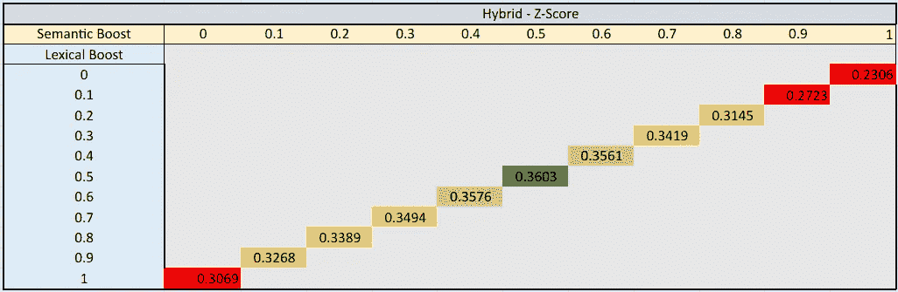
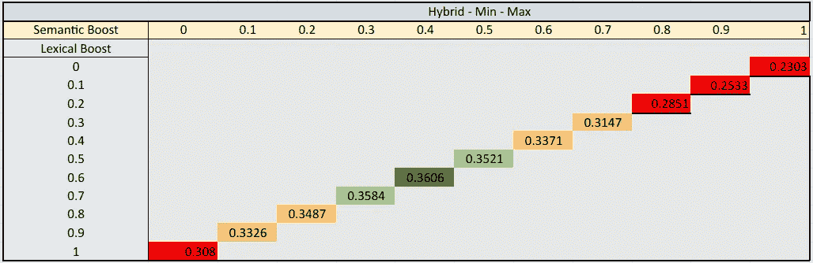

# 混合搜索 2.0：追求更好的搜索

> 原文：[`towardsdatascience.com/hybrid-search-2-0-the-pursuit-of-better-search-ce44d6f20c08?source=collection_archive---------1-----------------------#2023-09-30`](https://towardsdatascience.com/hybrid-search-2-0-the-pursuit-of-better-search-ce44d6f20c08?source=collection_archive---------1-----------------------#2023-09-30)

## 学习、改进之旅，以及对终极混合搜索系统的追求

[](https://medium.com/@noamschwartz1?source=post_page-----ce44d6f20c08--------------------------------)[](https://towardsdatascience.com/?source=post_page-----ce44d6f20c08--------------------------------) [Noam Schwartz](https://medium.com/@noamschwartz1?source=post_page-----ce44d6f20c08--------------------------------)

·

[关注](https://medium.com/m/signin?actionUrl=https%3A%2F%2Fmedium.com%2F_%2Fsubscribe%2Fuser%2F77ffd6350db9&operation=register&redirect=https%3A%2F%2Ftowardsdatascience.com%2Fhybrid-search-2-0-the-pursuit-of-better-search-ce44d6f20c08&user=Noam+Schwartz&userId=77ffd6350db9&source=post_page-77ffd6350db9----ce44d6f20c08---------------------post_header-----------) 发表在 [Towards Data Science](https://towardsdatascience.com/?source=post_page-----ce44d6f20c08--------------------------------) · 7 分钟阅读 · 2023 年 9 月 30 日 [](https://medium.com/m/signin?actionUrl=https%3A%2F%2Fmedium.com%2F_%2Fvote%2Ftowards-data-science%2Fce44d6f20c08&operation=register&redirect=https%3A%2F%2Ftowardsdatascience.com%2Fhybrid-search-2-0-the-pursuit-of-better-search-ce44d6f20c08&user=Noam+Schwartz&userId=77ffd6350db9&source=-----ce44d6f20c08---------------------clap_footer-----------)

--

[](https://medium.com/m/signin?actionUrl=https%3A%2F%2Fmedium.com%2F_%2Fbookmark%2Fp%2Fce44d6f20c08&operation=register&redirect=https%3A%2F%2Ftowardsdatascience.com%2Fhybrid-search-2-0-the-pursuit-of-better-search-ce44d6f20c08&source=-----ce44d6f20c08---------------------bookmark_footer-----------)

图片由 [bert b](https://unsplash.com/@bertsz?utm_source=medium&utm_medium=referral) 提供，来源于 [Unsplash](https://unsplash.com/?utm_source=medium&utm_medium=referral)

结合文本和向量搜索的优势在搜索系统领域获得了越来越多的关注，以提高搜索的相关性和准确性。我在 最近的一篇博客文章 中讨论了使用 OpenSearch 构建混合搜索引擎。通过将基于文本的词汇搜索与基于向量的语义搜索结合起来，我们能够提高搜索结果的延迟和准确性。

我最近一直在思考混合系统的缺点及可能的改进。在本文中，我将探讨之前系统中的三个薄弱环节，并提出改进建议，以加强系统并提供更好的结果。

在继续之前，请阅读我的之前的博客文章，因为我将参考其中描述的步骤。

1.  **标准化函数略有偏差；它对文本搜索的权重较高，并在最终结果中给予更多的重要性。**

基于距离的算法，如 K-最近邻（KNN），计算数据点之间的距离，而 BM25 则基于关键词的出现频率。这两者返回的得分完全在不同的尺度上。这可能导致结果偏差和排名不准确。我们的标准化过程总是为词汇搜索结果集中的至少一个文档产生了完美的分数（1），因此在我们的情况下，结果偏向了词汇搜索。

为了应对这个问题，让我们探索两种常用的函数：Min-Max 标准化和 Z-Score 标准化。Z-Score 方法将数据缩放到零均值和单位方差，而 Min-Max 标准化则将数据重新缩放到特定范围内。

关键思想是，如果我事先计算这些标准化函数中使用的参数，并在标准化阶段应用它们，我可以对每种搜索类型在类似查询下的得分分布有一个基本的理解。这两个函数的公式是：



考虑索引的结构可以帮助你决定选择哪一种，因为每种方法都有其自身的优势。如果你的文档彼此之间更相似，且典型查询的前 k 个结果返回的文档彼此非常相似且在索引中聚集在一起，如下图所示，Min-Max 可能是更好的选择。



作者图示

然而，如果结果分布更均匀且具有一些正态分布的特征，如下面的示例所示，Z-Score 更适合。



作者图示

这两种方法都需要确定某些参数；我们必须计算均值、标准差、最低分数和最高分数。我们必须分别为每种搜索类型确定这些值，因为向量和语义结果具有不同的评分系统。让我们运行 1000 个随机查询、一次向量搜索和一次语义搜索来完成这项工作。如果你没有查询，你可以使用 OpenSearch 的[scroll API](https://opensearch.org/docs/latest/api-reference/scroll/)从索引的不同部分提取用作查询的文本字段。将 k 设置为一个较大的值，例如 k=1000，以更好地了解我们分数范围内的比例。然而，要小心不要将 k 设置得太高，因为这可能会影响 Min-Max 函数。在收集所有这些分数后，简单地计算必要的参数。

```py
 # Lexical Search
    text_scores = []
    for query in queries:
        response = client.search(
            index=INDEX_NAME,
            body={
                "query": {
                    "match": {
                        "caption": query
                    }
                },
                "size": 1000
            }
        )
        scores = [hit['_score'] for hit in response['hits']['hits']]
        text_scores.append(scores)

    # Vector search
    vector_scores = []
    # Vectorize queries using SentenceTransformer
    query_embeddings = model.encode(queries)
    # Perform vector search
    for query_embedding in query_embeddings:
        request_body = {
            "size": 1000,
            "query": {
                "script_score": {
                    "query": {
                        "match_all": {}
                    },
                    "script": {
                        "source": "knn_score",
                        "lang": "knn",
                        "params": {
                            "field": "caption_embedding",
                            "query_value": query_embedding.tolist(),
                            "space_type": "cosinesimil"
                        }
                    }
                }
            }
        }
        response = client.search(
            index=INDEX_NAME,
            body=request_body
        )
        scores = [hit['_score'] for hit in response['hits']['hits']]
        vector_scores.append(scores)    

    vector_score_mean = np.mean(vector_scores) # Calculate the mean
    vector_score_std = np.std(vector_scores, ddof=1)  # Calculate standard deviation
    vector_score_min = np.min(vector_scores)  # Calculate minimum score
    vector_score_max = np.max(vector_scores)  # Calculate maximum score

    text_score_mean = np.mean(text_scores) # Calculate the mean
    text_score_std = np.std(text_scores, ddof=1)  # Calculate standard deviation
    text_score_min = np.min(text_scores)  # Calculate minimum score
    text_score_max = np.max(text_scores)  # Calculate maximum score
```

过程如下面的图示所示：



作者提供的图示

将你提取的词汇和向量结果的参数单独保留一次。最终，在标准化步骤中，我们将以如下方式使用这些参数：



使用 Z-Score 函数进行标准化（作者提供的图示）

**2\. 没有出现在任何集合中的分数被“非公平”地处理，没有得到充分考虑作为潜在匹配。**

之前，任何特定于一个集合的结果都获得了一个任意低的分数，这显著影响了其最终排名。让我们尝试一种替代策略来解决这个问题。我们将把缺失结果集合中的最低分数授予那些仅在一种结果集合中出现的文档。例如，我们将文档*c5a44d-fa8d-4bba*（黄色标记）赋予前 k 个结果中的最低语义搜索分数，因为它只出现在我的词汇（关键词）搜索结果中。通过这种方法，我们通过提供一个在其他分数范围内的分数来保证这些结果仍然是合法的。



作者提供的图示

**3\. 旧的方法缺乏强的数据驱动或科学基础。因此，我们没有办法基于数据选择调优参数如 boost。**

让我们一次性解决这两个问题。当前任务涉及比较两组有前景的结果——词汇结果和语义结果——并宣称混合结果优于它们。为此，我们将对 [MS MARCO](https://microsoft.github.io/msmarco/) 进行实验。MS MARCO 是由微软研究院策划的数据集，包含从网页中提取的 320 万份网络文档以及超过 35 万条来源于真实 Bing 网络搜索查询的查询。最初设计用于基准测试问答（Q&A）系统，该数据集包含类似现实世界问题的查询。鉴于数据集的问答性质，相关性标签简单明了，每个结果仅分配一个“相关”标签（1）。

在我们的场景中，MS MARCO 文档排名挑战使用 [平均倒数排名](https://en.wikipedia.org/wiki/Mean_reciprocal_rank)（MRR）作为前 100 个结果（MRR@100）的相关性度量来进行排名挑战。它计算第一个相关文档的倒数排名 *(1/rank)* 并对所有查询进行平均。



来源：维基百科

我们将进行三种不同类型的搜索：词汇搜索、语义搜索和混合搜索。我们将尝试不同的提升水平，每次改变 0.1。我们希望评估所有搜索实验的前 100 名的平均倒数排名（MRR@100），因此我们将 top-k 设置为 100。对于每个查询，我们将结果与“正确”标记的文档 ID 进行比较，并确定其排名。

```py
def find_doc_id_rank(doc_id, document_ids):
    if doc_id in document_ids:
        position = document_ids.index(doc_id) + 1
        return 1 / position
    else:
        return 0
```

最后，我们将各个排名加在一起，以确定平均倒数排名（MRR）。

以下表格显示了在 0 到 1 之间的每个增强比例（以 0.1 为增量/减少量）下的 MRR@100 分数：



使用 Z-Score 函数的 MRR@100（截图由作者提供）



使用 Min-Max 函数的 MRR@100（截图由作者提供）

上述结果清楚地表明，当在词汇搜索方向上进行一定程度的提升时，Min-Max 方法表现最佳。然而，将其与语义结果结合可以提高其准确性。另一方面，Z-Score 函数通过均匀分配提升，同时在词汇和语义搜索之间保持 50–50 的分割，产生了最佳的总体结果，表明混合搜索方法是最终选择。

在我们寻求更有效的混合搜索系统的过程中，我们迎接了挑战，并取得了显著的改进。我们已经采取措施来应对固有的挑战，结果很明确：词汇和语义搜索技术的结合具有巨大的潜力。这还不是终点，而是通往更高效、以用户为中心的搜索体验的一个踏脚石。凭借数据支持的方法论，我计划继续改进搜索系统，并迎接信息检索领域不断变化的挑战。

感谢[Yaniv Vaknin](https://medium.com/@yaniv.vaknin)和特别是[ Daphna Idelson](https://www.linkedin.com/in/daphnaidelson/)为帮助我们完成这项工作！
