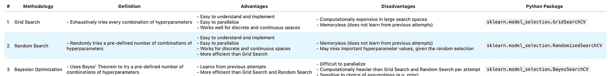
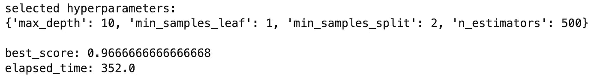
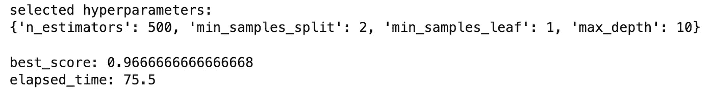
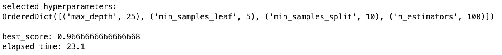
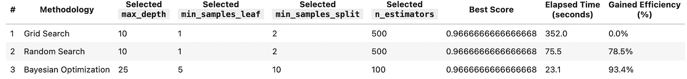

# 超参数优化——网格搜索、随机搜索和贝叶斯优化的简介与实现

> 原文：[`towardsdatascience.com/hyperparameter-optimization-intro-and-implementation-of-grid-search-random-search-and-bayesian-b2f16c00578a`](https://towardsdatascience.com/hyperparameter-optimization-intro-and-implementation-of-grid-search-random-search-and-bayesian-b2f16c00578a)

## 提升机器学习结果的最常见超参数优化方法

[](https://medium.com/@fmnobar?source=post_page-----b2f16c00578a--------------------------------)[](https://towardsdatascience.com/?source=post_page-----b2f16c00578a--------------------------------) [Farzad Mahmoodinobar](https://medium.com/@fmnobar?source=post_page-----b2f16c00578a--------------------------------)

·发表于[数据科学前沿](https://towardsdatascience.com/?source=post_page-----b2f16c00578a--------------------------------)·阅读时间 10 分钟·2023 年 3 月 13 日

--


图片由[乔纳斯·贾肯](https://unsplash.com/@jonasjaekenmedia)提供，来自[Unsplash](https://unsplash.com/photos/Gg2ttawakqE)

通常，尝试提高机器学习模型性能时，第一个想到的解决方案是增加更多的训练数据。额外的数据通常有帮助（在某些情况下除外），但生成高质量数据可能非常昂贵。超参数优化可以通过利用现有数据来节省时间和资源，以获得最佳模型性能。

超参数优化，顾名思义，是识别机器学习模型最佳超参数组合的过程，以满足优化函数（即在给定的数据集上最大化模型性能）。换句话说，每个模型都有多个我们可以调整的旋钮和杠杆，直到我们找到优化的组合。在超参数优化过程中，我们可以调整的一些参数示例包括学习率、神经网络的架构（例如，隐藏层的数量）、正则化等。

在这篇文章中，我们将概念性地介绍三种最常见的超参数优化方法，即网格搜索、随机搜索和贝叶斯优化，并进行实现。

我将在这里包含一个高层次的对比表，以便将来参考，然后在文章的其余部分将进一步探讨、解释和实现每一种方法。



表 1——超参数优化方法比较

让我们开始吧！

*(除非另有说明，所有图片均由作者提供。)*

[## 通过我的推荐链接加入 Medium - Farzad Mahmoodinobar](https://medium.com/@fmnobar/membership?source=post_page-----b2f16c00578a--------------------------------)

### 阅读 Farzad（以及 Medium 上其他作者）的每个故事。你的会员费用直接支持 Farzad 和其他人…

[medium.com](https://medium.com/@fmnobar/membership?source=post_page-----b2f16c00578a--------------------------------)

# 1\. 网格搜索

网格搜索可能是最简单且最直观的超参数优化方法，它涉及在定义的搜索空间中穷尽地寻找最佳超参数组合。在这个上下文中，“搜索空间”是指在优化过程中考虑的所有超参数及其值。让我们通过一个例子更好地理解网格搜索。

假设我们有一个机器学习模型，它只有三个参数，每个参数可以取下面列表中的值：

1.  parameter_1 = [1, 2, 3]

1.  parameter_2 = [a, b, c]

1.  parameter_3 = [x, y, z]

我们不知道这些参数的哪种组合能够优化我们模型的优化函数（即，为我们的机器学习模型提供最佳输出）。在网格搜索中，我们简单地尝试这些参数的每一个组合，测量每个组合模型的性能，然后选择产生最佳性能的组合！在这个例子中，parameter_1 可以取 3 个值（即 1、2 或 3），parameter_2 可以取 3 个值（即 a、b 和 c），parameter_3 可以取 3 个值（即 x、y 和 z）。换句话说，总共有 3*3*3=27 种组合。在这个例子中，网格搜索将涉及 27 轮评估 ML 模型性能，以找到表现最佳的组合。

正如你所见，这种方法非常简单（类似于试错任务），但它也有一些局限性。让我们一起总结优缺点：

优点：

+   易于理解和实现

+   易于并行化

+   适用于离散和连续空间

缺点：

+   对于具有较多超参数的大型和/或复杂模型来说成本较高（因为需要尝试和评估所有组合）

+   无记忆性 — 不从过去的观察中学习

+   如果搜索空间过大，可能无法找到最佳组合

我的建议是，如果你有一个简单的模型，且搜索空间较小，请使用网格搜索。否则，继续阅读，寻找更适合较大搜索空间的解决方案。

让我们用一个实际的例子来实现网格搜索。

## 1.1\. 网格搜索 — 实现

为了实现网格搜索，我们将使用来自 [scikit-learn 的鸢尾花数据集](https://scikit-learn.org/stable/auto_examples/datasets/plot_iris_dataset.html) 创建一个随机森林分类模型。该数据集包含三种不同的鸢尾花的花瓣和萼片长度，将用于本次分类练习。对于本帖的目的，模型开发的优先级较低，因为目标是比较各种超参数优化策略的性能。我鼓励你关注模型评估结果以及每种超参数优化方法达到其选定超参数集所需的时间。我将描述结果，并提供一个本帖中使用的三种方法的总结比较表。

搜索空间，即包括所有超参数值的空间，定义如下：

```py
search_space = {'n_estimators': [10, 100, 500, 1000],
              'max_depth': [2, 10, 25, 50, 100],
              'min_samples_split': [2, 5, 10],
              'min_samples_leaf': [1, 5, 10]}
```

上述搜索空间由 4*5*3*3=180 种超参数组合组成。我们将使用网格搜索找到优化目标函数的组合，如下所示：

```py
# Import libraries
from sklearn.model_selection import GridSearchCV
from sklearn.datasets import load_iris
from sklearn.ensemble import RandomForestClassifier
from sklearn.model_selection import cross_val_score
import time

# Load Iris dataset
iris = load_iris()
X, y = iris.data, iris.target

# Define the hyperparameter search space
search_space = {'n_estimators': [10, 100, 500, 1000],
              'max_depth': [2, 10, 25, 50, 100],
              'min_samples_split': [2, 5, 10],
              'min_samples_leaf': [1, 5, 10]}

# Define the random forest classifier
clf = RandomForestClassifier(random_state=1234)

# Create the optimizer object
optimizer = GridSearchCV(clf, search_space, cv=5, scoring='accuracy')

# Store start time to calculate total elapsed time
start_time = time.time()

# Fit the optimizer on the data
optimizer.fit(X, y)

# Store end time to calculate total elapsed time
end_time = time.time()

# Print the best set of hyperparameters and corresponding score
print(f"selected hyperparameters:")
print(optimizer.best_params_)
print("")
print(f"best_score: {optimizer.best_score_}")
print(f"elapsed_time: {round(end_time-start_time, 1)}")
```

结果：



网格搜索结果

在这里，我们可以看到使用网格搜索选择的超参数值。`best_score` 描述了使用选定超参数集的评估结果，`elapsed_time` 描述了我的本地笔记本计算执行这个超参数优化策略所需的时间。请记住评估结果和耗时，以便在我们讨论下一些方法时进行比较。现在，让我们继续讨论随机搜索。

# 2\. 随机搜索

随机搜索，顾名思义，是从定义的搜索空间中随机抽取超参数。与网格搜索逐一遍历每种超参数值组合不同，随机搜索仅选择一组预定义次数（取决于可用资源，如时间、预算、目标等）的超参数值的随机子集，为每组计算机器学习模型的性能，然后选择最佳的那一组。

根据上述描述，你可以想象，随机搜索比完全的网格搜索成本更低，但仍有其自身的优缺点，如下所示：

优点：

+   易于理解和实现

+   易于并行化

+   适用于离散空间和连续空间

+   比网格搜索便宜

+   与相同尝试次数的网格搜索相比，更有可能收敛到最优解

缺点：

+   无记忆 — 不从过去的观察中学习

+   由于随机选择，可能会遗漏重要的超参数值

在下一种方法中，我们将通过贝叶斯优化解决网格搜索和随机搜索的“无记忆”缺点。但在此之前，让我们先实现随机搜索。

## 2.1\. 随机搜索 — 实现

使用下面的代码片段，我们将为网格搜索实现中描述的相同问题实施随机搜索超参数优化。

```py
# Import libraries
from sklearn.model_selection import RandomizedSearchCV
from scipy.stats import randint

# Create a RandomizedSearchCV object
optimizer = RandomizedSearchCV(clf, param_distributions=search_space,
                               n_iter=50, cv=5, scoring='accuracy',
                               random_state=1234)

# Store start time to calculate total elapsed time
start_time = time.time()

# Fit the optimizer on the data
optimizer.fit(X, y)

# Store end time to calculate total elapsed time
end_time = time.time()

# Print the best set of hyperparameters and corresponding score
print(f"selected hyperparameters:")
print(optimizer.best_params_)
print("")
print(f"best_score: {optimizer.best_score_}")
print(f"elapsed_time: {round(end_time-start_time, 1)}")
```

结果：



随机搜索结果

与网格搜索结果相比，这些结果相当有趣。`best_score`保持不变，但`elapsed_time`从 352.0 秒减少到 75.5 秒！这真是令人印象深刻！换句话说，随机搜索成功找到了一组超参数，其性能与网格搜索相同，但所需时间仅为网格搜索的约 21%！这效率高得多。

接下来，让我们继续讨论下一个方法，称为贝叶斯优化，它从每次优化尝试中学习。

# 3. 贝叶斯优化

贝叶斯优化是一种超参数优化方法论，它使用概率模型从之前的尝试中“学习”，并指导搜索以找到优化机器学习模型目标函数的超参数的最佳组合。

贝叶斯优化方法可以分解为 4 个步骤，我将在下面进行描述。我鼓励你通读这些步骤以更好地理解该过程，但使用此方法并不要求掌握这些知识。

1.  定义一个“先验”，这是一个关于我们在某个时间点关于最有可能优化目标函数的超参数组合的信念的概率模型

1.  对一组超参数评估模型

1.  利用第 2 步获得的知识，更新第 1 步中的概率模型（即我们称之为“先验”）关于我们认为最有可能优化目标函数的超参数组合。我们更新后的信念称为“后验”。换句话说，第 2 步获得的知识帮助我们更好地理解搜索空间，将我们从先验转变为后验，使后验成为我们关于搜索空间和目标函数的“最新”知识，由第 2 步提供信息。

1.  重复步骤 2 和 3，直到模型性能收敛、资源耗尽或满足其他预定义的指标

如果你对贝叶斯优化的详细信息感兴趣，可以查看以下文章：

[](https://medium.com/@fmnobar/conceptual-overview-of-bayesian-optimization-for-parameter-tuning-in-machine-learning-a3b1b4b9339f?source=post_page-----b2f16c00578a--------------------------------) [## 机器学习中的贝叶斯优化

### 这篇文章讲述了通过贝叶斯优化进行超参数优化的内容。这个任务旨在帮助选择一组...

medium.com](https://medium.com/@fmnobar/conceptual-overview-of-bayesian-optimization-for-parameter-tuning-in-machine-learning-a3b1b4b9339f?source=post_page-----b2f16c00578a--------------------------------)

现在我们了解了贝叶斯优化的工作原理，让我们来看看它的优缺点。

优势：

+   从过去的观察中学习，因此更高效——换句话说，预计在更少的迭代中找到更好的超参数集，相比于没有记忆的方法论

+   在特定假设下会收敛到最优解

缺点：

+   难以并行化

+   每次迭代的计算量比网格搜索和随机搜索要大

+   贝叶斯优化中先验的初始概率分布和所用的函数（例如获取函数等）的选择会显著影响性能和学习曲线

详细信息已经说明，让我们实现贝叶斯优化并查看结果。

## 3.1\. 贝叶斯优化 — 实施

与上一节类似，我们将使用下面的代码片段来实现贝叶斯优化超参数优化，针对与网格搜索实现中描述的相同问题。

```py
# Import libraries
from skopt import BayesSearchCV

# Perform Bayesian Optimization
optimizer = BayesSearchCV(estimator=RandomForestClassifier(),
                          search_spaces=search_space,
                          n_iter=10,
                          cv=5,
                          scoring='accuracy',
                          random_state=1234)

# Store start time to calculate total elapsed time
start_time = time.time()

optimizer.fit(X, y)

# Store end time to calculate total elapsed time
end_time = time.time()

# Print the best set of hyperparameters and corresponding score
print(f"selected hyperparameters:")
print(optimizer.best_params_)
print("")
print(f"best_score: {optimizer.best_score_}")
print(f"elapsed_time: {round(end_time-start_time, 1)}")
```

结果：



贝叶斯优化结果

另一个有趣的结果集！`best_score`与我们通过网格搜索和随机搜索所能达到的相同，但这些结果仅在 23.1 秒内完成，相比之下，随机搜索耗时 75.5 秒，网格搜索耗时 352.0 秒！换句话说，使用贝叶斯优化所需的时间比网格搜索少约 93%。这是一个巨大的生产力提升，对于更大更复杂的模型和搜索空间来说意义更为重大。

请注意，贝叶斯优化仅用 10 次迭代就达到了这些结果，因为它可以从之前的迭代中学习（与随机搜索和网格搜索不同）。

# 结果比较

以下表格对三种方法的结果进行了比较。“方法论”列描述了所使用的超参数优化方法。接下来是每种方法所选的超参数。“最佳得分”是使用特定方法获得的分数，接下来是“经过时间”，这表示优化策略在我的本地笔记本电脑上运行所需的时间。最后一列“提高效率”假设网格搜索为基准，然后计算相对于网格搜索的其他两种方法的效率提升（使用经过时间）。例如，由于随机搜索耗时 75.5 秒，而网格搜索耗时 352.0 秒，因此相对于网格搜索的基准，随机搜索的效率提升计算为 1–75.5/352.0=78.5%。



表 2 — 方法性能比较表

从上面的比较表中可以得出两个主要结论：

1.  **效率：** 我们可以看到，像贝叶斯优化这样的学习方法可以在更短的时间内找到优化的超参数集。

1.  **参数选择：** 可能有不止一个正确答案。例如，贝叶斯优化所选的参数与网格搜索和随机搜索的参数不同，尽管评估指标（即`best_score`）保持不变。在更大和更复杂的设置中，这一点可能更加重要。

# 结论

在这篇文章中，我们讨论了超参数优化是什么，并介绍了三种用于此优化任务的最常见方法。然后，我们详细讲解了这三种方法，并在分类任务中实现了它们。最后，我们比较了这三种方法的实施结果。我们发现，像贝叶斯优化这样的能够从之前尝试中学习的方法，可能会显著更高效，这在大型和复杂模型（例如深度神经网络）中尤为重要，因为效率可能成为决定性因素。

# 感谢阅读！

如果你觉得这篇文章有帮助，请[在 Medium 上关注我](https://medium.com/@fmnobar)并订阅以接收我最新的文章！
