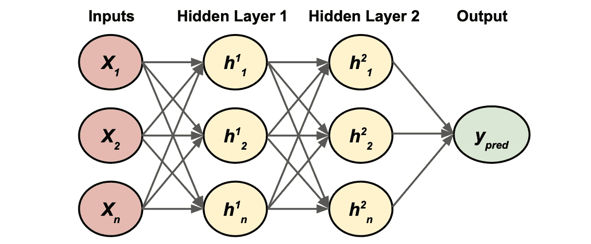
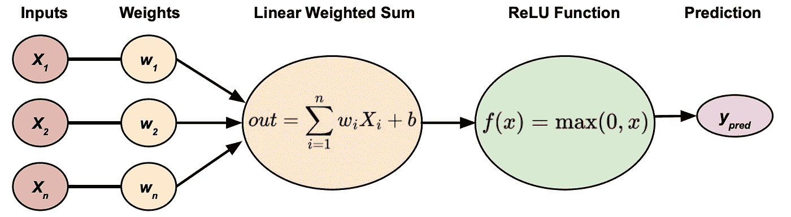
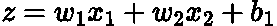
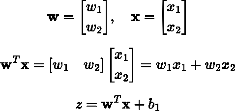
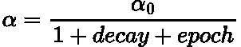
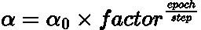
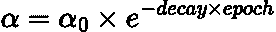

# 将超参数调整应用于神经网络

> 原文：[`towardsdatascience.com/hyperparameter-tuning-neural-networks-101-ca1102891b27`](https://towardsdatascience.com/hyperparameter-tuning-neural-networks-101-ca1102891b27)

## 如何通过调整超参数来提高神经网络的“学习”，并附带 Python 示例

 [Egor Howell](https://medium.com/@egorhowell?source=post_page-----ca1102891b27--------------------------------)

·发布在 [Towards Data Science](https://towardsdatascience.com/?source=post_page-----ca1102891b27--------------------------------) ·9 分钟阅读·2023 年 11 月 18 日

--

神经网络图标由 Vectors Tank — Flaticon 创建。神经网络图标。[`www.flaticon.com/free-icons/neural`](https://www.flaticon.com/free-icons/neural-network)

# 背景

在我之前的帖子中，我们讨论了[***神经网络***](https://medium.com/gitconnected/intro-perceptron-architecture-neural-networks-101-2a487062810c)如何预测和从数据中学习。负责这一过程的有两个步骤：***前向传播***和后向传播，也称为[***反向传播***](https://en.wikipedia.org/wiki/Backpropagation)。你可以在这里了解更多：

 ## 前向传播与反向传播：神经网络 101

### 通过手工和使用 PyTorch 代码解释神经网络如何“训练”和“学习”数据中的模式

towardsdatascience.com

本文将深入探讨如何优化“学习”和“训练”过程，以提高模型的性能。我们将覆盖的领域包括计算改进和***超参数调整***，以及如何在 PyTorch 中实现！

但是，在所有这些好东西之前，让我们快速回顾一下神经网络的基本知识！

# 快速回顾：什么是神经网络？

神经网络是大型数学表达式，试图找到能够将一组输入映射到其对应输出的“正确”函数。下面展示了一个神经网络的例子：

一个基本的双隐层多层感知器。图示由作者提供。

每个隐藏层神经元执行以下计算：

每个神经元内部进行的过程。图示由作者提供。

+   ***输入：*** *这些是我们数据集的特征。*

+   ***权重：*** *用于缩放输入的系数。算法的目标是通过* ***梯度下降****找到最优系数。*

+   ***线性加权和：*** *将输入和权重的乘积求和，并加上一个偏置/偏移量项，* ***b****.*

+   ***隐藏层：*** *多个神经元用于学习数据集中的模式。上标表示层数，下标表示该层中的神经元编号。*

+   ***箭头：*** *这些是从相应输入（无论是特征还是隐藏层输出）到网络的权重。我在图示中省略了它们的明确标注，以保持图示的整洁。*

+   ***ReLU 激活函数******:*** *最受欢迎的* ***激活函数****，因为它计算上高效且直观。有关更多信息，请* *点击这里**。*

> 我在这里[链接了一个精彩的视频](https://www.youtube.com/watch?v=0QczhVg5HaI)，解释了神经网络如何学习任何东西，以提供更多背景！

如果你想要更全面的介绍，可以查看我之前的帖子：

 [## 介绍，感知器与架构：神经网络 101]

### 神经网络及其构建块简介

levelup.gitconnected.com](https://levelup.gitconnected.com/intro-perceptron-architecture-neural-networks-101-2a487062810c?source=post_page-----ca1102891b27--------------------------------)

# 计算改进

使神经网络如此普遍可用的主要优化技术可能是并行处理。

> 数据量也是神经网络在实际应用中如此有效的主要原因之一。

每一层都可以表示为一个大型矩阵，其包含相关的输入、权重和偏置。例如，考虑一个神经元的基本输出：

神经元的线性输出。公式由作者用 LaTeX 表示。

在这里，***x*** 是输入，***w*** 是权重，***b*** 是偏置，***z*** 是最终输出。上述公式可以重写为矩阵形式：

神经元输出的向量化实现。公式由作者用 LaTeX 表示。

如果没有这种向量化实现，训练神经网络的运行时间将会非常巨大，因为我们需要依赖循环。在这种情况下，我们将逐个乘以每个权重和输入，然后相加得到***z***。而使用向量化实现，这可以在一个整体步骤中完成。

> 这里有一篇很好的文章链接在此和[一个视频在这里](https://www.youtube.com/watch?v=kkWRbIb42Ms)，比较了向量化方法与使用循环的运行时间。

大多数深度学习框架，如[***PyTorch***](https://pytorch.org/)和[***TensorFlow***](https://www.tensorflow.org/)，在后台为你处理这些问题，所以你不需要太担心！

# 超参数

## 概述

神经网络架构和参数的搜索空间是难以想象的巨大，甚至可以说是无限的。存在一些库可以帮助你调整参数，比如***hyperopt***、[***optuna***](https://optuna.org/)或普通的[***sci-kit learn***](https://scikit-learn.org/stable/)。

> 还有很多其他的库，请查看此处的列表。

它们的处理方法不同，有的使用简单的网格搜索或随机搜索，而其他的则采用更复杂的方法，如[***贝叶斯优化***](https://pub.towardsai.net/conditional-probability-and-bayes-theorem-simply-explained-788a6361f333)或甚至像***遗传算法***这样的进化算法。一种方法并不优于另一种，最终取决于你如何设计搜索空间和计算资源。

了解你理想的参数是很重要的，以避免在不必要的值上浪费大量时间，并快速收敛。现在让我们来看看一些你应该关注的主要内容！

## 隐藏层数量

有一种叫做[***普遍逼近定理***](https://en.wikipedia.org/wiki/Universal_approximation_theorem)的理论，基本上说单层隐藏层神经网络可以学习任何函数，只要它有足够的神经元。

然而，拥有一个层中大量神经元并不是理想的，最好还是有几个层，每层中神经元较少。这样做的假设是每层学习新的东西，且在更细粒度的水平上进行学习。相比之下，单层隐藏层网络需要一次性学习数据集的每一个细节。

一般来说，几个隐藏层通常已经足够。例如，在[MNIST 数据集](https://en.wikipedia.org/wiki/MNIST_database)上，一个具有一个隐藏层和几百个神经元的模型具有[97%准确率](https://paperswithcode.com/sota/image-classification-on-mnist)，但一个具有两个隐藏层且神经元数量相同的网络具有[98%准确率](https://paperswithcode.com/sota/image-classification-on-mnist)。

> MNIST 数据集包含许多手写数字的例子。

当然，像任何超参数一样，我们应该应用一些调优过程，通过不同的层数与其他超参数的组合进行迭代。

## 层中的神经元数量

输入层和输出层的神经元数量是预定义的。输入层的大小必须等于数据集中的特征数量。如果你的数据集有 50 个特征，那么你的输入层将有 50 个神经元。同样，输出层需要适合问题。如果你在预测房价，那么输出层将只有 1 个神经元。然而，如果你在尝试分类单个数字，如 MNIST 数据集中的情况，那么你需要 10 个输出神经元。

对于隐藏层，你可以稍微放开一点！神经元数量的搜索空间是巨大的。然而，最好是略微过度使用神经元数量，并使用像[***早停***](https://en.wikipedia.org/wiki/Early_stopping#:~:text=In%20machine%20learning%2C%20early%20stopping,training%20data%20with%20each%20iteration.)这样的技术来防止过拟合。

另一个关键想法是确保每层都有足够的神经元以具有*表示能力*。如果你试图预测一个 3D 图像，2 个神经元只能在 2D 中工作，因此会丢失一些关于信号的信息。

## 学习率

学习率决定了算法收敛到最优解的速度，因为它负责反向传播过程中的步长。这可能是训练神经网络时最重要的超参数之一。太高会导致学习发散，太低则算法会需要很长时间才能收敛。

我通常会在***0.001***到***1***之间的广泛搜索空间中调整我的学习率，这被视为文献中最常见的*传统*学习率。

找到最佳学习率的最佳方法之一是通过***学习率调度***。该计划随着训练的进展减少学习率，因此在接近最优点时采用更小的步长。让我们来详细分解一些常见的：

**基于时间的衰减：**

学习率随着时间的推移以一定的速度下降。

基于时间的衰减。作者在 LaTeX 中的方程。

在这里，***α*** 是学习率，***α_0*** 是初始学习率，*decay* 是衰减率，***epoch*** 是迭代次数。

> 一个 epoch 是神经网络使用所有训练数据进行的一个训练周期。

**步长衰减：**

学习率在经过一定数量的训练 epoch 后按某一因子减少。

步长衰减。作者在 LaTeX 中的方程式。

其中 ***factor*** 是学习率减少的因子，***step*** 是学习率应减少的 epoch 数量。

**指数衰减：**

学习率将在每个 epoch 中以指数方式减少。

指数衰减。作者在 LaTeX 中的方程式。

**其他：**

还有许多其他学习率调度方法，如 *性能调度*、*1cycle 调度* 和 *功率调度*。重要的是要记住，没有一种调度方法比另一种更好，最好尝试几种以确定哪一种最适合你的模型和数据。

## 批量大小

在训练神经网络时，常见的梯度下降变体有三种：

+   **批量梯度下降****:** 使用整个训练数据集来计算损失函数的梯度。这是最稳健的方法，但对于大数据集来说，计算上不具可行性。

+   [**随机梯度下降**](https://realpython.com/gradient-descent-algorithm-python/#:~:text=Stochastic%20gradient%20descent%20is%20an,used%20in%20machine%20learning%20applications.)**:** 使用单个数据点来计算损失函数的梯度。这种方法是最快的，但估计可能会有噪声，收敛路径也可能较慢。

+   **小批量梯度下降****:** 使用训练数据集的一个子集来计算损失函数的梯度。批量的大小有所变化，并取决于数据集的大小。这是批量和随机梯度下降的两者优点的结合。

关键在于找到适合执行小批量梯度下降的最佳批量大小。建议使用尽可能大的批量大小，这些批量可以适配到计算机的 GPU 内存中，因为它们能并行计算。

## 迭代次数

这是 epoch 的数量，即我们为神经网络执行的所有前向和反向传播的总次数。实际上，最好使用提前停止，并将迭代次数设置得很高。这可以避免过早终止学习的可能性。

## 激活函数

大多数网络使用 ***ReLU***，主要由于其计算效率，但也有其他激活函数。我之前的帖子总结了主要的激活函数及其优缺点：

 ## 激活函数与非线性：神经网络 101

### 解释为什么神经网络可以学习（几乎）任何东西和一切

[towardsdatascience.com

选择的激活函数对于输出层很重要，以确保你的预测符合问题的上下文。例如，如果你在预测概率，则应使用***sigmoid***激活函数。

然而，在我看来，与我们之前讨论的其他超参数相比，在隐藏层中测试不同的激活函数对性能的影响不会太大。

## 其他超参数

还有其他超参数可以调优：

+   ***优化算法*** ***(下篇文章中讨论！)***

+   [***正则化方法***](https://www.analyticsvidhya.com/blog/2018/04/fundamentals-deep-learning-regularization-techniques/) ***(未来讨论！)***

+   [***权重初始化***](https://www.deeplearning.ai/ai-notes/initialization/index.html)

+   ***损失函数***

# Python 示例

以下是一些模板代码，使用 hyperopt 在 PyTorch 中对 MNIST 数据集进行神经网络超参数调优：

作者的 GitHub Gist。

代码可在我的 GitHub 上找到：

 [## Medium-Articles/Neural Networks/hyperparam_tune.py at main · egorhowell/Medium-Articles

### 我在我的中等博客/文章中使用的代码。通过创建一个账户来贡献于 egorhowell/Medium-Articles 的开发…

[github.com](https://github.com/egorhowell/Medium-Articles/blob/main/Neural%20Networks/hyperparam_tune.py?source=post_page-----ca1102891b27--------------------------------)

# 总结与进一步思考

神经网络有很多超参数和无限的架构，这使得找到最佳组合非常困难。幸运的是，像***optuna***和***hyperpot***这样的包可以智能地为我们完成这个过程。通常最需要调整的超参数是隐藏层的数量、神经元的数量和学习率。这些通常在开发神经网络模型时能够带来最显著的效果。通过使用早期停止，训练轮数会变得冗余，而选择的激活函数也通常对性能影响很小。然而，在考虑输入和输出层的结构以及输出层的激活函数时，总是重要的要考虑你试图解决的是什么类型的问题。

# 参考资料与进一步阅读

+   [*Andrej Karpathy 神经网络课程*](https://www.youtube.com/watch?v=i94OvYb6noo)

+   [*PyTorch 网站*](https://pytorch.org/)

+   *另一例手动训练神经网络*

+   [*动手实践机器学习：Scikit-Learn、Keras 和 TensorFlow 第 2 版。奥雷利安·热龙。2019 年 9 月。出版社：O’Reilly Media, Inc. ISBN: 9781492032649*](https://www.oreilly.com/library/view/hands-on-machine-learning/9781492032632/)*

# 另一个事项！

我有一个免费的新闻通讯，[**Dishing the Data**](https://dishingthedata.substack.com/)，每周分享成为更好数据科学家的技巧。没有“空洞的内容”或“点击诱饵”，只有来自实践数据科学家的纯粹可操作见解。

[## Dishing The Data | Egor Howell | Substack](https://newsletter.egorhowell.com/?source=post_page-----ca1102891b27--------------------------------)

### 如何成为更好的数据科学家。点击阅读由 Egor Howell 编写的 Substack 出版物《Dishing The Data》…

[newsletter.egorhowell.com](https://newsletter.egorhowell.com/?source=post_page-----ca1102891b27--------------------------------)

# 与我联系！

+   [**YouTube**](https://www.youtube.com/@egorhowell)

+   [**LinkedIn**](https://www.linkedin.com/in/egor-howell-092a721b3/)

+   [**Twitter**](https://twitter.com/EgorHowell)

+   [**GitHub**](https://github.com/egorhowell)
