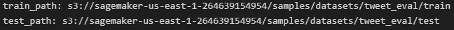
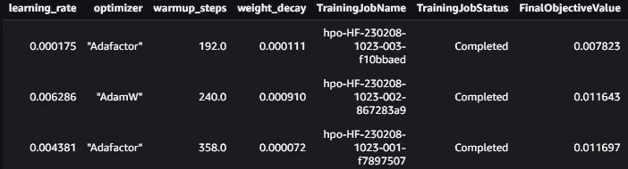
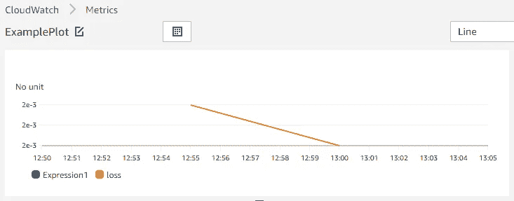
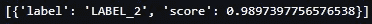

# 使用 AWS Sagemaker SDK 对 HuggingFace 模型进行超参数调整

> 原文：[`towardsdatascience.com/hyperparameter-tuning-of-huggingface-models-with-aws-sagemaker-sdk-f727ac06cf36?source=collection_archive---------7-----------------------#2023-01-30`](https://towardsdatascience.com/hyperparameter-tuning-of-huggingface-models-with-aws-sagemaker-sdk-f727ac06cf36?source=collection_archive---------7-----------------------#2023-01-30)

## 使用 HuggingFace Estimator 和 Sagemaker Tuner 优化深度神经网络

 [Ciarán Cooney](https://ciaranfcooney.medium.com/?source=post_page-----f727ac06cf36--------------------------------)

·

[关注](https://medium.com/m/signin?actionUrl=https%3A%2F%2Fmedium.com%2F_%2Fsubscribe%2Fuser%2Fc6421cc0e5d6&operation=register&redirect=https%3A%2F%2Ftowardsdatascience.com%2Fhyperparameter-tuning-of-huggingface-models-with-aws-sagemaker-sdk-f727ac06cf36&user=Ciar%C3%A1n+Cooney&userId=c6421cc0e5d6&source=post_page-c6421cc0e5d6----f727ac06cf36---------------------post_header-----------) 发表在 [Towards Data Science](https://towardsdatascience.com/?source=post_page-----f727ac06cf36--------------------------------) ·8 分钟阅读·2023 年 1 月 30 日

--

图片来源于 pexels.com ([`www.pexels.com/photo/person-holding-volume-knob-1345630/`](https://urldefense.com/v3/__https:/www.pexels.com/photo/person-holding-volume-knob-1345630/__;!!MjIf2fY!myN_3VIbtds_D5dJELsjpVxU_DWxOfCYWeJ5xf3jHZaMREVimOZ7tDN0hKn1VEzEFG4JFDzJp_GlVhgBCv1M6Q$))

# 介绍

即使在巨大的预训练神经网络时代，超参数调优仍然提供了最大化模型在特定下游任务中性能的机会。微调，就像从头开始训练一样，需要一组合理的初始超参数，以实现高效且最优的训练，因此找到有效的调优方法是深度学习拼图中的重要一环。

在使用 HuggingFace 上的一些大型预训练模型时，比如 [BERT](https://huggingface.co/bert-base-uncased)、[T5](https://huggingface.co/t5-base)、[wav2vec](https://huggingface.co/facebook/wav2vec2-large-960h-lv60-self) 或 [ViT](https://huggingface.co/google/vit-base-patch16-384)，超参数调优是一个需要认真考虑的重要概念。虽然很容易认为这些模型的大部分潜力已经通过大规模预训练被挖掘，但学习率、预热步骤数、权重衰减和学习率调度器类型等超参数可以对微调任务的最终目标产生显著影响。

幸运的是，有几种策略用于搜索最佳超参数配置（例如，网格搜索或贝叶斯搜索），它们在方法上的复杂程度各不相同。此外，深度学习框架和云服务提供商正越来越多地帮助从业者将超参数调优集成到他们的机器学习工作流程中。其中之一是亚马逊 Web 服务（AWS）的 Sagemaker [HyperparameterTuner](https://sagemaker.readthedocs.io/en/stable/api/training/tuner.html)。在本文中，我将对如何使用 Sagemaker 微调 HuggingFace 转换器进行代码演示，使用其超参数调优器和 Sagemaker HuggingFace 估算器。

笔记本和脚本可以在 [这里](https://github.com/cfcooney/sagemaker_sdk_examples/tree/main/hyperparameter_tuning) 获取，它们是一个 [仓库](https://github.com/cfcooney/sagemaker_sdk_examples) 的一部分，该仓库旨在演示 Sagemaker 训练、评估和部署深度学习模型的实用性。

# 超参数调优器和 HuggingFace 估算器

Sagemaker 的 HyperparameterTuner 使得运行超参数任务变得易于维护和具有成本效益。该类接受一个 Sagemaker [估算器](https://sagemaker.readthedocs.io/en/stable/api/training/estimators.html) —— 这是在 AWS 中运行机器学习训练任务的基础类 —— 并根据用户提供的参数配置调优任务。用户可以指定调优策略、要最大化或最小化的指标、要搜索的超参数范围以及其他几个参数。你可以像使用标准估算器一样调用 `.fit()`，并且在训练完成后，它还提供了部署功能。

我将演示如何使用 HyperparameterTuner 以及 Sagemaker HuggingFace Estimator。这是一个用于在 AWS 上处理 HuggingFace 模型的定制估算器。在这个示例中，我将对 [DistilBERT](https://huggingface.co/docs/transformers/model_doc/distilbert) 进行微调，以便在 [tweet_eval](https://huggingface.co/datasets/tweet_eval#licensing-information) 数据集上完成情感分类任务。该数据集在 [Creative Commons Attribution 3.0 Unported License](https://groups.google.com/g/semevaltweet/c/k5DDcvVb_Vo/m/zEOdECFyBQAJ) 下提供。

# 跟随代码

在一些导入之后，我们需要设置一个 Sagemaker 会话，并初始化一个可以读写的 S3 存储桶。Sagemaker 中的 [session](https://sagemaker.readthedocs.io/en/stable/api/utility/session.html) 是一个非常方便的类，利用 Sagemaker 通常使用的资源和实体；例如端点和 S3 中的数据。如果不指定存储桶，会话将分配一个默认存储桶。

初步管理完成后，接下来要做的是获取数据。

## 数据

为了演示如何使用 HuggingFace 估算器进行超参数调整，我们将使用 [tweet_eval](https://huggingface.co/datasets/tweet_eval#licensing-information) 数据集，并直接从数据集库下载它。

加载数据集。

在经过一些标记化和处理步骤后，我们需要将数据集转换为张量，然后将训练和测试集存储在我们为 Sagemaker 会话定义的存储桶中。

幸运的是，HuggingFace 数据集和 Sagemaker 使得保存数据变得相对简单，因为数据集对象提供了一个 `save_to_disk()` 方法，允许我们传递一个文件系统参数，该参数负责将数据移动到 S3，使用 `s3fs.S3FileSysteM`。

使用 save_to_disk() 方法将数据集存储到 S3。

现在我们已经将训练和测试数据存储在一个 S3 位置，训练作业可以访问它。

训练和测试集的 S3 位置。图片由作者提供。

## 超参数设置

在运行调整作业之前，我们需要考虑要优化的超参数以及我们认为合适的值范围。通过调整优化的常见超参数包括学习率、权重衰减、丢弃概率，甚至是结构参数，如神经网络中的层数或池化策略。在我展示的场景中，基础模型本身甚至可以作为一个超参数进行调整，因为我们可以加载多个 HuggingFace 模型进行比较。

但是，在这个示例中，我们将微调 DistilBERT，调整四个超参数。它们是：

+   学习率

+   预热步骤数

+   优化器

+   权重衰减

## 初始化估算器和调整器

在初始化调优作业之前，我们需要初始化我们的估算器。估算器是 Sagemaker 中一个处理端到端训练和部署任务的类。HuggingFace 估算器允许我们通过使用专门为此任务开发的预构建 Docker 容器，在 Sagemaker 训练环境中运行自定义的 HuggingFace 代码。

我们通过 `entry_point` 参数将训练脚本传递给估算器。我们还传递了几个附加参数来配置环境、包版本以及实例设置。传递给估算器的 `hyperparameters` 参数不包含要调节的参数，而是要传递给我们训练脚本的参数。

初始化 HuggingFace 估算器。

训练脚本 `training_script.py` 包含我们用于微调 DistilBERT 的代码，[点击这里](https://github.com/cfcooney/sagemaker_sdk_examples/blob/main/hyperparameter_tuning/scripts/training_script.py)。HuggingFace 提供了一个 `Trainer` 类，几乎处理了所有的训练设置和过程，使用这种方法进行调优的示例可以在 [这里](https://github.com/cfcooney/sagemaker_sdk_examples/blob/main/hyperparameter_tuning/tuning_with_hf_trainer.ipynb) 找到。然而，这并不总是理想的，直接控制训练循环有其优势。因此，我为此任务在 PyTorch 中编写了一个 [自定义训练循环](https://github.com/cfcooney/sagemaker_sdk_examples/blob/main/hyperparameter_tuning/scripts/training_script.py)。

如果有帮助的话，可以查看自定义训练循环，但这里有几个代码片段展示了数据加载器和模型训练。

用于训练集的 Pytorch 数据加载器。

在原生 Pytorch 中进行训练循环。

下面的代码片段展示了我们超参数范围的配置。Sagemaker 调优器提供了一套用于表示参数范围的类。`ContinuousParameter` 允许我们设置一个范围，在这个范围内搜索连续值。在这里，它用于学习率和权重衰减。`IntegerParameter` 提供了相同的功能用于整数，我们用它来设置预热步骤。最后，`CategoricalParameter` 允许我们传递一个变量列表进行调节——在这里，它用于优化器类型。

调优器还需要一个目标指标和目标类型——即调节模型的目标以及我们希望调整的方向。`metric_definitions` 包含一个或多个指标的名称，以及用于从 Cloudwatch 日志中提取指标的正则表达式（这是 Sagemaker SDK 的一个常见功能）。

定义超参数范围和目标指标。

现在我们可以在开始调优作业之前定义`HyperparameterTuner`。除了 HuggingFace 估算器、度量参数和超参数范围外，我们还需要设置最大作业数量和希望运行的并行作业数量。这使得 Sagemaker 调优器非常出色且易于使用。然后，我们调用`tuner.fit()`以启动调优作业。

初始化 HyperparameterTuner 并调用 .fit() 开始调优。

## 比较调优后的超参数

调优作业结束后，我们得到了调优后的超参数。调优器附带一个`tuner.analytics()`方法，用于在 pandas 数据框中显示汇总结果。FinalObjectiveValue 是我们在配置调优作业时建立的损失指标。

调优器分析结果数据框。图片作者提供。

最佳超参数是：

+   学习率 = 0.000175

+   优化器 = Adafactor

+   热身步数 = 192

+   权重衰减 = 0.000111

…对结果的初步观察表明，学习率可能是最重要的因素。

当然，我们可以直接从数据框绘制结果，但还有另一种方法。从 Sagemaker 控制台，我们可以点击训练和超参数调优作业标签。从那里，我们可以找到已完成的作业并点击`View algorithm metrics`链接。这将带我们到 AWS CloudWatch，在那里我们可以看到各种交互式图表，并对调优器返回的数据执行查询。下图是一个示例折线图，显示了两个周期的测试损失。

AWS CloudWatch。图片作者提供。

现在我们可以查看结果，我们有几种使用调优值的选项。首先，我们可以简单地将这些参数训练的模型作为最终推理模型。其次，我们可以使用最佳参数执行更长时间的训练，以改善我们的模型。第三，我们可以根据这些结果重置超参数范围，并运行另一个调优作业以获得更细致的结果。

目前，我只是打算使用训练作业得到的最佳模型进行部署和推理。

## 部署端点并预测

要选择最佳模型，我们的调优器对象具有`best_estimator()`方法。在初始化了性能最佳的模型后，将其部署到 Sagemaker 端点非常简单，使用`deploy()`方法即可。在这里，我指定了用于推理的实例数量（1）以及实例类型（加速计算用的‘ml.g4dn.xlarge’）。部署可能需要几分钟完成，完成后您将在 Sagemaker 上托管模型端点。

部署模型。

部署模型后，我们可以对一些输入文本的情感进行预测。如果我输入句子“Best thing ever!” 我预计会得到一个非常高置信度的正面情感预测。确实如此。然而，输出标签被泛泛地设置为‘LABEL_0’和‘LABEL_1’，因此我编写了一些后处理代码，以给出更有意义的输出，你可以看到我们得到了一个‘positive’的结果。

进行预测。

使用部署的模型进行预测。图片来源：作者。

预测一个类别标签。

将预测结果格式化为可读形式。图片来源：作者。

最后，如果我们不再需要使用该模型进行推理，我们可以删除端点，使其不再托管（你的模型工件仍然保存在 S3 中）。

当所有任务完成时，删除端点。

总的来说，我使用 Sagemaker HyperparameterTuner 的体验非常积极，但也有一些潜在的缺点需要考虑。与所有云服务一样，需要注意的一个方面是成本。这对于这种服务尤其重要，因为它涉及到多个作业，包括并行化和 GPU。另一个潜在的缺点是 HyperparameterTuner 和 Sagemaker SDK 的高层次性质。有些人可能希望对程序有更多的控制，因此类似 boto3 的工具可能更合适。

# 结论

本文展示了如何在 AWS Sagemaker 中使用 HuggingFace 估算器进行超参数调优。希望代码演示能展示出使用 Sagemaker SDK 调优超参数的简单程度，并且使用它进行模型开发能获得很多好处。用于超参数调优的 Jupyter Notebooks 可以在[这里](https://github.com/cfcooney/sagemaker_sdk_examples/blob/main/hyperparameter_tuning/hyperparameter_tuning.ipynb)和[这里](https://github.com/cfcooney/sagemaker_sdk_examples/blob/main/hyperparameter_tuning/tuning_with_hf_trainer.ipynb)找到。Sagemaker 示例的主要 GitHub 仓库在[这里](https://github.com/cfcooney/sagemaker_sdk_examples)。
