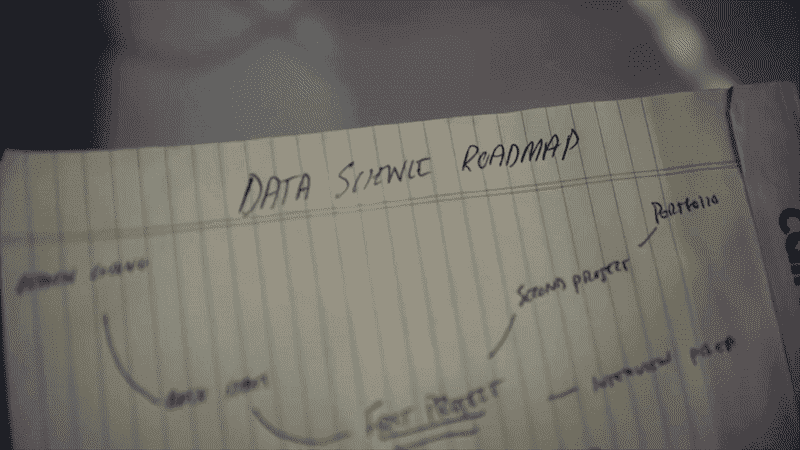
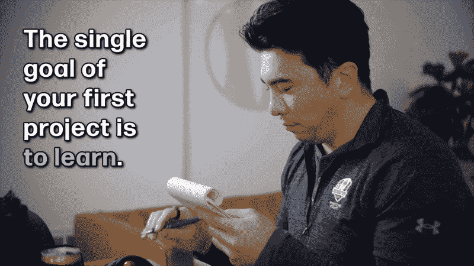
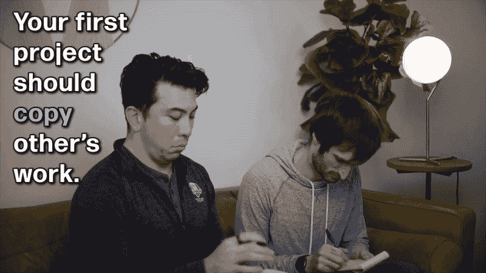
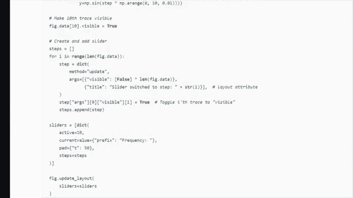

# 克服你的第一个数据科学项目的 6 个初学者友好的技巧

> 原文：[`towardsdatascience.com/ideas-how-start-data-science-project-when-beginner-9ed03b7628ca`](https://towardsdatascience.com/ideas-how-start-data-science-project-when-beginner-9ed03b7628ca)

图片由 [Tatiana Syrikova](https://www.pexels.com/@tatianasyrikova/) 提供，来自 [Pexels](https://www.pexels.com/photo/from-above-crop-female-typing-on-keyboard-of-computer-near-tea-on-planner-at-home-3975586/)

## 我将引导你了解一些能帮助你打破数据科学初体验难关的见解！最后一个见解有可能显著改变你整个职业生涯的路径。

 [Ken Jee](https://medium.com/@kenneth.b.jee?source=post_page-----9ed03b7628ca--------------------------------)

·发表于 [Towards Data Science](https://towardsdatascience.com/?source=post_page-----9ed03b7628ca--------------------------------) ·阅读时间 7 分钟·2023 年 12 月 17 日

--

# 目录

+   #1: 你第一个项目的真正目的：这不是为了留下印象

+   #2: 为什么你的第一个项目不需要有创意

+   #3: 复制、调整、学习：令人惊讶的技能发展策略

+   #4: 你必须克服逆境

+   #5: 克服配置工具时的困难

+   #6: 采纳成长心态是成功的关键

+   附录

进行你的第一个项目可能是你数据科学旅程中最重要的里程碑。然而，知道这个过程的第一步往往充满挑战。我在这里是为了让你知道其实不必如此。

在这篇文章中，我将与你分享开始第一个项目所需了解的内容。

我的目标是澄清你可能对如何开始第一个数据科学项目的误解，并让你有信心尽快开始。

作者提供的图片

这些是六个关键见解，可以帮助你突破对项目的顾虑。最后一个见解有可能彻底改变你整个职业生涯的轨迹。

让我们深入探讨吧！

# #1: 你第一个项目的真正目的：这不是为了留下印象

为什么要做一个项目呢？

是为了向潜在雇主展示你的技能吗？还是在与 LinkedIn 上的人建立联系时作为谈资？

实际的原因并不集中在这些概念上。

***你初次项目的主要目标是学习。***

作者提供的图片

没有必要感到压力去获得反馈或公开分享你的工作。很多人仅仅因为他们认为第一个项目不够好或者不够有趣而迷失方向。

猜猜怎么了？

只要它帮助你学习，就不重要它有多么令人印象深刻。它也不必非常令人印象深刻或复杂才能教会你一些东西。即使是看似简单的项目，也能让初学者掌握和熟悉基本概念、技术或方法论，比如基本的数据处理、可视化或入门统计分析。因此，这为未来的努力奠定了坚实的基础。

# #2: 为什么你的第一个项目不需要有创意

我在网上分享了很多关于项目的信息。你可能听过我说，一个好的项目应该是富有创意和有趣的。如果你有兴趣阅读我关于这方面的工作，可以查看下面的附录。

虽然对于你展示给潜在雇主的项目来说，这是真的，但***你不必在你的第一个项目中展现任何创意***。

这可能看起来很无聊，但我的第一个项目就是泰坦尼克数据集。而且，天哪，我的分析做得非常糟糕。不过，我从那个练习中学到了很多关于分类和特征工程的知识。

我个人分析过许多最基本的数据集，包括 Palmer Penguins 数据集、MNIST 数据集和 Kaggle 上的房地产数据集。

这些方法对掌握新技能非常有效，并且非常适合你学习旅程早期的项目。

# #3: 复制、调整、学习：技能发展的惊人策略

在你的第一个项目中，你***应该***复制其他人的工作。

作者提供的图片

你没听错。

为了澄清，***你是为了学习而进行复制***，你不应当为别人做过的事情而获得荣誉。你也应该明确地不分享你所复制的工作。

一种非常有效的早期学习方法是输入和执行他人编写的代码。一旦执行，进行实验以观察结果并探索结果。

我更喜欢将这种方法应用于图表。由于图表的视觉特性，当调整代码时可以立即看到变化，提供了清晰的进展或变化的指示。

作者提供的图片

还记得我在第一个项目中使用的泰坦尼克数据集吗？如果你想找一些东西来跟随学习，我制作了一个记录我处理该数据集过程的视频，链接在下面的附录中。

作者提供的图片

# #4: 你必须克服逆境

这并不令人意外，但第一次项目通常是有挑战性的。你会遇到障碍、错误，并且感到困惑。

不幸的是，许多人在面对这种逆境后选择了放弃。我几乎普遍发现我们在数据科学中会遇到这些挑战。***遇到困境是常规安排的一部分。***

越早适应这一点并学会暂时离开然后再回到工作中，你的学习旅程就会越早取得进展。

我注意到，散步或离开代码时，常常会激发出自发的解决方案或全新的视角。

这些是你在遇到困境并感觉无法取得任何进展时可以做的，也应该做的事情。

你会惊讶于自己的大脑在你漫步时能够重新整理出什么，当你不刻意集中精力于工作时。

图片来源：作者

此外，我们永远无法为 Medium 算法鼓掌。 如果你发现这篇文章有用，请随意点赞。

# #5：克服配置工具时的设置难题

开始的最大障碍之一是使所有数据科学工具在本地计算机上正常工作。

当我刚开始时，配置本地环境所花的时间比我完成整个项目的时间还要长。

幸运的是，有像 Anaconda 这样的工具可以让你的本地环境正常工作，但你仍然会遇到一些配置问题，比如获取正确的包。

幸运的是，随着基于网页的 IDE 的进步，你可以完全避免这个步骤。在你开始第一个项目时，可以使用像 Kaggle、Google Colab 和 DeepNote 这样的免费平台，而无需技术负担。

从本质上讲，你登录这些网站，创建一个实例，就可以使用 Jupyter notebook，而无需安装任何包或解决其他相关问题。

这彻底改变了我顺利启动第一个项目的方式。

# #6：采用成长型思维模式是成功的关键

也许开始数据科学和项目的最重要的事情就是你的心态。

仅仅因为一个项目现在很困难，并不意味着你不够优秀。这意味着你还不够擅长数据科学。

当我回去重新做前面提到的 Titanic 数据集时，看到自己有了如此大的进步令人惊讶。我清晰地记得第一次做时有多么困难，而现在我甚至能自信地带领其他人完成那次分析。我的能力、天赋和对这些项目的舒适度发生了令人难以置信的变化。

***这种理解你随着时间的推移可以提高的概念被称为成长型思维模式***。我在过去的一些文章中详细讨论过这个概念，并在下面的附录中添加了链接。

当个人涉足一个新的领域，尤其是像数据科学这样思维要求高的领域时，大多数人开始时对这些技能并不熟练。如果你遇到困难，应该把这些难题视为成长的机会，而不是障碍。你可以选择那些稍微推动你边界但通过努力可以实现的项目。

此外，你应该集中精力于理解概念和解决问题的努力，而不是纠结于即时结果。为了实现这一点，将复杂的问题分解为更小、可管理的步骤，并在每个阶段庆祝你的进步。

我希望这对你的第一个项目有所帮助。祝你在数据科学之旅中好运。

# 附录

+   关于有趣和创意数据科学项目的更多信息，请查看我写的这篇文章：

 [## 5 个富有创意的数据科学项目，让你的作品集脱颖而出

### 脱颖而出可以通过新颖性、影响力、技能或创造力来实现。在这篇文章中，我重点介绍了一些项目想法……

medium.datadriveninvestor.com](https://medium.datadriveninvestor.com/5-imaginative-data-science-projects-that-can-make-your-portfolio-stand-out-6371802a686d?source=post_page-----9ed03b7628ca--------------------------------)

+   如果你想复制并学习我对 Titanic 数据集的演示，请查看我制作的这个 YouTube 视频：

+   关于我培养成长心态的经历以及我提升学习能力的其他方法，请参考我写的这篇文章：

 [## 学会学习：我如何从愚蠢到终身学习者

### 分解改变我生活的学习基础

medium.com](https://medium.com/@kenneth.b.jee/learning-to-learn-how-i-went-from-dunce-to-life-long-student-3a7c7c98794c?source=post_page-----9ed03b7628ca--------------------------------)

如果你喜欢关于数据科学、机器学习和人工智能的有趣且信息丰富的视频，[请查看我的 YouTube 频道](https://www.youtube.com/@KenJee_ds)，我会提供评论、教程和其他教育视频。

如果你对数据和人工智能领域中的人们如何做出塑造他们世界观和职业生涯的大决策的独特故事感兴趣，[请查看我的播客 Ken’s Nearest Neighbors](https://www.youtube.com/@KNNPodcast)。

要获取关于我内容创作的每周更新以及数据科学行业的额外学习资源，[请订阅我的新闻通讯，*Data Dribble!*](https://www.kennethjee.com/newsletter)
