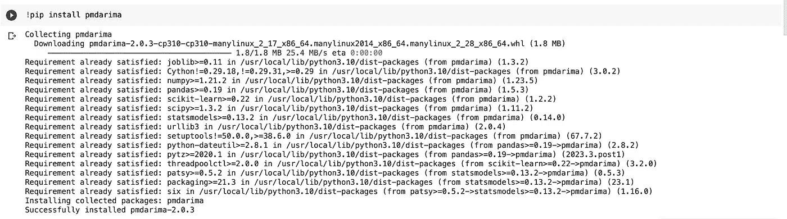
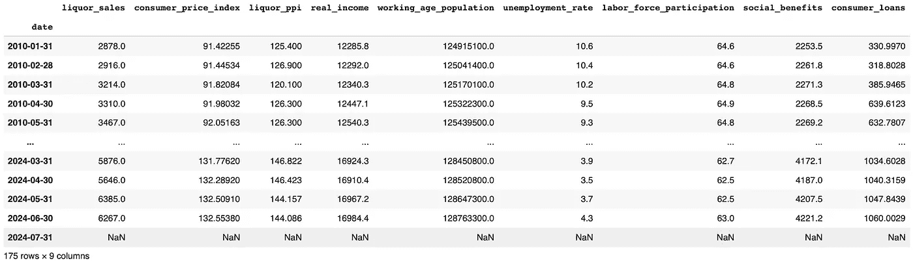
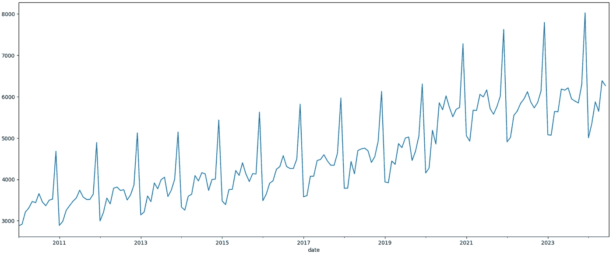
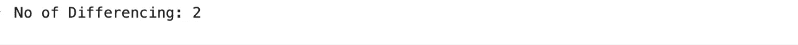
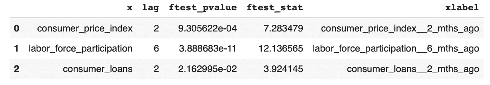
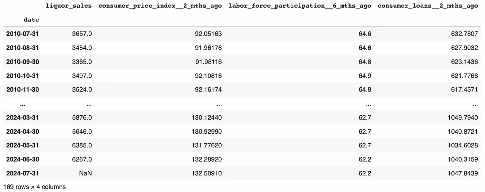
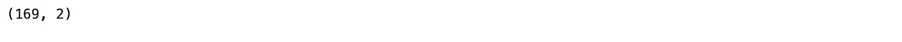
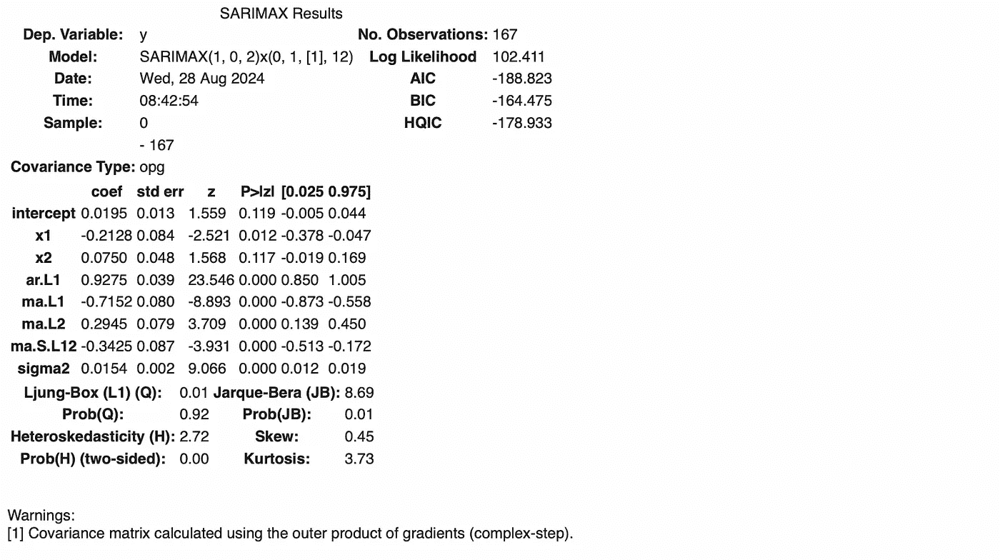
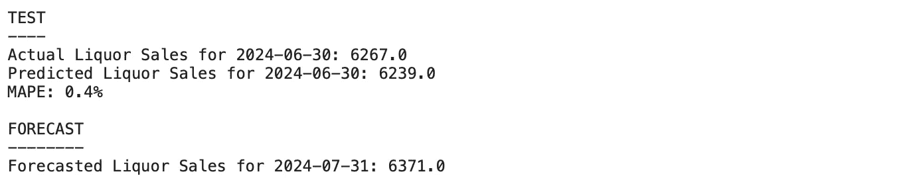

# 识别和利用时间序列预测的领先指标

> 原文：[`towardsdatascience.com/identifying-and-leveraging-leading-indicators-for-time-series-forecasting-using-granger-causality-d0e6fd5e353f?source=collection_archive---------3-----------------------#2023-09-19`](https://towardsdatascience.com/identifying-and-leveraging-leading-indicators-for-time-series-forecasting-using-granger-causality-d0e6fd5e353f?source=collection_archive---------3-----------------------#2023-09-19)

## 使用 Granger 因果关系和 SARIMAX 模型

[](https://medium.com/@afolabi-lagunju?source=post_page-----d0e6fd5e353f--------------------------------)[](https://towardsdatascience.com/?source=post_page-----d0e6fd5e353f--------------------------------) [Afolabi Lagunju](https://medium.com/@afolabi-lagunju?source=post_page-----d0e6fd5e353f--------------------------------)

·

[关注](https://medium.com/m/signin?actionUrl=https%3A%2F%2Fmedium.com%2F_%2Fsubscribe%2Fuser%2Fbbe89de9b4ba&operation=register&redirect=https%3A%2F%2Ftowardsdatascience.com%2Fidentifying-and-leveraging-leading-indicators-for-time-series-forecasting-using-granger-causality-d0e6fd5e353f&user=Afolabi+Lagunju&userId=bbe89de9b4ba&source=post_page-bbe89de9b4ba----d0e6fd5e353f---------------------post_header-----------) 发表在 [Towards Data Science](https://towardsdatascience.com/?source=post_page-----d0e6fd5e353f--------------------------------) ·9 min read·2023 年 9 月 19 日[](https://medium.com/m/signin?actionUrl=https%3A%2F%2Fmedium.com%2F_%2Fvote%2Ftowards-data-science%2Fd0e6fd5e353f&operation=register&redirect=https%3A%2F%2Ftowardsdatascience.com%2Fidentifying-and-leveraging-leading-indicators-for-time-series-forecasting-using-granger-causality-d0e6fd5e353f&user=Afolabi+Lagunju&userId=bbe89de9b4ba&source=-----d0e6fd5e353f---------------------clap_footer-----------)

--

[](https://medium.com/m/signin?actionUrl=https%3A%2F%2Fmedium.com%2F_%2Fbookmark%2Fp%2Fd0e6fd5e353f&operation=register&redirect=https%3A%2F%2Ftowardsdatascience.com%2Fidentifying-and-leveraging-leading-indicators-for-time-series-forecasting-using-granger-causality-d0e6fd5e353f&source=-----d0e6fd5e353f---------------------bookmark_footer-----------)

图片由 [Aron Visuals](https://unsplash.com/@aronvisuals?utm_source=medium&utm_medium=referral) 提供，来源于 [Unsplash](https://unsplash.com/?utm_source=medium&utm_medium=referral)

## 引言

在日常工作中，公司面临着有关调整金融市场、优化供应链操作或制定策略以保持竞争优势的决策。然而，当时间序列模型未能考虑到相互关联的事件或对预测主题施加影响的其他时间序列时，实现高精度预测可能会变得困难。

在本文中，我们将探讨领先指标的概念，如何识别它们，以及如何利用它们来改善时间序列预测。我们将深入了解使用 Python 和来自[联邦储备经济数据](https://fred.stlouisfed.org)的真实数据进行的实际实施。

## 什么是领先指标？

领先指标是帮助预测未来趋势或活动的数据集。一个日常的领先指标示例是突然出现的云层，这可能预示着在接下来一个小时内发生雷暴的可能性。

## 如何识别和利用领先指标

1.  **领域知识**：像所有数据科学项目一样，我们首先要了解我们将要操作的领域。这个过程的一个关键方面是识别可能影响我们想要预测的时间序列的变量或因素。在我们的实际实施中，我们将预测啤酒、葡萄酒和烈酒的销售量ᵈ¹，因此消费者物价指数⁵𝄒ᵈ²、烈酒价格¹𝄒ᵈ³、实际个人收入⁵𝄒ᵈ⁴、工作年龄人口⁵𝄒ᵈ⁵、失业率⁴𝄒ᵈ⁶、劳动参与率⁴𝄒ᵈ⁷、社会福利⁴𝄒ᵈ⁸和消费者贷款²𝄒ᵈ⁹将成为我们的潜在领先指标。

1.  **数据探索与可视化**：接下来，我们使用时间序列分解来分析我们的依赖时间序列及其潜在领先指标的季节性成分。我们的目标是识别领先指标中的峰值或谷值，这些峰值或谷值在我们依赖的时间序列中出现类似/相反的变化之前。需要注意的是，领先指标与依赖时间序列之间的关系可以是正面的也可以是负面的。尽管我们在实施中不会深入探讨这一点，但你可以使用[seasonal_decompose](https://www.statsmodels.org/stable/generated/statsmodels.tsa.seasonal.seasonal_decompose.html)函数来自[stats_model](https://www.statsmodels.org/stable/)来实现这一点。

1.  **统计测试**：在此步骤中，我们通过使用 Granger 因果关系检验来验证我们精心挑选的潜在领先指标对依赖时间序列的影响。

1.  **预处理**：接下来，我们对数据进行缩放，以确保所有特征在相同范围内，然后应用主成分分析（PCA）来消除领先指标之间的多重共线性。

1.  **模型构建：** 最后，我们使用[pmdarima](https://pypi.org/project/pmdarima/)模块中的[auto_arima](http://alkaline-ml.com/pmdarima/modules/generated/pmdarima.arima.auto_arima.html#pmdarima.arima.auto_arima)函数构建我们的 SARIMAX 模型，并将领先指标设置为外生值以及其他参数。

## 什么是格兰杰因果关系？

格兰杰因果关系首次由克莱夫·格兰杰³于 1969 年提出，是一种统计假设检验，用于帮助确定时间序列中的变化是否能预测或“引起”另一时间序列的变化。它已在[statsmodels](https://www.statsmodels.org/stable/generated/statsmodels.tsa.stattools.grangercausalitytests.html)中实现为一个函数。

## 什么是 SARIMAX？

SARIMAX 代表季节性自回归积分滑动平均模型与外生变量。顾名思义，该模型结合了多个组件，如自回归（AR）、滑动平均（MA）、差分（I，即积分）以及外部因素的纳入（“X”部分）——我们将在其中插入领先指标。

## Python 实现

在开始之前，请在[Federal Reserve Economic Data](https://fred.stlouisfed.org)（FRED）创建一个账户，并通过[此链接](https://fredaccount.stlouisfed.org/apikeys)获取 API 密钥。请注意，此产品使用了 FRED® API，但未经圣路易斯联邦储备银行的认可或认证。

我们从安装和加载所需的模块开始。



```py
import requests
import pandas as pd
import numpy as np
import matplotlib.pyplot as plt
from datetime import datetime, timedelta
from pandas.tseries.offsets import MonthEnd
from sklearn.decomposition import PCA
from sklearn.preprocessing import StandardScaler
from sklearn.metrics import mean_absolute_percentage_error
from statsmodels.tsa.stattools import adfuller
from statsmodels.tsa.stattools import grangercausalitytests

from pmdarima import auto_arima
```

接下来，我们将创建一个自定义函数，通过 FRED API 读取数据。

```py
FRED_API_KEY = '__YOUR_API_KEY__'

# Function to read data from FRED API
def get_fred_data(data_id, data_name):
  response = requests.get(f'https://api.stlouisfed.org/fred/series/observations?series_id={data_id}&api_key={FRED_API_KEY}&file_type=json')
  df = pd.DataFrame(response.json()['observations'])[['date', 'value']].rename(columns={'value': data_name})
  df[data_name] = pd.to_numeric(df[data_name], errors='coerce')
  df['date'] = pd.to_datetime(df['date']) + MonthEnd(1)
  df.set_index('date', inplace=True)
  df.index.freq='M'
  return df
```

现在，让我们读取数据并将其存储在 pandas 数据框中。

```py
dependent_timeseries_id = 'MRTSSM4453USN'
dependent_timeseries_name = 'liquor_sales'

potential_leading_indicators = {
    'USACPIALLMINMEI': 'consumer_price_index',
    'PCU44534453': 'liquor_ppi',
    'DSPIC96': 'real_income',
    'LFWA25TTUSM647S': 'working_age_population',
    'UNRATENSA': 'unemployment_rate',
    'LNU01300000': 'labor_force_participation',
    'A063RC1': 'social_benefits',
    'CCLACBM027NBOG': 'consumer_loans',
}
```

```py
# Read dependent time series
timeseries = get_fred_data(dependent_timeseries_id, dependent_timeseries_name)

# Join timeseries with potential leading indicators
for data_id, data_name in potential_leading_indicators.items():
  df = get_fred_data(data_id, data_name)
  timeseries = timeseries.join(df)

# We will start our analysis from Jan-2010
timeseries = timeseries['2010':]

# add month we want to predict liquor_sales 
timeseries = timeseries.reindex(timeseries.index.union([timeseries.index[-1] + timeseries.index.freq]))

timeseries
```



时间序列数据框

对我们的数据进行快速可视化分析显示，我们的因变量时间序列（酒类销售）或多或少地每 12 个月遵循相同的周期。我们将把这个 12 个月的周期作为我们后续时间序列预测中的一个参数。

```py
timeseries[dependent_timeseries_name].plot(figsize=(20,8));
```



酒类销售趋势

在测试因果关系之前，我们需要确认时间序列数据的平稳性。为此，我们将使用增强型迪基-福勒检验。如果我们的数据集未通过此平稳性测试，我们必须采用递归差分方法，直到它符合测试标准。

```py
# create a copy of the timeseries to use for tests. Be sure to exclude the additional row we added in the previous task
timeseries_for_gc_tests = timeseries[:-1]
all_cols = timeseries_for_gc_tests.columns

stationary_cols = []
diff_times = 0

while True:

  # Test for stationarity
  for col in all_cols:
    adf, pvalue, lagsused, observations, critical_values, icbest = adfuller(timeseries_for_gc_tests[col])
    if pvalue <= 0.05:
      stationary_cols.append(col)

  # Difference the time series if at least one column fails the stationary test
  if set(stationary_cols) != set(all_cols):
    timeseries_for_gc_tests = timeseries_for_gc_tests.diff().dropna()
    diff_times += 1
    stationary_cols = []
  else:
    print(f'No of Differencing: {diff_times}')
    break
```



现在，我们已经将时间序列数据加载到 pandas 数据框中，并且通过了平稳性测试，我们将使用格兰杰因果关系检验来测试因果关系。

```py
maxlag = 6 # represents the maximum number of past time periods to look for potential causality. We cap ours at 6 months
leading_indicators = []

for x in all_cols[1:]:
    gc_res = grangercausalitytests(timeseries_for_gc_tests[[dependent_timeseries_name, x]], maxlag=maxlag, verbose=0)
    leading_indicators_tmp = []
    for lag in range(1, maxlag+1):
        ftest_stat = gc_res[lag][0]['ssr_ftest'][0]
        ftest_pvalue = gc_res[lag][0]['ssr_ftest'][1]
        if ftest_pvalue <= 0.05:
            leading_indicators_tmp.append({'x': x, 'lag': lag, 'ftest_pvalue': ftest_pvalue, 'ftest_stat': ftest_stat, 'xlabel': f'{x}__{lag}_mths_ago'})
    if leading_indicators_tmp:
        leading_indicators.append(max(leading_indicators_tmp, key=lambda x:x['ftest_stat']))

# Display leading indicators as a dataframe
pd.DataFrame(leading_indicators).reset_index(drop=True).reset_index(drop=True)
```



酒类销售的领先指标

从我们的测试中，我们可以看到当前月份的酒类销售受到 2 个月前的消费者价格指数ᵈ²和消费者贷款ᵈ¹⁰以及 6 个月前的劳动参与率ᵈ⁷的影响。

既然我们已经建立了领先指标，我们将调整它们的记录，以使它们的滞后数据与其“引起”的当前酒类销售数据位于同一行。

```py
# shift the leading indicators by their corresponding lag periods
for i in leading_indicators:
  timeseries[i['xlabel']] = timeseries[i['x']].shift(periods=i['lag'], freq='M')

# select only the dependent_timeseries_name and leading indicators for further analysis
timeseries = timeseries[[dependent_timeseries_name, *[i['xlabel'] for i in leading_indicators]]].dropna(subset=[i['xlabel'] for i in leading_indicators], axis=0)
timeseries
```



将领先指标表现为酒类销售的 X 变量

接下来，我们将数据缩放，以使所有特征处于相同范围内，然后应用 PCA 方法消除领先指标之间的多重共线性。

```py
# Scale dependent timeseries
y_scaler = StandardScaler()
dependent_timeseries_scaled = y_scaler.fit_transform(timeseries[[dependent_timeseries_name]])

# Scale leading indicators
X_scaler = StandardScaler()
leading_indicators_scaled = X_scaler.fit_transform(timeseries[[i['xlabel'] for i in leading_indicators]])
```

```py
# Reduce dimensionality of the leading indicators
pca = PCA(n_components=0.90)
leading_indicators_scaled_components = pca.fit_transform(leading_indicators_scaled)

leading_indicators_scaled_components.shape
```



最后，我们可以利用 auto_arima 构建我们的 SARIMAX 模型。在此实现过程中，我们将所有参数保持默认，除了季节性标志和每个周期中的期数（m）。

我们将使用截至‘2024-05-31’的时间序列数据训练我们的模型，使用‘2024-06-30’的数据进行测试，然后预测‘2024-07-31’的酒类销售。

```py
# Build SARIMAX model
periods_in_cycle = 12 # number of periods per cycle. In our case, its 12 months
model = auto_arima(y=dependent_timeseries_scaled[:-2], X=leading_indicators_scaled_components[:-2], seasonal=True, m=periods_in_cycle)
model.summary()
```



SARIMAX 模型摘要

```py
# Forecast the next two periods
preds_scaled = model.predict(n_periods=2, X=leading_indicators_scaled_components[-2:])
pred_2024_06_30, pred_2024_07_31 = np.round(y_scaler.inverse_transform([preds_scaled]))[0]

print("TEST\n----")
print(f"Actual Liquor Sales for 2024-06-30: {timeseries[dependent_timeseries_name]['2024-06-30']}")
print(f"Predicted Liquor Sales for 2024-06-30: {pred_2024_06_30}")
print(f"MAPE: {mean_absolute_percentage_error([timeseries[dependent_timeseries_name]['2024-06-30']], [pred_2024_06_30]):.1%}")

print("\nFORECAST\n--------")
print(f"Forecasted Liquor Sales for 2024-07-31: {pred_2024_07_31}")
```



测试和预测结果

通过逐步执行该过程，我们预测了 2024 年 7 月的酒类销售金额，估计的 MAPE 仅为 0.4%。

要进一步提高预测的准确性，我们可以探索添加更多潜在的领先指标并调优所使用的模型。

## 结论

正如我们已探索的那样，领先指标作为未来趋势的早期信号，提供了在完全实现之前预测变化的关键优势。通过利用 Granger 因果性检验等技术来识别领先指标系列，并将其纳入预测模型中，我们可以显著增强预测的准确性和鲁棒性。

## 谢谢阅读

*希望您喜欢本文，并且受到启发尝试应用在您的数据集上。在* [*Medium*](https://medium.com/@afolabi-lagunju) *上关注我获取更多类似数据科学文章，让我们在* [*LinkedIn*](https://www.linkedin.com/in/afolabi-lagunju/)* 上互相连接。*

## 参考文献

[1] 查卢普卡 FJ，格罗斯曼 M，萨弗 H. 价格对酒精消费和与酒精相关问题的影响。酒精研究与健康。2002 年;26(1)：22–34。 PMID: 12154648; PMCID: PMC6683806。

[2] 卡夫, 哈罗德 E. 和克里斯托弗 G. 吉布斯。“限制发薪日贷款对酒类销售的影响。”银行与保险电子期刊（2015）

[3] 格兰杰, C. W. J. “通过计量模型和交叉谱方法研究因果关系。” Econometrica 37，第 3 期（1969 年）：424–38。 [`doi.org/10.2307/1912791`](https://doi.org/10.2307/1912791).

[4] 乔根森 MB，彼得森 J，提格森 LC，劳 CJ，克里斯滕森 AI，贝克尔 U，托尔斯特鲁普 JS。饮酒与劳动市场参与：关于工作、失业、病假和社会福利之间转换的前瞻性队列研究。 Eur J Epidemiol. 2019 年 4 月;34(4)：397–407。 doi: 10.1007/s10654-018-0476-7。 2019 年 1 月 10 日在线发表。 PMID: 30627937; PMCID: PMC6451700。

[5] 尼尔森, 乔恩 P., 美国酒精需求中的经济和人口因素：增长会计分析。实证经济学，第 22 卷，№1，1997 年 3 月 7 日，可在 SSRN 上获取：[`ssrn.com/abstract=4686`](https://ssrn.com/abstract=4686)

[6] Prabal, K. De., 经济低迷期间的饮酒行为：来自美国大萧条期间住房市场波动的新证据。《经济学与人类生物学》，第 43 卷，2021 年 12 月。

## 数据引用

[d1] 美国人口普查局，零售销售：啤酒、葡萄酒和烈酒商店 [MRTSSM4453USN]，取自 FRED，美国圣路易斯联邦储备银行； [`fred.stlouisfed.org/series/MRTSSM4453USN,`](https://fred.stlouisfed.org/series/MRTSSM4453USN,) 2024 年 8 月 28 日。

[d2] 经济合作与发展组织，消费者价格指数（CPI，HICP），COICOP 1999：消费者价格指数：美国总指数 [USACPIALLMINMEI]，取自 FRED，美国圣路易斯联邦储备银行； [`fred.stlouisfed.org/series/USACPIALLMINMEI,`](https://fred.stlouisfed.org/series/USACPIALLMINMEI,) 2024 年 8 月 28 日。

[d3] 美国劳工统计局，行业生产者价格指数：啤酒、葡萄酒和烈酒零售商 [PCU44534453]，取自 FRED，美国圣路易斯联邦储备银行； [`fred.stlouisfed.org/series/PCU44534453,`](https://fred.stlouisfed.org/series/PCU44534453,) 2024 年 8 月 28 日。

[d4] 美国经济分析局，实际可支配个人收入 [DSPIC96]，取自 FRED，美国圣路易斯联邦储备银行； [`fred.stlouisfed.org/series/DSPIC96,`](https://fred.stlouisfed.org/series/DSPIC96,) 2024 年 8 月 28 日。

[d5] 经济合作与发展组织，年度劳动统计：工作年龄总人口：25 至 54 岁美国 [LFWA25TTUSM647S]，取自 FRED，美国圣路易斯联邦储备银行； [`fred.stlouisfed.org/series/LFWA25TTUSM647S,`](https://fred.stlouisfed.org/series/LFWA25TTUSM647S,) 2024 年 8 月 28 日。

[d6] 美国劳工统计局，失业率 [UNRATENSA]，取自 FRED，美国圣路易斯联邦储备银行； [`fred.stlouisfed.org/series/UNRATENSA,`](https://fred.stlouisfed.org/series/UNRATENSA,) 2024 年 8 月 28 日。

[d7] 美国劳工统计局，劳动力参与率 [LNU01300000]，取自 FRED，美国圣路易斯联邦储备银行； [`fred.stlouisfed.org/series/LNU01300000,`](https://fred.stlouisfed.org/series/LNU01300000,) 2024 年 8 月 28 日。

[d8] 美国经济分析局，个人当前转移收入：政府社会福利 [A063RC1]，取自 FRED，美国圣路易斯联邦储备银行； [`fred.stlouisfed.org/series/A063RC1,`](https://fred.stlouisfed.org/series/A063RC1,) 2024 年 8 月 28 日。

[d9] 美国联邦储备委员会，消费者贷款：信用卡及其他循环贷款，所有商业银行 [CCLACBM027NBOG]，取自 FRED，美国圣路易斯联邦储备银行； [`fred.stlouisfed.org/series/CCLACBM027NBOG,`](https://fred.stlouisfed.org/series/CCLACBM027NBOG,) 2024 年 8 月 28 日。
